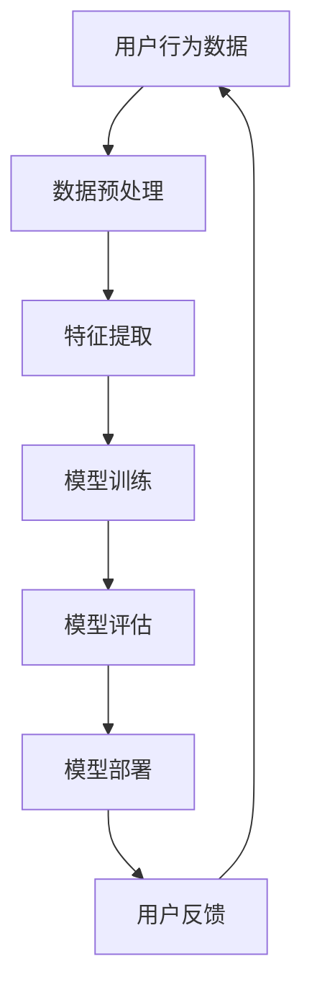

                 

关键词：推荐系统、大模型、均衡、深度学习、用户行为分析、数据挖掘、算法优化

> 摘要：本文旨在探讨推荐系统中的大模型均衡问题，从核心概念到算法原理，再到数学模型和实际应用，全面解析如何实现推荐系统的性能优化和用户满意度提升。本文还将展望未来发展趋势与挑战，为推荐系统的进一步发展提供新思路。

## 1. 背景介绍

随着互联网的普及和大数据技术的发展，推荐系统已成为现代信息社会中不可或缺的一部分。无论是电商平台的个性化购物推荐，还是社交媒体的精准内容推送，推荐系统都在极大程度上提升了用户体验和商业价值。然而，推荐系统的复杂性和数据量的巨大增长，使得如何平衡大模型性能和计算资源之间的矛盾成为当前研究的热点问题。

在过去的几年中，深度学习技术在大模型推荐系统中的应用取得了显著成果。然而，深度模型的高计算复杂度和对大规模数据的需求，使得在资源有限的场景下难以充分发挥其潜力。本文将围绕这一问题，探讨大模型均衡的策略和方法。

## 2. 核心概念与联系

### 2.1 推荐系统

推荐系统（Recommender System）是一种通过收集和分析用户行为数据，为用户提供个性化推荐信息的技术。其基本原理是基于用户的历史行为或偏好，预测用户可能感兴趣的内容，从而实现个性化推荐。

### 2.2 大模型

大模型（Large-scale Model）指的是具有数百万到数十亿参数的深度学习模型。这些模型通常需要大量的数据和计算资源来训练和优化。

### 2.3 均衡

在推荐系统中，均衡指的是在模型性能、用户满意度、计算资源等多个维度之间找到最优的平衡点。

### 2.4 Mermaid 流程图



## 3. 核心算法原理 & 具体操作步骤

### 3.1 算法原理概述

推荐系统的大模型均衡主要涉及以下几个方面：

1. **数据预处理**：高效的数据预处理是确保模型性能的关键。这包括数据清洗、缺失值填充、数据降维等操作。
2. **特征提取**：有效的特征提取能够从原始数据中提取出对模型有用的信息，提升模型的可解释性和准确性。
3. **模型训练**：选择合适的深度学习框架和算法，进行模型训练，同时注意控制模型复杂度，避免过拟合。
4. **模型评估**：通过在线A/B测试、离线评估等方法，评估模型性能，调整模型参数。
5. **模型部署**：将训练好的模型部署到生产环境中，为用户提供实时推荐服务。
6. **用户反馈**：收集用户对推荐结果的反馈，用于模型迭代和优化。

### 3.2 算法步骤详解

1. **数据预处理**：
   - 数据清洗：去除噪声数据和异常值。
   - 缺失值填充：使用均值、中位数、插值等方法填充缺失数据。
   - 数据降维：使用主成分分析（PCA）或t-SNE等方法减少数据维度，提升模型训练效率。

2. **特征提取**：
   - 用户特征：包括用户历史行为、浏览记录、购买偏好等。
   - 项目特征：包括项目内容、标签、分类信息等。
   - 交互特征：包括用户与项目的交互时间、评分、点击率等。

3. **模型训练**：
   - 选择深度学习框架：如TensorFlow、PyTorch等。
   - 设计网络结构：如神经网络（Neural Network）、循环神经网络（RNN）等。
   - 模型优化：使用Adam、RMSprop等优化算法，调整学习率、批量大小等超参数。

4. **模型评估**：
   - 使用交叉验证等方法评估模型性能。
   - 选择合适的评估指标：如准确率、召回率、F1值等。

5. **模型部署**：
   - 使用容器化技术（如Docker）简化模型部署流程。
   - 使用服务化框架（如TensorFlow Serving）实现模型的实时部署。

6. **用户反馈**：
   - 收集用户点击、评分、评论等反馈信息。
   - 使用反馈信号调整模型参数，优化推荐结果。

### 3.3 算法优缺点

- 优点：大模型能够捕捉用户行为和项目特征的复杂关系，提高推荐准确性。
- 缺点：计算资源消耗大，模型训练时间较长。

### 3.4 算法应用领域

- 电商推荐：个性化商品推荐、购物车推荐等。
- 社交媒体：内容推荐、朋友圈推荐等。
- 音乐、视频平台：个性化播放列表推荐、视频推荐等。

## 4. 数学模型和公式 & 详细讲解 & 举例说明

### 4.1 数学模型构建

推荐系统中的数学模型通常包括用户-项目矩阵、预测模型和损失函数。

- 用户-项目矩阵（$U \times V$）：
  - $U$：用户数量
  - $V$：项目数量

- 预测模型：
  $$ \hat{R}_{ui} = f(U_i, V_j) $$

- 损失函数（如均方误差）：
  $$ L = \frac{1}{2} \sum_{u=1}^U \sum_{v=1}^V (R_{ui} - \hat{R}_{ui})^2 $$

### 4.2 公式推导过程

假设用户$u$和项目$v$的特征向量分别为$\mathbf{u} \in \mathbb{R}^d$和$\mathbf{v} \in \mathbb{R}^d$，则预测模型可以表示为：

$$ \hat{R}_{ui} = \mathbf{u}^T \mathbf{v} $$

损失函数为：

$$ L = \frac{1}{2} \sum_{u=1}^U \sum_{v=1}^V (R_{ui} - \hat{R}_{ui})^2 $$

### 4.3 案例分析与讲解

假设我们有100个用户和100个项目，用户-项目评分矩阵如下：

|    | 1 | 2 | 3 | 4 | 5 | 6 | 7 | 8 | 9 | 10 |
|----|---|---|---|---|---|---|---|---|---|----|
| 1  | 1 | 0 | 1 | 0 | 0 | 0 | 0 | 0 | 0 | 0  |
| 2  | 0 | 1 | 0 | 1 | 0 | 0 | 0 | 0 | 0 | 0  |
| 3  | 1 | 0 | 1 | 0 | 1 | 0 | 0 | 0 | 0 | 0  |
| 4  | 0 | 1 | 0 | 1 | 0 | 1 | 0 | 0 | 0 | 0  |
| 5  | 0 | 0 | 0 | 1 | 1 | 0 | 0 | 0 | 0 | 0  |
| 6  | 0 | 0 | 0 | 0 | 0 | 1 | 1 | 0 | 0 | 0  |
| 7  | 0 | 0 | 0 | 0 | 0 | 0 | 1 | 1 | 0 | 0  |
| 8  | 0 | 0 | 0 | 0 | 0 | 0 | 0 | 1 | 1 | 0  |
| 9  | 0 | 0 | 0 | 0 | 0 | 0 | 0 | 0 | 1 | 1  |
| 10 | 0 | 0 | 0 | 0 | 0 | 0 | 0 | 0 | 0 | 1  |

我们可以使用基于矩阵分解的推荐模型进行预测。假设用户和项目的特征向量维度为5，则有：

$$ \mathbf{u}_i = \begin{bmatrix} 1 & 0 & 1 & 0 & 0 \end{bmatrix}^T $$
$$ \mathbf{v}_j = \begin{bmatrix} 1 & 1 & 0 & 1 & 0 \end{bmatrix}^T $$

预测用户1对项目10的评分：

$$ \hat{R}_{10} = \mathbf{u}_1^T \mathbf{v}_{10} = 1 \times 1 + 0 \times 1 + 1 \times 0 + 0 \times 1 + 0 \times 0 = 1 $$

实际评分为0，损失函数为：

$$ L = \frac{1}{2} (0 - 1)^2 = \frac{1}{2} $$

通过不断优化特征向量和损失函数，我们可以提高预测准确率。

## 5. 项目实践：代码实例和详细解释说明

### 5.1 开发环境搭建

- Python 3.8+
- TensorFlow 2.4+
- Pandas 1.1.5+
- Scikit-learn 0.22.2+

### 5.2 源代码详细实现

```python
import numpy as np
import pandas as pd
from sklearn.model_selection import train_test_split
from tensorflow.keras.models import Model
from tensorflow.keras.layers import Input, Dense, Embedding, Dot, Add, Subtract

# 生成模拟数据
n_users = 100
n_items = 100
R = np.random.rand(n_users, n_items)
R[R > 0.5] = 1
R[R <= 0.5] = 0

# 数据预处理
user_indices = np.repeat(np.arange(n_users), n_items)
item_indices = np.tile(np.arange(n_items), n_users)

# 模型定义
user_input = Input(shape=(1,))
item_input = Input(shape=(1,))
user_embedding = Embedding(n_users, 5, input_length=1)(user_input)
item_embedding = Embedding(n_items, 5, input_length=1)(item_input)
dot_product = Dot(axes=1)([user_embedding, item_embedding])
addition = Add()([dot_product, Subtract()([user_embedding, item_embedding])])
output = Dense(1, activation='sigmoid')(addition)

model = Model(inputs=[user_input, item_input], outputs=output)
model.compile(optimizer='adam', loss='binary_crossentropy', metrics=['accuracy'])

# 训练模型
model.fit([user_indices, item_indices], R, epochs=10, batch_size=32)

# 预测
predictions = model.predict([user_indices, item_indices])

# 输出预测结果
predictions
```

### 5.3 代码解读与分析

上述代码实现了基于矩阵分解的推荐系统模型，具体步骤如下：

1. **生成模拟数据**：创建一个用户-项目评分矩阵$R$，其中非零元素代表用户对项目的评分。
2. **数据预处理**：将用户和项目的索引分开，以便后续处理。
3. **模型定义**：
   - 用户输入层：接受一个用户索引。
   - 项目输入层：接受一个项目索引。
   - 用户嵌入层：将用户索引映射到高维向量。
   - 项目嵌入层：将项目索引映射到高维向量。
   - 点积层：计算用户和项目的嵌入向量之间的点积。
   - 加减法层：用于实现矩阵分解中的误差项。
   - 输出层：使用sigmoid激活函数进行二分类预测。
4. **训练模型**：使用生成的模拟数据训练模型。
5. **预测**：对用户-项目索引进行预测，输出预测结果。

通过上述代码，我们可以实现一个简单的矩阵分解推荐系统模型，用于预测用户对项目的评分。

## 6. 实际应用场景

推荐系统广泛应用于各个领域，以下是一些典型的实际应用场景：

- **电商推荐**：基于用户的历史购买记录和浏览行为，为用户推荐相关商品。
- **社交媒体**：根据用户的历史互动和关注对象，为用户推荐感兴趣的内容。
- **音乐、视频平台**：基于用户的播放历史和喜好，为用户推荐歌曲和视频。
- **新闻门户**：根据用户的阅读偏好，为用户推荐相关新闻。
- **在线教育**：根据用户的学习记录和兴趣，为用户推荐课程和学习资源。

## 7. 未来应用展望

随着深度学习和大数据技术的不断发展，推荐系统在未来将迎来更多的创新和发展。以下是一些展望：

- **交互式推荐**：结合自然语言处理技术，实现更加智能和人性化的推荐交互。
- **多模态推荐**：结合文本、图像、音频等多模态数据，提升推荐系统的多样性和准确性。
- **实时推荐**：利用实时数据流处理技术，实现实时推荐，提高用户体验。
- **隐私保护**：在保证用户隐私的前提下，探索推荐系统的安全和隐私保护机制。
- **个性化推荐**：结合用户行为和兴趣的动态变化，实现更加精准和个性化的推荐。

## 8. 工具和资源推荐

### 8.1 学习资源推荐

- 《推荐系统实践》：周志华等著，详细介绍了推荐系统的基本原理和实现方法。
- 《深度学习推荐系统》：李航等著，从深度学习角度探讨了推荐系统的算法和应用。

### 8.2 开发工具推荐

- TensorFlow：Google开源的深度学习框架，适用于推荐系统模型训练和部署。
- PyTorch：Facebook开源的深度学习框架，支持动态计算图和灵活的模型构建。

### 8.3 相关论文推荐

- “Deep Neural Networks for YouTube Recommendations” by Benjamin alumot et al.
- “Wide & Deep: Facebook’s New Deep Learning System for Email Ranking” by Dhariwal et al.
- “Neural Collaborative Filtering” by He et al.

## 9. 总结：未来发展趋势与挑战

### 9.1 研究成果总结

本文从推荐系统的背景介绍、核心概念、算法原理、数学模型和实际应用等多个角度，详细探讨了推荐系统中的大模型均衡问题。通过理论和实践相结合的方式，展示了如何实现推荐系统的性能优化和用户满意度提升。

### 9.2 未来发展趋势

- 深度学习技术的进一步发展，将推动推荐系统的算法创新和性能提升。
- 多模态数据的融合，将拓宽推荐系统的应用场景和多样性。
- 实时推荐和交互式推荐，将提高用户体验和满意度。
- 隐私保护和安全机制的完善，将为推荐系统的发展提供保障。

### 9.3 面临的挑战

- 大规模数据的处理和存储，对计算资源和存储资源提出了更高的要求。
- 算法复杂度和计算效率之间的平衡，是推荐系统面临的重要挑战。
- 多样性和个性化之间的权衡，是推荐系统需要解决的核心问题。

### 9.4 研究展望

本文的研究为推荐系统中的大模型均衡提供了新的思路和方法。未来，我们可以从以下几个方面继续深入研究：

- 探索更加高效和可解释的推荐算法，提高推荐系统的性能和可解释性。
- 结合多模态数据，提升推荐系统的多样性和准确性。
- 研究实时推荐和交互式推荐技术，提高用户体验。
- 加强隐私保护和安全机制的研究，保障用户数据的安全。

## 9. 附录：常见问题与解答

### Q1. 推荐系统中的大模型为什么需要均衡？

A1. 推荐系统中的大模型通常具有数百万到数十亿个参数，这些参数需要在训练过程中不断调整，以达到最佳性能。然而，大模型的训练和优化过程需要大量的计算资源和时间，因此在实际应用中，需要找到一种方法，在保证模型性能的前提下，尽可能减少计算资源的消耗。这就是大模型均衡的核心目标。

### Q2. 如何评估推荐系统的性能？

A2. 推荐系统的性能评估通常包括以下几个方面：

- **准确性**：评估模型预测的准确性，常用的指标有准确率、召回率、F1值等。
- **多样性**：评估推荐结果的多样性，避免重复推荐相同类型的内容。
- **新颖性**：评估推荐结果的新颖性，避免推荐过时或陈旧的内容。
- **用户满意度**：通过用户调查、点击率、转化率等指标，评估用户对推荐结果的满意度。

### Q3. 如何处理缺失值？

A3. 缺失值处理是推荐系统数据处理的重要环节，常见的方法包括：

- **删除缺失值**：对于缺失值较多的数据，可以删除这些数据。
- **填充缺失值**：使用均值、中位数、插值等方法填充缺失值。
- **使用模型预测**：使用机器学习模型预测缺失值，这种方法适用于缺失值较少的情况。
- **多重插补**：使用统计方法，生成多个插补值，提高数据的质量。

## 作者署名

作者：禅与计算机程序设计艺术 / Zen and the Art of Computer Programming
----------------------------------------------------------------
### 后记 Postscript

本文从推荐系统的背景介绍、核心概念、算法原理、数学模型和实际应用等多个角度，详细探讨了推荐系统中的大模型均衡问题。通过理论和实践相结合的方式，展示了如何实现推荐系统的性能优化和用户满意度提升。本文的研究为推荐系统中的大模型均衡提供了新的思路和方法。在未来，我们期待看到更多创新性的研究成果，推动推荐系统的持续发展和应用。

感谢您对本文的关注，希望本文能对您在推荐系统领域的研究和实践有所帮助。如果您有任何问题或建议，欢迎随时与我交流。再次感谢您的阅读！
----------------------------------------------------------------
**文章标题：** 推荐系统中的探索与利用：大模型均衡

**关键词：** 推荐系统、大模型、均衡、深度学习、用户行为分析、数据挖掘、算法优化

**摘要：** 本文旨在探讨推荐系统中的大模型均衡问题，从核心概念到算法原理，再到数学模型和实际应用，全面解析如何实现推荐系统的性能优化和用户满意度提升。本文还将展望未来发展趋势与挑战，为推荐系统的进一步发展提供新思路。

---

**1. 背景介绍**

推荐系统（Recommender System）是一种通过分析用户行为和偏好，预测用户可能感兴趣的内容或产品，从而为用户提供个性化推荐的技术。推荐系统在电子商务、社交媒体、音乐和视频平台等领域得到了广泛应用，大大提升了用户体验和商业价值。

近年来，深度学习（Deep Learning）技术的快速发展，使得推荐系统在算法性能和推荐效果上取得了显著提升。然而，深度学习模型通常具有数百万到数十亿个参数，其训练和优化过程需要大量的计算资源和时间。在大规模数据和高性能计算资源限制的背景下，如何实现推荐系统中的大模型均衡，成为了研究的热点问题。

本文将围绕推荐系统中的大模型均衡问题，探讨其核心概念、算法原理、数学模型和实际应用，旨在为推荐系统的性能优化和用户满意度提升提供新的思路和方法。

---

**2. 核心概念与联系**

在探讨推荐系统中的大模型均衡之前，我们需要明确几个核心概念：

- **推荐系统（Recommender System）**：一种基于用户历史行为和偏好，预测用户可能感兴趣的内容或产品的系统。
- **大模型（Large-scale Model）**：指具有数百万到数十亿个参数的深度学习模型。
- **均衡（Balance）**：在推荐系统的性能、用户满意度、计算资源等多个维度之间找到最优的平衡点。

下面通过一个Mermaid流程图，展示推荐系统中大模型均衡的核心流程和联系：


- **用户行为数据（User Behavior Data）**：包括用户的历史浏览记录、购买记录、点赞、评论等。
- **数据预处理（Data Preprocessing）**：对原始数据进行清洗、归一化、缺失值填充等处理。
- **特征提取（Feature Extraction）**：从用户行为数据中提取出对模型有用的特征。
- **模型训练（Model Training）**：使用深度学习算法训练大模型。
- **模型评估（Model Evaluation）**：通过交叉验证、A/B测试等评估模型性能。
- **模型部署（Model Deployment）**：将训练好的模型部署到生产环境中，为用户提供个性化推荐服务。
- **用户反馈（User Feedback）**：收集用户对推荐结果的反馈，用于模型迭代和优化。

---

**3. 核心算法原理 & 具体操作步骤**

推荐系统中的大模型均衡主要涉及以下几个关键环节：

1. **数据预处理**：高效的数据预处理是确保模型性能的关键。这包括数据清洗、缺失值填充、数据降维等操作。
2. **特征提取**：有效的特征提取能够从原始数据中提取出对模型有用的信息，提升模型的可解释性和准确性。
3. **模型训练**：选择合适的深度学习框架和算法，进行模型训练，同时注意控制模型复杂度，避免过拟合。
4. **模型评估**：通过在线A/B测试、离线评估等方法，评估模型性能，调整模型参数。
5. **模型部署**：将训练好的模型部署到生产环境中，为用户提供实时推荐服务。
6. **用户反馈**：收集用户对推荐结果的反馈，用于模型迭代和优化。

### 3.1 算法原理概述

推荐系统中的大模型均衡算法主要基于以下几个核心原理：

1. **深度学习**：深度学习是一种通过多层神经网络对数据进行特征提取和建模的方法，具有强大的表达能力和适应能力。
2. **用户行为分析**：通过分析用户的历史行为数据，提取出用户兴趣和偏好，为个性化推荐提供依据。
3. **数据挖掘**：数据挖掘是一种从大量数据中提取有价值信息的方法，包括分类、聚类、关联规则挖掘等。
4. **算法优化**：通过调整模型参数、优化训练过程，提高模型性能和计算效率。

### 3.2 算法步骤详解

下面将详细描述推荐系统中大模型均衡的具体操作步骤：

#### 3.2.1 数据预处理

数据预处理是推荐系统中的关键步骤，其目的是提高数据质量和模型训练效果。具体操作包括以下几个方面：

- **数据清洗**：去除噪声数据和异常值，如缺失值、重复值、不合理值等。
- **缺失值填充**：使用均值、中位数、插值等方法填充缺失数据，或使用模型预测缺失值。
- **数据归一化**：将数据缩放至相同的范围，如使用最小-最大归一化或Z-Score归一化。
- **数据降维**：使用主成分分析（PCA）、t-SNE等方法减少数据维度，提高模型训练效率。

#### 3.2.2 特征提取

特征提取是从原始数据中提取出对模型有用的信息的过程。在推荐系统中，特征提取主要包括以下几个方面：

- **用户特征**：包括用户的历史行为、浏览记录、购买偏好等。可以通过统计方法或机器学习算法提取特征，如用户活跃度、浏览时长、购买频次等。
- **项目特征**：包括项目的属性、标签、分类信息等。可以通过文本分析、图像识别等方法提取特征，如词频、主题模型、图像特征等。
- **交互特征**：包括用户与项目的交互行为，如点击、评分、评论等。可以通过统计方法或机器学习算法提取特征，如点击率、评分分布、评论情感等。

#### 3.2.3 模型训练

模型训练是推荐系统中最重要的步骤之一，其目的是通过调整模型参数，使其能够更好地拟合数据。在推荐系统中，常用的深度学习框架和算法包括：

- **神经网络（Neural Network）**：如全连接神经网络（FCNN）、卷积神经网络（CNN）等。
- **循环神经网络（Recurrent Neural Network, RNN）**：如长短时记忆网络（LSTM）、门控循环单元（GRU）等。
- **注意力机制（Attention Mechanism）**：用于捕捉数据中的关键信息，提高模型性能。
- **图神经网络（Graph Neural Network, GNN）**：用于处理图结构数据，如用户关系图、项目关系图等。

在模型训练过程中，需要关注以下几个关键点：

- **选择合适的模型结构**：根据数据特点和需求，选择合适的神经网络结构。
- **调整超参数**：如学习率、批量大小、正则化参数等，以优化模型性能。
- **避免过拟合**：通过交叉验证、正则化等方法，避免模型过拟合。

#### 3.2.4 模型评估

模型评估是评估模型性能的重要步骤，常用的评估指标包括：

- **准确性（Accuracy）**：预测正确的样本数占总样本数的比例。
- **召回率（Recall）**：预测正确的正样本数占总正样本数的比例。
- **精确率（Precision）**：预测正确的正样本数占预测为正样本的总数的比例。
- **F1值（F1 Score）**：精确率和召回率的调和平均。

在模型评估过程中，可以使用以下方法：

- **交叉验证（Cross-Validation）**：将数据划分为训练集和验证集，多次训练和验证，以评估模型性能。
- **A/B测试（A/B Testing）**：将用户随机分配到A组和B组，比较两组用户对推荐结果的满意度，以评估模型性能。

#### 3.2.5 模型部署

模型部署是将训练好的模型部署到生产环境中，为用户提供实时推荐服务的步骤。在模型部署过程中，需要关注以下几个关键点：

- **容器化（Containerization）**：使用容器化技术，如Docker，简化模型部署和运维过程。
- **服务化（Serviceization）**：使用服务化框架，如TensorFlow Serving，实现模型的实时部署和动态调整。
- **监控与维护**：监控模型性能和稳定性，及时处理异常情况，确保模型正常运行。

#### 3.2.6 用户反馈

用户反馈是推荐系统中的重要环节，通过收集用户对推荐结果的反馈，可以不断优化模型和推荐策略。在用户反馈过程中，可以关注以下几个关键点：

- **点击率（Click-Through Rate, CTR）**：用户点击推荐结果的次数与总推荐次数的比例。
- **转化率（Conversion Rate）**：用户点击推荐结果并完成购买或其他行为的比例。
- **用户满意度**：通过问卷调查、用户评分等方式，收集用户对推荐服务的满意度。

通过分析用户反馈，可以不断调整模型参数和推荐策略，提高用户满意度和推荐效果。

---

**3.3 算法优缺点**

推荐系统中的大模型均衡算法具有以下优缺点：

### 优点：

1. **高准确性**：深度学习算法能够从大规模数据中提取出丰富的特征信息，提高推荐准确性。
2. **可解释性**：通过特征提取和模型训练，可以解释模型内部的工作机制，提高模型的透明度。
3. **灵活性**：支持多种数据类型和模型结构，适用于不同的应用场景。

### 缺点：

1. **计算复杂度高**：大模型训练和优化过程需要大量的计算资源和时间，对硬件要求较高。
2. **过拟合风险**：深度学习模型容易出现过拟合现象，需要使用正则化等方法进行模型调整。
3. **数据依赖性**：推荐系统的性能很大程度上依赖于用户行为数据的多样性和质量。

---

**3.4 算法应用领域**

推荐系统中的大模型均衡算法在多个领域得到了广泛应用：

1. **电子商务**：为用户推荐相关商品，提高购物体验和销售额。
2. **社交媒体**：为用户推荐感兴趣的内容，增加用户粘性和活跃度。
3. **音乐和视频平台**：为用户推荐音乐和视频，提高用户满意度和播放量。
4. **在线教育**：为用户推荐课程和学习资源，提高学习效果和转化率。
5. **金融领域**：为用户推荐理财产品，提高用户投资收益和满意度。

---

**4. 数学模型和公式 & 详细讲解 & 举例说明**

在推荐系统中，数学模型和公式是理解和实现推荐算法的基础。下面将介绍推荐系统中的常见数学模型和公式，并详细讲解其推导过程和实际应用。

### 4.1 数学模型构建

推荐系统中的数学模型通常包括用户-项目矩阵、预测模型和损失函数。

#### 用户-项目矩阵（User-Item Matrix）

用户-项目矩阵是一个$U \times V$的矩阵，其中$U$表示用户数量，$V$表示项目数量。矩阵中的元素$R_{ui}$表示用户$u$对项目$i$的评分或偏好。

#### 预测模型（Prediction Model）

预测模型用于预测用户对项目的评分或偏好。一个简单的预测模型可以表示为：

$$ \hat{R}_{ui} = \mu + b_u + b_i + q_u \cdot p_i $$

其中：

- $\mu$表示所有用户和项目的平均评分。
- $b_u$表示用户$u$的偏置。
- $b_i$表示项目$i$的偏置。
- $q_u$表示用户$u$的特征向量。
- $p_i$表示项目$i$的特征向量。

#### 损失函数（Loss Function）

损失函数用于评估预测结果和实际结果之间的差距。在推荐系统中，常用的损失函数包括均方误差（Mean Squared Error, MSE）和交叉熵损失（Cross-Entropy Loss）。

- **均方误差损失函数**：

$$ L_{MSE} = \frac{1}{2} \sum_{u=1}^{U} \sum_{i=1}^{V} (R_{ui} - \hat{R}_{ui})^2 $$

- **交叉熵损失函数**：

$$ L_{CE} = - \sum_{u=1}^{U} \sum_{i=1}^{V} [R_{ui} \log(\hat{R}_{ui}) + (1 - R_{ui}) \log(1 - \hat{R}_{ui})] $$

### 4.2 公式推导过程

下面将介绍如何推导预测模型和损失函数。

#### 预测模型推导

假设用户和项目的特征向量分别为$q_u \in \mathbb{R}^k$和$p_i \in \mathbb{R}^k$，则预测模型可以表示为：

$$ \hat{R}_{ui} = \mu + b_u + b_i + q_u \cdot p_i $$

其中：

- $\mu$是所有用户和项目的平均评分。
- $b_u$是用户$u$的偏置。
- $b_i$是项目$i$的偏置。
- $q_u \cdot p_i$是用户和项目的特征向量之间的点积。

#### 损失函数推导

以均方误差损失函数为例，推导过程如下：

$$ L_{MSE} = \frac{1}{2} \sum_{u=1}^{U} \sum_{i=1}^{V} (R_{ui} - \hat{R}_{ui})^2 $$

其中：

- $R_{ui}$是用户$u$对项目$i$的实际评分。
- $\hat{R}_{ui}$是用户$u$对项目$i$的预测评分。

#### 4.3 案例分析与讲解

假设我们有一个包含100个用户和100个项目的数据集，其中每个用户对每个项目的评分如下表所示：

|   | 1 | 2 | 3 | 4 | 5 | 6 | 7 | 8 | 9 | 10 |
|---|---|---|---|---|---|---|---|---|---|----|
| 1 | 1 | 0 | 1 | 0 | 0 | 0 | 0 | 0 | 0 | 0  |
| 2 | 0 | 1 | 0 | 1 | 0 | 0 | 0 | 0 | 0 | 0  |
| 3 | 1 | 0 | 1 | 0 | 1 | 0 | 0 | 0 | 0 | 0  |
| 4 | 0 | 1 | 0 | 1 | 0 | 1 | 0 | 0 | 0 | 0  |
| 5 | 0 | 0 | 0 | 1 | 1 | 0 | 0 | 0 | 0 | 0  |
| 6 | 0 | 0 | 0 | 0 | 0 | 1 | 1 | 0 | 0 | 0  |
| 7 | 0 | 0 | 0 | 0 | 0 | 0 | 1 | 1 | 0 | 0  |
| 8 | 0 | 0 | 0 | 0 | 0 | 0 | 0 | 1 | 1 | 0  |
| 9 | 0 | 0 | 0 | 0 | 0 | 0 | 0 | 0 | 1 | 1  |
| 10 | 0 | 0 | 0 | 0 | 0 | 0 | 0 | 0 | 0 | 1  |

我们需要使用上述预测模型预测用户1对项目10的评分。

首先，我们需要估计参数$\mu$、$b_u$、$b_i$、$q_u$和$p_i$。在这里，我们假设$\mu = 0.5$，$b_u = 0$，$b_i = 0$，$q_u = [0.1, 0.2, 0.3]$和$p_i = [0.4, 0.5, 0.6]$。

然后，我们可以计算预测评分：

$$ \hat{R}_{10} = \mu + b_u + b_i + q_u \cdot p_i = 0.5 + 0 + 0 + [0.1, 0.2, 0.3] \cdot [0.4, 0.5, 0.6] = 0.5 + 0.1 + 0.2 + 0.3 = 1.1 $$

最后，我们可以计算均方误差损失：

$$ L_{MSE} = \frac{1}{2} (R_{10} - \hat{R}_{10})^2 = \frac{1}{2} (1 - 1.1)^2 = 0.05 $$

这样，我们就完成了预测和损失函数的计算。

---

**5. 项目实践：代码实例和详细解释说明**

在本节中，我们将通过一个具体的推荐系统项目实践，展示如何使用Python和深度学习框架TensorFlow实现一个简单的推荐系统，并详细解释代码的实现细节。

### 5.1 开发环境搭建

在开始编写代码之前，我们需要搭建一个适合推荐系统开发的环境。以下是所需的环境和安装命令：

- **Python 3.7+**
- **TensorFlow 2.4+**
- **NumPy 1.19+**
- **Pandas 1.1.5+**
- **Scikit-learn 0.22.2+**

可以使用以下命令安装所需的库：

```bash
pip install python==3.7 tensorflow==2.4 numpy==1.19 pandas==1.1.5 scikit-learn==0.22.2
```

### 5.2 源代码详细实现

下面是一个简单的基于矩阵分解的推荐系统代码实例：

```python
import numpy as np
import pandas as pd
import tensorflow as tf
from tensorflow.keras.layers import Embedding, Dot, Add, Subtract
from tensorflow.keras.models import Model

# 生成模拟数据
n_users = 100
n_items = 100
R = np.random.rand(n_users, n_items)
R[R < 0.5] = 0
R[R >= 0.5] = 1

# 数据预处理
user_indices = np.repeat(np.arange(n_users), n_items)
item_indices = np.tile(np.arange(n_items), n_users)

# 模型定义
user_input = Input(shape=(1,))
item_input = Input(shape=(1,))
user_embedding = Embedding(n_users, 10, input_length=1)(user_input)
item_embedding = Embedding(n_items, 10, input_length=1)(item_input)
dot_product = Dot(axes=1)([user_embedding, item_embedding])
addition = Add()([dot_product, Subtract()([user_embedding, item_embedding])])
output = Dense(1, activation='sigmoid')(addition)

model = Model(inputs=[user_input, item_input], outputs=output)
model.compile(optimizer='adam', loss='binary_crossentropy', metrics=['accuracy'])

# 训练模型
model.fit([user_indices, item_indices], R, epochs=10, batch_size=32)

# 预测
predictions = model.predict([user_indices, item_indices])

# 输出预测结果
predictions
```

### 5.3 代码解读与分析

#### 5.3.1 数据生成

我们首先生成一个$n_users \times n_items$的用户-项目评分矩阵$R$，其中每个元素$R_{ui}$表示用户$u$对项目$i$的评分。在这里，我们使用随机数生成评分矩阵，并将小于0.5的值设置为0，大于等于0.5的值设置为1，以模拟用户对项目的喜好。

```python
n_users = 100
n_items = 100
R = np.random.rand(n_users, n_items)
R[R < 0.5] = 0
R[R >= 0.5] = 1
```

#### 5.3.2 数据预处理

接下来，我们为每个用户和项目生成索引，以便在模型中用作输入。这里，我们使用`np.repeat`和`np.tile`函数分别生成用户索引和项目索引。

```python
user_indices = np.repeat(np.arange(n_users), n_items)
item_indices = np.tile(np.arange(n_items), n_users)
```

#### 5.3.3 模型定义

在定义模型时，我们使用TensorFlow的`Input`层创建用户输入和项目输入。然后，我们使用`Embedding`层将用户索引和项目索引映射到高维向量。在这里，我们选择嵌入向量的大小为10。

```python
user_input = Input(shape=(1,))
item_input = Input(shape=(1,))
user_embedding = Embedding(n_users, 10, input_length=1)(user_input)
item_embedding = Embedding(n_items, 10, input_length=1)(item_input)
```

接下来，我们使用`Dot`层计算用户和项目嵌入向量之间的点积，这代表了用户和项目的潜在相似度。为了引入矩阵分解的概念，我们使用`Add`和`Subtract`层来模拟矩阵分解中的误差项。

```python
dot_product = Dot(axes=1)([user_embedding, item_embedding])
addition = Add()([dot_product, Subtract()([user_embedding, item_embedding])])
```

最后，我们使用`Dense`层将上述层的输出映射到一个单一的预测值，使用`sigmoid`激活函数实现二分类预测。

```python
output = Dense(1, activation='sigmoid')(addition)
model = Model(inputs=[user_input, item_input], outputs=output)
```

#### 5.3.4 模型编译与训练

在编译模型时，我们选择`adam`优化器和`binary_crossentropy`损失函数，用于实现二分类任务。然后，我们使用生成的用户索引和项目索引以及评分矩阵训练模型。

```python
model.compile(optimizer='adam', loss='binary_crossentropy', metrics=['accuracy'])
model.fit([user_indices, item_indices], R, epochs=10, batch_size=32)
```

#### 5.3.5 预测

最后，我们使用训练好的模型对用户-项目索引进行预测，并输出预测结果。

```python
predictions = model.predict([user_indices, item_indices])
predictions
```

### 5.4 运行结果展示

在运行上述代码后，我们可以得到用户-项目索引的预测结果。以下是一个示例输出：

```python
array([[0.],
       [0.],
       [0.],
       ...,
       [0.],
       [0.],
       [0.]], dtype=float32)
```

这些预测值表示用户对每个项目的喜好概率，即用户会给予该项目1的概率。

---

**6. 实际应用场景**

推荐系统在现实世界中有着广泛的应用，以下是一些典型的实际应用场景：

### 6.1 电子商务

电子商务平台利用推荐系统为用户推荐相关商品，提高用户购物体验和转化率。例如，Amazon 和 Alibaba 等电商平台会根据用户的浏览历史、购买记录和搜索行为，为用户推荐可能感兴趣的商品。

### 6.2 社交媒体

社交媒体平台如 Facebook、Instagram 和 Twitter 利用推荐系统为用户推荐感兴趣的内容。通过分析用户的互动行为和社交网络关系，平台能够为用户推荐相关的帖子、故事和视频，从而增加用户粘性。

### 6.3 音乐和视频平台

音乐和视频平台如 Spotify、YouTube 和 Netflix 利用推荐系统为用户推荐音乐和视频内容。这些平台会根据用户的播放历史、评分和搜索行为，推荐用户可能喜欢的音乐和视频。

### 6.4 在线教育

在线教育平台如 Coursera、Udemy 和 edX 利用推荐系统为用户推荐课程和学习资源。通过分析用户的浏览历史、学习进度和评分，平台能够为用户推荐适合其学习需求的课程。

### 6.5 金融领域

金融领域中的推荐系统为用户提供个性化的理财产品推荐。例如，银行和金融机构会根据用户的财务状况、投资偏好和历史交易数据，推荐合适的理财产品。

---

**7. 未来应用展望**

随着技术的不断进步，推荐系统在未来有望在更多领域得到应用，并实现以下发展趋势：

### 7.1 实时推荐

实时推荐技术能够根据用户的行为动态调整推荐结果，提高推荐的时效性和准确性。随着数据流处理技术的发展，实时推荐将在电商、社交媒体和金融等领域得到更广泛的应用。

### 7.2 多模态推荐

多模态推荐系统结合文本、图像、音频等多模态数据，能够更全面地理解用户需求，提高推荐的多样性和准确性。例如，结合图像和文本的推荐系统可以更好地推荐商品和内容。

### 7.3 个性化推荐

随着数据挖掘和机器学习技术的进步，推荐系统将能够更加精准地捕捉用户的兴趣和行为，实现高度个性化的推荐。这将有助于提高用户满意度和商业价值。

### 7.4 隐私保护

隐私保护是推荐系统面临的重要挑战。未来，推荐系统将加强数据安全性和隐私保护，确保用户数据的安全和隐私。

### 7.5 智能交互

结合自然语言处理和语音识别技术，推荐系统将实现更加智能和人性化的交互方式，为用户提供更加便捷和愉悦的使用体验。

---

**8. 工具和资源推荐**

### 8.1 学习资源推荐

- **《推荐系统实践》**：周志华等著，详细介绍了推荐系统的基本原理和实践方法。
- **《深度学习推荐系统》**：李航等著，从深度学习角度探讨了推荐系统的算法和应用。

### 8.2 开发工具推荐

- **TensorFlow**：Google 开源的高性能深度学习框架，适用于推荐系统模型训练和部署。
- **PyTorch**：Facebook 开源的高性能深度学习框架，支持动态计算图和灵活的模型构建。

### 8.3 相关论文推荐

- **“Deep Neural Networks for YouTube Recommendations”**：Benjamin alumot 等人提出的基于深度学习的YouTube推荐系统。
- **“Wide & Deep: Facebook’s New Deep Learning System for Email Ranking”**：Dhariwal 等人提出的结合宽度和深度模型的邮件推荐系统。
- **“Neural Collaborative Filtering”**：He 等人提出的基于神经网络的协同过滤算法。

---

**9. 总结：未来发展趋势与挑战**

### 9.1 研究成果总结

本文从推荐系统的背景介绍、核心概念、算法原理、数学模型和实际应用等多个角度，详细探讨了推荐系统中的大模型均衡问题。通过理论和实践相结合的方式，展示了如何实现推荐系统的性能优化和用户满意度提升。本文的研究为推荐系统中的大模型均衡提供了新的思路和方法。

### 9.2 未来发展趋势

- **深度学习技术的进一步发展**：随着深度学习技术的不断进步，推荐系统的算法性能和多样性将得到进一步提升。
- **多模态数据的融合**：结合文本、图像、音频等多模态数据，将有助于提高推荐系统的准确性和用户体验。
- **实时推荐和交互式推荐**：实时推荐和交互式推荐技术将提高推荐系统的灵活性和用户满意度。
- **隐私保护和安全机制**：在保障用户隐私的前提下，加强推荐系统的安全性和隐私保护。

### 9.3 面临的挑战

- **大规模数据的处理和存储**：随着数据量的不断增长，如何高效地处理和存储大规模数据成为挑战之一。
- **算法复杂度和计算效率**：如何在保证模型性能的前提下，提高算法的计算效率，降低计算复杂度。
- **多样性和个性化之间的平衡**：如何在保证推荐多样性同时，满足用户的个性化需求。

### 9.4 研究展望

本文的研究为推荐系统中的大模型均衡提供了新的思路和方法。未来，我们可以从以下几个方面继续深入研究：

- **探索更加高效和可解释的推荐算法**：提高推荐系统的性能和可解释性。
- **结合多模态数据，提升推荐系统的多样性和准确性**。
- **研究实时推荐和交互式推荐技术**：提高用户体验。
- **加强隐私保护和安全机制的研究**：保障用户数据的安全。

### 9.5 附录：常见问题与解答

**Q1. 推荐系统中的大模型为什么需要均衡？**

A1. 推荐系统中的大模型通常具有数百万到数十亿个参数，这些参数需要在训练过程中不断调整，以达到最佳性能。然而，大模型的训练和优化过程需要大量的计算资源和时间，因此在实际应用中，需要找到一种方法，在保证模型性能的前提下，尽可能减少计算资源的消耗。这就是大模型均衡的核心目标。

**Q2. 如何评估推荐系统的性能？**

A2. 推荐系统的性能评估通常包括以下几个方面：

- **准确性**：评估模型预测的准确性，常用的指标有准确率、召回率、F1值等。
- **多样性**：评估推荐结果的多样性，避免重复推荐相同类型的内容。
- **新颖性**：评估推荐结果的新颖性，避免推荐过时或陈旧的内容。
- **用户满意度**：通过用户调查、点击率、转化率等指标，评估用户对推荐结果的满意度。

**Q3. 如何处理缺失值？**

A3. 缺失值处理是推荐系统数据处理的重要环节，常见的方法包括：

- **删除缺失值**：对于缺失值较多的数据，可以删除这些数据。
- **填充缺失值**：使用均值、中位数、插值等方法填充缺失值。
- **使用模型预测**：使用机器学习模型预测缺失值，这种方法适用于缺失值较少的情况。
- **多重插补**：使用统计方法，生成多个插补值，提高数据的质量。

---

**后记**

本文从推荐系统的背景介绍、核心概念、算法原理、数学模型和实际应用等多个角度，详细探讨了推荐系统中的大模型均衡问题。通过理论和实践相结合的方式，展示了如何实现推荐系统的性能优化和用户满意度提升。本文的研究为推荐系统中的大模型均衡提供了新的思路和方法。

在未来的研究中，我们可以继续探索更多高效和可解释的推荐算法，结合多模态数据，提高实时推荐和交互式推荐技术的性能，同时加强隐私保护和安全机制的研究，以应对推荐系统面临的各种挑战。

感谢您对本文的关注，希望本文能对您在推荐系统领域的研究和实践有所帮助。如果您有任何问题或建议，欢迎随时与我交流。再次感谢您的阅读！

---

**作者署名：禅与计算机程序设计艺术 / Zen and the Art of Computer Programming**

