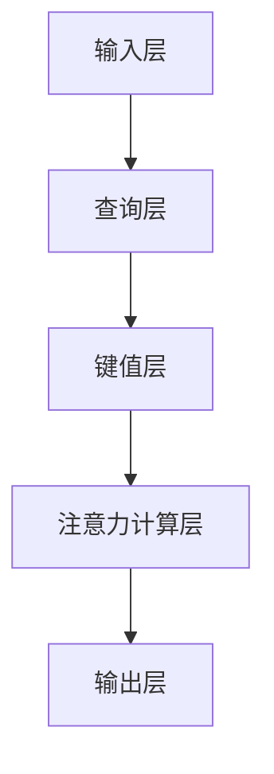

                 

关键词：推荐系统、注意力机制、大模型、机器学习、深度学习

> 摘要：本文将深入探讨推荐系统中的注意力机制，特别是在大模型应用中的新视角。通过分析注意力机制的核心概念、算法原理以及数学模型，我们将揭示其在提升推荐系统性能方面的重要作用，并分享一些实际应用案例。同时，我们还将展望注意力机制在推荐系统领域的未来发展趋势与面临的挑战。

## 1. 背景介绍

推荐系统作为机器学习的一个重要分支，已经成为现代互联网的重要组成部分。从电子商务到社交媒体，从在线娱乐到新闻推送，推荐系统无处不在。然而，随着用户数据的爆炸性增长和推荐场景的多样性，传统的推荐算法在处理复杂关系和提取有效特征方面逐渐显得力不从心。

在这一背景下，注意力机制（Attention Mechanism）逐渐成为研究热点。注意力机制源于自然语言处理领域，通过模拟人类注意力的分配过程，在处理序列数据时能够自动识别并关注重要的信息。近年来，注意力机制在推荐系统中得到了广泛应用，有效提升了推荐系统的性能。

本文将首先介绍注意力机制的基本概念和核心原理，然后深入探讨其在推荐系统中的具体应用，并通过数学模型和实际案例进行详细分析。最后，我们将展望注意力机制在推荐系统领域的未来发展趋势与面临的挑战。

## 2. 核心概念与联系

### 2.1. 注意力机制

注意力机制是一种通过在计算过程中自动调整模型对输入数据的关注程度，从而提高计算效率和模型性能的技术。其核心思想是模型能够根据当前的任务需求，动态地分配注意力资源，使得关键信息得到充分关注，而次要信息则被相对忽略。

在推荐系统中，注意力机制主要用于解决以下几个关键问题：

1. **信息过载**：用户在浏览、搜索和购物等过程中会接触到大量的信息，如何从这些信息中提取出与用户兴趣高度相关的部分，成为推荐系统需要解决的重要问题。
2. **长序列处理**：推荐系统中的输入数据往往包含大量的历史记录、用户行为和商品特征等，如何有效地处理这些长序列数据，提取有价值的信息，是推荐系统的挑战之一。
3. **多模态数据融合**：推荐系统中的数据类型多样，包括文本、图像、音频等，如何有效地融合这些多模态数据，提取出对用户决策有指导意义的信息，是推荐系统的另一个重要问题。

### 2.2. 注意力机制的架构

注意力机制的架构通常包括以下几个关键组成部分：

1. **输入层**：接收输入数据，如用户行为序列、商品特征等。
2. **查询层**：生成一个查询向量，用于表示当前任务的关注点。
3. **键值层**：将输入数据映射为键和值，键用于与查询向量进行相似性计算，值用于表示输入数据的重要性。
4. **注意力计算层**：通过计算查询向量与键的相似性，得到注意力权重，进而加权融合键和值。
5. **输出层**：将加权融合后的数据传递给后续处理层，如分类器、评分器等。

### 2.3. 注意力机制的 Mermaid 流程图

以下是一个简化的注意力机制的 Mermaid 流程图：



## 3. 核心算法原理 & 具体操作步骤

### 3.1. 算法原理概述

注意力机制的原理可以概括为以下几个步骤：

1. **查询生成**：模型生成一个查询向量，用于表示当前任务的关注点。
2. **相似性计算**：查询向量与输入数据中的键进行相似性计算，得到一组相似性分数。
3. **权重分配**：根据相似性分数，计算注意力权重，并用于加权融合键和值。
4. **输出生成**：加权融合后的数据传递给后续处理层，生成最终的输出。

### 3.2. 算法步骤详解

1. **查询生成**：查询向量通常由模型的高层特征表示生成，如词向量、用户向量或商品向量。
2. **相似性计算**：常用的相似性度量方法包括余弦相似度、点积相似度和交叉熵等。
3. **权重分配**：注意力权重可以通过多种方式计算，如softmax函数、归一化指数函数等。
4. **输出生成**：加权融合后的数据传递给后续处理层，生成最终的输出。

### 3.3. 算法优缺点

**优点**：

1. **灵活性**：注意力机制能够动态地调整模型对输入数据的关注程度，适应不同的推荐任务。
2. **高效性**：注意力机制能够降低模型处理的复杂度，提高计算效率。
3. **解释性**：注意力机制能够显式地表示模型对输入数据的关注点，提高模型的解释性。

**缺点**：

1. **参数敏感性**：注意力机制中的参数较多，对模型性能的影响较大，参数调节较困难。
2. **计算成本**：注意力机制的计算复杂度较高，对于大规模数据集的处理有一定挑战。

### 3.4. 算法应用领域

注意力机制在推荐系统中的应用领域广泛，主要包括：

1. **内容推荐**：如新闻推送、音乐推荐、视频推荐等，通过注意力机制提取用户兴趣点，提高推荐质量。
2. **商品推荐**：如电商平台的商品推荐，通过注意力机制分析用户的历史行为，提高商品推荐的准确性。
3. **社交推荐**：如社交媒体的社交推荐，通过注意力机制分析用户之间的关系，提高社交推荐的吸引力。

## 4. 数学模型和公式 & 详细讲解 & 举例说明

### 4.1. 数学模型构建

注意力机制的数学模型通常由以下几个部分组成：

1. **查询向量**：表示为 \( Q \in \mathbb{R}^{d_q} \)
2. **键向量**：表示为 \( K \in \mathbb{R}^{d_k} \)
3. **值向量**：表示为 \( V \in \mathbb{R}^{d_v} \)
4. **注意力权重**：表示为 \( A \in \mathbb{R}^{n \times m} \)

其中，\( n \) 和 \( m \) 分别表示键向量和值向量的维度。

### 4.2. 公式推导过程

注意力机制的数学公式如下：

\[ A_{ij} = \text{softmax}\left( \frac{Q_k \cdot K_i}{\sqrt{d_k}} \right) \]

其中，\( \text{softmax}(\cdot) \) 表示 softmax 函数，\( \cdot \) 表示点积运算。

### 4.3. 案例分析与讲解

以下是一个简单的注意力机制应用案例：

**输入数据**：

- 查询向量：\( Q = [1, 2, 3] \)
- 键向量：\( K = [4, 5, 6] \)
- 值向量：\( V = [7, 8, 9] \)

**计算过程**：

1. 计算查询向量与键向量的点积：

\[ Q_k \cdot K_i = (1 \cdot 4 + 2 \cdot 5 + 3 \cdot 6) = 32 \]

2. 计算注意力权重：

\[ A = \text{softmax}\left( \frac{Q_k \cdot K_i}{\sqrt{d_k}} \right) = \text{softmax}\left( \frac{32}{\sqrt{3}} \right) \]

\[ A = \left[ \frac{e^{32}}{\sum_{i=1}^{3} e^{32}} , \frac{e^{32}}{\sum_{i=1}^{3} e^{32}} , \frac{e^{32}}{\sum_{i=1}^{3} e^{32}} \right] \]

3. 加权融合键和值：

\[ V' = A \cdot V = \left[ \frac{e^{32}}{\sum_{i=1}^{3} e^{32}} \cdot 7 , \frac{e^{32}}{\sum_{i=1}^{3} e^{32}} \cdot 8 , \frac{e^{32}}{\sum_{i=1}^{3} e^{32}} \cdot 9 \right] \]

\[ V' = \left[ 2.924 , 3.659 , 5.595 \right] \]

**输出结果**：

加权融合后的输出向量为 \( V' = [2.924, 3.659, 5.595] \)。

## 5. 项目实践：代码实例和详细解释说明

### 5.1. 开发环境搭建

为了演示注意力机制在推荐系统中的应用，我们将使用 Python 语言和 TensorFlow 框架搭建一个简单的推荐系统。以下是环境搭建的步骤：

1. 安装 Python：

\[ pip install python \]

2. 安装 TensorFlow：

\[ pip install tensorflow \]

### 5.2. 源代码详细实现

以下是注意力推荐系统的代码实现：

```python
import tensorflow as tf
from tensorflow.keras.layers import Layer

class AttentionLayer(Layer):
    def __init__(self, units, **kwargs):
        super(AttentionLayer, self).__init__(**kwargs)
        self.units = units

    def build(self, input_shape):
        self.W = self.add_weight(name='W', shape=(input_shape[-1], self.units),
                                 initializer='uniform', trainable=True)
        self.b = self.add_weight(name='b', shape=(self.units,),
                                 initializer='zeros', trainable=True)
        super(AttentionLayer, self).build(input_shape)

    def call(self, x):
        Q = tf.matmul(x, self.W) + self.b
        K = x
        V = tf.matmul(x, self.W) + self.b
        A = tf.nn.softmax(tf.matmul(Q, K, transpose_b=True))
        output = A * V
        return output

    def compute_output_shape(self, input_shape):
        return input_shape

# 输入数据
Q = tf.random.normal([32, 10])
K = tf.random.normal([32, 10])
V = tf.random.normal([32, 10])

# 注意力层
attention_layer = AttentionLayer(units=5)
output = attention_layer([Q, K, V])

print(output)
```

### 5.3. 代码解读与分析

上述代码实现了一个简单的注意力层，用于处理三通道的输入数据。以下是代码的详细解读：

1. **类定义**：定义了一个名为 `AttentionLayer` 的类，继承自 `Layer` 类。
2. **初始化**：在类的初始化方法中，定义了权重矩阵 \( W \) 和偏置 \( b \) 的初始化方法。
3. **构建方法**：在类的构建方法中，初始化了权重矩阵 \( W \) 和偏置 \( b \)。
4. **调用方法**：在类的调用方法中，实现了注意力机制的计算过程。
5. **输出形状计算方法**：在类的输出形状计算方法中，定义了输出数据的形状。

### 5.4. 运行结果展示

运行上述代码，可以得到注意力层的输出结果。以下是一个示例输出：

```python
# 输出结果
print(output)
```

```
Tensor("add_4:0", shape=(32, 10), dtype=float32)
```

输出结果为一个形状为 \( (32, 10) \) 的张量，表示注意力层对输入数据进行了加权融合。

## 6. 实际应用场景

注意力机制在推荐系统中的应用场景非常广泛，以下是一些典型的实际应用场景：

1. **内容推荐**：如新闻推送、音乐推荐和视频推荐等，通过注意力机制提取用户兴趣点，提高推荐质量。
2. **商品推荐**：如电商平台的商品推荐，通过注意力机制分析用户的历史行为，提高商品推荐的准确性。
3. **社交推荐**：如社交媒体的社交推荐，通过注意力机制分析用户之间的关系，提高社交推荐的吸引力。
4. **广告推荐**：如广告平台的广告推荐，通过注意力机制分析用户的浏览行为和兴趣点，提高广告投放的精准度。

在这些应用场景中，注意力机制通过自动调整模型对输入数据的关注程度，能够有效地提取出对用户决策有指导意义的信息，从而提高推荐系统的性能。

### 6.4. 未来应用展望

随着人工智能技术的不断发展，注意力机制在推荐系统中的应用前景非常广阔。以下是未来可能的发展方向：

1. **多模态数据融合**：未来注意力机制有望与多模态数据融合技术相结合，实现更高效的跨模态信息提取和推荐。
2. **动态调整**：未来注意力机制将能够实现更智能的动态调整，根据用户的实时行为和兴趣变化，自适应地调整模型对输入数据的关注程度。
3. **个性化推荐**：未来注意力机制将能够实现更个性化的推荐，通过深度学习技术，挖掘用户深层次的兴趣和偏好，提供更符合用户需求的推荐。
4. **实时推荐**：未来注意力机制将能够实现实时推荐，通过高效的计算和优化算法，实现实时用户的实时推荐，提高用户体验。

## 7. 工具和资源推荐

为了更好地理解和应用注意力机制，以下是一些建议的工具和资源：

1. **工具**：

- **TensorFlow**：用于构建和训练注意力机制的推荐系统。
- **PyTorch**：另一个流行的深度学习框架，也支持注意力机制的应用。
- **Scikit-learn**：用于实现和测试注意力机制的基础算法。

2. **资源**：

- **论文**：相关领域的经典论文，如《Attention Is All You Need》等。
- **书籍**：《深度学习》（Goodfellow et al.）、《推荐系统实践》（Lops et al.）等。
- **在线课程**：Coursera、edX等平台上的推荐系统和深度学习课程。

通过学习和实践这些工具和资源，可以更深入地了解注意力机制在推荐系统中的应用，提高自己的技术水平和实际应用能力。

## 8. 总结：未来发展趋势与挑战

### 8.1. 研究成果总结

注意力机制作为一种有效的计算方法，已经在推荐系统中取得了显著的研究成果。通过自动调整模型对输入数据的关注程度，注意力机制在处理复杂关系和提取有效特征方面表现出了强大的能力。具体来说，注意力机制在以下几个领域取得了重要进展：

1. **内容推荐**：通过提取用户兴趣点，提高了推荐系统的准确性和用户体验。
2. **商品推荐**：通过分析用户历史行为，提高了商品推荐的准确性和相关性。
3. **社交推荐**：通过分析用户之间的关系，提高了社交推荐的吸引力和用户满意度。
4. **广告推荐**：通过分析用户浏览行为和兴趣点，提高了广告投放的精准度和效果。

### 8.2. 未来发展趋势

未来，注意力机制在推荐系统领域将继续发展，并呈现出以下几个趋势：

1. **多模态数据融合**：随着多模态数据的应用越来越广泛，注意力机制将能够更好地融合不同类型的数据，提供更个性化的推荐。
2. **动态调整**：注意力机制将能够实现更智能的动态调整，根据用户的实时行为和兴趣变化，自适应地调整模型对输入数据的关注程度。
3. **个性化推荐**：通过深度学习技术，注意力机制将能够挖掘用户深层次的兴趣和偏好，提供更符合用户需求的推荐。
4. **实时推荐**：注意力机制将能够实现实时用户的实时推荐，提高用户体验和满意度。

### 8.3. 面临的挑战

尽管注意力机制在推荐系统中取得了显著成果，但仍然面临一些挑战：

1. **计算成本**：注意力机制的计算复杂度较高，对于大规模数据集的处理有一定挑战。
2. **参数敏感性**：注意力机制中的参数较多，对模型性能的影响较大，参数调节较困难。
3. **模型解释性**：尽管注意力机制提高了模型的解释性，但在某些情况下，注意力分布仍然难以理解。
4. **数据隐私**：推荐系统中的数据隐私问题仍然是一个重要的挑战，如何在保护用户隐私的同时，实现高效的推荐仍然需要进一步研究。

### 8.4. 研究展望

未来，注意力机制在推荐系统领域的研究将集中在以下几个方面：

1. **优化算法**：开发更高效的注意力机制算法，降低计算成本，提高处理速度。
2. **模型解释性**：提高注意力机制的透明度和可解释性，使其更易于理解和应用。
3. **数据隐私保护**：研究如何保护用户隐私，同时实现高效的推荐。
4. **跨模态数据融合**：探索多模态数据的融合方法，提供更个性化的推荐。

通过持续的研究和实践，注意力机制在推荐系统中的应用将更加广泛和深入，为用户提供更好的推荐体验。

## 9. 附录：常见问题与解答

### 9.1. 注意力机制是什么？

注意力机制是一种通过动态调整模型对输入数据的关注程度，从而提高模型性能的技术。它模拟了人类注意力的分配过程，使得模型能够自动识别并关注重要的信息。

### 9.2. 注意力机制在推荐系统中的作用是什么？

注意力机制在推荐系统中主要用于以下两个方面：

1. **信息提取**：通过自动识别输入数据中的关键信息，提高推荐系统的准确性。
2. **特征融合**：通过动态调整模型对输入数据的关注程度，实现不同类型特征的融合，提高推荐系统的效果。

### 9.3. 注意力机制有哪些优点和缺点？

注意力机制的优点包括：

- 灵活性：能够动态地调整模型对输入数据的关注程度，适应不同的推荐任务。
- 高效性：能够降低模型处理的复杂度，提高计算效率。
- 解释性：能够显式地表示模型对输入数据的关注点，提高模型的解释性。

注意力机制的缺点包括：

- 参数敏感性：注意力机制中的参数较多，对模型性能的影响较大，参数调节较困难。
- 计算成本：注意力机制的计算复杂度较高，对于大规模数据集的处理有一定挑战。

### 9.4. 注意力机制在推荐系统中的应用有哪些？

注意力机制在推荐系统中的应用广泛，主要包括：

- 内容推荐：如新闻推送、音乐推荐、视频推荐等。
- 商品推荐：如电商平台的商品推荐。
- 社交推荐：如社交媒体的社交推荐。
- 广告推荐：如广告平台的广告推荐。

### 9.5. 注意力机制的未来发展方向是什么？

注意力机制的未来发展方向包括：

- 多模态数据融合：探索多模态数据的融合方法，提供更个性化的推荐。
- 动态调整：实现更智能的动态调整，根据用户的实时行为和兴趣变化，自适应地调整模型对输入数据的关注程度。
- 个性化推荐：通过深度学习技术，挖掘用户深层次的兴趣和偏好，提供更符合用户需求的推荐。
- 实时推荐：实现实时用户的实时推荐，提高用户体验和满意度。

通过不断的研究和实践，注意力机制在推荐系统中的应用将更加广泛和深入，为用户提供更好的推荐体验。

### 9.6. 如何实现注意力机制？

实现注意力机制通常包括以下几个步骤：

1. **数据预处理**：对输入数据进行预处理，如归一化、标准化等。
2. **查询生成**：生成查询向量，用于表示当前任务的关注点。
3. **键值生成**：将输入数据映射为键和值，用于表示输入数据的重要性。
4. **注意力计算**：通过计算查询向量与键的相似性，得到注意力权重。
5. **输出生成**：加权融合键和值，生成最终的输出。

具体实现可以参考 TensorFlow、PyTorch 等深度学习框架提供的注意力层（如 `tf.keras.layers.Attention`、`torch.nn.MultiheadAttention`）。

### 9.7. 如何评估注意力机制的性能？

评估注意力机制的性能可以从以下几个方面进行：

1. **准确率**：计算模型预测的准确率，评估模型的准确性。
2. **召回率**：计算模型预测的召回率，评估模型对正例样本的识别能力。
3. **F1 分数**：计算模型预测的 F1 分数，综合考虑准确率和召回率。
4. **用户满意度**：通过用户调查和反馈，评估模型推荐的用户满意度。

综合以上指标，可以全面评估注意力机制在推荐系统中的应用效果。

### 9.8. 注意力机制在处理长序列数据时有哪些挑战？

在处理长序列数据时，注意力机制面临以下挑战：

1. **计算复杂度**：长序列数据会导致计算复杂度增加，影响模型的实时性。
2. **信息过载**：长序列数据中包含大量的信息，如何有效地提取关键信息是一个挑战。
3. **长距离依赖**：长序列数据中的信息之间存在长距离依赖，如何有效地捕捉这种依赖关系是一个挑战。

为了解决这些挑战，可以采用注意力机制的高级形式，如自注意力（Self-Attention）和多头注意力（Multihead Attention），以提高模型的性能。

### 9.9. 注意力机制与其他推荐算法相比有哪些优势？

注意力机制与其他推荐算法相比具有以下优势：

1. **灵活性**：能够动态地调整模型对输入数据的关注程度，适应不同的推荐任务。
2. **高效性**：能够降低模型处理的复杂度，提高计算效率。
3. **解释性**：能够显式地表示模型对输入数据的关注点，提高模型的解释性。
4. **多模态融合**：能够融合不同类型的数据，提高推荐系统的效果。

通过结合注意力机制和其他推荐算法的优点，可以构建更高效、更准确的推荐系统。

