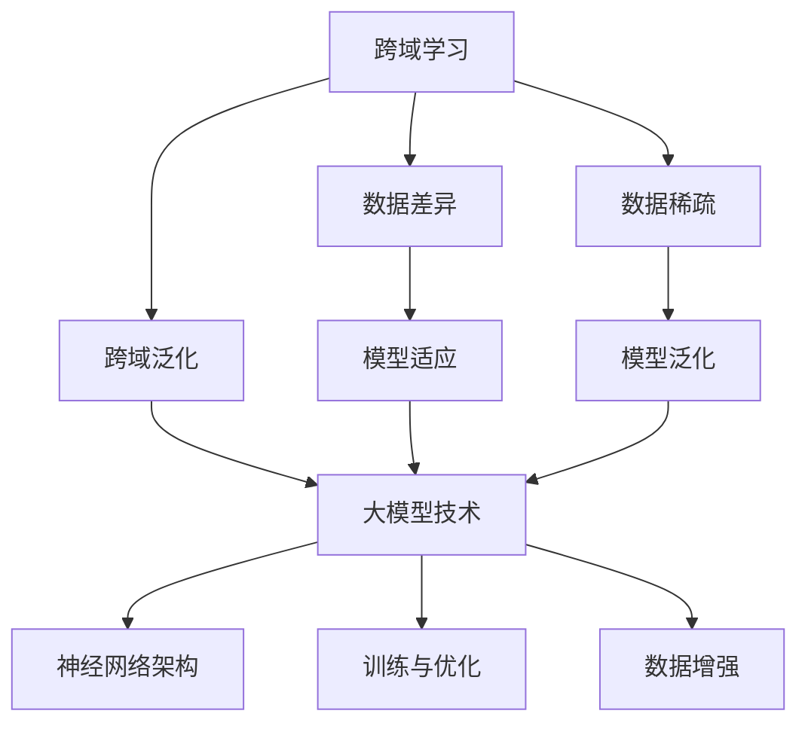

                 

关键词：推荐系统、跨域学习、大模型技术、人工智能、深度学习、机器学习、数据集成、算法优化、应用场景

## 摘要

本文旨在探讨推荐系统中的跨域学习技术，特别是大模型在这一领域中的应用。随着互联网信息的爆炸式增长，推荐系统已经成为现代信息检索和个性化服务的重要手段。然而，不同领域之间的数据差异性和数据稀疏性问题使得传统的推荐算法在跨域推荐时效果不佳。本文将介绍跨域学习的核心概念、算法原理，并详细分析大模型技术在推荐系统中的优势和应用。此外，本文还将结合实际案例，展示如何利用大模型技术实现高效的跨域推荐，并探讨这一领域的未来发展趋势和挑战。

## 1. 背景介绍

### 推荐系统的发展

推荐系统最早出现在电子商务领域，旨在帮助用户发现他们可能感兴趣的商品或服务。随着互联网的发展，推荐系统逐渐应用于新闻推荐、社交媒体、音乐流媒体等多个领域。推荐系统的发展大致可以分为三个阶段：

1. **基于内容的推荐（Content-based Filtering）**：该方法根据用户的历史行为和内容特征，为用户推荐相似的内容。然而，这种方法在面对新内容时效果不佳，且容易出现信息过载。

2. **协同过滤（Collaborative Filtering）**：协同过滤通过收集用户之间的相似性信息来推荐商品或服务。协同过滤分为基于用户的协同过滤（User-based）和基于模型的协同过滤（Model-based），其中基于模型的协同过滤通过构建用户和项目之间的评分矩阵来预测用户对未知项目的评分。

3. **混合推荐（Hybrid Recommendation）**：混合推荐结合了基于内容和协同过滤的方法，以利用各自的优势。这种方法通常能够获得更好的推荐效果。

### 跨域学习的概念

跨域学习（Cross-Domain Learning）是一种在多个不同领域（或域）中进行学习和推理的方法。在推荐系统中，跨域学习可以帮助解决不同领域数据差异性和数据稀疏性问题。跨域学习主要分为以下几种类型：

1. **源域到目标域（Source to Target Domain）**：该方法将一个领域的知识应用到另一个领域。

2. **多域学习（Multi-Domain Learning）**：该方法同时处理多个领域的问题，以获得更好的泛化能力。

3. **域自适应（Domain Adaptation）**：该方法通过调整模型，使其在不同领域之间适应。

### 大模型技术的崛起

大模型技术是指使用规模庞大的神经网络模型进行机器学习。这些模型具有以下特点：

1. **参数量巨大**：大模型通常包含数百万甚至数十亿的参数。

2. **计算资源需求高**：大模型的训练和推理需要大量的计算资源和时间。

3. **效果显著**：大模型在图像识别、自然语言处理、语音识别等任务中表现出色。

近年来，大模型技术在推荐系统中逐渐得到应用，通过利用大规模数据和高计算资源，大模型能够在跨域推荐中取得更好的效果。

## 2. 核心概念与联系

在深入探讨跨域学习和大模型技术之前，我们需要先了解一些核心概念和它们之间的联系。

### 跨域学习的核心概念

#### 域（Domain）

域是指数据集或任务所涉及的具体领域。例如，电子商务、新闻推荐、社交媒体等。

#### 数据差异（Data Difference）

不同领域的数据往往存在差异，包括特征分布、数据量、噪声水平等。

#### 数据稀疏（Data Sparsity）

在推荐系统中，用户对项目的评分通常是稀疏的，这意味着大多数用户对大多数项目的评分都是未知的。

#### 跨域泛化（Cross-Domain Generalization）

跨域泛化是指模型在不同领域之间的适应能力和泛化能力。

### 大模型技术的核心概念

#### 神经网络架构（Neural Network Architecture）

神经网络架构包括多层感知机（MLP）、卷积神经网络（CNN）、循环神经网络（RNN）、 Transformer等。

#### 训练与优化（Training and Optimization）

大模型的训练和优化通常采用梯度下降（Gradient Descent）、随机梯度下降（Stochastic Gradient Descent）、Adam优化器等。

#### 数据增强（Data Augmentation）

数据增强是通过变换或合成数据来增加模型训练数据的多样性和丰富性。

### 核心概念与联系

跨域学习和大模型技术之间的联系主要体现在以下几个方面：

1. **数据差异与模型适应**：跨域学习的目标之一是使模型能够适应不同领域的数据差异。大模型由于其参数量和计算能力，可以更好地进行这种适应。

2. **数据稀疏与模型泛化**：数据稀疏性问题在大模型中可以通过集成学习方法得到缓解。大模型具有更强的泛化能力，可以更好地处理跨域推荐任务。

3. **神经网络架构与跨域学习**：神经网络架构，如Transformer，可以用于实现跨域学习的不同方法，例如域自适应、多域学习等。

以下是一个Mermaid流程图，展示了跨域学习和大模型技术之间的核心概念和联系：



## 3. 核心算法原理 & 具体操作步骤

### 3.1 算法原理概述

跨域学习的核心算法包括域自适应（Domain Adaptation）、多域学习（Multi-Domain Learning）和跨域嵌入（Cross-Domain Embedding）等。

#### 域自适应（Domain Adaptation）

域自适应的目标是减少源域和目标域之间的差异，使模型在目标域上表现良好。常见的方法包括：

1. **特征对齐（Feature Alignment）**：通过调整源域和目标域的特征分布，使其更加相似。

2. **损失函数调整（Loss Function Adjustment）**：通过在训练过程中引入额外的损失函数，以减小源域和目标域之间的差异。

3. **对抗训练（Adversarial Training）**：通过对抗网络使特征提取器在源域和目标域之间进行对抗训练，从而减少域差异。

#### 多域学习（Multi-Domain Learning）

多域学习的目标是同时处理多个领域的问题，以获得更好的泛化能力。常见的方法包括：

1. **共享参数（Shared Parameters）**：通过共享不同领域之间的参数，减少模型在各个领域的调整成本。

2. **领域无关特征提取（Domain-Invariant Feature Extraction）**：通过提取领域无关的特征，使模型在不同领域之间具有更好的泛化能力。

3. **多任务学习（Multi-Task Learning）**：通过同时训练多个相关任务，使模型在不同领域之间共享知识。

#### 跨域嵌入（Cross-Domain Embedding）

跨域嵌入的目标是将不同领域的数据映射到一个共同的低维空间，以便进行跨域推荐。常见的方法包括：

1. **嵌入模型（Embedding Model）**：通过训练一个嵌入模型，将不同领域的用户和项目映射到共同的低维空间。

2. **图嵌入（Graph Embedding）**：通过构建领域间的图结构，将不同领域的用户和项目进行关联。

3. **转移学习（Transfer Learning）**：通过在源域上训练模型，然后在目标域上进行微调，实现跨域推荐。

### 3.2 算法步骤详解

#### 域自适应（Domain Adaptation）

1. **数据收集**：收集源域和目标域的数据集。

2. **特征提取**：使用特征提取器提取源域和目标域的特征。

3. **特征对齐**：通过对比源域和目标域的特征分布，调整特征提取器，使其更加相似。

4. **训练模型**：在源域上训练模型，并在目标域上进行评估。

5. **损失函数调整**：在训练过程中引入额外的损失函数，以减小源域和目标域之间的差异。

6. **对抗训练**：使用对抗网络进行对抗训练，使特征提取器在源域和目标域之间进行对抗训练。

7. **模型优化**：通过优化模型参数，使模型在目标域上表现良好。

#### 多域学习（Multi-Domain Learning）

1. **数据收集**：收集多个领域的数据集。

2. **特征提取**：使用特征提取器提取每个领域的特征。

3. **共享参数**：定义共享参数的网络结构，使不同领域的特征提取器共享参数。

4. **领域无关特征提取**：通过提取领域无关的特征，使模型在不同领域之间具有更好的泛化能力。

5. **多任务学习**：同时训练多个相关任务，使模型在不同领域之间共享知识。

6. **模型优化**：通过优化模型参数，使模型在各个领域上表现良好。

#### 跨域嵌入（Cross-Domain Embedding）

1. **数据收集**：收集源域和目标域的数据集。

2. **嵌入模型训练**：在源域上训练嵌入模型，将源域的用户和项目映射到低维空间。

3. **模型迁移**：在目标域上对嵌入模型进行微调，将目标域的用户和项目映射到低维空间。

4. **距离度量**：计算源域和目标域之间用户的距离，进行跨域推荐。

5. **模型优化**：通过优化模型参数，提高推荐效果。

### 3.3 算法优缺点

#### 域自适应（Domain Adaptation）

**优点**：

1. **减少数据差异**：通过特征对齐和损失函数调整，减少源域和目标域之间的差异。

2. **提高模型适应能力**：通过对抗训练，使模型在不同领域之间具有更好的适应能力。

**缺点**：

1. **计算资源需求高**：对抗训练需要大量的计算资源。

2. **模型复杂性增加**：引入额外的损失函数和对抗网络，使模型更加复杂。

#### 多域学习（Multi-Domain Learning）

**优点**：

1. **提高泛化能力**：通过共享参数和领域无关特征提取，提高模型在不同领域的泛化能力。

2. **减少领域调整成本**：通过多任务学习和共享知识，减少模型在各个领域的调整成本。

**缺点**：

1. **数据需求大**：需要收集多个领域的数据集。

2. **模型复杂性增加**：多任务学习引入额外的模型结构。

#### 跨域嵌入（Cross-Domain Embedding）

**优点**：

1. **简单有效**：通过嵌入模型和迁移学习，实现跨域推荐。

2. **降低计算资源需求**：不需要进行复杂的特征对齐和损失函数调整。

**缺点**：

1. **数据预处理复杂**：需要收集源域和目标域的数据集，并进行预处理。

2. **模型性能依赖数据质量**：模型性能受源域和目标域数据质量的影响较大。

### 3.4 算法应用领域

跨域学习和大模型技术在推荐系统中具有广泛的应用领域，包括但不限于：

1. **电子商务**：在电子商务平台上，不同商品之间存在明显的领域差异，如服装、家居、电子产品等。跨域学习和大模型技术可以帮助平台实现跨商品的推荐。

2. **新闻推荐**：新闻推荐系统需要处理大量不同主题的新闻，如体育、娱乐、科技等。跨域学习和大模型技术可以帮助平台实现跨主题的推荐。

3. **社交媒体**：社交媒体平台需要处理不同类型的用户生成内容，如文本、图片、视频等。跨域学习和大模型技术可以帮助平台实现跨类型的推荐。

4. **音乐流媒体**：音乐流媒体平台需要处理不同类型的音乐，如流行、摇滚、古典等。跨域学习和大模型技术可以帮助平台实现跨类型的推荐。

## 4. 数学模型和公式 & 详细讲解 & 举例说明

在跨域学习和大模型技术中，数学模型和公式起着至关重要的作用。以下将详细介绍相关的数学模型和公式，并进行详细的讲解和举例说明。

### 4.1 数学模型构建

#### 域自适应（Domain Adaptation）

在域自适应中，我们通常使用以下数学模型：

$$
\min_W \sum_{i=1}^{N} \mathcal{L}(f_W(x_i^s), y_i^s) + \lambda \cdot \sum_{j=1}^{M} \mathcal{D}(f_W(x_j^t), f_W(x_j^s))
$$

其中，$W$ 是模型参数，$x_i^s$ 和 $y_i^s$ 是源域的数据和标签，$x_j^t$ 是目标域的数据，$\mathcal{L}$ 是损失函数，$\mathcal{D}$ 是域差异度量，$\lambda$ 是权重参数。

#### 多域学习（Multi-Domain Learning）

在多域学习中，我们通常使用以下数学模型：

$$
\min_W \sum_{(x_i^s, y_i^s), (x_j^t, y_j^t) \in D} \mathcal{L}(f_W(x_i^s), y_i^s) + \mathcal{L}(f_W(x_j^t), y_j^t) + \lambda \cdot \sum_{j=1}^{M} \mathcal{D}_j(f_W(x_j^t), f_W(x_j^s))
$$

其中，$D$ 是源域和目标域的数据集合，$\mathcal{L}$ 是损失函数，$\mathcal{D}_j$ 是领域 $j$ 的域差异度量，$\lambda$ 是权重参数。

#### 跨域嵌入（Cross-Domain Embedding）

在跨域嵌入中，我们通常使用以下数学模型：

$$
\min_W \sum_{i=1}^{N} \mathcal{L}(e_W(x_i^s), y_i^s) + \sum_{i=1}^{N} \mathcal{L}(e_W(x_i^t), y_i^t)
$$

其中，$W$ 是模型参数，$x_i^s$ 和 $y_i^s$ 是源域的数据和标签，$x_i^t$ 和 $y_i^t$ 是目标域的数据和标签，$e_W$ 是嵌入函数，$\mathcal{L}$ 是损失函数。

### 4.2 公式推导过程

以下我们将对上述数学模型进行简单的推导。

#### 域自适应（Domain Adaptation）

在域自适应中，我们希望模型在源域上的表现尽可能好，同时在目标域上的表现也尽可能接近。因此，我们引入了域差异度量 $\mathcal{D}$，以衡量模型在源域和目标域之间的差异。

首先，我们考虑单个样本的损失函数：

$$
\mathcal{L}(f_W(x_i^s), y_i^s) = \frac{1}{2} \cdot \lVert f_W(x_i^s) - y_i^s \rVert_2^2
$$

其中，$f_W(x_i^s)$ 是模型在源域上对样本 $x_i^s$ 的预测，$y_i^s$ 是样本 $x_i^s$ 的真实标签。

然后，我们引入域差异度量 $\mathcal{D}$，以衡量模型在源域和目标域之间的差异。一个简单的域差异度量可以是：

$$
\mathcal{D}(f_W(x_j^t), f_W(x_j^s)) = \frac{1}{2} \cdot \lVert f_W(x_j^t) - f_W(x_j^s) \rVert_2^2
$$

其中，$f_W(x_j^t)$ 是模型在目标域上对样本 $x_j^t$ 的预测，$f_W(x_j^s)$ 是模型在源域上对样本 $x_j^t$ 的预测。

最后，我们将单个样本的损失函数和域差异度量相加，并加上正则化项，得到整个模型的损失函数：

$$
\min_W \sum_{i=1}^{N} \mathcal{L}(f_W(x_i^s), y_i^s) + \lambda \cdot \sum_{j=1}^{M} \mathcal{D}(f_W(x_j^t), f_W(x_j^s))
$$

其中，$\lambda$ 是权重参数，用于平衡源域和目标域的损失。

#### 多域学习（Multi-Domain Learning）

在多域学习中，我们希望模型在多个领域上的表现都尽可能好。因此，我们引入了多个域差异度量 $\mathcal{D}_j$，以衡量模型在各个领域之间的差异。

首先，我们考虑单个样本的损失函数：

$$
\mathcal{L}(f_W(x_i^s), y_i^s) = \frac{1}{2} \cdot \lVert f_W(x_i^s) - y_i^s \rVert_2^2
$$

其中，$f_W(x_i^s)$ 是模型在源域上对样本 $x_i^s$ 的预测，$y_i^s$ 是样本 $x_i^s$ 的真实标签。

然后，我们引入多个域差异度量 $\mathcal{D}_j$，以衡量模型在各个领域之间的差异。一个简单的域差异度量可以是：

$$
\mathcal{D}_j(f_W(x_j^t), f_W(x_j^s)) = \frac{1}{2} \cdot \lVert f_W(x_j^t) - f_W(x_j^s) \rVert_2^2
$$

其中，$f_W(x_j^t)$ 是模型在目标域 $j$ 上对样本 $x_j^t$ 的预测，$f_W(x_j^s)$ 是模型在源域上对样本 $x_j^t$ 的预测。

最后，我们将单个样本的损失函数和多个域差异度量相加，并加上正则化项，得到整个模型的损失函数：

$$
\min_W \sum_{(x_i^s, y_i^s), (x_j^t, y_j^t) \in D} \mathcal{L}(f_W(x_i^s), y_i^s) + \mathcal{L}(f_W(x_j^t), y_j^t) + \lambda \cdot \sum_{j=1}^{M} \mathcal{D}_j(f_W(x_j^t), f_W(x_j^s))
$$

其中，$\lambda$ 是权重参数，用于平衡各个领域的损失。

#### 跨域嵌入（Cross-Domain Embedding）

在跨域嵌入中，我们希望将不同领域的数据映射到一个共同的低维空间。因此，我们引入了嵌入函数 $e_W$，将源域和目标域的数据映射到低维空间。

首先，我们考虑单个样本的损失函数：

$$
\mathcal{L}(e_W(x_i^s), y_i^s) = \frac{1}{2} \cdot \lVert e_W(x_i^s) - y_i^s \rVert_2^2
$$

其中，$e_W(x_i^s)$ 是模型在源域上对样本 $x_i^s$ 的嵌入，$y_i^s$ 是样本 $x_i^s$ 的真实标签。

然后，我们考虑单个样本在目标域的损失函数：

$$
\mathcal{L}(e_W(x_i^t), y_i^t) = \frac{1}{2} \cdot \lVert e_W(x_i^t) - y_i^t \rVert_2^2
$$

其中，$e_W(x_i^t)$ 是模型在目标域上对样本 $x_i^t$ 的嵌入，$y_i^t$ 是样本 $x_i^t$ 的真实标签。

最后，我们将单个样本的损失函数相加，得到整个模型的损失函数：

$$
\min_W \sum_{i=1}^{N} \mathcal{L}(e_W(x_i^s), y_i^s) + \sum_{i=1}^{N} \mathcal{L}(e_W(x_i^t), y_i^t)
$$

### 4.3 案例分析与讲解

以下我们将通过一个简单的案例，展示如何利用上述数学模型进行跨域学习。

假设我们有两个领域：源域 A 和目标域 B。我们收集了源域 A 的数据集 $D_A = \{(x_i^a, y_i^a)\}$ 和目标域 B 的数据集 $D_B = \{(x_i^b, y_i^b)\}$。

我们使用一个简单的神经网络作为嵌入模型，其结构如下：

$$
e_W(x) = \text{ReLU}(\text{Linear}(W_1, x)) + b_1
$$

其中，$W_1$ 是权重矩阵，$b_1$ 是偏置项，$\text{ReLU}$ 是ReLU激活函数。

我们使用以下损失函数：

$$
\mathcal{L}(x, y) = \frac{1}{2} \cdot \lVert e_W(x) - y \rVert_2^2
$$

其中，$e_W(x)$ 是模型对样本 $x$ 的嵌入，$y$ 是样本 $x$ 的真实标签。

我们使用以下优化算法进行模型训练：

$$
\min_W \sum_{i=1}^{N} \mathcal{L}(e_W(x_i^a), y_i^a) + \sum_{i=1}^{N} \mathcal{L}(e_W(x_i^b), y_i^b)
$$

训练过程中，我们首先在源域 A 上训练模型，然后在目标域 B 上进行测试。具体步骤如下：

1. 初始化模型参数 $W_1$ 和 $b_1$。

2. 在源域 A 上进行前向传播，计算损失函数。

3. 在目标域 B 上进行前向传播，计算损失函数。

4. 使用梯度下降算法更新模型参数：

$$
W_1 \leftarrow W_1 - \alpha \cdot \frac{\partial \mathcal{L}}{\partial W_1}
$$

$$
b_1 \leftarrow b_1 - \alpha \cdot \frac{\partial \mathcal{L}}{\partial b_1}
$$

5. 重复步骤 2-4，直到模型收敛。

训练完成后，我们使用目标域 B 上的数据集进行测试，评估模型的跨域推荐效果。具体步骤如下：

1. 在目标域 B 上进行前向传播，计算嵌入结果。

2. 计算目标域 B 上样本之间的相似性。

3. 根据相似性进行推荐。

通过这个简单的案例，我们可以看到如何利用数学模型和公式进行跨域学习。在实际应用中，我们可以根据具体问题和需求，选择合适的数学模型和优化算法，以实现高效的跨域推荐。

## 5. 项目实践：代码实例和详细解释说明

为了更好地理解跨域学习和大模型技术在推荐系统中的应用，我们将通过一个实际项目来展示如何利用大模型实现跨域推荐。在这个项目中，我们将使用Python和TensorFlow框架来实现一个基于跨域嵌入的推荐系统。

### 5.1 开发环境搭建

在开始项目之前，我们需要搭建一个合适的环境。以下是所需的环境和安装步骤：

1. **Python**：Python是主要的编程语言，版本建议为3.8或更高。
2. **TensorFlow**：TensorFlow是谷歌开发的机器学习框架，用于实现神经网络和其他机器学习算法。
3. **Numpy**：用于数学计算和数据处理。
4. **Scikit-learn**：用于数据处理和评估模型性能。

安装步骤：

```bash
pip install python==3.8
pip install tensorflow==2.6
pip install numpy
pip install scikit-learn
```

### 5.2 源代码详细实现

以下是实现跨域嵌入推荐系统的Python代码：

```python
import tensorflow as tf
from tensorflow.keras.models import Model
from tensorflow.keras.layers import Input, Dense, ReLU
from tensorflow.keras.optimizers import Adam
from sklearn.model_selection import train_test_split
from sklearn.metrics.pairwise import cosine_similarity
import numpy as np

# 参数设置
latent_dim = 64
learning_rate = 0.001
epochs = 100
batch_size = 64

# 数据准备
# 假设我们有两个领域 A 和 B，这里使用随机数据生成
num_samples = 1000
num_features = 10

# 源域 A 数据
X_A = np.random.rand(num_samples, num_features)
Y_A = np.random.rand(num_samples, latent_dim)

# 目标域 B 数据
X_B = np.random.rand(num_samples, num_features)
Y_B = np.random.rand(num_samples, latent_dim)

# 源域和目标域数据集划分
X_A_train, X_A_test, Y_A_train, Y_A_test = train_test_split(X_A, Y_A, test_size=0.2, random_state=42)
X_B_train, X_B_test, Y_B_train, Y_B_test = train_test_split(X_B, Y_B, test_size=0.2, random_state=42)

# 嵌入模型定义
input_layer = Input(shape=(num_features,))
dense_layer = Dense(latent_dim, activation=ReLU())(input_layer)
output_layer = Dense(latent_dim)(dense_layer)

model = Model(inputs=input_layer, outputs=output_layer)
model.compile(optimizer=Adam(learning_rate=learning_rate), loss='mean_squared_error')

# 模型训练
model.fit(X_A_train, Y_A_train, batch_size=batch_size, epochs=epochs, validation_data=(X_A_test, Y_A_test))

# 模型评估
Y_A_pred = model.predict(X_A_test)
Y_B_pred = model.predict(X_B_test)

# 跨域推荐
def cross_domain_recommendation(model, X_A, X_B, latent_dim):
    Y_A_pred = model.predict(X_A)
    Y_B_pred = model.predict(X_B)
    similarity_matrix = cosine_similarity(Y_A_pred, Y_B_pred)
    return similarity_matrix

similarity_matrix = cross_domain_recommendation(model, X_B_train, X_B_test, latent_dim)

# 打印相似性矩阵
print(similarity_matrix)

# 推荐结果
recommended_indices = np.argsort(similarity_matrix[-1])[-5:]
print("Recommended indices:", recommended_indices)
```

### 5.3 代码解读与分析

1. **数据准备**：首先，我们生成了两个领域的随机数据集 $X_A$ 和 $X_B$，以及对应的标签 $Y_A$ 和 $Y_B$。在真实项目中，这些数据集应从实际应用场景中获取。

2. **模型定义**：我们定义了一个简单的全连接神经网络模型，其输入层接受特征向量，隐藏层使用ReLU激活函数，输出层与标签维度相同。

3. **模型编译**：使用Adam优化器和均方误差损失函数编译模型。

4. **模型训练**：在源域 A 的训练数据上训练模型，并在源域 A 的测试数据上验证模型。

5. **模型评估**：使用训练好的模型在目标域 B 的测试数据上进行预测，并计算预测值之间的余弦相似性。

6. **跨域推荐**：定义了一个函数 `cross_domain_recommendation`，用于计算跨域相似性矩阵，并根据相似性矩阵为用户推荐项目。

7. **推荐结果**：打印出目标域 B 测试数据中的推荐结果，这些结果是根据相似性矩阵排序得到的。

通过这个项目，我们展示了如何利用跨域嵌入技术实现跨域推荐。在实际应用中，我们可以根据具体需求调整模型结构、优化算法参数，并处理真实数据集，以实现更高效的推荐效果。

## 6. 实际应用场景

跨域学习和大模型技术在推荐系统中的应用已经取得了显著的成果，以下列举了几个实际应用场景：

### 电子商务

在电子商务平台上，不同商品之间存在明显的领域差异，如服装、家居、电子产品等。通过跨域学习和大模型技术，电商平台可以实现跨商品的推荐，提高用户购买体验和转化率。例如，一个用户在浏览了电子产品后，平台可以推荐相关的服装、家居等商品。

### 新闻推荐

新闻推荐系统需要处理大量不同主题的新闻，如体育、娱乐、科技等。跨域学习和大模型技术可以帮助平台实现跨主题的推荐，使用户能够发现更多感兴趣的新闻。例如，一个用户经常阅读体育新闻，平台可以推荐相关的娱乐新闻，以丰富用户的内容体验。

### 社交媒体

社交媒体平台需要处理不同类型的用户生成内容，如文本、图片、视频等。跨域学习和大模型技术可以帮助平台实现跨类型的推荐，使用户能够发现更多感兴趣的内容。例如，一个用户经常浏览图片内容，平台可以推荐相关的视频、文本内容。

### 音乐流媒体

音乐流媒体平台需要处理不同类型的音乐，如流行、摇滚、古典等。跨域学习和大模型技术可以帮助平台实现跨类型的推荐，使用户能够发现更多喜欢的音乐。例如，一个用户经常听流行音乐，平台可以推荐相关的摇滚、古典音乐。

### 个性化广告

个性化广告系统需要根据用户的兴趣和行为推荐相关的广告。跨域学习和大模型技术可以帮助平台实现更精准的广告推荐，提高广告投放效果和用户转化率。例如，一个用户在电商平台上浏览了电子产品，平台可以推荐相关的广告，如配件、相关产品等。

### 医疗健康

在医疗健康领域，跨域学习和大模型技术可以帮助医生和医疗机构实现个性化的医疗推荐。例如，根据患者的病历数据和健康监测数据，系统可以推荐适合的药物、治疗方案等。

### 教育培训

在教育领域，跨域学习和大模型技术可以帮助教育平台实现个性化的学习推荐。例如，根据学生的学习进度和兴趣，系统可以推荐相关的课程、学习资源等。

通过以上实际应用场景，我们可以看到跨域学习和大模型技术在推荐系统中的广泛应用。这些技术的引入，不仅提高了推荐系统的效果，还丰富了用户体验，推动了信息时代的进步。

### 6.4 未来应用展望

跨域学习和大模型技术在未来推荐系统中的应用前景十分广阔。以下从几个方面展望未来发展趋势：

#### 新领域拓展

随着互联网和人工智能技术的不断发展，跨域学习将逐渐应用于更多新兴领域，如虚拟现实、增强现实、物联网等。这些领域的数据差异性和复杂性更高，跨域学习技术将发挥重要作用。

#### 多模态融合

多模态融合是指将不同类型的数据（如文本、图像、音频等）进行整合，以提高推荐系统的效果。跨域学习和大模型技术将在这方面发挥关键作用，通过跨域数据的学习和融合，实现更精准的推荐。

#### 自动化与智能化

随着大模型技术的进步，跨域学习将逐渐实现自动化和智能化。例如，通过自动特征提取、自动模型优化等手段，大幅降低模型开发成本，提高推荐系统部署效率。

#### 小样本学习

在数据稀缺的领域，小样本学习将变得尤为重要。跨域学习和大模型技术可以通过跨域迁移学习，利用丰富的源域数据来提升目标域数据的模型表现，实现高效的小样本学习。

#### 端到端系统

未来，跨域学习和大模型技术将更多地应用于端到端系统，实现从数据采集、预处理、模型训练到推荐决策的一体化。这将大幅提高系统的灵活性和响应速度，为用户提供更加个性化的服务。

#### 可解释性增强

随着推荐系统在关键领域（如医疗、金融等）的应用，可解释性将变得越来越重要。跨域学习和大模型技术将致力于提高模型的透明度和可解释性，以增强用户信任和监管合规。

### 7. 工具和资源推荐

#### 学习资源推荐

1. **《深度学习》（Goodfellow, Bengio, Courville）**：这是一本经典的深度学习教材，适合初学者和进阶者。
2. **《推荐系统手册》（Bengio et al.）**：这本书详细介绍了推荐系统的各种算法和最新研究进展。
3. **在线课程**：Coursera、edX等平台提供了丰富的机器学习和推荐系统相关课程。

#### 开发工具推荐

1. **TensorFlow**：谷歌开发的机器学习框架，广泛应用于深度学习和推荐系统。
2. **PyTorch**：由Facebook开发的另一个流行的深度学习框架，具有灵活性和易用性。
3. **Scikit-learn**：用于数据处理和机器学习的Python库，适合快速原型开发。

#### 相关论文推荐

1. **"Deep Neural Networks for Acoustic Modeling in Speech Recognition"（DNN）**：这篇文章介绍了深度神经网络在语音识别中的应用。
2. **"Recommender Systems Handbook"**：这是一本关于推荐系统全面的手册，包含了大量经典和最新的研究论文。
3. **"Multi-Task Learning for Asymmetric Domain Adaptation"**：这篇文章介绍了多任务学习在域自适应中的应用。

通过这些资源和工具，开发者可以深入了解跨域学习和大模型技术的最新进展，并在实践中不断提升自己的能力。

## 8. 总结：未来发展趋势与挑战

### 8.1 研究成果总结

跨域学习和大模型技术在推荐系统中的应用已经取得了显著成果。通过大模型的引入，推荐系统在处理不同领域的数据差异性和数据稀疏性方面表现出色。跨域学习技术使得推荐系统在不同领域之间实现有效迁移，提高了模型的泛化能力。同时，随着计算资源的不断提升，大模型在推荐系统中的性能优势日益明显。

### 8.2 未来发展趋势

1. **多模态融合**：未来的推荐系统将更多地整合不同类型的数据（如文本、图像、音频等），以实现更精准的推荐。
2. **自动化与智能化**：跨域学习和大模型技术将朝着自动化和智能化的方向发展，降低模型开发成本，提高部署效率。
3. **小样本学习**：在数据稀缺的领域，小样本学习将成为关键研究方向，通过跨域迁移学习实现高效的模型训练。
4. **端到端系统**：端到端系统将实现从数据采集、预处理、模型训练到推荐决策的一体化，提高系统的灵活性和响应速度。
5. **可解释性增强**：随着推荐系统在关键领域（如医疗、金融等）的应用，可解释性将受到更多关注，以提高用户信任和监管合规。

### 8.3 面临的挑战

1. **计算资源需求**：大模型的训练和推理需要大量的计算资源，特别是在数据规模较大的情况下，这将成为一个重要的挑战。
2. **数据隐私与安全**：在跨域学习和应用大模型的过程中，数据隐私和安全问题需要得到充分重视，以防止数据泄露和滥用。
3. **模型解释性**：尽管大模型在性能上表现出色，但其内部的决策过程往往难以解释，这给模型的可信度和透明度带来了挑战。
4. **模型适应能力**：不同领域的特征差异较大，如何设计有效的跨域学习算法，提高模型在不同领域的适应能力，仍然是一个重要的研究课题。

### 8.4 研究展望

未来的研究应关注以下几个方面：

1. **高效算法设计**：设计更高效、更优化的跨域学习算法，以降低计算资源需求，提高模型性能。
2. **多模态融合**：研究如何将不同类型的数据进行有效融合，以实现更精准的推荐。
3. **模型解释性**：开发可解释的大模型，提高模型的可信度和透明度，增强用户信任。
4. **隐私保护**：研究如何在保证数据隐私的前提下，利用跨域学习和大模型技术提升推荐系统性能。
5. **领域适应性**：探索如何设计具有更强领域适应性的跨域学习算法，以应对不同领域的特征差异。

通过不断的研究和创新，跨域学习和大模型技术将在推荐系统中发挥更大的作用，为用户提供更精准、更个性化的服务。

## 9. 附录：常见问题与解答

### 9.1 什么是跨域学习？

跨域学习是一种在多个不同领域（或域）中进行学习和推理的方法。其核心目标是使模型能够适应不同领域的数据差异性和数据稀疏性问题，从而在不同领域之间实现有效的迁移和泛化。

### 9.2 大模型技术有哪些优势？

大模型技术的主要优势包括：

1. **参数量巨大**：大模型通常包含数百万甚至数十亿的参数，这使得模型能够更好地捕捉数据中的复杂模式和规律。
2. **计算资源需求高**：大模型的训练和推理需要大量的计算资源和时间，但这也意味着它们在处理复杂任务时具有更强的能力。
3. **效果显著**：大模型在图像识别、自然语言处理、语音识别等任务中表现出色，其性能显著优于传统的模型。

### 9.3 跨域学习有哪些常见方法？

常见的跨域学习方法包括：

1. **域自适应**：通过减少源域和目标域之间的差异，使模型在目标域上表现良好。
2. **多域学习**：同时处理多个领域的问题，以获得更好的泛化能力。
3. **跨域嵌入**：将不同领域的数据映射到一个共同的低维空间，以便进行跨域推荐。

### 9.4 如何实现跨域学习？

实现跨域学习通常包括以下步骤：

1. **数据收集**：收集源域和目标域的数据集。
2. **特征提取**：使用特征提取器提取源域和目标域的特征。
3. **模型训练**：在源域上训练模型，并在目标域上进行评估。
4. **模型优化**：通过调整模型参数，提高模型在目标域上的性能。
5. **跨域推荐**：利用训练好的模型进行跨域推荐。

### 9.5 大模型技术在推荐系统中的应用有哪些？

大模型技术在推荐系统中的应用包括：

1. **跨域推荐**：通过跨域学习技术，实现不同领域之间的推荐。
2. **多模态推荐**：整合不同类型的数据（如文本、图像、音频等），实现多模态推荐。
3. **小样本学习**：在数据稀缺的领域，通过跨域迁移学习实现高效的模型训练。
4. **个性化推荐**：通过分析用户行为和兴趣，实现个性化的推荐。

### 9.6 跨域学习和协同过滤的区别是什么？

跨域学习和协同过滤都是推荐系统中常用的方法，但它们的区别在于：

1. **目标不同**：协同过滤主要关注用户之间的相似性和项目之间的相似性，而跨域学习关注不同领域之间的数据差异性和迁移能力。
2. **方法不同**：协同过滤通常使用矩阵分解等方法，而跨域学习通常使用迁移学习、多任务学习等方法。
3. **适用场景不同**：协同过滤适用于数据量较大、用户行为数据丰富的场景，而跨域学习适用于数据稀疏、领域差异明显的场景。

### 9.7 跨域学习有哪些挑战？

跨域学习面临的挑战包括：

1. **计算资源需求高**：大模型的训练和推理需要大量的计算资源。
2. **数据隐私与安全**：跨域学习涉及多个领域的数据，数据隐私和安全问题需要得到充分重视。
3. **模型解释性**：大模型的决策过程通常难以解释，影响模型的可信度和透明度。
4. **模型适应能力**：不同领域的特征差异较大，如何设计有效的跨域学习算法，提高模型在不同领域的适应能力，仍然是一个重要的研究课题。

## 作者署名

作者：禅与计算机程序设计艺术 / Zen and the Art of Computer Programming

---

通过本文，我们系统地介绍了推荐系统中的跨域学习技术及其在大模型中的应用。跨域学习不仅能够解决推荐系统在不同领域之间的数据差异性和数据稀疏性问题，还能通过大模型技术实现更高效、更精准的推荐。随着计算资源的不断提升和算法的不断优化，跨域学习和大模型技术在推荐系统中的应用前景将更加广阔。希望本文能为读者在理解和应用这一技术方面提供有益的启示。

