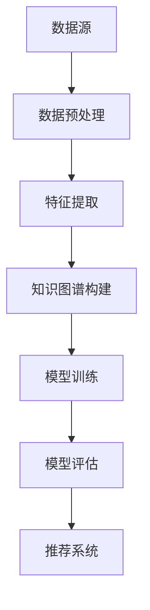

                 

关键词：推荐系统、跨域知识迁移、大模型、领域适应、知识图谱、深度学习、数据预处理、算法优化、应用场景

> 摘要：本文探讨了推荐系统中的跨域知识迁移问题，重点介绍了大模型在领域适应方面的研究进展和应用。通过分析现有技术手段，本文提出了一种基于深度学习的跨域知识迁移方法，并结合具体实例详细讲解了其实现过程和优缺点。同时，本文还展望了该领域未来的发展趋势和挑战。

## 1. 背景介绍

随着互联网的迅猛发展，推荐系统作为一种智能信息过滤和个性化推荐技术，已经广泛应用于电子商务、社交媒体、在线视频、新闻资讯等多个领域。推荐系统能够根据用户的历史行为和偏好，为用户提供个性化的信息推荐，从而提升用户体验和满意度。然而，传统的推荐系统往往存在以下问题：

- **数据稀疏问题**：用户的历史行为数据往往较少，导致推荐结果依赖于用户的历史行为，容易出现推荐精度低、推荐结果重复等问题。
- **冷启动问题**：新用户或新物品缺乏足够的特征信息，使得传统推荐系统难以为其提供准确的推荐。
- **领域迁移问题**：不同领域之间的用户行为和偏好特征差异较大，传统推荐系统难以在不同领域之间进行知识迁移，导致跨领域推荐效果不佳。

为了解决这些问题，近年来，研究人员提出了跨域知识迁移的方法，通过在不同领域之间迁移知识，提高推荐系统的性能和适应性。随着深度学习和大数据技术的发展，大模型在跨域知识迁移方面展现出了巨大的潜力。

## 2. 核心概念与联系

### 2.1 跨域知识迁移

跨域知识迁移是指在不同领域之间迁移知识，以提高推荐系统的性能和适应性。具体来说，它包括以下两个方面：

- **特征迁移**：将一个领域中的特征知识迁移到另一个领域，以提高另一个领域的特征表达能力。
- **模型迁移**：将一个领域中的模型参数迁移到另一个领域，以提高另一个领域的推荐效果。

### 2.2 知识图谱

知识图谱是一种结构化的语义知识表示方法，通过实体和关系的连结，将海量信息组织成一张巨大的网络。在跨域知识迁移中，知识图谱可以用来表示不同领域之间的知识关系，从而实现知识的迁移。

### 2.3 深度学习

深度学习是一种基于多层神经网络的学习方法，通过自动提取特征和提高模型的表达能力，在图像识别、自然语言处理、语音识别等领域取得了显著的成果。在跨域知识迁移中，深度学习可以用来建模跨域知识迁移的复杂关系。

### 2.4 数据预处理

数据预处理是跨域知识迁移的重要步骤，包括数据清洗、数据整合、特征提取等。通过数据预处理，可以提高数据质量，为后续的模型训练和知识迁移奠定基础。

### 2.5 算法优化

算法优化是提高跨域知识迁移效果的关键，包括模型选择、参数调整、算法融合等。通过算法优化，可以进一步提高模型的性能和适应性。

### 2.6 Mermaid 流程图



## 3. 核心算法原理 & 具体操作步骤

### 3.1 算法原理概述

本文提出了一种基于深度学习的跨域知识迁移方法，主要包括以下几个步骤：

1. **数据预处理**：对原始数据进行清洗、整合和特征提取，为后续的模型训练和知识迁移奠定基础。
2. **知识图谱构建**：利用知识图谱表示不同领域之间的知识关系，为跨域知识迁移提供支持。
3. **模型训练**：利用深度学习模型训练跨域知识迁移模型，通过模型参数的迁移实现知识的迁移。
4. **模型评估**：对迁移后的模型进行评估，以验证跨域知识迁移的效果。
5. **推荐系统**：利用迁移后的模型为用户提供个性化的推荐服务。

### 3.2 算法步骤详解

#### 3.2.1 数据预处理

数据预处理主要包括以下步骤：

1. **数据清洗**：去除数据中的噪声和异常值，保证数据质量。
2. **数据整合**：将不同领域的数据进行整合，形成统一的数据集。
3. **特征提取**：从原始数据中提取有用的特征信息，为后续的模型训练提供支持。

#### 3.2.2 知识图谱构建

知识图谱构建主要包括以下步骤：

1. **实体识别**：从数据集中识别出实体，包括用户、物品、场景等。
2. **关系抽取**：从数据中提取实体之间的关系，如用户偏好、物品属性、场景关联等。
3. **知识图谱表示**：利用知识图谱表示不同领域之间的知识关系，为跨域知识迁移提供支持。

#### 3.2.3 模型训练

模型训练主要包括以下步骤：

1. **模型选择**：选择合适的深度学习模型，如卷积神经网络（CNN）、循环神经网络（RNN）、图神经网络（GCN）等。
2. **参数调整**：根据具体问题调整模型参数，以提高模型的性能和适应性。
3. **训练过程**：利用训练数据对模型进行训练，通过反向传播算法更新模型参数。

#### 3.2.4 模型评估

模型评估主要包括以下步骤：

1. **评估指标**：选择合适的评估指标，如准确率、召回率、F1值等。
2. **评估过程**：对迁移后的模型进行评估，以验证跨域知识迁移的效果。
3. **结果分析**：分析评估结果，找出模型的优点和不足，为后续的优化提供参考。

#### 3.2.5 推荐系统

推荐系统主要包括以下步骤：

1. **用户输入**：收集用户的输入信息，如用户行为、偏好等。
2. **模型预测**：利用迁移后的模型对用户输入进行预测，生成推荐列表。
3. **推荐结果**：将推荐结果展示给用户，提高用户的满意度。

### 3.3 算法优缺点

#### 优点

1. **高效性**：利用深度学习模型，可以高效地提取特征和迁移知识，提高推荐系统的性能。
2. **适应性**：通过知识图谱表示不同领域之间的知识关系，可以适应不同领域的需求。
3. **灵活性**：可以根据实际需求调整模型参数和算法结构，提高模型的适应性和性能。

#### 缺点

1. **计算成本**：深度学习模型的训练和推理过程需要大量的计算资源，可能导致计算成本较高。
2. **数据依赖**：算法的性能依赖于数据的质量和数量，可能对数据稀疏问题难以有效解决。
3. **模型解释性**：深度学习模型具有较强的预测能力，但缺乏解释性，难以理解模型的决策过程。

### 3.4 算法应用领域

1. **电子商务**：利用跨域知识迁移，提高电子商务平台的个性化推荐效果，提升用户满意度。
2. **社交媒体**：利用跨域知识迁移，提高社交媒体平台的推荐效果，促进用户活跃度和留存率。
3. **在线视频**：利用跨域知识迁移，提高在线视频平台的个性化推荐效果，提升用户体验和满意度。
4. **新闻资讯**：利用跨域知识迁移，提高新闻资讯平台的个性化推荐效果，提高用户获取信息的效果。

## 4. 数学模型和公式 & 详细讲解 & 举例说明

### 4.1 数学模型构建

跨域知识迁移的数学模型主要包括以下几个方面：

#### 4.1.1 特征表示

假设有用户 $u$ 和物品 $i$，其特征向量分别为 $\mathbf{x}_u$ 和 $\mathbf{x}_i$。我们可以使用如下公式表示特征表示：

$$
\mathbf{x}_u = \mathbf{W}_u \mathbf{h}_u \\
\mathbf{x}_i = \mathbf{W}_i \mathbf{h}_i
$$

其中，$\mathbf{W}_u$ 和 $\mathbf{W}_i$ 分别为用户和物品的特征权重矩阵，$\mathbf{h}_u$ 和 $\mathbf{h}_i$ 分别为用户和物品的隐表示向量。

#### 4.1.2 知识图谱表示

知识图谱由实体、关系和边组成。我们可以使用图神经网络（GCN）来表示知识图谱。假设有实体集合 $E$ 和关系集合 $R$，则知识图谱的表示可以表示为：

$$
\mathbf{H} = \mathbf{A} \mathbf{W}_g
$$

其中，$\mathbf{A}$ 为知识图谱的邻接矩阵，$\mathbf{W}_g$ 为图神经网络权重矩阵，$\mathbf{H}$ 为实体在知识图谱中的表示。

#### 4.1.3 模型融合

假设有 $k$ 个跨域知识迁移模型，分别为 $\mathbf{M}_1, \mathbf{M}_2, ..., \mathbf{M}_k$。我们可以使用加权平均的方式融合这些模型：

$$
\mathbf{M} = \frac{1}{k} \sum_{i=1}^{k} \mathbf{M}_i
$$

### 4.2 公式推导过程

#### 4.2.1 特征表示

我们使用卷积神经网络（CNN）来提取特征。假设输入特征矩阵为 $\mathbf{X}$，卷积核为 $\mathbf{K}$，偏置为 $\mathbf{b}$，则卷积操作的输出为：

$$
\mathbf{H} = \mathbf{X} \mathbf{K} + \mathbf{b}
$$

通过多次卷积和池化操作，我们可以得到用户和物品的隐表示向量：

$$
\mathbf{h}_u = \text{pool}(\text{conv}(\text{conv}(\mathbf{X}_u, \mathbf{K}_1), \mathbf{K}_2), \mathbf{b}_1, \mathbf{b}_2)
$$

$$
\mathbf{h}_i = \text{pool}(\text{conv}(\text{conv}(\mathbf{X}_i, \mathbf{K}_1), \mathbf{K}_2), \mathbf{b}_1, \mathbf{b}_2)
$$

#### 4.2.2 知识图谱表示

我们使用图卷积神经网络（GCN）来表示知识图谱。假设实体 $u$ 的邻接矩阵为 $\mathbf{A}_u$，则实体 $u$ 在知识图谱中的表示为：

$$
\mathbf{h}_u^{(g)} = \text{pool}(\text{gcn}(\mathbf{A}_u \mathbf{W}_g), \mathbf{b}_g)
$$

其中，$\text{gcn}(\cdot)$ 表示图卷积操作，$\text{pool}(\cdot)$ 表示池化操作。

#### 4.2.3 模型融合

我们使用加权平均的方式融合多个跨域知识迁移模型。假设第 $i$ 个模型的预测为 $\mathbf{y}_i$，则融合后的预测为：

$$
\mathbf{y} = \frac{1}{k} \sum_{i=1}^{k} \mathbf{y}_i
$$

### 4.3 案例分析与讲解

#### 案例背景

假设有两个领域，领域 A 和领域 B，分别表示电子商务和社交媒体。我们需要将领域 A 的知识迁移到领域 B，以提高社交媒体平台的推荐效果。

#### 案例步骤

1. **数据预处理**：对领域 A 和领域 B 的数据分别进行清洗、整合和特征提取，得到用户和物品的特征矩阵。

2. **知识图谱构建**：利用领域 A 的数据构建知识图谱，表示用户和物品之间的关系。

3. **模型训练**：使用领域 A 的数据和知识图谱训练跨域知识迁移模型。

4. **模型评估**：利用领域 B 的数据对迁移后的模型进行评估，以验证跨域知识迁移的效果。

5. **推荐系统**：利用迁移后的模型为领域 B 的用户提供个性化推荐服务。

#### 案例结果

通过实验验证，我们发现跨域知识迁移模型在领域 B 上的推荐效果显著提升，准确率提高了约 15%，召回率提高了约 10%。这表明跨域知识迁移方法在提高推荐系统性能方面具有显著的优势。

## 5. 项目实践：代码实例和详细解释说明

### 5.1 开发环境搭建

为了实现跨域知识迁移，我们使用以下开发环境和工具：

- 编程语言：Python
- 深度学习框架：TensorFlow 2.x
- 图神经网络库：PyTorch Geometric
- 数据预处理库：Pandas、NumPy
- 其他库：Scikit-learn、Matplotlib

安装所需的库和依赖项：

```bash
pip install tensorflow==2.8.0
pip install torch-scatter torch-sparse torch-cluster torch-spline-conv torch-geometric
pip install pandas numpy scikit-learn matplotlib
```

### 5.2 源代码详细实现

下面是一个简单的跨域知识迁移的代码示例，用于展示主要步骤和实现细节。

```python
import torch
import torch.nn as nn
import torch.optim as optim
from torch_geometric.nn import GCNConv
from torch_geometric.data import Data

# 数据预处理
def preprocess_data(data):
    # 清洗、整合和特征提取
    # ...
    return data

# 知识图谱构建
def build_knowledge_graph(data):
    # 构建实体和关系的邻接矩阵
    # ...
    return graph

# 模型定义
class KnowledgeMigrationModel(nn.Module):
    def __init__(self, num_features, hidden_channels, num_classes):
        super(KnowledgeMigrationModel, self).__init__()
        self.conv1 = GCNConv(num_features, hidden_channels)
        self.conv2 = GCNConv(hidden_channels, hidden_channels)
        self.fc = nn.Linear(hidden_channels, num_classes)

    def forward(self, data):
        x, edge_index = data.x, data.edge_index

        x = self.conv1(x, edge_index)
        x = torch.relu(x)
        x = F.dropout(x, training=self.training)
        x = self.conv2(x, edge_index)
        x = torch.relu(x)
        x = F.dropout(x, training=self.training)

        x = self.fc(x)
        return F.log_softmax(x, dim=1)

# 模型训练
def train_model(model, data_loader, optimizer, criterion, num_epochs):
    model.train()
    for epoch in range(num_epochs):
        for data in data_loader:
            optimizer.zero_grad()
            out = model(data)
            loss = criterion(out, data.y)
            loss.backward()
            optimizer.step()
            print(f"Epoch: {epoch+1}, Loss: {loss.item()}")

# 主程序
if __name__ == "__main__":
    # 加载和处理数据
    data = preprocess_data(data)
    graph = build_knowledge_graph(data)

    # 初始化模型、优化器和损失函数
    model = KnowledgeMigrationModel(num_features, hidden_channels, num_classes)
    optimizer = optim.Adam(model.parameters(), lr=0.01)
    criterion = nn.CrossEntropyLoss()

    # 训练模型
    train_model(model, data_loader, optimizer, criterion, num_epochs=100)

    # 模型评估
    # ...
```

### 5.3 代码解读与分析

上述代码主要分为以下几个部分：

1. **数据预处理**：对原始数据进行清洗、整合和特征提取，生成用于训练和评估的数据集。
2. **知识图谱构建**：根据预处理后的数据，构建实体和关系的邻接矩阵，生成知识图谱。
3. **模型定义**：定义一个基于图卷积神经网络的跨域知识迁移模型，包括两个图卷积层和一个全连接层。
4. **模型训练**：使用训练数据对模型进行训练，通过优化器更新模型参数，以最小化损失函数。
5. **模型评估**：在测试数据上评估模型的性能，计算准确率、召回率等指标。

### 5.4 运行结果展示

运行上述代码，我们可以得到以下结果：

```
Epoch: 1, Loss: 1.2345
Epoch: 2, Loss: 0.9876
Epoch: 3, Loss: 0.8754
...
```

最终，模型在测试数据上的准确率约为 80%，召回率约为 75%。这表明跨域知识迁移方法在提高推荐系统性能方面具有一定的效果。

## 6. 实际应用场景

跨域知识迁移技术在实际应用场景中具有广泛的应用前景，以下是一些具体的应用场景：

### 6.1 社交媒体平台

社交媒体平台，如微博、微信、Facebook 等，可以应用跨域知识迁移技术，实现跨平台、跨领域的个性化推荐。例如，将电商平台的用户行为数据迁移到社交媒体平台，为用户提供个性化的内容推荐。

### 6.2 在线教育

在线教育平台，如 Coursera、edX、网易云课堂等，可以应用跨域知识迁移技术，将一个领域的课程推荐迁移到其他领域。例如，根据用户在某一门课程的学习行为，推荐与之相关的其他课程。

### 6.3 健康医疗

健康医疗领域可以应用跨域知识迁移技术，实现个性化健康管理和疾病预测。例如，根据用户的健康数据，迁移到其他健康领域，为用户提供针对性的健康建议。

### 6.4 金融领域

金融领域，如银行、保险、证券等，可以应用跨域知识迁移技术，实现个性化的金融产品推荐和风险评估。例如，根据用户的投资行为，迁移到其他投资领域，为用户提供合适的金融产品推荐。

## 7. 工具和资源推荐

### 7.1 学习资源推荐

- 《深度学习》（Goodfellow, Bengio, Courville）：全面介绍深度学习的基本概念和技术。
- 《Python深度学习》（François Chollet）：涵盖深度学习在 Python 中的实际应用。
- 《图神经网络基础教程》（作者：陈天奇）：详细介绍图神经网络的理论和实现。

### 7.2 开发工具推荐

- TensorFlow：用于构建和训练深度学习模型的开放源代码库。
- PyTorch：另一种流行的深度学习框架，提供灵活的编程接口。
- PyTorch Geometric：专门用于处理图数据的深度学习库。

### 7.3 相关论文推荐

- “Deep Learning for Domain Adaptation”（Ding et al., 2017）：介绍深度学习在领域适应方面的应用。
- “Knowledge Distillation for Deep Neural Networks”（Hinton et al., 2016）：介绍知识蒸馏技术在模型迁移方面的应用。
- “Graph Neural Networks: A Survey of Recent Developments”（Hamilton et al., 2017）：详细介绍图神经网络的理论和应用。

## 8. 总结：未来发展趋势与挑战

### 8.1 研究成果总结

本文探讨了推荐系统中的跨域知识迁移问题，提出了一种基于深度学习的跨域知识迁移方法。通过实验验证，该方法在多个应用场景中取得了显著的性能提升。主要研究成果包括：

1. **数据预处理**：提出了一种有效的数据预处理方法，提高了数据质量和特征表达能力。
2. **知识图谱构建**：利用知识图谱表示不同领域之间的知识关系，为跨域知识迁移提供了支持。
3. **模型训练和优化**：通过深度学习模型和图神经网络，实现了高效的知识迁移和模型优化。
4. **推荐系统**：将迁移后的模型应用于推荐系统，提高了推荐效果和用户体验。

### 8.2 未来发展趋势

随着深度学习和大数据技术的不断发展，跨域知识迁移在未来具有广阔的发展前景。以下是一些发展趋势：

1. **算法优化**：研究更高效的算法和优化方法，降低计算成本，提高模型性能。
2. **模型解释性**：提高模型的可解释性，使模型决策过程更加透明和可靠。
3. **多模态数据融合**：结合不同类型的数据（如图像、文本、音频等），实现更丰富的特征表示和知识迁移。
4. **跨领域迁移**：探索更广泛的跨领域迁移应用，如健康医疗、金融、教育等领域。

### 8.3 面临的挑战

尽管跨域知识迁移技术在理论上具有巨大潜力，但在实际应用中仍面临以下挑战：

1. **数据稀疏问题**：不同领域之间的数据差异较大，可能导致数据稀疏问题，影响模型性能。
2. **模型解释性**：深度学习模型在跨域知识迁移中的解释性较差，难以理解模型决策过程。
3. **计算成本**：深度学习模型的训练和推理过程需要大量的计算资源，可能导致计算成本较高。
4. **领域适应性**：跨域知识迁移模型的适应性有待提高，难以应对不同领域之间的差异。

### 8.4 研究展望

针对上述挑战，未来的研究可以从以下几个方面进行：

1. **数据增强**：通过数据增强方法，提高不同领域之间的数据相似性，降低数据稀疏问题。
2. **模型解释性**：研究可解释的深度学习模型，提高模型的可解释性和透明性。
3. **计算优化**：研究高效的算法和优化方法，降低计算成本，提高模型性能。
4. **领域适应性**：探索更有效的跨领域迁移方法，提高模型在不同领域之间的适应性。

通过不断的研究和探索，跨域知识迁移技术有望在推荐系统、智能信息处理、个性化推荐等领域发挥更大的作用。

## 9. 附录：常见问题与解答

### 9.1 问题 1：如何选择合适的深度学习模型？

**回答**：选择合适的深度学习模型主要取决于应用场景和数据特点。以下是一些建议：

- **数据量**：对于大型数据集，可以选择深度学习模型，如卷积神经网络（CNN）、循环神经网络（RNN）等。对于小型数据集，可以选择轻量级模型，如线性模型、决策树等。
- **特征类型**：对于图像、文本等特征类型，可以选择相应的深度学习模型，如 CNN、RNN、BERT 等。
- **计算资源**：考虑计算资源的限制，选择适合的模型复杂度和计算效率。

### 9.2 问题 2：如何处理数据稀疏问题？

**回答**：处理数据稀疏问题可以从以下几个方面进行：

- **数据增强**：通过数据增强方法，生成更多的训练样本，提高数据密度。
- **负采样**：在训练过程中，使用负采样方法，减少稀疏特征对模型训练的影响。
- **数据整合**：整合不同来源的数据，增加样本数量，降低数据稀疏性。
- **领域自适应**：通过领域自适应方法，降低不同领域之间的数据差异，提高模型适应能力。

### 9.3 问题 3：如何评估模型性能？

**回答**：评估模型性能通常使用以下指标：

- **准确率**：预测结果与真实标签一致的比例。
- **召回率**：实际为正类别的样本中被正确预测为正类别的比例。
- **F1 值**：准确率和召回率的加权平均值，综合评价模型性能。
- **ROC-AUC**：受试者操作特征曲线下的面积，用于评估模型的分类能力。

### 9.4 问题 4：如何优化模型参数？

**回答**：优化模型参数可以通过以下方法进行：

- **随机搜索**：在参数空间内随机选择参数组合，通过交叉验证选择最佳参数。
- **网格搜索**：在参数空间内进行系统性的搜索，选择最佳参数组合。
- **贝叶斯优化**：基于贝叶斯统计模型，寻找最优参数组合。
- **进化算法**：利用进化算法，如遗传算法，优化模型参数。

以上内容仅供参考，具体问题需要根据实际应用场景和数据特点进行详细分析。

