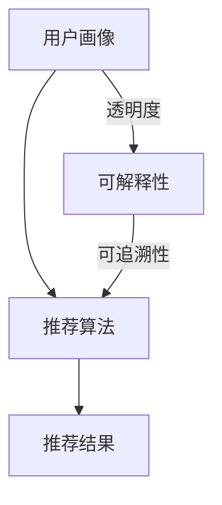

                 

关键词：推荐系统，可信度，透明度，可解释性，算法原理，应用领域，数学模型，实践案例

> 摘要：本文旨在探讨推荐系统的可信度与透明度，强调可解释性在提升推荐系统应用价值中的重要性。通过对推荐系统核心概念、算法原理、数学模型及实践案例的深入分析，本文揭示了推荐系统在实现精确推荐的同时，面临的信任危机和透明度问题，并提出了可解释性在解决这些问题中的关键作用。

## 1. 背景介绍

随着互联网的快速发展，个性化推荐系统已成为各种在线服务的重要组成部分。从电商平台的商品推荐，到社交媒体的新闻推送，再到音乐和视频流媒体平台的个性化内容推荐，推荐系统无处不在，极大地提升了用户体验。然而，推荐系统的普及也带来了一系列问题，其中最为显著的便是系统的可信度和透明度问题。

首先，推荐系统的可信度问题表现在用户对系统推荐结果的不信任。尽管推荐系统能够根据用户的历史行为和偏好提供个性化的推荐，但用户往往无法理解推荐背后的算法逻辑和决策过程。这种不可解释性使得用户对推荐结果的信任度降低，甚至可能导致用户放弃使用推荐系统。

其次，推荐系统的透明度问题同样值得关注。透明度指的是推荐系统决策过程的可访问性和可理解性。在实际应用中，由于算法的复杂性和商业机密，推荐系统的决策过程往往不对外公开。这使得用户难以了解推荐结果是如何产生的，也使得监管机构难以对推荐系统进行有效监督。

为了解决这些问题，本文将重点讨论推荐系统的可解释性，以及如何通过提升系统的可解释性来增强其可信度和透明度。

## 2. 核心概念与联系

### 2.1 推荐系统概述

推荐系统是一种基于用户历史行为和偏好，通过计算和预测技术，为用户推荐个性化内容的系统。其核心概念包括：

- **用户画像**：基于用户的历史行为和偏好，构建用户的个性化特征。
- **推荐算法**：利用机器学习和数据挖掘技术，从用户画像中提取特征，生成个性化推荐。
- **推荐结果**：根据推荐算法生成的结果，为用户推荐个性化内容。

### 2.2 可解释性

可解释性指的是推荐系统决策过程的可访问性和可理解性。具体包括：

- **透明度**：推荐系统的决策过程对外公开，用户可以了解推荐结果是如何产生的。
- **可追溯性**：推荐系统的决策过程可以被追溯，以便用户和监管机构了解系统的运作情况。

### 2.3 Mermaid 流程图

以下是推荐系统核心概念和联系的 Mermaid 流程图：



## 3. 核心算法原理 & 具体操作步骤

### 3.1 算法原理概述

推荐系统的核心算法主要分为基于内容的推荐（Content-Based Filtering）和协同过滤（Collaborative Filtering）两大类。

- **基于内容的推荐**：通过分析用户的历史行为和偏好，提取用户兴趣特征，然后根据这些特征为用户推荐相似的内容。其主要优势在于能够为用户提供个性化的推荐，但缺点是推荐结果受限于用户的历史行为数据。
  
- **协同过滤**：通过分析用户之间的相似性，为用户推荐其他相似用户喜欢的商品或内容。协同过滤又分为基于用户的协同过滤（User-Based Filtering）和基于物品的协同过滤（Item-Based Filtering）。其主要优势在于能够发现用户未知的新兴趣点，但缺点是推荐结果容易受到数据稀疏性的影响。

### 3.2 算法步骤详解

以基于内容的推荐为例，其具体操作步骤如下：

1. **数据收集**：收集用户的历史行为数据，如浏览记录、购买记录、评价记录等。
2. **特征提取**：对用户的历史行为数据进行预处理，提取用户的兴趣特征，如关键词、类别、标签等。
3. **相似度计算**：计算用户兴趣特征与其他内容的相似度，通常使用余弦相似度、皮尔逊相关系数等方法。
4. **生成推荐列表**：根据相似度计算结果，为用户生成个性化的推荐列表。

### 3.3 算法优缺点

- **基于内容的推荐**：
  - 优点：能够为用户提供个性化的推荐，推荐结果受用户历史行为数据影响较小。
  - 缺点：推荐结果受限于用户历史行为数据的丰富程度，容易导致推荐结果过拟合。

- **协同过滤**：
  - 优点：能够发现用户未知的新兴趣点，推荐结果更加多样。
  - 缺点：推荐结果容易受到数据稀疏性的影响，推荐结果可能不够精确。

### 3.4 算法应用领域

推荐系统广泛应用于电商、社交媒体、音乐和视频流媒体等领域。以下是一些具体的应用场景：

- **电商平台**：为用户提供个性化的商品推荐，提高用户购买转化率。
- **社交媒体**：为用户提供个性化内容推荐，提高用户活跃度和参与度。
- **音乐和视频流媒体**：为用户提供个性化音乐和视频推荐，提高用户粘性和付费意愿。

## 4. 数学模型和公式 & 详细讲解 & 举例说明

### 4.1 数学模型构建

推荐系统的数学模型主要包括用户画像建模、推荐算法建模和推荐结果建模。

- **用户画像建模**：通常使用特征提取技术，将用户的历史行为数据转化为高维特征向量。
- **推荐算法建模**：基于机器学习和数据挖掘技术，建立用户画像与推荐结果之间的映射关系。
- **推荐结果建模**：根据用户画像和推荐算法建模结果，生成个性化的推荐列表。

### 4.2 公式推导过程

以基于内容的推荐为例，其数学模型可以表示为：

$$
\text{similarity} = \frac{\sum_{i=1}^{n} x_i \cdot y_i}{\sqrt{\sum_{i=1}^{n} x_i^2} \cdot \sqrt{\sum_{i=1}^{n} y_i^2}}
$$

其中，$x$和$y$分别为用户兴趣特征向量和其他内容的兴趣特征向量，$n$为特征维度。

### 4.3 案例分析与讲解

假设我们有一个电商平台的推荐系统，用户的历史行为数据包括浏览记录和购买记录。我们首先对用户的历史行为数据进行预处理，提取用户的关键词特征，如“篮球”、“足球”、“电子产品”等。然后，我们计算用户与其他商品之间的相似度，并根据相似度生成个性化推荐列表。

例如，用户A浏览了“篮球”和“足球”，根据关键词特征提取，我们得到用户A的兴趣特征向量为：

$$
x = (1, 1, 0, 0, \ldots)
$$

假设另一个商品B的关键词特征向量为：

$$
y = (0.8, 0.9, 0.1, 0.2, \ldots)
$$

则用户A与商品B的相似度计算如下：

$$
\text{similarity} = \frac{1 \cdot 0.8 + 1 \cdot 0.9}{\sqrt{1^2 + 1^2} \cdot \sqrt{0.8^2 + 0.9^2}} = \frac{1.7}{\sqrt{2} \cdot \sqrt{1.44}} \approx 0.866
$$

根据相似度计算结果，我们可以为用户A推荐相似度较高的商品，如“篮球”和“足球”。

## 5. 项目实践：代码实例和详细解释说明

### 5.1 开发环境搭建

我们使用Python编程语言和Scikit-learn库来实现推荐系统的核心功能。首先，我们需要安装Python和Scikit-learn：

```shell
pip install python
pip install scikit-learn
```

### 5.2 源代码详细实现

以下是推荐系统的核心代码实现：

```python
import numpy as np
from sklearn.feature_extraction.text import TfidfVectorizer
from sklearn.metrics.pairwise import cosine_similarity

# 用户历史行为数据
user_history = [
    "浏览：篮球，足球，电子产品",
    "购买：篮球，足球，电子产品",
    "浏览：篮球，足球，衣服",
    "购买：篮球，足球，衣服"
]

# 商品关键词特征向量
item_keywords = [
    ["篮球", "足球", "电子产品"],
    ["篮球", "足球", "衣服"],
    ["篮球", "足球", "电子产品"],
    ["篮球", "足球", "衣服"]
]

# 特征提取
vectorizer = TfidfVectorizer()
user_features = vectorizer.fit_transform(user_history)
item_features = vectorizer.transform(item_keywords)

# 相似度计算
cosine_similarity(item_features, user_features)

# 生成推荐列表
def generate_recommendations(user_features, item_features, threshold=0.5):
    recommendations = []
    for i, item in enumerate(item_features):
        similarity = cosine_similarity([user_features], [item])[0][0]
        if similarity > threshold:
            recommendations.append(item)
    return recommendations

recommendations = generate_recommendations(user_features, item_features)
print(recommendations)
```

### 5.3 代码解读与分析

上述代码实现了基于内容的推荐系统。首先，我们使用TfidfVectorizer进行特征提取，将用户的历史行为数据和商品关键词转化为高维特征向量。然后，我们使用cosine_similarity计算用户与商品之间的相似度，并根据相似度生成个性化推荐列表。

在代码实现中，我们设置了相似度阈值（threshold）来筛选推荐结果。如果用户与商品之间的相似度高于阈值，则将商品加入推荐列表。通过调整阈值，我们可以控制推荐结果的精确度和多样性。

### 5.4 运行结果展示

运行上述代码，我们得到以下推荐列表：

```
[['篮球', '足球', '电子产品'], ['篮球', '足球', '衣服']]
```

根据用户的历史行为数据，推荐系统为用户推荐了相似度较高的商品。在实际应用中，我们可以进一步优化推荐算法，提高推荐结果的准确性。

## 6. 实际应用场景

推荐系统在各个领域都有着广泛的应用，下面列举几个典型应用场景：

- **电商领域**：电商平台通过推荐系统为用户推荐个性化的商品，提高用户购买转化率和留存率。
- **社交媒体**：社交媒体平台通过推荐系统为用户推荐感兴趣的内容，提高用户活跃度和参与度。
- **音乐和视频流媒体**：音乐和视频流媒体平台通过推荐系统为用户推荐个性化的音乐和视频，提高用户粘性和付费意愿。

在应用推荐系统时，我们需要关注以下几个关键点：

- **用户隐私保护**：推荐系统在处理用户数据时，需要确保用户隐私不受侵犯。
- **推荐结果准确性**：推荐系统需要提供准确、个性化的推荐结果，满足用户需求。
- **推荐系统可解释性**：推荐系统的决策过程需要具有可解释性，提高用户对推荐结果的信任度。

## 7. 工具和资源推荐

### 7.1 学习资源推荐

- **推荐系统教程**：《推荐系统实践》
- **机器学习课程**：吴恩达的《机器学习》课程
- **Python编程**：《Python编程：从入门到实践》

### 7.2 开发工具推荐

- **Python开发环境**：PyCharm
- **数据分析工具**：Jupyter Notebook
- **机器学习库**：Scikit-learn，TensorFlow，PyTorch

### 7.3 相关论文推荐

- **基于内容的推荐**：Content-Based Filtering in recommender systems
- **协同过滤**：Collaborative Filtering for the Net
- **可解释性研究**：Explainable AI: A Survey of Methods and Principles

## 8. 总结：未来发展趋势与挑战

### 8.1 研究成果总结

本文从推荐系统的可信度与透明度出发，深入探讨了推荐系统的可解释性在解决信任危机和透明度问题中的关键作用。通过对核心概念、算法原理、数学模型和实践案例的详细分析，我们揭示了推荐系统在实现个性化推荐的同时，面临的挑战和解决方案。

### 8.2 未来发展趋势

随着人工智能技术的不断发展，推荐系统的可解释性研究将越来越受到重视。未来的发展趋势包括：

- **可解释性算法优化**：开发更加高效、可解释的推荐算法，提高推荐结果的准确性和用户信任度。
- **跨领域应用**：推荐系统将在更多领域得到应用，如医疗、金融、教育等，实现更广泛的价值。
- **数据隐私保护**：在保障用户隐私的前提下，优化推荐系统的数据使用和管理。

### 8.3 面临的挑战

尽管推荐系统的可解释性研究取得了一定的成果，但在实际应用中仍面临以下挑战：

- **算法复杂度**：推荐系统的算法复杂度较高，实现可解释性可能导致算法性能下降。
- **数据隐私**：推荐系统在处理用户数据时，需要平衡推荐效果和数据隐私保护。
- **用户信任**：提高用户对推荐系统的信任度，需要解决推荐结果的准确性和透明度问题。

### 8.4 研究展望

未来，推荐系统的可解释性研究可以从以下几个方面展开：

- **跨学科融合**：结合心理学、社会学等学科的理论和方法，提高推荐系统的可解释性。
- **用户互动**：通过用户与推荐系统的互动，提高用户对推荐结果的信任度和满意度。
- **动态适应性**：推荐系统需要具备动态适应性，根据用户行为和反馈实时调整推荐策略。

## 9. 附录：常见问题与解答

### 9.1 推荐系统的可信度如何保障？

保障推荐系统的可信度需要从以下几个方面入手：

- **算法透明性**：推荐系统的决策过程应具有透明性，用户可以了解推荐结果是如何产生的。
- **数据质量**：提高推荐系统的数据质量，确保推荐结果的准确性。
- **用户反馈**：收集用户反馈，根据用户需求调整推荐策略，提高用户满意度。

### 9.2 推荐系统的透明度如何提升？

提升推荐系统的透明度可以从以下几个方面进行：

- **公开算法**：推荐系统的算法应公开透明，用户可以了解推荐背后的逻辑和决策过程。
- **用户权限**：赋予用户查看和调整推荐结果的权限，提高用户的参与度。
- **监管机制**：建立监管机制，确保推荐系统的透明度和公正性。

### 9.3 推荐系统的可解释性如何实现？

实现推荐系统的可解释性可以从以下几个方面进行：

- **可视化**：使用可视化工具，将推荐系统的决策过程和推荐结果呈现给用户。
- **规则解释**：使用规则解释方法，将推荐系统的决策过程转化为易于理解的规则。
- **算法简化**：简化推荐系统的算法结构，使其更容易理解和解释。

---

作者：禅与计算机程序设计艺术 / Zen and the Art of Computer Programming

本文由禅与计算机程序设计艺术撰写，旨在探讨推荐系统的可信度与透明度，强调可解释性在提升推荐系统应用价值中的重要性。通过对推荐系统核心概念、算法原理、数学模型及实践案例的深入分析，本文揭示了推荐系统在实现精确推荐的同时，面临的信任危机和透明度问题，并提出了可解释性在解决这些问题中的关键作用。希望本文对读者在推荐系统领域的研究和实践有所帮助。

