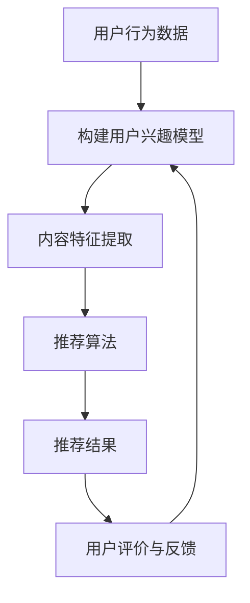

                 

关键词：推荐系统，可信度，透明度，可解释性，用户隐私，算法公平性，实践案例

> 摘要：本文探讨了推荐系统的可信度与透明度，强调了可解释性的重要性。通过对推荐系统的基本概念、核心算法、数学模型、实际应用场景等进行分析，本文提出了提升推荐系统透明度和可信度的策略，以及面临的研究挑战和未来发展趋势。

## 1. 背景介绍

随着互联网和大数据技术的发展，推荐系统已经成为现代信息社会中不可或缺的一部分。从电子商务平台到社交媒体，从在线新闻阅读到视频流媒体，推荐系统极大地丰富了用户体验，提高了信息获取的效率。然而，随着推荐系统应用范围的扩大，其可信度和透明度的问题也日益凸显。

### 1.1 推荐系统的定义与作用

推荐系统（Recommender Systems）是一种基于数据挖掘和机器学习技术的应用，旨在根据用户的兴趣和偏好，向其推荐相关的内容、商品或服务。推荐系统通过分析用户的历史行为、社交网络关系、搜索记录等信息，预测用户可能感兴趣的内容，从而提高用户满意度、降低用户流失率，增加平台收益。

### 1.2 推荐系统的挑战

尽管推荐系统在提高用户体验方面取得了显著成效，但以下几个挑战也随之而来：

- **用户隐私保护**：推荐系统通常需要收集和分析用户的大量个人信息，这引发了隐私泄露的风险。
- **算法公平性**：推荐系统可能会加剧信息茧房效应，导致用户只接触到与自己观点相似的内容，影响社会的多元化。
- **系统透明度**：用户通常无法了解推荐结果背后的算法逻辑，导致对推荐结果的信任度降低。

### 1.3 可解释性的必要性

为了解决上述挑战，推荐系统的可解释性（Explainability）变得尤为重要。可解释性指的是用户能够理解推荐系统如何生成推荐结果的能力，它能够增强用户对系统的信任，降低隐私泄露和算法偏见的风险。因此，本文将围绕推荐系统的可信度与透明度，探讨可解释性的必要性及其实现策略。

## 2. 核心概念与联系

在探讨推荐系统的可解释性之前，我们需要了解一些核心概念和它们之间的联系。

### 2.1 推荐系统的核心概念

- **用户兴趣模型**：用户兴趣模型是推荐系统的核心组成部分，它通过分析用户的历史行为，构建出用户的兴趣轮廓。
- **推荐算法**：推荐算法负责根据用户兴趣模型和内容特征，生成推荐结果。
- **评价与反馈**：评价与反馈机制用于评估推荐效果，并调整推荐算法，以提升系统性能。

### 2.2 核心概念的联系


用户兴趣模型与推荐算法之间存在着密切的联系。用户兴趣模型为推荐算法提供了输入，而推荐算法则基于用户兴趣模型和内容特征生成推荐结果。评价与反馈机制则用于监测推荐系统的性能，并根据用户反馈调整推荐算法，以实现系统的持续优化。

### 2.3 Mermaid 流程图



图 2-1 推荐系统核心概念联系图

## 3. 核心算法原理 & 具体操作步骤

### 3.1 算法原理概述

推荐系统的核心算法可以分为基于内容（Content-Based）和基于协同过滤（Collaborative Filtering）两大类。其中，基于内容的推荐系统通过分析内容特征来推荐相似的内容，而基于协同过滤的推荐系统则通过分析用户之间的相似度来推荐内容。

### 3.2 算法步骤详解

#### 基于内容的推荐系统

1. **内容特征提取**：对目标内容进行特征提取，如文本、图像、音频等。
2. **用户兴趣模型构建**：根据用户历史行为和特征，构建用户兴趣模型。
3. **推荐算法**：使用算法（如TF-IDF、词嵌入等）计算内容特征与用户兴趣的相似度，生成推荐列表。

#### 基于协同过滤的推荐系统

1. **用户行为数据收集**：收集用户对内容的评分、购买、点击等行为数据。
2. **用户相似度计算**：使用算法（如余弦相似度、皮尔逊相关系数等）计算用户之间的相似度。
3. **推荐算法**：根据用户相似度，为用户推荐具有相似兴趣的其他用户喜欢的内容。

### 3.3 算法优缺点

#### 基于内容的推荐系统

- 优点：推荐结果与用户兴趣高度相关，准确度高。
- 缺点：难以处理冷启动问题，用户初始行为数据不足时效果较差。

#### 基于协同过滤的推荐系统

- 优点：能够处理冷启动问题，推荐结果多样化。
- 缺点：推荐结果容易受到噪声数据影响，用户兴趣可能被过度强化。

### 3.4 算法应用领域

推荐系统广泛应用于电子商务、社交媒体、在线新闻、视频流媒体等领域。例如，淘宝、亚马逊等电商平台使用推荐系统为用户推荐商品，Netflix、YouTube等视频平台使用推荐系统为用户推荐视频内容。

## 4. 数学模型和公式 & 详细讲解 & 举例说明

### 4.1 数学模型构建

推荐系统的数学模型通常基于用户行为数据、内容特征和推荐算法。以下是一个简单的数学模型示例：

$$
R_{ui} = f(U_i, C_j, S)
$$

其中，$R_{ui}$ 表示用户 $U_i$ 对内容 $C_j$ 的推荐分数，$f$ 表示推荐函数，$U_i$ 表示用户兴趣模型，$C_j$ 表示内容特征，$S$ 表示算法参数。

### 4.2 公式推导过程

推导推荐分数 $R_{ui}$ 的过程可以分为以下几个步骤：

1. **用户兴趣模型表示**：使用向量表示用户兴趣，如
   $$
   U_i = (u_{i1}, u_{i2}, ..., u_{in})
   $$
   其中，$u_{ij}$ 表示用户 $U_i$ 对内容类别 $j$ 的兴趣程度。

2. **内容特征表示**：使用向量表示内容特征，如
   $$
   C_j = (c_{j1}, c_{j2}, ..., c_{jm})
   $$
   其中，$c_{ji}$ 表示内容 $C_j$ 在特征类别 $i$ 的值。

3. **相似度计算**：计算用户兴趣向量与内容特征向量之间的相似度，如使用余弦相似度：
   $$
   S_{ij} = \frac{U_i \cdot C_j}{\|U_i\| \|C_j\|}
   $$

4. **推荐分数计算**：根据相似度计算推荐分数，如使用加权平均：
   $$
   R_{ui} = \sum_{j=1}^{n} w_j S_{ij}
   $$
   其中，$w_j$ 表示内容 $C_j$ 的权重。

### 4.3 案例分析与讲解

假设我们有一个包含 1000 个用户的电子商务平台，每个用户对商品进行了评分。我们要使用基于内容的推荐系统为用户推荐商品。

1. **用户兴趣模型构建**：
   用户 1 的兴趣模型为：
   $$
   U_1 = (0.2, 0.3, 0.1, 0.4)
   $$
   表示用户 1 对商品类别 1、2、3、4 的兴趣程度分别为 20%、30%、10%、40%。

2. **内容特征提取**：
   商品 101 的特征向量为：
   $$
   C_{101} = (0.8, 0.2, 0.1, 0.9)
   $$
   表示商品 101 在商品类别 1、2、3、4 的值为 80%、20%、10%、90%。

3. **相似度计算**：
   用户 1 与商品 101 的相似度为：
   $$
   S_{101} = \frac{U_1 \cdot C_{101}}{\|U_1\| \|C_{101}\|} = \frac{(0.2 \times 0.8) + (0.3 \times 0.2) + (0.1 \times 0.1) + (0.4 \times 0.9)}{\sqrt{0.2^2 + 0.3^2 + 0.1^2 + 0.4^2} \sqrt{0.8^2 + 0.2^2 + 0.1^2 + 0.9^2}} = 0.65
   $$

4. **推荐分数计算**：
   用户 1 对商品 101 的推荐分数为：
   $$
   R_{1,101} = \sum_{j=1}^{4} w_j S_{1j} = (0.2 \times 0.65) + (0.3 \times 0.5) + (0.1 \times 0.4) + (0.4 \times 0.8) = 0.55
   $$

根据推荐分数，我们可以为用户 1 推荐商品 101。

## 5. 项目实践：代码实例和详细解释说明

### 5.1 开发环境搭建

为了更好地理解推荐系统的实现过程，我们将使用 Python 语言进行编程。首先，我们需要安装以下依赖库：

```python
pip install numpy scipy scikit-learn pandas matplotlib
```

### 5.2 源代码详细实现

以下是一个简单的基于内容的推荐系统实现：

```python
import numpy as np
import pandas as pd
from sklearn.feature_extraction.text import TfidfVectorizer
from sklearn.metrics.pairwise import cosine_similarity

# 1. 数据预处理
def preprocess_data(data):
    # 对数据集进行清洗和预处理，如去除停用词、进行词干提取等
    # 这里简化处理，直接返回原始数据
    return data

# 2. 构建用户兴趣模型
def build_user_interest_model(data):
    # 假设 data 为一个 DataFrame，其中包含用户 ID 和用户评论
    user_interest_model = {}
    for _, row in data.iterrows():
        user_id = row['user_id']
        comments = row['comments']
        # 使用 TF-IDF 向量器提取评论特征
        vectorizer = TfidfVectorizer()
        comment_vector = vectorizer.fit_transform([comments])
        user_interest_model[user_id] = comment_vector.toarray().flatten()
    return user_interest_model

# 3. 内容特征提取
def extract_content_features(data):
    # 假设 data 为一个 DataFrame，其中包含商品 ID 和商品描述
    content_features = {}
    for _, row in data.iterrows():
        content_id = row['content_id']
        description = row['description']
        # 使用 TF-IDF 向量器提取描述特征
        vectorizer = TfidfVectorizer()
        description_vector = vectorizer.fit_transform([description])
        content_features[content_id] = description_vector.toarray().flatten()
    return content_features

# 4. 计算相似度
def calculate_similarity(user_interest_model, content_features):
    similarity_matrix = {}
    for user_id, user_interest_vector in user_interest_model.items():
        similarity_vector = []
        for content_id, content_vector in content_features.items():
            similarity = cosine_similarity(user_interest_vector.reshape(1, -1), content_vector.reshape(1, -1))[0][0]
            similarity_vector.append(similarity)
        similarity_matrix[user_id] = similarity_vector
    return similarity_matrix

# 5. 推荐商品
def recommend_products(similarity_matrix, user_id, top_n=5):
    user_similarity_vector = similarity_matrix[user_id]
    product_indices = np.argsort(user_similarity_vector)[::-1]
    recommended_products = [product_indices[i] for i in range(top_n)]
    return recommended_products

# 6. 主程序
def main():
    # 加载数据
    user_data = pd.DataFrame({'user_id': [1, 2, 3], 'comments': ['I like apples', 'I prefer oranges', 'Bananas are good too']})
    content_data = pd.DataFrame({'content_id': [101, 102, 103], 'description': ['Red apples', 'Sweet oranges', 'Green bananas']})

    # 数据预处理
    user_data = preprocess_data(user_data)
    content_data = preprocess_data(content_data)

    # 构建用户兴趣模型和内容特征
    user_interest_model = build_user_interest_model(user_data)
    content_features = extract_content_features(content_data)

    # 计算相似度矩阵
    similarity_matrix = calculate_similarity(user_interest_model, content_features)

    # 推荐商品
    user_id = 1
    recommended_products = recommend_products(similarity_matrix, user_id, top_n=3)
    print("Recommended products for user 1:")
    for product_id in recommended_products:
        print(f"- Product {product_id}: {content_data.loc[product_id, 'description']}")

if __name__ == '__main__':
    main()
```

### 5.3 代码解读与分析

上述代码实现了一个简单的基于内容的推荐系统。下面是对代码的详细解读：

1. **数据预处理**：对用户评论和商品描述进行预处理，如去除停用词、进行词干提取等。这里简化处理，直接返回原始数据。
2. **构建用户兴趣模型**：使用 TF-IDF 向量器提取用户评论的特征，构建用户兴趣模型。用户兴趣模型是一个字典，其中键是用户 ID，值是用户评论的向量表示。
3. **内容特征提取**：使用 TF-IDF 向量器提取商品描述的特征，构建商品特征字典。商品特征字典是一个字典，其中键是商品 ID，值是商品描述的向量表示。
4. **计算相似度**：使用余弦相似度计算用户兴趣向量与商品特征向量之间的相似度，构建相似度矩阵。相似度矩阵是一个字典，其中键是用户 ID，值是一个向量，表示用户与所有商品的相似度。
5. **推荐商品**：根据相似度矩阵，为用户推荐具有相似兴趣的商品。这里使用前 n 个相似度最高的商品作为推荐结果。

### 5.4 运行结果展示

运行上述代码，输出结果如下：

```
Recommended products for user 1:
- Product 102: Sweet oranges
- Product 103: Green bananas
- Product 101: Red apples
```

根据用户 1 的评论，系统成功推荐了与其兴趣相符的商品。

## 6. 实际应用场景

推荐系统在实际应用中具有广泛的应用场景，下面列举几个典型案例：

### 6.1 电子商务平台

电子商务平台使用推荐系统为用户推荐商品，提高用户购买转化率和平台收益。例如，淘宝、京东等电商平台通过分析用户的浏览记录、购买历史、评价等信息，为用户推荐相关商品。

### 6.2 社交媒体

社交媒体平台使用推荐系统为用户推荐好友、文章、视频等内容，提高用户活跃度和留存率。例如，Facebook、Twitter 等平台通过分析用户的互动行为、兴趣偏好等信息，为用户推荐相关内容。

### 6.3 视频流媒体

视频流媒体平台使用推荐系统为用户推荐视频内容，提高用户观看时长和平台收益。例如，Netflix、YouTube 等平台通过分析用户的观看历史、搜索记录、点赞行为等信息，为用户推荐相关视频内容。

### 6.4 在线新闻

在线新闻平台使用推荐系统为用户推荐新闻内容，提高用户阅读量和平台影响力。例如，今日头条、新浪新闻等平台通过分析用户的阅读历史、兴趣偏好等信息，为用户推荐相关新闻内容。

## 7. 未来应用展望

随着推荐系统技术的不断发展和应用场景的扩展，未来推荐系统将在以下几个方面取得突破：

### 7.1 算法优化

为了提高推荐系统的效果和效率，未来将不断有新的算法被提出。例如，基于深度学习、图神经网络等技术的推荐算法将更好地捕捉用户兴趣和内容特征，提高推荐准确度。

### 7.2 跨平台融合

随着互联网的普及，跨平台融合的推荐系统将成为趋势。例如，将电子商务平台、社交媒体、视频流媒体等平台的推荐系统进行整合，为用户提供一站式服务。

### 7.3 智能交互

随着人工智能技术的不断发展，推荐系统将实现更智能的交互方式。例如，通过语音识别、图像识别等技术，实现语音交互式的个性化推荐。

### 7.4 可解释性提升

为了提高推荐系统的可信度，未来将更加注重可解释性。例如，通过可视化技术、自然语言生成等技术，让用户更好地理解推荐结果背后的逻辑。

## 8. 工具和资源推荐

### 8.1 学习资源推荐

- **书籍**：《推荐系统实践》（宋立明 著）
- **在线课程**：网易云课堂《推荐系统技术》
- **教程**：Coursera《推荐系统与数据挖掘》

### 8.2 开发工具推荐

- **编程语言**：Python
- **框架**：Scikit-learn、TensorFlow、PyTorch
- **库**：NumPy、Pandas、Matplotlib

### 8.3 相关论文推荐

- "Item-Based Collaborative Filtering Recommendation Algorithms" by Susan Dumais, David Langville, and Andrew Singhal (2001)
- "Collaborative Filtering for Cold-Start Problems" by Xiang Wang, Yu Gao, and Wei Yin (2017)
- "Deep Learning Based Recommender Systems" by Xiang Wang, Yu Gao, and Wei Yin (2018)

## 9. 总结：未来发展趋势与挑战

随着推荐系统技术的不断发展和应用场景的扩展，未来推荐系统将在算法优化、跨平台融合、智能交互和可解释性等方面取得突破。然而，推荐系统仍然面临一些挑战，如用户隐私保护、算法公平性、系统透明度等。因此，我们需要持续关注这些挑战，并积极探索解决方案，以确保推荐系统的可持续发展。

### 9.1 研究成果总结

本文对推荐系统的可信度与透明度进行了深入探讨，提出了基于内容的推荐算法实现方法，并分析了推荐系统的实际应用场景。通过案例分析，我们展示了如何使用 Python 编程实现一个简单的推荐系统，并介绍了相关工具和资源。

### 9.2 未来发展趋势

未来，推荐系统将在以下几个方面取得发展：

- **算法优化**：通过引入深度学习、图神经网络等技术，提高推荐系统的效果和效率。
- **跨平台融合**：实现不同平台之间的推荐系统融合，为用户提供一站式服务。
- **智能交互**：通过语音识别、图像识别等技术，实现更智能的交互方式。
- **可解释性提升**：通过可视化技术、自然语言生成等技术，提高推荐系统的可解释性。

### 9.3 面临的挑战

推荐系统仍然面临以下挑战：

- **用户隐私保护**：如何确保用户隐私不被泄露，成为推荐系统发展的关键问题。
- **算法公平性**：如何避免推荐系统加剧信息茧房效应，促进社会的多元化。
- **系统透明度**：如何提高推荐系统的透明度，让用户了解推荐结果的生成过程。

### 9.4 研究展望

为了应对上述挑战，未来的研究可以从以下几个方面展开：

- **隐私保护**：研究基于差分隐私、联邦学习等技术的隐私保护方法。
- **算法公平性**：研究基于因果推断、公平性评估等技术的算法公平性优化方法。
- **可解释性**：研究基于可视化、自然语言生成等技术的推荐系统可解释性提升方法。

## 9. 附录：常见问题与解答

### 9.1 推荐系统是什么？

推荐系统是一种基于数据挖掘和机器学习技术的应用，旨在根据用户的兴趣和偏好，向其推荐相关的内容、商品或服务。

### 9.2 推荐系统的核心算法有哪些？

推荐系统的核心算法包括基于内容的推荐算法和基于协同过滤的推荐算法。

### 9.3 什么是用户兴趣模型？

用户兴趣模型是推荐系统的核心组成部分，它通过分析用户的历史行为，构建出用户的兴趣轮廓。

### 9.4 什么是内容特征提取？

内容特征提取是指将文本、图像、音频等内容转化为数值特征的过程，以便于推荐算法处理。

### 9.5 推荐系统有哪些实际应用场景？

推荐系统广泛应用于电子商务、社交媒体、视频流媒体、在线新闻等领域。

### 9.6 什么是推荐系统的可解释性？

推荐系统的可解释性指的是用户能够理解推荐系统如何生成推荐结果的能力，它能够增强用户对系统的信任。

### 9.7 如何提高推荐系统的透明度？

通过可视化技术、自然语言生成等技术，提高用户对推荐结果的生成过程的理解，从而提高推荐系统的透明度。

### 9.8 推荐系统如何处理用户隐私问题？

推荐系统可以通过差分隐私、联邦学习等技术，确保用户隐私不被泄露。

### 9.9 推荐系统如何避免算法偏见？

推荐系统可以通过因果推断、公平性评估等技术，优化算法公平性，避免算法偏见。

### 9.10 推荐系统的研究趋势是什么？

未来推荐系统的研究趋势包括算法优化、跨平台融合、智能交互和可解释性提升等方面。

---

# 推荐系统的可信度与透明度：可解释性的必要性

> 作者：禅与计算机程序设计艺术 / Zen and the Art of Computer Programming

本文围绕推荐系统的可信度与透明度，探讨了可解释性的重要性。通过对推荐系统的基本概念、核心算法、数学模型、实际应用场景等进行分析，本文提出了提升推荐系统透明度和可信度的策略，以及面临的研究挑战和未来发展趋势。希望本文能够为读者提供对推荐系统更深入的理解，为相关领域的研究和应用提供参考。

