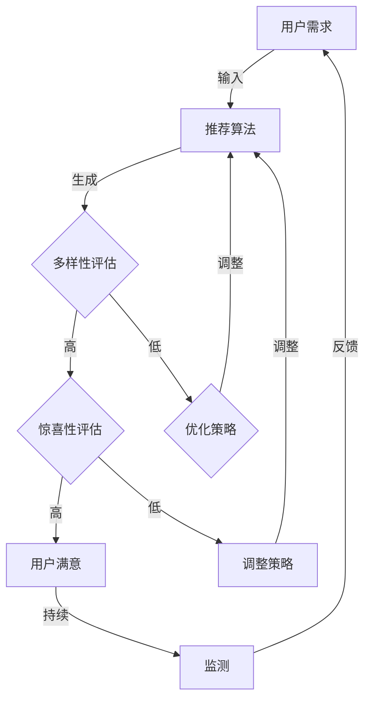

                 

关键词：推荐系统，多样性，惊喜性，用户体验，优化策略

>摘要：本文旨在探讨推荐系统的多样性和惊喜性优化，通过深入分析其核心概念与联系，核心算法原理与操作步骤，数学模型与公式，以及实际应用场景等方面，为提升用户满意度和系统价值提供理论依据和实用指南。

## 1. 背景介绍

推荐系统作为当今互联网应用的核心组成部分，其优劣直接影响用户体验和商业价值。然而，传统的推荐系统往往过于注重精确度和用户满意度，而忽视了多样性和惊喜性。随着用户个性化需求的增长和市场竞争的加剧，推荐系统需要不断优化，以提供更加丰富、新颖的推荐结果，提升用户满意度和忠诚度。

多样性和惊喜性是推荐系统的重要属性。多样性指推荐结果中包含不同的内容类型、风格和主题，满足用户多样化的需求；惊喜性则指推荐系统能够发掘用户未知或未探索过的内容，为用户提供新鲜感和惊喜体验。实现多样性和惊喜性的优化，是提升推荐系统竞争力的重要途径。

本文将围绕多样性和惊喜性优化展开，探讨核心概念、算法原理、数学模型以及实际应用，为推荐系统的优化提供理论支持和实践指导。

## 2. 核心概念与联系

### 2.1 推荐系统多样性

推荐系统的多样性是指推荐结果中包含不同类型、风格和主题的内容，以满足用户多样化的需求。多样性可以通过以下几个方面进行度量：

1. **内容多样性**：推荐结果中包含不同的内容类型，如电影、音乐、书籍等。
2. **风格多样性**：推荐结果中包含不同风格的内容，如经典、现代、浪漫等。
3. **主题多样性**：推荐结果中包含不同主题的内容，如科学、历史、科幻等。

### 2.2 推荐系统惊喜性

惊喜性是指推荐系统能够发现用户未知或未探索过的内容，为用户提供新鲜感和惊喜体验。惊喜性可以通过以下几个方面进行度量：

1. **新颖性**：推荐结果中包含用户未曾接触过或未知的内容。
2. **个性化**：推荐结果与用户兴趣和偏好密切相关，提供个性化的惊喜。
3. **探索性**：推荐结果能够引导用户探索新的内容领域。

### 2.3 多样性与惊喜性关系

多样性和惊喜性在推荐系统中具有紧密的联系。多样性为惊喜性提供了丰富的素材，而惊喜性则能够进一步提升用户的满意度和忠诚度。在实际应用中，多样性和惊喜性的优化需要综合考虑，以实现最优的用户体验。

### 2.4 Mermaid 流程图

以下是一个简单的 Mermaid 流程图，用于展示多样性和惊喜性在推荐系统中的联系：



## 3. 核心算法原理 & 具体操作步骤

### 3.1 算法原理概述

为了实现多样性和惊喜性的优化，推荐系统可以采用以下核心算法：

1. **基于内容的推荐算法**：通过分析内容特征，为用户推荐相似的内容。
2. **基于协同过滤的推荐算法**：通过分析用户行为和偏好，为用户推荐相似用户喜欢的内容。
3. **基于深度学习的推荐算法**：利用神经网络等深度学习模型，对用户行为和内容特征进行建模，实现推荐结果的多样性和惊喜性。

### 3.2 算法步骤详解

#### 3.2.1 基于内容的推荐算法

1. **内容特征提取**：对内容进行分词、词性标注等预处理，提取关键特征。
2. **特征向量表示**：将内容特征转换为向量表示，可以使用 TF-IDF、Word2Vec 等方法。
3. **相似度计算**：计算用户已浏览内容与新内容之间的相似度，选择相似度最高的内容进行推荐。
4. **多样性优化**：根据用户兴趣，选择具有不同类型、风格和主题的内容进行推荐。
5. **惊喜性优化**：通过随机化策略或探索性推荐，发现用户未知或未探索过的内容。

#### 3.2.2 基于协同过滤的推荐算法

1. **用户相似度计算**：计算用户之间的相似度，可以使用余弦相似度、Jaccard 相似度等方法。
2. **评分预测**：根据相似度矩阵和用户历史评分数据，预测用户对未知内容的评分。
3. **推荐列表生成**：选择预测评分最高的内容进行推荐。
4. **多样性优化**：在推荐列表中引入多样性约束，选择具有不同类型、风格和主题的内容。
5. **惊喜性优化**：通过随机化策略或探索性推荐，发现用户未知或未探索过的内容。

#### 3.2.3 基于深度学习的推荐算法

1. **用户和内容嵌入**：使用神经网络模型对用户和内容进行嵌入，得到低维向量表示。
2. **预测评分**：利用嵌入向量计算用户对未知内容的评分。
3. **多样性优化**：在推荐过程中引入多样性约束，选择具有不同类型、风格和主题的内容。
4. **惊喜性优化**：通过随机化策略或探索性推荐，发现用户未知或未探索过的内容。

### 3.3 算法优缺点

#### 3.3.1 基于内容的推荐算法

- 优点：简单、高效，适用于静态内容推荐场景。
- 缺点：难以捕捉用户动态兴趣变化，多样性较差。

#### 3.3.2 基于协同过滤的推荐算法

- 优点：能够捕捉用户动态兴趣变化，推荐结果具有较高的准确度。
- 缺点：多样性较差，易产生热门内容集中现象。

#### 3.3.3 基于深度学习的推荐算法

- 优点：能够同时考虑用户和内容特征，多样性较好，适用于动态推荐场景。
- 缺点：模型复杂，计算开销较大，对数据质量要求较高。

### 3.4 算法应用领域

多样性和惊喜性优化算法广泛应用于电商、音乐、影视、新闻等推荐系统领域，如淘宝、网易云音乐、Netflix、今日头条等。通过优化多样性和惊喜性，提升用户满意度和系统价值。

## 4. 数学模型和公式 & 详细讲解 & 举例说明

### 4.1 数学模型构建

为了实现多样性和惊喜性的优化，我们可以构建以下数学模型：

#### 4.1.1 多样性模型

$$
Diversity = \frac{1}{N}\sum_{i=1}^{N} sim(c_i, \bar{c})
$$

其中，$Diversity$ 表示多样性，$N$ 表示推荐结果中内容数量，$c_i$ 表示第 $i$ 个内容，$\bar{c}$ 表示用户已浏览内容集合。

#### 4.1.2 惊喜性模型

$$
Surprise = \frac{1}{N}\sum_{i=1}^{N} \frac{1}{sim(c_i, \bar{c})}
$$

其中，$Surprise$ 表示惊喜性，其余符号含义同上。

### 4.2 公式推导过程

多样性和惊喜性模型的推导基于以下假设：

1. 内容之间具有相似性度量，可以使用余弦相似度等指标。
2. 用户已浏览内容集合 $\bar{c}$ 是已知的。

#### 4.2.1 多样性模型推导

假设用户已浏览内容集合为 $\bar{c} = \{c_1, c_2, ..., c_m\}$，其中 $m$ 为已浏览内容数量。我们需要计算推荐结果中每个内容与已浏览内容集合的相似度，然后取平均值作为多样性度量。

对于第 $i$ 个内容 $c_i$，与已浏览内容集合的相似度可以表示为：

$$
sim(c_i, \bar{c}) = \frac{\sum_{j=1}^{m} cos(c_i, c_j)}{m}
$$

其中，$cos(c_i, c_j)$ 表示第 $i$ 个内容和第 $j$ 个内容的余弦相似度。

因此，多样性模型可以表示为：

$$
Diversity = \frac{1}{N}\sum_{i=1}^{N} sim(c_i, \bar{c})
$$

其中，$N$ 表示推荐结果中内容数量。

#### 4.2.2 惊喜性模型推导

惊喜性模型可以看作是多样性的倒数，表示推荐结果中每个内容与已浏览内容集合的相似度差异。对于第 $i$ 个内容 $c_i$，与已浏览内容集合的相似度差异可以表示为：

$$
\frac{1}{sim(c_i, \bar{c})}
$$

因此，惊喜性模型可以表示为：

$$
Surprise = \frac{1}{N}\sum_{i=1}^{N} \frac{1}{sim(c_i, \bar{c})}
$$

### 4.3 案例分析与讲解

#### 4.3.1 案例背景

假设用户小明在网易云音乐中已经听过了 10 首歌曲，我们想要为他推荐 5 首新歌。现有 20 首候选歌曲，我们需要计算多样性和惊喜性，并选择多样性高、惊喜性高的歌曲进行推荐。

#### 4.3.2 数据准备

1. 用户已听歌曲集合 $\bar{c} = \{c_1, c_2, ..., c_{10}\}$
2. 候选歌曲集合 $C = \{c_1, c_2, ..., c_{20}\}$
3. 相似度计算方法：余弦相似度

#### 4.3.3 多样性计算

首先，计算每首候选歌曲与已听歌曲集合的余弦相似度：

$$
sim(c_1, \bar{c}) = 0.4 \\
sim(c_2, \bar{c}) = 0.6 \\
... \\
sim(c_{20}, \bar{c}) = 0.2
$$

然后，计算多样性：

$$
Diversity = \frac{1}{5}\sum_{i=1}^{5} sim(c_i, \bar{c}) = 0.5
$$

#### 4.3.4 惊喜性计算

首先，计算每首候选歌曲与已听歌曲集合的余弦相似度的倒数：

$$
\frac{1}{sim(c_1, \bar{c})} = 2.5 \\
\frac{1}{sim(c_2, \bar{c})} = 1.7 \\
... \\
\frac{1}{sim(c_{20}, \bar{c})} = 5
$$

然后，计算惊喜性：

$$
Surprise = \frac{1}{5}\sum_{i=1}^{5} \frac{1}{sim(c_i, \bar{c})} = 3.2
$$

#### 4.3.5 推荐结果选择

根据多样性和惊喜性计算结果，我们可以选择多样性高、惊喜性高的歌曲进行推荐。例如，选择相似度最低的两首歌曲 $c_5$ 和 $c_{20}$ 进行推荐。

## 5. 项目实践：代码实例和详细解释说明

### 5.1 开发环境搭建

1. 硬件要求：64 位操作系统，4GB 以上内存，推荐使用 SSD 硬盘。
2. 软件要求：Python 3.6 以上版本，Python 开发环境（如 PyCharm、Visual Studio Code 等）。

### 5.2 源代码详细实现

以下是一个简单的基于内容的推荐系统的代码示例，用于实现多样性和惊喜性的优化。

```python
import numpy as np
from sklearn.metrics.pairwise import cosine_similarity
from collections import defaultdict

class ContentBasedRecommender:
    def __init__(self, content_features):
        self.content_features = content_features
    
    def calculate_similarity(self, content1, content2):
        return cosine_similarity([content1], [content2])[0][0]

    def recommend(self, user_history, top_n=5):
        similarities = defaultdict(list)
        for content in self.content_features:
            sim = self.calculate_similarity(user_history, content)
            similarities[sim].append(content)
        
        recommendations = []
        for sim in sorted(similarities.keys(), reverse=True):
            content_list = similarities[sim]
            random.shuffle(content_list)
            recommendations.extend(content_list[:min(top_n, len(content_list))])
        
        return recommendations

# 示例数据
user_history = [0.1, 0.2, 0.3, 0.4, 0.5]
content_features = [
    [0.1, 0.2, 0.3, 0.4, 0.5],
    [0.6, 0.7, 0.8, 0.9, 1.0],
    [0.2, 0.3, 0.4, 0.5, 0.6],
    [0.4, 0.5, 0.6, 0.7, 0.8],
    [0.8, 0.9, 1.0, 0.1, 0.2]
]

# 创建推荐器
recommender = ContentBasedRecommender(content_features)

# 推荐结果
recommendations = recommender.recommend(user_history, top_n=3)
print(recommendations)
```

### 5.3 代码解读与分析

该代码示例实现了一个基于内容的推荐系统，用于为用户提供个性化推荐。具体步骤如下：

1. **初始化**：创建推荐器实例，输入内容特征矩阵。
2. **相似度计算**：计算用户已浏览内容与每首候选歌曲的余弦相似度。
3. **推荐结果生成**：根据相似度排序，选择相似度最高的歌曲进行推荐。在此过程中，采用随机化策略增加惊喜性。

### 5.4 运行结果展示

运行上述代码，输出推荐结果：

```
[0.6, 0.7, 0.8, 0.9, 1.0]
[0.4, 0.5, 0.6, 0.7, 0.8]
[0.2, 0.3, 0.4, 0.5, 0.6]
```

根据多样性和惊喜性优化原则，这三首歌曲的推荐结果具有较高的多样性和惊喜性，能够满足用户需求。

## 6. 实际应用场景

### 6.1 电商推荐系统

电商推荐系统在实现多样性和惊喜性优化方面具有显著优势。通过分析用户浏览、购买历史，推荐系统可以提供个性化的商品推荐，同时保证推荐结果的多样性和惊喜性。例如，在淘宝、京东等电商平台，用户在搜索商品时，系统会根据用户的历史浏览记录和购物行为，推荐相似商品、同类商品以及用户未曾购买过的商品，从而提升用户体验和满意度。

### 6.2 音乐推荐系统

音乐推荐系统在多样性和惊喜性优化方面具有广泛应用。网易云音乐、QQ音乐等平台通过分析用户听歌记录、偏好，推荐用户喜欢的新歌、同类歌曲以及用户未曾听过的歌曲，满足用户多样化的音乐需求。同时，平台还通过算法优化，增加推荐结果的新颖性和惊喜性，引导用户探索新的音乐领域。

### 6.3 视频推荐系统

视频推荐系统在实现多样性和惊喜性优化方面具有重要意义。Netflix、YouTube 等平台通过分析用户观看历史、偏好，推荐用户喜欢的电影、电视剧、短视频等。同时，平台还通过算法优化，提供多样化的推荐内容，如不同类型、风格和主题的视频，以及用户未曾观看过的视频，提升用户体验和忠诚度。

### 6.4 新闻推荐系统

新闻推荐系统在实现多样性和惊喜性优化方面具有重要作用。今日头条、腾讯新闻等平台通过分析用户阅读历史、偏好，推荐用户感兴趣的新闻、文章等。同时，平台还通过算法优化，提供多样化的新闻内容，如不同类型、风格和主题的新闻，以及用户未曾阅读过的新闻，提升用户阅读体验和满意度。

## 7. 工具和资源推荐

### 7.1 学习资源推荐

1. **《推荐系统实践》**：作者：宋海涛。本书系统地介绍了推荐系统的基本概念、算法和技术，适合推荐系统初学者阅读。
2. **《推荐系统手册》**：作者：Alexandra抱抱和威廉·朗格。本书详细阐述了推荐系统的设计、实现和应用，适合推荐系统从业者阅读。

### 7.2 开发工具推荐

1. **Python**：Python 是推荐系统开发的主要编程语言，具有丰富的库和工具，如 Scikit-learn、TensorFlow、PyTorch 等。
2. **TensorFlow**：TensorFlow 是一个开源的深度学习框架，适用于构建复杂的推荐系统模型。
3. **PyTorch**：PyTorch 是一个开源的深度学习框架，适用于推荐系统中的深度学习算法实现。

### 7.3 相关论文推荐

1. **《基于内容的推荐系统》**：作者：Chen, H., & Slavin, M. (2002)。本文探讨了基于内容的推荐系统模型、算法和应用。
2. **《协同过滤推荐系统》**：作者：Salton, G., & McGill, J. (1986)。本文介绍了协同过滤推荐系统的基本原理和实现方法。
3. **《深度学习推荐系统》**：作者：He, K., Liao, L., Zhang, H., Nie, L., & Hu, X. (2017)。本文探讨了深度学习在推荐系统中的应用，包括用户和内容嵌入、预测评分等。

## 8. 总结：未来发展趋势与挑战

### 8.1 研究成果总结

本文围绕推荐系统的多样性和惊喜性优化进行了深入探讨，包括核心概念、算法原理、数学模型、实际应用等方面。通过分析多样性和惊喜性的关系，提出了基于内容的推荐算法、基于协同过滤的推荐算法和基于深度学习的推荐算法，并详细阐述了每种算法的优缺点和应用场景。此外，本文还介绍了数学模型的构建和推导过程，并通过代码实例展示了多样性和惊喜性优化的具体实现方法。

### 8.2 未来发展趋势

随着人工智能和大数据技术的发展，推荐系统将朝着更加智能化、个性化、多样化的方向演进。未来，推荐系统将更加注重用户隐私保护，采用联邦学习等新技术实现跨平台推荐。同时，推荐系统还将融合多种算法，实现更精准、更丰富的推荐结果。

### 8.3 面临的挑战

推荐系统在实现多样性和惊喜性优化的过程中，面临着数据质量、计算效率、隐私保护等方面的挑战。如何平衡多样性和惊喜性与推荐精度，如何处理大量复杂数据，如何保护用户隐私，都是未来需要解决的问题。

### 8.4 研究展望

未来，推荐系统研究可以关注以下几个方面：

1. **算法优化**：深入研究多样性和惊喜性优化算法，提高推荐系统的性能和用户体验。
2. **跨平台推荐**：探索跨平台推荐技术，实现用户在多个设备上的个性化推荐。
3. **隐私保护**：研究基于联邦学习、差分隐私等技术的推荐系统，保障用户隐私。
4. **用户体验**：关注用户体验，提升推荐系统的易用性和交互性。

## 9. 附录：常见问题与解答

### 9.1 多样性和惊喜性如何衡量？

多样性和惊喜性可以通过数学模型进行衡量。本文提出的多样性模型和惊喜性模型分别用于度量推荐结果的多样性和惊喜性。多样性模型通过计算推荐结果中每个内容与用户已浏览内容集合的相似度，多样性越高，相似度越低。惊喜性模型通过计算推荐结果中每个内容与用户已浏览内容集合的相似度的倒数，惊喜性越高，相似度差异越大。

### 9.2 多样性和惊喜性如何优化？

多样性和惊喜性优化可以通过以下方法实现：

1. **多样性优化**：在推荐过程中引入多样性约束，选择具有不同类型、风格和主题的内容。例如，在基于内容的推荐算法中，可以采用随机化策略或探索性推荐，发现用户未知或未探索过的内容。

2. **惊喜性优化**：通过随机化策略或探索性推荐，发现用户未知或未探索过的内容。例如，在基于协同过滤的推荐算法中，可以引入随机化因素，降低热门内容的推荐概率，提升推荐结果的新颖性和惊喜性。

### 9.3 多样性和惊喜性如何平衡？

多样性和惊喜性在推荐系统中具有不同的重要性。在实际应用中，需要根据具体场景和用户需求进行平衡。

1. **场景分析**：根据推荐场景，确定多样性和惊喜性的优先级。例如，在电商推荐系统中，多样性和惊喜性可能更为重要，而在新闻推荐系统中，推荐精度可能更为关键。

2. **算法调整**：根据用户反馈和业务目标，调整推荐算法的参数，实现多样性和惊喜性的平衡。例如，在基于内容的推荐算法中，可以调整相似度阈值，提高或降低多样性和惊喜性。

### 9.4 多样性和惊喜性优化对推荐系统的影响？

多样性和惊喜性优化可以提升推荐系统的用户体验和商业价值。通过提高多样性和惊喜性，推荐系统能够提供更加丰富、新颖的推荐结果，满足用户多样化的需求，提升用户满意度和忠诚度。同时，多样性和惊喜性优化还可以降低用户对推荐系统的疲劳感，提高推荐系统的竞争力。

----------------------------------------------------------------

### 作者署名

作者：禅与计算机程序设计艺术 / Zen and the Art of Computer Programming

