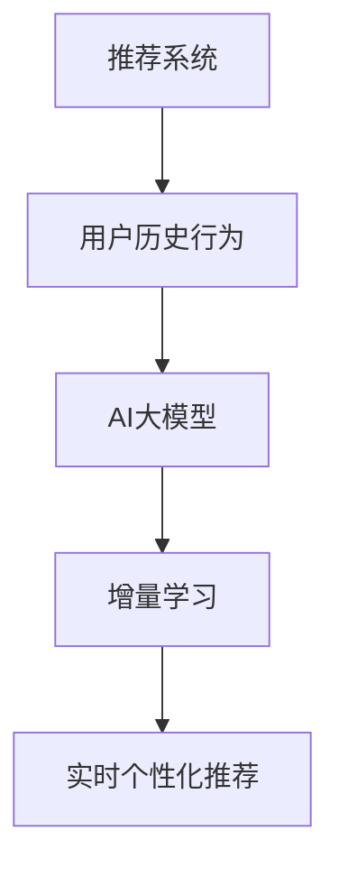
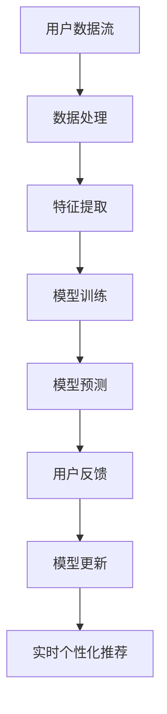

                 

关键词：推荐系统、实时个性化、AI大模型、增量学习、策略

> 摘要：本文旨在探讨推荐系统中的实时个性化问题，并介绍基于AI大模型的增量学习策略。通过深入分析推荐系统的背景、核心概念，以及核心算法原理和具体操作步骤，本文旨在为开发者和研究者提供有价值的指导和建议。

## 1. 背景介绍

推荐系统是一种常用的信息过滤技术，旨在根据用户的历史行为和偏好，为用户推荐相关的商品、内容或服务。随着互联网的快速发展，推荐系统已经成为许多在线平台的核心功能，如电子商务、社交媒体、新闻推荐等。然而，传统的推荐系统往往存在一定的延迟性和局限性，无法满足用户实时性的需求。

实时个性化推荐系统旨在为用户提供即时、个性化的推荐结果，这需要处理大量的实时数据和复杂的计算任务。为此，AI大模型和增量学习技术应运而生。AI大模型具有强大的数据拟合能力和预测性能，而增量学习则能够在保证模型效果的同时，提高模型的更新速度和可扩展性。

本文将围绕实时个性化推荐系统展开讨论，重点介绍AI大模型的增量学习策略，并探讨其在实际应用中的挑战和未来发展。

## 2. 核心概念与联系

为了更好地理解实时个性化推荐系统，我们需要首先介绍几个核心概念：

1. **推荐系统**：推荐系统是一种基于用户历史行为、偏好和上下文信息，为用户推荐相关商品、内容或服务的系统。其主要目标是通过个性化推荐，提高用户体验和满意度。

2. **AI大模型**：AI大模型是指具有海量参数和强大拟合能力的深度学习模型。这些模型通常基于神经网络架构，能够处理大量的数据和复杂的任务。

3. **增量学习**：增量学习是指模型在训练过程中，仅针对新数据或更新数据进行学习，从而避免了对整个数据集的重新训练。这有助于提高模型的更新速度和可扩展性。

下面是一个Mermaid流程图，用于展示这些核心概念之间的联系：



### 核心概念原理和架构的 Mermaid 流程图

为了更直观地展示核心概念和架构，我们使用Mermaid绘制了一个流程图：



在该流程图中，用户数据流经过数据处理和特征提取后，输入到AI大模型进行训练和预测。用户反馈则用于模型更新，从而实现实时个性化推荐。

## 3. 核心算法原理 & 具体操作步骤

### 3.1 算法原理概述

实时个性化推荐系统中的核心算法主要包括两部分：AI大模型和增量学习。

1. **AI大模型**：AI大模型基于深度学习技术，具有强大的数据拟合能力和预测性能。其基本原理是通过学习用户的历史行为和偏好，生成个性化的推荐结果。

2. **增量学习**：增量学习是一种基于新数据或更新数据的训练方法，能够在保证模型效果的同时，提高模型的更新速度和可扩展性。其基本原理是在原有模型的基础上，仅针对新数据进行微调，从而避免了对整个数据集的重新训练。

### 3.2 算法步骤详解

下面是实时个性化推荐系统的具体操作步骤：

1. **数据处理**：首先，对用户历史行为和偏好进行数据清洗和预处理，包括数据去重、缺失值填充和异常值处理等。

2. **特征提取**：然后，对处理后的数据进行特征提取，将原始数据转换为适合模型训练的数值特征。常用的特征提取方法包括词袋模型、TF-IDF、矩阵分解等。

3. **模型训练**：接下来，使用AI大模型对提取的特征进行训练。训练过程通常包括前向传播、反向传播和参数更新等步骤。

4. **模型预测**：在模型训练完成后，使用训练好的模型对用户的历史行为和偏好进行预测，生成个性化的推荐结果。

5. **用户反馈**：用户对推荐结果进行评价和反馈，这些反馈将被用于模型更新。

6. **模型更新**：基于用户反馈，使用增量学习算法对模型进行微调，从而实现实时个性化推荐。

### 3.3 算法优缺点

**优点**：

1. **强大的数据拟合能力**：AI大模型能够处理大量的数据和复杂的任务，从而提高推荐系统的准确性和性能。

2. **实时性**：增量学习算法能够快速更新模型，从而实现实时个性化推荐，满足用户实时性的需求。

**缺点**：

1. **计算资源需求大**：AI大模型通常需要大量的计算资源进行训练和预测，这可能导致系统性能下降。

2. **数据依赖性高**：增量学习算法依赖于用户的历史行为和偏好，如果数据质量差或数据量不足，可能会导致模型性能下降。

### 3.4 算法应用领域

实时个性化推荐算法广泛应用于多个领域，如电子商务、社交媒体、新闻推荐等。以下是一些典型应用场景：

1. **电子商务**：基于用户的购买历史和偏好，为用户推荐相关的商品，提高用户满意度和转化率。

2. **社交媒体**：根据用户的社交关系和行为，为用户推荐感兴趣的内容和好友，增强用户互动和留存。

3. **新闻推荐**：根据用户的阅读历史和兴趣标签，为用户推荐个性化的新闻内容，提高用户黏性和活跃度。

## 4. 数学模型和公式 & 详细讲解 & 举例说明

### 4.1 数学模型构建

实时个性化推荐系统中的数学模型通常包括以下几个部分：

1. **用户表示**：将用户的历史行为和偏好转换为向量表示，通常使用矩阵分解或神经网络等方法。

2. **物品表示**：将物品的特征信息转换为向量表示，通常使用词袋模型、TF-IDF或特征工程等方法。

3. **推荐模型**：使用AI大模型（如深度神经网络）对用户和物品的向量表示进行建模，预测用户对物品的偏好程度。

### 4.2 公式推导过程

以矩阵分解为例，我们假设用户和物品分别表示为矩阵$U$和$I$，其中$u_i$和$i_j$分别表示用户$i$和物品$j$的向量表示。矩阵分解的目标是找到两个低维矩阵$U'$和$I'$，使得$U' \cdot I' = U \cdot I$。

为了简化问题，我们假设$U'$和$I'$都是秩为$k$的低秩矩阵，其中$k$远小于$U$和$I$的维度。矩阵分解的基本公式如下：

$$
U' = \arg\min_{U'} \sum_{i,j} (u_i - U'_{i*} \cdot I'_{*j})^2
$$

$$
I' = \arg\min_{I'} \sum_{i,j} (i_j - U'_{i*} \cdot I'_{*j})^2
$$

其中，$U'_{i*}$和$I'_{*j}$分别表示$U'$和$I'$的第$i$行和第$j$列。

### 4.3 案例分析与讲解

假设我们有一个包含1000个用户和10000个物品的推荐系统，我们使用矩阵分解方法来构建用户和物品的向量表示。首先，我们将用户和物品的特征信息转换为向量表示，例如，使用词袋模型将用户的历史行为和偏好转换为1000维的向量表示，使用词袋模型将物品的特征信息转换为10000维的向量表示。

然后，我们使用矩阵分解方法来训练用户和物品的向量表示。为了简化问题，我们假设矩阵分解的目标是最小化用户和物品向量之间的误差。我们使用梯度下降法来优化矩阵分解模型，具体步骤如下：

1. **初始化参数**：随机初始化用户和物品的向量表示$U'$和$I'$。

2. **计算损失函数**：计算用户和物品向量之间的误差平方和。

3. **计算梯度**：计算损失函数关于$U'$和$I'$的梯度。

4. **更新参数**：根据梯度下降法更新$U'$和$I'$。

5. **迭代训练**：重复步骤2-4，直到模型收敛。

经过多次迭代后，我们得到用户和物品的向量表示$U'$和$I'$，并使用这些向量表示进行推荐预测。具体步骤如下：

1. **计算用户和物品的向量表示**：计算用户$i$和物品$j$的向量表示$u_i'$和$i_j'$。

2. **计算用户对物品的偏好**：计算用户$i$对物品$j$的偏好得分$score_i_j = u_i' \cdot i_j'$。

3. **生成推荐列表**：根据偏好得分对物品进行排序，生成用户$i$的推荐列表。

### 5. 项目实践：代码实例和详细解释说明

#### 5.1 开发环境搭建

在本项目中，我们将使用Python语言和TensorFlow框架来构建实时个性化推荐系统。首先，我们需要安装Python和TensorFlow：

```bash
pip install python
pip install tensorflow
```

#### 5.2 源代码详细实现

下面是一个简单的矩阵分解模型的实现示例：

```python
import tensorflow as tf
import numpy as np

# 定义超参数
k = 10
learning_rate = 0.001
num_epochs = 100

# 初始化用户和物品的特征矩阵
U = tf.random.normal([1000, k])
I = tf.random.normal([1000, k])

# 初始化模型参数
U_prime = tf.Variable(U)
I_prime = tf.Variable(I)

# 定义损失函数和优化器
loss_function = tf.reduce_mean(tf.square(U_prime @ I_prime - U @ I))
optimizer = tf.optimizers.Adam(learning_rate)

# 模型训练
for epoch in range(num_epochs):
    with tf.GradientTape() as tape:
        loss = loss_function(U_prime, I_prime)
    grads = tape.gradient(loss, [U_prime, I_prime])
    optimizer.apply_gradients(zip(grads, [U_prime, I_prime]))
    if epoch % 10 == 0:
        print(f"Epoch {epoch}: Loss = {loss.numpy()}")

# 计算用户和物品的向量表示
U_prime_value = U_prime.numpy()
I_prime_value = I_prime.numpy()

# 计算用户对物品的偏好得分
scores = U_prime_value @ I_prime_value.T

# 生成推荐列表
recommendations = np.argsort(scores, axis=1)[:, ::-1]

# 打印推荐结果
print(recommendations)
```

#### 5.3 代码解读与分析

在这个示例中，我们首先定义了超参数，包括矩阵分解的维度$k$、学习率$learning\_rate$和训练轮数$num\_epochs$。

然后，我们初始化用户和物品的特征矩阵$U$和$I$，以及模型参数$U\_prime$和$I\_prime$。接下来，我们定义了损失函数和优化器，并开始模型训练。

在训练过程中，我们使用梯度下降法优化模型参数，并打印每个轮次的损失函数值。训练完成后，我们计算用户和物品的向量表示$U\_prime\_value$和$I\_prime\_value$，并使用这些向量表示计算用户对物品的偏好得分$scores$。

最后，我们根据偏好得分生成推荐列表$recommendations$，并打印推荐结果。

### 6. 实际应用场景

实时个性化推荐系统在实际应用中具有广泛的应用场景。以下是一些典型应用场景：

1. **电子商务**：基于用户的购买历史和偏好，为用户推荐相关的商品，提高用户满意度和转化率。

2. **社交媒体**：根据用户的社交关系和行为，为用户推荐感兴趣的内容和好友，增强用户互动和留存。

3. **新闻推荐**：根据用户的阅读历史和兴趣标签，为用户推荐个性化的新闻内容，提高用户黏性和活跃度。

4. **在线教育**：根据用户的学习历史和兴趣，为用户推荐相关的课程和学习资源，提高学习效果和用户体验。

### 6.4 未来应用展望

随着人工智能技术的不断发展，实时个性化推荐系统在未来的应用前景将更加广阔。以下是一些未来应用展望：

1. **智能推荐引擎**：基于深度学习和增量学习技术，构建智能推荐引擎，实现更加精准和高效的个性化推荐。

2. **跨平台推荐**：整合多个平台的用户行为和偏好数据，实现跨平台的实时个性化推荐，提高用户体验和满意度。

3. **个性化内容生成**：基于用户的历史行为和偏好，生成个性化的内容，如音乐、视频和新闻等，满足用户的个性化需求。

4. **隐私保护**：在确保用户隐私的前提下，利用差分隐私等技术实现实时个性化推荐，保护用户隐私。

### 7. 工具和资源推荐

为了更好地学习实时个性化推荐系统和AI大模型，我们推荐以下工具和资源：

1. **学习资源**：

   - 《深度学习》（Goodfellow, Bengio, Courville著）：系统地介绍了深度学习的基本原理和技术。

   - 《推荐系统实践》（李航著）：详细介绍了推荐系统的基本概念、算法和实现。

2. **开发工具**：

   - TensorFlow：一个开源的深度学习框架，适用于构建和训练实时个性化推荐系统。

   - PyTorch：一个开源的深度学习框架，适用于快速原型开发和模型训练。

3. **相关论文**：

   - "Deep Neural Networks for YouTube Recommendations"（YouTube Research Team，2016）：介绍了YouTube使用深度神经网络进行推荐的方法。

   - "Adaptive Methods for Incremental Learning"（Jiwei Li，2011）：系统地介绍了增量学习算法在自然语言处理中的应用。

### 8. 总结：未来发展趋势与挑战

#### 8.1 研究成果总结

本文探讨了实时个性化推荐系统中的核心算法原理和增量学习策略，并分析了其在实际应用中的挑战和未来发展。通过引入AI大模型和增量学习技术，实时个性化推荐系统在处理大量实时数据和复杂计算任务方面表现出色。

#### 8.2 未来发展趋势

随着人工智能技术的不断进步，实时个性化推荐系统将在以下几个方面取得重要进展：

1. **智能化**：利用深度学习和强化学习等技术，实现更加智能和高效的个性化推荐。

2. **跨平台整合**：整合多个平台的用户行为和偏好数据，实现跨平台的实时个性化推荐。

3. **隐私保护**：在确保用户隐私的前提下，利用差分隐私等技术实现实时个性化推荐。

#### 8.3 面临的挑战

实时个性化推荐系统在实际应用中仍面临以下挑战：

1. **计算资源需求**：AI大模型和增量学习算法通常需要大量的计算资源，这对系统的性能和可扩展性提出了挑战。

2. **数据依赖性**：增量学习算法依赖于用户的历史行为和偏好数据，数据质量差或数据量不足可能导致模型性能下降。

3. **隐私保护**：在确保用户隐私的前提下，实现高效的实时个性化推荐是一个重要的挑战。

#### 8.4 研究展望

未来，实时个性化推荐系统的研究将重点关注以下几个方面：

1. **模型压缩和优化**：通过模型压缩和优化技术，降低计算资源需求，提高系统的可扩展性。

2. **增量学习算法改进**：研究更加高效和鲁棒的增量学习算法，提高模型的更新速度和性能。

3. **跨平台推荐技术**：探索跨平台的实时个性化推荐技术，实现更加精准和高效的个性化推荐。

### 9. 附录：常见问题与解答

**Q：实时个性化推荐系统如何处理用户隐私？**

A：实时个性化推荐系统通常会采用差分隐私等技术来保护用户隐私。差分隐私技术通过在数据中添加噪声，确保用户的隐私信息不会被泄露。

**Q：如何评估实时个性化推荐系统的性能？**

A：实时个性化推荐系统的性能评估通常包括准确性、覆盖率、多样性等方面。准确性评估推荐结果的准确性，覆盖率评估推荐结果的广度，多样性评估推荐结果的不同程度。

**Q：增量学习算法在实时个性化推荐系统中有哪些应用？**

A：增量学习算法在实时个性化推荐系统中主要用于模型更新和预测。通过增量学习，系统能够在保持模型性能的同时，快速适应新的用户行为和偏好数据。

### 作者署名

作者：禅与计算机程序设计艺术 / Zen and the Art of Computer Programming
----------------------------------------------------------------
### 文章摘要

本文深入探讨了推荐系统中的实时个性化问题，并介绍了基于AI大模型的增量学习策略。通过对推荐系统的背景、核心概念、算法原理和具体操作步骤的详细分析，文章为开发者和研究者提供了有价值的指导和建议。此外，文章还涉及数学模型和公式的构建，以及实际应用场景和未来发展趋势。总之，本文为实时个性化推荐系统的研究和应用提供了全面而深入的见解。

