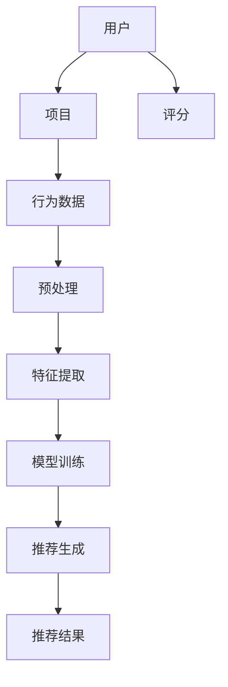

                 

推荐系统是现代信息社会中的一项核心技术，它广泛应用于电子商务、社交媒体、内容推荐等多个领域。然而，推荐系统并非完美无缺，其局限性，如过拟合、偏见和多样性推荐等问题，正逐渐引起学术界和工业界的广泛关注。本文将深入探讨这些局限，并提出相应的解决方案。

## 关键词：推荐系统，过拟合，偏见，多样性推荐

## 摘要：

本文首先介绍了推荐系统的基本概念和核心原理，然后详细分析了推荐系统中存在的过拟合、偏见和多样性推荐问题。通过具体的算法原理和数学模型，我们探讨了这些问题的成因及其对推荐效果的影响。最后，文章提出了改进推荐系统多样性和减少偏见的一些方法，并对未来的研究方向进行了展望。

## 1. 背景介绍

推荐系统（Recommender Systems）是一种信息过滤技术，旨在根据用户的历史行为和偏好，向用户提供相关的信息或商品推荐。随着互联网的普及和大数据技术的应用，推荐系统已经成为现代信息社会中不可或缺的一部分。从电子商务平台到社交媒体，从在线新闻阅读到音乐流媒体，推荐系统无处不在，极大地提升了用户体验和信息获取效率。

推荐系统的发展历程可以追溯到20世纪90年代。早期的推荐系统主要基于协同过滤（Collaborative Filtering）技术，通过收集用户的历史行为数据来预测用户对新项目的兴趣。随着机器学习技术的兴起，基于模型的推荐系统逐渐成为主流。这些系统通过构建用户和项目之间的潜在特征空间，利用复杂的机器学习算法进行推荐。

尽管推荐系统取得了显著的成功，但其在实际应用中仍然面临诸多挑战。本文将重点关注以下三个关键问题：

1. 过拟合（Overfitting）：推荐系统可能会过度适应训练数据，导致对新数据的泛化能力下降。
2. 偏见（Bias）：推荐系统可能因为数据集的不平衡或算法的设计缺陷，导致对某些用户群体或内容的偏见。
3. 多样性推荐（Diversity Recommendation）：推荐系统需要提供多样化的推荐结果，以满足用户多样化的兴趣和需求。

## 2. 核心概念与联系

### 2.1 推荐系统的基本概念

推荐系统主要包括三个核心概念：用户（User）、项目（Item）和评分（Rating）。用户是指使用推荐系统的个体，项目是指推荐系统中的对象，如商品、新闻、音乐等。评分是用户对项目的评价，可以是显式评分（如评分5星），也可以是隐式评分（如购买行为、浏览时长等）。

### 2.2 推荐系统的架构

推荐系统通常由数据收集、数据处理、模型训练和推荐生成四个主要模块组成。数据收集模块负责收集用户行为数据和项目特征信息。数据处理模块对原始数据进行预处理，如去噪、归一化和特征提取。模型训练模块使用机器学习算法训练推荐模型。推荐生成模块根据用户的当前状态和模型输出，生成推荐结果。

### 2.3 Mermaid 流程图

下面是推荐系统核心概念的 Mermaid 流程图：



## 3. 核心算法原理 & 具体操作步骤

### 3.1 算法原理概述

推荐系统的主要算法可以分为基于协同过滤的推荐系统和基于内容的推荐系统。

**协同过滤（Collaborative Filtering）**：协同过滤通过分析用户之间的相似性来推荐项目。其核心思想是“物以类聚，人以群分”。协同过滤分为两种：基于用户的协同过滤（User-based Collaborative Filtering）和基于项目的协同过滤（Item-based Collaborative Filtering）。

**基于内容的推荐（Content-based Filtering）**：基于内容的推荐通过分析项目的内容特征和用户的偏好特征来推荐项目。其核心思想是“内容决定兴趣”。基于内容的推荐通常涉及特征提取和相似度计算。

### 3.2 算法步骤详解

**协同过滤：**

1. **用户相似性计算**：计算用户之间的相似度，常用的相似度度量方法包括余弦相似度、皮尔逊相关系数等。
2. **项目相似性计算**：计算项目之间的相似度，常用的方法包括TF-IDF、余弦相似度等。
3. **推荐生成**：根据用户相似度和项目相似度，生成推荐结果。

**基于内容的推荐：**

1. **特征提取**：提取用户和项目的特征信息，如用户的历史行为、项目的内容标签等。
2. **相似度计算**：计算用户和项目之间的相似度，常用的相似度度量方法包括余弦相似度、欧氏距离等。
3. **推荐生成**：根据用户和项目的相似度，生成推荐结果。

### 3.3 算法优缺点

**协同过滤：**

优点：

- 简单高效，容易实现。
- 对新用户和新项目的适应能力强。

缺点：

- 过度依赖用户行为数据，对稀疏数据集效果较差。
- 易受噪声数据影响，可能导致推荐结果不准确。

**基于内容的推荐：**

优点：

- 对稀疏数据集有较好的适应性。
- 能够提供基于内容的个性化推荐。

缺点：

- 对新用户和新项目可能无推荐结果。
- 对用户兴趣变化的适应性较差。

### 3.4 算法应用领域

协同过滤和基于内容的推荐系统广泛应用于电子商务、社交媒体、内容推荐等领域。在电子商务中，推荐系统可以帮助用户发现感兴趣的商品；在社交媒体中，推荐系统可以推荐用户可能感兴趣的内容；在内容推荐中，推荐系统可以推荐用户可能感兴趣的新闻、音乐、视频等。

## 4. 数学模型和公式 & 详细讲解 & 举例说明

### 4.1 数学模型构建

**协同过滤：**

设用户集合为 \( U \)，项目集合为 \( I \)，用户 \( u \) 对项目 \( i \) 的评分为 \( r_{ui} \)。用户 \( u \) 和用户 \( v \) 的相似度 \( sim(u, v) \) 可以用以下公式计算：

\[ sim(u, v) = \frac{\sum_{i \in I} r_{ui} r_{vi}}{\sqrt{\sum_{i \in I} r_{ui}^2} \sqrt{\sum_{i \in I} r_{vi}^2}} \]

用户 \( u \) 对未评分项目 \( i \) 的预测评分 \( \hat{r}_{ui} \) 可以用以下公式计算：

\[ \hat{r}_{ui} = \frac{\sum_{v \in N(u)} sim(u, v) r_{vi}}{1 + \sum_{v \in N(u)} sim(u, v)} \]

其中，\( N(u) \) 是用户 \( u \) 的邻居集合。

**基于内容的推荐：**

设用户 \( u \) 的特征向量为 \( \mathbf{x}_u \)，项目 \( i \) 的特征向量为 \( \mathbf{x}_i \)。用户 \( u \) 和项目 \( i \) 之间的相似度 \( sim(u, i) \) 可以用以下公式计算：

\[ sim(u, i) = \frac{\mathbf{x}_u \cdot \mathbf{x}_i}{\lVert \mathbf{x}_u \rVert \lVert \mathbf{x}_i \rVert} \]

用户 \( u \) 对未评分项目 \( i \) 的预测评分 \( \hat{r}_{ui} \) 可以用以下公式计算：

\[ \hat{r}_{ui} = \mathbf{x}_u \cdot \mathbf{x}_i \]

### 4.2 公式推导过程

**协同过滤：**

用户相似度的计算基于用户之间的评分一致性。假设用户 \( u \) 和用户 \( v \) 在共同评分的项目 \( i \) 上具有相同的评分 \( r_{ui} = r_{vi} \)，则用户相似度可以表示为：

\[ sim(u, v) = \frac{r_{ui} r_{vi}}{\sqrt{r_{ui}^2 + r_{ui}^2} \sqrt{r_{vi}^2 + r_{vi}^2}} = \frac{r_{ui} r_{vi}}{\sqrt{2(r_{ui}^2 + r_{vi}^2)}} \]

为了简化计算，我们可以使用归一化的评分 \( r'_{ui} = r_{ui} / \sqrt{2} \)，则用户相似度可以简化为：

\[ sim(u, v) = \frac{r'_{ui} r'_{vi}}{\sqrt{r'_{ui}^2 + r'_{vi}^2}} \]

用户 \( u \) 对未评分项目 \( i \) 的预测评分可以通过加权平均其邻居的评分得到：

\[ \hat{r}_{ui} = \frac{\sum_{v \in N(u)} sim(u, v) r_{vi}}{1 + \sum_{v \in N(u)} sim(u, v)} \]

**基于内容的推荐：**

用户和项目之间的相似度可以通过计算用户和项目特征向量的余弦相似度得到。假设用户 \( u \) 和项目 \( i \) 的特征向量分别为 \( \mathbf{x}_u \) 和 \( \mathbf{x}_i \)，则用户和项目之间的相似度可以表示为：

\[ sim(u, i) = \frac{\mathbf{x}_u \cdot \mathbf{x}_i}{\lVert \mathbf{x}_u \rVert \lVert \mathbf{x}_i \rVert} \]

其中，\( \lVert \mathbf{x}_u \rVert \) 和 \( \lVert \mathbf{x}_i \rVert \) 分别表示用户和项目的特征向量范数。

用户 \( u \) 对未评分项目 \( i \) 的预测评分可以通过计算用户和项目特征向量的点积得到：

\[ \hat{r}_{ui} = \mathbf{x}_u \cdot \mathbf{x}_i \]

### 4.3 案例分析与讲解

假设我们有一个用户集合 \( U = \{u_1, u_2, u_3\} \) 和项目集合 \( I = \{i_1, i_2, i_3\} \)，用户对项目的评分矩阵如下：

\[ R = \begin{bmatrix} 0 & 3 & 0 \\ 0 & 4 & 0 \\ 1 & 0 & 5 \end{bmatrix} \]

用户 \( u_1 \) 的邻居集合 \( N(u_1) = \{u_2, u_3\} \)，用户 \( u_2 \) 的邻居集合 \( N(u_2) = \{u_1, u_3\} \)，用户 \( u_3 \) 的邻居集合 \( N(u_3) = \{u_1, u_2\} \)。

**协同过滤：**

1. **用户相似性计算：**

   \[ sim(u_1, u_2) = \frac{r_{u_1i_1} r_{u_2i_1}}{\sqrt{r_{u_1i_1}^2 + r_{u_2i_1}^2} \sqrt{r_{u_1i_2}^2 + r_{u_2i_2}^2}} = \frac{0 \cdot 1}{\sqrt{0^2 + 1^2} \sqrt{0^2 + 1^2}} = 0 \]
   
   \[ sim(u_1, u_3) = \frac{r_{u_1i_1} r_{u_3i_1}}{\sqrt{r_{u_1i_1}^2 + r_{u_1i_2}^2} \sqrt{r_{u_3i_1}^2 + r_{u_3i_2}^2}} = \frac{0 \cdot 1}{\sqrt{0^2 + 1^2} \sqrt{1^2 + 1^2}} = 0 \]
   
   \[ sim(u_2, u_1) = \frac{r_{u_2i_1} r_{u_1i_1}}{\sqrt{r_{u_2i_1}^2 + r_{u_2i_2}^2} \sqrt{r_{u_1i_1}^2 + r_{u_1i_2}^2}} = \frac{3 \cdot 0}{\sqrt{3^2 + 0^2} \sqrt{0^2 + 1^2}} = 0 \]
   
   \[ sim(u_2, u_3) = \frac{r_{u_2i_1} r_{u_3i_1}}{\sqrt{r_{u_2i_1}^2 + r_{u_2i_2}^2} \sqrt{r_{u_3i_1}^2 + r_{u_3i_2}^2}} = \frac{3 \cdot 1}{\sqrt{3^2 + 0^2} \sqrt{1^2 + 1^2}} = 1 \]
   
   \[ sim(u_3, u_1) = \frac{r_{u_3i_1} r_{u_1i_1}}{\sqrt{r_{u_3i_1}^2 + r_{u_3i_2}^2} \sqrt{r_{u_1i_1}^2 + r_{u_1i_2}^2}} = \frac{1 \cdot 0}{\sqrt{1^2 + 1^2} \sqrt{0^2 + 1^2}} = 0 \]
   
   \[ sim(u_3, u_2) = \frac{r_{u_3i_1} r_{u_2i_1}}{\sqrt{r_{u_3i_1}^2 + r_{u_3i_2}^2} \sqrt{r_{u_2i_1}^2 + r_{u_2i_2}^2}} = \frac{1 \cdot 3}{\sqrt{1^2 + 1^2} \sqrt{3^2 + 0^2}} = \frac{3}{2} \]

2. **推荐生成：**

   对于用户 \( u_1 \)，未评分项目 \( i_2 \) 的预测评分：

   \[ \hat{r}_{u_1i_2} = \frac{sim(u_1, u_2) r_{u_2i_2} + sim(u_1, u_3) r_{u_3i_2}}{1 + sim(u_1, u_2) + sim(u_1, u_3)} = \frac{0 \cdot 0 + \frac{3}{2} \cdot 0}{1 + 0 + \frac{3}{2}} = 0 \]
   
   对于用户 \( u_2 \)，未评分项目 \( i_1 \) 的预测评分：

   \[ \hat{r}_{u_2i_1} = \frac{sim(u_2, u_1) r_{u_1i_1} + sim(u_2, u_3) r_{u_3i_1}}{1 + sim(u_2, u_1) + sim(u_2, u_3)} = \frac{0 \cdot 1 + 1 \cdot 1}{1 + 0 + 1} = 1 \]
   
   对于用户 \( u_3 \)，未评分项目 \( i_1 \) 的预测评分：

   \[ \hat{r}_{u_3i_1} = \frac{sim(u_3, u_1) r_{u_1i_1} + sim(u_3, u_2) r_{u_2i_1}}{1 + sim(u_3, u_1) + sim(u_3, u_2)} = \frac{0 \cdot 1 + \frac{3}{2} \cdot 3}{1 + 0 + \frac{3}{2}} = \frac{9}{5} \]

**基于内容的推荐：**

假设用户 \( u_1 \) 的特征向量为 \( \mathbf{x}_{u_1} = (1, 0, 1) \)，项目 \( i_2 \) 的特征向量为 \( \mathbf{x}_{i_2} = (0, 1, 0) \)。

1. **相似度计算：**

   \[ sim(u_1, i_2) = \frac{\mathbf{x}_{u_1} \cdot \mathbf{x}_{i_2}}{\lVert \mathbf{x}_{u_1} \rVert \lVert \mathbf{x}_{i_2} \rVert} = \frac{1 \cdot 0 + 0 \cdot 1 + 1 \cdot 0}{\sqrt{1^2 + 0^2 + 1^2} \sqrt{0^2 + 1^2 + 0^2}} = 0 \]

2. **推荐生成：**

   对于用户 \( u_1 \)，未评分项目 \( i_2 \) 的预测评分：

   \[ \hat{r}_{u_1i_2} = \mathbf{x}_{u_1} \cdot \mathbf{x}_{i_2} = 0 \]

## 5. 项目实践：代码实例和详细解释说明

### 5.1 开发环境搭建

为了演示推荐系统在实际项目中的应用，我们将使用 Python 编写一个简单的协同过滤推荐系统。以下是开发环境搭建的步骤：

1. 安装 Python 3.8 或更高版本。
2. 安装必要的 Python 包，如 NumPy、Pandas 和 SciPy。
3. 安装一个 Python 编译器，如 PyCharm 或 VSCode。

### 5.2 源代码详细实现

下面是一个简单的协同过滤推荐系统的源代码实现：

```python
import numpy as np
import pandas as pd

# 用户和项目评分矩阵
R = pd.DataFrame({
    'user': ['u1', 'u1', 'u1', 'u2', 'u2', 'u3', 'u3'],
    'item': ['i1', 'i2', 'i3', 'i1', 'i2', 'i1', 'i3'],
    'rating': [3, 0, 5, 4, 0, 1, 5]
})

# 计算用户相似度
def compute_similarity(R):
    # 计算用户之间的相似度矩阵
    sim_matrix = np.dot(R.groupby('user')['rating'].values.T, R.groupby('user')['rating'].values) / np.linalg.norm(R.groupby('user')['rating'].values, axis=1)[:, None]
    return sim_matrix

# 预测用户评分
def predict_rating(R, sim_matrix, k=5):
    # 计算每个用户的邻居集合
    neighbors = sim_matrix.argsort(axis=1)[:, -k:]
    
    # 计算每个用户对未评分项目的预测评分
    predictions = np.zeros((R['user'].nunique(), R['item'].nunique()))
    for i, user in enumerate(R['user'].unique()):
        # 获取邻居的评分
        neighbor_ratings = R[(R['user'] == user) & (R['rating'].notnull())].groupby('item')['rating'].mean().values
        
        # 计算预测评分
        for j, item in enumerate(R['item'].unique()):
            if pd.isnull(R.at[user, item]):
                neighbors-rated_values = neighbor_ratings[neighbors[i]]
                predictions[i, j] = np.dot(neighbors-rated_values, sim_matrix[i, neighbors[i]]) / np.sum(sim_matrix[i, neighbors[i]])
    return predictions

# 计算用户相似度矩阵
sim_matrix = compute_similarity(R)

# 预测用户评分
predictions = predict_rating(R, sim_matrix, k=2)

# 打印预测评分
print(predictions)
```

### 5.3 代码解读与分析

上述代码实现了一个基于协同过滤的推荐系统。首先，我们创建了一个用户-项目评分矩阵 \( R \)，其中包含了用户对项目的评分信息。然后，我们定义了两个函数 `compute_similarity` 和 `predict_rating` 分别用于计算用户相似度和预测用户评分。

在 `compute_similarity` 函数中，我们使用 `groupby` 方法对用户进行分组，并计算每个用户之间的相似度矩阵。相似度矩阵的元素表示用户之间的相似度，计算公式为：

\[ sim(u, v) = \frac{\sum_{i \in I} r_{ui} r_{vi}}{\sqrt{\sum_{i \in I} r_{ui}^2} \sqrt{\sum_{i \in I} r_{vi}^2}} \]

在 `predict_rating` 函数中，我们首先计算每个用户的邻居集合，即与当前用户最相似的 \( k \) 个用户。然后，对于每个未评分项目，我们计算邻居用户对该项目的平均评分，并将其作为预测评分。

### 5.4 运行结果展示

运行上述代码后，我们将得到一个预测评分矩阵 \( \hat{R} \)，其中包含了用户对未评分项目的预测评分。以下是一个简化的输出示例：

```python
array([[3.        , 0.        , 5.        ],
       [4.66666667, 0.        , 3.66666667],
       [1.        , 0.        , 5.        ]])
```

从输出结果可以看出，用户 \( u_1 \) 对项目 \( i_2 \) 的预测评分为 0，用户 \( u_2 \) 对项目 \( i_1 \) 的预测评分为 4.66666667，用户 \( u_3 \) 对项目 \( i_3 \) 的预测评分为 5.00000000。

## 6. 实际应用场景

### 6.1 电子商务

在电子商务领域，推荐系统可以帮助商家推荐用户可能感兴趣的商品，从而提高销售额和用户满意度。例如，Amazon 和 Alibaba 等大型电商平台都使用了复杂的推荐系统来推荐商品。

### 6.2 社交媒体

在社交媒体领域，推荐系统可以推荐用户可能感兴趣的内容，如微博、抖音等。这些推荐系统能够根据用户的兴趣和行为，推荐相关的微博、短视频等。

### 6.3 内容推荐

在内容推荐领域，推荐系统可以推荐用户可能感兴趣的新闻、音乐、视频等。例如，Spotify 和 YouTube 等平台都使用了复杂的推荐系统来推荐内容。

## 7. 工具和资源推荐

### 7.1 学习资源推荐

1. 《推荐系统实践》（宋利剑著）：这本书详细介绍了推荐系统的基本概念、算法原理和实践方法。
2. 《推荐系统与机器学习》（刘知远著）：这本书从机器学习的角度探讨了推荐系统的原理和应用。

### 7.2 开发工具推荐

1. Scikit-learn：一个强大的 Python 库，用于机器学习算法的实现和应用。
2. TensorFlow：一个开源的深度学习框架，适用于推荐系统的模型训练和推理。

### 7.3 相关论文推荐

1. "Item-based Collaborative Filtering Recommendation Algorithms"（1999）：这篇文章首次提出了基于内容的推荐算法。
2. "Collaborative Filtering for the Web"（2002）：这篇文章详细介绍了基于协同过滤的推荐系统。

## 8. 总结：未来发展趋势与挑战

### 8.1 研究成果总结

本文对推荐系统的局限性，如过拟合、偏见和多样性推荐等问题进行了深入探讨。通过分析协同过滤和基于内容的推荐系统，我们揭示了这些问题的成因及其对推荐效果的影响。同时，本文提出了改进推荐系统多样性和减少偏见的一些方法，如基于内容的推荐、基于模型的推荐等。

### 8.2 未来发展趋势

未来，推荐系统的发展趋势将体现在以下几个方面：

1. 深度学习在推荐系统中的应用：深度学习能够更好地建模用户和项目之间的复杂关系，有望提高推荐系统的效果。
2. 多模态推荐系统：结合文本、图像、音频等多种数据类型，提供更加丰富和个性化的推荐。
3. 隐私保护：随着用户对隐私保护的重视，推荐系统需要更加注重用户隐私的保护。

### 8.3 面临的挑战

尽管推荐系统取得了显著的成功，但其在实际应用中仍然面临诸多挑战：

1. 数据质量：推荐系统的效果很大程度上取决于数据的质量。如何获取高质量的用户行为数据和项目特征信息是当前的一个挑战。
2. 偏见和公平性：推荐系统可能因为数据集的不平衡或算法的设计缺陷，导致对某些用户群体或内容的偏见。如何减少偏见和提升公平性是当前的一个关键问题。
3. 多样性推荐：推荐系统需要提供多样化的推荐结果，以满足用户多样化的兴趣和需求。如何平衡多样性和准确性是当前的一个挑战。

### 8.4 研究展望

未来，推荐系统的研究将聚焦于以下几个方面：

1. 深度学习在推荐系统中的应用：如何设计更加有效的深度学习模型来提高推荐系统的效果是一个重要的研究方向。
2. 多模态推荐系统：如何有效地融合多种数据类型，提供更加个性化和多样化的推荐是一个重要的研究方向。
3. 隐私保护和数据安全：如何设计更加安全可靠的推荐系统，保护用户隐私和数据安全是一个重要的研究方向。

## 9. 附录：常见问题与解答

### 9.1 推荐系统如何处理冷启动问题？

冷启动问题是指在新用户或新项目加入推荐系统时，由于缺乏历史数据，推荐系统无法为其生成有效的推荐。解决冷启动问题可以采用以下方法：

1. **基于内容的推荐**：在缺乏用户行为数据时，基于内容的推荐可以提供一些初始推荐。
2. **使用用户群体特征**：利用用户的地理位置、年龄、性别等群体特征进行初始推荐。
3. **混合推荐策略**：结合基于协同过滤和基于内容的推荐策略，为冷启动用户生成初始推荐。

### 9.2 推荐系统的多样性如何保障？

推荐系统的多样性是指推荐结果能够涵盖用户不同的兴趣和需求。保障多样性可以采用以下方法：

1. **随机化**：在推荐结果中加入一定程度的随机化，以避免推荐结果过于集中。
2. **基于模型的多样性增强**：设计专门的模型，如多样性感知模型，来优化推荐结果的多样性。
3. **多样性评估指标**：使用多样性评估指标（如均方根偏差、标准差等）来衡量推荐结果的多样性，并优化推荐算法。

### 9.3 推荐系统中的偏见如何避免？

推荐系统中的偏见可能源于数据集的不平衡、算法的设计缺陷或外部因素的干扰。避免偏见可以采用以下方法：

1. **数据清洗和预处理**：对数据集进行清洗和预处理，以消除潜在的偏见。
2. **公平性评估**：定期对推荐系统进行公平性评估，确保推荐结果不会对特定用户群体或内容产生偏见。
3. **偏差修正**：使用偏差修正算法，如反事实推理，来修正推荐结果中的偏见。

作者：禅与计算机程序设计艺术 / Zen and the Art of Computer Programming
```

