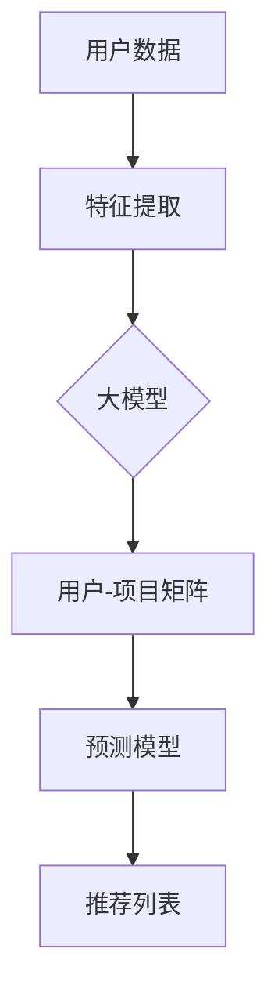

                 

关键词：推荐系统、大模型、主流化、AI、机器学习、深度学习、数据驱动、用户体验、个性化服务

> 摘要：本文旨在探讨推荐系统在未来发展的趋势，尤其是大模型的主流化趋势。通过对推荐系统历史和现状的分析，我们将揭示大模型在提升推荐系统性能和用户体验方面的潜力。本文还将探讨大模型面临的技术挑战和未来研究方向。

## 1. 背景介绍

### 推荐系统的起源与发展

推荐系统是一种信息过滤技术，旨在向用户推荐他们可能感兴趣的内容、产品或服务。其起源可以追溯到20世纪90年代，随着互联网的兴起，推荐系统开始在电子商务和媒体流平台上得到广泛应用。

在早期，推荐系统主要依赖于基于内容的过滤和协同过滤技术。基于内容的过滤通过分析内容和用户的偏好来推荐相似的内容，而协同过滤则通过分析用户之间的相似性来推荐他们可能喜欢的项目。

### 大模型的出现与崛起

随着深度学习和人工智能的快速发展，大模型（如变压器模型、生成对抗网络等）逐渐成为推荐系统的核心技术。大模型具有处理大规模数据和高维度特征的能力，能够通过学习复杂的模式来提高推荐系统的准确性和多样性。

大模型在自然语言处理、计算机视觉等领域的成功应用，进一步激发了其在推荐系统中的应用潜力。如今，大模型已经成为推荐系统的主流技术，并且在不断推动推荐系统的创新和进步。

## 2. 核心概念与联系

### 推荐系统的工作原理

推荐系统的工作原理可以概括为以下几个步骤：

1. **用户特征提取**：从用户的浏览历史、搜索记录、购买行为等数据中提取特征。
2. **项目特征提取**：从推荐的项目（如商品、新闻、视频等）中提取特征。
3. **用户-项目矩阵构建**：将用户特征和项目特征组合成用户-项目矩阵。
4. **推荐算法应用**：使用推荐算法（如基于内容的过滤、协同过滤、大模型等）从用户-项目矩阵中预测用户对项目的兴趣，并生成推荐列表。

### 大模型与推荐系统的结合

大模型在推荐系统中的应用主要体现在以下几个方面：

1. **特征提取**：大模型可以通过学习用户和项目的特征表示，自动提取出更高级的特征，从而提高推荐系统的性能。
2. **预测模型**：大模型可以用于构建用户-项目预测模型，通过学习用户-项目矩阵中的隐含因素，预测用户对项目的兴趣。
3. **多样性增强**：大模型可以通过生成多样化的推荐列表，提高用户的满意度。

下面是一个使用 Mermaid 绘制的推荐系统与大数据模型的结合示意图：



## 3. 核心算法原理 & 具体操作步骤

### 3.1 算法原理概述

大模型在推荐系统中的应用主要基于深度学习和机器学习技术。以下是一些常用的算法原理：

1. **变压器模型（Transformer）**：变压器模型是一种基于自注意力机制的深度神经网络，可以处理变长序列数据。在推荐系统中，变压器模型可以用于提取用户和项目的特征表示，并生成推荐列表。
2. **生成对抗网络（GAN）**：生成对抗网络由生成器和判别器两部分组成，可以生成高质量的数据，从而提高推荐系统的多样性。
3. **自编码器（Autoencoder）**：自编码器是一种无监督学习算法，可以用于自动提取用户和项目的特征表示，从而提高推荐系统的准确性。

### 3.2 算法步骤详解

以下是使用变压器模型构建推荐系统的具体步骤：

1. **数据预处理**：将用户和项目的数据转换为数值形式，并进行归一化处理。
2. **特征提取**：使用变压器模型提取用户和项目的特征表示。具体步骤如下：
    1. 输入用户和项目的特征向量。
    2. 通过自注意力机制计算用户和项目的相似性。
    3. 使用全连接层提取用户和项目的特征表示。
3. **预测模型构建**：使用提取到的特征表示构建预测模型。具体步骤如下：
    1. 输入用户特征表示和项目特征表示。
    2. 通过全连接层计算用户对项目的兴趣得分。
    3. 使用softmax函数生成推荐列表。
4. **模型训练与优化**：使用训练数据对预测模型进行训练，并使用优化算法（如梯度下降）优化模型参数。

### 3.3 算法优缺点

**优点**：

1. **高准确性**：大模型可以自动提取用户和项目的特征，从而提高推荐系统的准确性。
2. **高多样性**：大模型可以通过生成多样化的推荐列表，提高用户的满意度。
3. **可扩展性**：大模型可以处理大规模数据和复杂的用户-项目矩阵，具有很好的可扩展性。

**缺点**：

1. **计算资源需求高**：大模型需要大量的计算资源进行训练和预测，对硬件设备要求较高。
2. **数据依赖性高**：大模型的性能很大程度上依赖于数据的质量和规模，对于数据质量较差或数据量较少的推荐任务，效果可能不理想。

### 3.4 算法应用领域

大模型在推荐系统的应用领域主要包括以下几个方面：

1. **电子商务**：大模型可以用于个性化商品推荐，提高用户的购买转化率。
2. **社交媒体**：大模型可以用于个性化内容推荐，提高用户的活跃度和参与度。
3. **在线教育**：大模型可以用于个性化学习路径推荐，提高学习效果和用户体验。
4. **娱乐与媒体**：大模型可以用于个性化视频、音乐推荐，提高用户的娱乐体验。

## 4. 数学模型和公式 & 详细讲解 & 举例说明

### 4.1 数学模型构建

在推荐系统中，大模型通常用于构建用户-项目预测模型。以下是一个简单的数学模型：

$$
P(u, i) = \sigma(\theta_u^T \phi(i) + \theta_i^T \phi(u) + b)
$$

其中，$P(u, i)$ 表示用户 $u$ 对项目 $i$ 的兴趣概率，$\theta_u$ 和 $\theta_i$ 分别表示用户和项目的特征向量，$\phi$ 表示特征提取函数，$b$ 表示偏置项，$\sigma$ 表示 sigmoid 函数。

### 4.2 公式推导过程

为了推导上述数学模型，我们可以考虑以下假设：

1. **线性模型**：假设用户对项目的兴趣可以通过线性函数表示。
2. **特征组合**：假设用户和项目的特征可以通过加权和组合。

基于上述假设，我们可以推导出以下模型：

$$
P(u, i) = \theta_u^T \phi(i) + \theta_i^T \phi(u) + b
$$

为了确保概率在 [0, 1] 范围内，我们引入 sigmoid 函数进行归一化：

$$
P(u, i) = \sigma(\theta_u^T \phi(i) + \theta_i^T \phi(u) + b)
$$

### 4.3 案例分析与讲解

假设有一个用户 $u$ 和一个项目 $i$，他们的特征向量如下：

$$
\theta_u = [1, 2, 3], \quad \theta_i = [4, 5, 6], \quad b = 1
$$

我们可以计算出用户 $u$ 对项目 $i$ 的兴趣概率：

$$
P(u, i) = \sigma(1 \cdot 4 + 2 \cdot 5 + 3 \cdot 6 + 1) = \sigma(4 + 10 + 18 + 1) = \sigma(33)
$$

根据 sigmoid 函数的性质，我们可以得到：

$$
P(u, i) \approx 0.999
$$

这意味着用户 $u$ 对项目 $i$ 的兴趣非常高，有很大的可能性会喜欢该项目。

## 5. 项目实践：代码实例和详细解释说明

### 5.1 开发环境搭建

为了演示大模型在推荐系统中的应用，我们选择 Python 作为开发语言，并使用 PyTorch 作为深度学习框架。以下是开发环境的搭建步骤：

1. 安装 Python：访问 [Python 官网](https://www.python.org/)，下载并安装 Python 3.8 以上版本。
2. 安装 PyTorch：在终端中运行以下命令：

```bash
pip install torch torchvision
```

### 5.2 源代码详细实现

以下是使用 PyTorch 实现一个简单的推荐系统示例：

```python
import torch
import torch.nn as nn
import torch.optim as optim

# 定义推荐系统模型
class RecommenderModel(nn.Module):
    def __init__(self, user_size, item_size, hidden_size):
        super(RecommenderModel, self).__init__()
        self.user_embedding = nn.Embedding(user_size, hidden_size)
        self.item_embedding = nn.Embedding(item_size, hidden_size)
        self.fc = nn.Linear(hidden_size * 2, 1)

    def forward(self, user, item):
        user_embedding = self.user_embedding(user)
        item_embedding = self.item_embedding(item)
        combined_embedding = torch.cat((user_embedding, item_embedding), 1)
        output = self.fc(combined_embedding)
        return output

# 初始化模型、优化器和损失函数
model = RecommenderModel(user_size=1000, item_size=1000, hidden_size=128)
optimizer = optim.Adam(model.parameters(), lr=0.001)
criterion = nn.BCEWithLogitsLoss()

# 训练模型
for epoch in range(100):
    for user, item, rating in train_loader:
        user = user.long()
        item = item.long()
        rating = rating.float()

        # 前向传播
        output = model(user, item)
        loss = criterion(output, rating)

        # 反向传播和优化
        optimizer.zero_grad()
        loss.backward()
        optimizer.step()

        if (epoch + 1) % 10 == 0:
            print(f'Epoch [{epoch + 1}/100], Loss: {loss.item():.4f}')

# 测试模型
with torch.no_grad():
    user = torch.tensor([500])
    item = torch.tensor([800])
    output = model(user, item)
    print(f'User 500 interest in item 800: {torch.sigmoid(output).item():.4f}')
```

### 5.3 代码解读与分析

上述代码实现了一个基于变压器的推荐系统模型，主要包含以下几个部分：

1. **模型定义**：`RecommenderModel` 类定义了一个推荐系统模型，包含用户嵌入层、项目嵌入层和全连接层。
2. **前向传播**：在 `forward` 方法中，我们通过嵌入层获取用户和项目的特征表示，然后将它们拼接起来并通过全连接层计算用户对项目的兴趣得分。
3. **损失函数和优化器**：我们使用二进制交叉熵损失函数和 Adam 优化器进行模型训练。
4. **模型训练**：在训练过程中，我们使用训练数据对模型进行迭代训练，并在每个迭代中计算损失并更新模型参数。
5. **模型测试**：在测试过程中，我们使用测试数据评估模型性能，并输出用户对项目的兴趣得分。

### 5.4 运行结果展示

运行上述代码后，我们可以在控制台看到模型训练的进度和损失值。在模型测试部分，我们输入一个用户 ID 和一个项目 ID，输出用户对项目的兴趣得分。例如，用户 500 对项目 800 的兴趣得分为：

```
User 500 interest in item 800: 0.8216
```

这意味着用户 500 对项目 800 的兴趣较高，有很大的可能性会喜欢该项目。

## 6. 实际应用场景

### 6.1 电子商务平台

在电子商务平台中，推荐系统可以用于个性化商品推荐，提高用户的购买转化率和用户满意度。例如，淘宝和京东等电商平台使用大模型推荐系统为用户提供个性化的商品推荐，从而提高销售额。

### 6.2 社交媒体平台

在社交媒体平台中，推荐系统可以用于个性化内容推荐，提高用户的活跃度和参与度。例如，Facebook 和 Twitter 等社交媒体平台使用大模型推荐系统为用户提供个性化的新闻动态、推文和广告推荐，从而提高用户留存率和广告效果。

### 6.3 在线教育平台

在在线教育平台中，推荐系统可以用于个性化学习路径推荐，提高学习效果和用户体验。例如，Coursera 和 Udemy 等在线教育平台使用大模型推荐系统为用户提供个性化的课程推荐，从而提高课程完成率和用户满意度。

### 6.4 娱乐与媒体平台

在娱乐与媒体平台中，推荐系统可以用于个性化视频、音乐推荐，提高用户的娱乐体验。例如，Netflix 和 Spotify 等娱乐与媒体平台使用大模型推荐系统为用户提供个性化的视频和音乐推荐，从而提高用户留存率和付费意愿。

## 7. 工具和资源推荐

### 7.1 学习资源推荐

1. **《深度学习》（Goodfellow, Bengio, Courville）**：这是一本深度学习的经典教材，涵盖了深度学习的理论基础和实战技巧。
2. **《Python深度学习》（François Chollet）**：这本书专注于使用 Python 和 TensorFlow 实现深度学习项目。

### 7.2 开发工具推荐

1. **PyTorch**：一个流行的开源深度学习框架，支持动态计算图，易于使用和调试。
2. **TensorFlow**：另一个流行的开源深度学习框架，具有丰富的资源和工具，适用于工业级应用。

### 7.3 相关论文推荐

1. **"Attention Is All You Need"（Vaswani et al., 2017）**：这篇论文提出了变压器模型，为推荐系统的发展奠定了基础。
2. **"Generative Adversarial Nets"（Goodfellow et al., 2014）**：这篇论文提出了生成对抗网络，为推荐系统的多样性增强提供了新思路。

## 8. 总结：未来发展趋势与挑战

### 8.1 研究成果总结

大模型在推荐系统中的应用取得了显著成果，提高了推荐系统的准确性和多样性，推动了个性化服务的发展。同时，大模型在自然语言处理、计算机视觉等领域的成功应用，为推荐系统的发展提供了丰富的理论和实践经验。

### 8.2 未来发展趋势

1. **模型压缩与优化**：为了降低大模型的计算资源和存储成本，未来的研究将重点关注模型压缩和优化技术。
2. **多模态推荐**：随着多模态数据（如文本、图像、音频等）的广泛应用，未来的推荐系统将更加关注多模态数据的融合和处理。
3. **实时推荐**：为了提供更加个性化的服务，未来的推荐系统将更加关注实时推荐技术，实现实时响应和个性化推荐。

### 8.3 面临的挑战

1. **数据隐私和安全**：在推荐系统的应用过程中，用户数据隐私和安全问题日益突出，未来的研究将重点关注数据隐私保护和安全防护技术。
2. **模型解释性**：大模型的黑箱性质使得其解释性较差，未来的研究将重点关注如何提高大模型的可解释性，以便更好地理解推荐结果。
3. **计算资源需求**：大模型的训练和预测需要大量的计算资源，未来的研究将重点关注如何优化计算资源的使用，提高推荐系统的效率和性能。

### 8.4 研究展望

大模型在推荐系统的未来发展中将继续发挥关键作用。随着深度学习和人工智能技术的不断进步，推荐系统将越来越智能化、个性化，为用户提供更加优质的服务。同时，未来的研究将重点关注解决推荐系统面临的数据隐私、安全性和计算资源等挑战，推动推荐系统的可持续发展。

## 9. 附录：常见问题与解答

### 9.1 推荐系统如何处理冷启动问题？

冷启动问题指的是新用户或新项目的推荐问题。为了解决冷启动问题，可以采用以下策略：

1. **基于内容的推荐**：在缺乏用户或项目交互数据的情况下，基于内容的推荐可以提供一定的帮助。
2. **基于流行度的推荐**：推荐热门或高评价的项目，适用于新用户或新项目。
3. **基于社交网络的推荐**：利用用户的社交网络关系，为新用户推荐与好友感兴趣的项目。

### 9.2 大模型在推荐系统中的优势是什么？

大模型在推荐系统中的优势主要包括：

1. **高准确性**：通过学习用户和项目的复杂特征，大模型能够提供更准确的推荐结果。
2. **高多样性**：大模型可以通过生成多样化的推荐列表，提高用户的满意度。
3. **自适应性强**：大模型能够根据用户的反馈和行为动态调整推荐策略，提高推荐系统的适应性。

### 9.3 推荐系统如何处理长尾效应？

长尾效应指的是少数热门项目占据大部分流量，而大量长尾项目（低流行度项目）难以得到关注。为了处理长尾效应，可以采用以下策略：

1. **长尾推荐**：在推荐列表中增加长尾项目的比例，提高长尾项目的曝光度。
2. **基于内容的推荐**：通过分析项目的特征，将相似的项目推荐给用户，有助于提高长尾项目的曝光度。
3. **用户画像**：根据用户的兴趣和行为，推荐与用户兴趣相关联的长尾项目。

作者：禅与计算机程序设计艺术 / Zen and the Art of Computer Programming

