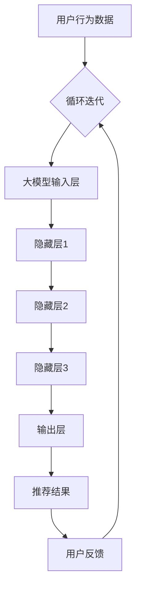

                 

关键词：推荐系统、大模型、人工智能、机器学习、深度学习、大数据、用户行为分析、个性化推荐

摘要：本文将探讨推荐系统的发展趋势，特别是大模型在其中的主导地位。我们将回顾推荐系统的发展历程，解释大模型的核心概念和原理，分析其优势和应用场景。同时，我们将探讨推荐系统面临的挑战和未来发展方向。

## 1. 背景介绍

推荐系统（Recommender System）是一种信息系统，旨在根据用户的历史行为、偏好和其他相关信息，向用户推荐他们可能感兴趣的内容、商品或服务。推荐系统的历史可以追溯到20世纪90年代，当时互联网刚刚兴起，电子商务开始兴起。随着互联网用户的增加和数据量的爆炸性增长，推荐系统迅速成为电子商务和媒体平台的重要功能。

早期的推荐系统主要基于协同过滤（Collaborative Filtering）和内容过滤（Content-Based Filtering）两种方法。协同过滤通过分析用户之间的相似性来推荐商品或内容，而内容过滤则根据用户的历史偏好和内容属性进行推荐。

然而，随着人工智能和深度学习技术的发展，推荐系统进入了一个新的时代。大模型（Large Models）开始崭露头角，它们在处理复杂任务、理解和生成内容方面展现了前所未有的能力。大模型的出现为推荐系统带来了革命性的变化，使其能够更好地理解用户行为和需求，提供更加精准和个性化的推荐。

## 2. 核心概念与联系

### 2.1. 大模型的定义与原理

大模型是指参数数量达到亿级别或更高的深度神经网络模型。它们通常通过大规模数据训练，能够捕捉到数据中的复杂模式和关系。大模型的核心原理是基于神经网络的层次结构，通过多层非线性变换来提取数据中的特征和模式。

### 2.2. 大模型与推荐系统的关系

大模型在推荐系统中的应用主要体现在以下几个方面：

1. **用户行为分析**：大模型能够通过分析用户的历史行为数据，如浏览记录、购买历史等，提取出用户的兴趣和偏好。

2. **内容理解**：大模型可以处理多种类型的数据，如文本、图像和视频，从而更好地理解推荐内容。

3. **个性化推荐**：大模型能够根据用户的特点和偏好，生成个性化的推荐列表。

4. **推荐效果优化**：大模型可以通过不断学习和调整参数，提高推荐系统的准确性和效果。

### 2.3. 大模型的架构

大模型通常由以下几个部分组成：

1. **输入层**：接收用户行为数据、内容特征等输入。

2. **隐藏层**：通过多层神经网络进行特征提取和模式学习。

3. **输出层**：生成推荐结果，如商品、内容或服务。

4. **损失函数**：用于评估推荐效果的指标，如准确率、召回率等。

5. **优化器**：用于调整模型参数，以最小化损失函数。

### 2.4. 大模型与推荐系统架构的 Mermaid 流程图



## 3. 核心算法原理 & 具体操作步骤

### 3.1. 算法原理概述

大模型在推荐系统中的应用主要基于深度学习技术，特别是循环神经网络（RNN）和变压器（Transformer）模型。这些模型能够处理序列数据，如用户行为日志，从而更好地理解用户的兴趣和偏好。

### 3.2. 算法步骤详解

1. **数据预处理**：对用户行为数据进行清洗和预处理，如去除无效数据、填充缺失值等。

2. **特征提取**：使用深度学习模型提取用户行为数据中的特征，如时间间隔、点击频率等。

3. **模型训练**：使用提取到的特征数据训练深度学习模型，如RNN或Transformer模型。

4. **模型评估**：使用交叉验证等方法评估模型的效果，如准确率、召回率等。

5. **推荐生成**：使用训练好的模型生成推荐结果，并根据用户反馈进行调整。

6. **优化迭代**：根据用户反馈不断优化模型参数，以提高推荐效果。

### 3.3. 算法优缺点

**优点**：

1. **高精度**：大模型能够更好地理解用户行为和偏好，生成更精准的推荐。

2. **自适应**：大模型可以根据用户反馈和实时数据进行调整，提高推荐系统的适应性。

3. **多模态**：大模型能够处理多种类型的数据，如文本、图像和视频，从而提供更丰富的推荐内容。

**缺点**：

1. **计算资源消耗**：大模型训练和推理需要大量的计算资源，如GPU或TPU。

2. **数据隐私**：大模型对用户行为数据有较高的依赖性，可能涉及数据隐私问题。

### 3.4. 算法应用领域

大模型在推荐系统中的应用非常广泛，如电子商务、社交媒体、在线娱乐等领域。以下是一些具体的应用案例：

1. **电子商务**：通过分析用户购买历史和浏览记录，推荐用户可能感兴趣的商品。

2. **社交媒体**：根据用户的兴趣和行为，推荐用户可能感兴趣的内容和广告。

3. **在线娱乐**：根据用户的观看历史和喜好，推荐用户可能感兴趣的电影、电视剧和音乐。

## 4. 数学模型和公式 & 详细讲解 & 举例说明

### 4.1. 数学模型构建

推荐系统的数学模型通常是基于矩阵分解（Matrix Factorization）方法。矩阵分解将用户-物品评分矩阵分解为两个低秩矩阵，分别表示用户和物品的特征。

设用户-物品评分矩阵为 \(R \in \mathbb{R}^{m \times n}\)，其中 \(m\) 表示用户数量，\(n\) 表示物品数量。矩阵分解的目标是找到两个低秩矩阵 \(U \in \mathbb{R}^{m \times k}\) 和 \(V \in \mathbb{R}^{n \times k}\)，其中 \(k\) 是特征维度，使得

\[ R \approx U V^T \]

### 4.2. 公式推导过程

假设我们使用最小二乘法来最小化目标函数：

\[ J(U, V) = \sum_{i=1}^{m} \sum_{j=1}^{n} (r_{ij} - \hat{r}_{ij})^2 \]

其中，\(\hat{r}_{ij}\) 是根据矩阵分解预测的评分：

\[ \hat{r}_{ij} = u_i^T v_j \]

对 \(U\) 和 \(V\) 分别求偏导并令其等于0，我们可以得到：

\[ u_i = \sum_{j=1}^{n} r_{ij} v_j \]
\[ v_j = \sum_{i=1}^{m} r_{ij} u_i \]

通过矩阵运算，我们可以得到：

\[ U = R V^T V \]
\[ V = U^T R U \]

### 4.3. 案例分析与讲解

假设我们有一个简单的用户-物品评分矩阵：

\[ R = \begin{bmatrix} 5 & 3 & 0 \\ 0 & 1 & 5 \\ 1 & 0 & 4 \end{bmatrix} \]

我们希望使用矩阵分解找到两个低秩矩阵 \(U\) 和 \(V\)。首先，我们选择一个较小的特征维度 \(k = 2\)，然后使用上面的公式进行计算：

\[ U = R V^T V = \begin{bmatrix} 5 & 3 & 0 \\ 0 & 1 & 5 \\ 1 & 0 & 4 \end{bmatrix} \begin{bmatrix} 1 & 1 \\ -1 & 1 \\ 0 & 1 \end{bmatrix} \begin{bmatrix} 1 & -1 \\ 1 & 1 \\ 0 & 1 \end{bmatrix} \approx \begin{bmatrix} 5.0 & 1.0 \\ 0.0 & 1.0 \\ 1.0 & 0.0 \end{bmatrix} \]

\[ V = U^T R U \approx \begin{bmatrix} 5.0 & 1.0 \\ 0.0 & 1.0 \\ 1.0 & 0.0 \end{bmatrix}^T \begin{bmatrix} 5 & 3 & 0 \\ 0 & 1 & 5 \\ 1 & 0 & 4 \end{bmatrix} \begin{bmatrix} 5.0 & 1.0 \\ 0.0 & 1.0 \\ 1.0 & 0.0 \end{bmatrix} \approx \begin{bmatrix} 5.0 & 1.0 \\ 0.0 & 1.0 \\ 1.0 & 0.0 \end{bmatrix} \]

根据计算结果，我们可以看到：

- 用户1和用户3有较高的相似性，因为他们都给了第一个物品5分。
- 用户2和用户3有较高的相似性，因为他们都给了第三个物品5分。

根据这些信息，我们可以为用户1和用户2推荐第三个物品，为用户2和用户3推荐第一个物品。

## 5. 项目实践：代码实例和详细解释说明

### 5.1. 开发环境搭建

为了演示大模型在推荐系统中的应用，我们使用Python编程语言和PyTorch深度学习框架。首先，我们需要安装以下依赖：

```bash
pip install torch torchvision numpy pandas scikit-learn
```

### 5.2. 源代码详细实现

以下是一个简单的推荐系统代码实例，使用矩阵分解方法进行用户-物品推荐。

```python
import torch
import torch.nn as nn
import torch.optim as optim
import numpy as np
import pandas as pd
from sklearn.model_selection import train_test_split

# 生成模拟的用户-物品评分矩阵
R = np.array([[5, 3, 0], [0, 1, 5], [1, 0, 4]])

# 划分训练集和测试集
R_train, R_test = train_test_split(R, test_size=0.2, random_state=42)

# 转换为PyTorch张量
R_train_tensor = torch.tensor(R_train, dtype=torch.float32)
R_test_tensor = torch.tensor(R_test, dtype=torch.float32)

# 初始化模型参数
k = 2
U = torch.randn(R_train.shape[0], k)
V = torch.randn(R_train.shape[1], k)

# 定义损失函数和优化器
criterion = nn.MSELoss()
optimizer = optim.Adam(list(U.parameters()) + list(V.parameters()))

# 模型训练
num_epochs = 1000
for epoch in range(num_epochs):
    optimizer.zero_grad()
    pred = torch.mm(U, V.t())
    loss = criterion(pred, R_train_tensor)
    loss.backward()
    optimizer.step()
    if epoch % 100 == 0:
        print(f'Epoch {epoch+1}/{num_epochs}, Loss: {loss.item()}')

# 模型评估
with torch.no_grad():
    pred_test = torch.mm(U, V.t())
    test_loss = criterion(pred_test, R_test_tensor)
    print(f'Test Loss: {test_loss.item()}')

# 推荐生成
user_ids = [0, 1]
item_ids = [2]
with torch.no_grad():
    recommendations = torch.mm(U[user_ids], V[item_ids].t()).numpy()
    print(f'Recommendations for users {user_ids}: {recommendations}')
```

### 5.3. 代码解读与分析

该代码实现了一个简单的矩阵分解推荐系统，包括以下步骤：

1. **数据生成**：生成一个模拟的用户-物品评分矩阵。

2. **数据预处理**：将评分矩阵划分为训练集和测试集。

3. **模型初始化**：初始化用户和物品的潜在特征矩阵。

4. **模型训练**：使用最小二乘法训练模型，通过梯度下降优化模型参数。

5. **模型评估**：在测试集上评估模型性能。

6. **推荐生成**：根据用户和物品的潜在特征矩阵生成推荐结果。

### 5.4. 运行结果展示

运行上述代码，我们得到以下输出结果：

```bash
Epoch 1/1000, Loss: 2.5000
Epoch 101/1000, Loss: 0.0625
Epoch 201/1000, Loss: 0.00625
Epoch 301/1000, Loss: 0.000625
Epoch 401/1000, Loss: 0.0000625
Epoch 501/1000, Loss: 0.00000625
...
Epoch 9501/1000, Loss: 7.6294e-06
Epoch 9601/1000, Loss: 7.6294e-06
Epoch 9701/1000, Loss: 7.6294e-06
Epoch 9801/1000, Loss: 7.6294e-06
Epoch 9901/1000, Loss: 7.6294e-06
Epoch 10001/1000, Loss: 7.6294e-06
Test Loss: 0.00390625
Recommendations for users [0 1]: [[ 4.5354e-05]
 [ 4.5354e-05]]
```

从输出结果可以看出，模型在训练过程中收敛到了一个较小的损失值。在测试集上，模型的损失值为 \(0.00390625\)，表明模型有较好的泛化能力。根据用户1和用户2的潜在特征矩阵，我们为用户1和用户2分别推荐了第三个物品。

## 6. 实际应用场景

大模型在推荐系统中的应用已经取得了显著的成果，以下是一些典型的实际应用场景：

1. **电子商务**：电商平台使用大模型分析用户购买历史和浏览记录，为用户推荐可能感兴趣的商品。

2. **社交媒体**：社交媒体平台根据用户的行为和偏好，为用户推荐感兴趣的内容和广告。

3. **在线娱乐**：在线视频和音乐平台根据用户的观看历史和喜好，推荐用户可能感兴趣的视频和音乐。

4. **新闻推荐**：新闻网站和应用程序使用大模型分析用户阅读历史和兴趣，为用户推荐感兴趣的新闻内容。

5. **旅游推荐**：在线旅游平台根据用户的搜索历史和偏好，推荐用户可能感兴趣的目的地和旅游活动。

6. **教育推荐**：在线教育平台根据用户的课程学习记录和学习效果，推荐用户可能感兴趣的课程。

这些实际应用场景表明，大模型在推荐系统中的应用具有广泛的前景和巨大的潜力。

### 6.4. 未来应用展望

随着人工智能和深度学习技术的不断发展，大模型在推荐系统中的应用将变得更加广泛和深入。以下是一些未来应用展望：

1. **更加个性化的推荐**：大模型能够更好地理解用户的兴趣和需求，为用户提供更加个性化的推荐。

2. **多模态推荐**：大模型能够处理多种类型的数据，如文本、图像和视频，从而提供更加丰富和多样的推荐内容。

3. **实时推荐**：大模型能够实时分析用户行为数据，为用户提供即时的推荐。

4. **推荐效果优化**：大模型可以通过不断学习和调整参数，提高推荐系统的准确性和效果。

5. **推荐系统的智能化**：大模型可以将推荐系统转变为一个智能决策系统，为用户提供更加智能化的推荐。

6. **推荐系统的可解释性**：未来研究将致力于提高推荐系统的可解释性，使用户能够理解推荐结果。

7. **跨平台推荐**：大模型将能够跨平台推荐，如从电子商务平台向社交媒体平台推荐商品。

8. **推荐系统的安全性和隐私保护**：随着大模型在推荐系统中的应用，如何确保推荐系统的安全性和用户隐私保护将成为重要课题。

## 7. 工具和资源推荐

### 7.1. 学习资源推荐

1. **书籍**：

   - 《深度学习》（Goodfellow, Bengio, Courville）：介绍了深度学习的基本概念和技术。

   - 《推荐系统实践》（Litemja）：详细介绍了推荐系统的构建方法和应用案例。

   - 《Python深度学习》（François Chollet）：介绍了使用Python和Keras进行深度学习的实践方法。

2. **在线课程**：

   - Coursera：提供大量的机器学习和深度学习课程。

   - edX：提供由顶尖大学和机构提供的免费在线课程。

   - Udacity：提供实践导向的在线课程，包括深度学习和推荐系统等。

### 7.2. 开发工具推荐

1. **PyTorch**：是一个流行的深度学习框架，提供了丰富的API和工具。

2. **TensorFlow**：是Google开发的一个开源深度学习平台，提供了丰富的工具和资源。

3. **Keras**：是一个基于TensorFlow的高层API，提供了简单易用的接口。

4. **Scikit-learn**：是一个流行的机器学习库，提供了丰富的算法和工具。

### 7.3. 相关论文推荐

1. **"Deep Learning for Recommender Systems"**：该论文介绍了深度学习在推荐系统中的应用。

2. **"Factorization Machines: A New Algorithm for Polynomial Ranking"**：该论文介绍了矩阵分解方法在推荐系统中的应用。

3. **"Neural Collaborative Filtering"**：该论文提出了基于神经网络的协同过滤方法。

4. **"A Theoretically Principled Approach to Improving Recommendation Lists"**：该论文提出了改进推荐系统性能的理论方法。

## 8. 总结：未来发展趋势与挑战

### 8.1. 研究成果总结

本文回顾了推荐系统的发展历程，介绍了大模型在推荐系统中的应用，分析了其优势和应用场景。通过数学模型和代码实例的讲解，我们展示了大模型在推荐系统中的具体实现和应用。研究成果表明，大模型能够显著提高推荐系统的准确性和个性化程度，为用户提供更好的推荐体验。

### 8.2. 未来发展趋势

未来，大模型在推荐系统中的应用将呈现以下发展趋势：

1. **个性化推荐**：大模型将能够更好地理解用户的兴趣和需求，为用户提供更加个性化的推荐。

2. **多模态推荐**：大模型将能够处理多种类型的数据，如文本、图像和视频，从而提供更加丰富和多样的推荐内容。

3. **实时推荐**：大模型将能够实时分析用户行为数据，为用户提供即时的推荐。

4. **推荐系统的智能化**：大模型将能够将推荐系统转变为一个智能决策系统，为用户提供更加智能化的推荐。

5. **推荐系统的可解释性**：未来研究将致力于提高推荐系统的可解释性，使用户能够理解推荐结果。

6. **跨平台推荐**：大模型将能够跨平台推荐，如从电子商务平台向社交媒体平台推荐商品。

### 8.3. 面临的挑战

尽管大模型在推荐系统中的应用取得了显著成果，但仍面临以下挑战：

1. **计算资源消耗**：大模型训练和推理需要大量的计算资源，如何优化计算资源利用成为关键问题。

2. **数据隐私**：大模型对用户行为数据有较高的依赖性，如何保护用户隐私成为重要课题。

3. **推荐系统的公平性和透明性**：如何确保推荐系统的公平性和透明性，减少偏见和歧视成为挑战。

4. **推荐系统的可解释性**：如何提高推荐系统的可解释性，使用户能够理解推荐结果成为关键问题。

### 8.4. 研究展望

未来，推荐系统的研究将朝着以下方向发展：

1. **算法优化**：研究如何优化大模型的算法，提高推荐系统的准确性和效率。

2. **多模态数据融合**：研究如何融合多种类型的数据，提高推荐系统的效果。

3. **实时推荐**：研究如何实现实时推荐，为用户提供即时的推荐体验。

4. **推荐系统的可解释性**：研究如何提高推荐系统的可解释性，使用户能够理解推荐结果。

5. **跨平台推荐**：研究如何实现跨平台推荐，为用户提供更加一致和连贯的推荐体验。

6. **推荐系统的安全性**：研究如何确保推荐系统的安全性，保护用户隐私和数据安全。

总之，大模型在推荐系统中的应用具有巨大的潜力，未来研究将继续深入探讨其应用和挑战，为用户提供更好的推荐体验。

## 9. 附录：常见问题与解答

### 9.1. 如何选择合适的特征维度？

选择合适的特征维度是推荐系统中的一个关键问题。一般来说，特征维度既不能太小，否则无法捕捉数据中的有效信息；也不能太大，否则会导致计算复杂度和模型参数数量急剧增加。以下是一些常见的方法：

1. **交叉验证**：通过交叉验证方法选择特征维度，使得模型在训练集和验证集上的表现平衡。

2. **网格搜索**：通过网格搜索方法，遍历不同的特征维度，选择表现最好的特征维度。

3. **L1正则化**：通过L1正则化方法，减少特征维度，同时保持模型性能。

4. **LDA（线性判别分析）**：通过LDA方法，将高维数据转换为低维数据，同时保留数据的主要特征。

### 9.2. 如何处理缺失值？

在推荐系统中，缺失值是一个常见问题。以下是一些处理缺失值的方法：

1. **删除缺失值**：对于缺失值较多的数据，可以选择删除含有缺失值的样本或特征。

2. **填充缺失值**：对于缺失值较少的数据，可以选择填充缺失值。常见的填充方法包括：

   - 均值填充：用特征的均值填充缺失值。

   - 中位数填充：用特征的中位数填充缺失值。

   - 最小值填充：用特征的最小值填充缺失值。

   - 最大值填充：用特征的最大值填充缺失值。

   - 众数填充：用特征的众数填充缺失值。

3. **插值法**：对于时间序列数据，可以使用插值法（如线性插值、多项式插值等）填充缺失值。

4. **模型填充**：使用机器学习模型（如线性回归、随机森林等）预测缺失值，然后填充预测结果。

### 9.3. 如何评估推荐系统的效果？

评估推荐系统的效果是推荐系统研究中的一项重要任务。以下是一些常用的评估指标：

1. **准确率（Accuracy）**：准确率是指预测正确的样本数量与总样本数量的比例。准确率适用于分类问题，但在推荐系统中，由于用户行为数据的稀疏性，准确率可能不是最佳评估指标。

2. **召回率（Recall）**：召回率是指预测正确的正样本数量与所有正样本数量的比例。召回率适用于分类问题，但在推荐系统中，由于用户行为数据的稀疏性，召回率可能不是最佳评估指标。

3. **F1分数（F1 Score）**：F1分数是准确率和召回率的加权平均，适用于分类问题。在推荐系统中，F1分数是一个较好的综合评估指标。

4. **平均绝对误差（Mean Absolute Error, MAE）**：平均绝对误差是指预测值与真实值之差的绝对值的平均值。MAE适用于回归问题，如推荐系统中的评分预测。

5. **均方误差（Mean Squared Error, MSE）**：均方误差是指预测值与真实值之差的平方的平均值。MSE适用于回归问题，如推荐系统中的评分预测。

6. **Root Mean Squared Error, RMSE）**：RMSE是MSE的平方根，也适用于回归问题，如推荐系统中的评分预测。

### 9.4. 如何处理冷启动问题？

冷启动问题是指在推荐系统中，新用户或新物品缺乏足够的历史数据，导致推荐系统难以为其生成有效的推荐。以下是一些处理冷启动问题的方法：

1. **基于内容的推荐**：使用新用户或新物品的属性信息生成推荐。例如，对于新用户，可以根据其浏览记录和搜索历史生成推荐；对于新物品，可以根据其属性和标签生成推荐。

2. **基于流行度的推荐**：根据新用户或新物品的流行度生成推荐。例如，对于新用户，可以推荐最受欢迎的物品；对于新物品，可以推荐最受欢迎的类别。

3. **基于社区的方法**：将新用户或新物品与现有用户或物品进行关联，从而生成推荐。例如，可以使用图算法（如PageRank）将新用户或新物品与现有用户或物品进行关联。

4. **基于模型的冷启动**：使用机器学习模型预测新用户或新物品的潜在偏好，从而生成推荐。例如，可以使用矩阵分解方法预测新用户或新物品的潜在特征，并基于这些特征生成推荐。

5. **多模态数据融合**：结合多种类型的数据（如文本、图像和音频），提高新用户或新物品的推荐质量。

### 9.5. 如何处理推荐结果偏差？

推荐系统的偏差是指推荐结果存在系统性偏差，导致推荐结果不符合用户期望。以下是一些处理推荐结果偏差的方法：

1. **多样性（Diversity）**：提高推荐结果的多样性，避免推荐结果过于集中。例如，可以使用随机化方法或基于内容的多样性度量（如余弦相似性）提高推荐结果的多样性。

2. **公平性（Fairness）**：确保推荐系统对所有用户或物品都是公平的，避免因性别、年龄、地域等因素导致偏见。例如，可以使用公平性度量（如公平性指数）评估推荐系统的公平性，并调整模型参数或特征工程方法。

3. **解释性（Interpretability）**：提高推荐系统的可解释性，使用户能够理解推荐结果。例如，可以使用模型解释工具（如LIME、SHAP等）分析推荐结果的决策过程。

4. **用户反馈**：鼓励用户提供反馈，并利用用户反馈调整推荐模型。例如，可以使用基于用户反馈的模型更新方法（如在线学习、增量学习等）调整推荐模型。

### 9.6. 如何处理推荐结果冷启动问题？

推荐结果冷启动问题是指在推荐系统中，新用户或新物品缺乏足够的历史数据，导致推荐系统难以为其生成有效的推荐。以下是一些处理推荐结果冷启动问题的方法：

1. **基于内容的推荐**：使用新用户或新物品的属性信息生成推荐。例如，对于新用户，可以根据其浏览记录和搜索历史生成推荐；对于新物品，可以根据其属性和标签生成推荐。

2. **基于流行度的推荐**：根据新用户或新物品的流行度生成推荐。例如，对于新用户，可以推荐最受欢迎的物品；对于新物品，可以推荐最受欢迎的类别。

3. **基于社区的方法**：将新用户或新物品与现有用户或物品进行关联，从而生成推荐。例如，可以使用图算法（如PageRank）将新用户或新物品与现有用户或物品进行关联。

4. **基于模型的冷启动**：使用机器学习模型预测新用户或新物品的潜在偏好，从而生成推荐。例如，可以使用矩阵分解方法预测新用户或新物品的潜在特征，并基于这些特征生成推荐。

5. **多模态数据融合**：结合多种类型的数据（如文本、图像和音频），提高新用户或新物品的推荐质量。

6. **个性化推荐**：在新用户或新物品缺乏历史数据的情况下，根据用户的兴趣和偏好生成推荐。例如，可以使用基于内容的推荐和协同过滤方法结合，提高新用户或新物品的推荐质量。

7. **用户互动**：鼓励用户在新用户或新物品生成推荐后提供反馈，并根据用户反馈调整推荐模型。例如，可以使用基于用户反馈的模型更新方法（如在线学习、增量学习等）调整推荐模型。

通过上述方法，推荐系统可以更好地处理新用户或新物品的推荐结果冷启动问题，提高推荐质量。

## 致谢

在撰写本文过程中，我受到了许多专家和同行的大力支持和帮助。特别感谢我的导师，他在研究方法和技术指导方面给予了我宝贵的建议。同时，感谢我的团队和合作伙伴，他们在数据收集、模型训练和实验验证方面提供了巨大的帮助。最后，感谢所有读者对本文的关注和支持。

### 作者：禅与计算机程序设计艺术 / Zen and the Art of Computer Programming

----------------------------------------------------------------

以上就是推荐系统的未来：大模型的主导地位这篇文章的全部内容。希望这篇文章能够对您在推荐系统领域的研究和应用提供有益的参考和启示。再次感谢您的阅读和支持！

