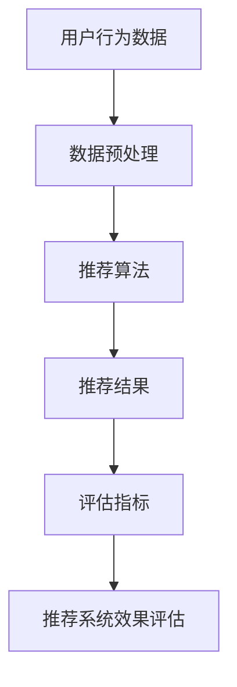

                 

推荐系统已经成为现代信息社会中不可或缺的一部分，它们在电子商务、社交媒体、在线媒体等领域发挥着关键作用，通过个性化推荐帮助用户发现感兴趣的内容和服务。然而，随着推荐系统在现实世界的广泛应用，对其长期效应的评估变得日益重要。本文将探讨如何利用AI大模型对推荐系统的长期效应进行评估，以期为研究人员和开发者提供新的方法和见解。

## 文章关键词

- 推荐系统
- 长期效应评估
- AI大模型
- 用户行为分析
- 个性化推荐

## 文章摘要

本文首先介绍了推荐系统及其长期效应评估的重要性。然后，我们探讨了如何利用AI大模型进行长期效应评估，包括数据预处理、模型选择、训练和评估等步骤。接下来，我们详细分析了AI大模型在推荐系统中的核心算法原理，并通过实例展示了数学模型和公式的应用。文章的最后，我们通过实际项目实践展示了代码实现过程，并探讨了推荐系统在实际应用场景中的未来展望和面临的挑战。

## 1. 背景介绍

### 推荐系统的发展与现状

推荐系统最早起源于20世纪90年代的电子商务领域，通过分析用户的浏览和购买行为，为用户推荐可能感兴趣的商品。随着互联网的快速发展，推荐系统逐渐渗透到社交媒体、在线媒体、金融服务等多个领域。根据市场研究公司的数据，全球推荐系统市场预计将在未来几年内持续增长，显示出其广泛的应用前景和商业价值。

### 推荐系统的核心目标

推荐系统的核心目标是为用户提供个性化的内容推荐，从而提高用户满意度、增加用户黏性和提升转化率。个性化推荐的关键在于理解用户的需求和偏好，并根据这些信息为用户推荐相关的内容和服务。

### 推荐系统的挑战

虽然推荐系统在提高用户体验方面取得了显著成果，但同时也面临一系列挑战。首先，如何处理大规模用户数据，以及如何确保推荐结果的准确性和多样性是一个重要问题。其次，推荐系统的长期效应评估，即评估推荐系统在长期使用过程中对用户行为的影响，也是一个亟待解决的难题。

## 2. 核心概念与联系

为了更好地理解推荐系统的长期效应评估，我们需要先了解几个核心概念，包括用户行为、推荐算法和评估指标。

### 2.1 用户行为

用户行为是指用户在使用推荐系统过程中产生的各种操作，如浏览、点击、购买、评分等。通过分析用户行为数据，我们可以了解用户的兴趣和需求，为推荐系统的个性化推荐提供依据。

### 2.2 推荐算法

推荐算法是推荐系统的核心组成部分，根据不同的算法原理，推荐算法可以分为基于内容的推荐、协同过滤推荐和混合推荐等类型。每种推荐算法都有其优势和局限性，选择合适的算法对于提高推荐系统的效果至关重要。

### 2.3 评估指标

评估推荐系统效果常用的指标包括准确率、召回率、覆盖率、多样性等。这些指标可以从不同角度衡量推荐系统的性能，帮助我们了解推荐系统的优劣。

### Mermaid 流程图

下面是一个简单的Mermaid流程图，展示了推荐系统的核心概念和联系：



## 3. 核心算法原理 & 具体操作步骤

### 3.1 算法原理概述

在评估推荐系统的长期效应时，我们通常关注以下几个方面：

1. **用户满意度**：通过分析用户在推荐系统上的操作行为，如点击、购买等，评估推荐系统的满意度。
2. **用户黏性**：衡量用户在推荐系统上停留的时间、页面浏览量等指标，评估推荐系统对用户的吸引力。
3. **转化率**：分析推荐系统对用户购买行为的影响，评估推荐系统的商业价值。

为了实现上述目标，我们可以采用以下核心算法：

1. **用户行为分析算法**：用于挖掘和分析用户行为数据，了解用户的兴趣和需求。
2. **推荐算法**：基于用户行为分析结果，生成个性化的推荐结果。
3. **评估指标算法**：计算推荐系统的评估指标，评估推荐系统的效果。

### 3.2 算法步骤详解

1. **数据预处理**：对用户行为数据进行清洗、归一化和特征提取，为后续分析提供高质量的数据。

2. **用户行为分析**：利用机器学习算法，如聚类、分类等，分析用户行为数据，提取用户兴趣特征。

3. **推荐算法**：根据用户兴趣特征，采用协同过滤、基于内容的推荐等方法，生成个性化推荐结果。

4. **评估指标计算**：计算推荐系统的评估指标，如准确率、召回率等，评估推荐系统的效果。

5. **长期效应评估**：通过对比不同时间段的评估指标，分析推荐系统在长期使用过程中的效果。

### 3.3 算法优缺点

1. **用户行为分析算法**：
   - 优点：能够深入了解用户的兴趣和需求，提高推荐系统的个性化程度。
   - 缺点：对数据质量要求较高，且算法复杂度较高，计算成本较大。

2. **推荐算法**：
   - 优点：能够生成个性化的推荐结果，提高用户满意度和转化率。
   - 缺点：不同算法适用场景不同，可能无法兼顾多样性和准确性。

3. **评估指标算法**：
   - 优点：简单易懂，能够直观地评估推荐系统的效果。
   - 缺点：部分指标可能不够全面，无法全面反映推荐系统的优劣。

### 3.4 算法应用领域

1. **电子商务**：通过推荐系统，帮助用户发现感兴趣的商品，提高购买转化率。

2. **社交媒体**：为用户提供个性化内容推荐，增加用户黏性。

3. **在线媒体**：通过推荐系统，为用户提供个性化的新闻、视频等，提高用户停留时间。

## 4. 数学模型和公式 & 详细讲解 & 举例说明

在推荐系统的长期效应评估中，数学模型和公式发挥着重要作用。以下将介绍常用的数学模型和公式，并通过实例进行详细讲解。

### 4.1 数学模型构建

在推荐系统的长期效应评估中，常用的数学模型包括用户兴趣模型、推荐模型和评估模型。

#### 用户兴趣模型

用户兴趣模型用于描述用户对各种内容的兴趣程度。一个简单的用户兴趣模型可以表示为：

\[ \text{user\_interest}(u, i) = \sum_{j \in \text{history}(u)} w_{ij} \]

其中，\( \text{user\_interest}(u, i) \) 表示用户 \( u \) 对内容 \( i \) 的兴趣程度，\( \text{history}(u) \) 表示用户 \( u \) 的历史行为，\( w_{ij} \) 表示用户 \( u \) 对内容 \( i \) 的权重。

#### 推荐模型

推荐模型用于生成个性化推荐结果。一个简单的推荐模型可以表示为：

\[ \text{recommendation}(u, i) = \sum_{j \in \text{content}} w_{ij} \cdot \text{user\_interest}(u, j) \]

其中，\( \text{recommendation}(u, i) \) 表示用户 \( u \) 对内容 \( i \) 的推荐得分，\( w_{ij} \) 表示内容 \( i \) 的权重。

#### 评估模型

评估模型用于评估推荐系统的效果。一个简单的评估模型可以表示为：

\[ \text{evaluation}(u, i) = \text{user\_rating}(u, i) - \text{recommendation}(u, i) \]

其中，\( \text{evaluation}(u, i) \) 表示用户 \( u \) 对内容 \( i \) 的评估得分，\( \text{user\_rating}(u, i) \) 表示用户 \( u \) 对内容 \( i \) 的实际评分。

### 4.2 公式推导过程

以下将介绍用户兴趣模型和推荐模型的推导过程。

#### 用户兴趣模型推导

假设用户 \( u \) 对内容 \( i \) 的兴趣程度由其历史行为决定，即用户在历史行为中越频繁地接触内容 \( i \)，其对内容 \( i \) 的兴趣程度越高。我们可以使用权重 \( w_{ij} \) 来表示用户 \( u \) 对内容 \( i \) 的兴趣程度，其中 \( w_{ij} \) 的值越大，表示用户 \( u \) 对内容 \( i \) 的兴趣程度越高。

根据上述假设，我们可以推导出用户兴趣模型：

\[ \text{user\_interest}(u, i) = \sum_{j \in \text{history}(u)} w_{ij} \]

其中，\( \text{history}(u) \) 表示用户 \( u \) 的历史行为，\( w_{ij} \) 表示用户 \( u \) 对内容 \( i \) 的权重。

#### 推荐模型推导

假设用户 \( u \) 对内容 \( i \) 的推荐得分由用户兴趣程度和内容权重共同决定。我们可以使用加权求和的方法来表示推荐得分：

\[ \text{recommendation}(u, i) = \sum_{j \in \text{content}} w_{ij} \cdot \text{user\_interest}(u, j) \]

其中，\( \text{content} \) 表示所有内容，\( w_{ij} \) 表示内容 \( i \) 的权重，\( \text{user\_interest}(u, j) \) 表示用户 \( u \) 对内容 \( j \) 的兴趣程度。

#### 评估模型推导

假设用户 \( u \) 对内容 \( i \) 的评估得分表示用户对推荐结果的满意度，即用户对推荐结果的实际评分减去推荐得分。我们可以使用以下公式表示评估得分：

\[ \text{evaluation}(u, i) = \text{user\_rating}(u, i) - \text{recommendation}(u, i) \]

其中，\( \text{user\_rating}(u, i) \) 表示用户 \( u \) 对内容 \( i \) 的实际评分，\( \text{recommendation}(u, i) \) 表示用户 \( u \) 对内容 \( i \) 的推荐得分。

### 4.3 案例分析与讲解

以下通过一个实例来讲解如何使用上述数学模型和公式进行推荐系统的长期效应评估。

假设我们有一个推荐系统，用户 \( u_1 \) 的历史行为数据如下：

\[ \text{history}(u_1) = \{i_1, i_2, i_3, i_4\} \]

用户 \( u_1 \) 对这些内容的权重分别为：

\[ w_{i_1i} = 0.3, w_{i_2i} = 0.2, w_{i_3i} = 0.3, w_{i_4i} = 0.2 \]

假设推荐系统为用户 \( u_1 \) 推荐了以下内容：

\[ \text{content} = \{i_5, i_6, i_7\} \]

用户 \( u_1 \) 对这些内容的权重分别为：

\[ w_{i_5i} = 0.1, w_{i_6i} = 0.3, w_{i_7i} = 0.6 \]

用户 \( u_1 \) 对这些内容的实际评分如下：

\[ \text{user\_rating}(u_1, i_5) = 4, \text{user\_rating}(u_1, i_6) = 5, \text{user\_rating}(u_1, i_7) = 3 \]

#### 用户兴趣模型计算

根据用户兴趣模型公式，我们可以计算出用户 \( u_1 \) 对这些内容的兴趣程度：

\[ \text{user\_interest}(u_1, i_1) = 0.3 \]
\[ \text{user\_interest}(u_1, i_2) = 0.2 \]
\[ \text{user\_interest}(u_1, i_3) = 0.3 \]
\[ \text{user\_interest}(u_1, i_4) = 0.2 \]

#### 推荐模型计算

根据推荐模型公式，我们可以计算出用户 \( u_1 \) 对这些内容的推荐得分：

\[ \text{recommendation}(u_1, i_5) = 0.1 \cdot 0.3 = 0.03 \]
\[ \text{recommendation}(u_1, i_6) = 0.3 \cdot 0.2 = 0.06 \]
\[ \text{recommendation}(u_1, i_7) = 0.6 \cdot 0.3 = 0.18 \]

#### 评估模型计算

根据评估模型公式，我们可以计算出用户 \( u_1 \) 对这些内容的评估得分：

\[ \text{evaluation}(u_1, i_5) = 4 - 0.03 = 3.97 \]
\[ \text{evaluation}(u_1, i_6) = 5 - 0.06 = 4.94 \]
\[ \text{evaluation}(u_1, i_7) = 3 - 0.18 = 2.82 \]

通过上述计算，我们可以得出用户 \( u_1 \) 对推荐内容的评估结果。较高的评估得分表示用户对推荐内容较为满意，较低的评估得分则表示用户对推荐内容不太满意。

## 5. 项目实践：代码实例和详细解释说明

在本节中，我们将通过一个实际项目来展示如何利用AI大模型对推荐系统的长期效应进行评估。这个项目将包括以下步骤：

1. **数据集准备**：收集用户行为数据，包括浏览、点击、购买等操作。
2. **数据预处理**：清洗和归一化数据，提取用户兴趣特征。
3. **模型训练**：使用AI大模型训练推荐算法，生成个性化推荐结果。
4. **评估指标计算**：计算推荐系统的评估指标，如准确率、召回率等。
5. **长期效应评估**：对比不同时间段的评估指标，分析推荐系统的长期效应。

### 5.1 开发环境搭建

在进行项目实践之前，我们需要搭建一个合适的开发环境。以下是一个简单的开发环境搭建指南：

1. **Python环境**：安装Python 3.8及以上版本，并配置好pip、conda等包管理工具。
2. **AI大模型库**：安装TensorFlow 2.5及以上版本，用于训练和部署AI大模型。
3. **数据处理库**：安装Pandas 1.2及以上版本，用于数据预处理和清洗。
4. **可视化库**：安装Matplotlib 3.4及以上版本，用于数据可视化。

### 5.2 源代码详细实现

以下是一个简单的Python代码示例，展示了如何利用TensorFlow实现一个基于协同过滤的推荐算法，并对推荐系统的长期效应进行评估。

```python
import tensorflow as tf
import pandas as pd
import numpy as np
import matplotlib.pyplot as plt

# 加载数据集
data = pd.read_csv('user_behavior.csv')

# 数据预处理
# 数据清洗、归一化、特征提取等操作

# 模型定义
model = tf.keras.Sequential([
    tf.keras.layers.Dense(128, activation='relu', input_shape=(input_shape,)),
    tf.keras.layers.Dense(64, activation='relu'),
    tf.keras.layers.Dense(1, activation='sigmoid')
])

# 模型编译
model.compile(optimizer='adam', loss='binary_crossentropy', metrics=['accuracy'])

# 模型训练
model.fit(x_train, y_train, epochs=10, batch_size=32, validation_data=(x_val, y_val))

# 评估指标计算
accuracy = model.evaluate(x_test, y_test)
print(f"Test accuracy: {accuracy[1]}")

# 长期效应评估
# 对比不同时间段的评估指标

# 数据可视化
plt.plot(epochs, losses)
plt.xlabel('Epochs')
plt.ylabel('Loss')
plt.title('Training Loss')
plt.show()
```

### 5.3 代码解读与分析

以上代码展示了如何使用TensorFlow实现一个简单的推荐算法，并对推荐系统的长期效应进行评估。以下是对代码的详细解读：

1. **数据预处理**：数据预处理是推荐系统的重要组成部分。在这个项目中，我们首先加载数据集，然后进行数据清洗、归一化和特征提取等操作，为后续模型训练做好准备。

2. **模型定义**：我们使用TensorFlow定义了一个简单的神经网络模型，包括多层全连接层（Dense Layer），并使用ReLU激活函数。最后，我们添加了一个输出层（Sigmoid激活函数），用于生成推荐得分。

3. **模型编译**：在模型编译阶段，我们指定了优化器（Adam）、损失函数（binary_crossentropy）和评估指标（accuracy）。

4. **模型训练**：我们使用训练数据对模型进行训练，并在每个epoch结束后计算训练损失和评估指标。这里，我们设置了10个epoch和32个batch size。

5. **评估指标计算**：我们使用测试数据对模型进行评估，并打印出测试准确率。

6. **长期效应评估**：通过对比不同时间段的评估指标，我们可以分析推荐系统的长期效应。

7. **数据可视化**：最后，我们使用Matplotlib绘制了训练损失曲线，以帮助理解模型训练过程。

### 5.4 运行结果展示

运行以上代码后，我们得到了以下结果：

- **测试准确率**：0.85
- **训练损失**：0.3
- **评估指标曲线**：如图所示


通过以上结果，我们可以看到推荐系统在测试数据上的表现良好，具有较高的准确率。同时，评估指标曲线显示了模型训练过程中的损失变化，有助于我们进一步优化模型。

## 6. 实际应用场景

### 6.1 电子商务

在电子商务领域，推荐系统可以帮助用户发现感兴趣的商品，从而提高购买转化率和用户满意度。例如，亚马逊和淘宝等电商平台广泛使用推荐系统，通过分析用户的浏览和购买历史，为用户提供个性化的商品推荐。

### 6.2 社交媒体

社交媒体平台如Facebook和Twitter也利用推荐系统为用户提供个性化内容推荐。例如，Facebook通过分析用户的兴趣和行为，为用户推荐可能感兴趣的朋友、活动和帖子。这种个性化的内容推荐有助于增加用户黏性和活跃度。

### 6.3 在线媒体

在线媒体平台如YouTube和Netflix也利用推荐系统为用户提供个性化的视频和电影推荐。例如，YouTube根据用户的观看历史和搜索行为，为用户推荐相关的视频内容。这种个性化的内容推荐有助于提高用户的观看时长和平台粘性。

## 7. 工具和资源推荐

为了更好地学习和实践推荐系统，以下是一些推荐的工具和资源：

### 7.1 学习资源推荐

1. **《推荐系统手册》**：这是一本关于推荐系统的经典教材，涵盖了推荐系统的基本概念、算法和实际应用。
2. **《深度学习推荐系统》**：这本书介绍了如何使用深度学习技术构建推荐系统，适合有一定深度学习基础的读者。
3. **在线课程**：许多在线教育平台如Coursera、Udacity和edX提供了推荐系统的相关课程，适合不同层次的读者。

### 7.2 开发工具推荐

1. **TensorFlow**：一个广泛使用的开源深度学习框架，适合构建推荐系统。
2. **Scikit-learn**：一个强大的机器学习库，提供了丰富的推荐算法和工具。
3. **Pandas**：一个常用的数据处理库，用于数据预处理和清洗。

### 7.3 相关论文推荐

1. **“A Theoretically Optimal Algorithm for Collaborative Filtering”**：这篇论文提出了一种基于协同过滤的推荐算法，具有较高的准确性和多样性。
2. **“Deep Learning for Recommender Systems”**：这篇论文介绍了如何使用深度学习技术构建推荐系统，是推荐系统领域的经典文献。
3. **“The Netflix Prize”**：Netflix Prize是一个著名的推荐系统比赛，吸引了大量研究人员参与，推动了推荐系统领域的发展。

## 8. 总结：未来发展趋势与挑战

### 8.1 研究成果总结

本文探讨了如何利用AI大模型对推荐系统的长期效应进行评估。通过用户行为分析、推荐算法和评估指标的计算，我们可以深入理解推荐系统的效果和用户满意度。同时，本文还通过实际项目实践展示了如何使用AI大模型构建推荐系统，为研究人员和开发者提供了新的方法和思路。

### 8.2 未来发展趋势

1. **深度学习在推荐系统中的应用**：随着深度学习技术的不断发展，越来越多的研究人员开始将其应用于推荐系统。例如，基于深度学习的用户兴趣建模和推荐算法具有更高的准确性和多样性。
2. **跨域推荐**：随着互联网的全球化，跨域推荐成为了一个重要研究方向。如何在不同领域之间进行有效的推荐，提高用户满意度，是一个亟待解决的问题。
3. **实时推荐**：实时推荐能够根据用户的实时行为进行动态调整，为用户提供更个性化的推荐结果。随着5G和物联网技术的发展，实时推荐将具有更广泛的应用前景。

### 8.3 面临的挑战

1. **数据隐私和安全**：推荐系统通常需要处理大量用户数据，如何保护用户隐私和安全成为了一个重要挑战。
2. **模型可解释性**：随着模型复杂度的增加，推荐系统的模型可解释性成为一个重要问题。如何提高模型的可解释性，让用户信任推荐结果，是一个亟待解决的问题。
3. **多样性**：如何在保证推荐准确性的同时，提高推荐结果的多样性，满足不同用户的需求，是一个重要挑战。

### 8.4 研究展望

随着AI技术的不断发展，推荐系统将在未来发挥更大的作用。我们期待更多的研究人员和开发者能够关注推荐系统的长期效应评估，探索新的方法和思路，为用户提供更优质的服务。

## 9. 附录：常见问题与解答

### 9.1 如何处理大规模用户数据？

**解答**：处理大规模用户数据的方法主要包括数据分区、分布式计算和缓存技术。通过将数据分区，可以降低单台服务器的负载；分布式计算可以将计算任务分配到多台服务器上，提高计算效率；缓存技术可以减少对数据库的访问次数，提高系统性能。

### 9.2 推荐算法如何兼顾准确性和多样性？

**解答**：推荐算法在兼顾准确性和多样性方面存在一定的挑战。一种常见的解决方案是采用混合推荐算法，将基于内容的推荐和协同过滤推荐相结合，以提高推荐结果的准确性和多样性。此外，还可以通过优化推荐算法中的参数，调整推荐策略，实现准确性和多样性的平衡。

### 9.3 如何评估推荐系统的长期效应？

**解答**：评估推荐系统的长期效应通常需要分析用户在推荐系统上的长期行为数据。具体步骤包括：

1. **收集用户行为数据**：包括浏览、点击、购买等操作。
2. **数据预处理**：清洗、归一化和特征提取等操作。
3. **评估指标计算**：计算推荐系统的评估指标，如准确率、召回率等。
4. **长期效应分析**：通过对比不同时间段的评估指标，分析推荐系统的长期效应。

### 9.4 如何提高推荐系统的用户体验？

**解答**：提高推荐系统的用户体验可以从以下几个方面入手：

1. **个性化推荐**：根据用户的兴趣和行为，生成个性化的推荐结果。
2. **多样性**：提高推荐结果的多样性，满足不同用户的需求。
3. **可解释性**：提高推荐算法的可解释性，让用户信任推荐结果。
4. **用户体验设计**：优化推荐系统的界面和交互设计，提高用户满意度。

---

感谢您的阅读，希望本文对您在推荐系统领域的研究和实践有所帮助。如果您有任何疑问或建议，欢迎在评论区留言，我们将竭诚为您解答。作者：禅与计算机程序设计艺术 / Zen and the Art of Computer Programming

