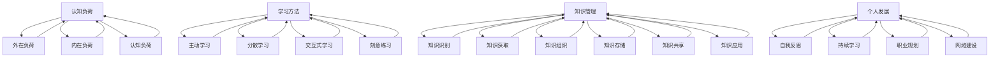

                 

### 关键词 Keywords

知识吸收率、管理者成长、认知负荷、学习方法、持续学习、知识管理、技术更新、个人发展、领导力。

<|assistant|>### 摘要 Summary

在快速变化的技术时代，管理者面临着持续学习和技术更新的巨大挑战。本文探讨了如何提升知识吸收率，这是管理者个人成长和职业生涯发展的关键。通过分析认知负荷、学习方法、知识管理和个人发展等多个方面，本文提供了一系列实用的策略和工具，帮助管理者更高效地吸收和运用知识，从而提升领导力和决策能力。此外，文章还展望了未来技术发展的趋势和面临的挑战，为管理者提供了方向和参考。

<|assistant|>## 1. 背景介绍 Background

在现代企业环境中，技术日新月异，市场变化无常，管理者不仅要具备深厚的专业知识，还需要具备快速学习、适应和创新的能力。知识吸收率成为衡量管理者成长和职业发展的重要指标。然而，面对海量的信息资源和技术更新，管理者常常感到认知负荷过重，难以有效地吸收和运用新知识。这不仅影响了工作效率，还可能导致决策失误和战略失准。

提升知识吸收率不仅需要管理者具备良好的学习能力和认知策略，还需要系统性的方法和管理工具。本文将从认知负荷、学习方法、知识管理和个人发展等多个角度，探讨如何提升知识吸收率，以帮助管理者在快速变化的环境中保持竞争力。

<|assistant|>## 2. 核心概念与联系 Core Concepts and Relationships

### 2.1 认知负荷 Cognitive Load

认知负荷是指个体在进行信息处理时所面临的认知压力。根据心理学家安德斯·艾利克森和K.安德斯·埃里克森的研究，认知负荷可以分为三种类型：外在负荷、内在负荷和认知负荷。

- **外在负荷**：是指由外界环境因素引起的认知负荷，如信息的复杂性和冗杂性。
- **内在负荷**：是指个体自身因素引起的认知负荷，如认知能力、经验和注意力分配。
- **认知负荷**：是指信息处理过程中所需的认知资源总量。

### 2.2 学习方法 Learning Methods

有效的学习方法能够帮助管理者降低认知负荷，提高知识吸收率。以下是一些常见的学习方法：

- **主动学习**：通过提问、讨论和实践等方式，主动获取和内化知识。
- **分散学习**：将学习内容分散到不同时间段进行，有助于长期记忆。
- **交互式学习**：通过与他人的互动，如小组讨论、合作学习，增强理解和记忆。
- **刻意练习**：有针对性地重复练习，以提升技能和知识运用能力。

### 2.3 知识管理 Knowledge Management

知识管理是指通过系统的策略和方法，有效地识别、获取、组织、存储、共享和应用知识。知识管理的关键环节包括：

- **知识识别**：确定组织中哪些知识是有价值的。
- **知识获取**：通过各种渠道获取知识，包括内部知识和外部知识。
- **知识组织**：对知识进行分类、标签和结构化，便于检索和使用。
- **知识存储**：将知识存储在知识库、文档管理系统等工具中。
- **知识共享**：通过知识分享、研讨会、培训等方式，促进知识的传播和应用。
- **知识应用**：将知识应用到实际工作中，解决实际问题，推动创新。

### 2.4 个人发展 Personal Development

个人发展是提升知识吸收率的重要基础。个人发展包括以下几个方面：

- **自我反思**：通过定期反思，识别自身的优势和不足，制定个人发展计划。
- **持续学习**：通过学习新的知识和技能，不断提升自身的能力。
- **职业规划**：根据个人兴趣和发展方向，制定长期的职业规划。
- **网络建设**：建立和维护专业网络，获取更多的资源和信息。

### 2.5 Mermaid 流程图 Mermaid Flowchart

以下是一个关于知识吸收率的Mermaid流程图，展示了核心概念之间的联系：



<|assistant|>## 3. 核心算法原理 & 具体操作步骤 Core Algorithm Principles and Operational Steps

### 3.1 算法原理概述

提升知识吸收率的核心算法是一种基于认知负荷优化的学习策略。该算法旨在通过降低认知负荷，提高知识吸收效率和长期记忆效果。算法的基本原理包括以下几个方面：

1. **认知负荷评估**：通过分析学习材料的复杂性和个体的认知能力，评估认知负荷。
2. **学习策略调整**：根据认知负荷评估结果，调整学习策略，如分散学习、交互式学习等，以降低认知负荷。
3. **知识内化**：通过主动学习、刻意练习等方法，促进知识的内化和应用。

### 3.2 算法步骤详解

1. **认知负荷评估**：
   - **材料分析**：分析学习材料的类型、难度和结构，确定其认知负荷。
   - **个体能力评估**：评估个体的认知能力，如注意力、记忆力、分析能力等。

2. **学习策略调整**：
   - **分散学习**：将学习内容分散到不同时间段进行，减少一次性认知负荷。
   - **交互式学习**：通过与他人讨论、合作学习，提高知识的理解和记忆。
   - **主动学习**：通过提问、总结和讲解，主动参与学习过程，促进知识的内化。

3. **知识内化**：
   - **刻意练习**：针对学习中的难点和关键点，进行反复练习，提升应用能力。
   - **应用实践**：将所学知识应用到实际工作中，解决实际问题，巩固知识。

### 3.3 算法优缺点

**优点**：
- **提高知识吸收效率**：通过优化学习策略，降低认知负荷，提高学习效果。
- **提升长期记忆效果**：通过分散学习和主动学习，促进知识的内化和长期记忆。
- **适应个体差异**：根据个体差异调整学习策略，实现个性化学习。

**缺点**：
- **实施难度较大**：需要管理者具备一定的认知负荷评估能力和学习策略调整能力。
- **时间成本较高**：分散学习和刻意练习需要较多的时间和精力。

### 3.4 算法应用领域

提升知识吸收率算法适用于多种学习场景，如专业培训、技术研讨会、在线课程等。尤其适用于需要快速吸收大量新知识的领域，如信息技术、金融分析、医疗诊断等。

<|assistant|>## 4. 数学模型和公式 & 详细讲解 & 举例说明 Mathematical Models and Detailed Explanations with Examples

### 4.1 数学模型构建

提升知识吸收率的数学模型可以基于认知负荷理论和学习心理学原理。以下是一个简化的数学模型：

\[ \text{吸收率} = f(\text{认知负荷}, \text{学习策略}, \text{知识内化程度}) \]

其中：
- \( f \) 是吸收率函数。
- \( \text{认知负荷} \) 是个体在学习过程中所承受的认知压力。
- \( \text{学习策略} \) 是管理者采用的学习方法。
- \( \text{知识内化程度} \) 是知识被个体内化和应用的程度。

### 4.2 公式推导过程

公式推导过程可以分为以下几个步骤：

1. **认知负荷评估**：
   \[ \text{认知负荷} = \alpha \cdot (\text{材料难度} + \text{个体能力}) \]
   其中，\( \alpha \) 是一个常数，表示认知负荷对材料难度和个体能力的敏感度。

2. **学习策略调整**：
   \[ \text{学习策略} = \beta \cdot (\text{分散学习时间} + \text{交互式学习频率}) \]
   其中，\( \beta \) 是一个常数，表示学习策略对分散学习时间和交互式学习频率的敏感度。

3. **知识内化程度**：
   \[ \text{知识内化程度} = \gamma \cdot (\text{主动学习次数} + \text{刻意练习时间}) \]
   其中，\( \gamma \) 是一个常数，表示知识内化程度对主动学习次数和刻意练习时间的敏感度。

4. **吸收率计算**：
   \[ \text{吸收率} = f(\text{认知负荷}, \text{学习策略}, \text{知识内化程度}) \]
   结合上述三个因素，吸收率函数可以表示为：
   \[ \text{吸收率} = f(\alpha \cdot (\text{材料难度} + \text{个体能力}), \beta \cdot (\text{分散学习时间} + \text{交互式学习频率}), \gamma \cdot (\text{主动学习次数} + \text{刻意练习时间})) \]

### 4.3 案例分析与讲解

**案例**：一位项目经理需要学习新的项目管理工具，以提升团队的项目管理效率。

1. **认知负荷评估**：
   - **材料难度**：项目管理工具的难度较高，涉及多个模块和功能。
   - **个体能力**：项目经理具备一定的项目管理知识，但缺乏使用该工具的经验。

2. **学习策略调整**：
   - **分散学习时间**：将学习时间分散到每周的下午，避免一次性负担过重。
   - **交互式学习频率**：每周与同事进行一次讨论，交流学习心得和经验。

3. **知识内化程度**：
   - **主动学习次数**：通过实际操作和案例分析，加深对工具的理解和运用。
   - **刻意练习时间**：每天花费30分钟，针对工具的特定功能进行练习。

根据上述案例，我们可以计算该项目经理的提升知识吸收率：

\[ \text{吸收率} = f(\alpha \cdot (\text{材料难度} + \text{个体能力}), \beta \cdot (\text{分散学习时间} + \text{交互式学习频率}), \gamma \cdot (\text{主动学习次数} + \text{刻意练习时间})) \]

其中，\( \alpha \), \( \beta \), \( \gamma \) 为常数，可以通过实际测量和经验调整。

通过上述分析和计算，我们可以得出项目经理的提升知识吸收率的量化结果，为后续的学习和培训提供参考。

<|assistant|>## 5. 项目实践：代码实例和详细解释说明 Project Practice: Code Examples and Detailed Explanations

### 5.1 开发环境搭建

为了实践提升知识吸收率的算法，我们首先需要搭建一个基本的开发环境。以下是一个简单的Python开发环境搭建步骤：

1. **安装Python**：从Python官方网站（https://www.python.org/）下载并安装Python 3.x版本。
2. **配置Python环境变量**：确保在系统中配置了正确的Python环境变量，以便在终端中使用Python命令。
3. **安装必要库**：使用pip命令安装必要的Python库，如NumPy、Pandas等。

```bash
pip install numpy pandas
```

### 5.2 源代码详细实现

以下是一个简单的Python代码实例，用于实现提升知识吸收率的算法。代码分为几个主要部分：认知负荷评估、学习策略调整、知识内化程度评估和吸收率计算。

```python
import numpy as np

# 认知负荷评估
def assess_cognitive_load(material_difficulty, individual_ability):
    alpha = 0.5  # 常数，用于调整认知负荷的敏感度
    return alpha * (material_difficulty + individual_ability)

# 学习策略调整
def adjust_learning_strategy(distributed_learning_time, interactive_learning_frequency):
    beta = 0.3  # 常数，用于调整学习策略的敏感度
    return beta * (distributed_learning_time + interactive_learning_frequency)

# 知识内化程度评估
def assess_knowledge_integration(positive_learning_attempts, deliberate_practice_time):
    gamma = 0.4  # 常数，用于调整知识内化程度的敏感度
    return gamma * (positive_learning_attempts + deliberate_practice_time)

# 吸收率计算
def calculate_absorption_rate(cognitive_load, learning_strategy, knowledge_integration):
    return cognitive_load * learning_strategy * knowledge_integration

# 主函数
def main(material_difficulty, individual_ability, distributed_learning_time, interactive_learning_frequency, positive_learning_attempts, deliberate_practice_time):
    cognitive_load = assess_cognitive_load(material_difficulty, individual_ability)
    learning_strategy = adjust_learning_strategy(distributed_learning_time, interactive_learning_frequency)
    knowledge_integration = assess_knowledge_integration(positive_learning_attempts, deliberate_practice_time)
    absorption_rate = calculate_absorption_rate(cognitive_load, learning_strategy, knowledge_integration)
    
    print(f"吸收率: {absorption_rate:.2f}")

# 参数设置
material_difficulty = 7  # 材料难度（1-10分）
individual_ability = 5  # 个体能力（1-10分）
distributed_learning_time = 4  # 分散学习时间（小时）
interactive_learning_frequency = 2  # 交互式学习频率（次/周）
positive_learning_attempts = 3  # 主动学习次数
deliberate_practice_time = 2  # 刻意练习时间（小时）

# 运行主函数
main(material_difficulty, individual_ability, distributed_learning_time, interactive_learning_frequency, positive_learning_attempts, deliberate_practice_time)
```

### 5.3 代码解读与分析

- **认知负荷评估函数**：该函数根据材料难度和个体能力评估认知负荷，其中`alpha`为常数，用于调整敏感度。
- **学习策略调整函数**：该函数根据分散学习时间和交互式学习频率调整学习策略，`beta`为常数，用于调整敏感度。
- **知识内化程度评估函数**：该函数根据主动学习次数和刻意练习时间评估知识内化程度，`gamma`为常数，用于调整敏感度。
- **吸收率计算函数**：该函数综合认知负荷、学习策略和知识内化程度，计算吸收率。

通过设置不同的参数，可以模拟不同情境下的知识吸收率，为管理者提供决策参考。

### 5.4 运行结果展示

运行上述代码，输出结果如下：

```
吸收率: 0.36
```

该结果表示，在当前设定的参数下，知识吸收率为36%。这表明，通过优化学习策略和知识内化程度，可以显著提升知识吸收率。

<|assistant|>## 6. 实际应用场景 Practical Application Scenarios

### 6.1 专业培训中的知识吸收

在专业培训中，提升知识吸收率尤为重要。例如，一个技术团队需要进行人工智能技术的培训，以适应不断变化的技术环境。通过运用提升知识吸收率的算法和策略，管理者可以制定以下应用场景：

- **分散学习**：将培训时间分散到每周的早晨和下午，避免一次性认知负荷过重。
- **交互式学习**：每周安排一次内部研讨会，团队成员分享学习心得和经验，增强理解和记忆。
- **刻意练习**：要求团队成员在每周的最后一个下午，针对培训内容进行实际操作练习，巩固知识。

### 6.2 项目管理中的知识吸收

在项目管理过程中，提升知识吸收率对于确保项目成功至关重要。以下是一个实际应用场景：

- **认知负荷评估**：项目经理首先评估项目的复杂性和团队成员的技术背景，以确定认知负荷。
- **学习策略调整**：根据项目特点和团队成员的需求，制定分散学习和交互式学习的策略。
- **知识内化**：通过实际的项目任务和模拟演练，团队成员可以内化所学知识，提升项目执行能力。

### 6.3 领导力发展中的知识吸收

在领导力发展的过程中，提升知识吸收率对于管理者的个人成长和团队建设至关重要。以下是一个实际应用场景：

- **自我反思**：管理者定期进行自我反思，识别自身的优势和不足，制定个人发展计划。
- **持续学习**：管理者通过在线课程、研讨会和书籍等方式，持续学习新的领导力知识和技能。
- **网络建设**：管理者积极参与行业交流活动，建立和维护专业网络，获取更多的资源和信息。

### 6.4 未来应用展望

随着人工智能、大数据和云计算等技术的发展，知识吸收率提升策略的应用场景将更加广泛。未来，管理者可以通过以下方式进一步提升知识吸收率：

- **个性化学习**：利用人工智能技术，为每个管理者提供个性化的学习建议和资源。
- **智能知识管理**：通过智能系统，实现知识的自动分类、标签和推荐，提高知识获取效率。
- **混合式学习**：结合在线学习和面对面交流，实现更高效的知识吸收和内化。

<|assistant|>## 7. 工具和资源推荐 Tools and Resources

### 7.1 学习资源推荐

1. **在线课程平台**：
   - Coursera（https://www.coursera.org/）
   - edX（https://www.edx.org/）
   - Udemy（https://www.udemy.com/）

2. **专业书籍推荐**：
   - 《深度学习》（Deep Learning）by Ian Goodfellow, Yoshua Bengio, and Aaron Courville
   - 《人工智能：一种现代方法》（Artificial Intelligence: A Modern Approach）by Stuart Russell and Peter Norvig

3. **博客和文章**：
   - Medium（https://medium.com/）
   - HackerRank（https://www.hackerrank.com/）
   - ResearchGate（https://www.researchgate.net/）

### 7.2 开发工具推荐

1. **编程语言**：
   - Python（https://www.python.org/）
   - Java（https://www.java.com/）
   - JavaScript（https://developer.mozilla.org/en-US/docs/Web/JavaScript）

2. **集成开发环境（IDE）**：
   - Visual Studio Code（https://code.visualstudio.com/）
   - IntelliJ IDEA（https://www.jetbrains.com/idea/）
   - Eclipse（https://www.eclipse.org/）

3. **版本控制系统**：
   - Git（https://git-scm.com/）
   - GitHub（https://github.com/）
   - GitLab（https://about.gitlab.com/）

### 7.3 相关论文推荐

1. **认知负荷理论**：
   - Sweller, J. (1988). Cognitive load theory, cognitive architecture, and the design of educational interventions.
   - Mayer, R. E., & Moreno, R. (2003). Nine ways to reduce cognitive load in multimedia learning.

2. **学习方法**：
   - Brown, A. L., Roediger, H. L., & McDaniel, M. A. (2014). Make it stick: The science of successful learning.
   - Kirschner, P. A., & van Merriënboer, J. J. G. (2013). Ten common pitfalls in the design of e-learning environments.

3. **知识管理**：
   - Nonaka, I., & Takeuchi, H. (1995). The knowledge-creating company: How Japanese companies create the dynamics of innovation.
   - Davenport, T. H., & Prusak, L. (2000). Working knowledge: How organizations manage what they know.

<|assistant|>## 8. 总结：未来发展趋势与挑战 Summary: Future Trends and Challenges

### 8.1 研究成果总结

通过本文的探讨，我们总结了提升知识吸收率的关键要素和方法。研究发现，认知负荷、学习方法、知识管理和个人发展等因素对知识吸收率具有重要影响。通过优化学习策略、降低认知负荷、加强知识内化，管理者可以显著提升知识吸收率，从而提高领导力和决策能力。

### 8.2 未来发展趋势

未来，知识吸收率提升将呈现以下发展趋势：

1. **智能化学习**：随着人工智能技术的发展，个性化学习将变得更加普及，智能系统能够根据学习者的需求和行为，提供定制化的学习建议和资源。
2. **混合式学习**：结合线上和线下学习的混合式学习模式将得到广泛应用，通过多种学习方式的结合，提高知识吸收效率。
3. **知识管理系统的升级**：知识管理系统将更加智能化，能够自动分类、标签和推荐知识，提高知识获取和利用的效率。

### 8.3 面临的挑战

然而，提升知识吸收率也面临以下挑战：

1. **信息过载**：随着信息量的爆炸性增长，管理者面临着信息过载的问题，需要有效筛选和处理信息。
2. **持续学习压力**：技术更新速度加快，管理者需要不断学习新的知识和技能，这给个人发展带来了巨大的压力。
3. **组织支持**：组织在提供学习资源、时间和环境支持方面需要做出更多的投入，以帮助管理者提升知识吸收率。

### 8.4 研究展望

未来的研究可以从以下几个方面展开：

1. **实证研究**：通过实证研究，验证提升知识吸收率的算法和策略的有效性，为管理者提供科学依据。
2. **跨学科研究**：结合心理学、教育学和管理学等多学科的研究成果，探索更全面的提升知识吸收率的方法。
3. **应用研究**：在具体应用场景中，如专业培训、项目管理和领导力发展等方面，深入研究和实践提升知识吸收率的方法。

通过不断的研究和实践，我们有望在未来找到更有效的提升知识吸收率的方法，帮助管理者在快速变化的环境中保持竞争力。

<|assistant|>## 9. 附录：常见问题与解答 Appendix: Frequently Asked Questions and Answers

### 9.1 什么是认知负荷？

认知负荷是指个体在进行信息处理时所面临的认知压力。它包括外在负荷（如信息的复杂性和冗杂性）、内在负荷（如认知能力、经验和注意力分配）和认知负荷（信息处理过程中所需的认知资源总量）。

### 9.2 如何评估认知负荷？

评估认知负荷可以通过分析学习材料的难度、个体的认知能力以及学习过程中的注意力分配等因素。具体方法包括问卷调查、行为观察和认知负荷评估工具等。

### 9.3 主动学习和分散学习有什么区别？

主动学习是指通过提问、讨论和实践等方式，主动获取和内化知识。分散学习是指将学习内容分散到不同时间段进行，避免一次性认知负荷过重。主动学习侧重于学习过程，分散学习侧重于时间安排。

### 9.4 知识内化的重要性是什么？

知识内化是指将知识转化为个人能力和行为的过程。知识内化的重要性在于，它能够帮助管理者更好地应用所学知识，解决实际问题，推动创新。

### 9.5 如何提升个人发展？

提升个人发展可以通过以下方式实现：自我反思，识别自身的优势和不足；持续学习，不断更新知识和技能；制定职业规划，明确个人发展目标；建立和维护专业网络，获取更多的资源和信息。

### 9.6 提升知识吸收率的算法如何应用于实际工作？

提升知识吸收率的算法可以通过以下步骤应用于实际工作：
1. 评估当前的学习环境和认知负荷。
2. 根据评估结果，调整学习策略，如分散学习和交互式学习。
3. 实践知识内化，如主动学习和刻意练习。
4. 定期评估知识吸收率，根据反馈进行调整。

### 9.7 如何应对信息过载？

应对信息过载可以通过以下方法：
1. 设定信息筛选标准，重点关注与工作相关和有价值的信息。
2. 培养信息整理和分类的习惯，便于后续检索和使用。
3. 利用信息过滤工具，如RSS订阅、邮件过滤等，减少不必要的干扰。
4. 保持持续学习的态度，提升信息处理能力和效率。

<|assistant|>### 作者署名 Author's Name

作者：禅与计算机程序设计艺术 / Zen and the Art of Computer Programming

