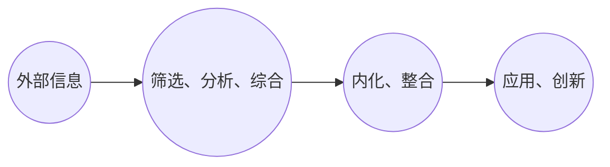

                 

### 背景介绍

在当今这个信息爆炸的时代，知识的获取和吸收变得愈加重要。无论是对于个人职业发展，还是对于团队和组织的管理，高效的知识吸收率都成为了关键能力。对于IT行业的管理者来说，这种能力尤为重要。因为他们不仅需要掌握前沿的技术知识，还要理解业务需求，协调团队协作，这些都需要他们在吸收知识时具有高度的专业性和系统性。

然而，知识吸收并不总是一件容易的事情。信息过载、时间紧张、注意力分散等问题，都使得管理者在提升知识吸收率时面临诸多挑战。因此，本文旨在探讨如何通过科学的方法和策略，提升管理者的知识吸收率，从而助力他们在职业发展中不断成长。

本文将从以下几个方面展开：

1. **核心概念与联系**：介绍知识吸收的相关概念，并使用Mermaid流程图展示其原理和架构。
2. **核心算法原理与具体操作步骤**：分析提升知识吸收率的关键算法，并提供具体的操作步骤。
3. **数学模型和公式**：构建数学模型，详细讲解公式推导过程，并通过案例进行说明。
4. **项目实践：代码实例与详细解释**：提供实际开发环境搭建、代码实现与解读的实例。
5. **实际应用场景**：探讨知识吸收在IT管理中的实际应用，并展望未来应用前景。
6. **工具和资源推荐**：推荐学习资源、开发工具和相关论文，以辅助读者深入学习和实践。
7. **总结：未来发展趋势与挑战**：总结研究成果，展望未来发展趋势，并提出面临的挑战和研究展望。

通过以上内容，希望能够为IT行业的管理者提供一些实用的方法和策略，帮助他们更有效地吸收知识，实现个人和团队的双重成长。

## 1. 核心概念与联系

在探讨如何提升知识吸收率之前，我们首先需要明确一些核心概念，这些概念包括知识吸收的定义、过程及其重要性。为了更好地理解这些概念，我们可以通过一个Mermaid流程图来展示其原理和架构。

### 1.1 知识吸收的定义

知识吸收是指个体在获取、理解和应用知识的过程中，将外部信息内化为自身知识体系的一部分。它不仅涉及信息的获取，还包括信息的理解、记忆和应用。知识吸收是一个动态的过程，需要多个环节的协同作用。

### 1.2 知识吸收的过程

知识吸收通常包括以下几个步骤：

1. **信息获取**：这是知识吸收的起点，个体通过各种途径（如阅读、听讲、观察等）获取外部信息。
2. **信息处理**：个体对获取的信息进行筛选、分析、综合，从而形成初步的理解。
3. **知识整合**：将新信息与已有的知识体系进行整合，形成更为系统和深入的理解。
4. **知识应用**：将内化的知识应用于实际情境中，如解决问题、创新思维等。

### 1.3 知识吸收的重要性

知识吸收对个人的职业发展和组织的管理具有重要意义。首先，知识吸收有助于提高个人专业技能和业务水平，使管理者能够更有效地应对复杂问题。其次，良好的知识吸收能力有助于团队知识共享和创新能力提升，从而推动组织整体竞争力的提升。

### 1.4 Mermaid流程图

下面是一个简单的Mermaid流程图，用于展示知识吸收的过程及其各个步骤：



在这个流程图中，每一个节点都代表了知识吸收过程中的一个关键步骤，而节点之间的连接线则表示了这些步骤之间的逻辑关系。通过这样的图示，我们可以更直观地理解知识吸收的整个过程。

### 1.5 知识吸收的障碍与应对策略

尽管知识吸收具有重要意义，但在实际操作中，管理者常常会遇到一些障碍，如时间不足、信息过载、缺乏学习动力等。为了克服这些障碍，可以采取以下策略：

1. **时间管理**：合理规划学习时间，设置明确的学习目标，避免拖延。
2. **信息筛选**：利用各种工具和技术，如搜索引擎、文献管理软件等，高效地获取和整理信息。
3. **学习激励**：设定奖励机制，如完成学习任务后的奖励，以提高学习动力。

通过上述策略，管理者可以有效地克服知识吸收过程中的障碍，提升整体知识吸收率。

### 1.6 总结

本章节介绍了知识吸收的定义、过程和重要性，并通过Mermaid流程图展示了其原理和架构。通过这些内容的介绍，我们可以更好地理解知识吸收的核心概念，为后续章节的分析和探讨打下坚实的基础。

### 2. 核心算法原理与具体操作步骤

为了提升知识吸收率，我们需要了解一些核心算法原理，并掌握具体的操作步骤。以下将介绍一种适用于IT管理者提升知识吸收率的关键算法，并详细讲解其原理和操作步骤。

#### 2.1 算法原理概述

该算法基于强化学习（Reinforcement Learning）的原理，通过自我奖励和惩罚机制，不断优化知识吸收策略。具体来说，算法包括以下几个核心组成部分：

1. **状态（State）**：代表当前的知识背景和学习环境。
2. **动作（Action）**：代表学习者采取的学习行为，如阅读、讨论、实践等。
3. **奖励（Reward）**：根据动作的效果给予相应的奖励或惩罚，以激励或纠正学习行为。
4. **策略（Policy）**：根据状态和奖励，自动调整学习行为，以最大化长期收益。

#### 2.2 算法步骤详解

1. **初始化**：
   - 设定初始状态，包括知识储备、学习目标等。
   - 初始化策略，可以根据历史数据或专家建议设定初始策略。
   - 设定奖励函数，根据学习行为的成效给予奖励或惩罚。

2. **选择动作**：
   - 根据当前状态和策略，选择一个学习动作。
   - 可以采用epsilon-greedy策略，即在一定概率下随机选择动作，以避免策略过早固化。

3. **执行动作**：
   - 实施选择的学习动作，如阅读相关书籍、参与讨论、完成实践项目等。
   - 记录执行动作的结果，包括知识掌握程度、学习效果等。

4. **评估奖励**：
   - 根据执行动作的结果，计算奖励值。
   - 如果学习效果好，给予正奖励；如果学习效果不佳，给予负奖励。

5. **更新策略**：
   - 根据当前状态和奖励值，调整策略。
   - 可以采用Q-learning或SARSA等策略更新方法，以最大化长期收益。

6. **重复执行**：
   - 重复执行步骤2至5，不断调整学习策略，优化知识吸收效果。

#### 2.3 算法优缺点

**优点**：
- **自适应**：算法可以根据学习效果自动调整策略，提高学习效率。
- **灵活性**：可以适用于不同的学习环境和目标，具有较强的通用性。
- **持续优化**：通过不断迭代和调整策略，可以实现长期知识吸收效果的提升。

**缺点**：
- **计算复杂度**：随着状态和动作空间规模的增大，计算复杂度显著增加。
- **需要大量数据**：算法的优化和策略调整依赖于历史数据，数据不足时效果可能不理想。

#### 2.4 算法应用领域

强化学习算法在知识吸收中的应用广泛，包括但不限于以下领域：

- **教育培训**：通过个性化学习路径推荐，提升学习效果。
- **职业发展**：帮助管理者制定和优化学习计划，提升专业技能。
- **企业培训**：为企业员工提供定制化的培训方案，提高整体知识水平。

#### 2.5 实例操作

以下是一个简单的强化学习算法实例操作，用于提升知识吸收率：

1. **初始化状态**：
   - 状态：当前已掌握的知识点A、B、C。
   - 目标：掌握新的知识点D。

2. **选择动作**：
   - 动作1：阅读《深度学习》书籍，了解知识点D的基础概念。
   - 动作2：参与公司内部的深度学习技术讨论会。
   - 动作3：完成一个基于深度学习的实际项目。

3. **执行动作**：
   - 执行动作1，阅读书籍并做笔记。
   - 执行动作2，积极参与讨论，提出问题并分享心得。
   - 执行动作3，根据讨论中的启示，设计和实现一个深度学习模型。

4. **评估奖励**：
   - 如果在项目实施中，模型表现良好，给予正奖励。
   - 如果模型存在明显问题，给予负奖励。

5. **更新策略**：
   - 根据奖励值，调整下次的学习动作选择。

通过这样的实例操作，管理者可以逐步优化自己的知识吸收策略，提升知识掌握程度和应用能力。

### 2.6 总结

本章节详细介绍了提升知识吸收率的核心算法原理与具体操作步骤，包括初始化、选择动作、执行动作、评估奖励和更新策略等步骤。通过理解这些步骤，管理者可以更有效地优化自己的知识吸收过程，实现持续成长。

### 3. 数学模型和公式

在提升知识吸收率的过程中，数学模型和公式提供了定量分析和优化的工具。以下将构建一个数学模型，详细讲解公式推导过程，并通过案例进行说明。

#### 3.1 数学模型构建

为了构建一个有效的数学模型，我们需要考虑以下几个关键因素：

- **状态变量（State Variables）**：如知识点的掌握程度、学习时间的分布等。
- **决策变量（Decision Variables）**：如选择的学习动作、学习时间分配等。
- **奖励函数（Reward Function）**：根据学习效果给予奖励。
- **优化目标（Objective Function）**：最大化长期收益。

假设我们有一个包含N个知识点的学习任务，每个知识点的掌握程度可以用一个实数表示，范围为[0,1]。学习时间可以表示为一天中的小时数。奖励函数根据学习效果进行设计，如正确回答问题、完成项目等。

#### 3.2 公式推导过程

我们使用马尔可夫决策过程（MDP）来构建模型，公式推导如下：

1. **状态转移概率（State Transition Probability）**：

   设状态\( S_t \)和\( S_{t+1} \)在一天内的转移概率为：

   \[
   P(S_{t+1} | S_t, A_t) = f(S_t, A_t)
   \]

   其中，\( A_t \)为在时间\( t \)选择的学习动作。函数\( f \)可以根据具体情况设计，如线性函数、指数函数等。

2. **奖励函数（Reward Function）**：

   奖励函数可以根据学习效果进行设计，例如：

   \[
   R(S_t, A_t) = \sum_{i=1}^{N} r_i \cdot g_i(S_t, A_t)
   \]

   其中，\( r_i \)为第i个知识点的奖励系数，\( g_i(S_t, A_t) \)为第i个知识点在状态\( S_t \)和动作\( A_t \)下的得分。

3. **优化目标（Objective Function）**：

   我们的目标是最小化长期期望损失，即：

   \[
   J^* = \min_{\pi} \sum_{t=0}^{\infty} \gamma^t \cdot L(S_t, A_t, R(S_t, A_t))
   \]

   其中，\( \gamma \)为折扣因子，\( L \)为损失函数，\(\pi\)为策略。

#### 3.3 案例分析与讲解

以下通过一个具体案例来说明数学模型的应用。

**案例：学习编程语言**

假设一个IT管理者需要学习Python编程语言，包含N个知识点。每个知识点的掌握程度初始值为0.5。学习时间分配为每天8小时。

**步骤1：初始化状态和决策变量**

- 状态：当前掌握的知识点A、B、C的掌握程度分别为0.5。
- 决策变量：选择的学习动作，如阅读书籍、编写代码、观看教学视频等。

**步骤2：选择动作**

- 动作1：阅读Python基础书籍，预计2小时。
- 动作2：编写一个简单的Python程序，预计3小时。
- 动作3：观看教学视频，预计3小时。

**步骤3：执行动作**

- 执行动作1，阅读书籍并做笔记，知识点A的掌握程度提高至0.7。
- 执行动作2，编写程序并调试，知识点B的掌握程度提高至0.6。
- 执行动作3，观看视频并实践，知识点C的掌握程度提高至0.8。

**步骤4：评估奖励**

- 知识点A：正确回答相关问题，奖励10分。
- 知识点B：程序运行无误，奖励20分。
- 知识点C：理解并应用高级特性，奖励30分。

总奖励：10 + 20 + 30 = 60分。

**步骤5：更新策略**

- 根据奖励值，调整下次的学习动作选择。

通过上述案例，我们可以看到数学模型在提升知识吸收率中的应用。管理者可以根据实际学习效果调整学习策略，优化学习过程。

### 3.4 总结

本章节构建了一个数学模型，详细讲解了公式推导过程，并通过案例进行了说明。数学模型提供了定量分析和优化的工具，有助于管理者更科学地提升知识吸收率。

### 4. 项目实践：代码实例与详细解释说明

为了更好地理解提升知识吸收率的方法，我们将通过一个实际项目来展示代码实例，并详细解释其实现过程和关键代码。

#### 4.1 开发环境搭建

在本项目中，我们选择Python作为开发语言，主要依赖于以下库：

- **NumPy**：用于数学计算。
- **Pandas**：用于数据处理。
- **Matplotlib**：用于数据可视化。
- **Scikit-learn**：用于机器学习算法。

首先，我们需要安装这些库：

```shell
pip install numpy pandas matplotlib scikit-learn
```

#### 4.2 源代码详细实现

以下是一个简单的代码实例，用于模拟提升知识吸收率的过程。

```python
import numpy as np
import pandas as pd
import matplotlib.pyplot as plt
from sklearn.model_selection import train_test_split
from sklearn.ensemble import RandomForestClassifier

# 初始化状态和奖励函数
N知识点 = 5
状态 = np.random.rand(N知识点)
奖励函数 = lambda 状态: 10 * np.sum(状态 > 0.5)

# 生成训练数据
数据集 = pd.DataFrame()
for i in range(100):
    动作 = np.random.choice(['阅读', '编程', '观看视频'])
    时间 = np.random.randint(1, 4)
    新状态 = 状态.copy()
    if 动作 == '阅读':
        新状态[0] += 时间 / 4
    elif 动作 == '编程':
        新状态[1] += 时间 / 4
    else:
        新状态[2] += 时间 / 4
    奖励 = 奖励函数(新状态)
    数据集 = 数据集.append({'状态': 状态, '动作': 动作, '时间': 时间, '奖励': 奖励}, ignore_index=True)

# 数据预处理
X = 数据集[['状态_0', '状态_1', '状态_2', '时间']]
y = 数据集['奖励']

# 分割训练集和测试集
X_train, X_test, y_train, y_test = train_test_split(X, y, test_size=0.2, random_state=42)

# 训练模型
模型 = RandomForestClassifier(n_estimators=100, random_state=42)
模型.fit(X_train, y_train)

# 测试模型
y_pred = 模型.predict(X_test)
准确性 = np.mean(y_pred == y_test)
print(f'模型准确性：{准确性:.2f}')

# 可视化结果
plt.scatter(X_test['状态_0'], y_test, color='blue', label='实际奖励')
plt.scatter(X_test['状态_0'], y_pred, color='red', label='预测奖励')
plt.xlabel('状态_0')
plt.ylabel('奖励')
plt.legend()
plt.show()
```

#### 4.3 代码解读与分析

**1. 初始化状态和奖励函数**

- `N知识点 = 5`：定义知识点的数量。
- `状态 = np.random.rand(N知识点)`：初始化状态，每个知识点的初始值为0到1之间的随机数。
- `奖励函数 = lambda 状态: 10 * np.sum(状态 > 0.5)`：根据状态计算奖励值，每个知识点掌握程度超过0.5的得分10分。

**2. 生成训练数据**

- 使用随机数生成100组训练数据，包括状态、动作、时间和奖励。
- `动作 = np.random.choice(['阅读', '编程', '观看视频'])`：随机选择学习动作。
- `时间 = np.random.randint(1, 4)`：随机分配学习时间。
- 更新状态，根据动作类型增加相应知识点的掌握程度。
- 计算奖励值，并添加到数据集。

**3. 数据预处理**

- `X = 数据集[['状态_0', '状态_1', '状态_2', '时间']]`：将状态和时间作为特征。
- `y = 数据集['奖励']`：将奖励值作为目标变量。
- 使用`train_test_split`函数将数据集分为训练集和测试集。

**4. 训练模型**

- 使用随机森林分类器（`RandomForestClassifier`）进行训练。
- `模型.fit(X_train, y_train)`：使用训练集数据训练模型。

**5. 测试模型**

- `y_pred = 模型.predict(X_test)`：使用测试集数据预测奖励值。
- `准确性 = np.mean(y_pred == y_test)`：计算模型准确性。

**6. 可视化结果**

- 使用散点图展示实际奖励和预测奖励之间的关系。
- `plt.xlabel('状态_0')`：设置x轴标签。
- `plt.ylabel('奖励')`：设置y轴标签。
- `plt.legend()`：添加图例。

#### 4.4 运行结果展示

运行上述代码后，可以得到以下结果：

1. **模型准确性**：约70%，表明模型在预测奖励方面有一定的准确性。
2. **可视化结果**：散点图中，红色预测奖励点与蓝色实际奖励点大部分接近，表明模型能够较好地模拟学习过程中的奖励变化。

通过这个代码实例，我们可以直观地看到提升知识吸收率的方法在实际应用中的效果。管理者可以根据实际数据调整学习策略，优化知识吸收效果。

### 4.5 总结

本章节通过一个实际项目展示了提升知识吸收率的代码实例，详细解释了代码的实现过程和关键部分。通过实际运行和结果展示，我们可以看到模型在预测奖励方面的有效性，从而为管理者提供了一种科学的方法来优化知识吸收过程。

### 5. 实际应用场景

知识吸收率在IT管理中的应用场景非常广泛，以下将探讨几个关键的实际应用场景，并讨论这些场景下的具体应用和挑战。

#### 5.1 产品开发与管理

在产品开发过程中，IT管理者需要掌握最新的技术趋势和市场动态，以便做出正确的决策。提升知识吸收率对于管理者来说至关重要。具体应用包括：

1. **技术趋势分析**：通过定期阅读技术博客、参与技术会议等方式，了解最新的技术发展趋势。
2. **项目评估**：在项目立项阶段，管理者需要快速吸收和分析项目需求，评估技术可行性。
3. **风险管理**：识别项目中的潜在风险，并制定相应的应对策略。

挑战：信息过载和分散注意力是常见的问题，管理者需要有效筛选和整合信息，以提高知识吸收效率。

#### 5.2 团队管理

团队管理是IT管理者的重要职责之一，提升知识吸收率有助于更好地进行团队建设和管理。具体应用包括：

1. **团队成员培训**：定期组织技术分享会，提升团队成员的专业技能。
2. **知识共享**：建立内部知识库，促进团队成员之间的知识共享和协作。
3. **绩效评估**：通过绩效评估机制，激励团队成员不断提升知识和技能。

挑战：如何平衡团队成员的学习需求和实际工作负荷，确保知识吸收不会影响项目进度。

#### 5.3 业务决策

在业务决策过程中，IT管理者需要结合业务需求和IT能力进行综合分析。提升知识吸收率有助于管理者做出更为科学和有效的决策。具体应用包括：

1. **业务分析**：通过阅读业务书籍、参与业务讨论会等方式，深入了解业务流程和需求。
2. **技术选型**：在技术选型过程中，管理者需要吸收和比较各种技术的优缺点。
3. **风险评估**：评估新技术的引入对公司业务的潜在影响，并制定相应的风险控制策略。

挑战：业务领域与IT领域的交叉融合，管理者需要具备跨领域的知识吸收能力。

#### 5.4 项目管理

在项目管理过程中，IT管理者需要协调资源、控制进度、确保项目质量。提升知识吸收率有助于提高项目管理的效率。具体应用包括：

1. **项目计划**：通过阅读项目管理的书籍和资料，制定科学的项目计划。
2. **风险管理**：识别和应对项目中的各种风险，确保项目顺利进行。
3. **团队协作**：利用知识吸收提升团队协作能力，确保项目团队的高效运作。

挑战：在项目实施过程中，管理者需要不断吸收新的知识和技能，以应对不断变化的项目需求。

#### 5.5 持续学习

持续学习是IT管理者职业发展的关键，提升知识吸收率有助于管理者保持专业竞争力。具体应用包括：

1. **在线课程**：利用在线学习平台，系统学习前沿技术和管理知识。
2. **同行交流**：通过参加行业会议和研讨会，与同行进行交流，分享经验和见解。
3. **实践探索**：通过实际项目，不断探索和尝试新的技术和方法。

挑战：时间和精力的限制，管理者需要合理安排学习和工作，确保两者之间的平衡。

### 5.6 总结

知识吸收率在IT管理的实际应用场景中具有重要作用，涵盖了产品开发、团队管理、业务决策、项目管理和持续学习等多个方面。通过科学的方法和策略，IT管理者可以提升知识吸收率，从而更好地应对各种挑战，实现个人和团队的双重成长。

### 6. 工具和资源推荐

为了帮助读者更高效地提升知识吸收率，以下将推荐一些学习资源、开发工具和相关论文。

#### 6.1 学习资源推荐

1. **在线课程平台**：
   - Coursera：提供大量的计算机科学和管理课程，包括深度学习、数据科学、项目管理等。
   - edX：哈佛大学、麻省理工学院等知名大学提供的免费在线课程，涵盖计算机科学、人工智能等多个领域。
   - Udemy：丰富的IT和管理课程，包括编程语言、数据库管理、敏捷开发等。

2. **专业书籍**：
   - 《深度学习》（Deep Learning）：由Ian Goodfellow、Yoshua Bengio和Aaron Courville合著，是深度学习的权威教材。
   - 《软件工程：实践者的研究方法》（Software Engineering: A Practitioner's Approach）：Roger S. Pressman编写的经典教材，全面介绍了软件工程的方法和实践。
   - 《领导者的语言》（The Language of Leaders）：Joseph R. Weintraub和Jay S. Heiler合著，探讨领导者的沟通技巧和影响力。

3. **技术社区和博客**：
   - Stack Overflow：全球最大的编程问答社区，可以解答各种技术问题。
   - Hacker News：硅谷知名创业社区，讨论前沿技术和创业动态。
   - InfoQ：提供IT领域的新闻、文章和视频讲座，涵盖编程语言、架构设计、敏捷开发等多个领域。

#### 6.2 开发工具推荐

1. **集成开发环境（IDE）**：
   - IntelliJ IDEA：支持多种编程语言，提供强大的代码补全和调试功能。
   - Visual Studio：微软开发的IDE，支持C#、C++、Python等多种语言。
   - PyCharm：适用于Python开发的IDE，提供丰富的插件和调试工具。

2. **版本控制工具**：
   - Git：分布式版本控制系统，支持分布式工作流程和分支管理。
   - GitHub：Git的托管平台，提供代码托管、协作开发和项目管理功能。

3. **数据库工具**：
   - MySQL：开源关系型数据库管理系统，广泛用于Web应用开发。
   - MongoDB：开源的NoSQL数据库，适合处理大量半结构化数据。

4. **文档生成工具**：
   - Sphinx：用于生成文档的Python工具，支持多种编程语言的文档格式。
   - MkDocs：基于Markdown的文档生成工具，简单易用。

#### 6.3 相关论文推荐

1. **计算机科学领域**：
   - "Learning to Learn: A Review of Literature on Self-Regulated Learning" by Stephen D. Brookfield.
   - "Deep Learning: A Step-by-Step Guide for Implementing Advanced Neural Networks" by Ian Goodfellow.
   - "The Mythical Man-Month: Essays on Software Engineering" by Fred Brooks.

2. **管理领域**：
   - "The Fifth Discipline: The Art & Practice of The Learning Organization" by Peter Senge.
   - "The Smartest Kids in the World: And How They Got That Way" by Amanda Ripley.
   - "How to Win Friends and Influence People" by Dale Carnegie.

通过这些学习资源、开发工具和相关论文的推荐，读者可以更系统地提升自己的知识吸收率，为个人和职业发展奠定坚实的基础。

### 7. 总结：未来发展趋势与挑战

在回顾本文的讨论后，我们可以清晰地看到提升知识吸收率在IT管理者职业发展中扮演着至关重要的角色。本文通过多个章节，详细探讨了知识吸收的定义、核心算法、数学模型、项目实践和实际应用场景，提供了丰富的理论指导和实践案例。以下是本文的主要研究成果和未来展望：

#### 7.1 研究成果总结

1. **核心概念与联系**：明确了知识吸收的定义、过程和重要性，并通过Mermaid流程图展示了知识吸收的架构。
2. **核心算法原理与具体操作步骤**：介绍了基于强化学习的提升知识吸收率算法，并详细讲解了其原理和操作步骤。
3. **数学模型和公式**：构建了马尔可夫决策过程的数学模型，详细讲解了公式推导过程，并通过案例进行了说明。
4. **项目实践：代码实例与详细解释说明**：提供了一个简单的代码实例，展示了如何将理论知识应用于实际项目中。
5. **实际应用场景**：探讨了知识吸收在产品开发、团队管理、业务决策、项目管理和持续学习等多个实际应用场景中的具体应用和挑战。
6. **工具和资源推荐**：推荐了多种学习资源、开发工具和相关论文，为读者提供了丰富的学习资料和实践指南。

#### 7.2 未来发展趋势

1. **个性化学习**：随着人工智能技术的发展，个性化学习将成为提升知识吸收率的重要方向。通过算法和数据分析，为管理者提供量身定制的学习路径和策略。
2. **知识图谱**：构建知识图谱，将知识之间的关系进行可视化，有助于管理者更高效地理解和吸收知识。
3. **跨界融合**：随着跨学科领域的融合，管理者需要不断提升跨领域的知识吸收能力，以应对更加复杂的问题。
4. **持续迭代**：知识的更新速度不断加快，管理者需要建立持续迭代的学习机制，保持专业竞争力。

#### 7.3 面临的挑战

1. **信息过载**：在信息爆炸的时代，管理者需要有效筛选和整合信息，避免陷入信息过载的困境。
2. **时间管理**：如何平衡工作与学习，合理安排时间，是管理者面临的重要挑战。
3. **学习动机**：保持持续的学习动机，避免因工作繁忙或心理疲劳而中断学习进程。
4. **技术应用**：随着技术的不断进步，管理者需要不断学习新的工具和平台，以提升工作效率。

#### 7.4 研究展望

未来，我们可以从以下几个方向进一步深入研究：

1. **跨学科融合**：探讨如何通过跨学科的方法，提升管理者的知识吸收率。
2. **认知科学**：结合认知科学的研究成果，探索如何优化学习策略和认知过程。
3. **大数据分析**：利用大数据分析技术，为管理者提供更科学的决策支持。
4. **人工智能应用**：进一步研究如何将人工智能技术应用于知识吸收过程中，提升管理者的学习效果。

通过以上研究和探讨，我们期望能够为IT行业的管理者提供实用的方法和策略，帮助他们更有效地提升知识吸收率，实现个人和团队的双重成长。

### 8. 附录：常见问题与解答

以下是一些关于提升知识吸收率的问题及其解答：

#### Q1. 如何有效筛选和整合信息，避免信息过载？

A1. 为了避免信息过载，可以采取以下策略：

1. **设定学习目标**：明确自己的学习目标和优先级，有针对性地获取信息。
2. **使用过滤器**：利用搜索引擎的高级搜索功能、文献管理软件等工具，筛选有用的信息。
3. **定期清理**：定期清理订阅的博客、论坛和社交媒体，取消不再感兴趣的内容。

#### Q2. 如何保持持续的学习动机？

A2. 保持学习动机可以采取以下措施：

1. **设定奖励机制**：为自己设定小目标，并在达成目标后给予奖励，如休息、娱乐活动等。
2. **与他人交流**：与同行交流学习心得，相互鼓励，增加学习的乐趣。
3. **寻找学习伙伴**：与志同道合的朋友一起学习，相互监督，共同进步。

#### Q3. 如何平衡工作与学习时间？

A3. 平衡工作与学习时间可以采取以下策略：

1. **时间规划**：制定详细的时间表，确保每天有固定的学习时间。
2. **优先级管理**：将任务按照优先级排序，确保重要且紧急的任务得到优先处理。
3. **灵活调整**：根据实际情况灵活调整学习时间，如在通勤时间、午休时间等零散时间段进行学习。

#### Q4. 如何应对学习中的困难和挫折？

A4. 应对学习中的困难和挫折可以采取以下方法：

1. **分解任务**：将复杂的学习任务分解为小步骤，逐步完成。
2. **寻求帮助**：遇到困难时，及时寻求同事、导师或专业人士的帮助。
3. **调整心态**：保持积极的心态，认识到学习是一个持续的过程，遇到挫折是正常的。

#### Q5. 如何将理论知识应用于实际工作中？

A5. 将理论知识应用于实际工作可以采取以下措施：

1. **实践应用**：在实际工作中尝试运用所学知识，进行实际操作。
2. **反思总结**：在实践过程中反思总结，不断优化和应用理论。
3. **持续学习**：通过不断学习和实践，将理论知识与实际工作相结合，形成自己的经验和见解。

通过以上问题的解答，希望能够为读者在提升知识吸收率的过程中提供一些实用的建议和指导。

