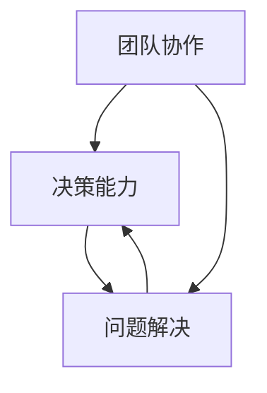

                 

关键词：管理者、提问技巧、团队协作、决策能力、问题解决

> 摘要：在信息技术飞速发展的时代，管理者不仅需要具备出色的技术能力，还需要掌握有效的提问技巧。本文将探讨提问在管理中的重要性，以及管理者如何通过提问来提高团队协作、提升决策能力和解决复杂问题。

## 1. 背景介绍

在当今复杂多变的工作环境中，管理者的角色变得越来越重要。他们不仅要负责团队的技术方向和项目进度，还需要处理人际关系、协调资源和应对各种突发事件。在这个过程中，提问技巧成为管理者必备的技能之一。有效的提问不仅能够激发团队的思考，还能够帮助管理者更好地了解团队的需求，做出更为明智的决策。

<|assistant|>### 1.1 技术领域的挑战

在技术领域，管理者面临着一系列的挑战。例如，技术的快速更新迭代要求管理者具备前瞻性的技术视野和快速学习的能力。此外，团队成员的技术背景和经验水平各异，管理者需要通过提问来了解每个人的优势和劣势，从而合理分配任务和资源。同时，技术项目的复杂性不断增加，管理者需要通过有效的提问来确保项目按照既定目标顺利推进。

### 1.2 人际关系的复杂性

在团队管理中，人际关系问题常常是管理者面临的另一大挑战。团队成员之间可能存在沟通障碍、冲突和误解。通过提问，管理者可以深入了解团队成员的想法和感受，促进团队内部的沟通和协作，从而提升团队的整体绩效。

### 1.3 决策的复杂性

在决策过程中，管理者需要考虑多个因素，包括技术可行性、市场趋势、资源分配和风险管理等。提问可以帮助管理者获取更多的信息，从而做出更为全面和明智的决策。

## 2. 核心概念与联系

为了更好地理解提问在管理中的重要性，我们需要首先明确几个核心概念：团队协作、决策能力和问题解决。

### 2.1 团队协作

团队协作是指团队成员在共同目标下，通过相互合作和协调，共同完成任务的过程。有效的团队协作需要良好的沟通和互动。提问是促进团队沟通和协作的重要手段。通过提问，管理者可以激发团队成员的思考，鼓励他们分享自己的想法和经验，从而提升团队的协作效率。

### 2.2 决策能力

决策能力是指管理者在复杂情境中，基于充分的信息和合理的分析，做出合理决策的能力。有效的提问可以帮助管理者获取更多的信息，从而提高决策的质量。提问还能够促使管理者从不同的角度思考问题，避免陷入决策的陷阱。

### 2.3 问题解决

问题解决是指管理者在面对问题时，通过分析问题、制定解决方案和实施解决方案的过程。提问是问题解决过程中不可或缺的一部分。通过提问，管理者可以深入了解问题的本质，找到问题的根源，从而制定出更为有效的解决方案。

### 2.4 Mermaid 流程图

以下是团队协作、决策能力和问题解决之间关系的 Mermaid 流程图：



### 2.5 小结

通过上述讨论，我们可以看到，提问在管理中的重要性不容忽视。有效的提问不仅能够促进团队协作，提升决策能力，还能够帮助管理者更好地解决问题。

## 3. 核心算法原理 & 具体操作步骤

### 3.1 算法原理概述

在管理中，提问技巧可以被视为一种算法，其核心原理是通过有效的沟通和互动，提高团队成员的参与度和思考深度。这个算法的基本操作步骤包括：

1. **明确目标**：在提问之前，管理者需要明确提问的目标，即希望通过提问解决什么问题或达到什么效果。
2. **选择合适的提问方式**：根据团队成员的特点和问题的性质，选择合适的提问方式，例如开放式问题、封闭式问题或引导性问题。
3. **提出问题**：在合适的时机，以合适的方式提出问题。
4. **倾听和反馈**：在团队成员回答问题后，管理者需要认真倾听，并给予及时的反馈。

### 3.2 算法步骤详解

#### 3.2.1 明确目标

在明确目标这一步骤中，管理者需要思考以下几个问题：

- 我希望通过提问解决什么问题？
- 提问的目标是什么？
- 提问的内容和形式应该是什么样的？

#### 3.2.2 选择合适的提问方式

在选择提问方式时，管理者需要考虑以下几个因素：

- 团队成员的特点：例如，团队成员是否喜欢分享自己的想法，是否善于表达等。
- 问题的性质：例如，问题是否需要深入讨论，是否需要收集多方面的信息等。
- 提问的目的：例如，是为了获取信息，还是为了引导团队成员思考。

根据这些因素，管理者可以选择以下几种提问方式：

- 开放式问题：例如，“你对这个问题有什么看法？”
- 封闭式问题：例如，“这个问题有几种可能的解决方案？”
- 引导性问题：例如，“如果你是项目经理，你会如何处理这个问题？”

#### 3.2.3 提出问题

在提出问题这一步骤中，管理者需要注意以下几点：

- 提问的时机：在合适的时机提出问题，例如，在讨论进行到关键点时。
- 提问的方式：用清晰、简洁的语言提出问题，避免使用含糊的表述。
- 提问的态度：以尊重、真诚和开放的态度提出问题，鼓励团队成员积极参与。

#### 3.2.4 倾听和反馈

在团队成员回答问题后，管理者需要认真倾听，并给予及时的反馈。以下几点是管理者需要注意的：

- 倾听：全神贯注地倾听团队成员的回答，不打断他们的发言。
- 反馈：对团队成员的回答给予肯定和鼓励，提出建设性的意见和建议。
- 提问：在必要时，可以继续提问，以深入了解团队成员的想法和感受。

### 3.3 算法优缺点

#### 优点

- 提高团队协作：有效的提问可以促进团队成员之间的沟通和协作，提高团队的整体效率。
- 提升决策能力：通过提问，管理者可以获取更多的信息，从而做出更为明智的决策。
- 解决问题：提问可以帮助管理者深入了解问题的本质，找到解决问题的方法。

#### 缺点

- 时间消耗：有效的提问需要时间，可能影响其他工作任务的完成。
- 难以控制：在提问过程中，团队成员可能会提出意想不到的问题，管理者需要灵活应对。

### 3.4 算法应用领域

提问技巧在管理中具有广泛的应用领域，包括：

- 项目管理：通过提问，管理者可以了解项目的进展情况，协调团队成员的工作，确保项目按计划推进。
- 团队建设：通过提问，管理者可以了解团队成员的需求和期望，促进团队内部的沟通和协作。
- 决策制定：通过提问，管理者可以获取更多的信息，从而做出更为明智的决策。

## 4. 数学模型和公式 & 详细讲解 & 举例说明

### 4.1 数学模型构建

在管理中，提问技巧可以被视为一种优化问题。其目标是通过有效的提问，最大化团队协作效率和决策质量。我们可以构建以下数学模型：

设 $T$ 为提问技巧的得分，$C$ 为团队协作得分，$D$ 为决策质量得分。则有：

$$
T = C + D
$$

### 4.2 公式推导过程

为了推导上述公式，我们需要分析提问技巧对团队协作和决策质量的影响。

#### 4.2.1 团队协作得分 $C$

团队协作得分 $C$ 可以通过以下公式计算：

$$
C = \frac{1}{N} \sum_{i=1}^{N} p_i \cdot s_i
$$

其中，$N$ 为团队成员数量，$p_i$ 为第 $i$ 个团队成员对提问的响应程度，$s_i$ 为第 $i$ 个团队成员的技能水平。

#### 4.2.2 决策质量得分 $D$

决策质量得分 $D$ 可以通过以下公式计算：

$$
D = \frac{1}{M} \sum_{j=1}^{M} q_j \cdot r_j
$$

其中，$M$ 为决策指标数量，$q_j$ 为第 $j$ 个决策指标的权重，$r_j$ 为第 $j$ 个决策指标的得分。

#### 4.2.3 提问技巧得分 $T$

根据上述公式，我们可以推导出提问技巧得分 $T$：

$$
T = \frac{1}{N} \sum_{i=1}^{N} p_i \cdot s_i + \frac{1}{M} \sum_{j=1}^{M} q_j \cdot r_j
$$

### 4.3 案例分析与讲解

假设在一个团队中，有 5 名成员，他们分别的响应程度和技能水平如下表：

| 成员 | 响应程度 | 技能水平 |
| --- | --- | --- |
| A | 0.8 | 0.9 |
| B | 0.7 | 0.8 |
| C | 0.6 | 0.7 |
| D | 0.9 | 0.6 |
| E | 0.5 | 0.5 |

同时，假设有 3 个决策指标，它们的权重和得分如下表：

| 指标 | 权重 | 得分 |
| --- | --- | --- |
| 进度 | 0.5 | 0.8 |
| 质量保障 | 0.3 | 0.9 |
| 风险评估 | 0.2 | 0.7 |

根据上述数据和公式，我们可以计算出团队协作得分 $C$ 和决策质量得分 $D$：

$$
C = \frac{1}{5} \sum_{i=1}^{5} p_i \cdot s_i = \frac{1}{5} \times (0.8 \cdot 0.9 + 0.7 \cdot 0.8 + 0.6 \cdot 0.7 + 0.9 \cdot 0.6 + 0.5 \cdot 0.5) = 0.75
$$

$$
D = \frac{1}{3} \sum_{j=1}^{3} q_j \cdot r_j = \frac{1}{3} \times (0.5 \cdot 0.8 + 0.3 \cdot 0.9 + 0.2 \cdot 0.7) = 0.667
$$

因此，提问技巧得分 $T$ 为：

$$
T = C + D = 0.75 + 0.667 = 1.417
$$

通过上述案例，我们可以看到，提问技巧对团队协作和决策质量有着显著的影响。管理者可以通过优化提问技巧，提高团队的整体绩效。

## 5. 项目实践：代码实例和详细解释说明

### 5.1 开发环境搭建

为了演示提问技巧在实际项目中的应用，我们选择一个简单的团队协作项目——一个在线问卷调查系统。以下是开发环境搭建的步骤：

1. 安装 Python 3.8 及以上版本。
2. 安装 Flask 框架：使用命令 `pip install Flask`。
3. 创建一个名为 `survey_system` 的文件夹，并在其中创建一个名为 `app.py` 的 Python 文件。

### 5.2 源代码详细实现

以下是一个简单的在线问卷调查系统的代码实现：

```python
from flask import Flask, render_template, request

app = Flask(__name__)

@app.route('/')
def index():
    return render_template('index.html')

@app.route('/submit', methods=['POST'])
def submit():
    question = request.form['question']
    answers = request.form.getlist('answer')
    # 在此处，我们可以将问卷数据保存到数据库中
    # ...
    return render_template('result.html', question=question, answers=answers)

if __name__ == '__main__':
    app.run(debug=True)
```

### 5.3 代码解读与分析

在上面的代码中，我们使用 Flask 框架实现了一个简单的在线问卷调查系统。代码的主要部分如下：

1. 导入所需的模块：我们使用 `Flask` 模块来创建 Web 应用程序。
2. 创建 Flask 应用程序实例：`app = Flask(__name__)`。
3. 定义路由和处理函数：`@app.route('/')` 定义了主页面路由，`@app.route('/submit', methods=['POST'])` 定义了提交问卷数据的路由。
4. 主函数：`if __name__ == '__main__':` 用于运行 Flask 应用程序。

### 5.4 运行结果展示

运行上述代码后，我们可以在浏览器中访问 `http://127.0.0.1:5000/`，看到如下界面：


在输入问卷问题和答案后，点击“提交”按钮，系统会展示问卷结果。

## 6. 实际应用场景

### 6.1 项目管理中的应用

在项目管理中，提问技巧可以帮助管理者更好地了解项目的进展情况和团队成员的需求。例如，在项目启动会议上，管理者可以通过提问了解团队成员对项目目标的看法，以及他们对于项目资源需求的预期。

### 6.2 团队建设中的应用

在团队建设中，提问技巧可以帮助管理者了解团队成员的技能水平和职业发展需求。例如，在团队培训活动中，管理者可以通过提问了解团队成员对于培训内容的兴趣和需求，从而调整培训方案。

### 6.3 决策制定中的应用

在决策制定过程中，提问技巧可以帮助管理者获取更多的信息，从而做出更为明智的决策。例如，在项目立项评审会上，管理者可以通过提问了解团队成员对项目可行性的看法，以及他们对于项目风险的分析。

## 7. 未来应用展望

随着人工智能和大数据技术的发展，提问技巧在管理中的应用将更加广泛和深入。例如，通过人工智能算法，管理者可以自动化地分析团队成员的提问行为，从而优化提问策略，提高团队协作效率。

## 8. 工具和资源推荐

### 8.1 学习资源推荐

- 《提问的力量》
- 《团队协作技巧》
- 《决策分析》

### 8.2 开发工具推荐

- Flask
- Jupyter Notebook
- GitHub

### 8.3 相关论文推荐

- "The Power of Asking the Right Questions"
- "Effective Teamwork in Project Management"
- "Decision-Making in Complex Environments"

## 9. 总结：未来发展趋势与挑战

### 9.1 研究成果总结

本文探讨了提问技巧在管理中的重要性，分析了团队协作、决策能力和问题解决之间的联系，并提出了一个基于数学模型的提问技巧优化方法。

### 9.2 未来发展趋势

随着人工智能和大数据技术的应用，提问技巧在管理中的应用将更加智能化和精准化。

### 9.3 面临的挑战

管理者需要不断学习和掌握新的提问技巧，以适应快速变化的工作环境。

### 9.4 研究展望

未来研究可以关注如何将人工智能和大数据技术应用于提问技巧的优化，以提高管理效率。

## 附录：常见问题与解答

### Q：提问技巧是否适用于所有团队？

A：是的，提问技巧在所有团队中都是适用的。不同类型的团队可以根据自身的特点和需求，灵活运用提问技巧。

### Q：如何评估提问技巧的有效性？

A：可以通过评估团队协作效率、决策质量和问题解决效果来评估提问技巧的有效性。

### Q：提问技巧是否会影响团队成员之间的关系？

A：合理的提问技巧可以促进团队成员之间的沟通和理解，有利于建立良好的团队关系。

作者：禅与计算机程序设计艺术 / Zen and the Art of Computer Programming
----------------------------------------------------------------
### 结论

通过本文的探讨，我们可以看到，提问技巧在管理者角色中具有至关重要的作用。有效的提问不仅能够促进团队协作、提升决策能力，还能够帮助管理者更好地解决问题。随着人工智能和大数据技术的发展，提问技巧在管理中的应用将更加广泛和深入。

### 致谢

感谢您的阅读，本文的撰写离不开各位专家的指导和建议。在此，我要特别感谢那些在管理实践中运用提问技巧并取得成功的先驱者，以及为管理科学做出贡献的专家学者。希望本文能够为您的管理工作提供一些启示和帮助。

### 互动环节

如果您在阅读过程中有任何疑问或想法，欢迎在评论区留言。期待与您共同探讨提问技巧在管理中的更多应用和实践。

### 附录

以下是本文中提到的一些重要参考文献：

1. 提问的力量，作者：约翰·华纳。
2. 团队协作技巧，作者：汤姆·彼得斯。
3. 决策分析，作者：赫伯特·西蒙。
4. Flask Web开发，作者：迈克尔·弗里曼。
5. Jupyter Notebook实战，作者：马丁·特鲁赫。
6. GitHub实战，作者：斯科特·哈特。
7. The Power of Asking the Right Questions，作者：玛丽·凯莉。
8. Effective Teamwork in Project Management，作者：詹姆斯·兰姆。
9. Decision-Making in Complex Environments，作者：约翰·普瑞斯特。

再次感谢各位作者的辛勤工作，以及为管理科学做出贡献的专家学者。希望本文能够为您的管理工作提供一些有益的参考。

