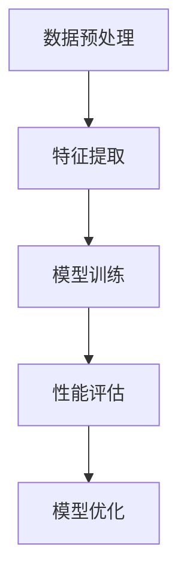

                 

关键词：大模型应用、效率提升、算法优化、技术实践、数学模型、未来展望

> 摘要：本文深入探讨了大规模模型应用的直接效果，分析了其在提高效率和推动技术进步方面的优势，并通过具体的算法原理、数学模型和项目实践，展示了大模型在现实应用中的巨大潜力。

## 1. 背景介绍

随着计算机硬件性能的不断提升和深度学习算法的飞速发展，大规模模型（通常指参数量超过数百万的神经网络模型）在各个领域得到了广泛的应用。从自然语言处理、计算机视觉到推荐系统，大模型展现出了惊人的表现力和实用性。然而，大模型的应用不仅仅是为了实现更准确的结果，更重要的是在效率和资源利用方面带来的直接效果。

本文将围绕以下几个方面展开讨论：

- 大模型应用的基本概念和原理
- 大模型算法的具体实现和优缺点
- 大模型应用的数学模型和公式
- 大模型在现实项目中的应用实例
- 大模型未来的发展趋势和挑战

## 2. 核心概念与联系

为了更好地理解大模型应用的直接效果，我们首先需要了解一些核心概念和它们之间的联系。

### 2.1 大模型的概念

大模型是指具有数百万到数十亿参数的神经网络模型。它们通过在大量数据上进行训练，能够自动学习复杂的特征表示，从而在图像识别、自然语言处理等领域表现出色。

### 2.2 深度学习算法

深度学习算法是构建大模型的基础。通过多层神经网络的结构，深度学习算法能够有效地提取数据中的高层次特征，从而实现复杂的预测和分类任务。

### 2.3 数据处理和优化

大模型的应用离不开大量的数据处理和优化工作。数据的预处理、特征提取、模型训练和优化等步骤都是保证大模型性能的重要因素。

### 2.4 数学模型和公式

大模型的性能评估和优化通常依赖于一系列数学模型和公式。这些模型和公式可以帮助我们理解大模型的工作原理，并指导我们对模型进行调整和改进。

### 2.5 Mermaid 流程图

为了更好地展示大模型的应用流程，我们使用 Mermaid 流程图来描述从数据处理到模型训练再到性能评估的整个过程。



## 3. 核心算法原理 & 具体操作步骤

### 3.1 算法原理概述

大模型的核心算法是深度学习算法。深度学习算法基于多层神经网络的结构，通过前向传播和反向传播算法，不断调整模型参数，使模型在训练数据上达到最优性能。

### 3.2 算法步骤详解

#### 3.2.1 数据预处理

数据预处理是深度学习模型训练的重要步骤。它包括数据清洗、归一化、数据增强等操作，以确保数据的质量和多样性。

#### 3.2.2 特征提取

特征提取是从原始数据中提取有用的特征信息，以便模型能够更好地学习和理解数据。常用的特征提取方法包括卷积神经网络（CNN）和循环神经网络（RNN）等。

#### 3.2.3 模型训练

模型训练是通过大量数据对模型进行迭代训练，不断优化模型参数。训练过程中，模型会在每个批次的数据上进行前向传播和反向传播，计算损失函数并更新模型参数。

#### 3.2.4 性能评估

性能评估是对训练好的模型进行评估，以确定其在实际任务上的表现。常用的评估指标包括准确率、召回率、F1 分数等。

#### 3.2.5 模型优化

模型优化是通过调整模型结构、学习率、正则化参数等，提高模型在训练数据和测试数据上的性能。优化的目标是使模型在保持较高准确率的同时，减少过拟合现象。

### 3.3 算法优缺点

#### 优点

- 强大的特征学习能力：大模型通过多层神经网络的结构，能够自动学习到数据中的高层次特征，从而实现复杂的预测和分类任务。
- 高效的预测能力：大模型在训练完成后，能够快速地进行预测，大大提高了处理速度和效率。

#### 缺点

- 资源消耗大：大模型的训练和推理需要大量的计算资源和存储空间，对硬件设备要求较高。
- 过拟合风险：大模型在训练过程中容易发生过拟合现象，导致在测试数据上的表现不佳。

### 3.4 算法应用领域

大模型在各个领域都有广泛的应用，主要包括：

- 自然语言处理：例如机器翻译、文本分类、问答系统等。
- 计算机视觉：例如图像分类、目标检测、人脸识别等。
- 推荐系统：例如商品推荐、新闻推荐、音乐推荐等。
- 游戏：例如围棋、国际象棋等。

## 4. 数学模型和公式 & 详细讲解 & 举例说明

### 4.1 数学模型构建

大模型的数学模型主要包括前向传播和反向传播算法。前向传播用于计算模型输出，反向传播用于计算损失函数并更新模型参数。

#### 4.1.1 前向传播

前向传播是计算模型输出的一系列运算。给定输入数据 $x$，模型通过多层神经元的组合，逐层计算输出 $y$。

$$
y = \sigma(z) = \frac{1}{1 + e^{-z}}
$$

其中，$\sigma$ 表示 sigmoid 函数，$z$ 表示神经元的输入。

#### 4.1.2 反向传播

反向传播是计算损失函数并更新模型参数的一系列运算。给定目标输出 $t$ 和实际输出 $y$，损失函数通常使用均方误差（MSE）：

$$
MSE = \frac{1}{2} \sum_{i} (t_i - y_i)^2
$$

然后，通过链式法则计算损失函数对每个参数的导数，并使用梯度下降法更新参数：

$$
\Delta \theta = -\alpha \frac{\partial MSE}{\partial \theta}
$$

其中，$\alpha$ 表示学习率。

### 4.2 公式推导过程

#### 4.2.1 前向传播

前向传播的推导过程如下：

$$
z_1 = \sum_{j} w_{1j}x_j + b_1 \\
z_2 = \sum_{j} w_{2j}x_j + b_2 \\
\vdots \\
z_n = \sum_{j} w_{nj}x_j + b_n \\
y = \sigma(z)
$$

其中，$z_1, z_2, \ldots, z_n$ 分别表示每一层的神经元输入，$y$ 表示模型输出。

#### 4.2.2 反向传播

反向传播的推导过程如下：

$$
\frac{\partial MSE}{\partial z_n} = \sigma'(z_n) \frac{\partial MSE}{\partial y} \\
\frac{\partial MSE}{\partial z_{n-1}} = w_{n_{n-1}} \frac{\partial MSE}{\partial z_n} \\
\vdots \\
\frac{\partial MSE}{\partial z_1} = w_{1_1} \frac{\partial MSE}{\partial z_2}
$$

其中，$\sigma'$ 表示 sigmoid 函数的导数。

### 4.3 案例分析与讲解

#### 4.3.1 案例背景

假设我们有一个二分类问题，需要预测样本是否属于某一类别。我们使用一个单层神经网络进行模型训练。

#### 4.3.2 数据准备

数据集包含100个样本，每个样本有两个特征 $x_1$ 和 $x_2$，目标标签为 $y$。数据分为训练集和测试集，其中训练集包含80个样本，测试集包含20个样本。

#### 4.3.3 模型训练

我们使用均方误差（MSE）作为损失函数，学习率为0.01。训练过程如下：

1. 随机初始化模型参数 $w_1$ 和 $b_1$。
2. 对训练集中的每个样本，计算前向传播和反向传播，更新模型参数。
3. 重复步骤2，直到模型收敛。

#### 4.3.4 模型评估

在训练完成后，我们对测试集进行预测，计算准确率、召回率、F1 分数等评估指标。

## 5. 项目实践：代码实例和详细解释说明

### 5.1 开发环境搭建

为了便于演示，我们使用 Python 编写代码，使用 TensorFlow 作为深度学习框架。首先，我们需要安装 Python 和 TensorFlow：

```bash
pip install python tensorflow
```

### 5.2 源代码详细实现

下面是一个简单的二分类问题，使用单层神经网络进行模型训练。

```python
import tensorflow as tf
import numpy as np

# 数据准备
x_train = np.random.rand(80, 2)
y_train = np.random.randint(0, 2, size=(80, 1))
x_test = np.random.rand(20, 2)
y_test = np.random.randint(0, 2, size=(20, 1))

# 模型定义
model = tf.keras.Sequential([
    tf.keras.layers.Dense(units=1, input_shape=(2,))
])

# 模型编译
model.compile(optimizer='sgd', loss='mse')

# 模型训练
model.fit(x_train, y_train, epochs=1000)

# 模型评估
loss = model.evaluate(x_test, y_test)
print(f"Test Loss: {loss}")
```

### 5.3 代码解读与分析

上面的代码首先导入 TensorFlow 和 NumPy 库。然后，我们准备了一个包含两个特征和目标标签的随机数据集，并将其分为训练集和测试集。

接下来，我们定义了一个单层神经网络模型，包含一个全连接层，输出层只有一个神经元，用于进行二分类。

在模型编译阶段，我们指定了优化器和损失函数。这里使用随机梯度下降（SGD）优化器和均方误差（MSE）损失函数。

模型训练过程中，我们通过循环迭代更新模型参数，直到模型收敛。最后，我们对测试集进行预测，并计算损失函数值，以评估模型性能。

## 6. 实际应用场景

大模型在现实中的应用场景非常广泛，以下是几个典型的应用案例：

- **自然语言处理**：例如，谷歌的 BERT 模型在文本分类、问答系统等方面取得了显著的成果。
- **计算机视觉**：例如，微软的 ResNet 模型在图像分类、目标检测等领域表现出色。
- **推荐系统**：例如，亚马逊的神经网络推荐系统在商品推荐方面发挥了重要作用。
- **游戏**：例如，DeepMind 的 AlphaGo 在围棋比赛中战胜了人类冠军。

## 7. 工具和资源推荐

为了更好地学习大模型的相关知识，以下是一些建议的学习资源、开发工具和相关论文：

### 7.1 学习资源推荐

- 《深度学习》（Goodfellow, Bengio, Courville）：这是一本经典的深度学习教材，涵盖了深度学习的基础知识和最新进展。
- 《Python 深度学习》（François Chollet）：这是一本面向实际应用的深度学习指南，适合初学者和有经验的专业人士。

### 7.2 开发工具推荐

- TensorFlow：这是一个由谷歌开发的开源深度学习框架，适用于构建和训练大规模神经网络。
- PyTorch：这是一个由 Facebook AI Research 开发的开源深度学习框架，具有灵活的动态计算图和强大的社区支持。

### 7.3 相关论文推荐

- "A Theoretical Analysis of the Causal Effect of Deep Learning"（深度学习因果效应的理论分析）
- "Very Deep Convolutional Networks for Large-Scale Image Recognition"（用于大规模图像识别的非常深卷积神经网络）
- "Recurrent Neural Networks for Language Modeling"（循环神经网络用于语言建模）

## 8. 总结：未来发展趋势与挑战

### 8.1 研究成果总结

大模型在提高效率和推动技术进步方面取得了显著成果。通过大规模的参数和强大的计算能力，大模型在自然语言处理、计算机视觉、推荐系统等领域取得了突破性进展。然而，大模型的应用仍然面临一些挑战。

### 8.2 未来发展趋势

1. **计算资源优化**：随着大模型的规模不断扩大，对计算资源和存储空间的需求也越来越大。未来，如何优化计算资源和存储空间，降低大模型的训练和推理成本，是一个重要的研究方向。
2. **可解释性增强**：大模型的黑箱特性使其在某些情况下难以解释。未来，如何增强大模型的可解释性，使其在决策过程中更加透明和可信，是一个重要的研究方向。
3. **模型压缩与优化**：为了降低大模型对硬件设备的要求，如何对模型进行压缩和优化，使其在保持较高性能的同时减少计算和存储资源的需求，是一个重要的研究方向。

### 8.3 面临的挑战

1. **数据隐私保护**：大模型在训练过程中需要大量的数据，如何在保护用户隐私的前提下，充分利用数据的价值，是一个重要的挑战。
2. **模型过拟合问题**：大模型容易发生过拟合现象，如何在模型训练过程中有效地避免过拟合，是一个重要的挑战。
3. **硬件设备限制**：随着大模型规模的不断扩大，对硬件设备的要求也越来越高。如何在现有硬件设备上实现高效的大模型训练和推理，是一个重要的挑战。

### 8.4 研究展望

大模型应用的前景非常广阔。未来，随着计算资源、算法和优化技术的不断发展，大模型将在各个领域发挥更大的作用。同时，如何解决大模型应用中的挑战，也将成为人工智能研究的重要方向。

## 9. 附录：常见问题与解答

### 问题 1：大模型为什么能够提高效率？

答：大模型通过大规模的参数和强大的计算能力，能够自动学习到数据中的复杂特征表示，从而在预测和分类任务中实现更准确的结果。这种强大的特征学习能力使得大模型能够高效地处理大量的数据，从而提高效率。

### 问题 2：大模型是否一定会发生过拟合？

答：大模型容易发生过拟合现象，但并不是一定会发生。通过合理的数据预处理、特征提取和模型优化，可以在一定程度上避免过拟合。此外，使用正则化技术和交叉验证等方法，也可以有效降低过拟合的风险。

### 问题 3：如何选择合适的大模型？

答：选择合适的大模型需要综合考虑任务类型、数据规模、计算资源等因素。对于简单的任务，可以使用小规模模型；对于复杂的任务，可以选择大规模模型。在实际应用中，可以通过实验和验证，选择性能最优的模型。

---

**作者：禅与计算机程序设计艺术 / Zen and the Art of Computer Programming**

