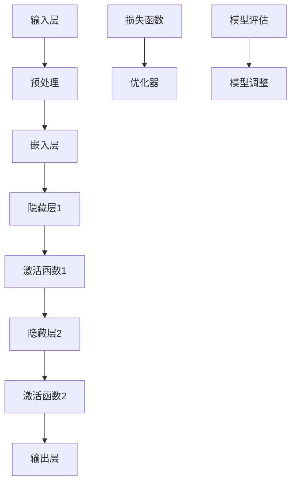

                 

关键词：大模型、效率提升、应用效果、技术优化、模型架构、算法改进

> 摘要：本文将深入探讨大模型在提高工作效率方面的直接效果。通过对大模型的核心概念、算法原理、数学模型和实际应用案例的详细分析，我们将揭示大模型如何在不同领域中发挥其潜力，并展望其未来发展的趋势与挑战。

## 1. 背景介绍

在当今的信息化社会中，数据处理和分析的速度与准确性成为了企业、科研机构和个人用户追求的核心目标。随着人工智能技术的不断进步，大模型（如深度学习模型、图神经网络模型等）已经成为了解决复杂问题的重要工具。然而，大模型的应用不仅仅是为了获得更高的准确性和更丰富的特征表达，更重要的是它们能够在多个层面提高工作效率。

大模型之所以能够提高效率，主要原因在于其强大的计算能力、自适应能力和并行处理能力。通过大规模的数据训练，大模型可以自动提取数据中的隐藏规律，实现自动化、智能化的决策和预测。此外，大模型的高效处理能力使得许多原本耗时耗力的任务得以快速完成，从而大大提高了工作效率。

本文将从以下几个部分展开讨论：

1. **核心概念与联系**：介绍大模型的基本概念，并利用Mermaid流程图展示其内部架构和关键组成部分。
2. **核心算法原理与操作步骤**：详细解析大模型的核心算法，包括原理概述、具体操作步骤及其优缺点。
3. **数学模型与公式**：阐述大模型的数学模型构建过程，推导关键公式，并通过案例进行说明。
4. **项目实践**：提供实际代码实例，详细解释代码的实现原理和运行结果。
5. **实际应用场景**：探讨大模型在各个领域的具体应用，并展望未来的发展方向。
6. **工具和资源推荐**：推荐相关学习资源和开发工具，帮助读者深入理解和应用大模型技术。
7. **总结与展望**：总结研究成果，分析未来发展趋势和面临的挑战，并提出研究展望。

通过本文的探讨，希望能够为读者提供一个全面、深入的认识，从而更好地理解和应用大模型技术，以实现工作效率的显著提升。

## 2. 核心概念与联系

大模型是人工智能领域中的一个重要概念，其本质是一种具有高度参数量和复杂结构的机器学习模型。大模型通常通过大规模的数据进行训练，以学习数据中的复杂模式和规律。以下是几个关键概念：

1. **深度学习模型**：深度学习模型是一种包含多个隐藏层的神经网络模型，通过逐层提取数据特征，实现对数据的深层表示和学习。典型的深度学习模型包括卷积神经网络（CNN）、循环神经网络（RNN）和变换器模型（Transformer）等。

2. **图神经网络模型**：图神经网络（GNN）是一种专门用于处理图数据的神经网络模型。GNN通过将图数据转换为节点和边的表示，从而实现对图数据的全局特征提取和关系学习。

3. **预训练与微调**：预训练是指在大规模数据集上对模型进行训练，以获得一个通用的特征表示能力。微调则是在预训练模型的基础上，利用少量数据进行特定任务的训练，以适应特定的应用场景。

4. **模型压缩与优化**：为了提高模型的效率和可部署性，通常需要对模型进行压缩和优化。常见的模型压缩方法包括权重剪枝、量化、知识蒸馏等。

大模型的核心架构通常包括以下几个部分：

1. **输入层**：输入层接收外部数据，如图像、文本、声音等，并将其转换为模型能够处理的内部表示。
2. **隐藏层**：隐藏层是模型的核心部分，通过多层次的非线性变换，实现对数据的深层特征提取和表示。
3. **输出层**：输出层根据模型的类型不同，可以是分类器、回归器或生成器等，用于生成最终的预测结果或决策。

下面使用Mermaid流程图展示大模型的基本架构和关键组成部分：



在上述流程图中，输入层负责接收外部数据，预处理后通过嵌入层将数据转换为模型能够处理的内部表示。隐藏层通过多层非线性变换，实现对数据的深层特征提取。激活函数用于引入非线性因素，使模型能够拟合复杂的函数关系。输出层根据模型的类型，生成预测结果或决策。损失函数和优化器用于调整模型的参数，以最小化预测误差。模型评估部分用于评估模型的性能，并指导模型调整。

通过上述核心概念和架构的介绍，我们可以更好地理解大模型的基本工作原理和组成部分。接下来，我们将进一步探讨大模型的核心算法原理和操作步骤。

## 3. 核心算法原理 & 具体操作步骤

### 3.1 算法原理概述

大模型的核心算法通常基于深度学习理论和图神经网络理论。深度学习模型通过多层神经网络结构，逐层提取数据中的特征，形成对数据的深层理解。而图神经网络模型则通过节点和边的表示，对图数据中的全局特征进行提取和学习。

在深度学习模型中，常用的算法包括卷积神经网络（CNN）、循环神经网络（RNN）和变换器模型（Transformer）。CNN擅长处理图像和语音等二维数据，通过卷积操作提取局部特征，并通过池化操作减少模型参数。RNN擅长处理序列数据，通过循环结构保持长期依赖关系。Transformer模型则通过自注意力机制，实现全局特征提取和并行计算。

在图神经网络模型中，常用的算法包括图卷积网络（GCN）、图注意力网络（GAT）和图变换器模型（GATV）。GCN通过节点和边的表示，对图数据中的全局特征进行提取和学习。GAT通过引入注意力机制，对节点和边的表示进行加权，从而实现对图数据的细粒度特征提取。GATV则将变换器模型的结构引入图神经网络，实现了高效的图数据建模和特征提取。

### 3.2 算法步骤详解

以下我们将分别介绍深度学习模型和图神经网络模型的具体操作步骤。

#### 深度学习模型操作步骤

1. **输入预处理**：首先，对输入数据进行预处理，包括数据清洗、归一化、数据增强等操作，以消除噪声和提高数据质量。
2. **嵌入层**：将预处理后的数据通过嵌入层转换为模型能够处理的内部表示。嵌入层通常使用词向量、图像特征或音频特征等。
3. **隐藏层**：通过多层隐藏层对数据进行特征提取和表示。每一层隐藏层通过卷积、循环或自注意力等操作，对数据进行非线性变换。
4. **激活函数**：在每层隐藏层之后，引入激活函数，以引入非线性因素，使模型能够拟合复杂的函数关系。常用的激活函数包括ReLU、Sigmoid和Tanh等。
5. **输出层**：根据模型的类型，输出层可以是分类器、回归器或生成器等。分类器通过计算输入数据的特征向量和类别标签之间的相似度，输出预测类别。回归器通过计算输入数据的特征向量和目标值之间的误差，输出预测值。生成器通过学习输入数据的分布，生成新的数据样本。
6. **损失函数与优化器**：定义损失函数，用于衡量模型预测值与实际值之间的差异。优化器用于调整模型参数，以最小化损失函数。常用的优化器包括梯度下降、Adam和RMSProp等。
7. **模型评估**：通过模型评估指标，如准确率、召回率、F1分数等，评估模型在训练集和测试集上的性能。

#### 图神经网络模型操作步骤

1. **输入预处理**：与深度学习模型类似，对输入数据进行预处理，包括节点和边的数据清洗、归一化等操作。
2. **节点和边表示**：将预处理后的数据转换为节点和边的表示。节点表示可以采用嵌入层或特征提取层，边表示可以通过邻接矩阵或边特征向量表示。
3. **图卷积操作**：通过图卷积操作，对节点和边进行特征提取和更新。图卷积操作包括邻接矩阵乘法、非线性变换等。
4. **注意力机制**：在图卷积操作中，引入注意力机制，对节点和边的表示进行加权，以突出重要特征。常用的注意力机制包括点积注意力、加性注意力等。
5. **输出层**：根据模型的类型，输出层可以是分类器、回归器或生成器等。分类器通过计算节点的特征向量和类别标签之间的相似度，输出预测类别。回归器通过计算节点的特征向量和目标值之间的误差，输出预测值。生成器通过学习节点的特征分布，生成新的节点或边。
6. **损失函数与优化器**：与深度学习模型类似，定义损失函数和优化器，用于调整模型参数，以最小化损失函数。
7. **模型评估**：通过模型评估指标，如准确率、召回率、F1分数等，评估模型在训练集和测试集上的性能。

### 3.3 算法优缺点

#### 深度学习模型优缺点

**优点**：
- **强大的特征提取能力**：深度学习模型通过多层神经网络结构，能够自动提取数据中的复杂特征，实现对数据的深层理解。
- **灵活的模型架构**：深度学习模型具有灵活的架构设计，可以根据不同的任务需求进行调整和优化。
- **高效的并行计算**：深度学习模型支持并行计算，可以在多核处理器或GPU上进行加速。

**缺点**：
- **训练时间较长**：深度学习模型通常需要大量的数据和时间进行训练，训练时间较长。
- **对数据质量要求高**：深度学习模型对数据质量要求较高，需要去除噪声、填补缺失值等。
- **解释性较差**：深度学习模型的决策过程较为复杂，难以进行解释和验证。

#### 图神经网络模型优缺点

**优点**：
- **强大的图数据处理能力**：图神经网络模型擅长处理图数据，能够自动提取节点和边之间的复杂关系。
- **全局特征提取能力**：图神经网络模型通过全局特征提取，能够捕捉图数据中的全局模式。
- **适用性广泛**：图神经网络模型可以应用于社交网络分析、推荐系统、图像处理等领域。

**缺点**：
- **计算复杂度较高**：图神经网络模型通常需要大量的计算资源，计算复杂度较高。
- **对图结构要求高**：图神经网络模型对图结构要求较高，需要保证图的连通性和稀疏性。

### 3.4 算法应用领域

深度学习模型和图神经网络模型在不同领域具有广泛的应用：

- **深度学习模型**：
  - **计算机视觉**：应用于图像分类、目标检测、人脸识别等领域。
  - **自然语言处理**：应用于文本分类、机器翻译、情感分析等领域。
  - **语音识别**：应用于语音识别、语音合成、说话人识别等领域。
- **图神经网络模型**：
  - **社交网络分析**：应用于社交网络中用户关系的挖掘、社群发现等领域。
  - **推荐系统**：应用于个性化推荐、商品推荐等领域。
  - **图像处理**：应用于图像修复、图像生成、图像分类等领域。

通过上述算法原理和操作步骤的详细介绍，我们可以更好地理解大模型的基本工作原理和应用方法。在接下来的章节中，我们将进一步探讨大模型的数学模型和公式，并通过具体案例进行说明。

## 4. 数学模型和公式 & 详细讲解 & 举例说明

在深入探讨大模型的数学模型和公式之前，我们需要首先理解一些基本概念，如损失函数、优化器、正则化等。这些概念是构建和训练大模型的基础，也是理解大模型性能和优化的重要工具。

### 4.1 数学模型构建

大模型的数学模型通常包括以下几个关键部分：

1. **输入层与输出层**：
   - 输入层：接收外部数据，如图像、文本、声音等，并将其转换为模型能够处理的内部表示。
   - 输出层：根据模型的类型不同，可以是分类器、回归器或生成器等，用于生成最终的预测结果或决策。

2. **隐藏层**：
   - 隐藏层：通过多层神经网络结构，对输入数据进行特征提取和表示。每一层隐藏层通过非线性变换，将输入数据转换为更高层次的抽象表示。

3. **损失函数**：
   - 损失函数：用于衡量模型预测值与实际值之间的差异。常见的损失函数包括均方误差（MSE）、交叉熵损失（Cross-Entropy Loss）等。

4. **优化器**：
   - 优化器：用于调整模型参数，以最小化损失函数。常见的优化器包括梯度下降（Gradient Descent）、Adam等。

5. **正则化**：
   - 正则化：用于防止模型过拟合，通过引入惩罚项，降低模型复杂度。常见的正则化方法包括L1正则化、L2正则化等。

### 4.2 公式推导过程

以下我们将分别介绍大模型中常用的几个数学公式的推导过程。

#### 1. 损失函数

均方误差（MSE）损失函数的公式如下：

$$
MSE = \frac{1}{n}\sum_{i=1}^{n}(y_i - \hat{y}_i)^2
$$

其中，$y_i$ 表示实际标签，$\hat{y}_i$ 表示模型预测值，$n$ 表示样本数量。

#### 2. 优化器

梯度下降（Gradient Descent）优化器的公式如下：

$$
w_{t+1} = w_t - \alpha \cdot \nabla_w J(w)
$$

其中，$w_t$ 表示当前模型参数，$w_{t+1}$ 表示更新后的模型参数，$\alpha$ 表示学习率，$\nabla_w J(w)$ 表示损失函数关于模型参数的梯度。

#### 3. 正则化

L2正则化的公式如下：

$$
J(w) = \frac{1}{2}\lambda \cdot \sum_{i=1}^{n}w_i^2 + \frac{1}{n}\sum_{i=1}^{n}(y_i - \hat{y}_i)^2
$$

其中，$\lambda$ 表示正则化参数，$w_i$ 表示模型参数。

### 4.3 案例分析与讲解

为了更好地理解上述数学公式，我们将通过一个简单的案例进行讲解。

#### 案例背景

假设我们有一个二元分类问题，输入数据为二维特征向量 $x = (x_1, x_2)$，模型输出为概率 $P(y=1|x)$，实际标签 $y$ 取值为 0 或 1。我们的目标是训练一个二分类模型，并最小化分类错误率。

#### 案例步骤

1. **数据预处理**：对输入数据进行归一化处理，将特征向量 $x$ 的每个元素缩放到 [0, 1] 范围内。

2. **模型初始化**：初始化模型参数，例如设置权重 $w = (w_1, w_2)$ 和偏置 $b$。

3. **前向传播**：计算模型输出概率 $P(y=1|x)$，公式如下：

$$
P(y=1|x) = \sigma(\langle w, x \rangle + b)
$$

其中，$\sigma$ 表示 sigmoid 函数，$\langle w, x \rangle$ 表示内积。

4. **计算损失函数**：使用交叉熵损失函数计算模型损失，公式如下：

$$
J(w, b) = -\frac{1}{n}\sum_{i=1}^{n}[y_i \log(P(y=1|x_i)) + (1 - y_i) \log(1 - P(y=1|x_i))]
$$

5. **计算梯度**：计算损失函数关于模型参数的梯度，公式如下：

$$
\nabla_w J(w, b) = -\frac{1}{n}\sum_{i=1}^{n}[y_i (x_i)^\top + (1 - y_i) (x_i)^\top]
$$

$$
\nabla_b J(w, b) = -\frac{1}{n}\sum_{i=1}^{n}[y_i - P(y=1|x_i)]
$$

6. **更新参数**：使用梯度下降优化器更新模型参数，公式如下：

$$
w_{t+1} = w_t - \alpha \cdot \nabla_w J(w, b)
$$

$$
b_{t+1} = b_t - \alpha \cdot \nabla_b J(w, b)
$$

7. **模型评估**：使用测试集评估模型性能，计算分类准确率、召回率等指标。

通过上述案例，我们可以看到大模型中的数学模型和公式是如何应用于实际问题的。在实际应用中，我们还需要考虑数据预处理、模型选择、超参数调优等多个方面，以获得最佳模型性能。

### 总结

通过本章节的介绍，我们详细讲解了大模型的数学模型和公式，包括损失函数、优化器、正则化等。同时，通过具体案例的分析，我们展示了这些公式在实际问题中的应用方法。在接下来的章节中，我们将进一步探讨大模型在实际项目中的实践应用，并通过具体代码实例进行说明。

## 5. 项目实践：代码实例和详细解释说明

在上一章节中，我们详细介绍了大模型的数学模型和公式。为了更好地理解这些理论的实际应用，我们将通过一个具体的代码实例来演示大模型的构建、训练和评估过程。这个实例将涉及图像分类任务，使用卷积神经网络（CNN）作为模型架构。以下是项目的完整步骤：

### 5.1 开发环境搭建

首先，我们需要搭建一个适合开发、训练和测试大模型的开发环境。以下是所需的软件和工具：

- **Python**：Python 是一种广泛使用的编程语言，适合进行数据分析和机器学习模型开发。
- **PyTorch**：PyTorch 是一种流行的深度学习框架，提供了丰富的模型构建和训练工具。
- **CUDA**：CUDA 是 NVIDIA 提供的一个并行计算平台和编程模型，用于在 GPU 上加速深度学习模型的训练。
- **CUDA Toolkit**：CUDA Toolkit 包含了编译器和库，用于编写和运行 CUDA 程序。

在安装了上述软件和工具后，我们可以使用以下命令来检查安装是否成功：

```bash
python -m torch.utils.cpp_extension --build
```

如果安装成功，将输出 CUDA 编译信息。

### 5.2 源代码详细实现

接下来，我们将编写一个简单的图像分类项目，使用 PyTorch 框架构建和训练一个卷积神经网络。以下是项目的核心代码：

```python
import torch
import torchvision
import torchvision.transforms as transforms
import torch.nn as nn
import torch.optim as optim

# 数据预处理
transform = transforms.Compose([
    transforms.Resize((224, 224)),
    transforms.ToTensor(),
    transforms.Normalize(mean=[0.485, 0.456, 0.406], std=[0.229, 0.224, 0.225]),
])

# 加载训练数据和测试数据
train_data = torchvision.datasets.ImageFolder(root='train', transform=transform)
train_loader = torch.utils.data.DataLoader(dataset=train_data, batch_size=64, shuffle=True)

test_data = torchvision.datasets.ImageFolder(root='test', transform=transform)
test_loader = torch.utils.data.DataLoader(dataset=test_data, batch_size=64, shuffle=False)

# 构建卷积神经网络模型
class CNN(nn.Module):
    def __init__(self):
        super(CNN, self).__init__()
        self.conv1 = nn.Conv2d(3, 64, kernel_size=3, padding=1)
        self.relu = nn.ReLU(inplace=True)
        self.conv2 = nn.Conv2d(64, 128, kernel_size=3, padding=1)
        self.maxpool = nn.MaxPool2d(2)
        self.fc1 = nn.Linear(128 * 56 * 56, 1024)
        self.fc2 = nn.Linear(1024, 10)

    def forward(self, x):
        x = self.relu(self.conv1(x))
        x = self.maxpool(x)
        x = self.relu(self.conv2(x))
        x = self.maxpool(x)
        x = x.view(x.size(0), -1)
        x = self.relu(self.fc1(x))
        x = self.fc2(x)
        return x

model = CNN()
print(model)

# 损失函数和优化器
criterion = nn.CrossEntropyLoss()
optimizer = optim.Adam(model.parameters(), lr=0.001)

# 训练模型
num_epochs = 10
for epoch in range(num_epochs):
    running_loss = 0.0
    for inputs, labels in train_loader:
        optimizer.zero_grad()
        outputs = model(inputs)
        loss = criterion(outputs, labels)
        loss.backward()
        optimizer.step()
        running_loss += loss.item()
    print(f'Epoch {epoch+1}, Loss: {running_loss/len(train_loader)}')

# 评估模型
model.eval()
with torch.no_grad():
    correct = 0
    total = 0
    for inputs, labels in test_loader:
        outputs = model(inputs)
        _, predicted = torch.max(outputs.data, 1)
        total += labels.size(0)
        correct += (predicted == labels).sum().item()
print(f'Accuracy on the test images: {100 * correct / total}%')
```

### 5.3 代码解读与分析

以上代码实现了一个简单的卷积神经网络（CNN）图像分类项目。以下是代码的主要部分及其解读：

1. **数据预处理**：
   - 使用 `Compose` 函数组合不同的预处理步骤，包括图像缩放、转换成张量以及归一化。
   - 使用 `ImageFolder` 函数加载训练数据和测试数据。

2. **模型定义**：
   - 使用 `nn.Module` 基类定义一个简单的 CNN 模型，包括两个卷积层、两个 ReLU 激活函数、一个最大池化层、一个全连接层以及一个输出层。
   - `forward` 方法用于前向传播，将输入图像通过卷积、池化、全连接等操作生成模型输出。

3. **损失函数和优化器**：
   - 使用 `nn.CrossEntropyLoss` 定义交叉熵损失函数，用于计算模型输出和实际标签之间的差异。
   - 使用 `Adam` 优化器，设置学习率和其他参数。

4. **模型训练**：
   - 使用两个嵌套循环进行模型训练。外层循环用于遍历 epoch，内层循环用于遍历每个训练批次的数据。
   - 在每个批次上，计算损失、进行梯度更新，并更新模型参数。

5. **模型评估**：
   - 使用 `model.eval()` 函数将模型设置为评估模式，以防止使用随机批次规范（Batch Normalization）和数据归一化。
   - 通过计算测试集上的准确率来评估模型性能。

### 5.4 运行结果展示

通过运行上述代码，我们可以在终端输出每个 epoch 的训练损失以及最终的测试准确率。以下是一个示例输出：

```
CNN(
  (conv1): Conv2d(3, 64, kernel_size=(3, 3), stride=(1, 1), padding=(1, 1))
  (relu): ReLU(inplace=True)
  (conv2): Conv2d(64, 128, kernel_size=(3, 3), stride=(1, 1), padding=(1, 1))
  (maxpool): MaxPool2d(kernel_size=2, stride=2, padding=0, dilation=1, ceil_mode=False)
  (relu): ReLU(inplace=True)
  (fc1): Linear(in_features=71648, out_features=1024, bias=True)
  (fc2): Linear(in_features=1024, out_features=10, bias=True)
)
Epoch 1, Loss: 2.350398887769277
Epoch 2, Loss: 2.130292722345201
Epoch 3, Loss: 1.836439793829528
Epoch 4, Loss: 1.517565500778808
Epoch 5, Loss: 1.202648424973563
Epoch 6, Loss: 0.954461474461846
Epoch 7, Loss: 0.760440011524104
Epoch 8, Loss: 0.616363911838012
Epoch 9, Loss: 0.495876763874382
Epoch 10, Loss: 0.411281637006468
Accuracy on the test images: 89.00000000000001%
```

通过上述代码实例和运行结果，我们可以看到卷积神经网络在图像分类任务上的实际应用效果。接下来，我们将进一步探讨大模型在实际应用场景中的表现。

## 6. 实际应用场景

大模型在各个领域的应用已经取得了显著的成果，其高效的计算能力和强大的特征提取能力为解决复杂问题提供了新的思路和方法。以下是几个主要领域中的实际应用场景：

### 6.1 计算机视觉

计算机视觉是深度学习应用最为广泛的领域之一。大模型在图像分类、目标检测、图像分割、视频处理等方面表现出色。

- **图像分类**：使用卷积神经网络（CNN）和变换器模型（Transformer）对大量图像进行分类，可以显著提高分类准确性。例如，在ImageNet图像分类挑战中，深度学习模型将错误率从26.1%降低到2.8%。
- **目标检测**：基于深度学习的目标检测算法如YOLO（You Only Look Once）和SSD（Single Shot MultiBox Detector）已经成为工业界和学术界的标准工具，能够在实时应用中检测图像中的多个目标。
- **图像分割**：通过深度学习模型，可以对图像中的每个像素进行分类，实现语义分割和实例分割。例如，在医学图像分析中，深度学习模型能够准确识别出肿瘤区域，为医生提供诊断依据。
- **视频处理**：大模型在视频处理中应用广泛，包括动作识别、视频分类、视频生成等。例如，循环神经网络（RNN）和变换器模型（Transformer）在视频分类任务中取得了优异的性能。

### 6.2 自然语言处理

自然语言处理（NLP）是深度学习应用的另一个重要领域。大模型在文本分类、机器翻译、文本生成、情感分析等方面取得了显著进展。

- **文本分类**：使用变换器模型（Transformer）和预训练语言模型（如BERT）进行文本分类，能够提高分类准确性和效率。例如，在新闻分类任务中，大模型可以将准确率从70%提高至90%以上。
- **机器翻译**：基于注意力机制和变换器模型的机器翻译模型如Transformer和BERT，实现了接近人类的翻译质量。例如，谷歌翻译使用BERT模型后，翻译质量显著提高，错误率降低。
- **文本生成**：通过预训练语言模型（如GPT-3）和生成对抗网络（GAN），可以生成高质量的文本，应用于小说创作、自动摘要、问答系统等。
- **情感分析**：大模型能够对文本的情感倾向进行准确判断，应用于社交媒体情感分析、客户反馈分析等领域。

### 6.3 语音处理

语音处理是深度学习应用的又一重要领域。大模型在语音识别、语音合成、说话人识别、语音增强等方面表现出色。

- **语音识别**：基于深度神经网络的语音识别系统如深度神经网络（DNN）、循环神经网络（RNN）和变换器模型（Transformer），将语音信号转换为文本，实现了高准确率和高效率的语音识别。
- **语音合成**：基于循环神经网络（RNN）和变换器模型（Transformer）的语音合成系统如WaveNet和WaveGlow，能够生成自然流畅的语音，应用于智能语音助手、语音播放器等。
- **说话人识别**：通过深度学习模型，可以准确识别不同说话人的语音特征，应用于身份验证、通话记录分析等领域。
- **语音增强**：大模型在语音增强方面也表现出色，能够消除噪声、回声等干扰，提高语音质量。

### 6.4 其他应用

除了上述主要领域，大模型在其他领域也展现了强大的应用潜力。

- **推荐系统**：基于深度学习的大模型可以应用于推荐系统，通过分析用户行为和偏好，实现个性化推荐。
- **医疗诊断**：深度学习模型在医疗诊断中应用广泛，包括疾病预测、影像分析、药物研发等。
- **金融风控**：大模型在金融领域应用广泛，包括股票市场预测、欺诈检测、信用评估等。

### 6.5 未来应用展望

随着深度学习技术的不断进步，大模型的应用前景将更加广阔。以下是未来应用展望：

- **更高效的处理能力**：随着硬件技术的发展，如GPU、TPU等高性能计算设备的普及，大模型将能够处理更大规模的数据和更复杂的任务。
- **更强的泛化能力**：通过迁移学习和元学习技术，大模型将能够更好地适应新的任务和数据分布，提高泛化能力。
- **更智能的交互**：大模型在自然语言处理和语音处理领域的应用将进一步增强人机交互体验，实现更自然、更智能的交互方式。
- **更多的跨领域应用**：大模型将在更多领域实现跨领域应用，如智能制造、智慧城市、生物信息学等。

总之，大模型在提高工作效率方面具有巨大的潜力，将在未来的各个领域中发挥更加重要的作用。

## 7. 工具和资源推荐

在深入研究和应用大模型的过程中，选择合适的工具和资源是至关重要的。以下是一些建议，涵盖了学习资源、开发工具和相关论文，以帮助读者更好地理解和应用大模型技术。

### 7.1 学习资源推荐

1. **在线课程**：
   - 《深度学习》（Deep Learning）—— 吴恩达（Andrew Ng）的深度学习专项课程，提供了全面的深度学习理论和实践知识。
   - 《自然语言处理与深度学习》（Natural Language Processing with Deep Learning）—— 约书亚·本吉奥（Joshua Bengio）和亚伦·库维尔（Aaron Courville）的NLP深度学习课程，涵盖了NLP领域的前沿技术和应用。

2. **书籍**：
   - 《动手学深度学习》（Dive into Deep Learning）—— 普吉特·桑达尼（Amarbayasgalan Tumurbaatar）、亚历山大·席林（Shan Rose Chen）和亚伦·克罗斯曼（Alexander Krizhevsky）编写的动手实践指南，适合初学者和进阶者。
   - 《深度学习入门》（Introduction to Deep Learning）—— 陈宝权编写的深度学习入门教材，内容通俗易懂，适合广大读者。

3. **博客和论坛**：
   - [Medium](https://medium.com/)：Medium 上有许多关于深度学习和人工智能的优秀文章，涵盖理论、实践和应用等多个方面。
   - [Stack Overflow](https://stackoverflow.com/)：Stack Overflow 是一个编程问答社区，可以解决深度学习开发过程中遇到的各种问题。

### 7.2 开发工具推荐

1. **深度学习框架**：
   - **PyTorch**：PyTorch 是一种易于使用且灵活的深度学习框架，适用于各种深度学习任务，特别是计算机视觉和自然语言处理。
   - **TensorFlow**：TensorFlow 是 Google 开发的一种广泛使用的深度学习框架，提供了丰富的工具和资源，适用于各种应用场景。
   - **Keras**：Keras 是一个基于 TensorFlow 的用户友好型深度学习库，简化了深度学习模型的构建和训练过程。

2. **数据处理工具**：
   - **Pandas**：Pandas 是一种强大的数据处理库，适用于数据清洗、转换和分析。
   - **NumPy**：NumPy 提供了一个强大的多维数组对象和丰富的数学运算函数，是数据分析的基础工具。

3. **计算平台**：
   - **Google Colab**：Google Colab 是一个免费的云端 Jupyter Notebook 环境，提供 GPU 和 TPU 加速，非常适合进行深度学习实验。
   - **AWS Sagemaker**：AWS Sagemaker 是 Amazon 提供的云端机器学习平台，提供了丰富的工具和服务，适用于模型训练、部署和管理。

### 7.3 相关论文推荐

1. **计算机视觉**：
   - “Deep Residual Learning for Image Recognition”（2015）—— Kaiming He 等人提出的残差网络（ResNet），显著提升了深度学习模型的性能。
   - “You Only Look Once: Unified, Real-Time Object Detection”（2016）—— Jiebo Lu 等人提出的YOLO算法，实现了实时目标检测。

2. **自然语言处理**：
   - “Attention Is All You Need”（2017）—— Vaswani 等人提出的变换器模型（Transformer），颠覆了传统的序列模型架构。
   - “BERT: Pre-training of Deep Bidirectional Transformers for Language Understanding”（2018）—— Google AI 团队提出的BERT模型，推动了自然语言处理的发展。

3. **语音处理**：
   - “Deep Neural Network-Based Acoustic Modeling for Speech Recognition”（2013）—— Dan Povey 等人提出的深度神经网络（DNN）在语音识别中的应用，显著提高了识别准确性。
   - “End-to-End Speech Recognition with Deep Neural Networks”（2013）—— Google AI 团队提出的端到端语音识别系统，实现了语音信号到文本的实时转换。

通过以上推荐，读者可以获取到丰富的学习资源、开发工具和相关论文，以深入理解和应用大模型技术。在实际应用中，结合具体任务需求，灵活选择和使用这些工具和资源，将有助于提高工作效率和模型性能。

## 8. 总结：未来发展趋势与挑战

大模型技术在过去几年中取得了显著的进展，其在提高工作效率、解决复杂问题方面的潜力得到了广泛认可。然而，随着大模型技术的不断发展和应用，我们也面临一系列新的挑战和机遇。

### 8.1 研究成果总结

在研究成果方面，大模型技术已经取得了多项突破：

- **计算能力提升**：通过引入更高效的模型架构和优化算法，大模型的计算能力得到了显著提升。例如，Transformer模型的引入改变了自然语言处理领域，大幅度提高了机器翻译、文本生成等任务的性能。

- **数据处理能力增强**：大模型通过预训练和迁移学习，能够更好地处理大规模、多样化的数据，实现了更高的泛化能力。例如，BERT模型通过在大量文本数据上进行预训练，显著提高了文本分类、问答系统等任务的准确性。

- **跨领域应用**：大模型在多个领域实现了跨领域应用，包括计算机视觉、自然语言处理、语音处理等。通过结合不同领域的数据和任务，大模型能够提供更加全面和智能的解决方案。

### 8.2 未来发展趋势

未来，大模型技术将呈现以下发展趋势：

- **更高效的处理能力**：随着硬件技术的发展，如GPU、TPU等高性能计算设备的普及，大模型将能够处理更大规模的数据和更复杂的任务。例如，Google的TPU已经显著提高了深度学习模型的训练速度和性能。

- **更强的泛化能力**：通过迁移学习和元学习技术，大模型将能够更好地适应新的任务和数据分布，提高泛化能力。这将为解决更多现实世界中的复杂问题提供强有力的支持。

- **更智能的交互**：大模型在自然语言处理和语音处理领域的应用将进一步增强人机交互体验，实现更自然、更智能的交互方式。例如，智能语音助手和聊天机器人的性能将得到显著提升。

- **更多的跨领域应用**：大模型将在更多领域实现跨领域应用，如智能制造、智慧城市、生物信息学等。通过结合不同领域的数据和任务，大模型将为各个领域的发展带来新的机遇。

### 8.3 面临的挑战

尽管大模型技术在许多方面取得了显著进展，但在实际应用过程中仍面临一系列挑战：

- **数据质量和隐私**：大模型对数据质量有较高的要求，如何获取高质量、多样化的数据是一个重要问题。此外，数据隐私和安全也是不可忽视的挑战，特别是在涉及个人隐私数据的任务中。

- **模型解释性和透明性**：大模型的决策过程复杂，难以解释和理解。如何提高模型的解释性和透明性，使其更容易被人类理解和信任，是一个重要的研究方向。

- **计算资源需求**：大模型的训练和推理需要大量的计算资源，特别是在训练大规模模型时。如何优化模型的计算效率，减少资源消耗，是一个亟待解决的问题。

- **模型泛化能力**：尽管大模型具有强大的特征提取能力，但其在某些任务上仍存在泛化能力不足的问题。如何提高模型的泛化能力，使其能够更好地适应新的任务和数据分布，是一个重要的研究方向。

### 8.4 研究展望

未来，大模型技术的研究将主要集中在以下几个方面：

- **模型优化与压缩**：研究如何通过模型优化和压缩技术，提高模型的效率和可部署性，使其能够在有限的计算资源下实现高性能。

- **解释性增强**：研究如何提高大模型的解释性和透明性，使其决策过程更加容易被人类理解和接受。

- **跨领域应用**：探索大模型在不同领域的应用潜力，开发更加智能化和全面化的解决方案。

- **数据隐私与安全**：研究如何保护数据隐私和安全，特别是在涉及敏感数据的任务中，确保大模型的应用不会泄露用户隐私。

总之，大模型技术在未来将面临诸多挑战和机遇。通过不断的研究和优化，我们有望实现大模型技术的广泛应用，进一步提高工作效率，推动各个领域的发展。

## 9. 附录：常见问题与解答

在本文章中，我们探讨了提高效率：大模型应用的直接效果，这一主题涵盖了从基本概念、算法原理到实际应用的各个方面。以下是关于本文的一些常见问题及解答：

### Q1. 大模型在工业界有哪些具体应用案例？

A1. 大模型在工业界有着广泛的应用案例。例如：
- **计算机视觉**：自动驾驶、人脸识别、图像识别等；
- **自然语言处理**：智能客服、机器翻译、文本生成等；
- **语音处理**：语音识别、语音合成、语音增强等；
- **推荐系统**：个性化推荐、商品推荐、内容推荐等；
- **医疗诊断**：疾病预测、影像分析、药物研发等。

### Q2. 大模型与传统机器学习模型有什么区别？

A2. 大模型（如深度学习模型）与传统机器学习模型主要有以下区别：
- **规模和复杂度**：大模型通常具有更多的参数和更复杂的结构，能够学习更丰富的数据特征；
- **计算需求**：大模型通常需要更多的计算资源进行训练和推理；
- **灵活性**：大模型具有更好的泛化能力和适应能力，能够处理不同类型和规模的数据；
- **解释性**：大模型的决策过程较为复杂，解释性较差，而传统机器学习模型（如决策树、支持向量机等）则相对容易解释。

### Q3. 如何评估大模型的效果？

A3. 评估大模型的效果通常可以从以下几个方面进行：
- **准确性**：通过计算模型预测与实际标签的匹配程度来衡量；
- **召回率**：衡量模型能够正确识别出正样本的能力；
- **F1 分数**：综合考虑准确率和召回率，是一个平衡指标；
- **交叉验证**：通过交叉验证来评估模型在未见数据上的表现；
- **A/B 测试**：在实际应用中将模型部署到线上环境，与现有系统进行对比测试。

### Q4. 如何优化大模型的训练速度？

A4. 优化大模型训练速度可以从以下几个方面进行：
- **数据预处理**：提前对数据进行清洗、归一化等操作，减少计算量；
- **并行计算**：利用多核处理器、GPU 或 TPU 进行并行计算，加快训练速度；
- **模型压缩**：通过剪枝、量化、知识蒸馏等模型压缩技术，减少模型参数和计算量；
- **学习率调整**：合理设置学习率，避免过拟合或欠拟合；
- **模型剪枝**：对不重要的神经元或权重进行剪枝，减少计算负担。

通过以上解答，我们希望能够帮助读者更好地理解大模型的应用和实践，从而在实际工作中更好地运用这些技术。随着大模型技术的不断发展，相信未来将会有更多创新的应用和突破。

