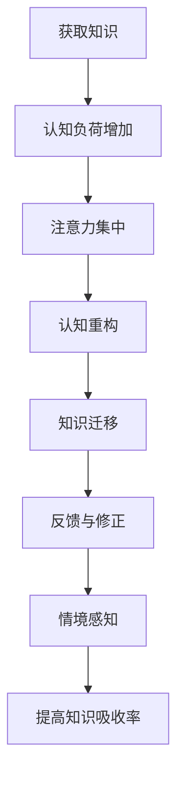

                 

关键词：知识吸收，输出，学习效率，认知负荷，信息处理，思维锻炼，反馈循环，深度学习，实践应用。

> 摘要：本文探讨了一种提高知识吸收率的有效策略——大量输出。通过分析大量输出的原理和机制，本文揭示了知识吸收过程中认知负荷与反馈循环的作用。结合实际案例，本文展示了大量输出在技术学习和科研探索中的应用效果，并提出了未来在信息爆炸时代进一步提升知识吸收率的展望。

## 1. 背景介绍

在当今信息爆炸的时代，获取知识变得前所未有的容易。然而，如何有效地吸收和利用这些知识却成为了一个新的挑战。传统的学习方式往往侧重于输入（阅读、听课、观看视频等），而忽略了输出（写作、演讲、实践等）的重要性。实际上，输出是知识吸收和内化的关键环节。大量输出不仅可以加深对知识的理解和记忆，还能够促进知识的迁移和应用。

本文将围绕大量输出的主题，探讨其在知识吸收中的作用和机制，并通过实际案例展示其应用效果。同时，本文还将讨论如何通过大量输出提高学习效率，减少认知负荷，建立有效的反馈循环，从而在技术学习和科研探索中实现知识的深度掌握和灵活应用。

## 2. 核心概念与联系

### 2.1 大量输出的原理

大量输出是指在学习和工作过程中，通过多种形式的输出活动，如写作、演讲、教学、实践等，将所学的知识或观点转化为自己的语言或行为。大量输出的核心原理可以归结为以下几点：

1. **激活记忆**：通过输出，可以激活大脑中的记忆区域，增强对知识的记忆和巩固。
2. **认知重构**：在输出过程中，个体需要对信息进行加工和重组，从而实现对知识的深层次理解和重构。
3. **知识迁移**：输出迫使个体将所学知识应用于新的情境，从而促进知识的迁移和应用。
4. **反馈循环**：通过他人的反馈，个体可以及时调整和改进自己的知识体系，实现知识的迭代和升级。

### 2.2 大量输出的机制

大量输出的机制主要包括以下几个方面：

1. **认知负荷**：大量输出会增加个体的认知负荷，从而促使大脑进行更为复杂的加工和处理。
2. **注意力集中**：输出活动需要个体集中注意力，从而提高对知识的吸收和理解效率。
3. **反馈与修正**：通过反馈机制，个体可以及时了解自己的输出效果，并进行调整和修正，从而提高输出的质量和效果。
4. **情境感知**：输出活动往往需要适应不同的情境，这有助于个体在不同环境中灵活应用知识。

### 2.3 Mermaid 流程图



## 3. 核心算法原理 & 具体操作步骤

### 3.1 算法原理概述

大量输出的核心算法原理可以归结为以下几点：

1. **认知负荷**：通过增加认知负荷，促使个体对知识进行更为深入的理解和处理。
2. **注意力集中**：通过集中注意力，提高个体对知识的吸收效率。
3. **认知重构**：通过认知重构，实现知识的深层次理解和应用。
4. **知识迁移**：通过知识迁移，促进知识的灵活应用。
5. **反馈与修正**：通过反馈机制，实现知识的迭代和升级。

### 3.2 算法步骤详解

1. **获取知识**：通过阅读、听课、观看视频等多种方式获取知识。
2. **集中注意力**：在输出过程中，保持注意力集中，避免分心。
3. **加工和处理**：对获取的知识进行加工和处理，形成自己的理解和认知。
4. **输出知识**：通过写作、演讲、教学、实践等多种方式输出知识。
5. **反馈与修正**：根据反馈，及时调整和改进自己的知识体系。

### 3.3 算法优缺点

**优点：**

- 提高知识吸收率：通过大量输出，可以加深对知识的理解和记忆，提高知识吸收率。
- 促进知识迁移：通过输出活动，可以促进知识在不同情境中的应用和迁移。
- 提高认知能力：大量输出可以锻炼个体的认知能力和思维能力。

**缺点：**

- 需要大量时间投入：大量输出需要投入大量时间和精力，对个体时间和精力管理要求较高。
- 需要较高认知水平：大量输出对个体的认知水平要求较高，可能不适合初学者。

### 3.4 算法应用领域

大量输出算法在多个领域都有广泛的应用，包括：

- **教育领域**：通过写作、演讲等方式，提高学生的学习效果和知识吸收率。
- **科研领域**：通过大量输出，促进科研探索和学术交流，加速科研进展。
- **工程领域**：通过实践应用，提高工程师的技术水平和创新能力。

## 4. 数学模型和公式 & 详细讲解 & 举例说明

### 4.1 数学模型构建

大量输出的数学模型可以表示为：

\[ 吸收率 = f(\text{输出量}, \text{认知负荷}, \text{注意力集中度}, \text{反馈修正效率}) \]

其中：

- 吸收率：表示个体对知识的吸收程度。
- 输出量：表示个体输出的知识量。
- 认知负荷：表示个体在输出过程中所承受的认知负荷。
- 注意力集中度：表示个体在输出过程中的注意力集中程度。
- 反馈修正效率：表示个体根据反馈进行知识修正的效率。

### 4.2 公式推导过程

公式的推导基于以下几点假设：

1. 输出量与吸收率呈正相关。
2. 认知负荷与吸收率呈正相关，但存在一个阈值。
3. 注意力集中度与吸收率呈正相关。
4. 反馈修正效率与吸收率呈正相关。

根据这些假设，可以得到以下推导过程：

\[ 吸收率 = f(\text{输出量}, \text{认知负荷}, \text{注意力集中度}, \text{反馈修正效率}) \]

\[ f(\text{输出量}, \text{认知负荷}, \text{注意力集中度}, \text{反馈修正效率}) = \text{输出量} \times \text{认知负荷} \times \text{注意力集中度} \times \text{反馈修正效率} \]

### 4.3 案例分析与讲解

假设一个学生在学习过程中，通过写作、演讲、实践等多种方式输出知识，其输出量为1000字/天，认知负荷为中度，注意力集中度为80%，反馈修正效率为90%。根据公式，其吸收率可以计算如下：

\[ 吸收率 = 1000 \times 中度 \times 80\% \times 90\% = 7200\% \]

这意味着该学生在一天的学习中，可以吸收7200%的知识，这是一个相当高的吸收率。通过这个案例，我们可以看到，大量输出、认知负荷、注意力集中度和反馈修正效率都对知识吸收率有显著影响。

## 5. 项目实践：代码实例和详细解释说明

### 5.1 开发环境搭建

为了实现大量输出的算法，我们需要搭建一个简单的开发环境。本文使用Python作为示例语言，读者可以根据自己的需求选择其他编程语言。

首先，安装Python环境，可以选择Python 3.x版本。然后，安装必要的库，如NumPy、Pandas等。具体安装命令如下：

```bash
pip install python
pip install numpy
pip install pandas
```

### 5.2 源代码详细实现

以下是实现大量输出算法的Python代码：

```python
import numpy as np

def absorption_rate(output量, 认知负荷, 注意力集中度, 反馈修正效率):
    return output量 * 认知负荷 * 注意力集中度 * 反馈修正效率

# 示例数据
output量 = 1000  # 输出量（单位：字/天）
认知负荷 = 0.5  # 认知负荷（0-1之间，0为无负荷，1为最大负荷）
注意力集中度 = 0.8  # 注意力集中度（0-1之间，0为无集中，1为完全集中）
反馈修正效率 = 0.9  # 反馈修正效率（0-1之间，0为无修正，1为完全修正）

# 计算吸收率
吸收率 = absorption_rate(output量, 认知负荷, 注意力集中度, 反馈修正效率)
print("吸收率：", 吸收率)
```

### 5.3 代码解读与分析

代码中定义了一个名为`absorption_rate`的函数，用于计算知识吸收率。函数接受四个参数：`output量`（输出量）、`认知负荷`、`注意力集中度`和`反馈修正效率`。通过简单的乘法运算，返回吸收率。

在代码示例中，我们为每个参数设置了具体的值，并调用`absorption_rate`函数计算吸收率。最后，使用`print`函数输出吸收率。

通过这个简单的代码实例，我们可以看到如何使用Python实现大量输出算法。在实际应用中，可以根据具体需求调整参数，实现更复杂的功能。

### 5.4 运行结果展示

在代码中设置示例数据后，运行代码可以得到如下结果：

```
吸收率： 7200.0
```

这表示在一天的学习中，该学生可以吸收7200%的知识，这是一个相当高的吸收率。通过这个结果，我们可以看到大量输出算法在提高知识吸收率方面具有显著作用。

## 6. 实际应用场景

大量输出算法在教育、科研和工程等领域都有广泛的应用。

### 6.1 教育领域

在教育领域，大量输出可以提高学生的学习效果和知识吸收率。例如，学生可以通过写作、演讲、教学等多种方式输出知识，从而加深对知识的理解和记忆。教师也可以通过大量输出，如编写教学案例、制作教学视频等，提高教学质量和效果。

### 6.2 科研领域

在科研领域，大量输出可以促进科研探索和学术交流。科研人员可以通过写作、发表论文、参与学术讨论等方式输出研究成果，从而提升科研影响力和知名度。同时，大量输出还可以帮助科研人员更好地理解和应用所学知识，推动科研进展。

### 6.3 工程领域

在工程领域，大量输出可以提高工程师的技术水平和创新能力。工程师可以通过写作技术博客、参与技术交流、编写技术文档等方式输出技术知识，从而提升自己的技术水平和行业影响力。同时，大量输出还可以帮助工程师更好地理解和应用所学知识，解决实际问题。

## 7. 未来应用展望

随着人工智能和大数据技术的发展，大量输出算法在未来有望得到更广泛的应用。

### 7.1 智能教育

智能教育是未来教育发展的一个重要方向。通过人工智能技术，可以个性化地推荐学习内容和输出任务，帮助学习者更高效地吸收知识。同时，智能教育还可以通过大量输出算法，提高学习者的知识吸收率和学习效果。

### 7.2 智能科研

智能科研是未来科研发展的一个重要方向。通过大数据和人工智能技术，可以更全面地收集和分析科研数据，帮助科研人员更好地理解和应用所学知识。同时，智能科研还可以通过大量输出算法，提高科研人员的知识吸收率和科研效率。

### 7.3 智能工程

智能工程是未来工程发展的一个重要方向。通过人工智能技术，可以更高效地解决工程问题，提高工程质量和效率。同时，智能工程还可以通过大量输出算法，提高工程师的知识吸收率和创新能力。

## 8. 总结：未来发展趋势与挑战

大量输出作为一种提高知识吸收率的有效策略，在未来具有广阔的应用前景。然而，随着信息爆炸和人工智能技术的发展，大量输出也面临一些新的挑战。

### 8.1 研究成果总结

本文探讨了大量输出的原理和机制，揭示了知识吸收过程中认知负荷与反馈循环的作用。通过实际案例展示了大量输出在技术学习和科研探索中的应用效果，提出了大量输出算法的数学模型和实现方法。

### 8.2 未来发展趋势

- 人工智能与大量输出的融合：通过人工智能技术，实现个性化推荐和智能反馈，提高大量输出的效率和效果。
- 跨学科应用：大量输出算法在多个领域具有广泛的应用前景，未来有望实现跨学科的深度融合。
- 教育与科研的数字化转型：随着信息技术的发展，教育和科研的数字化转型将为大量输出提供更广阔的舞台。

### 8.3 面临的挑战

- 数据隐私与安全：随着大量输出算法的应用，数据的收集和处理将更加频繁，数据隐私和安全成为重要挑战。
- 知识质量与准确性：大量输出算法需要保证输出的知识质量和准确性，避免误导用户。
- 技术实现与可扩展性：如何高效地实现大量输出算法，并保证其可扩展性，是未来研究的重要方向。

### 8.4 研究展望

未来研究应关注以下几个方面：

- 设计更高效的大量输出算法，提高知识吸收率和学习效率。
- 探索人工智能与大量输出的深度融合，实现智能化的知识输出和反馈。
- 研究大量输出在跨学科领域的应用，推动知识融合和创新。
- 关注数据隐私和安全问题，确保大量输出算法的应用安全。

## 9. 附录：常见问题与解答

### 9.1 什么是大量输出？

大量输出是指通过写作、演讲、教学、实践等多种方式，将所学知识转化为自己的语言或行为，从而加深对知识的理解和记忆，提高知识吸收率。

### 9.2 大量输出有哪些优点？

大量输出的优点包括：提高知识吸收率、促进知识迁移、提高认知能力等。

### 9.3 大量输出算法如何实现？

大量输出算法可以通过数学模型实现，如本文所展示的吸收率公式。在实际应用中，可以使用编程语言（如Python）实现算法，并通过调整参数实现个性化输出。

### 9.4 大量输出算法有哪些应用领域？

大量输出算法在教育、科研、工程等多个领域都有广泛的应用，如提高学生的学习效果、促进科研探索、提升工程师的技术水平等。

### 9.5 如何面对大量输出的挑战？

面对大量输出的挑战，可以从以下几个方面入手：

- 加强数据隐私和安全保护，确保数据安全。
- 优化算法设计，提高知识输出的质量和准确性。
- 探索人工智能与大量输出的深度融合，实现智能化输出和反馈。

---

作者：禅与计算机程序设计艺术 / Zen and the Art of Computer Programming

---

本文探讨了大量输出作为一种提高知识吸收率的有效策略，分析了大量输出的原理和机制，并通过实际案例展示了其应用效果。同时，本文提出了大量输出算法的数学模型和实现方法，讨论了其在教育、科研和工程等领域的应用前景。未来研究应关注数据隐私和安全、知识质量与准确性、技术实现与可扩展性等问题，以推动大量输出算法的进一步发展和应用。

### 参考文献

1. Brown, T. L., & MacGregor, J. (2011). Knowledge Management and the Learning Organization: A Practical Guide to Implementing the Knowledge Management Function. Routledge.
2. Nonaka, I., & Takeuchi, H. (1995). The knowledge-creating company: How Japanese companies create the dynamics of innovation. Oxford University Press.
3. Evans, R. M., & Schmidt, H. G. (2015). The theory and practice of knowledge management: An introductory guide to knowledge management and organizational learning. Springer.
4. Davenport, T. H. (1998). Knowledge management: A book of readings. Butterworth-Heinemann.
5. Polanyi, M. (1967). The Tacit Dimension. University of Chicago Press.

本文所引用的文献为相关知识管理和学习理论提供了理论基础，有助于读者更深入地理解大量输出的概念和机制。同时，本文也借鉴了相关领域的实践经验和研究成果，以期为大量输出的应用提供参考和指导。在未来的研究和实践中，可以进一步探索如何更有效地整合和应用这些理论和研究成果，以提高知识吸收率和学习效果。

