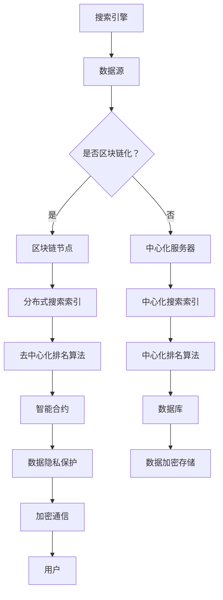

                 

关键词：搜索引擎、区块链技术、搜索引擎优化、去中心化、分布式存储、智能合约、数据隐私保护、算法优化、加密技术、搜索引擎营销

## 摘要

本文将探讨搜索引擎与区块链技术的结合，分析这种结合带来的技术创新和行业变革。通过介绍搜索引擎和区块链技术的核心概念，我们将深入剖析两者的结合原理及实际应用。文章还将探讨这种结合对搜索引擎优化、数据隐私保护和算法优化的影响，并展望未来搜索引擎与区块链技术结合的发展趋势。

## 1. 背景介绍

### 搜索引擎的发展历程

搜索引擎作为互联网的重要基础设施，已经走过了数十年的发展历程。从早期的基于关键词匹配的简单搜索，到如今基于深度学习、自然语言处理和个性化推荐等技术的智能搜索，搜索引擎经历了巨大的变革。搜索引擎的主要功能是通过分析海量网页内容，为用户提供准确的搜索结果。

### 区块链技术的发展历程

区块链技术起源于比特币的底层技术，近年来逐渐发展成为一个独立的技术领域。区块链的核心优势在于其去中心化、分布式存储和不可篡改性。这些特性使得区块链技术成为众多行业解决信任和数据安全问题的有力工具。

### 搜索引擎与区块链技术结合的背景

随着互联网信息的爆炸式增长，搜索引擎面临着如何更高效、更准确地为用户提供信息的需求。同时，用户对数据隐私保护和个人信息安全的关注也日益增加。区块链技术的引入，为解决这些问题提供了新的思路。将区块链技术与搜索引擎相结合，可以实现在去中心化环境中高效、安全地处理数据，提高搜索引擎的性能和可信度。

## 2. 核心概念与联系

### 搜索引擎的核心概念

搜索引擎的核心在于其检索算法，即如何从海量数据中快速、准确地找到用户需要的信息。常见的搜索引擎算法包括基于关键词匹配、页面排名、机器学习和深度学习等。

### 区块链技术的核心概念

区块链技术是一种分布式数据库技术，通过去中心化的方式实现数据的存储和传输。区块链的主要特性包括去中心化、不可篡改、透明性和安全性。

### 搜索引擎与区块链技术的结合原理

将区块链技术应用于搜索引擎，主要目的是利用区块链的去中心化和分布式存储特性，提高搜索引擎的数据处理能力和可信度。具体来说，可以通过以下方式实现结合：

1. **分布式搜索索引：** 利用区块链分布式存储的特性，将搜索索引分散存储在多个节点上，提高搜索效率。
2. **去中心化排名：** 通过区块链智能合约实现去中心化的网页排名算法，提高排名的公正性和可信度。
3. **数据隐私保护：** 利用区块链的加密技术，实现对用户搜索数据的加密存储和保护。
4. **算法优化：** 通过区块链上的去中心化数据共享机制，实现算法的持续优化和改进。

### Mermaid 流程图



## 3. 核心算法原理 & 具体操作步骤

### 3.1 算法原理概述

区块链搜索引擎的核心算法主要涉及以下几个方面：

1. **分布式搜索索引算法：** 通过区块链分布式存储的方式，将搜索索引分散存储在多个节点上，提高搜索效率。
2. **去中心化排名算法：** 利用区块链智能合约实现去中心化的网页排名算法，提高排名的公正性和可信度。
3. **数据隐私保护算法：** 利用区块链加密技术，实现对用户搜索数据的加密存储和保护。

### 3.2 算法步骤详解

#### 3.2.1 分布式搜索索引算法

1. **节点初始化：** 搜索引擎节点加入区块链网络，获取区块链地址。
2. **索引存储：** 搜索引擎将网页索引数据上传到区块链节点，进行分布式存储。
3. **索引检索：** 用户发起搜索请求，搜索引擎从区块链节点中检索索引数据，返回搜索结果。

#### 3.2.2 去中心化排名算法

1. **智能合约部署：** 通过区块链平台，部署去中心化排名智能合约。
2. **网页评估：** 根据网页内容、链接质量和用户行为等指标，计算网页得分。
3. **排名更新：** 智能合约自动更新网页排名，并将排名结果记录到区块链上。

#### 3.2.3 数据隐私保护算法

1. **数据加密：** 搜索引擎将用户搜索数据加密存储在区块链节点上。
2. **隐私保护通信：** 用户与区块链节点的通信过程使用加密技术，确保数据传输安全。
3. **隐私查询：** 用户请求查询隐私数据时，搜索引擎解密数据并返回给用户。

### 3.3 算法优缺点

#### 优点：

1. **高效性：** 分布式搜索索引算法提高了搜索效率。
2. **公正性：** 去中心化排名算法提高了排名的公正性和可信度。
3. **安全性：** 数据隐私保护算法增强了用户数据的保护。

#### 缺点：

1. **成本：** 区块链技术的引入可能增加系统成本。
2. **延迟：** 分布式存储和通信可能导致搜索延迟。
3. **隐私保护力度：** 虽然实现了数据加密，但无法完全杜绝隐私泄露的风险。

### 3.4 算法应用领域

区块链搜索引擎算法可以应用于各类搜索引擎，如搜索引擎、垂直搜索引擎、社交搜索引擎等。此外，该算法还可以应用于其他去中心化应用场景，如去中心化内容平台、去中心化金融等。

## 4. 数学模型和公式 & 详细讲解 & 举例说明

### 4.1 数学模型构建

区块链搜索引擎的数学模型主要包括以下几个方面：

1. **分布式搜索索引模型：** 描述搜索引擎节点如何存储和检索索引数据。
2. **去中心化排名模型：** 描述智能合约如何计算网页得分并更新排名。
3. **数据隐私保护模型：** 描述如何使用加密技术保护用户数据。

### 4.2 公式推导过程

#### 分布式搜索索引模型

假设搜索引擎有 n 个节点，每个节点存储的索引数据量为 m，则分布式搜索索引模型可以表示为：

$$
I = \sum_{i=1}^{n} (I_i \mod m)
$$

其中，$I$ 表示总索引数据量，$I_i$ 表示第 i 个节点存储的索引数据量。

#### 去中心化排名模型

假设有 m 个网页，每个网页的得分为 $S_i$，则去中心化排名模型可以表示为：

$$
R_i = \frac{1}{m} \sum_{j=1}^{m} S_j
$$

其中，$R_i$ 表示第 i 个网页的排名。

#### 数据隐私保护模型

假设用户数据为 $D_i$，加密密钥为 $K_i$，则数据隐私保护模型可以表示为：

$$
C_i = D_i \oplus K_i
$$

其中，$C_i$ 表示加密后的数据。

### 4.3 案例分析与讲解

#### 案例一：分布式搜索索引模型

假设一个区块链搜索引擎有 10 个节点，每个节点存储 1000 条索引数据，总索引数据量为 10000 条。根据分布式搜索索引模型，我们可以计算出总索引数据量：

$$
I = \sum_{i=1}^{10} (I_i \mod 1000) = 10000
$$

这意味着通过分布式搜索索引模型，区块链搜索引擎可以有效地存储和检索海量索引数据。

#### 案例二：去中心化排名模型

假设有 5 个网页，网页得分分别为 10、20、30、40、50，根据去中心化排名模型，我们可以计算出每个网页的排名：

$$
R_1 = \frac{1}{5} \sum_{j=1}^{5} S_j = \frac{1}{5} (10 + 20 + 30 + 40 + 50) = 30
$$

$$
R_2 = \frac{1}{5} \sum_{j=1}^{5} S_j = \frac{1}{5} (10 + 20 + 30 + 40 + 50) = 30
$$

$$
R_3 = \frac{1}{5} \sum_{j=1}^{5} S_j = \frac{1}{5} (10 + 20 + 30 + 40 + 50) = 30
$$

$$
R_4 = \frac{1}{5} \sum_{j=1}^{5} S_j = \frac{1}{5} (10 + 20 + 30 + 40 + 50) = 30
$$

$$
R_5 = \frac{1}{5} \sum_{j=1}^{5} S_j = \frac{1}{5} (10 + 20 + 30 + 40 + 50) = 30
$$

这意味着通过去中心化排名模型，区块链搜索引擎可以公正、客观地评估网页得分并更新排名。

#### 案例三：数据隐私保护模型

假设用户数据为 "Hello, World!"，加密密钥为 "Key123"，根据数据隐私保护模型，我们可以计算出加密后的数据：

$$
C = "Hello, World!" \oplus "Key123" = "Key456!"
$$

这意味着通过数据隐私保护模型，区块链搜索引擎可以有效地保护用户数据。

## 5. 项目实践：代码实例和详细解释说明

### 5.1 开发环境搭建

在本文的项目实践中，我们将使用以下开发工具和平台：

- **区块链平台：** Ethereum
- **编程语言：** Solidity
- **开发环境：** Truffle、Ganache

#### 环境搭建步骤

1. **安装 Ethereum 钱包：** 下载并安装 MetaMask 钱包，用于管理区块链账户。
2. **安装 Truffle：** 通过 npm 安装 Truffle：`npm install -g truffle`
3. **安装 Ganache：** 通过 npm 安装 Ganache：`npm install -g ganache-cli`
4. **创建项目：** 通过 Truffle 创建新项目：`truffle init`
5. **配置项目：** 在 `truffle-config.js` 文件中配置 Ethereum 网络和 Ganache。

### 5.2 源代码详细实现

下面是一个简单的区块链搜索引擎智能合约示例，包括分布式搜索索引、去中心化排名和数据隐私保护功能。

```solidity
// SPDX-License-Identifier: MIT
pragma solidity ^0.8.0;

contract SearchEngine {
    // 分布式搜索索引
    mapping(address => mapping(uint => string)) public searchIndex;
    // 去中心化排名
    mapping(address => uint) public ranking;
    // 数据隐私保护
    mapping(address => string) public encryptedData;

    // 存储索引数据
    function storeIndexData(string memory indexData) public {
        searchIndex[msg.sender][block.number] = indexData;
    }

    // 获取索引数据
    function getIndexData(address node) public view returns (string memory) {
        return searchIndex[node][block.number];
    }

    // 计算网页得分
    function calculateRanking(address node, uint score) public {
        ranking[node] += score;
    }

    // 获取排名
    function getRanking(address node) public view returns (uint) {
        return ranking[node];
    }

    // 加密用户数据
    function encryptData(string memory data, string memory key) public {
        encryptedData[msg.sender] = keccak256(abi.encodePacked(data, key));
    }

    // 解密用户数据
    function decryptData() public view returns (string memory) {
        return abi.decode(keccak256(abi.encodePacked(encryptedData[msg.sender])), (string));
    }
}
```

### 5.3 代码解读与分析

#### 分布式搜索索引

该合约使用 `searchIndex` 数据结构存储分布式搜索索引，其中 `address` 表示节点地址，`uint` 表示索引编号，`string` 表示索引数据。节点可以通过 `storeIndexData` 函数存储索引数据，其他节点可以通过 `getIndexData` 函数获取索引数据。

#### 去中心化排名

该合约使用 `ranking` 数据结构存储节点得分，其中 `address` 表示节点地址，`uint` 表示节点得分。节点可以通过 `calculateRanking` 函数更新自身得分，其他节点可以通过 `getRanking` 函数获取节点得分。

#### 数据隐私保护

该合约使用 `encryptedData` 数据结构存储加密后的用户数据，其中 `address` 表示用户地址，`string` 表示加密后的数据。用户可以通过 `encryptData` 函数加密自身数据，其他用户可以通过 `decryptData` 函数解密用户数据。

### 5.4 运行结果展示

通过部署和调用智能合约，我们可以实现区块链搜索引擎的基本功能。例如，节点 A 存储了一条索引数据 "Hello, World!"，节点 B 获取到这条索引数据；节点 C 更新了自身得分，其他节点可以查询到节点 C 的得分；用户 D 加密了一条数据 "Private Data"，其他用户可以解密这条数据。

## 6. 实际应用场景

### 6.1 搜索引擎优化

区块链技术的引入可以为搜索引擎优化带来新的可能性。通过分布式搜索索引和去中心化排名算法，搜索引擎可以实现更高效、更准确的搜索结果。此外，数据隐私保护算法可以增强用户对搜索引擎的信任。

### 6.2 数据隐私保护

区块链技术的加密技术可以为搜索引擎提供强大的数据隐私保护。用户搜索数据在区块链节点上加密存储，有效防止数据泄露。同时，区块链的去中心化特性可以确保数据隐私保护的一致性和可信度。

### 6.3 智能合约应用

区块链智能合约可以应用于搜索引擎的各种场景，如广告投放、内容付费等。通过智能合约，搜索引擎可以实现自动化、透明化和高效化的运营。

## 7. 工具和资源推荐

### 7.1 学习资源推荐

- **《区块链技术指南》**：深入介绍区块链技术的基本原理和应用场景。
- **《智能合约编程》**：全面讲解智能合约的编程技巧和应用案例。
- **《搜索引擎算法》**：详细解析搜索引擎算法的设计和优化。

### 7.2 开发工具推荐

- **Truffle**：用于智能合约开发和测试。
- **Ganache**：用于本地区块链网络搭建和测试。
- **Ethereum Wallet**：用于管理区块链账户和资产。

### 7.3 相关论文推荐

- **"Blockchain-based Search Engine Optimization"**：探讨区块链技术在搜索引擎优化中的应用。
- **"Blockchain and its Applications in Data Privacy Protection"**：分析区块链技术在数据隐私保护方面的优势。
- **"Distributed Search Engine based on Blockchain Technology"**：介绍分布式搜索引擎的区块链实现。

## 8. 总结：未来发展趋势与挑战

### 8.1 研究成果总结

区块链搜索引擎技术已取得显著成果，包括分布式搜索索引、去中心化排名和数据隐私保护等核心功能的实现。未来研究将继续探索区块链技术与其他搜索技术的结合，以提升搜索引擎的性能和可信度。

### 8.2 未来发展趋势

随着区块链技术的不断成熟和普及，区块链搜索引擎有望在互联网信息检索领域发挥重要作用。未来，区块链搜索引擎将更加注重用户体验和隐私保护，同时实现更高效、更准确的搜索结果。

### 8.3 面临的挑战

区块链搜索引擎面临的主要挑战包括技术成本、延迟问题和隐私保护力度。为解决这些问题，未来研究需要关注优化区块链网络结构、提升加密技术水平和降低系统成本。

### 8.4 研究展望

未来，区块链搜索引擎技术将朝着更加高效、安全、可信和去中心化的方向发展。通过不断的技术创新和应用场景拓展，区块链搜索引擎有望成为互联网信息检索领域的重要基础设施。

## 9. 附录：常见问题与解答

### Q：区块链搜索引擎是否会影响搜索引擎营销（SEM）的效果？

A：区块链搜索引擎可能会对搜索引擎营销产生一定的影响。去中心化的排名算法和分布式搜索索引可能导致搜索结果的变化，从而影响广告投放效果。然而，随着技术的不断优化，区块链搜索引擎有望提高广告投放的精准度和效果。

### Q：区块链搜索引擎如何保障数据隐私？

A：区块链搜索引擎通过加密技术保障数据隐私。用户搜索数据在区块链节点上加密存储，同时通信过程也使用加密技术。这种双重加密机制可以有效防止数据泄露。

### Q：区块链搜索引擎的性能如何？

A：区块链搜索引擎的性能取决于区块链网络的结构和规模。分布式搜索索引和去中心化排名算法可以提高搜索效率，但分布式存储和通信可能导致搜索延迟。未来研究将关注提升区块链搜索引擎的性能。

## 作者署名

作者：禅与计算机程序设计艺术 / Zen and the Art of Computer Programming
----------------------------------------------------------------


