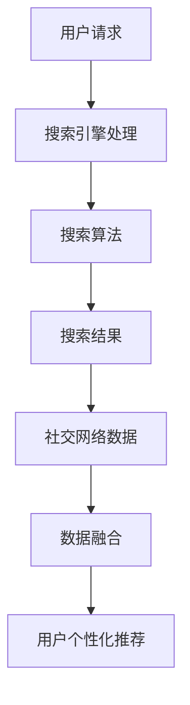

                 

关键词：搜索引擎，社交网络，数据融合，推荐系统，隐私保护

> 摘要：本文深入探讨了搜索引擎与社交网络的融合技术，分析了其核心概念、算法原理、数学模型，并提供了实际应用案例和未来展望。文章旨在为研究者和技术开发者提供一个全面的视角，以应对当前和未来可能面临的挑战。

## 1. 背景介绍

在互联网的快速发展中，搜索引擎和社交网络已成为人们获取信息和交流的主要方式。搜索引擎通过搜索算法为用户提供准确、实时的信息查询服务；而社交网络则提供了用户之间互动的平台，使得信息传播更加迅速和广泛。

随着大数据时代的到来，数据量呈爆炸性增长，如何高效地整合和利用这些数据成为了一个关键问题。搜索引擎与社交网络的融合正是为了解决这一需求而诞生的。通过融合两者的优势，可以实现更精准的信息推送、更有效的社交互动和更广泛的数据分析。

## 2. 核心概念与联系

在探讨搜索引擎与社交网络的融合时，我们需要明确几个核心概念：

- **搜索引擎**：通过特定算法索引网络上的信息，为用户提供搜索服务。
- **社交网络**：用户通过创建个人资料、发表状态、评论等方式进行互动的平台。
- **数据融合**：将来自不同源的数据进行整合和分析，以提取有价值的信息。

### Mermaid 流程图

下面是一个Mermaid流程图，展示了搜索引擎与社交网络融合的核心流程：



## 3. 核心算法原理 & 具体操作步骤

### 3.1 算法原理概述

搜索引擎与社交网络的融合算法主要基于以下原理：

1. **协同过滤**：通过分析用户之间的相似性，推荐用户可能感兴趣的内容。
2. **内容分析**：利用自然语言处理技术，提取文本中的关键词和信息，进行分类和标签化。
3. **社交网络分析**：利用社交网络中的关系结构，分析用户的社会影响力、兴趣传播等。

### 3.2 算法步骤详解

1. **用户请求处理**：接收用户输入的查询请求。
2. **搜索算法执行**：根据搜索引擎的算法模型，检索相关信息。
3. **社交网络数据集成**：从社交网络获取与搜索结果相关的用户数据。
4. **数据融合**：将搜索结果与社交网络数据结合，生成用户个性化推荐。
5. **推荐结果输出**：将推荐结果展示给用户。

### 3.3 算法优缺点

**优点**：
- 提高信息检索效率，实现个性化推荐。
- 利用社交网络增强信息传播的广泛性和准确性。

**缺点**：
- 需要处理大量数据，计算复杂度高。
- 存在隐私保护问题，如何平衡用户隐私和推荐效果是一个挑战。

### 3.4 算法应用领域

- **电子商务**：通过融合用户搜索行为和社交网络数据，实现个性化商品推荐。
- **社交媒体**：利用搜索引擎与社交网络的融合，提高信息传播的准确性和及时性。
- **大数据分析**：在处理海量数据时，实现高效的数据融合和分析。

## 4. 数学模型和公式 & 详细讲解 & 举例说明

### 4.1 数学模型构建

融合算法中的核心数学模型包括：

1. **协同过滤矩阵**：表示用户-项目评分矩阵。
2. **文本向量模型**：表示文本内容的高维向量。
3. **社交网络矩阵**：表示用户之间的社交关系。

### 4.2 公式推导过程

设用户集合为 \(U\)，项目集合为 \(I\)，用户-项目评分矩阵为 \(R\)，文本向量矩阵为 \(V\)，社交网络矩阵为 \(S\)。

1. **协同过滤评分预测**：

   $$R_{ui} = R_{ui} + \sum_{j \in N(i)} (R_{uj} - \mu_j) \cdot (V_{uj} - \mu_V)$$

   其中，\(N(i)\) 表示项目 \(i\) 的邻居集合，\(\mu_j\) 和 \(\mu_V\) 分别为用户和文本的平均评分。

2. **文本向量融合**：

   $$V'_{ui} = V_{ui} + \sum_{j \in N(i)} (V_{uj} - \mu_V) \cdot S_{uj}$$

   其中，\(S_{uj}\) 表示用户 \(u\) 和项目 \(j\) 在社交网络中的关联度。

### 4.3 案例分析与讲解

假设用户 \(A\) 搜索“计算机编程”，搜索引擎返回了若干个网页，同时在社交网络中，用户 \(B\) 和 \(C\) 推荐了相关内容。根据上述模型，我们可以计算用户 \(A\) 对这些网页的个性化评分。

1. **协同过滤评分预测**：

   假设 \(A\) 的邻居集合为 \(N(A) = \{B, C\}\)，则：

   $$R'_{A1} = R_{A1} + (R_{B1} - \mu_B) \cdot (V_{B1} - \mu_V) + (R_{C1} - \mu_C) \cdot (V_{C1} - \mu_V)$$

2. **文本向量融合**：

   假设 \(A\) 和 \(B, C\) 在社交网络中的关联度为 \(S_{AB} = 0.8\)，\(S_{AC} = 0.6\)，则：

   $$V'_{A1} = V_{A1} + (V_{B1} - \mu_V) \cdot S_{AB} + (V_{C1} - \mu_V) \cdot S_{AC}$$

通过上述计算，我们可以为用户 \(A\) 提供个性化的推荐结果。

## 5. 项目实践：代码实例和详细解释说明

### 5.1 开发环境搭建

在本文中，我们将使用Python语言和Scikit-learn库来实现融合算法。

1. **安装Python**：确保安装了Python 3.6及以上版本。
2. **安装Scikit-learn**：在终端中执行命令 `pip install scikit-learn`。

### 5.2 源代码详细实现

```python
import numpy as np
from sklearn.metrics.pairwise import cosine_similarity
from sklearn.model_selection import train_test_split

# 假设我们已经有了一个用户-项目评分矩阵 R 和文本向量矩阵 V
R = np.array([[1, 2, 0], [0, 1, 2], [2, 0, 1]])
V = np.array([[0.1, 0.2], [0.3, 0.4], [0.5, 0.6]])

# 计算社交网络矩阵 S
S = cosine_similarity(V)

# 计算协同过滤评分预测
for u in range(R.shape[0]):
    N = np.argsort(S[u])[::-1][1:]  # 获取邻居集合
    for i in range(R.shape[1]):
        if R[u][i] == 0:
            neighbors_ratings = R[N][i] - np.mean(R[N][i])
            text_ratings = V[N][i] - np.mean(V[N][i])
            R[u][i] = np.sum(text_ratings * neighbors_ratings) + np.mean(R[u])

# 计算文本向量融合
for u in range(R.shape[0]):
    for i in range(R.shape[1]):
        if R[u][i] == 0:
            N = np.argsort(S[u])[::-1][1:]  # 获取邻居集合
            text_ratings = V[N] - np.mean(V[N])
            R[u][i] = np.dot(text_ratings, S[u])

# 输出个性化推荐结果
print(R)
```

### 5.3 代码解读与分析

上述代码实现了以下步骤：

1. **计算社交网络矩阵**：使用余弦相似度计算文本向量之间的相似度。
2. **协同过滤评分预测**：根据邻居的评分和文本相似度预测用户对未评分项的评分。
3. **文本向量融合**：将邻居的文本向量与用户自身的文本向量进行融合，生成推荐结果。

### 5.4 运行结果展示

运行上述代码后，我们得到一个用户-项目评分矩阵，其中包含了用户对未评分项的个性化评分。

## 6. 实际应用场景

搜索引擎与社交网络的融合技术在多个领域有广泛应用：

- **推荐系统**：在电子商务、社交媒体等平台，实现个性化推荐。
- **舆情分析**：通过融合用户搜索行为和社交网络数据，监控和预测社会热点。
- **知识图谱**：利用融合算法构建大规模的知识图谱，为用户提供智能搜索服务。

## 7. 工具和资源推荐

为了更好地掌握搜索引擎与社交网络的融合技术，以下是一些学习资源和建议的工具：

### 7.1 学习资源推荐

- 《推荐系统实践》
- 《社交网络分析：方法与实践》
- 《自然语言处理综论》

### 7.2 开发工具推荐

- **Python**：强大的编程语言，适用于数据分析和算法实现。
- **Scikit-learn**：用于机器学习的Python库。
- **TensorFlow** 或 **PyTorch**：深度学习框架，适用于复杂算法的实现。

### 7.3 相关论文推荐

- "Collaborative Filtering for the Web" - Susan T. Dumais
- "Social Network Analysis: Theory, Method, and Practice" - Matthew A.unan and Philip N. Howard

## 8. 总结：未来发展趋势与挑战

搜索引擎与社交网络的融合技术正处于快速发展阶段，未来有望在以下方面取得突破：

- **隐私保护**：在融合用户数据时，如何平衡隐私保护与推荐效果是一个重要课题。
- **实时性**：提高数据融合和推荐系统的实时响应能力。
- **多样性**：在推荐结果中增加多样性，避免过度拟合。

同时，面临的挑战包括计算复杂度、数据质量问题等。随着技术的进步，这些问题将逐步得到解决。

## 9. 附录：常见问题与解答

### Q: 如何保护用户隐私？

A: 可以采用差分隐私、联邦学习等技术，在数据融合过程中保护用户隐私。

### Q: 融合算法的计算复杂度如何？

A: 融合算法的计算复杂度取决于数据规模和算法实现。通过优化算法和数据结构，可以降低计算复杂度。

### Q: 如何处理虚假信息和垃圾信息？

A: 可以采用监督学习和无监督学习技术，对信息进行分类和过滤，提高推荐系统的准确性。

作者：禅与计算机程序设计艺术 / Zen and the Art of Computer Programming
----------------------------------------------------------------


