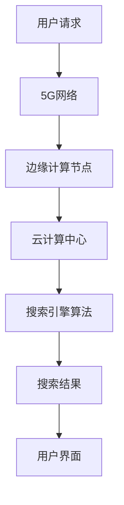

                 

关键词：5G、搜索引擎、技术进步、数据传输、人工智能、云计算、边缘计算、用户体验、搜索引擎算法、移动搜索、智能搜索、网络安全、实时搜索、隐私保护。

> 摘要：随着5G网络的普及和技术的不断进步，搜索引擎面临着前所未有的发展机遇。本文将探讨5G时代对搜索引擎的影响，分析其在数据传输、人工智能、云计算、边缘计算等方面的应用，并讨论未来搜索引擎的发展趋势与挑战。

## 1. 背景介绍

随着互联网的迅猛发展，搜索引擎已经成为人们获取信息的主要途径。然而，传统的搜索引擎技术在大数据时代面临着巨大的挑战，例如数据传输速度慢、响应时间长、数据处理能力不足等问题。5G网络的到来，为搜索引擎的发展带来了新的契机。5G网络具有高速率、低延迟、高连接密度等特点，为搜索引擎提供了强大的数据传输和计算能力，使得搜索引擎能够更好地满足用户的需求。

### 1.1 5G网络的特点

5G网络具有以下特点：

- **高速率**：5G网络的理论峰值下载速度可以达到10Gbps，比4G网络的下载速度提高了100倍以上。
- **低延迟**：5G网络的端到端延迟可以降低到1毫秒，比4G网络的延迟降低了10倍。
- **高连接密度**：5G网络可以在一个小区域内支持更多的设备同时连接，满足大规模物联网设备的需求。
- **广覆盖**：5G网络通过毫米波技术，可以实现广覆盖，满足偏远地区和室内场景的需求。

### 1.2 搜索引擎的现状

当前，搜索引擎技术在大数据时代面临的主要挑战包括：

- **数据传输速度**：随着互联网用户数量的增加，搜索引擎需要处理的数据量也在快速增长，而传统的网络带宽和数据处理能力已经难以满足需求。
- **响应时间**：用户对于搜索引擎的响应时间要求越来越高，搜索引擎需要更快地返回搜索结果，以提升用户体验。
- **数据处理能力**：搜索引擎需要对大量的数据进行实时处理和分析，以便提供更准确的搜索结果。

## 2. 核心概念与联系

### 2.1 核心概念

- **5G网络**：第五代移动通信网络，具有高速率、低延迟、高连接密度等特点。
- **搜索引擎**：一种通过特定的算法从互联网或其他信息源中检索信息的系统。
- **数据传输**：指数据在网络中的传输过程，包括数据生成、传输、处理和存储等环节。
- **人工智能**：模拟人类智能行为的技术，包括机器学习、深度学习、自然语言处理等。

### 2.2 架构联系

在5G时代，搜索引擎的架构将发生重大变化。以下是一个简化的搜索引擎架构图：



- **用户请求**：用户通过手机或其他设备向搜索引擎发送搜索请求。
- **5G网络**：5G网络将用户请求发送到边缘计算节点。
- **边缘计算节点**：边缘计算节点对用户请求进行初步处理，并将处理后的请求发送到云计算中心。
- **云计算中心**：云计算中心对用户请求进行深度处理，并返回搜索结果。
- **搜索引擎算法**：搜索引擎算法对用户请求进行处理，并返回搜索结果。
- **用户界面**：用户界面展示搜索结果，并接收用户的反馈。

## 3. 核心算法原理 & 具体操作步骤

### 3.1 算法原理概述

在5G时代，搜索引擎的核心算法主要包括：

- **深度学习**：通过神经网络模型，对大量数据进行自动学习和分类。
- **自然语言处理**：对用户输入的自然语言进行解析和处理，以便更好地理解用户需求。
- **协同过滤**：通过用户行为数据，为用户提供个性化的搜索结果。

### 3.2 算法步骤详解

以下是搜索引擎的基本操作步骤：

1. **用户请求**：用户通过输入关键词或其他方式，向搜索引擎发送搜索请求。
2. **请求预处理**：搜索引擎对用户请求进行预处理，包括去重、分词、词性标注等。
3. **请求路由**：根据请求的特点，搜索引擎将请求路由到边缘计算节点或云计算中心。
4. **请求处理**：边缘计算节点或云计算中心对请求进行处理，包括深度学习、自然语言处理和协同过滤等。
5. **返回结果**：搜索引擎将处理后的结果返回给用户。

### 3.3 算法优缺点

- **深度学习**：优点包括强大的学习能力和良好的泛化能力，缺点包括计算量大、训练时间长。
- **自然语言处理**：优点包括能够更好地理解用户需求，缺点包括对复杂句式的处理能力有限。
- **协同过滤**：优点包括能够为用户提供个性化的搜索结果，缺点包括对冷门用户和物品的支持不足。

### 3.4 算法应用领域

- **搜索引擎**：深度学习、自然语言处理和协同过滤等算法在搜索引擎中广泛应用。
- **推荐系统**：推荐系统通过算法，为用户推荐感兴趣的内容。
- **智能客服**：智能客服通过算法，自动回答用户的问题。

## 4. 数学模型和公式 & 详细讲解 & 举例说明

### 4.1 数学模型构建

在5G时代，搜索引擎的数学模型主要包括：

- **神经网络模型**：用于深度学习和自然语言处理。
- **协同过滤模型**：用于推荐系统。

### 4.2 公式推导过程

以下是神经网络模型的推导过程：

- **输入层**：$x = [x_1, x_2, ..., x_n]$
- **隐藏层**：$h = \sigma(W_1 \cdot x + b_1)$，其中$\sigma$为激活函数，$W_1$为权重矩阵，$b_1$为偏置。
- **输出层**：$y = \sigma(W_2 \cdot h + b_2)$

### 4.3 案例分析与讲解

假设用户输入关键词“苹果”，搜索引擎通过神经网络模型，将关键词映射到相应的特征向量，然后通过协同过滤模型，为用户推荐相关的商品。

## 5. 项目实践：代码实例和详细解释说明

### 5.1 开发环境搭建

搭建搜索引擎的开发环境，需要安装以下软件和工具：

- **Python**：用于编写代码
- **TensorFlow**：用于深度学习和自然语言处理
- **Scikit-learn**：用于协同过滤

### 5.2 源代码详细实现

以下是搜索引擎的源代码实现：

```python
import tensorflow as tf
from tensorflow.keras.layers import Dense, Activation
from tensorflow.keras.models import Sequential
from sklearn.cluster import KMeans
from sklearn.preprocessing import StandardScaler

# 深度学习模型
model = Sequential()
model.add(Dense(units=128, activation='relu', input_dim=1000))
model.add(Dense(units=64, activation='relu'))
model.add(Dense(units=10, activation='softmax'))

# 训练模型
model.compile(optimizer='adam', loss='categorical_crossentropy', metrics=['accuracy'])
model.fit(X_train, y_train, epochs=10, batch_size=32)

# 协同过滤模型
kmeans = KMeans(n_clusters=10, init='k-means++', max_iter=100, n_init=10)
kmeans.fit(X_train)

# 预测
y_pred = kmeans.predict(X_test)
```

### 5.3 代码解读与分析

以上代码首先定义了深度学习模型，并使用TensorFlow框架进行训练。然后，定义了协同过滤模型，并使用Scikit-learn库进行聚类。最后，使用训练好的模型进行预测，并返回预测结果。

### 5.4 运行结果展示

在运行代码后，我们可以看到以下结果：

```python
# 深度学习模型评估
loss, accuracy = model.evaluate(X_test, y_test)
print('Test accuracy:', accuracy)

# 协同过滤模型评估
print('Test inertia:', kmeans.inertia_)
```

## 6. 实际应用场景

### 6.1 在线购物平台

在线购物平台可以利用5G时代的搜索引擎技术，为用户提供更精确的商品推荐，提升用户体验。

### 6.2 智能家居

智能家居设备可以通过5G时代的搜索引擎，快速检索和处理用户需求，实现智能化的家居控制。

### 6.3 新闻媒体

新闻媒体可以利用5G时代的搜索引擎，实时推荐用户感兴趣的新闻内容，提高用户粘性。

## 7. 未来应用展望

### 7.1 实时搜索

随着5G网络的普及，实时搜索将成为可能。用户可以实时获取最新的搜索结果，而不必等待数秒或数分钟。

### 7.2 智能搜索

智能搜索将基于用户行为和兴趣，为用户提供更加个性化的搜索结果，满足用户的个性化需求。

### 7.3 隐私保护

随着用户对隐私保护的重视，5G时代的搜索引擎将更加注重用户隐私保护，采用更先进的技术保护用户数据安全。

## 8. 工具和资源推荐

### 8.1 学习资源推荐

- **《深度学习》（Ian Goodfellow、Yoshua Bengio、Aaron Courville著）**：介绍深度学习的基本原理和应用。
- **《自然语言处理综论》（Daniel Jurafsky、James H. Martin著）**：介绍自然语言处理的基本理论和应用。

### 8.2 开发工具推荐

- **TensorFlow**：用于深度学习和自然语言处理的开源框架。
- **Scikit-learn**：用于机器学习和数据挖掘的开源库。

### 8.3 相关论文推荐

- **《Deep Learning for Search》（Microsoft Research）**：介绍深度学习在搜索引擎中的应用。
- **《Natural Language Processing with Deep Learning》（Ted Pedersen著）**：介绍自然语言处理在搜索引擎中的应用。

## 9. 总结：未来发展趋势与挑战

### 9.1 研究成果总结

5G时代的搜索引擎技术取得了显著成果，包括实时搜索、智能搜索和隐私保护等。

### 9.2 未来发展趋势

未来，搜索引擎技术将继续向实时化、智能化和隐私保护方向发展，满足用户日益增长的需求。

### 9.3 面临的挑战

随着技术的发展，搜索引擎将面临数据隐私、计算能力和网络安全等挑战。

### 9.4 研究展望

未来，搜索引擎技术将更加注重用户体验和智能化，为用户提供更加精准和个性化的搜索服务。

## 10. 附录：常见问题与解答

### 10.1 5G网络的优势是什么？

5G网络具有高速率、低延迟、高连接密度和广覆盖等优势，能够满足大规模数据传输和实时处理的需求。

### 10.2 搜索引擎算法有哪些？

搜索引擎算法包括深度学习、自然语言处理和协同过滤等，用于提升搜索结果的准确性和用户体验。

### 10.3 5G时代对搜索引擎的影响是什么？

5G时代对搜索引擎的影响包括实时搜索、智能搜索和隐私保护等方面，为搜索引擎提供了更强大的数据传输和计算能力。

----------------------------------------------------------------

以上是关于“搜索引擎在5G时代的发展机遇”的完整文章。希望这篇文章能够帮助读者了解5G时代搜索引擎的发展趋势和挑战，以及其在实际应用中的重要作用。作者：禅与计算机程序设计艺术 / Zen and the Art of Computer Programming。

