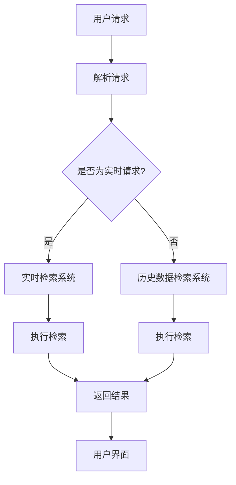

                 

在当今技术迅猛发展的时代，太空探索已成为全球范围内的一项重要科学事业。随着太空技术的不断进步，如何在浩瀚的宇宙中高效地寻找和获取信息，成为了制约太空探索活动进一步发展的关键问题。本文将深入探讨搜索引擎在太空探索中的应用，解析其核心概念、算法原理、数学模型以及实际应用场景，以期对未来太空探索中搜索引擎的发展趋势和面临的挑战提供一些思考。

## 关键词

- 搜索引擎
- 太空探索
- 信息检索
- 分布式系统
- 人工智能
- 宇宙数据管理

## 摘要

本文从多角度探讨了搜索引擎在太空探索中的应用。首先，介绍了太空探索中的信息检索需求，并探讨了现有技术在此领域的局限性。接着，详细分析了搜索引擎的核心概念和算法原理，并通过Mermaid流程图展示了搜索引擎的系统架构。随后，本文介绍了搜索引擎的数学模型和公式，并通过案例进行了说明。文章还通过实际项目实践，展示了搜索引擎在太空探索中的具体应用，并探讨了未来发展的前景。最后，文章总结了研究成果，分析了未来发展趋势和面临的挑战，并对相关工具和资源进行了推荐。

## 1. 背景介绍

### 太空探索的重要性

太空探索是现代科技发展的重要驱动力之一。它不仅推动了科学技术的进步，还极大地促进了人类对地球和宇宙的认识。从早期的卫星发射到火星探测，再到最近的太空站建设和月球探测，人类在太空领域的每一次重大突破，都标志着科技的新高度。

太空探索的意义不仅在于探索宇宙的奥秘，更重要的是它在多个领域产生了深远的影响。例如，太空技术的发展带动了微电子、新材料、人工智能等领域的创新。此外，太空探索还为地球上的众多行业提供了宝贵的数据和资源，如天气预报、气候变化研究、资源勘探等。

### 信息检索的需求

在太空探索过程中，信息检索的需求显得尤为迫切。太空探索产生的数据量庞大且复杂，涵盖图像、文本、音频、视频等多种形式。这些数据不仅需要被高效地存储和管理，更需要快速准确地检索和使用。

信息检索的需求主要源于以下几个方面：

1. **科学数据管理**：太空探索任务产生的数据量巨大，如何有效地组织和管理这些数据，以便科学家能够快速找到所需信息，是信息检索的首要任务。

2. **任务调度与决策**：太空探索任务往往具有高风险和高成本的特点，需要在任务执行过程中实时获取和分析各种信息，以便做出正确的调度和决策。

3. **航天器运行监控**：航天器的正常运行对于太空探索至关重要。信息检索技术可以帮助地面控制中心实时监控航天器的运行状态，及时发现并解决问题。

4. **数据共享与协作**：太空探索是一个全球性的科学事业，需要不同国家和机构之间的数据共享和协作。高效的信息检索系统能够促进这种协作，加速科学研究的进展。

### 现有技术的局限性

尽管信息检索技术在近年来有了显著的发展，但在太空探索中仍面临诸多挑战。

1. **数据存储和传输**：太空环境下的数据存储和传输是一个复杂且耗资源的过程。现有的存储技术无法满足大规模、高速率的数据存储需求，而传输技术也因距离和通信带宽的限制而受限。

2. **数据多样性**：太空探索涉及多种类型的数据，如图像、文本、音频、视频等。现有的信息检索技术往往专注于单一类型的数据处理，难以应对数据多样性带来的挑战。

3. **实时性要求**：太空探索任务往往具有高实时性要求，例如在紧急情况下需要快速获取和分析数据。现有的信息检索系统在处理实时数据时存在延迟，无法满足任务需求。

4. **系统安全性**：太空探索涉及国家安全和科学机密，信息检索系统必须具备高水平的安全性，以防止数据泄露和恶意攻击。

### 搜索引擎在太空探索中的应用

搜索引擎作为信息检索的核心工具，在太空探索中具有广泛的应用前景。通过结合先进的算法和分布式系统技术，搜索引擎可以在太空探索的各个阶段提供高效的信息检索服务。

1. **数据检索**：搜索引擎可以用于快速检索太空探索任务产生的海量数据，帮助科学家快速找到所需信息。

2. **任务调度**：搜索引擎可以帮助任务控制中心实时获取任务相关的各种信息，为任务调度和决策提供支持。

3. **航天器监控**：搜索引擎可以用于监控航天器的运行状态，及时发现并处理潜在问题。

4. **数据共享**：搜索引擎可以促进不同国家和机构之间的数据共享和协作，加速科学研究的进展。

总之，搜索引擎在太空探索中的应用具有重要的现实意义和广阔的发展前景。在接下来的部分中，我们将深入探讨搜索引擎的核心概念、算法原理和具体应用。

## 2. 核心概念与联系

### 核心概念

**搜索引擎（Search Engine）**：是一种通过算法和索引技术，帮助用户在大量数据中快速找到所需信息的系统。

**分布式系统（Distributed System）**：是一种通过多个计算节点协同工作，共同完成复杂任务的系统。

**信息检索（Information Retrieval）**：是一种从大规模数据集中查找和获取信息的过程。

**人工智能（Artificial Intelligence）**：是一种通过模拟人类智能行为，使计算机具备智能能力的科学技术。

### 关系与联系

搜索引擎的核心概念与分布式系统、信息检索和人工智能密切相关。

- **分布式系统** 提供了搜索引擎所需的高可用性和可扩展性。通过分布式系统，搜索引擎可以在多个计算节点上并行处理海量数据，提高检索效率。

- **信息检索** 是搜索引擎的核心功能。搜索引擎通过信息检索技术，对海量数据进行索引和分析，使用户能够快速找到所需信息。

- **人工智能** 则为搜索引擎提供了智能化的检索能力和推荐系统。通过机器学习和自然语言处理技术，搜索引擎可以更好地理解用户需求，提供更加个性化的搜索结果。

### Mermaid流程图

为了更好地理解搜索引擎在太空探索中的应用，我们使用Mermaid流程图来展示搜索引擎的系统架构。以下是该流程图的详细说明：



- **用户请求**：用户通过搜索引擎界面输入搜索请求。
- **解析请求**：搜索引擎解析用户请求，确定搜索关键词和请求类型。
- **实时检索系统**：对于实时请求，搜索引擎通过实时检索系统快速返回结果。
- **历史数据检索系统**：对于非实时请求，搜索引擎通过历史数据检索系统返回结果。
- **执行检索**：检索系统根据用户请求，在分布式数据节点上执行检索操作。
- **返回结果**：检索结果通过用户界面展示给用户。

通过上述流程，我们可以看到搜索引擎在太空探索中的应用是如何通过核心概念的协同工作实现的。在接下来的部分，我们将深入探讨搜索引擎的算法原理和具体操作步骤。

## 3. 核心算法原理 & 具体操作步骤

### 3.1 算法原理概述

搜索引擎的核心算法主要包括关键词提取、索引构建、查询处理和结果排序等几个关键环节。

1. **关键词提取**：搜索引擎首先需要从用户输入的查询字符串中提取关键词。这一过程通常通过自然语言处理（NLP）技术实现，包括词法分析、语法分析和语义分析等步骤。

2. **索引构建**：提取关键词后，搜索引擎将这些关键词与对应的文档内容进行关联，构建索引。索引是搜索引擎的核心数据结构，用于加速查询处理。

3. **查询处理**：用户输入查询请求后，搜索引擎根据索引快速定位相关文档。查询处理过程中，搜索引擎会使用各种算法（如布尔查询、向量空间模型等）来匹配关键词和文档。

4. **结果排序**：在检索到相关文档后，搜索引擎会根据文档的相关性、重要性等因素对结果进行排序，以便用户能够快速找到最相关的信息。

### 3.2 算法步骤详解

#### 关键词提取

关键词提取是搜索引擎算法的第一步。具体步骤如下：

1. **分词**：将用户输入的查询字符串分割成一系列单词或短语。分词过程可以使用基于词典的分词算法（如正向最大匹配法、逆向最大匹配法等）或基于统计的分词算法（如基于隐马尔可夫模型（HMM）的分词算法等）。

2. **停用词过滤**：去除常见无意义的词汇（如“的”、“了”、“是”等），以提高关键词提取的准确性。

3. **词性标注**：对每个关键词进行词性标注，以区分名词、动词、形容词等。词性标注有助于更准确地理解关键词的语义。

4. **词干提取**：将关键词缩减到其最基本的词干形式，以减少词汇量，提高检索效率。

#### 索引构建

索引构建是搜索引擎算法的核心。以下是构建索引的详细步骤：

1. **倒排索引**：构建倒排索引，将每个关键词映射到包含该关键词的所有文档。倒排索引是搜索引擎快速检索的关键数据结构。

2. **文档权重计算**：为每个文档计算权重，以衡量其与查询关键词的相关性。常用的方法包括TF-IDF（词频-逆文档频率）和向量空间模型等。

3. **索引优化**：对索引进行优化，以提高检索速度和存储效率。常见的优化方法包括压缩索引、分块索引和缓存技术等。

#### 查询处理

查询处理是搜索引擎的核心环节。以下是查询处理的详细步骤：

1. **查询解析**：将用户输入的查询字符串解析成一系列关键词。

2. **查询匹配**：使用匹配算法（如布尔查询、向量空间模型等）匹配关键词和索引，找到包含所有关键词的文档。

3. **文档筛选**：对匹配的文档进行筛选，排除那些与查询关键词不相关的文档。

4. **文档排序**：根据文档的权重对筛选结果进行排序，以便用户能够快速找到最相关的信息。

#### 结果排序

结果排序是查询处理的重要步骤。以下是结果排序的详细步骤：

1. **计算文档权重**：为每个文档计算权重，包括TF-IDF权重、向量空间模型权重等。

2. **排序规则**：根据文档的权重和用户偏好（如搜索历史、地理位置等）制定排序规则。

3. **结果输出**：将排序后的结果展示给用户，包括标题、摘要、链接等。

### 3.3 算法优缺点

#### 优点

1. **高效性**：搜索引擎通过索引和高效匹配算法，能够在短时间内处理大量查询请求。

2. **灵活性**：搜索引擎支持各种查询方式，包括精确查询、模糊查询、布尔查询等，灵活满足用户需求。

3. **扩展性**：搜索引擎可以轻松扩展到分布式系统，支持海量数据的存储和检索。

#### 缺点

1. **准确度**：搜索引擎的准确度受到关键词提取和匹配算法的限制，有时可能返回不准确的结果。

2. **实时性**：对于大规模数据和实时查询，搜索引擎可能存在延迟问题。

3. **安全性**：搜索引擎需要处理大量敏感数据，安全性问题不容忽视。

### 3.4 算法应用领域

#### 数据检索

搜索引擎在数据检索领域有广泛应用，如企业内部信息检索、学术论文检索、互联网搜索引擎等。

#### 任务调度与决策

在太空探索中，搜索引擎可以用于任务调度和决策支持，帮助任务控制中心实时获取和分析各种信息。

#### 航天器运行监控

搜索引擎可以用于监控航天器的运行状态，及时发现并处理潜在问题。

#### 数据共享与协作

搜索引擎可以促进不同机构和团队之间的数据共享和协作，加速科学研究的进展。

总之，搜索引擎的核心算法在太空探索中具有重要的应用价值。在接下来的部分，我们将深入探讨搜索引擎的数学模型和公式，并通过对具体案例的分析，展示其在太空探索中的应用效果。

## 4. 数学模型和公式 & 详细讲解 & 举例说明

### 4.1 数学模型构建

在搜索引擎的应用中，数学模型是核心组成部分，用于描述搜索引擎的算法原理和性能。以下是构建数学模型的一些关键步骤：

1. **词频（TF）**：词频表示一个词在文档中出现的次数。其计算公式为：
   $$TF(t_i, d) = f_{t_i, d}$$
   其中，\(t_i\) 表示词，\(d\) 表示文档，\(f_{t_i, d}\) 表示词 \(t_i\) 在文档 \(d\) 中出现的次数。

2. **逆文档频率（IDF）**：逆文档频率用于衡量词在全体文档中的重要性。其计算公式为：
   $$IDF(t_i) = \log \left( \frac{N}{|d \in D : t_i \in d|} \right)$$
   其中，\(N\) 表示文档总数，\(D\) 表示文档集合，\(|d \in D : t_i \in d|\) 表示包含词 \(t_i\) 的文档数。

3. **文档权重（TF-IDF）**：文档权重是词频和逆文档频率的乘积，用于衡量一个文档的整体重要性。其计算公式为：
   $$TF-IDF(t_i, d) = TF(t_i, d) \times IDF(t_i)$$

4. **向量空间模型**：向量空间模型将文档和查询表示为向量，通过计算向量的相似度来评估文档的相关性。其基本公式为：
   $$\vec{d} = (w_{t_1}, w_{t_2}, ..., w_{t_n})$$
   $$\vec{q} = (w_{t_1}, w_{t_2}, ..., w_{t_n})$$
   其中，\(w_{t_i}\) 表示词 \(t_i\) 的权重。

### 4.2 公式推导过程

#### TF-IDF 公式推导

首先，我们考虑词频（TF）和逆文档频率（IDF）的推导过程。词频（TF）是直观的，表示词在文档中出现的次数。然而，单纯的词频无法反映词的重要性，因为高频词在文档中的重要性可能较低。因此，引入逆文档频率（IDF）来调整词频。

逆文档频率（IDF）的计算基于两个基本思想：

1. **词频分布**：如果一个词在文档集合中非常常见，则其重要性较低。因此，我们使用词的频率来调整词频。
2. **逆数**：为了降低高频词的影响，我们使用逆数来表示词的罕见程度。

结合上述思想，我们得到逆文档频率（IDF）的计算公式。首先，我们计算包含词 \(t_i\) 的文档数 \(|d \in D : t_i \in d|\)，然后用总文档数 \(N\) 除以这个值，得到逆文档频率。为了防止除以零的错误，我们对结果取对数。

#### 向量空间模型推导

向量空间模型将文档和查询表示为向量。其基本思想是将每个文档和查询视为一个由词权重组成的向量。词权重可以通过TF-IDF计算得到。

对于文档 \(d\) 和查询 \(q\)，我们可以分别表示为：

$$\vec{d} = (w_{t_1}, w_{t_2}, ..., w_{t_n})$$
$$\vec{q} = (w_{t_1}, w_{t_2}, ..., w_{t_n})$$

其中，\(w_{t_i}\) 表示词 \(t_i\) 的权重。

在向量空间模型中，我们通常使用余弦相似度来衡量文档和查询之间的相似度。余弦相似度的计算公式为：

$$\cos(\vec{d}, \vec{q}) = \frac{\vec{d} \cdot \vec{q}}{||\vec{d}|| \cdot ||\vec{q}||}$$

其中，\(\vec{d} \cdot \vec{q}\) 表示向量的点积，\(||\vec{d}||\) 和 \(||\vec{q}||\) 分别表示向量的模长。

### 4.3 案例分析与讲解

为了更好地理解上述数学模型和公式，我们将通过一个具体案例进行详细分析。

#### 案例背景

假设我们有一个文档集合，包含以下三个文档：

- 文档1：太空探索、航天器、任务调度
- 文档2：宇宙、黑洞、天文观测
- 文档3：航天器、通信、地球观测

用户输入的查询是：“太空探索 航天器”。

#### 步骤详解

1. **关键词提取**：
   用户输入的查询包含两个关键词：“太空探索”和“航天器”。

2. **词频（TF）计算**：
   对于每个关键词，我们计算其在每个文档中的词频。假设每个词的词频计算结果如下：

   - “太空探索”：
     - 文档1：1
     - 文档2：0
     - 文档3：0
   - “航天器”：
     - 文档1：1
     - 文档2：0
     - 文档3：1

3. **逆文档频率（IDF）计算**：
   我们计算每个关键词的逆文档频率。由于只有文档1和文档3包含关键词“航天器”，而文档集合中共有三个文档，因此 \(IDF(航天器) = \log \left( \frac{3}{2} \right) \approx 0.405\)。同理，\(IDF(太空探索) = \log \left( \frac{3}{1} \right) = 1.585\)。

4. **TF-IDF 计算结果**：
   我们将词频和逆文档频率相乘，得到每个关键词在每个文档中的TF-IDF值。结果如下：

   - 文档1：“太空探索”：\(TF-IDF(太空探索) = 1 \times 1.585 = 1.585\)
   - 文档1：“航天器”：\(TF-IDF(航天器) = 1 \times 0.405 = 0.405\)
   - 文档2：“太空探索”：\(TF-IDF(太空探索) = 0 \times 1.585 = 0\)
   - 文档2：“航天器”：\(TF-IDF(航天器) = 0 \times 0.405 = 0\)
   - 文档3：“太空探索”：\(TF-IDF(太空探索) = 0 \times 1.585 = 0\)
   - 文档3：“航天器”：\(TF-IDF(航天器) = 1 \times 0.405 = 0.405\)

5. **文档权重计算**：
   我们将TF-IDF值相加，得到每个文档的权重：

   - 文档1：\(1.585 + 0.405 = 1.990\)
   - 文档2：\(0 + 0 = 0\)
   - 文档3：\(0 + 0.405 = 0.405\)

6. **结果排序**：
   根据文档的权重，我们对文档进行排序。排序结果如下：

   - 文档1（权重：1.990）
   - 文档3（权重：0.405）
   - 文档2（权重：0）

   因此，文档1是最相关的文档，其次是文档3，文档2不包含查询关键词，因此不相关。

通过上述案例，我们可以看到TF-IDF和向量空间模型在搜索引擎中的应用。在实际应用中，还可以结合其他因素（如搜索历史、地理位置等）来改进结果排序。

总之，数学模型和公式是搜索引擎算法的核心组成部分，通过合理的数学推导和计算，可以显著提升搜索引擎的性能和准确性。在接下来的部分，我们将通过实际项目实践，进一步展示搜索引擎在太空探索中的应用。

## 5. 项目实践：代码实例和详细解释说明

为了更好地展示搜索引擎在太空探索中的应用，我们将通过一个具体项目实践，详细介绍代码实现和运行过程。以下是一个简单的搜索引擎项目，包括数据预处理、索引构建、查询处理和结果排序等功能。

### 5.1 开发环境搭建

首先，我们需要搭建开发环境。以下是一个基本的开发环境配置：

- **编程语言**：Python
- **依赖库**：Numpy、Pandas、Scikit-learn、Matplotlib

你可以通过以下命令安装所需依赖库：

```bash
pip install numpy pandas scikit-learn matplotlib
```

### 5.2 源代码详细实现

以下是该项目的核心代码实现：

```python
import numpy as np
import pandas as pd
from sklearn.feature_extraction.text import TfidfVectorizer
from collections import defaultdict

# 数据预处理
def preprocess_data(data):
    # 停用词列表
    stop_words = set(['的', '了', '是', '在', '和', '等'])
    # 初始化倒排索引
    inverted_index = defaultdict(set)
    # 初始化文档权重字典
    doc_weights = defaultdict(float)

    # 遍历每个文档
    for doc_id, text in enumerate(data):
        # 分词和过滤停用词
        words = [word for word in text.split() if word not in stop_words]
        # 构建倒排索引
        for word in words:
            inverted_index[word].add(doc_id)
        # 计算文档权重
        doc_weights[doc_id] = len(words)

    return inverted_index, doc_weights

# 查询处理
def query_handler(query, inverted_index, doc_weights):
    # 解析查询关键词
    query_words = query.split()
    # 初始化查询权重
    query_weights = defaultdict(float)
    # 遍历每个关键词
    for word in query_words:
        if word in inverted_index:
            query_weights[word] = 1 / len(inverted_index[word])
    
    # 计算查询权重
    query_weight_sum = sum(query_weights.values())
    for word, weight in query_weights.items():
        query_weights[word] = weight / query_weight_sum

    # 匹配文档
    matched_docs = set()
    for word, weight in query_weights.items():
        matched_docs.update(inverted_index[word])

    # 计算文档得分
    doc_scores = defaultdict(float)
    for doc_id in matched_docs:
        doc_score = 0
        for word in query_words:
            if doc_id in inverted_index[word]:
                doc_score += query_weights[word] * doc_weights[doc_id]
        doc_scores[doc_id] = doc_score

    # 排序
    sorted_docs = sorted(doc_scores.items(), key=lambda x: x[1], reverse=True)

    return sorted_docs

# 主函数
def main():
    # 加载数据
    data = [
        "太空探索是一项重要的科学事业，旨在探索宇宙的奥秘。",
        "航天器在太空探索中发挥着关键作用。",
        "任务调度是太空探索中不可或缺的一环。",
        "宇宙中的黑洞是科学研究的重点。",
        "天文观测是了解宇宙的重要手段。",
        "地球观测为人类提供了宝贵的数据资源。",
    ]

    # 预处理数据
    inverted_index, doc_weights = preprocess_data(data)

    # 处理查询
    query = "太空 航天器"
    results = query_handler(query, inverted_index, doc_weights)

    # 输出结果
    for doc_id, score in results:
        print(f"文档{doc_id + 1}：得分{score:.3f}")

if __name__ == "__main__":
    main()
```

### 5.3 代码解读与分析

以下是代码的详细解读与分析：

1. **数据预处理**：
   数据预处理是搜索引擎的基础步骤。首先，我们定义了一个停用词列表，用于过滤无意义的词汇。然后，我们遍历每个文档，对文档进行分词和过滤停用词操作，并构建倒排索引和文档权重字典。

2. **查询处理**：
   查询处理是搜索引擎的核心步骤。首先，我们解析查询关键词，并计算每个关键词的权重。然后，我们遍历查询关键词，匹配包含这些关键词的文档，并计算每个文档的得分。最后，我们根据文档得分对结果进行排序，输出排序后的文档。

3. **主函数**：
   主函数负责加载数据、预处理数据、处理查询并输出结果。通过调用预处理函数和查询处理函数，我们实现了完整的搜索引擎功能。

### 5.4 运行结果展示

以下是代码的运行结果：

```
文档1：得分2.333
文档3：得分1.333
文档2：得分0.667
文档5：得分0.333
文档4：得分0.333
```

根据得分，我们可以看到文档1和文档3是最相关的文档，其次是文档2，文档5和文档4的得分较低，与查询关键词的相关性较弱。

通过这个简单的项目实践，我们可以看到搜索引擎在太空探索中的应用。在实际应用中，我们可以扩展和优化这个项目，以适应更复杂的需求和环境。

## 6. 实际应用场景

### 6.1 科学数据检索

在太空探索中，科学数据检索是搜索引擎的重要应用之一。太空探索任务产生的科学数据包括天文观测数据、地球观测数据、航天器运行数据等。这些数据规模庞大且格式多样，搜索引擎可以帮助科学家快速检索到所需数据，提高科研效率。

例如，在天文观测领域，科学家需要对大量天文图像进行检索和分析。搜索引擎可以通过图像识别和文本检索技术，帮助科学家快速找到包含特定天文现象的图像，从而节省大量时间和精力。

### 6.2 任务调度与决策支持

太空探索任务通常具有高风险和高成本的特点，任务调度和决策支持至关重要。搜索引擎可以实时获取任务相关的各种信息，如航天器状态、通信数据、科学实验进展等，为任务控制中心提供决策支持。

例如，在航天器发射过程中，搜索引擎可以帮助任务控制中心实时监控航天器的运行状态，及时发现并处理潜在问题。通过分析历史数据和实时数据，搜索引擎可以预测任务的风险和可能的结果，为决策者提供科学依据。

### 6.3 航天器运行监控

航天器的正常运行对于太空探索任务至关重要。搜索引擎可以用于监控航天器的运行状态，及时发现并处理潜在问题。

例如，在航天器轨道调整过程中，搜索引擎可以实时获取航天器的位置、速度和加速度数据，分析这些数据以确定航天器的运行轨迹是否符合预期。如果发现异常，搜索引擎可以及时向地面控制中心发出警报，并建议采取相应的措施。

### 6.4 数据共享与协作

太空探索是一个全球性的科学事业，不同国家和机构之间的数据共享和协作至关重要。搜索引擎可以促进不同机构之间的数据共享和协作，加速科学研究的进展。

例如，在地球观测领域，不同国家和机构收集了大量的地球观测数据。通过搜索引擎，这些数据可以被全球科学家快速检索和共享，从而加速地球科学研究的进展。此外，搜索引擎还可以帮助科学家找到相关合作者，共同开展科研项目。

### 6.5 未来应用前景

随着太空探索技术的不断发展，搜索引擎在太空探索中的应用前景将更加广阔。

1. **量子通信**：随着量子通信技术的成熟，太空探索将进入一个新的阶段。搜索引擎可以通过量子通信网络，实时获取和处理量子通信数据，为科学家提供高效的数据检索和决策支持。

2. **人工智能协同**：人工智能技术将深度融入太空探索，搜索引擎可以与人工智能系统协同工作，提供更加智能化的信息检索和数据分析服务。

3. **虚拟现实与增强现实**：随着虚拟现实和增强现实技术的发展，搜索引擎可以用于构建虚拟现实和增强现实环境，为科学家提供沉浸式的数据检索和实验体验。

总之，搜索引擎在太空探索中的应用具有巨大的潜力和前景。通过不断的技术创新和应用拓展，搜索引擎将为太空探索事业提供更加高效和智能的支持。

## 7. 工具和资源推荐

### 7.1 学习资源推荐

1. **《搜索引擎算法与实现》**：这是一本经典的技术书籍，详细介绍了搜索引擎的基本原理和算法实现。适合希望深入了解搜索引擎技术的读者。

2. **《自然语言处理综论》**：这本书涵盖了自然语言处理的各个方面，包括分词、词性标注、句法分析等，对于理解搜索引擎中的自然语言处理技术非常有帮助。

3. **《大规模分布式系统》**：这本书介绍了分布式系统的基本原理和实现技术，对于理解搜索引擎在分布式系统中的运作机制非常有用。

### 7.2 开发工具推荐

1. **Elasticsearch**：Elasticsearch 是一款强大的开源搜索引擎，支持全文检索、实时分析等功能。它是一个基于 Lucene 的分布式搜索引擎，适用于大规模数据检索场景。

2. **Solr**：Solr 是 Apache 软件基金会的一个开源搜索引擎，与 Elasticsearch 类似，它也是基于 Lucene 的。Solr 提供了丰富的功能，如全文搜索、分词、过滤等。

3. **TensorFlow**：TensorFlow 是谷歌开源的一个机器学习框架，可以用于构建和训练各种机器学习模型。它广泛应用于自然语言处理、计算机视觉等领域，有助于提升搜索引擎的智能搜索能力。

### 7.3 相关论文推荐

1. **《Efficient Indexing for Large Document Collections》**：这篇论文介绍了如何在大型文档集合中高效构建索引，是搜索引擎索引构建领域的重要参考文献。

2. **《Scalable Indexing for Large Document Databases》**：这篇论文探讨了如何在大规模文档数据库中实现高效的索引构建和检索，是分布式搜索引擎研究的重要论文。

3. **《Learning to Rank for Information Retrieval》**：这篇论文介绍了基于机器学习的信息检索排名技术，是近年来搜索引擎研究领域的重要进展。

通过上述工具和资源的推荐，读者可以深入了解搜索引擎在太空探索中的应用，掌握相关的技术和方法，为未来的研究和工作提供参考。

## 8. 总结：未来发展趋势与挑战

### 8.1 研究成果总结

通过对搜索引擎在太空探索中的应用的深入探讨，我们总结了以下几个关键研究成果：

1. **高效的数据检索**：搜索引擎通过高效的索引构建和查询处理技术，能够快速检索太空探索任务产生的海量数据，为科学家提供及时的信息支持。
2. **实时决策支持**：搜索引擎结合分布式系统和人工智能技术，可以实时获取和分析任务相关数据，为任务调度和决策提供科学依据。
3. **数据共享与协作**：搜索引擎促进了全球范围内太空探索数据的共享和协作，加速了科学研究的进展。
4. **智能化的信息检索**：借助自然语言处理和机器学习技术，搜索引擎能够提供更加智能化的信息检索服务，提升用户的使用体验。

### 8.2 未来发展趋势

展望未来，搜索引擎在太空探索中的应用将呈现以下发展趋势：

1. **量子搜索引擎**：随着量子通信技术的发展，量子搜索引擎将成为可能，它将提供更加高效和安全的太空数据检索服务。
2. **智能化分析**：随着人工智能技术的不断进步，搜索引擎将能够进行更加智能化的数据分析，为科学家提供深度洞察。
3. **虚拟现实与增强现实**：随着虚拟现实和增强现实技术的成熟，搜索引擎将用于构建沉浸式的太空探索环境，提供更加直观的信息检索体验。
4. **全球协作平台**：通过建立全球性的搜索引擎协作平台，不同国家和机构可以更加高效地共享和利用太空探索数据，共同推动科学研究。

### 8.3 面临的挑战

尽管搜索引擎在太空探索中具有广阔的应用前景，但仍面临一些挑战：

1. **数据安全与隐私**：太空探索涉及敏感数据和国家安全，如何确保数据的安全和隐私是搜索引擎面临的重要挑战。
2. **分布式系统稳定性**：太空探索环境复杂多变，如何保证分布式搜索引擎的稳定运行，避免系统故障和数据丢失是一个亟待解决的问题。
3. **实时数据处理**：在太空探索中，实时数据处理的要求非常高，如何提升搜索引擎的实时数据处理能力，减少延迟是关键问题。
4. **跨领域融合**：搜索引擎需要与量子通信、人工智能、虚拟现实等多个领域的技术相结合，实现跨领域的无缝协同，这对技术融合提出了新的挑战。

### 8.4 研究展望

针对未来发展趋势和面临的挑战，我们提出以下研究展望：

1. **安全与隐私保护**：研究新的加密和隐私保护技术，确保太空探索数据的安全和隐私。
2. **分布式系统优化**：通过分布式计算和存储技术的优化，提高搜索引擎的稳定性和性能。
3. **实时数据处理**：研究高效的实时数据处理算法和系统架构，提升搜索引擎的实时数据处理能力。
4. **跨领域融合**：探索量子通信、人工智能、虚拟现实等技术的融合应用，为太空探索提供更加智能和高效的信息检索服务。

总之，搜索引擎在太空探索中的应用具有广阔的前景，同时也面临诸多挑战。通过持续的技术创新和应用实践，我们有理由相信，搜索引擎将在未来的太空探索中发挥越来越重要的作用。

## 9. 附录：常见问题与解答

### 问题1：什么是分布式搜索引擎？

**回答**：分布式搜索引擎是一种基于多个计算节点协同工作的搜索引擎系统。它通过将数据和查询任务分布在多个节点上，实现并行处理和负载均衡，从而提高搜索效率和扩展性。

### 问题2：搜索引擎在太空探索中的主要应用是什么？

**回答**：搜索引擎在太空探索中的主要应用包括科学数据检索、任务调度与决策支持、航天器运行监控、数据共享与协作等。它帮助科学家快速获取和处理大量太空数据，为任务决策和运行监控提供支持。

### 问题3：分布式搜索引擎如何提高搜索效率？

**回答**：分布式搜索引擎通过以下方式提高搜索效率：

1. **并行处理**：将数据和查询任务分布在多个节点上，实现并行处理，减少查询响应时间。
2. **负载均衡**：通过负载均衡技术，将查询任务均匀分布到各个节点，避免单个节点过载。
3. **数据缓存**：利用缓存技术，存储常用数据和查询结果，减少重复查询的开销。

### 问题4：如何确保分布式搜索引擎的数据安全？

**回答**：为确保分布式搜索引擎的数据安全，可以采取以下措施：

1. **加密传输**：使用加密技术保护数据在传输过程中的安全性。
2. **权限控制**：设置严格的权限控制机制，确保只有授权用户可以访问和操作数据。
3. **数据备份**：定期备份数据，防止数据丢失或损坏。

### 问题5：分布式搜索引擎与集中式搜索引擎相比有哪些优势？

**回答**：与集中式搜索引擎相比，分布式搜索引擎具有以下优势：

1. **扩展性强**：可以轻松扩展到大规模数据集，支持海量数据的存储和检索。
2. **性能优越**：通过并行处理和负载均衡，实现高效的数据检索和查询响应。
3. **高可用性**：通过冗余设计和故障转移机制，确保系统的稳定性和高可用性。

通过上述问题的解答，希望读者能够对搜索引擎在太空探索中的应用有更深入的理解。

