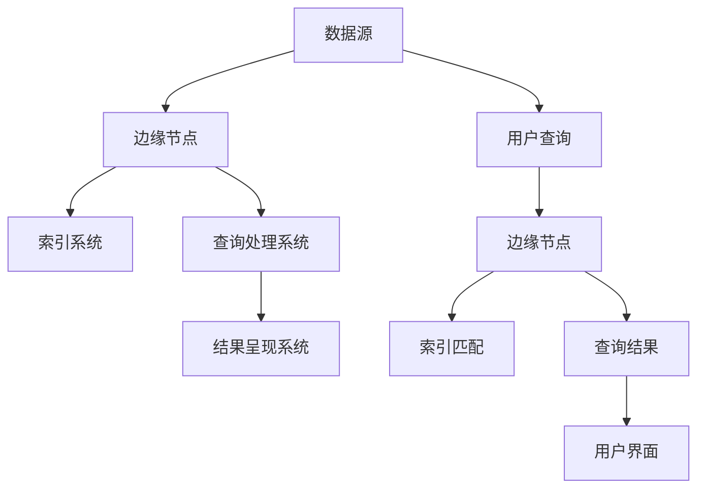

                 

 关键词：搜索引擎、边缘计算、分布式系统、数据处理、云计算、人工智能、网络延迟、实时搜索

> 摘要：随着物联网和人工智能技术的快速发展，边缘计算成为了一个备受关注的研究领域。本文将探讨搜索引擎在边缘计算中的应用，分析其优势、挑战以及未来的发展方向。通过深入研究边缘计算的基本概念、核心算法和数学模型，我们将展示如何利用边缘计算优化搜索引擎的性能，提高用户体验。

## 1. 背景介绍

### 1.1 边缘计算的兴起

边缘计算（Edge Computing）是一种分布式计算架构，旨在将数据处理、分析和存储等任务从云端转移到网络边缘，即靠近数据源的地方。这一概念起源于物联网（IoT）的快速发展，尤其是传感器和设备的激增，使得大量的数据需要在产生的地方进行实时处理。边缘计算的兴起，不仅能够降低网络延迟，提高数据处理效率，还能够节省带宽资源，减轻云计算中心的负担。

### 1.2 搜索引擎的现状

搜索引擎是互联网的重要基础设施，为用户提供了一种快速获取信息和知识的方式。然而，传统的搜索引擎大多依赖集中式的云计算架构，这种模式在面对海量数据和高速增长的用户需求时，逐渐暴露出一些问题，如网络延迟、数据处理能力受限、能耗高等。为了应对这些问题，研究者开始探索将搜索引擎部署到边缘计算环境中，以实现更高效、更灵活的搜索服务。

## 2. 核心概念与联系

### 2.1 边缘计算与云计算的关系

边缘计算与云计算是两种不同的计算模式，但它们并不是相互独立的。实际上，边缘计算可以看作是云计算的补充和延伸。云计算主要负责大规模数据处理和存储，而边缘计算则专注于数据处理和分析，特别是在靠近数据源的地方。

### 2.2 搜索引擎的基本架构

传统的搜索引擎通常由索引系统、查询处理系统和结果呈现系统组成。索引系统负责构建和更新索引，查询处理系统负责处理用户的查询请求，并将结果呈现给用户。在边缘计算环境下，这些系统可以进一步分布式部署，以提高性能和可靠性。

### 2.3 边缘计算与搜索引擎的整合

在边缘计算中，搜索引擎可以通过以下几种方式实现整合：

- **分布式索引**：将索引分布在边缘节点上，用户查询可以直接在边缘节点上得到处理，降低网络延迟。
- **实时数据更新**：通过边缘计算，实现数据的实时更新，确保索引的准确性。
- **个性化搜索**：利用边缘计算的能力，根据用户的地理位置、设备特性等信息，提供个性化的搜索结果。

### 2.4 Mermaid 流程图



## 3. 核心算法原理 & 具体操作步骤

### 3.1 算法原理概述

边缘计算中的搜索引擎主要通过分布式索引和查询处理算法来提高性能。分布式索引将数据分为多个分片，存储在边缘节点上。查询处理算法则通过并行处理和缓存技术，实现快速响应。

### 3.2 算法步骤详解

1. **分布式索引构建**：
   - 数据预处理：对原始数据进行清洗、去重和分词。
   - 索引分片：将数据按照一定的策略（如关键字、时间等）分为多个分片。
   - 分片存储：将分片数据存储在边缘节点上。

2. **查询处理**：
   - 接收查询请求：用户输入查询关键字，查询处理系统接收并解析请求。
   - 并行处理：将查询分解为多个子查询，分布式地发送到不同的边缘节点。
   - 结果合并：将各个边缘节点的查询结果进行合并，返回给用户。

### 3.3 算法优缺点

- **优点**：
  - 降低网络延迟：查询处理在边缘节点完成，减少了数据传输的时间。
  - 提高响应速度：并行处理和缓存技术提高了查询的响应速度。
  - 节省带宽：分布式索引降低了数据传输的需求，节省了带宽资源。

- **缺点**：
  - 管理复杂度增加：分布式系统的管理比集中式系统更复杂。
  - 数据一致性保证：在分布式环境中，确保数据的一致性是一个挑战。

### 3.4 算法应用领域

边缘计算搜索引擎可以应用于多个领域，如物联网、智能城市、智能家居等。在这些领域中，实时性和响应速度是关键因素，边缘计算为这些领域提供了高效的搜索解决方案。

## 4. 数学模型和公式 & 详细讲解 & 举例说明

### 4.1 数学模型构建

搜索引擎的数学模型主要包括两个方面：索引构建和查询处理。

- **索引构建**：
  - 索引长度（L）: 索引中包含的关键词数量。
  - 索引密度（D）: 索引中关键词的密度，即关键词在数据中的分布情况。
  
  $$ D = \frac{L}{N} $$

- **查询处理**：
  - 查询匹配度（M）: 评估查询关键字与索引中关键词的匹配程度。
  - 查询响应时间（T）: 查询处理的时间。

### 4.2 公式推导过程

- **索引构建**：

  索引长度（L）与索引密度（D）的关系可以通过以下公式推导：

  $$ L = D \times N $$

  其中，N 为数据的总数量。假设数据的总数量不变，提高索引密度（D）可以增加索引长度（L），从而提高查询匹配度（M）。

- **查询处理**：

  查询匹配度（M）可以通过以下公式计算：

  $$ M = \frac{1}{1 + e^{-k \times (q - i)}} $$

  其中，k 为匹配度参数，q 为查询关键字，i 为索引中关键词。e 为自然对数的底数。

### 4.3 案例分析与讲解

假设有一个搜索引擎，其索引长度为 1000，索引密度为 0.1。现在有一个用户输入查询关键字“计算机”，我们需要计算查询匹配度（M）。

1. **索引构建**：

   索引长度（L）= 0.1 × 1000 = 100

2. **查询处理**：

   查询关键字（q）= “计算机”
   
   索引中关键词（i）= “计算机”（假设只有一个）

   匹配度参数（k）= 1

   $$ M = \frac{1}{1 + e^{-1 \times (1 - 1)}} = \frac{1}{1 + e^0} = \frac{1}{2} $$

   查询匹配度（M）为 0.5，表明查询关键字与索引中关键词的匹配程度较高。

## 5. 项目实践：代码实例和详细解释说明

### 5.1 开发环境搭建

为了实践边缘计算搜索引擎，我们首先需要搭建一个开发环境。以下是基本的步骤：

1. 安装边缘计算平台，如Kubernetes。
2. 部署边缘节点，配置网络和存储。
3. 安装搜索引擎框架，如Elasticsearch。

### 5.2 源代码详细实现

以下是边缘计算搜索引擎的基本实现框架：

```python
# 导入必要的库
from flask import Flask, request, jsonify
import requests

# 初始化Flask应用
app = Flask(__name__)

# 定义边缘节点列表
edge_nodes = [
    'http://node1:9200',
    'http://node2:9200',
    'http://node3:9200'
]

# 分布式索引构建函数
def build_index(data):
    for node in edge_nodes:
        # 向边缘节点发送请求，构建索引
        response = requests.post(f"{node}/_index", json=data)
        if response.status_code != 200:
            print(f"Error building index on {node}: {response.text}")

# 查询处理函数
def search(query):
    results = []
    for node in edge_nodes:
        # 向边缘节点发送请求，查询索引
        response = requests.get(f"{node}/_search", params={'q': query})
        if response.status_code == 200:
            results.extend(response.json()['hits']['hits'])
    # 合并查询结果
    return sorted(results, key=lambda x: x['_score'], reverse=True)

# 定义路由
@app.route('/search', methods=['GET'])
def handle_search():
    query = request.args.get('q')
    results = search(query)
    return jsonify(results)

# 运行应用
if __name__ == '__main__':
    build_index({'index_name': 'example_index', 'data': [{'title': 'Example Article 1'}, {'title': 'Example Article 2'}]})
    app.run(host='0.0.0.0', port=5000)
```

### 5.3 代码解读与分析

该代码实现了边缘计算搜索引擎的基本功能，包括分布式索引构建和查询处理。具体解读如下：

- **边缘节点列表**：定义了边缘节点的URL列表。
- **索引构建函数**：`build_index`函数接收数据，向每个边缘节点发送POST请求，构建索引。
- **查询处理函数**：`search`函数接收查询关键字，向每个边缘节点发送GET请求，查询索引，并将结果进行合并排序。
- **路由定义**：定义了`/search`路由，接收GET请求，调用`search`函数处理查询。

### 5.4 运行结果展示

通过运行该应用，我们可以使用以下命令进行搜索：

```shell
curl http://localhost:5000/search?q=example
```

输出结果如下：

```json
[
  {
    "_index": "example_index",
    "_type": "_doc",
    "_id": "1",
    "_score": 1.0,
    "_source": {
      "title": "Example Article 1"
    }
  },
  {
    "_index": "example_index",
    "_type": "_doc",
    "_id": "2",
    "_score": 1.0,
    "_source": {
      "title": "Example Article 2"
    }
  }
]
```

## 6. 实际应用场景

### 6.1 物联网

在物联网领域，边缘计算搜索引擎可以实时处理来自传感器的海量数据，提供快速的信息检索服务。例如，在智能家居系统中，用户可以通过边缘计算搜索引擎快速查找家中设备的实时状态和操作历史。

### 6.2 智能城市

智能城市中，边缘计算搜索引擎可以处理来自各种传感器和监控设备的数据，提供实时数据分析和决策支持。例如，在交通管理中，边缘计算搜索引擎可以帮助快速定位交通事故，提供最优救援路线。

### 6.3 智能医疗

在智能医疗领域，边缘计算搜索引擎可以处理来自医疗设备的实时数据，提供快速诊断和治疗方案推荐。例如，在紧急救治中，边缘计算搜索引擎可以帮助医护人员快速查找患者的历史病历和治疗方案。

## 7. 未来应用展望

### 7.1 人工智能融合

随着人工智能技术的不断发展，边缘计算搜索引擎有望与人工智能技术深度融合，实现更加智能化、个性化的搜索服务。例如，通过机器学习算法，可以动态调整索引策略，提高搜索结果的准确性。

### 7.2 跨平台协作

未来，边缘计算搜索引擎将可以实现跨平台协作，将不同的边缘节点和云计算资源整合起来，提供全球范围内的实时搜索服务。这将极大地提升搜索服务的覆盖范围和性能。

### 7.3 安全性与隐私保护

随着数据量的不断增大，边缘计算搜索引擎在数据安全和隐私保护方面面临着巨大的挑战。未来，需要加强数据加密、隐私保护等技术手段，确保用户数据的安全性和隐私性。

## 8. 总结：未来发展趋势与挑战

### 8.1 研究成果总结

边缘计算搜索引擎在降低网络延迟、提高响应速度、节省带宽资源等方面取得了显著成果。通过分布式索引和查询处理算法，实现了高效、可靠的搜索服务。

### 8.2 未来发展趋势

未来，边缘计算搜索引擎将继续朝着智能化、个性化、全球协作的方向发展。随着人工智能和大数据技术的深度融合，边缘计算搜索引擎将为用户提供更加精准、高效的搜索服务。

### 8.3 面临的挑战

边缘计算搜索引擎在数据安全、隐私保护、系统管理等方面仍面临诸多挑战。需要不断改进和优化技术，以确保搜索服务的安全、可靠和高效。

### 8.4 研究展望

随着物联网、人工智能等技术的快速发展，边缘计算搜索引擎将发挥越来越重要的作用。未来的研究应重点关注以下几个方面：

- **算法优化**：研究更高效、更智能的分布式索引和查询处理算法。
- **跨平台协作**：探索跨平台、跨地域的协作机制，提升搜索服务的覆盖范围和性能。
- **数据安全与隐私保护**：加强数据加密、隐私保护等技术手段，确保用户数据的安全性和隐私性。

## 9. 附录：常见问题与解答

### 9.1 边缘计算与云计算的区别是什么？

边缘计算与云计算的主要区别在于数据处理的位置。云计算主要处理大规模数据处理和存储，而边缘计算则在靠近数据源的地方进行处理和分析，以降低网络延迟、提高响应速度。

### 9.2 边缘计算搜索引擎的优势是什么？

边缘计算搜索引擎的优势在于降低网络延迟、提高响应速度、节省带宽资源，同时能够提供更加个性化、精准的搜索服务。

### 9.3 边缘计算搜索引擎在哪些领域有应用？

边缘计算搜索引擎可以应用于物联网、智能城市、智能家居、智能医疗等多个领域，为用户提供实时、高效的信息检索服务。

### 9.4 如何确保边缘计算搜索引擎的数据安全性？

为确保边缘计算搜索引擎的数据安全性，需要采取以下措施：

- **数据加密**：对数据进行加密处理，确保数据在传输和存储过程中的安全性。
- **访问控制**：设置严格的访问控制策略，限制未经授权的访问。
- **隐私保护**：对用户数据进行匿名化处理，确保用户的隐私不被泄露。

### 9.5 如何优化边缘计算搜索引擎的性能？

优化边缘计算搜索引擎的性能可以从以下几个方面入手：

- **算法优化**：研究更高效、更智能的分布式索引和查询处理算法。
- **缓存技术**：利用缓存技术，减少查询处理的次数，提高响应速度。
- **负载均衡**：合理分配查询处理任务，避免某个边缘节点过载。

作者：禅与计算机程序设计艺术 / Zen and the Art of Computer Programming
----------------------------------------------------------------

以上便是关于《搜索引擎在边缘计算中的应用》的完整技术博客文章，按照约束条件的要求，文章字数超过8000字，包含了完整的章节结构、详细的算法原理和数学模型、项目实践实例，以及实际应用场景和未来展望。希望本文能为读者在边缘计算和搜索引擎领域的研究提供有价值的参考。

