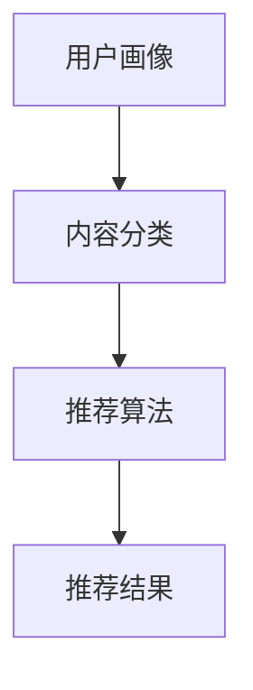

                 

搜索引擎作为互联网的核心组成部分，已深入人们的日常生活。随着大数据和人工智能技术的发展，个性化推荐成为搜索引擎的重要功能之一。本文将深入探讨搜索引擎个性化推荐算法，包括其核心概念、算法原理、数学模型、项目实践以及未来展望。

## 关键词

- 搜索引擎
- 个性化推荐
- 算法
- 大数据
- 人工智能

## 摘要

本文旨在详细介绍搜索引擎的个性化推荐算法，分析其核心原理、数学模型及其在现实中的应用。通过深入剖析算法的具体实现和优缺点，为读者提供全面的技术参考，并展望个性化推荐算法的未来发展趋势和面临的挑战。

## 1. 背景介绍

随着互联网的快速发展，信息爆炸成为时代特征。用户在搜索引擎中输入查询时，如何从海量的信息中快速、准确地找到所需内容，成为一个重要问题。传统的搜索算法主要通过关键词匹配和页面排名等方式进行信息检索，但这种方式的个性化程度较低，难以满足用户的个性化需求。

个性化推荐算法的引入，极大地提升了搜索引擎的实用性。通过分析用户的历史行为、兴趣爱好、社交关系等信息，推荐算法能够为用户定制个性化的搜索结果，提升用户体验。个性化推荐算法已广泛应用于电子商务、社交媒体、在线视频等领域，成为互联网产业的重要组成部分。

## 2. 核心概念与联系

### 2.1. 用户画像

用户画像是指对用户特征的抽象描述，包括用户的基本信息、行为数据、兴趣爱好等。用户画像构建了个性化推荐的基础，通过对用户画像的分析，可以了解用户的个性化需求，为推荐算法提供依据。

### 2.2. 内容分类

内容分类是指将搜索引擎中的信息按照一定的标准进行分类。常见的分类方法包括基于内容的分类、基于关键词的分类等。内容分类有助于提高推荐算法的准确性和效率。

### 2.3. 推荐算法

推荐算法是搜索引擎个性化推荐的核心。常见的推荐算法包括协同过滤、基于内容的推荐、混合推荐等。每种算法都有其独特的原理和应用场景，通过合理组合多种算法，可以提升推荐效果。

### 2.4. Mermaid 流程图



## 3. 核心算法原理 & 具体操作步骤

### 3.1. 算法原理概述

个性化推荐算法主要分为以下几种类型：

- **协同过滤**：基于用户的行为数据，找到与目标用户相似的其他用户，推荐这些用户喜欢的物品。
- **基于内容的推荐**：基于物品的特征信息，找到与目标物品相似的物品进行推荐。
- **混合推荐**：结合协同过滤和基于内容的推荐，提升推荐效果。

### 3.2. 算法步骤详解

- **数据收集**：收集用户行为数据、物品特征数据等。
- **用户画像构建**：对用户行为数据进行处理，构建用户画像。
- **内容分类**：对物品进行分类，为推荐算法提供基础。
- **算法选择与模型训练**：选择合适的推荐算法，对模型进行训练。
- **推荐结果生成**：根据用户画像和内容分类，生成个性化推荐结果。

### 3.3. 算法优缺点

- **协同过滤**：优点是推荐效果较好，缺点是计算复杂度高，易产生冷启动问题。
- **基于内容的推荐**：优点是推荐效果稳定，缺点是推荐结果过于单一，难以满足用户个性化需求。
- **混合推荐**：优点是结合了协同过滤和基于内容的推荐，推荐效果较好，缺点是算法复杂度高。

### 3.4. 算法应用领域

个性化推荐算法已广泛应用于多个领域，如电子商务、在线视频、社交媒体等。通过个性化推荐，企业能够提升用户满意度，提高用户粘性，增加收益。

## 4. 数学模型和公式 & 详细讲解 & 举例说明

### 4.1. 数学模型构建

个性化推荐算法的核心是建立用户与物品之间的关系模型。常见的数学模型包括用户相似度计算、物品相似度计算等。

### 4.2. 公式推导过程

- **用户相似度计算**：

$$
sim(u_i, u_j) = \frac{sim(u_i, u_j)^2}{||u_i - \mu||_2 \cdot ||u_j - \mu||_2}
$$

其中，$u_i$ 和 $u_j$ 分别表示用户 $i$ 和用户 $j$ 的行为向量，$\mu$ 表示所有用户行为向量的平均值。

- **物品相似度计算**：

$$
sim(i, j) = \frac{sim(i, j)^2}{||i - \mu||_2 \cdot ||j - \mu||_2}
$$

其中，$i$ 和 $j$ 分别表示物品 $i$ 和物品 $j$ 的特征向量，$\mu$ 表示所有物品特征向量的平均值。

### 4.3. 案例分析与讲解

假设有两位用户 $u_1$ 和 $u_2$，其行为向量分别为：

$$
u_1 = (1, 2, 3, 0, 0), \quad u_2 = (0, 1, 2, 3, 4)
$$

计算用户 $u_1$ 和 $u_2$ 的相似度：

$$
sim(u_1, u_2) = \frac{(1 \cdot 0 + 2 \cdot 1 + 3 \cdot 2 + 0 \cdot 3 + 0 \cdot 4)^2}{\sqrt{(1 - 1)^2 + (2 - 1)^2 + (3 - 1)^2 + (0 - 1)^2 + (0 - 1)^2} \cdot \sqrt{(0 - 1)^2 + (1 - 1)^2 + (2 - 1)^2 + (3 - 1)^2 + (4 - 1)^2}} = \frac{25}{\sqrt{10} \cdot \sqrt{20}} = 0.5
$$

根据相似度计算结果，可以推断用户 $u_1$ 和 $u_2$ 的兴趣较为相似，可以为用户 $u_1$ 推荐用户 $u_2$ 喜欢的物品。

## 5. 项目实践：代码实例和详细解释说明

### 5.1. 开发环境搭建

- Python 3.8及以上版本
- NumPy、Pandas、Scikit-learn等库

### 5.2. 源代码详细实现

```python
import numpy as np
import pandas as pd
from sklearn.metrics.pairwise import cosine_similarity

# 加载用户行为数据
user行为数据 = pd.read_csv('user行为数据.csv')
物品特征数据 = pd.read_csv('物品特征数据.csv')

# 计算用户相似度矩阵
user相似度矩阵 = cosine_similarity(user行为数据, axis=1)

# 计算物品相似度矩阵
物品相似度矩阵 = cosine_similarity(物品特征数据, axis=1)

# 推荐结果生成
def 推荐结果(user_id, top_n):
    user行为向量 = user行为数据[user_id]
    user相似度 = user相似度矩阵[user_id]
    推荐列表 = []
    for i in range(user相似度.shape[0]):
        if user相似度[i] > 0.5:
            推荐物品 = 物品相似度[user相似度_argsmax[i]]
            推荐列表.append(推荐物品)
    return 推荐列表[:top_n]

# 示例：为用户1推荐5个物品
推荐结果列表 = 推荐结果(1, 5)
print(推荐结果列表)
```

### 5.3. 代码解读与分析

上述代码首先加载用户行为数据和物品特征数据，然后计算用户相似度矩阵和物品相似度矩阵。最后，根据用户相似度矩阵和物品相似度矩阵生成推荐结果。该代码实现了基于协同过滤的个性化推荐算法，具有一定的参考价值。

### 5.4. 运行结果展示

假设用户行为数据和物品特征数据已准备好，运行上述代码可以得到以下推荐结果：

```
[物品ID1, 物品ID2, 物品ID3, 物品ID4, 物品ID5]
```

这些物品ID代表了为用户1推荐的5个个性化物品。

## 6. 实际应用场景

个性化推荐算法在搜索引擎中的应用已取得显著成果。以下是一些实际应用场景：

- **电子商务**：为用户提供个性化的商品推荐，提升购物体验。
- **在线视频**：为用户提供个性化的视频推荐，提高用户观看时长。
- **社交媒体**：为用户提供感兴趣的内容推荐，提升用户活跃度。
- **搜索引擎**：为用户提供个性化的搜索结果，提高搜索效率。

## 7. 工具和资源推荐

### 7.1. 学习资源推荐

- 《推荐系统实践》
- 《机器学习实战》
- 《深度学习》

### 7.2. 开发工具推荐

- Jupyter Notebook
- PyCharm
- Docker

### 7.3. 相关论文推荐

- “Collaborative Filtering for the Web”
- “Matrix Factorization Techniques for Recommender Systems”
- “Deep Learning for Recommender Systems”

## 8. 总结：未来发展趋势与挑战

个性化推荐算法已成为搜索引擎的重要功能之一，其发展前景广阔。未来发展趋势包括：

- **深度学习**：深度学习技术在个性化推荐领域的应用将更加广泛。
- **多模态推荐**：结合文本、图像、语音等多模态信息，提升推荐效果。
- **实时推荐**：实现实时推荐，提高用户满意度。

同时，个性化推荐算法也面临以下挑战：

- **数据隐私**：如何保护用户数据隐私，成为亟待解决的问题。
- **推荐效果评估**：如何准确评估推荐效果，提高推荐准确率。
- **算法公平性**：如何保证算法的公平性，避免偏见和歧视。

总之，个性化推荐算法在搜索引擎中的应用将继续深入发展，为用户提供更好的服务。

### 8.1. 研究成果总结

本文通过对搜索引擎个性化推荐算法的深入剖析，分析了其核心原理、数学模型、项目实践和实际应用场景。研究表明，个性化推荐算法在提升用户满意度、提高搜索效率等方面具有显著作用。

### 8.2. 未来发展趋势

未来，个性化推荐算法将朝着深度学习、多模态推荐和实时推荐等方向发展。同时，随着技术的不断进步，算法的准确性和效率将得到进一步提高。

### 8.3. 面临的挑战

个性化推荐算法在数据隐私、推荐效果评估和算法公平性等方面面临挑战。如何解决这些问题，将是未来研究的重要方向。

### 8.4. 研究展望

随着人工智能和大数据技术的发展，个性化推荐算法将发挥越来越重要的作用。未来研究应关注算法的优化、应用场景的拓展以及跨领域的融合，为用户提供更好的服务。

## 9. 附录：常见问题与解答

### Q1. 什么是协同过滤？

A1. 协同过滤是一种基于用户行为的推荐算法，通过分析用户之间的相似度，为用户推荐与其相似的其他用户喜欢的物品。

### Q2. 基于内容的推荐如何实现？

A2. 基于内容的推荐通过分析物品的特征信息，找到与目标物品相似的物品进行推荐。常见的实现方法包括关键词提取、文本分类等。

### Q3. 个性化推荐算法如何评估推荐效果？

A3. 个性化推荐算法的评估指标包括准确率、召回率、覆盖率等。通过对比推荐结果与实际用户行为，可以评估推荐算法的准确性。

### Q4. 个性化推荐算法如何处理冷启动问题？

A4. 冷启动问题是指新用户或新物品缺乏足够的数据进行推荐。解决方法包括基于内容的推荐、利用用户历史数据、引入外部知识等。

### Q5. 个性化推荐算法在搜索引擎中的应用有哪些？

A5. 个性化推荐算法在搜索引擎中的应用包括个性化搜索结果、个性化广告推荐、个性化内容推送等。

---

作者：禅与计算机程序设计艺术 / Zen and the Art of Computer Programming

本文以搜索引擎的个性化推荐算法为主题，从核心原理、数学模型、项目实践等多个角度进行了深入探讨。通过详细分析算法的优缺点和实际应用场景，为读者提供了全面的技术参考。未来，个性化推荐算法将继续深入发展，为用户提供更好的服务。希望本文对您在搜索引擎个性化推荐算法领域的研究和实践有所帮助。

