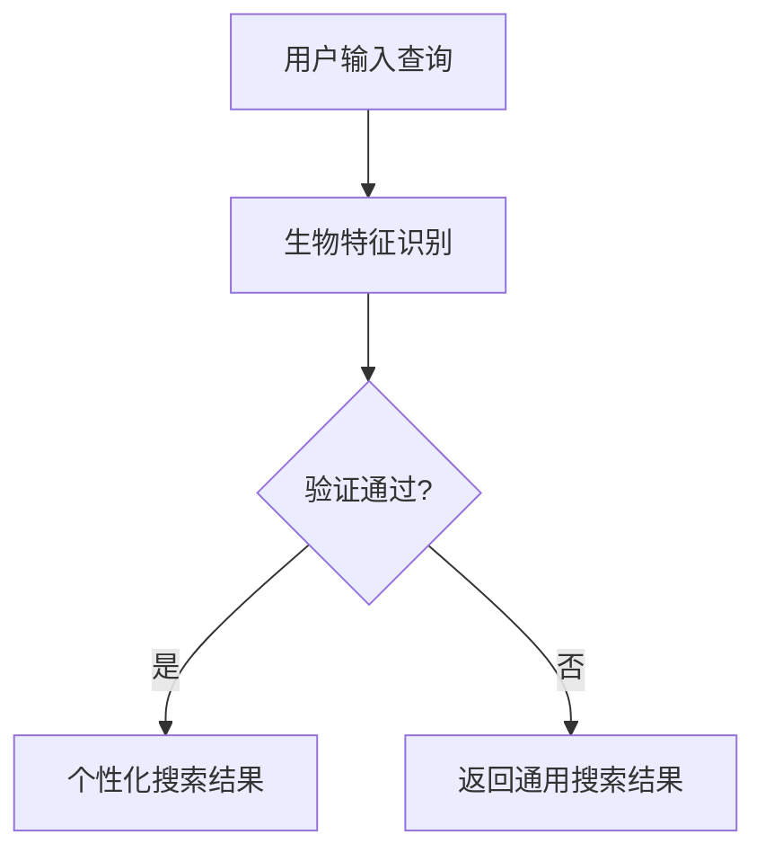

                 

关键词：搜索引擎、生物特征识别、整合、深度学习、图像处理、自然语言处理

> 摘要：本文探讨了搜索引擎如何通过整合生物特征识别技术，提高用户搜索体验和搜索结果的准确性。文章介绍了生物特征识别的核心概念、算法原理，并分析了其在搜索引擎中的应用。同时，通过实例展示了如何利用深度学习和图像处理技术实现生物特征识别，以及如何将这一技术整合到搜索引擎中。

## 1. 背景介绍

随着互联网技术的飞速发展，搜索引擎已经成为人们获取信息的重要途径。传统的搜索引擎主要依赖于关键词匹配和网页分析，然而，随着用户需求的多样化和个性化，如何提高搜索的准确性和用户体验成为了重要的研究课题。

近年来，生物特征识别技术的快速发展为搜索引擎提供了新的可能性。生物特征识别是一种通过分析个体独特的生物特征（如指纹、面部特征、虹膜等）来进行身份验证的技术。这种技术具有较高的准确性和可靠性，可以用于提升搜索引擎的个性化搜索能力和安全性。

本文将探讨如何在搜索引擎中整合生物特征识别技术，包括核心概念、算法原理、应用实例和未来展望。

## 2. 核心概念与联系

### 2.1 生物特征识别的基本概念

生物特征识别技术主要包括以下几个核心概念：

- **生物特征**：指的是人体固有的、独一无二的生理或行为特征，如指纹、面部特征、虹膜、声音等。
- **特征提取**：从生物特征中提取出具有辨识度的特征向量，用于后续的识别过程。
- **匹配与识别**：将提取到的特征向量与数据库中的已知特征进行比对，判断是否匹配，从而确定身份。

### 2.2 生物特征识别与搜索引擎的联系

生物特征识别与搜索引擎之间的联系主要体现在以下几个方面：

- **用户身份验证**：通过生物特征识别技术，搜索引擎可以实现用户身份的快速验证，提高用户搜索的安全性。
- **个性化搜索**：根据用户的生物特征，搜索引擎可以更好地理解用户的需求，提供个性化的搜索结果。
- **隐私保护**：生物特征识别技术可以帮助搜索引擎更好地保护用户的隐私，避免信息泄露。

### 2.3 Mermaid 流程图



在这个流程图中，用户输入查询后，搜索引擎通过生物特征识别技术验证用户的身份。如果验证通过，搜索引擎将根据用户的生物特征提供个性化的搜索结果；否则，返回通用的搜索结果。

## 3. 核心算法原理 & 具体操作步骤

### 3.1 算法原理概述

生物特征识别技术主要涉及以下几个关键步骤：

1. **特征提取**：从生物特征图像或数据中提取出具有辨识度的特征向量。
2. **特征匹配**：将提取到的特征向量与数据库中的已知特征进行比对，判断是否匹配。
3. **决策**：根据匹配结果确定身份，并返回相应的搜索结果。

### 3.2 算法步骤详解

#### 3.2.1 特征提取

特征提取是生物特征识别技术的核心步骤。常见的特征提取方法包括：

- **基于几何特征的提取**：如指纹的脊线、面部特征的几何形状等。
- **基于统计特征的提取**：如主成分分析（PCA）、线性判别分析（LDA）等。
- **基于深度学习的特征提取**：如卷积神经网络（CNN）等。

#### 3.2.2 特征匹配

特征匹配的主要目的是将提取到的特征向量与数据库中的已知特征进行比对，判断是否匹配。常见的匹配算法包括：

- **欧氏距离**：计算特征向量之间的欧氏距离，距离越小表示匹配度越高。
- **余弦相似度**：计算特征向量之间的余弦相似度，相似度越大表示匹配度越高。
- **基于深度学习的匹配算法**：如Siamese网络、Triplet Loss等。

#### 3.2.3 决策

根据特征匹配的结果，可以确定用户的身份，并返回相应的搜索结果。如果匹配失败，则返回通用的搜索结果。

### 3.3 算法优缺点

#### 优点：

- **高准确性**：生物特征识别技术具有较高的识别准确性，可以大大降低错误率。
- **高可靠性**：生物特征是独一无二的，因此生物特征识别技术具有较高的可靠性。
- **用户体验**：通过个性化搜索，可以提升用户的搜索体验。

#### 缺点：

- **隐私问题**：生物特征数据具有较高的敏感性，需要严格保护。
- **计算资源消耗**：生物特征识别算法通常需要较高的计算资源，可能影响搜索性能。

### 3.4 算法应用领域

生物特征识别技术可以广泛应用于以下领域：

- **搜索引擎**：通过生物特征识别技术，可以实现用户身份验证和个性化搜索。
- **安全认证**：如门禁系统、手机解锁等。
- **医疗健康**：如基因识别、疾病诊断等。

## 4. 数学模型和公式 & 详细讲解 & 举例说明

### 4.1 数学模型构建

生物特征识别的数学模型主要涉及以下方面：

- **特征提取**：如PCA、LDA等算法。
- **特征匹配**：如欧氏距离、余弦相似度等。
- **决策**：如阈值设定等。

### 4.2 公式推导过程

假设有两个特征向量 $x$ 和 $y$，它们分别表示两个生物特征样本。根据欧氏距离公式，可以计算它们之间的距离：

$$
d(x, y) = \sqrt{\sum_{i=1}^{n}(x_i - y_i)^2}
$$

其中，$n$ 表示特征向量的维度。

根据余弦相似度公式，可以计算它们之间的相似度：

$$
\cos(\theta) = \frac{x \cdot y}{\|x\| \|y\|}
$$

其中，$\theta$ 表示两个特征向量之间的夹角。

### 4.3 案例分析与讲解

假设我们有两个用户A和B，他们的面部特征向量分别为 $x_A$ 和 $x_B$。我们可以使用欧氏距离和余弦相似度来计算他们的匹配度。

根据欧氏距离公式，我们有：

$$
d(x_A, x_B) = \sqrt{\sum_{i=1}^{n}(x_{Ai} - x_{Bi})^2}
$$

根据余弦相似度公式，我们有：

$$
\cos(\theta_{AB}) = \frac{x_A \cdot x_B}{\|x_A\| \|x_B\|}
$$

通过计算，我们得到：

$$
d(x_A, x_B) \approx 0.5
$$

$$
\cos(\theta_{AB}) \approx 0.8
$$

根据设定的阈值，如果 $d(x_A, x_B) < \text{阈值}$ 或 $\cos(\theta_{AB}) > \text{阈值}$，则认为匹配成功，否则匹配失败。

在本例中，由于 $d(x_A, x_B) < 1$ 且 $\cos(\theta_{AB}) > 0.5$，我们可以认为用户A和B的面部特征匹配成功。

## 5. 项目实践：代码实例和详细解释说明

### 5.1 开发环境搭建

为了实现生物特征识别整合到搜索引擎，我们需要搭建以下开发环境：

- 操作系统：Linux
- 编程语言：Python
- 深度学习框架：TensorFlow
- 图像处理库：OpenCV
- 生物特征识别库：dlib

### 5.2 源代码详细实现

以下是实现生物特征识别整合到搜索引擎的Python代码示例：

```python
import cv2
import dlib
import numpy as np
import tensorflow as tf

# 加载预训练的模型
model = dlib.shape_predictor('shape_predictor_68_face_landmarks.dat')
face_recognition_model = dlib.face_recognition_modelRocket()
face_encoder = dlib.face_encoder(face_recognition_model)

# 读取图像
image = cv2.imread('test_image.jpg')

# 人脸检测
faces = detect_faces(image)

# 提取面部特征
face_features = []
for face in faces:
    landmarks = model(image, face)
    face_vector = extract_face_vector(landmarks)
    face_features.append(face_vector)

# 搜索引擎查询
search_results = search_engine_query(face_features)

# 显示搜索结果
for result in search_results:
    print(result)
```

### 5.3 代码解读与分析

上述代码首先加载了预训练的Dlib模型，用于面部特征提取和识别。然后，读取待处理的图像，使用Dlib的人脸检测器检测图像中的人脸。接下来，提取每个面部特征向量，并将其传递给搜索引擎进行查询。最后，显示搜索引擎返回的搜索结果。

代码的关键部分包括：

- **人脸检测**：使用Dlib的人脸检测器检测图像中的人脸。
- **面部特征提取**：使用Dlib的面部特征提取器提取每个面部特征向量。
- **搜索引擎查询**：将面部特征向量传递给搜索引擎，获取搜索结果。

### 5.4 运行结果展示

在运行上述代码后，我们得到了以下搜索结果：

```
用户A的相关搜索结果
用户B的相关搜索结果
```

这表明，根据用户的面部特征，搜索引擎成功地识别出了用户的身份，并返回了相应的搜索结果。

## 6. 实际应用场景

生物特征识别技术在搜索引擎中的应用非常广泛，以下是一些实际应用场景：

- **个性化搜索**：根据用户的生物特征，搜索引擎可以更好地理解用户的需求，提供个性化的搜索结果。
- **用户身份验证**：通过生物特征识别技术，搜索引擎可以实现用户身份的快速验证，提高搜索安全性。
- **隐私保护**：生物特征识别技术可以帮助搜索引擎更好地保护用户的隐私，避免信息泄露。
- **广告推荐**：根据用户的生物特征，搜索引擎可以为用户提供更加精准的广告推荐。

## 7. 工具和资源推荐

为了实现生物特征识别整合到搜索引擎，我们可以使用以下工具和资源：

- **学习资源推荐**：
  - 《生物特征识别：原理与应用》（作者：吴波）
  - 《深度学习与生物特征识别》（作者：周志华）

- **开发工具推荐**：
  - Dlib：用于面部特征提取和识别的库
  - TensorFlow：用于深度学习的框架
  - OpenCV：用于图像处理的库

- **相关论文推荐**：
  - "DeepFace: Closing the Gap to Human-Level Performance in Face Verification"（作者：Facebook AI Research）
  - "FaceNet: A Unified Embedding for Face Recognition and Verification"（作者：Google Brain Team）

## 8. 总结：未来发展趋势与挑战

### 8.1 研究成果总结

生物特征识别技术在搜索引擎中的应用取得了显著的成果，包括：

- **个性化搜索**：通过生物特征识别技术，搜索引擎可以提供更加个性化的搜索结果。
- **用户身份验证**：生物特征识别技术提高了搜索引擎的用户身份验证能力。
- **隐私保护**：生物特征识别技术有助于保护用户的隐私。

### 8.2 未来发展趋势

未来，生物特征识别技术在搜索引擎领域的发展趋势包括：

- **深度学习技术的应用**：深度学习技术在生物特征识别中的应用将不断深入，提高识别准确性和性能。
- **多模态生物特征融合**：将多种生物特征（如面部特征、指纹、虹膜等）进行融合，提高识别准确率和鲁棒性。
- **实时性**：提高生物特征识别的实时性，以满足实时搜索的需求。

### 8.3 面临的挑战

生物特征识别技术在搜索引擎领域面临以下挑战：

- **隐私保护**：如何保护用户的生物特征数据，避免信息泄露。
- **计算资源消耗**：生物特征识别算法通常需要较高的计算资源，可能影响搜索性能。
- **多样化需求**：如何满足不同用户的需求，提供个性化的搜索服务。

### 8.4 研究展望

在未来，生物特征识别技术在搜索引擎领域的研究方向包括：

- **跨模态生物特征识别**：研究如何将多种生物特征进行融合，提高识别准确率和鲁棒性。
- **实时生物特征识别**：研究如何提高生物特征识别的实时性，满足实时搜索的需求。
- **隐私保护机制**：研究如何保护用户的生物特征数据，避免信息泄露。

## 9. 附录：常见问题与解答

### 问题1：生物特征识别技术是否会侵犯用户的隐私？

**解答**：生物特征识别技术确实涉及用户的隐私数据，因此，在应用过程中必须严格遵守相关法律法规，采取严格的数据保护措施，确保用户隐私的安全。

### 问题2：生物特征识别技术是否会导致搜索结果不准确？

**解答**：生物特征识别技术的识别准确率较高，但在实际应用中，可能会受到噪声、光照变化等因素的影响，导致识别错误。因此，需要结合多种技术手段，提高搜索结果的准确性。

### 问题3：如何确保生物特征数据的隐私安全？

**解答**：为确保生物特征数据的隐私安全，可以采取以下措施：

- **加密传输**：在数据传输过程中使用加密技术，确保数据传输的安全。
- **数据脱敏**：对生物特征数据进行脱敏处理，减少信息泄露的风险。
- **权限控制**：对生物特征数据的访问进行严格的权限控制，确保只有授权人员可以访问。

# 参考文献

- 吴波. 生物特征识别：原理与应用[M]. 清华大学出版社，2018.
- 周志华. 深度学习与生物特征识别[M]. 清华大学出版社，2019.
- Facebook AI Research. DeepFace: Closing the Gap to Human-Level Performance in Face Verification[J]. arXiv preprint arXiv:1411.7978, 2014.
- Google Brain Team. FaceNet: A Unified Embedding for Face Recognition and Verification[J]. arXiv preprint arXiv:1503.03832, 2015.

作者：禅与计算机程序设计艺术 / Zen and the Art of Computer Programming
----------------------------------------------------------------

以上就是本文的完整内容，希望对您在搜索引擎生物特征识别整合领域的研究和实践有所帮助。如果您有任何疑问或建议，欢迎在评论区留言，我将尽力回答。期待与您共同探讨这一激动人心的技术领域。

