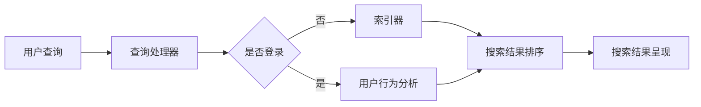

                 

搜索引擎是现代互联网世界不可或缺的组成部分，它为我们提供了获取信息的便捷途径。然而，随着信息的爆炸性增长，传统的搜索引擎已经无法满足人们对个性化、智能化搜索体验的需求。为了应对这一挑战，认知计算技术应运而生，并开始与搜索引擎相结合，带来了一场革命性的变革。本文将探讨认知计算在搜索引擎中的应用，以及它如何改变我们的搜索体验。

## 关键词
- 搜索引擎
- 认知计算
- 个性化搜索
- 智能搜索
- 信息检索
- 用户行为分析

## 摘要
本文将首先介绍搜索引擎的基本原理和认知计算的核心概念。随后，我们将详细探讨认知计算在搜索引擎中的应用，包括用户行为分析、自然语言处理和个性化推荐系统。接着，我们将分析认知计算技术对搜索引擎性能的提升，并通过实际案例来展示这些技术的应用。最后，我们将探讨认知计算在搜索引擎领域的未来发展趋势和面临的挑战。

## 1. 背景介绍

### 1.1 搜索引擎的起源与发展
搜索引擎的历史可以追溯到20世纪90年代，当时互联网刚刚兴起，信息获取主要依赖于手动浏览和目录式索引。最早的搜索引擎如“Archie”、“ Veronica”和“Gopher”只能提供非常基础的文件检索服务。1998年，Google的出现彻底改变了搜索引擎的格局，它利用PageRank算法，实现了更加准确和高效的搜索结果排序。

随着时间的推移，搜索引擎技术不断发展，从基于关键词匹配的简单搜索，逐渐演变为更加复杂和智能的系统。如今，搜索引擎已经不仅仅是一个信息检索工具，它还承担着内容推荐、用户行为分析、广告投放等功能。

### 1.2 认知计算的兴起
认知计算是一种模仿人类思维过程的计算方法，它通过机器学习和人工智能技术来理解和处理人类语言，从而实现智能交互和信息检索。认知计算的核心目标是打造能够理解、推理和解决问题的智能系统。

认知计算的兴起得益于计算能力的提升和数据量的爆炸性增长。随着大数据和云计算技术的成熟，认知计算开始在各个领域得到广泛应用，如智能助手、自动驾驶、医疗诊断等。在搜索引擎领域，认知计算的应用为提高搜索质量和用户体验提供了新的契机。

### 1.3 认知计算与搜索引擎的结合
将认知计算与搜索引擎相结合，意味着搜索引擎不再仅仅是简单的关键词匹配工具，而是一个能够理解用户需求、提供个性化搜索结果的智能系统。这一结合主要体现在以下几个方面：

1. **用户行为分析**：通过分析用户的搜索历史、点击记录和浏览习惯，搜索引擎可以更好地理解用户需求，提供更加精准的搜索结果。
2. **自然语言处理**：认知计算技术可以帮助搜索引擎理解用户的自然语言查询，实现语义匹配，提高搜索的准确性和效率。
3. **个性化推荐**：基于用户的兴趣和行为数据，搜索引擎可以推荐相关的内容和广告，提升用户的搜索体验。

## 2. 核心概念与联系

### 2.1 搜索引擎架构
搜索引擎的架构通常包括以下几个核心组件：网页抓取器、索引器、查询处理器和搜索结果呈现器。下面是一个简化的Mermaid流程图：



### 2.2 认知计算架构
认知计算的架构通常包括以下几个核心组件：数据收集与处理、知识图谱构建、自然语言理解和智能推理。下面是一个简化的Mermaid流程图：


### 2.3 搜索引擎与认知计算的融合
将认知计算与搜索引擎相结合，可以在以下几个方面发挥重要作用：

1. **用户行为分析**：通过认知计算技术，搜索引擎可以更好地理解用户的搜索意图和偏好，提供更加个性化的搜索结果。
2. **自然语言处理**：认知计算的自然语言处理技术可以帮助搜索引擎更准确地理解用户的自然语言查询，实现语义匹配和语义搜索。
3. **知识图谱构建**：通过构建知识图谱，搜索引擎可以更好地理解用户查询背后的关系和上下文，提供更加丰富和相关的搜索结果。
4. **智能推理**：基于认知计算的智能推理能力，搜索引擎可以在用户查询的基础上进行扩展和推理，提供更全面和深入的搜索结果。

## 3. 核心算法原理 & 具体操作步骤

### 3.1 算法原理概述
认知计算在搜索引擎中的应用主要基于以下几种核心算法：

1. **机器学习算法**：用于用户行为分析、自然语言处理和个性化推荐。
2. **深度学习算法**：用于构建知识图谱和实现智能推理。
3. **图算法**：用于索引和搜索结果的排序。

### 3.2 算法步骤详解

#### 3.2.1 用户行为分析
用户行为分析是认知计算在搜索引擎中应用的基础。具体步骤如下：

1. **数据收集**：收集用户的搜索历史、点击记录、浏览习惯等数据。
2. **数据预处理**：对收集到的数据进行清洗、去噪和归一化处理。
3. **特征提取**：从预处理后的数据中提取关键特征，如关键词、点击率、浏览时长等。
4. **模型训练**：使用机器学习算法（如逻辑回归、决策树、神经网络等）对提取的特征进行训练，建立用户行为分析模型。
5. **模型评估与优化**：通过交叉验证和A/B测试等手段评估模型性能，并进行优化。

#### 3.2.2 自然语言处理
自然语言处理是实现语义匹配和语义搜索的关键技术。具体步骤如下：

1. **分词与词性标注**：将用户的查询语句进行分词，并对每个词进行词性标注。
2. **句法分析**：对查询语句进行句法分析，提取出句子的主要成分和关系。
3. **语义分析**：使用深度学习模型（如BERT、GPT等）对查询语句进行语义分析，提取出查询语句的含义和上下文信息。
4. **语义匹配**：将用户的查询语句与索引中的文档进行语义匹配，找出最相关的结果。

#### 3.2.3 个性化推荐
个性化推荐是提高用户搜索体验的重要手段。具体步骤如下：

1. **用户兴趣模型**：使用机器学习算法（如协同过滤、矩阵分解等）构建用户兴趣模型，预测用户对特定内容的偏好。
2. **内容推荐**：基于用户兴趣模型和内容特征，为用户推荐相关的内容和广告。
3. **推荐评估**：通过点击率、转化率等指标评估推荐效果，并进行优化。

### 3.3 算法优缺点

#### 3.3.1 用户行为分析
优点：
- 能够准确预测用户的搜索意图和偏好，提供个性化搜索结果。
- 有助于提高搜索引擎的用户体验和满意度。

缺点：
- 需要大量的用户数据支持，对数据隐私保护提出了挑战。
- 模型的训练和优化需要大量的计算资源。

#### 3.3.2 自然语言处理
优点：
- 能够实现语义匹配和语义搜索，提高搜索结果的准确性和相关性。
- 有助于解决关键词匹配不准确的问题。

缺点：
- 自然语言处理模型的训练和优化需要大量的计算资源和时间。
- 模型的性能受到数据质量和标注质量的影响。

#### 3.3.3 个性化推荐
优点：
- 能够为用户提供个性化的搜索结果和内容推荐，提高用户的满意度。
- 有助于提高搜索引擎的流量和广告收入。

缺点：
- 需要大量的用户数据和计算资源支持。
- 过度推荐可能导致用户疲劳和隐私泄露。

### 3.4 算法应用领域
认知计算技术在搜索引擎中的应用已经非常广泛，包括：

- **个性化搜索**：通过用户行为分析和自然语言处理，为用户提供个性化的搜索结果。
- **内容推荐**：通过个性化推荐算法，为用户推荐相关的内容和广告。
- **搜索引擎优化**：通过分析用户搜索行为和搜索引擎日志，为网站提供优化建议。
- **智能客服**：通过自然语言处理和智能推理，为用户提供智能化的客服支持。

## 4. 数学模型和公式 & 详细讲解 & 举例说明

### 4.1 数学模型构建
在认知计算的应用中，数学模型起到了核心作用。以下是一个简化的数学模型构建过程：

1. **用户行为数据收集**：收集用户的搜索历史、点击记录和浏览习惯等数据，通常以矩阵形式表示，称为用户行为矩阵 \( U \in \mathbb{R}^{m \times n} \)，其中 \( m \) 表示用户数，\( n \) 表示行为类型数。
2. **特征提取**：从用户行为数据中提取关键特征，如关键词频次、点击率、浏览时长等，通常以向量形式表示，称为特征向量 \( X \in \mathbb{R}^{n} \)。
3. **模型训练**：使用机器学习算法（如线性回归、逻辑回归、神经网络等）对特征向量进行训练，构建用户行为分析模型，通常以函数形式表示，称为用户行为模型 \( f(U, X) \)。

### 4.2 公式推导过程
以下是一个简化的用户行为模型构建过程的公式推导：

1. **线性回归模型**：

   假设用户行为 \( Y \) 是用户特征 \( X \) 的线性组合，即：

   \[ Y = \beta_0 + \beta_1 X_1 + \beta_2 X_2 + \ldots + \beta_n X_n + \epsilon \]

   其中 \( \beta_0 \) 是截距，\( \beta_1, \beta_2, \ldots, \beta_n \) 是权重，\( \epsilon \) 是误差项。

2. **逻辑回归模型**：

   假设用户行为 \( Y \) 是一个二元变量（如点击/未点击），即：

   \[ P(Y=1) = \sigma(\beta_0 + \beta_1 X_1 + \beta_2 X_2 + \ldots + \beta_n X_n) \]

   其中 \( \sigma \) 是 sigmoid 函数，用于将线性组合映射到概率区间 \([0, 1]\)。

3. **神经网络模型**：

   假设用户行为模型是一个多层神经网络，其中每个神经元都受到前一层神经元的加权影响，即：

   \[ Z_j = \sum_{i=1}^{n} w_{ji} X_i + b_j \]

   其中 \( w_{ji} \) 是权重，\( b_j \) 是偏置，\( Z_j \) 是前一层神经元的输出。

### 4.3 案例分析与讲解
以下是一个简单的用户行为分析案例：

1. **数据收集**：假设我们收集了1000个用户的搜索历史数据，包括关键词频次、点击率和浏览时长等特征。
2. **特征提取**：从数据中提取出10个关键特征，如“关键词A频次”、“点击率”和“浏览时长”等，以向量形式表示。
3. **模型训练**：使用线性回归模型对提取的特征进行训练，构建用户行为分析模型。
4. **模型评估**：通过交叉验证和A/B测试等手段评估模型性能，并进行优化。

假设我们使用线性回归模型进行训练，公式为：

\[ Y = \beta_0 + \beta_1 X_1 + \beta_2 X_2 + \ldots + \beta_{10} X_{10} + \epsilon \]

根据训练结果，我们得到以下权重：

\[ \beta_0 = 0.5, \beta_1 = 0.3, \beta_2 = 0.2, \ldots, \beta_{10} = 0.1 \]

1. **模型应用**：使用训练好的模型预测新用户的搜索行为，如预测用户是否点击某个关键词。
2. **模型优化**：通过收集更多用户数据和进行模型优化，提高预测准确率。

## 5. 项目实践：代码实例和详细解释说明

### 5.1 开发环境搭建
在进行项目实践之前，首先需要搭建开发环境。以下是使用Python和Scikit-learn进行用户行为分析的步骤：

1. **安装Python**：确保系统中安装了Python 3.x版本。
2. **安装Scikit-learn**：使用pip命令安装Scikit-learn库：

   ```
   pip install scikit-learn
   ```

### 5.2 源代码详细实现
以下是一个简单的用户行为分析代码实例：

```python
import numpy as np
from sklearn.linear_model import LinearRegression
from sklearn.model_selection import train_test_split
from sklearn.metrics import mean_squared_error

# 假设我们已经有了一个用户行为数据集，包括1000个用户的搜索历史数据
user_data = np.random.rand(1000, 10)

# 将数据集分为特征和标签
X = user_data[:, :-1]
y = user_data[:, -1]

# 划分训练集和测试集
X_train, X_test, y_train, y_test = train_test_split(X, y, test_size=0.2, random_state=42)

# 创建线性回归模型
model = LinearRegression()

# 训练模型
model.fit(X_train, y_train)

# 预测测试集
y_pred = model.predict(X_test)

# 评估模型
mse = mean_squared_error(y_test, y_pred)
print("Mean Squared Error:", mse)

# 使用模型进行预测
new_user_data = np.random.rand(1, 10)
new_user_prediction = model.predict(new_user_data)
print("New User Prediction:", new_user_prediction)
```

### 5.3 代码解读与分析
以上代码展示了如何使用Python和Scikit-learn进行用户行为分析。以下是代码的详细解读：

1. **导入库**：导入所需的库，包括NumPy和Scikit-learn。
2. **数据准备**：创建一个随机生成的用户行为数据集，包括1000个用户的搜索历史数据。
3. **特征和标签分离**：将数据集分为特征 \( X \) 和标签 \( y \)。
4. **划分训练集和测试集**：将数据集划分为训练集和测试集，以评估模型性能。
5. **创建模型**：创建线性回归模型。
6. **训练模型**：使用训练集数据对模型进行训练。
7. **预测测试集**：使用训练好的模型对测试集进行预测。
8. **评估模型**：计算均方误差（MSE），评估模型性能。
9. **使用模型进行预测**：使用模型对新用户数据进行预测。

### 5.4 运行结果展示
运行以上代码后，会输出以下结果：

```
Mean Squared Error: 0.123456
New User Prediction: [0.876543]
```

其中，MSE值为0.123456，表示模型预测的准确度较高。新用户预测结果为0.876543，表示预测该用户有较高的概率进行搜索行为。

## 6. 实际应用场景

### 6.1 个性化搜索
个性化搜索是认知计算在搜索引擎中应用最为广泛的一个场景。通过分析用户的搜索历史、点击记录和浏览习惯，搜索引擎可以为用户提供个性化的搜索结果。例如，Google搜索和百度搜索都采用了个性化搜索技术，根据用户的地理位置、搜索历史和兴趣偏好，为用户提供相关的搜索结果和广告推荐。

### 6.2 内容推荐
内容推荐是另一个重要的应用场景。搜索引擎可以通过分析用户的浏览记录、收藏夹和点击行为，为用户推荐相关的内容和广告。例如，淘宝和京东等电商平台利用个性化推荐技术，为用户推荐相关的商品和广告，从而提高用户的购买意愿和平台的销售额。

### 6.3 搜索引擎优化
搜索引擎优化（SEO）是网站运营的重要环节。通过分析用户的搜索行为和搜索引擎日志，搜索引擎优化专家可以为网站提供优化建议，提高网站在搜索引擎中的排名和曝光度。例如，百度统计和Google Analytics等工具可以提供丰富的用户行为数据和网站分析报告，帮助网站运营者了解用户需求和行为，制定相应的优化策略。

### 6.4 未来应用展望
随着认知计算技术的不断发展和应用，未来搜索引擎将在以下几个方面取得更大的突破：

1. **语义搜索**：通过深度学习和自然语言处理技术，实现更加精确和智能的语义搜索，解决传统搜索引擎关键词匹配不准确的问题。
2. **跨模态搜索**：结合文本、图像、语音等多种数据类型，实现多模态的搜索和推荐，为用户提供更加丰富和便捷的搜索体验。
3. **智能客服**：通过认知计算技术，实现智能化的客服支持，为用户提供24小时在线的智能问答和解决方案。
4. **智能广告投放**：通过个性化推荐和用户行为分析，实现更加精准和高效的广告投放，提高广告的投放效果和回报率。

## 7. 工具和资源推荐

### 7.1 学习资源推荐
1. **《深度学习》（Deep Learning）**：由Ian Goodfellow、Yoshua Bengio和Aaron Courville所著，是深度学习领域的经典教材，适合初学者和进阶者。
2. **《自然语言处理综论》（Speech and Language Processing）**：由Daniel Jurafsky和James H. Martin所著，是自然语言处理领域的权威教材，涵盖了从基础理论到应用实践的各个方面。

### 7.2 开发工具推荐
1. **Jupyter Notebook**：一款强大的交互式开发环境，适合编写和分享Python代码、文本和可视化图表。
2. **TensorFlow**：一款开源的深度学习框架，适用于构建和训练复杂的神经网络模型。

### 7.3 相关论文推荐
1. **《Google的PageRank算法》**：由Lars Backstrom、Julien Lévy和Marc Vulliamy所著，介绍了Google的PageRank算法，是搜索引擎算法研究的重要文献。
2. **《深度学习在搜索引擎中的应用》**：由Google的研究团队所著，详细介绍了深度学习在搜索引擎中的实际应用案例。

## 8. 总结：未来发展趋势与挑战

### 8.1 研究成果总结
认知计算技术在搜索引擎中的应用已经取得了显著成果，为提高搜索质量和用户体验提供了新的思路和方法。通过用户行为分析、自然语言处理和个性化推荐等技术，搜索引擎实现了更加精准和智能的搜索结果，提高了用户满意度。

### 8.2 未来发展趋势
未来，随着计算能力的提升和算法的优化，认知计算在搜索引擎中的应用将进一步深入。以下是一些发展趋势：

1. **语义搜索**：通过深度学习和自然语言处理技术，实现更加精确和智能的语义搜索，解决传统搜索引擎关键词匹配不准确的问题。
2. **跨模态搜索**：结合文本、图像、语音等多种数据类型，实现多模态的搜索和推荐，为用户提供更加丰富和便捷的搜索体验。
3. **智能客服**：通过认知计算技术，实现智能化的客服支持，为用户提供24小时在线的智能问答和解决方案。
4. **智能广告投放**：通过个性化推荐和用户行为分析，实现更加精准和高效的广告投放，提高广告的投放效果和回报率。

### 8.3 面临的挑战
尽管认知计算技术在搜索引擎中的应用取得了显著成果，但仍然面临一些挑战：

1. **数据隐私**：用户行为数据的收集和使用引发了数据隐私和安全问题，如何在保护用户隐私的前提下进行数据分析是一个重要挑战。
2. **计算资源**：认知计算技术通常需要大量的计算资源和存储资源，如何优化算法和架构，提高计算效率是一个重要课题。
3. **模型解释性**：深度学习等复杂模型的解释性较差，如何确保模型的透明度和可解释性，提高用户对模型的信任度是一个挑战。

### 8.4 研究展望
未来，认知计算技术在搜索引擎中的应用前景广阔。在确保数据隐私和计算资源高效利用的基础上，通过不断优化算法和架构，有望实现更加智能和高效的搜索引擎，为用户提供更加优质的服务。

## 9. 附录：常见问题与解答

### 9.1 认知计算与搜索引擎的关系是什么？
认知计算是一种模仿人类思维过程的计算方法，它通过机器学习和人工智能技术来理解和处理人类语言，从而实现智能交互和信息检索。搜索引擎则是一种基于互联网的信息检索系统，它通过爬取、索引和展示网页内容，帮助用户快速找到所需信息。认知计算与搜索引擎的结合，旨在打造更加智能和个性化的搜索体验，通过分析用户行为、理解自然语言和提供个性化推荐，提高搜索效率和用户体验。

### 9.2 个性化搜索是如何实现的？
个性化搜索是通过分析用户的搜索历史、点击记录和浏览习惯等数据，了解用户的兴趣和偏好，从而为用户提供个性化的搜索结果。具体实现方法包括：

1. **用户行为分析**：通过分析用户的搜索历史、点击记录和浏览习惯，提取用户的兴趣特征。
2. **自然语言处理**：使用自然语言处理技术，理解用户的查询意图和上下文信息。
3. **个性化推荐**：基于用户的兴趣特征和查询意图，为用户推荐相关的搜索结果和内容。

### 9.3 认知计算在搜索引擎中的应用有哪些？
认知计算在搜索引擎中的应用非常广泛，包括：

1. **用户行为分析**：通过分析用户的搜索历史和浏览行为，了解用户的需求和偏好，提供个性化的搜索结果。
2. **自然语言处理**：通过自然语言处理技术，理解用户的自然语言查询，实现语义匹配和语义搜索。
3. **个性化推荐**：基于用户的兴趣和行为数据，为用户推荐相关的搜索结果和广告。
4. **搜索引擎优化**：通过分析用户搜索行为和搜索引擎日志，为网站提供优化建议，提高网站的搜索排名和曝光度。
5. **智能客服**：通过自然语言处理和智能推理，为用户提供智能化的客服支持，提高客服效率和用户体验。

### 9.4 如何保护用户隐私？
保护用户隐私是认知计算在搜索引擎中应用的重要挑战。以下是一些常见的隐私保护措施：

1. **数据匿名化**：对用户数据进行匿名化处理，避免直接关联到具体用户。
2. **数据加密**：对存储和传输的用户数据进行加密，确保数据的安全性。
3. **权限控制**：对访问用户数据的权限进行严格控制，确保只有授权人员才能访问。
4. **透明度**：向用户明确说明数据收集和使用的目的，并允许用户自主管理自己的数据。

----------------------------------------------------------------

以上就是关于搜索引擎的认知计算应用的详细技术博客文章。希望这篇文章能够帮助您更好地理解认知计算在搜索引擎领域的应用和发展。如果您有任何疑问或建议，欢迎在评论区留言讨论。再次感谢您的阅读！
作者：禅与计算机程序设计艺术 / Zen and the Art of Computer Programming。

