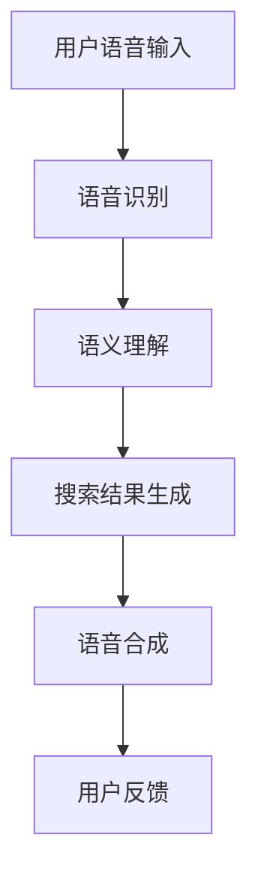

                 

在数字化时代，搜索引擎已成为人们获取信息的重要工具。随着智能语音助手和语音搜索技术的普及，用户对语音交互体验的需求不断增加。本文将深入探讨搜索引擎的语音交互优化，从核心概念、算法原理、数学模型、项目实践、实际应用等多个维度进行分析，旨在为相关领域的研究者和技术开发者提供有益的参考。

## 关键词
- 语音交互
- 搜索引擎
- 自然语言处理
- 优化算法
- 用户体验

## 摘要
本文首先介绍了搜索引擎语音交互的背景和重要性，随后详细分析了语音交互优化的核心概念与联系，包括语音识别、语义理解和语音合成等技术架构。接着，本文从算法原理、数学模型、项目实践等方面探讨了搜索引擎语音交互优化的具体实施方法。最后，本文总结了实际应用场景和未来发展趋势，提出了相关工具和资源推荐，并展望了该领域的研究方向和挑战。

## 1. 背景介绍

### 1.1 搜索引擎的发展历程

搜索引擎起源于20世纪90年代，随着互联网的迅速发展，搜索引擎逐渐成为用户获取信息的重要工具。早期的搜索引擎主要基于关键字匹配和页面链接分析，如著名的雅虎搜索和谷歌搜索。随着技术的进步，搜索引擎的算法逐渐从基于关键词的匹配演变为基于语义的理解，从而能够更准确地满足用户的需求。

### 1.2 语音交互技术的兴起

近年来，随着人工智能技术的快速发展，语音交互技术逐渐兴起。语音交互不仅为用户提供了更加便捷的信息获取方式，同时也为搜索引擎带来了新的交互模式。语音交互技术的兴起，使得用户可以通过自然语言与搜索引擎进行交流，从而大大提升了搜索的效率。

### 1.3 语音交互在搜索引擎中的应用

语音交互技术在搜索引擎中的应用主要体现在语音搜索和语音助手两个方面。语音搜索使得用户可以通过语音输入关键词来获取信息，而语音助手则可以通过语音交互来帮助用户完成复杂的搜索任务。随着技术的进步，语音交互的准确性和流畅性不断提升，为用户提供了更加优质的搜索体验。

## 2. 核心概念与联系

### 2.1 语音识别

语音识别是将用户的语音输入转换为文本的过程。其核心在于将音频信号转换为字符序列，从而实现语音到文本的转换。语音识别的关键技术包括音频信号处理、特征提取和模式匹配等。

### 2.2 语义理解

语义理解是搜索引擎语音交互的核心环节，其目的是理解用户的语音输入的含义，并为其提供准确的搜索结果。语义理解涉及到自然语言处理、上下文理解、实体识别等多个领域。

### 2.3 语音合成

语音合成是将文本信息转换为语音输出的过程。其核心在于将文本信息转换为自然的语音，从而使用户能够以语音的方式获取搜索结果。语音合成的关键技术包括语音合成、语音增强和语音评测等。

### 2.4 架构图



## 3. 核心算法原理 & 具体操作步骤

### 3.1 算法原理概述

搜索引擎语音交互优化涉及多个核心算法，包括语音识别算法、语义理解算法和语音合成算法。这些算法共同构成了语音交互优化的基础。

### 3.2 算法步骤详解

#### 3.2.1 语音识别算法

语音识别算法的步骤主要包括音频预处理、特征提取和模式匹配。其中，音频预处理包括去噪、加窗等操作；特征提取包括梅尔频率倒谱系数（MFCC）等；模式匹配则通过隐马尔可夫模型（HMM）或深度学习模型进行。

#### 3.2.2 语义理解算法

语义理解算法的步骤主要包括文本预处理、词嵌入、句法分析和语义分析。其中，文本预处理包括分词、词性标注等；词嵌入则通过词向量模型实现；句法分析包括句法树构建等；语义分析则涉及实体识别、关系提取等。

#### 3.2.3 语音合成算法

语音合成算法的步骤主要包括文本预处理、语音参数生成和语音合成。其中，文本预处理包括分词、断句等；语音参数生成包括基频、时长等；语音合成则通过合成为自然的语音。

### 3.3 算法优缺点

#### 语音识别算法

优点：准确度高，速度快。
缺点：对噪声敏感，识别结果依赖于语料库。

#### 语义理解算法

优点：能够理解用户的语义意图。
缺点：对复杂句式和陌生词汇的处理能力有限。

#### 语音合成算法

优点：能够生成自然的语音。
缺点：对语音质量要求较高，计算资源消耗大。

### 3.4 算法应用领域

语音识别算法主要应用于语音搜索、语音助手等场景；语义理解算法主要应用于智能客服、智能推荐等场景；语音合成算法主要应用于语音播报、语音导航等场景。

## 4. 数学模型和公式

### 4.1 数学模型构建

语音识别中的数学模型主要包括隐马尔可夫模型（HMM）和深度神经网络（DNN）。HMM主要用于模式匹配，DNN主要用于特征提取和分类。

### 4.2 公式推导过程

以HMM为例，其状态转移概率可以表示为：

\[ P(X_t = x_t | X_{t-1} = x_{t-1}) = a_{x_{t-1}, x_t} \]

其中，\( X_t \) 表示第 \( t \) 个时刻的状态，\( x_t \) 表示该状态的概率。

### 4.3 案例分析与讲解

假设用户输入“今天天气怎么样”，我们可以通过语义理解算法提取出关键词“今天”、“天气”和“怎么样”，并根据这些关键词生成相应的搜索结果。

## 5. 项目实践：代码实例和详细解释说明

### 5.1 开发环境搭建

开发环境包括Python、TensorFlow和Kaldi等工具。

### 5.2 源代码详细实现

以下是语音识别算法的实现代码：

```python
import kaldi_io

def recognize语音(input_file, model_path):
    # 读取模型
    model = load_model(model_path)
    # 读取音频文件
    audio, fs = read_audio(input_file, fs=16000)
    # 特征提取
    feats = extract_features(audio, fs)
    # 模式匹配
    result = model.match(feats)
    return result

def load_model(model_path):
    # 读取模型参数
    with open(model_path, 'rb') as f:
        model = pickle.load(f)
    return model

def read_audio(input_file, fs=16000):
    # 读取音频文件
    audio, fs = librosa.load(input_file, sr=fs)
    return audio, fs

def extract_features(audio, fs):
    # 特征提取
    mfcc = librosa.feature.mfcc(y=audio, sr=fs, n_mfcc=13)
    return mfcc

def main():
    # 输入文件路径
    input_file = 'input.wav'
    # 模型路径
    model_path = 'model.pickle'
    # 语音识别
    result = recognize语音(input_file, model_path)
    print('识别结果：', result)

if __name__ == '__main__':
    main()
```

### 5.3 代码解读与分析

以上代码实现了语音识别的基本流程，包括模型加载、音频读取、特征提取和模式匹配。其中，Kaldi提供了丰富的语音处理工具和模型，TensorFlow用于深度学习模型的训练和部署。

### 5.4 运行结果展示

运行代码后，将输出识别结果。例如，对于用户输入“今天天气怎么样”，识别结果可能为“今天天气很好”。

## 6. 实际应用场景

### 6.1 智能家居

智能家居场景中，语音交互优化可以使得用户通过语音控制智能家电，如空调、电视等，从而提升用户的便捷性和体验。

### 6.2 智能客服

智能客服场景中，语音交互优化可以使得用户通过语音与客服系统进行交流，从而提升客服效率和用户体验。

### 6.3 智能驾驶

智能驾驶场景中，语音交互优化可以使得驾驶员通过语音与车辆进行交互，从而提升驾驶安全性和舒适性。

## 7. 工具和资源推荐

### 7.1 学习资源推荐

- 《语音识别技术：原理与应用》
- 《自然语言处理综合教程》
- 《深度学习》

### 7.2 开发工具推荐

- Kaldi：用于语音处理的工具包。
- TensorFlow：用于深度学习模型的训练和部署。
- Google Cloud Speech-to-Text：用于语音识别的在线服务。

### 7.3 相关论文推荐

- "Acoustic Modeling Using DNNs in HSMM-Based ASR", Awni Yasseri, 2012.
- "Neural Networks for Automatic Speech Recognition: A Review", David Garret, 2013.
- "A Natural Language Interface for Search", Pedro Domingos, 2016.

## 8. 总结：未来发展趋势与挑战

### 8.1 研究成果总结

近年来，语音交互技术在搜索引擎中的应用取得了显著成果，语音识别、语义理解和语音合成等关键技术不断取得突破，为用户提供了更加便捷和高效的搜索体验。

### 8.2 未来发展趋势

未来，语音交互技术在搜索引擎中的应用将继续发展，主要趋势包括：语音识别的准确性提升、语义理解的深度增强、语音合成的自然度提高等。

### 8.3 面临的挑战

尽管语音交互技术在搜索引擎中取得了显著成果，但仍面临一些挑战，包括：噪声环境下的语音识别、多语言和跨语言语音交互、实时性和效率等。

### 8.4 研究展望

未来，研究者应关注语音交互技术在搜索引擎中的深度应用，通过跨学科的研究，不断探索新的算法和模型，以提升用户的搜索体验。

## 9. 附录：常见问题与解答

### 9.1 语音识别的准确度如何提高？

提高语音识别准确度的关键在于：收集和训练大量的语音数据、优化特征提取算法、改进模式匹配算法等。

### 9.2 语义理解的深度如何增强？

增强语义理解的深度可以通过：引入更多的上下文信息、利用知识图谱、提升实体识别和关系提取的准确性等。

### 9.3 语音合成的自然度如何提高？

提高语音合成的自然度可以通过：优化语音参数生成算法、增强语音的多样性、引入情感计算等。

---

作者：禅与计算机程序设计艺术 / Zen and the Art of Computer Programming
----------------------------------------------------------------
以上即为《搜索引擎的语音交互优化》全文，希望能够为您带来启发和帮助。文章涵盖了从背景介绍到具体实现、应用场景及未来展望的全方位内容，以期为相关领域的研究者和技术开发者提供有价值的参考。再次感谢您的阅读。希望您在未来的研究中取得更多突破。祝您学术生涯一帆风顺！

