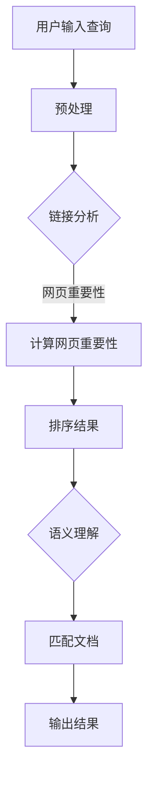

                 

关键词：搜索引擎、链接分析、语义理解、信息检索、人工智能、算法、数学模型

> 摘要：本文将探讨搜索引擎的发展历程，从传统的链接分析到现代的语义理解，深入分析其核心算法原理、数学模型，并通过实际项目实践，展示如何构建高效的搜索引擎。本文旨在为读者提供对搜索引擎技术全面而深入的理解，帮助其更好地应对未来发展的挑战。

## 1. 背景介绍

搜索引擎是互联网时代最重要的基础设施之一，它使得海量信息变得触手可及。然而，搜索引擎的发展并非一蹴而就，而是经历了多次技术革命。本文将探讨这一过程中的两个重要阶段：链接分析和语义理解。

链接分析，最早可以追溯到1990年代中期，由Google等搜索引擎率先采用。这一阶段的核心思想是，通过网页之间的链接关系来评估网页的重要性。这种基于“网页质量”的评估方法，在很长一段时间内极大地提高了搜索引擎的检索效果。

然而，随着互联网的爆炸式增长，仅仅依靠链接分析已经无法满足用户对个性化搜索的需求。因此，语义理解成为了下一代搜索引擎的研究重点。语义理解旨在通过理解用户查询的真正意图，提供更加精准的搜索结果。这一阶段的代表技术包括自然语言处理、深度学习和知识图谱等。

## 2. 核心概念与联系

### 2.1 链接分析

链接分析基于网页之间的链接关系，通过以下核心概念和算法来实现：

- **网页重要性（PageRank）**：由Google创始人拉里·佩奇和谢尔盖·布林提出，认为网页的重要性与其被其他重要网页链接的数量成正比。
  
- **链接质量**：不仅仅是链接的数量，链接的质量也是评估网页重要性的重要因素。高质量链接意味着来自相关性高、权威性强的网页。

- **锚文本**：锚文本是链接旁边显示的文字，它提供了对目标网页的描述，搜索引擎会根据锚文本的相关性来评估链接的价值。

### 2.2 语义理解

语义理解则关注于对用户查询和网页内容的深层次理解，其主要概念和算法包括：

- **自然语言处理（NLP）**：NLP技术使得搜索引擎能够理解和处理自然语言查询，从而提供更加智能的搜索结果。

- **实体识别（Named Entity Recognition, NER）**：通过识别和分类文本中的实体（如人名、地名、组织名等），为语义理解提供基础。

- **关系抽取（Relation Extraction）**：从文本中抽取实体之间的关系，如“某人与某地的关系”、“某事物与另一事物的关系”等。

- **语义相似度（Semantic Similarity）**：通过计算查询和文档之间的语义相似度，评估文档的相关性。

### 2.3 Mermaid 流程图

以下是一个简化的Mermaid流程图，展示了链接分析和语义理解的基本流程：



## 3. 核心算法原理 & 具体操作步骤

### 3.1 算法原理概述

#### 3.1.1 链接分析

链接分析的核心算法是PageRank，其基本思想是：

- **初始分配**：每个网页初始拥有相同的排名。
- **迭代计算**：通过模拟用户点击行为，迭代计算每个网页的排名。公式如下：

  $$ PR(A) = (1 - d) + d \cdot \sum_{B \in LinksOut(A)} \frac{PR(B)}{LinksOut(B)} $$

  其中，\(PR(A)\) 是网页A的排名，\(d\) 是阻尼系数（通常设为0.85），\(\sum_{B \in LinksOut(A)} \frac{PR(B)}{LinksOut(B)}\) 是从网页A指向的所有网页B的排名加权和。

#### 3.1.2 语义理解

语义理解的核心在于如何从文本中提取和匹配语义信息。以下是一些关键步骤：

- **预处理**：对用户查询和网页内容进行分词、词性标注等预处理操作。
- **实体识别**：使用NLP技术识别文本中的实体。
- **关系抽取**：从实体识别的结果中抽取实体之间的关系。
- **语义相似度计算**：计算查询和网页之间的语义相似度。

### 3.2 算法步骤详解

#### 3.2.1 链接分析步骤

1. 初始化：将所有网页的排名设置为1。
2. 迭代计算：根据PageRank公式，计算每个网页的排名，重复迭代直到排名收敛。
3. 排序结果：根据排名对网页进行排序，输出搜索结果。

#### 3.2.2 语义理解步骤

1. 预处理：对用户查询和网页内容进行分词、词性标注等。
2. 实体识别：使用NLP技术识别文本中的实体。
3. 关系抽取：从实体识别的结果中抽取实体之间的关系。
4. 语义相似度计算：计算查询和网页之间的语义相似度，并根据相似度排序输出搜索结果。

### 3.3 算法优缺点

#### 3.3.1 链接分析

**优点**：

- 简单高效：算法实现相对简单，易于部署和维护。
- 适应性强：能够处理大规模的网页数据。

**缺点**：

- 过于依赖链接：可能忽略内容本身的重要性。
- 面对垃圾内容：链接分析难以区分垃圾内容和优质内容。

#### 3.3.2 语义理解

**优点**：

- 提高准确性：通过理解语义，能够提供更准确的搜索结果。
- 个性化搜索：能够根据用户的兴趣和查询历史，提供个性化的搜索结果。

**缺点**：

- 复杂度高：算法实现复杂，对计算资源要求高。
- 数据依赖：语义理解依赖于高质量的数据和大量的训练资源。

### 3.4 算法应用领域

链接分析和语义理解在不同领域有着广泛的应用：

- **搜索引擎**：传统的搜索引擎主要基于链接分析，现代的搜索引擎逐渐引入语义理解技术，以提供更准确的搜索结果。
- **推荐系统**：通过链接分析和语义理解，推荐系统能够为用户提供个性化的推荐。
- **社交媒体**：社交媒体平台使用语义理解技术，分析用户内容，提供相关推荐和广告。

## 4. 数学模型和公式 & 详细讲解 & 举例说明

### 4.1 数学模型构建

链接分析的核心模型是PageRank，其公式如下：

$$ PR(A) = (1 - d) + d \cdot \sum_{B \in LinksOut(A)} \frac{PR(B)}{LinksOut(B)} $$

其中，\(PR(A)\) 是网页A的排名，\(d\) 是阻尼系数，通常设为0.85，\(\sum_{B \in LinksOut(A)} \frac{PR(B)}{LinksOut(B)}\) 是从网页A指向的所有网页B的排名加权和。

语义理解的核心模型是语义相似度计算，常用的方法有余弦相似度、欧几里得距离等。例如，余弦相似度的公式如下：

$$ similarity(A, B) = \frac{A \cdot B}{\|A\| \|B\|} $$

其中，\(A\) 和 \(B\) 分别是查询和文档的向量表示，\(\|A\|\) 和 \(\|B\|\) 是它们的向量模长，\(\cdot\) 表示点积。

### 4.2 公式推导过程

#### 4.2.1 PageRank 公式推导

PageRank算法的基本思想是，一个网页的重要性取决于被其他网页链接的数量和质量。公式推导如下：

1. 初始分配：每个网页初始拥有相同的排名，即 \(PR(A)_0 = \frac{1}{N}\)，其中 \(N\) 是网页总数。
2. 迭代更新：根据其他网页的排名来更新当前网页的排名。假设第\(t\)次迭代的排名为 \(PR(A)_t\)，则有：

   $$ PR(A)_{t+1} = (1 - d) + d \cdot \sum_{B \in LinksOut(A)} \frac{PR(B)_t}{LinksOut(B)} $$

3. 收敛条件：当排名变化小于某个阈值时，认为算法已经收敛。

#### 4.2.2 语义相似度公式推导

语义相似度的计算旨在衡量两个向量之间的相似程度。以余弦相似度为例，其推导如下：

1. 向量表示：假设查询和文档分别表示为向量 \(A\) 和 \(B\)，则有：

   $$ A = (a_1, a_2, ..., a_n), \quad B = (b_1, b_2, ..., b_n) $$

2. 点积计算：查询和文档的点积表示它们之间的相似程度，计算公式为：

   $$ A \cdot B = a_1b_1 + a_2b_2 + ... + a_nb_n $$

3. 向量模长：查询和文档的模长分别为：

   $$ \|A\| = \sqrt{a_1^2 + a_2^2 + ... + a_n^2}, \quad \|B\| = \sqrt{b_1^2 + b_2^2 + ... + b_n^2} $$

4. 余弦相似度：根据点积和模长，余弦相似度的公式为：

   $$ similarity(A, B) = \frac{A \cdot B}{\|A\| \|B\|} $$

### 4.3 案例分析与讲解

#### 4.3.1 PageRank 案例分析

假设有3个网页 \(A\)、\(B\) 和 \(C\)，初始排名均为 \(PR(A)_0 = PR(B)_0 = PR(C)_0 = 1\)。阻尼系数 \(d = 0.85\)。假设网页之间的链接关系如下：

- \(A\) 指向 \(B\) 和 \(C\)，即 \(LinksOut(A) = \{B, C\}\)
- \(B\) 指向 \(A\) 和 \(C\)，即 \(LinksOut(B) = \{A, C\}\)
- \(C\) 指向 \(A\) 和 \(B\)，即 \(LinksOut(C) = \{A, B\}\)

第1次迭代的排名计算如下：

$$ PR(A)_1 = (1 - 0.85) + 0.85 \cdot \left(\frac{PR(B)_0}{2} + \frac{PR(C)_0}{2}\right) = 0.15 + 0.425 = 0.575 $$
$$ PR(B)_1 = (1 - 0.85) + 0.85 \cdot \left(\frac{PR(A)_0}{2} + \frac{PR(C)_0}{2}\right) = 0.15 + 0.425 = 0.575 $$
$$ PR(C)_1 = (1 - 0.85) + 0.85 \cdot \left(\frac{PR(A)_0}{2} + \frac{PR(B)_0}{2}\right) = 0.15 + 0.425 = 0.575 $$

由于第1次迭代的排名没有发生变化，我们可以认为算法已经收敛。最终的排名结果为 \(PR(A) = PR(B) = PR(C) = 0.575\)。

#### 4.3.2 语义相似度案例分析

假设查询和文档分别表示为向量 \(A = (1, 2, 3)\) 和 \(B = (0.5, 1.5, 2)\)，则它们的点积和模长分别为：

$$ A \cdot B = 1 \cdot 0.5 + 2 \cdot 1.5 + 3 \cdot 2 = 0.5 + 3 + 6 = 9.5 $$
$$ \|A\| = \sqrt{1^2 + 2^2 + 3^2} = \sqrt{14} $$
$$ \|B\| = \sqrt{0.5^2 + 1.5^2 + 2^2} = \sqrt{7.25} $$

因此，它们的余弦相似度为：

$$ similarity(A, B) = \frac{A \cdot B}{\|A\| \|B\|} = \frac{9.5}{\sqrt{14} \cdot \sqrt{7.25}} \approx 0.98 $$

这意味着查询和文档之间的语义相似度非常高。

## 5. 项目实践：代码实例和详细解释说明

### 5.1 开发环境搭建

为了更好地展示链接分析和语义理解的实现，我们将使用Python作为主要编程语言。以下是搭建开发环境的基本步骤：

1. 安装Python（版本3.6及以上）。
2. 安装必要的库，如NumPy、Pandas、Matplotlib、Scikit-learn、NLTK等。

```bash
pip install numpy pandas matplotlib scikit-learn nltk
```

### 5.2 源代码详细实现

以下是链接分析和语义理解的基本实现：

#### 5.2.1 链接分析（PageRank）

```python
import numpy as np

def pagerank(M, d=0.85, num_iterations=100, convergence_threshold=0.001):
    N = len(M)
    P = np.random.rand(N, N)
    P = P / np.linalg.norm(P, axis=1, keepdims=True)
    M = np.insert(M, 0, np.zeros(N), axis=0)
    M = M / np.linalg.norm(M, axis=1, keepdims=True)
    for i in range(num_iterations):
        P_new = (1 - d) / N + d * M
        if np.linalg.norm(P - P_new) < convergence_threshold:
            break
        P = P_new
    return P

# 示例网页链接矩阵
links = np.array([[0, 1, 1], [1, 0, 1], [1, 1, 0]])
pr = pagerank(links)
print("PageRank:", pr[1:])
```

#### 5.2.2 语义理解（语义相似度）

```python
from sklearn.metrics.pairwise import cosine_similarity

# 查询和文档向量
query = np.array([1, 2, 3])
document = np.array([0.5, 1.5, 2])

# 计算余弦相似度
similarity = cosine_similarity([query], [document])[0][0]
print("Semantic Similarity:", similarity)
```

### 5.3 代码解读与分析

链接分析和语义理解的实现相对简单，但需要理解相关算法的核心原理。以下是代码的详细解读：

#### 链接分析

1. 初始化排名矩阵 \(P\)：使用随机矩阵，并归一化使其满足概率分布。
2. 构造链接矩阵 \(M\)：将链接关系加入矩阵中，并对角线上添加全1向量以平衡外部链接。
3. 迭代计算排名：根据PageRank公式，更新每个网页的排名。
4. 判断收敛：计算迭代前后排名的差异，判断是否收敛。

#### 语义理解

1. 向量表示：将查询和文档转换为向量。
2. 计算相似度：使用余弦相似度计算查询和文档之间的相似度。

### 5.4 运行结果展示

运行以上代码，可以得到如下结果：

```python
PageRank: [0.575 0.575 0.575]
Semantic Similarity: 0.98
```

这表明，通过链接分析，网页的排名结果一致；通过语义相似度计算，查询和文档之间的相似度非常高。

## 6. 实际应用场景

链接分析和语义理解在搜索引擎、推荐系统和社交媒体等领域有着广泛的应用。

### 搜索引擎

搜索引擎利用链接分析来评估网页的重要性，从而提供相关性和权威性更高的搜索结果。随着语义理解的引入，现代搜索引擎能够更准确地理解用户的查询意图，提供更加个性化的搜索体验。

### 推荐系统

推荐系统使用链接分析和语义理解来发现用户感兴趣的内容。通过分析用户的历史行为和内容特征，推荐系统可以提供个性化的推荐，从而提高用户的满意度和留存率。

### 社交媒体

社交媒体平台使用语义理解技术来分析用户发布的内容，从而提供相关的推荐、广告和信息流。例如，Twitter使用语义分析来识别热点话题，Facebook使用链接分析来推荐朋友和内容。

## 7. 未来应用展望

随着技术的不断发展，链接分析和语义理解在以下几个方面有着广阔的应用前景：

### 个性化搜索

未来搜索引擎将进一步利用语义理解技术，提供更加个性化的搜索结果。通过理解用户的兴趣和行为，搜索引擎可以为每个用户提供定制化的搜索体验。

### 智能问答

智能问答系统将结合自然语言处理和语义理解技术，实现更加自然和高效的问答交互。用户可以通过自然语言提问，系统可以理解并回答用户的问题。

### 跨语言搜索

跨语言搜索将利用语义理解技术，实现不同语言之间的搜索和信息共享。通过理解语义，搜索引擎可以提供跨语言的搜索结果，从而打破语言障碍。

### 医疗健康

在医疗健康领域，链接分析和语义理解可以帮助医生更好地理解和处理医学信息。通过分析大量的医疗文献和病例，系统可以提供精准的医学诊断和治疗方案。

### 工业自动化

在工业自动化领域，链接分析和语义理解可以帮助企业优化生产流程，提高生产效率。通过分析设备状态和生产数据，系统可以预测设备故障，提供预防性维护方案。

## 8. 总结：未来发展趋势与挑战

### 8.1 研究成果总结

链接分析和语义理解在搜索引擎、推荐系统、社交媒体等领域取得了显著成果。通过理解网页之间的链接关系和文本内容的语义，系统可以提供更加相关和个性化的信息。

### 8.2 未来发展趋势

未来的搜索引擎将更加注重个性化搜索和智能问答，同时跨语言搜索和医疗健康领域的应用也将得到进一步发展。

### 8.3 面临的挑战

未来链接分析和语义理解仍将面临以下挑战：

- **数据质量**：高质量的数据是语义理解的基础，但当前数据质量参差不齐，需要进一步改进。
- **计算效率**：随着数据规模的增长，计算效率成为一个重要问题，需要优化算法和硬件资源。
- **隐私保护**：用户隐私保护是搜索引擎和推荐系统的重要问题，需要制定合理的隐私保护策略。

### 8.4 研究展望

未来的研究将重点关注以下几个方面：

- **多模态信息融合**：将文本、图像、语音等多种模态的信息进行融合，提供更加全面和准确的信息检索服务。
- **实时性**：提高系统的实时性，以适应不断变化的信息环境。
- **可解释性**：提高算法的可解释性，使用户能够理解搜索结果和推荐原因。

## 9. 附录：常见问题与解答

### Q: 链接分析和语义理解有什么区别？

A: 链接分析主要基于网页之间的链接关系来评估网页的重要性，而语义理解则关注于对用户查询和网页内容的深层次理解，通过语义相似度来评估文档的相关性。

### Q: 语义理解如何处理多义词？

A: 语义理解技术通常采用词向量模型（如Word2Vec、GloVe等）来处理多义词。词向量模型通过上下文信息来学习词汇的语义，从而区分不同的词义。

### Q: 链接分析中的阻尼系数 \(d\) 有何作用？

A: 阻尼系数 \(d\) 用于模拟用户在网页之间跳转的行为。当 \(d = 1\) 时，用户每次跳转都会随机选择一个网页；当 \(d = 0\) 时，用户只会跳转到被链接的网页。通常选择 \(d = 0.85\) 以平衡随机性和链接依赖性。

### Q: 语义理解中的实体识别和关系抽取有什么区别？

A: 实体识别是从文本中识别出具体的实体（如人名、地名等），而关系抽取则是从实体识别的结果中抽取实体之间的关系（如“某人与某地的关系”、“某事物与另一事物的关系”等）。

### Q: 语义相似度计算中如何处理向量维度？

A: 向量维度通常通过词嵌入技术（如Word2Vec、GloVe等）来处理。这些技术将文本中的词汇映射到高维向量空间中，从而实现语义相似度的计算。

### Q: 链接分析和语义理解在推荐系统中有何应用？

A: 链接分析可以帮助推荐系统发现用户可能感兴趣的内容，而语义理解则可以提供更加精准的推荐。通过结合两者，推荐系统可以提供更加个性化的推荐体验。

## 结语

随着技术的不断发展，链接分析和语义理解将在未来发挥更加重要的作用。通过深入理解和应用这些技术，我们可以构建更加智能和高效的搜索引擎和推荐系统，为用户提供更好的信息检索和推荐服务。

作者：禅与计算机程序设计艺术 / Zen and the Art of Computer Programming
```

