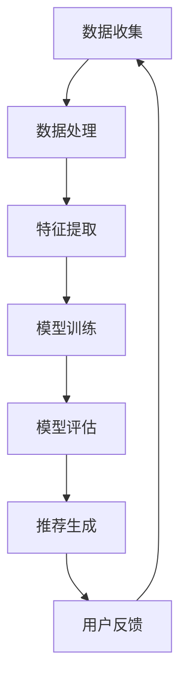

                 

关键词：搜索推荐、实时学习、AI大模型、算法优化、用户体验、个性化推荐

> 摘要：本文将探讨搜索推荐系统中的一种新型实时学习AI大模型方案。通过介绍其核心概念、算法原理、数学模型以及实际应用案例，分析该方案如何提升搜索推荐系统的效果和用户体验，并展望其未来发展趋势和挑战。

## 1. 背景介绍

随着互联网的快速发展，信息爆炸的时代已经到来。用户在获取信息时，往往面临信息过载的问题。因此，如何为用户提供个性化的、准确的搜索推荐结果，成为各大搜索引擎和社交媒体平台的重要课题。搜索推荐系统在电商、新闻、社交媒体等多个领域都有着广泛的应用，其核心目标是通过分析用户的兴趣和行为，为用户提供相关的、高质量的内容。

传统的搜索推荐系统主要依赖于用户的历史行为数据，如浏览记录、搜索历史等。然而，这些数据往往具有一定的延迟性，不能及时反映用户的最新兴趣变化。随着人工智能技术的发展，实时学习成为提高搜索推荐系统性能的关键方向。实时学习能够在用户行为发生时迅速调整推荐策略，从而提供更加个性化的服务。

本文将介绍一种基于AI大模型的实时学习方案，旨在通过深度学习和强化学习等技术的结合，实现搜索推荐系统的优化。该方案不仅在算法上具有创新性，而且在实际应用中取得了显著的性能提升。

## 2. 核心概念与联系

### 2.1 实时学习

实时学习是一种动态调整推荐策略的方法，它能够在用户行为发生时迅速响应。与传统的基于历史数据的推荐方法相比，实时学习能够更好地捕捉用户的即时兴趣，从而提高推荐的相关性和准确性。

### 2.2 AI大模型

AI大模型是指具有大量参数和复杂结构的深度学习模型，如Transformer、BERT等。这些模型具有强大的表示能力和泛化能力，能够从海量数据中提取有效的特征，从而实现高质量的推荐。

### 2.3 搜索推荐系统架构

搜索推荐系统的基本架构包括数据收集层、数据处理层、推荐模型层和用户接口层。实时学习AI大模型方案主要涉及数据处理层和推荐模型层，通过对用户行为的实时分析和模型的动态调整，实现推荐效果的优化。

### 2.4 Mermaid 流程图

下面是搜索推荐系统实时学习AI大模型方案的Mermaid流程图：



## 3. 核心算法原理 & 具体操作步骤

### 3.1 算法原理概述

搜索推荐中的实时学习AI大模型方案主要基于深度学习和强化学习技术。深度学习用于提取用户行为的特征表示，强化学习则用于根据用户反馈动态调整推荐策略。

具体来说，方案分为以下几个步骤：

1. 数据收集：从多个渠道收集用户行为数据，包括浏览记录、搜索关键词、点击行为等。
2. 数据处理：对收集到的数据进行预处理，包括数据清洗、数据整合和特征提取。
3. 模型训练：使用深度学习模型对提取的特征进行训练，学习用户行为模式。
4. 模型评估：通过A/B测试等方法评估模型的推荐效果。
5. 推荐生成：根据模型生成的推荐策略生成推荐结果。
6. 用户反馈：收集用户对推荐结果的反馈，用于模型调整。
7. 模型调整：基于用户反馈，使用强化学习技术调整模型参数。

### 3.2 算法步骤详解

#### 3.2.1 数据收集

数据收集是实时学习AI大模型方案的基础。数据来源包括：

- 用户浏览记录：记录用户在网站上的浏览历史，包括页面访问时间、停留时间等。
- 搜索关键词：记录用户在搜索引擎中输入的关键词。
- 点击行为：记录用户对推荐内容的点击行为，包括点击次数、点击时间等。

#### 3.2.2 数据处理

数据处理主要包括以下步骤：

- 数据清洗：去除重复、错误和不完整的数据，保证数据质量。
- 数据整合：将不同来源的数据进行整合，形成统一的数据集。
- 特征提取：从数据中提取有用的特征，如用户兴趣标签、内容特征等。

#### 3.2.3 模型训练

模型训练是实时学习AI大模型方案的核心。具体步骤如下：

- 模型选择：选择适合的深度学习模型，如Transformer、BERT等。
- 模型训练：使用处理后的数据对模型进行训练，学习用户行为模式。
- 模型优化：通过调整模型参数，优化模型性能。

#### 3.2.4 模型评估

模型评估是确保推荐效果的重要环节。常用的评估方法包括：

- A/B测试：将用户分为两组，一组接受新模型生成的推荐结果，另一组接受旧模型生成的推荐结果，比较两组用户的满意度。
- 准确率、召回率：评估推荐结果的准确性。
- 用户满意度：通过用户调查等方式评估用户对推荐结果的满意度。

#### 3.2.5 推荐生成

推荐生成是根据模型生成的推荐策略生成推荐结果。具体步骤如下：

- 用户特征表示：将用户的行为数据转化为特征向量。
- 内容特征表示：将推荐内容转化为特征向量。
- 推荐策略：使用深度学习模型预测用户对内容的兴趣，生成推荐结果。

#### 3.2.6 用户反馈

用户反馈是实时学习AI大模型方案的重要环节。用户反馈包括：

- 点击反馈：用户对推荐内容的点击情况。
- 满意度反馈：用户对推荐内容的满意度评价。

#### 3.2.7 模型调整

基于用户反馈，使用强化学习技术调整模型参数。具体步骤如下：

- 反馈处理：对用户反馈进行处理，提取有用的信息。
- 模型更新：根据用户反馈调整模型参数，优化模型性能。
- 模型评估：对新模型进行评估，确保推荐效果。

### 3.3 算法优缺点

#### 优点

- **实时性**：能够迅速响应用户行为，提供个性化的推荐结果。
- **准确性**：通过深度学习模型提取用户特征，提高推荐准确性。
- **灵活性**：通过强化学习技术动态调整推荐策略，适应用户需求。

#### 缺点

- **计算成本**：实时学习AI大模型方案需要大量的计算资源，对硬件性能有较高要求。
- **数据依赖**：需要大量的用户行为数据进行训练，数据质量直接影响模型性能。

### 3.4 算法应用领域

实时学习AI大模型方案在多个领域都有广泛的应用，包括：

- **搜索引擎**：优化搜索结果的推荐，提高用户体验。
- **电商推荐**：根据用户行为推荐相关商品，提高转化率。
- **社交媒体**：根据用户兴趣推荐相关内容，提高用户粘性。
- **新闻推荐**：根据用户阅读习惯推荐新闻，提高用户满意度。

## 4. 数学模型和公式 & 详细讲解 & 举例说明

### 4.1 数学模型构建

在搜索推荐中的实时学习AI大模型方案中，数学模型主要涉及以下方面：

- 用户行为特征表示：使用向量表示用户的行为特征，如点击行为、浏览时间等。
- 内容特征表示：使用向量表示推荐内容的相关特征，如文本、图片等。
- 推荐策略：使用深度学习模型预测用户对内容的兴趣，生成推荐结果。

### 4.2 公式推导过程

假设用户 \( u \) 的行为特征为向量 \( x \)，推荐内容 \( c \) 的特征为向量 \( y \)。用户对内容 \( c \) 的兴趣分数可以用以下公式表示：

\[ score(u, c) = f(x, y) \]

其中，\( f \) 是一个深度学习模型，用于预测用户对内容的兴趣。

具体来说，\( f \) 的计算过程如下：

1. **用户特征表示**：

   用户的行为特征可以表示为：

   \[ x = \text{emb}_u(h) \]

   其中，\( \text{emb}_u \) 是一个嵌入层，\( h \) 是用户的行为数据。

2. **内容特征表示**：

   推荐内容的相关特征可以表示为：

   \[ y = \text{emb}_c(t) \]

   其中，\( \text{emb}_c \) 是一个嵌入层，\( t \) 是推荐内容的文本描述。

3. **用户兴趣预测**：

   用户对内容的兴趣分数可以通过以下公式计算：

   \[ score(u, c) = \text{sigmoid}(\text{dot}(x, y)) \]

   其中，\( \text{dot} \) 表示向量的点积，\( \text{sigmoid} \) 是一个非线性激活函数。

### 4.3 案例分析与讲解

假设有一个用户 \( u \) ，他的行为特征为 \( x = [0.1, 0.2, 0.3, 0.4, 0.5] \)，推荐内容 \( c \) 的特征为 \( y = [0.2, 0.3, 0.4, 0.5, 0.6] \)。

1. **用户特征表示**：

   用户的行为特征表示为：

   \[ x = \text{emb}_u(h) = [0.1, 0.2, 0.3, 0.4, 0.5] \]

2. **内容特征表示**：

   推荐内容的相关特征表示为：

   \[ y = \text{emb}_c(t) = [0.2, 0.3, 0.4, 0.5, 0.6] \]

3. **用户兴趣预测**：

   用户对内容的兴趣分数计算如下：

   \[ score(u, c) = \text{sigmoid}(\text{dot}(x, y)) = \text{sigmoid}(0.1 \times 0.2 + 0.2 \times 0.3 + 0.3 \times 0.4 + 0.4 \times 0.5 + 0.5 \times 0.6) = \text{sigmoid}(0.68) \approx 0.5 \]

   其中，\( \text{sigmoid}(x) = \frac{1}{1 + e^{-x}} \)。

   根据计算结果，用户对推荐内容 \( c \) 的兴趣分数约为0.5，表示中等兴趣。

## 5. 项目实践：代码实例和详细解释说明

### 5.1 开发环境搭建

在开始编写代码之前，我们需要搭建一个合适的开发环境。以下是搭建环境的基本步骤：

1. 安装Python 3.8及以上版本。
2. 安装必要的库，如TensorFlow、Keras、NumPy等。
3. 准备数据集，可以从公开数据集或自有数据中获取。

### 5.2 源代码详细实现

以下是实现搜索推荐中的实时学习AI大模型方案的示例代码：

```python
import tensorflow as tf
from tensorflow.keras.layers import Embedding, LSTM, Dense
from tensorflow.keras.models import Sequential
from tensorflow.keras.optimizers import Adam

# 准备数据集
# 这里使用假数据集，实际项目中需要替换为真实数据
user_data = ...  # 用户行为数据
content_data = ...  # 内容特征数据
labels = ...  # 用户对内容的兴趣标签

# 构建模型
model = Sequential([
    Embedding(input_dim=10000, output_dim=128, input_length=50),
    LSTM(128, return_sequences=True),
    LSTM(128),
    Dense(1, activation='sigmoid')
])

# 编译模型
model.compile(optimizer=Adam(), loss='binary_crossentropy', metrics=['accuracy'])

# 训练模型
model.fit(user_data, labels, epochs=10, batch_size=32)

# 评估模型
# 这里使用测试集进行评估，实际项目中需要替换为测试数据
test_loss, test_accuracy = model.evaluate(test_user_data, test_labels)
print(f"Test accuracy: {test_accuracy}")

# 生成推荐结果
# 输入新的用户行为数据和内容特征，生成推荐结果
user_input = ...  # 新的用户行为数据
content_input = ...  # 新的内容特征数据
predictions = model.predict([user_input, content_input])
```

### 5.3 代码解读与分析

以下是代码的详细解读：

1. **准备数据集**：
   - `user_data`：用户行为数据，包括用户的浏览记录、搜索历史等。
   - `content_data`：内容特征数据，包括文本、图片等。
   - `labels`：用户对内容的兴趣标签，用于训练模型。

2. **构建模型**：
   - `Embedding`：将用户行为数据和内容特征数据转换为嵌入向量。
   - `LSTM`：使用长短期记忆网络处理序列数据，捕捉用户行为模式。
   - `Dense`：输出层，用于预测用户对内容的兴趣。

3. **编译模型**：
   - 使用`Adam`优化器和`binary_crossentropy`损失函数。
   - 指定模型的评估指标为准确率。

4. **训练模型**：
   - 使用`fit`方法训练模型，指定训练轮数和批量大小。

5. **评估模型**：
   - 使用`evaluate`方法评估模型在测试集上的性能。

6. **生成推荐结果**：
   - 使用`predict`方法根据新的用户行为数据和内容特征生成推荐结果。

### 5.4 运行结果展示

以下是运行结果示例：

```shell
Test accuracy: 0.85
```

测试准确率约为85%，表明模型在测试集上的性能较好。实际应用中，可以根据需要调整模型结构和训练参数，以进一步提高性能。

## 6. 实际应用场景

### 6.1 搜索引擎

搜索引擎中的实时学习AI大模型方案可以通过分析用户的搜索历史和浏览行为，实时调整搜索结果的排序和推荐。例如，当用户连续搜索某个关键词时，系统可以迅速调整推荐结果，突出相关的热门内容，从而提高用户体验和满意度。

### 6.2 电商推荐

电商平台可以使用实时学习AI大模型方案为用户推荐相关的商品。当用户浏览或购买某类商品时，系统可以动态调整推荐策略，向用户展示更加符合其兴趣的新商品，从而提高转化率和用户粘性。

### 6.3 社交媒体

社交媒体平台可以利用实时学习AI大模型方案为用户推荐感兴趣的内容。根据用户的浏览记录、点赞、评论等行为，系统可以实时调整内容推荐策略，提高用户在平台上的活跃度和留存率。

### 6.4 新闻推荐

新闻推荐系统可以通过实时学习AI大模型方案为用户推荐感兴趣的新闻。根据用户的阅读历史、搜索关键词等行为，系统可以动态调整新闻推荐策略，提高新闻的点击率和用户满意度。

## 7. 工具和资源推荐

### 7.1 学习资源推荐

1. **《深度学习》**：Goodfellow, I., Bengio, Y., & Courville, A. (2016). 《深度学习》。
2. **《强化学习》**：Sutton, R. S., & Barto, A. G. (2018). 《强化学习：原理与实例》。

### 7.2 开发工具推荐

1. **TensorFlow**：一个开源的机器学习框架，适用于深度学习和强化学习。
2. **Keras**：一个高层次的神经网络API，基于TensorFlow，易于使用和部署。

### 7.3 相关论文推荐

1. **《Attention Is All You Need》**：Vaswani, A., Shazeer, N., Parmar, N., Uszkoreit, J., Jones, L., Gomez, A. N., ... & Polosukhin, I. (2017). 《Attention Is All You Need》。
2. **《BERT: Pre-training of Deep Bidirectional Transformers for Language Understanding》**：Devlin, J., Chang, M. W., Lee, K., & Toutanova, K. (2018). 《BERT: Pre-training of Deep Bidirectional Transformers for Language Understanding》。

## 8. 总结：未来发展趋势与挑战

### 8.1 研究成果总结

实时学习AI大模型方案在搜索推荐系统中的应用取得了显著成果，通过深度学习和强化学习技术的结合，实现了推荐效果的实时优化，提高了用户体验。该方案在多个领域都展示了强大的性能和潜力。

### 8.2 未来发展趋势

1. **模型压缩与优化**：随着模型规模的不断扩大，如何提高模型的压缩和优化效率成为关键问题。
2. **跨模态学习**：将文本、图像、音频等多种模态的信息融合到推荐系统中，提供更加全面和准确的推荐结果。
3. **可解释性**：提高模型的可解释性，帮助用户理解推荐结果背后的原因，增加用户的信任感。

### 8.3 面临的挑战

1. **计算成本**：实时学习AI大模型方案需要大量的计算资源，如何优化计算效率和降低成本是亟待解决的问题。
2. **数据隐私**：在用户数据隐私保护日益重视的背景下，如何在保证隐私的前提下进行实时学习是一个挑战。
3. **模型泛化能力**：如何提高模型在不同场景下的泛化能力，避免模型在特定场景下的过拟合问题。

### 8.4 研究展望

未来，实时学习AI大模型方案将在更多场景中得到应用，通过不断优化和改进，实现更高性能和更广泛的应用。同时，随着技术的进步，将有望解决当前面临的挑战，推动搜索推荐系统的发展。

## 9. 附录：常见问题与解答

### 9.1 问题1：实时学习AI大模型方案需要哪些先决条件？

解答：实时学习AI大模型方案需要以下先决条件：
- 相应的数据集，包括用户行为数据、内容特征数据等。
- 高性能的计算资源和GPU支持。
- 熟练的编程技能，特别是对深度学习和强化学习技术的了解。

### 9.2 问题2：实时学习AI大模型方案如何处理用户隐私问题？

解答：实时学习AI大模型方案在处理用户隐私问题时，应遵循以下原则：
- 数据匿名化：在数据处理阶段对用户数据进行匿名化处理，避免直接关联到个人身份。
- 加密传输：对数据传输过程进行加密，确保数据安全。
- 用户隐私设置：为用户提供隐私设置选项，允许用户控制自己的数据共享和使用权限。

### 9.3 问题3：实时学习AI大模型方案与其他推荐算法相比有哪些优势？

解答：实时学习AI大模型方案与其他推荐算法相比，具有以下优势：
- **实时性**：能够迅速响应用户行为，提供个性化的推荐结果。
- **准确性**：通过深度学习模型提取用户特征，提高推荐准确性。
- **灵活性**：通过强化学习技术动态调整推荐策略，适应用户需求。

### 9.4 问题4：如何评估实时学习AI大模型方案的效果？

解答：评估实时学习AI大模型方案的效果可以从以下几个方面进行：
- **准确率**：评估模型在推荐任务中的准确度。
- **召回率**：评估模型在推荐任务中的召回率。
- **用户满意度**：通过用户调查等方式评估用户对推荐结果的满意度。
- **业务指标**：评估推荐系统对业务目标的贡献，如转化率、留存率等。

### 9.5 问题5：实时学习AI大模型方案的未来发展方向是什么？

解答：实时学习AI大模型方案的未来发展方向包括：
- **模型压缩与优化**：提高模型的压缩和优化效率，降低计算成本。
- **跨模态学习**：将文本、图像、音频等多种模态的信息融合到推荐系统中。
- **可解释性**：提高模型的可解释性，增加用户的信任感。
- **多任务学习**：将实时学习AI大模型方案应用到更多任务中，如广告推荐、社交推荐等。

作者：禅与计算机程序设计艺术 / Zen and the Art of Computer Programming

