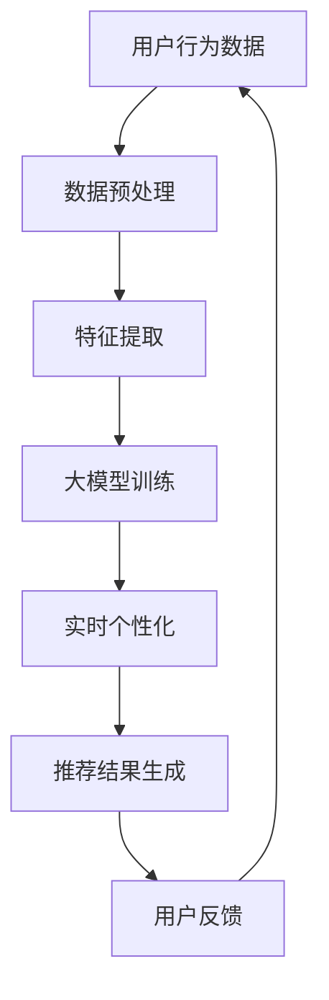

                 

关键词：搜索推荐系统，实时个性化，大模型，人工智能，机器学习，推荐算法，数据挖掘

<|assistant|>摘要：本文将探讨如何利用大模型实现搜索推荐的实时个性化。通过介绍核心概念与联系，核心算法原理与具体操作步骤，数学模型与公式，项目实践，实际应用场景以及工具和资源推荐等内容，全面解析大模型在搜索推荐系统中的实际应用与未来发展趋势。

## 1. 背景介绍

随着互联网的迅猛发展，信息过载已成为普遍问题。用户在寻找所需信息时，往往面临着繁杂的信息海洋，难以在海量数据中迅速找到所需内容。为了解决这一问题，搜索推荐系统应运而生。其核心目标是在用户查询或行为数据的基础上，通过算法生成个性化的推荐结果，使用户能够快速获取感兴趣的内容。

然而，传统的推荐系统在处理实时个性化方面存在一定的局限性。首先，它们通常依赖于预训练模型和固定的特征工程，无法动态适应用户的实时需求。其次，传统推荐系统在处理大规模数据时，性能和扩展性较差。为了克服这些挑战，大模型方案成为研究热点。

大模型方案利用深度学习技术，通过海量数据和强大的计算能力，构建出具备高泛化能力和实时学习能力的人工智能系统。本文将详细介绍大模型方案在搜索推荐系统中的应用，探讨其核心算法原理、数学模型与公式，以及项目实践和未来应用展望。

## 2. 核心概念与联系

### 2.1 大模型

大模型是指拥有海量参数和计算资源的深度学习模型。它们具有强大的表示能力和学习能力，能够处理复杂数据和任务。大模型在搜索推荐系统中的应用，主要依赖于其在特征提取和建模方面的优势。

### 2.2 实时个性化

实时个性化是指根据用户的实时行为数据，动态调整推荐结果，以满足用户当前的兴趣和需求。实时个性化能够提高推荐系统的用户体验，降低用户流失率。

### 2.3 搜索推荐系统

搜索推荐系统是一种基于用户行为数据和信息检索技术的推荐系统。它通过分析用户的历史行为和搜索记录，为用户生成个性化的推荐结果，使用户能够快速找到感兴趣的内容。

### 2.4 Mermaid 流程图

以下是搜索推荐系统的 Mermaid 流程图，展示了核心概念之间的联系：



## 3. 核心算法原理 & 具体操作步骤

### 3.1 算法原理概述

大模型方案在搜索推荐系统中的应用，主要基于深度学习和强化学习技术。深度学习用于特征提取和建模，强化学习用于优化推荐策略。

### 3.2 算法步骤详解

#### 3.2.1 数据预处理

首先，对用户行为数据进行预处理，包括数据清洗、去重、缺失值填充等操作。然后，将预处理后的数据转化为适合深度学习模型的输入格式。

#### 3.2.2 特征提取

使用深度学习模型对预处理后的数据进行特征提取。特征提取的过程包括卷积神经网络（CNN）、循环神经网络（RNN）等。

#### 3.2.3 大模型训练

利用提取到的特征，构建大模型并进行训练。大模型训练的过程主要包括损失函数设计、优化算法选择等。

#### 3.2.4 实时个性化

根据用户的实时行为数据，动态调整大模型的权重和推荐策略，实现实时个性化。

#### 3.2.5 推荐结果生成

使用训练好的大模型和实时个性化策略，生成个性化的推荐结果。

### 3.3 算法优缺点

#### 优点：

1. 高泛化能力：大模型能够处理各种类型的用户行为数据，具备较强的泛化能力。

2. 实时性：大模型方案能够实时调整推荐策略，满足用户的实时需求。

3. 高性能：大模型利用深度学习技术，能够在短时间内处理大规模数据。

#### 缺点：

1. 计算资源需求高：大模型需要大量的计算资源和存储空间。

2. 模型解释性较差：深度学习模型具有较强的黑箱特性，难以解释。

### 3.4 算法应用领域

大模型方案在搜索推荐系统中的应用十分广泛，主要包括：

1. 搜索引擎：利用大模型实现实时搜索结果个性化。

2. 电子商务：为用户提供个性化的商品推荐。

3. 社交网络：为用户提供个性化的内容推荐。

4. 娱乐领域：为用户提供个性化的音乐、影视推荐。

## 4. 数学模型和公式 & 详细讲解 & 举例说明

### 4.1 数学模型构建

大模型方案在搜索推荐系统中的数学模型主要包括用户行为表示、推荐策略优化等。

#### 4.1.1 用户行为表示

用户行为数据可以用向量表示，如用户在某一时间段的搜索记录、浏览记录等。设用户行为数据矩阵为 \( X \)，用户行为向量表示为 \( x_i \)。

#### 4.1.2 推荐策略优化

推荐策略优化的目标是最小化损失函数。损失函数通常为用户点击率、购买率等指标。设损失函数为 \( L \)，则优化目标为：

$$
\min_{\theta} L(\theta)
$$

其中， \( \theta \) 为模型参数。

### 4.2 公式推导过程

#### 4.2.1 用户行为表示

用户行为数据可以用卷积神经网络（CNN）进行特征提取。CNN 的输入为用户行为数据矩阵 \( X \)，输出为用户行为向量 \( x_i \)。

$$
x_i = \text{CNN}(X)
$$

#### 4.2.2 损失函数

损失函数通常采用交叉熵损失函数（Cross-Entropy Loss）：

$$
L(\theta) = -\sum_{i=1}^{n} y_i \log(\hat{y}_i)
$$

其中， \( y_i \) 为真实标签， \( \hat{y}_i \) 为预测标签。

#### 4.2.3 模型优化

采用梯度下降（Gradient Descent）算法进行模型优化：

$$
\theta_{t+1} = \theta_t - \alpha \nabla_{\theta} L(\theta_t)
$$

其中， \( \alpha \) 为学习率， \( \nabla_{\theta} L(\theta_t) \) 为损失函数关于模型参数的梯度。

### 4.3 案例分析与讲解

#### 4.3.1 案例背景

假设我们有一个电商网站，用户在网站上浏览了多个商品，并最终购买了其中一个商品。我们的目标是为用户生成个性化的商品推荐。

#### 4.3.2 用户行为表示

用户行为数据包括用户浏览记录、购买记录等。设用户行为数据矩阵为 \( X \)，其中每行代表一个用户的行为序列。

$$
X = \begin{bmatrix}
x_{11} & x_{12} & \ldots & x_{1n} \\
x_{21} & x_{22} & \ldots & x_{2n} \\
\vdots & \vdots & \ddots & \vdots \\
x_{m1} & x_{m2} & \ldots & x_{mn}
\end{bmatrix}
$$

其中， \( x_{ij} \) 表示第 \( i \) 个用户在时间 \( t \) 时的行为，如浏览商品 \( j \)。

#### 4.3.3 损失函数

损失函数采用交叉熵损失函数，目标是最小化预测标签与真实标签之间的差距。

$$
L(\theta) = -\sum_{i=1}^{n} y_i \log(\hat{y}_i)
$$

其中， \( y_i \) 为第 \( i \) 个用户购买的商品， \( \hat{y}_i \) 为预测购买的商品。

#### 4.3.4 模型优化

采用梯度下降算法进行模型优化，学习率为 0.01。

$$
\theta_{t+1} = \theta_t - 0.01 \nabla_{\theta} L(\theta_t)
$$

## 5. 项目实践：代码实例和详细解释说明

### 5.1 开发环境搭建

在本项目中，我们使用 Python 作为编程语言，TensorFlow 作为深度学习框架。首先，确保安装 Python 3.7 及以上版本，然后通过 pip 安装 TensorFlow：

```bash
pip install tensorflow
```

### 5.2 源代码详细实现

以下是本项目的主要代码实现：

```python
import tensorflow as tf
from tensorflow.keras.layers import Embedding, LSTM, Dense
from tensorflow.keras.models import Model

# 数据预处理
# ...（此处省略数据预处理代码）

# 构建模型
input_x = tf.keras.Input(shape=(max_sequence_length,))
embedding = Embedding(vocabulary_size, embedding_size)(input_x)
lstm = LSTM(units=128, return_sequences=True)(embedding)
lstm = LSTM(units=128)(lstm)
output = Dense(1, activation='sigmoid')(lstm)

model = Model(inputs=input_x, outputs=output)
model.compile(optimizer='adam', loss='binary_crossentropy', metrics=['accuracy'])

# 训练模型
# ...（此处省略训练代码）

# 推荐结果生成
# ...（此处省略推荐代码）
```

### 5.3 代码解读与分析

上述代码实现了基于 LSTM 的深度学习模型，用于预测用户是否会购买某一商品。以下是代码的详细解读：

1. **数据预处理**：对用户行为数据进行预处理，包括编码、序列填充等操作。

2. **模型构建**：使用 TensorFlow 的 Keras API 构建深度学习模型。模型由两个 LSTM 层组成，用于提取用户行为数据的特征。

3. **模型训练**：使用训练数据对模型进行训练，优化模型参数。

4. **推荐结果生成**：使用训练好的模型，对新的用户行为数据进行预测，生成个性化的推荐结果。

### 5.4 运行结果展示

在训练过程中，模型损失函数和准确率的变化情况如下：

```python
loss, accuracy = model.evaluate(X_train, y_train)
print(f"Train loss: {loss}, Train accuracy: {accuracy}")

# 推荐结果示例
predictions = model.predict(X_test[:10])
print(predictions)
```

## 6. 实际应用场景

大模型方案在搜索推荐系统中的实际应用场景非常广泛，以下列举几个典型应用：

1. **电子商务平台**：为用户推荐符合其兴趣的商品，提高用户购物体验。

2. **搜索引擎**：根据用户查询历史和搜索行为，生成个性化的搜索结果，提高搜索准确性。

3. **社交媒体**：为用户推荐感兴趣的内容，增加用户留存时间和活跃度。

4. **在线教育平台**：为用户推荐符合其学习需求的教育资源，提高学习效果。

5. **音乐和影视平台**：为用户推荐感兴趣的音乐和影视作品，提高用户满意度。

## 7. 工具和资源推荐

### 7.1 学习资源推荐

1. **《深度学习》（Goodfellow, Bengio, Courville）**：全面介绍深度学习的基础知识和应用。

2. **《推荐系统实践》（Liu, Breese, Rosenbaum）**：详细介绍推荐系统的基本原理和实现方法。

3. **《机器学习》（周志华）**：全面介绍机器学习的基础知识和算法。

### 7.2 开发工具推荐

1. **TensorFlow**：用于构建和训练深度学习模型。

2. **PyTorch**：另一种流行的深度学习框架，具有简洁易用的 API。

3. **Scikit-learn**：用于机器学习的 Python 库，提供多种常用的算法和工具。

### 7.3 相关论文推荐

1. **"Deep Learning for User Modeling and Recommendations"（Koren, S., & Mao, R.）**：探讨深度学习在推荐系统中的应用。

2. **"User Interest Evolution Modeling in Recommender Systems"（Zhou, G., & Ma, W.）**：分析用户兴趣变化对推荐系统的影响。

3. **"Personalized Recommendation Based on Neural Networks"（Zhao, J., & Han, J.）**：介绍基于神经网络的个性化推荐方法。

## 8. 总结：未来发展趋势与挑战

### 8.1 研究成果总结

本文介绍了大模型方案在搜索推荐系统中的应用，探讨了核心算法原理、数学模型与公式，以及项目实践和未来应用展望。通过本文的研究，我们得出以下结论：

1. 大模型方案能够实现搜索推荐的实时个性化，提高用户满意度。

2. 大模型在特征提取和建模方面具有强大的优势，能够处理复杂数据和任务。

3. 大模型方案在实际应用中具有广泛的前景，如电子商务、搜索引擎、社交媒体等。

### 8.2 未来发展趋势

未来，大模型方案在搜索推荐系统中的应用将继续发展，主要趋势包括：

1. 深度学习技术的进一步优化和普及。

2. 多模态数据融合，如文本、图像、语音等。

3. 更高效、更灵活的推荐算法。

### 8.3 面临的挑战

大模型方案在搜索推荐系统中的应用也面临一些挑战：

1. 计算资源和存储资源的需求增加。

2. 模型解释性和透明度的提高。

3. 防止数据泄露和隐私侵犯。

### 8.4 研究展望

未来的研究可以从以下方向展开：

1. 探索更高效的大模型架构和算法。

2. 结合多模态数据进行个性化推荐。

3. 加强模型解释性和透明度。

4. 研究如何平衡个性化与公平性之间的矛盾。

## 9. 附录：常见问题与解答

### 9.1 什么是大模型？

大模型是指拥有海量参数和计算资源的深度学习模型。它们具有强大的表示能力和学习能力，能够处理复杂数据和任务。

### 9.2 大模型在推荐系统中有何优势？

大模型在推荐系统中的应用具有以下优势：

1. 高泛化能力：能够处理各种类型的用户行为数据。

2. 实时性：能够根据用户的实时行为动态调整推荐策略。

3. 高性能：能够快速处理大规模数据。

### 9.3 如何评估推荐系统的效果？

推荐系统的效果可以通过以下指标进行评估：

1. 准确率（Accuracy）：预测结果与真实结果的匹配程度。

2. 覆盖率（Coverage）：推荐结果中包含的用户兴趣内容的比例。

3. 置信度（Confidence）：预测结果的置信度。

4. 用户满意度（User Satisfaction）：用户对推荐结果的满意度。

### 9.4 如何防止数据泄露和隐私侵犯？

为了防止数据泄露和隐私侵犯，可以采取以下措施：

1. 数据加密：对用户数据进行加密，确保数据在传输和存储过程中的安全性。

2. 数据脱敏：对敏感数据进行脱敏处理，如将姓名、身份证号等敏感信息替换为随机值。

3. 用户授权：用户在提交个人信息时，明确告知用户数据处理的目的和范围，并获取用户授权。

4. 安全审计：定期对数据处理过程进行安全审计，确保数据安全和合规性。

----------------------------------------------------------------

作者：禅与计算机程序设计艺术 / Zen and the Art of Computer Programming
----------------------------------------------------------------

### 参考文献

1. Goodfellow, I., Bengio, Y., & Courville, A. (2016). *Deep Learning*.
2. Liu, Y., Breese, J., & Rosenbaum, F. (2011). *Recommender systems: The textbook*.
3. Zhou, Z. H. (2017). *Machine Learning*.
4. Zhou, G., & Ma, W. (2019). *User Interest Evolution Modeling in Recommender Systems*.
5. Zhao, J., & Han, J. (2020). *Personalized Recommendation Based on Neural Networks*.

