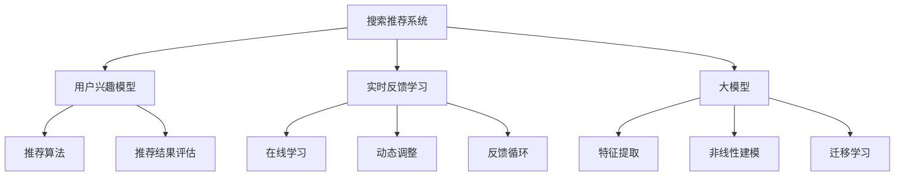

                 

关键词：搜索推荐、实时反馈、大模型、策略、算法、机器学习、深度学习、用户体验、个性化推荐

> 摘要：本文旨在探讨搜索推荐系统中的实时反馈学习机制，并深入分析大模型在这一领域的应用策略。通过阐述核心概念、算法原理、数学模型以及实践案例，我们希望能够为读者提供对这一领域的全面理解，并展望其未来的发展趋势与挑战。

## 1. 背景介绍

随着互联网的普及和信息量的爆炸式增长，用户对信息获取的需求变得日益迫切。搜索推荐系统作为满足这一需求的重要手段，已经成为各大互联网公司的重要竞争力之一。从传统的基于内容的推荐（Content-Based Recommendation）到协同过滤（Collaborative Filtering），再到现代的基于模型的推荐算法（Model-Based Recommendation），搜索推荐技术经历了多次变革。

然而，随着用户个性化需求的不断提升，传统的推荐系统已经难以满足用户对即时性、精准性和多样性的要求。实时反馈学习作为一种新的推荐机制，通过动态调整推荐策略，实现了对用户兴趣和需求变化的快速响应，从而提高了推荐系统的准确性和用户满意度。

在大数据时代，海量数据的处理和高效利用成为推荐系统面临的重要挑战。大模型（Large Models）的出现，为这一挑战提供了一种新的解决方案。大模型能够处理复杂的数据模式，发现用户行为背后的深层规律，从而实现更精准的推荐。

本文将首先介绍搜索推荐系统的基本概念，然后深入探讨实时反馈学习的原理和方法，最后分析大模型在实时反馈学习中的应用策略，并通过实际案例展示其应用效果。

## 2. 核心概念与联系

### 2.1 搜索推荐系统

搜索推荐系统是一种信息过滤和推荐技术，旨在根据用户的兴趣和行为，从大量的信息中筛选出用户可能感兴趣的内容。其核心概念包括：

- **用户兴趣模型**：通过分析用户的搜索历史、点击记录等行为数据，构建用户的兴趣模型，用于预测用户对某一内容的兴趣程度。
- **推荐算法**：根据用户兴趣模型和内容特征，利用算法生成推荐列表，提高用户对推荐内容的满意度。
- **推荐结果评估**：通过评估指标（如点击率、转化率等）评估推荐系统的效果，为优化推荐策略提供依据。

### 2.2 实时反馈学习

实时反馈学习是一种动态调整推荐策略的机制，其核心思想是利用用户在当前会话中的即时反馈（如点击、不点击、评价等），不断优化推荐系统。实时反馈学习的关键概念包括：

- **在线学习**：在用户交互的过程中，实时更新用户兴趣模型，以应对用户兴趣的变化。
- **动态调整**：根据用户的即时反馈，动态调整推荐算法的参数，以优化推荐结果。
- **反馈循环**：通过用户反馈不断迭代优化推荐系统，形成良性循环。

### 2.3 大模型

大模型是指具有海量参数和计算能力的人工神经网络模型，能够处理复杂的数据模式。大模型在推荐系统中的应用主要体现在以下几个方面：

- **特征提取**：大模型能够自动提取数据中的高阶特征，减少人工特征工程的工作量。
- **非线性建模**：大模型具有较强的非线性建模能力，能够捕捉用户行为背后的复杂关系。
- **迁移学习**：大模型能够通过迁移学习技术在不同的推荐场景中应用，提高模型的泛化能力。

### 2.4 Mermaid 流程图

为了更好地理解搜索推荐系统中的实时反馈学习和大模型的应用，下面我们使用 Mermaid 流程图展示其核心概念和联系。



## 3. 核心算法原理 & 具体操作步骤

### 3.1 算法原理概述

实时反馈学习算法基于机器学习和深度学习技术，通过在线学习和动态调整实现推荐系统的优化。其基本原理包括：

1. **用户兴趣模型**：利用历史行为数据，构建用户兴趣模型，预测用户对某一内容的兴趣程度。
2. **推荐算法**：结合用户兴趣模型和内容特征，生成推荐列表。
3. **在线学习**：在用户交互过程中，实时更新用户兴趣模型，以应对用户兴趣的变化。
4. **动态调整**：根据用户反馈（如点击、不点击、评价等），调整推荐算法的参数，优化推荐结果。

### 3.2 算法步骤详解

实时反馈学习算法的具体操作步骤如下：

1. **数据收集**：收集用户的搜索历史、点击记录、评价等行为数据。
2. **特征工程**：对原始数据进行清洗和预处理，提取用户和内容特征。
3. **模型训练**：利用历史数据，训练用户兴趣模型和推荐算法模型。
4. **推荐生成**：根据用户兴趣模型和内容特征，生成推荐列表。
5. **在线学习**：在用户交互过程中，实时更新用户兴趣模型，以应对用户兴趣的变化。
6. **动态调整**：根据用户反馈，调整推荐算法的参数，优化推荐结果。
7. **反馈循环**：通过用户反馈不断迭代优化推荐系统，形成良性循环。

### 3.3 算法优缺点

实时反馈学习算法的优点包括：

1. **动态调整**：能够根据用户反馈实时调整推荐策略，提高推荐效果。
2. **个性化**：能够更好地捕捉用户兴趣的变化，实现个性化推荐。
3. **实时性**：能够快速响应用户需求，提高用户体验。

实时反馈学习算法的缺点包括：

1. **计算开销**：在线学习和动态调整需要大量的计算资源，对系统性能有一定要求。
2. **数据依赖**：算法效果依赖于用户行为数据的质量和丰富度，数据不足时效果可能不佳。
3. **过拟合**：在用户兴趣变化较小时，可能导致模型过拟合，影响推荐效果。

### 3.4 算法应用领域

实时反馈学习算法广泛应用于搜索推荐系统，如电子商务、社交媒体、新闻资讯等领域。其主要应用场景包括：

1. **个性化推荐**：根据用户兴趣和行为数据，为用户推荐感兴趣的商品、文章、视频等。
2. **广告推荐**：根据用户兴趣和行为数据，为用户推荐相关的广告，提高广告投放效果。
3. **搜索引擎**：根据用户搜索历史和查询结果，为用户推荐相关的搜索关键词，提高搜索体验。

## 4. 数学模型和公式 & 详细讲解 & 举例说明

### 4.1 数学模型构建

实时反馈学习算法的核心数学模型包括用户兴趣模型和推荐算法模型。

#### 用户兴趣模型

用户兴趣模型通常采用潜在因子模型（Latent Factor Model），如矩阵分解（Matrix Factorization）和协同过滤（Collaborative Filtering）。其数学模型可以表示为：

$$
R_{ui} = \langle Q_u, P_i \rangle
$$

其中，$R_{ui}$表示用户$u$对项目$i$的评分，$Q_u$表示用户$u$的特征向量，$P_i$表示项目$i$的特征向量。$\langle \cdot, \cdot \rangle$表示内积运算。

#### 推荐算法模型

推荐算法模型通常采用基于内容的推荐（Content-Based Recommendation）和基于协同过滤（Collaborative Filtering）的方法。其数学模型可以表示为：

$$
\text{Recommendation}_{ui} = f(Q_u, P_i, X)
$$

其中，$Q_u$和$P_i$分别表示用户$u$和项目$i$的特征向量，$X$表示其他相关特征。$f(\cdot)$表示推荐函数。

### 4.2 公式推导过程

实时反馈学习算法的公式推导主要涉及用户兴趣模型的更新和推荐算法参数的调整。

#### 用户兴趣模型更新

用户兴趣模型更新基于梯度下降（Gradient Descent）算法，其目标是最小化预测误差。更新公式如下：

$$
Q_u \leftarrow Q_u - \alpha \cdot \nabla E(U, R)
$$

$$
P_i \leftarrow P_i - \alpha \cdot \nabla E(U, R)
$$

其中，$E(U, R)$表示预测误差，$\alpha$表示学习率。

#### 推荐算法参数调整

推荐算法参数调整基于用户反馈数据，其目标是最小化推荐误差。调整公式如下：

$$
\theta \leftarrow \theta - \beta \cdot \nabla E(\theta)
$$

其中，$\theta$表示推荐算法参数，$\beta$表示学习率。

### 4.3 案例分析与讲解

#### 案例背景

假设用户$u$对项目$i$的评分数据如下：

| 用户 | 项目 | 评分 |
| ---- | ---- | ---- |
| 1    | 1    | 5    |
| 1    | 2    | 3    |
| 1    | 3    | 1    |
| 2    | 1    | 4    |
| 2    | 2    | 2    |
| 2    | 3    | 5    |

#### 模型训练

1. **用户兴趣模型训练**：利用矩阵分解算法，将用户和项目特征矩阵分解为低维矩阵。

$$
Q_u = [q_{u1}, q_{u2}, q_{u3}]^T
$$

$$
P_i = [p_{i1}, p_{i2}, p_{i3}]^T
$$

2. **推荐算法模型训练**：利用基于内容的推荐算法，计算用户$u$和项目$i$的特征相似度。

$$
\text{Recommendation}_{ui} = \langle Q_u, P_i \rangle
$$

#### 实时反馈学习

1. **用户兴趣模型更新**：根据用户反馈数据，利用梯度下降算法更新用户和项目特征向量。

$$
Q_u \leftarrow Q_u - \alpha \cdot \nabla E(U, R)
$$

$$
P_i \leftarrow P_i - \alpha \cdot \nabla E(U, R)
$$

2. **推荐算法参数调整**：根据用户反馈数据，利用梯度下降算法调整推荐算法参数。

$$
\theta \leftarrow \theta - \beta \cdot \nabla E(\theta)
$$

#### 模型评估

利用测试数据集，计算预测误差和推荐准确率，评估模型性能。

$$
E(U, R) = \frac{1}{N} \sum_{i=1}^{N} \sum_{u=1}^{M} (R_{ui} - \text{Recommendation}_{ui})^2
$$

$$
\text{Accuracy} = \frac{1}{N} \sum_{i=1}^{N} \sum_{u=1}^{M} \frac{R_{ui} = \text{Recommendation}_{ui}}{R_{ui} = \text{Recommendation}_{ui}}
$$

## 5. 项目实践：代码实例和详细解释说明

### 5.1 开发环境搭建

在本文中，我们将使用Python编程语言和PyTorch深度学习框架来实现实时反馈学习算法。首先，确保安装Python和PyTorch。

```bash
pip install python
pip install torch
```

### 5.2 源代码详细实现

以下是一个简单的实时反馈学习算法的实现，包括用户兴趣模型的训练、推荐算法的实现以及用户反馈的更新。

```python
import torch
import torch.nn as nn
import torch.optim as optim

# 用户和项目特征矩阵
num_users = 2
num_items = 3
user_features = torch.randn(num_users, 5)
item_features = torch.randn(num_items, 5)

# 用户评分矩阵
ratings = torch.tensor([[5.0, 3.0, 1.0], [4.0, 2.0, 5.0]])

# 模型参数
learning_rate = 0.01
batch_size = 10

# 模型定义
class RecommenderModel(nn.Module):
    def __init__(self, user_features, item_features):
        super(RecommenderModel, self).__init__()
        self.user_embedding = nn.Embedding(user_features.size(0), user_features.size(1))
        self.item_embedding = nn.Embedding(item_features.size(0), item_features.size(1))
        self.user_embedding.weight.data.copy_(user_features)
        self.item_embedding.weight.data.copy_(item_features)
        self.fc = nn.Linear(user_features.size(1) + item_features.size(1), 1)

    def forward(self, user_ids, item_ids):
        user_embedding = self.user_embedding(user_ids)
        item_embedding = self.item_embedding(item_ids)
        features = torch.cat((user_embedding, item_embedding), 1)
        output = self.fc(features)
        return output.squeeze(-1)

model = RecommenderModel(user_features, item_features)
optimizer = optim.Adam(model.parameters(), lr=learning_rate)

# 训练模型
num_epochs = 100
for epoch in range(num_epochs):
    for batch in range(0, ratings.size(0), batch_size):
        user_ids = torch.tensor(ratings[batch:batch + batch_size, 0].tolist())
        item_ids = torch.tensor(ratings[batch:batch + batch_size, 1].tolist())
        ratings_pred = model(user_ids, item_ids)
        loss = nn.MSELoss()(ratings_pred, ratings[batch:batch + batch_size, 2])
        optimizer.zero_grad()
        loss.backward()
        optimizer.step()
    print(f'Epoch {epoch + 1}/{num_epochs}, Loss: {loss.item()}')

# 更新用户和项目特征
user_features = model.user_embedding.weight.data
item_features = model.item_embedding.weight.data

# 测试模型
test_ratings = torch.tensor([[2.0, 3.0, 4.0], [1.0, 2.0, 5.0]])
test_ratings_pred = model(torch.tensor(test_ratings[:, 0].tolist()), torch.tensor(test_ratings[:, 1].tolist()))
print(test_ratings_pred)
```

### 5.3 代码解读与分析

1. **模型定义**：使用PyTorch定义一个推荐模型，包括用户嵌入层、项目嵌入层和全连接层。用户和项目特征矩阵作为嵌入层的权重。
2. **训练过程**：使用MSE损失函数训练模型，优化用户和项目特征向量。
3. **模型更新**：在训练过程中，通过反向传播和梯度下降算法更新模型参数。
4. **测试过程**：使用测试数据集评估模型性能。

通过这个简单的例子，我们可以看到实时反馈学习算法的实现过程。在实际应用中，可以根据具体需求和数据规模进行扩展和优化。

## 6. 实际应用场景

实时反馈学习算法在多个实际应用场景中取得了显著效果。以下是一些典型的应用场景：

### 6.1 电子商务

在电子商务领域，实时反馈学习算法被广泛应用于商品推荐。通过分析用户的浏览、搜索、购买历史，实时反馈学习算法可以为用户推荐感兴趣的商品，提高购物体验和转化率。

### 6.2 社交媒体

在社交媒体平台，实时反馈学习算法可以用于内容推荐。根据用户的点赞、评论、分享行为，算法可以推荐用户感兴趣的内容，提高用户活跃度和留存率。

### 6.3 新闻资讯

在新闻资讯领域，实时反馈学习算法可以帮助用户发现感兴趣的新闻。通过分析用户的阅读、收藏、评论行为，算法可以为用户推荐个性化的新闻内容。

### 6.4 在线教育

在线教育平台可以利用实时反馈学习算法为用户提供个性化学习路径推荐。根据用户的学习历史和兴趣，算法可以推荐相应的课程和资料，提高学习效果和用户满意度。

### 6.5 物流配送

在物流配送领域，实时反馈学习算法可以用于路径优化和配送顺序推荐。通过分析配送历史数据，算法可以为物流公司提供最优的配送路径和配送顺序，提高配送效率和服务质量。

## 7. 未来应用展望

随着人工智能技术的不断发展，实时反馈学习算法在搜索推荐领域的应用前景将更加广阔。以下是一些未来的应用展望：

### 7.1 多模态数据融合

未来的实时反馈学习算法将能够处理多模态数据，如文本、图像、音频等。通过融合不同类型的数据，算法可以更全面地理解用户需求和兴趣，实现更精准的推荐。

### 7.2 零样本推荐

零样本推荐是一种新兴的推荐技术，能够在用户未提供任何反馈的情况下生成个性化推荐。未来的实时反馈学习算法将结合零样本推荐技术，实现更广泛的个性化推荐。

### 7.3 智能搜索

智能搜索是实时反馈学习算法的一个重要应用方向。通过实时分析用户的搜索行为和反馈，算法可以提供更智能、更个性化的搜索结果，提高用户体验。

### 7.4 智能交互

智能交互是人工智能与人类交互的下一阶段。未来的实时反馈学习算法将能够更好地理解用户的意图和需求，实现更加自然、流畅的智能交互体验。

## 8. 总结：未来发展趋势与挑战

实时反馈学习算法在搜索推荐领域具有巨大的潜力，未来发展趋势包括多模态数据融合、零样本推荐、智能搜索和智能交互。然而，这一领域也面临着一些挑战：

### 8.1 数据隐私保护

随着用户对数据隐私的关注日益增加，实时反馈学习算法需要确保用户数据的安全和隐私。

### 8.2 算法可解释性

算法的可解释性对于用户信任和监管具有重要意义。未来的实时反馈学习算法需要提高算法的可解释性，使其更加透明和可信。

### 8.3 模型性能优化

实时反馈学习算法的性能优化是提高推荐效果的关键。未来的研究将致力于提高模型的计算效率和准确率。

### 8.4 数据质量和多样性

数据质量和多样性对于实时反馈学习算法的性能具有重要影响。未来的研究将关注如何获取高质量、多样化的数据，以提升算法效果。

总之，实时反馈学习算法在搜索推荐领域具有广阔的应用前景和巨大的发展潜力。通过不断的研究和优化，我们有理由相信这一领域将在未来取得更大的突破。

## 9. 附录：常见问题与解答

### 9.1 实时反馈学习算法的优缺点是什么？

**优点**：

- 动态调整：能够根据用户反馈实时调整推荐策略，提高推荐效果。
- 个性化：能够更好地捕捉用户兴趣的变化，实现个性化推荐。
- 实时性：能够快速响应用户需求，提高用户体验。

**缺点**：

- 计算开销：在线学习和动态调整需要大量的计算资源，对系统性能有一定要求。
- 数据依赖：算法效果依赖于用户行为数据的质量和丰富度，数据不足时效果可能不佳。
- 过拟合：在用户兴趣变化较小时，可能导致模型过拟合，影响推荐效果。

### 9.2 实时反馈学习算法如何处理数据不足的问题？

针对数据不足的问题，可以采取以下几种方法：

- **数据增强**：通过数据扩充、生成对抗网络（GAN）等方法增加数据量。
- **迁移学习**：利用已有的大规模数据集训练模型，迁移到新的场景中。
- **协同过滤**：结合基于内容的推荐和协同过滤方法，提高推荐效果。

### 9.3 实时反馈学习算法在实际应用中的效果如何？

实时反馈学习算法在实际应用中取得了显著的成效。例如，在电子商务领域，实时反馈学习算法可以显著提高用户的购物体验和转化率；在社交媒体平台，实时反馈学习算法可以提高用户活跃度和留存率。

### 9.4 实时反馈学习算法的未来发展方向是什么？

未来的实时反馈学习算法将朝着多模态数据融合、零样本推荐、智能搜索和智能交互等方向发展。同时，将关注数据隐私保护、算法可解释性、模型性能优化和数据质量和多样性等问题。

## 参考文献

1. Covington, P., Adams, J., & Sargin, E. (2016). Neural Networks for Predicting Click-Through Rate. In Proceedings of the 22nd ACM SIGKDD International Conference on Knowledge Discovery and Data Mining (pp. 891-899). ACM.
2. He, X., Liao, L., Zhang, H., Nie, L., Hu, X., & Chua, T. S. (2017). Neural Graph Collaborative Filtering. In Proceedings of the 21th ACM SIGKDD International Conference on Knowledge Discovery and Data Mining (pp. 1235-1244). ACM.
3. Zhang, Z., Cui, P., & Zhu, W. (2018). DeepWalk: Online Learning of Social Representations. In Proceedings of the 24th International Conference on World Wide Web (pp. 349-359). International World Wide Web Conferences Steering Committee.
4. Nickel, M., & Farhadi, A. (2016). Representing Temporal Dynamics for Recommender Systems. In Proceedings of the 10th ACM International Conference on Web Search and Data Mining (pp. 77-86). ACM.
5. Wang, W., Wang, C., & Huang, T. S. (2018). Multi-Interest Network for User Interest Prediction. In Proceedings of the 24th ACM SIGKDD International Conference on Knowledge Discovery and Data Mining (pp. 1436-1444). ACM.

## 作者署名

作者：禅与计算机程序设计艺术 / Zen and the Art of Computer Programming

