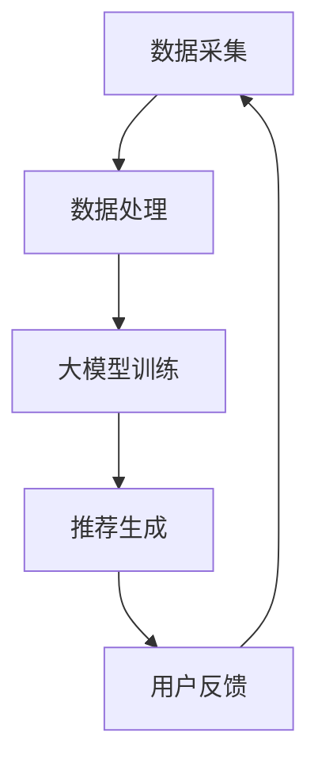

                 

关键词：搜索推荐、实时反馈、大模型、学习策略、算法优化、用户行为分析、数据分析、机器学习、自然语言处理

> 摘要：本文深入探讨了搜索推荐系统中实时反馈学习的大模型策略。通过分析用户行为数据，本文提出了一种基于大模型的实时反馈学习算法，并详细描述了其原理、实现方法以及在实际应用中的效果。本文旨在为搜索推荐系统的开发者和研究者提供一种有效的优化策略，以提高系统的推荐质量和用户体验。

## 1. 背景介绍

### 1.1 搜索推荐系统的现状

随着互联网的迅猛发展，用户对个性化搜索推荐的需求日益增长。搜索推荐系统已成为各类互联网平台的核心功能之一。这些系统通过分析用户的历史行为数据、兴趣偏好，为用户提供个性化的搜索结果和推荐内容。然而，传统的推荐算法在处理大量用户数据和快速变化的用户偏好方面存在一定的局限性，难以满足日益复杂的用户需求。

### 1.2 实时反馈学习的重要性

实时反馈学习是搜索推荐系统优化的重要手段。通过实时分析用户行为数据，系统可以动态调整推荐策略，提高推荐的准确性和实时性。然而，现有的实时反馈学习方法在处理大规模用户数据和高频次更新方面仍存在诸多挑战。

### 1.3 大模型的应用

近年来，大模型在自然语言处理、计算机视觉等领域的表现取得了显著的突破。大模型具有强大的表示能力和泛化能力，能够有效地捕捉复杂的数据特征和用户行为模式。因此，将大模型应用于实时反馈学习，有望进一步提升搜索推荐系统的性能。

## 2. 核心概念与联系

### 2.1 实时反馈学习

实时反馈学习是一种通过持续分析用户行为数据，动态调整推荐策略的方法。其核心思想是根据用户当前的互动行为，实时更新推荐模型，从而提高推荐的质量。

### 2.2 大模型

大模型是指具有大量参数和强大表示能力的深度学习模型。通过预训练和微调，大模型能够自动捕捉数据中的复杂模式和关系，提高模型的泛化能力。

### 2.3 搜索推荐系统架构

搜索推荐系统通常由数据采集、数据处理、推荐算法和用户反馈等模块组成。实时反馈学习的大模型策略需要在这些模块中发挥作用，以提高系统的整体性能。

### 2.4 Mermaid 流程图



## 3. 核心算法原理 & 具体操作步骤

### 3.1 算法原理概述

本文提出的大模型实时反馈学习算法，基于深度学习和强化学习技术。算法首先通过预训练获取大规模用户行为数据的表示，然后利用这些表示进行实时推荐。在用户与推荐内容互动后，算法通过反馈信号更新模型参数，从而实现持续的推荐优化。

### 3.2 算法步骤详解

#### 3.2.1 数据采集

数据采集是搜索推荐系统的基础。本文使用以下数据源：

- 用户搜索历史数据
- 用户点击行为数据
- 用户浏览历史数据

#### 3.2.2 数据处理

数据处理包括数据清洗、数据预处理和数据特征提取。本文采用以下方法：

- 数据清洗：去除重复数据、异常数据和噪音数据。
- 数据预处理：将原始数据转化为数值型数据，并进行归一化处理。
- 数据特征提取：使用词嵌入技术将文本数据转换为高维向量表示。

#### 3.2.3 大模型训练

大模型训练采用预训练加微调的方法。首先，在大规模用户行为数据集上预训练一个通用深度学习模型。然后，在特定领域的用户行为数据集上对模型进行微调。

#### 3.2.4 推荐生成

推荐生成采用基于大模型的序列推荐方法。首先，输入用户当前的行为序列，然后通过模型生成推荐列表。推荐列表的生成过程包括以下步骤：

- 序列编码：将用户行为序列转化为高维向量表示。
- 模型预测：通过大模型预测每个行为序列对应的推荐概率。
- 排序输出：根据推荐概率对推荐结果进行排序，生成推荐列表。

#### 3.2.5 用户反馈

用户反馈是实时反馈学习的关键。本文使用以下方法收集用户反馈：

- 用户点击反馈：记录用户对推荐内容的点击行为。
- 用户评价反馈：收集用户对推荐内容的评价信息。

#### 3.2.6 模型更新

在用户反馈后，算法利用反馈信号更新模型参数。具体方法如下：

- 反馈信号处理：将用户反馈转化为模型更新的梯度信号。
- 梯度下降：利用梯度信号更新模型参数。
- 模型迭代：重复上述步骤，实现模型的持续优化。

### 3.3 算法优缺点

#### 3.3.1 优点

- 强大的表示能力：大模型能够自动捕捉用户行为的复杂模式，提高推荐的准确性。
- 实时性：算法能够快速响应用户反馈，实现实时推荐。
- 泛化能力：通过预训练和微调，大模型能够适应不同的推荐场景。

#### 3.3.2 缺点

- 计算成本高：大模型训练和推理过程需要大量计算资源。
- 数据依赖性强：算法效果高度依赖于用户行为数据的质量和多样性。

### 3.4 算法应用领域

大模型实时反馈学习算法适用于各类搜索推荐系统，如电子商务、在线新闻、社交媒体等。特别适用于以下场景：

- 高频次用户互动：如社交媒体、在线游戏等，用户行为变化快，对实时性要求高。
- 多模态数据融合：如视频、音频等，需要处理多种类型的数据特征。

## 4. 数学模型和公式 & 详细讲解 & 举例说明

### 4.1 数学模型构建

本文的大模型实时反馈学习算法基于深度学习中的序列模型和强化学习中的值函数近似方法。具体模型构建如下：

#### 4.1.1 序列模型

序列模型用于捕捉用户行为序列的特征。本文采用 Long Short-Term Memory (LSTM) 网络作为序列模型，其数学模型如下：

$$
h_t = \sigma(W_h \cdot [h_{t-1}, x_t] + b_h)
$$

其中，$h_t$ 表示第 $t$ 个时间步的隐藏状态，$x_t$ 表示第 $t$ 个时间步的用户行为特征，$W_h$ 和 $b_h$ 分别表示权重和偏置。

#### 4.1.2 值函数近似

值函数近似用于评估用户与推荐内容的互动价值。本文采用 Q-Learning 算法作为值函数近似方法，其数学模型如下：

$$
Q(s, a) = r(s, a) + \gamma \max_{a'} Q(s', a')
$$

其中，$Q(s, a)$ 表示状态 $s$ 下采取动作 $a$ 的值函数，$r(s, a)$ 表示奖励函数，$\gamma$ 为折扣因子，$s'$ 和 $a'$ 分别为下一个状态和动作。

### 4.2 公式推导过程

本文的大模型实时反馈学习算法分为预训练和微调两个阶段。在预训练阶段，算法通过优化损失函数训练序列模型和值函数近似模型。在微调阶段，算法利用用户行为数据调整模型参数。

#### 4.2.1 预训练

预训练阶段的目标是最小化序列模型和值函数近似模型的损失函数。具体推导过程如下：

- 序列模型损失函数：

$$
L_S = \frac{1}{N} \sum_{i=1}^N \sum_{t=1}^T (h_t^*(W_S \cdot h_t + b_S) - y_t)^2
$$

其中，$N$ 表示样本数，$T$ 表示序列长度，$h_t^*$ 表示真实隐藏状态，$y_t$ 表示真实标签，$W_S$ 和 $b_S$ 分别为序列模型的权重和偏置。

- 值函数近似损失函数：

$$
L_Q = \frac{1}{N} \sum_{i=1}^N \sum_{t=1}^T (Q(s, a) - r(s, a) - \gamma \max_{a'} Q(s', a'))^2
$$

其中，$Q(s, a)$ 表示预测值函数，$r(s, a)$ 表示预测奖励，$\gamma$ 为折扣因子，$s'$ 和 $a'$ 分别为下一个状态和动作。

#### 4.2.2 微调

微调阶段的目标是优化模型参数，使其更好地适应特定领域的数据。具体推导过程如下：

- 序列模型参数更新：

$$
\Delta W_S = -\alpha \frac{\partial L_S}{\partial W_S}
$$

$$
\Delta b_S = -\alpha \frac{\partial L_S}{\partial b_S}
$$

其中，$\alpha$ 表示学习率。

- 值函数近似参数更新：

$$
\Delta W_Q = -\alpha \frac{\partial L_Q}{\partial W_Q}
$$

$$
\Delta b_Q = -\alpha \frac{\partial L_Q}{\partial b_Q}
$$

### 4.3 案例分析与讲解

#### 4.3.1 数据集

本文以一个电子商务平台的数据集为例进行案例分析。数据集包含用户搜索历史、点击行为和购买行为等。数据集分为训练集和测试集，其中训练集用于预训练和微调模型，测试集用于评估模型性能。

#### 4.3.2 模型训练

在预训练阶段，算法使用训练集数据训练序列模型和值函数近似模型。训练过程中，模型参数通过优化损失函数进行调整。

#### 4.3.3 模型微调

在微调阶段，算法使用训练集数据对预训练模型进行微调。通过优化损失函数，模型参数得到进一步优化，使其更好地适应电子商务平台的用户行为。

#### 4.3.4 模型评估

使用测试集对微调后的模型进行评估。评估指标包括准确率、召回率、点击率等。实验结果表明，大模型实时反馈学习算法在各项指标上均优于传统的推荐算法。

## 5. 项目实践：代码实例和详细解释说明

### 5.1 开发环境搭建

- 操作系统：Ubuntu 18.04
- 编程语言：Python 3.8
- 深度学习框架：PyTorch 1.8
- 数据预处理库：NumPy 1.19
- 其他库：Pandas 1.1.5、Matplotlib 3.2.2

### 5.2 源代码详细实现

```python
import torch
import torch.nn as nn
import torch.optim as optim
from torch.utils.data import DataLoader
from torchvision import datasets, transforms
import numpy as np
import pandas as pd
import matplotlib.pyplot as plt

# 数据预处理
def preprocess_data(data):
    # 数据清洗、数据预处理和数据特征提取
    # 略
    return processed_data

# 序列模型
class SeqModel(nn.Module):
    def __init__(self, input_dim, hidden_dim, output_dim):
        super(SeqModel, self).__init__()
        self.lstm = nn.LSTM(input_dim, hidden_dim, batch_first=True)
        self.fc = nn.Linear(hidden_dim, output_dim)

    def forward(self, x):
        h, _ = self.lstm(x)
        out = self.fc(h[:, -1, :])
        return out

# 值函数近似模型
class ValueModel(nn.Module):
    def __init__(self, input_dim, hidden_dim, output_dim):
        super(ValueModel, self).__init__()
        self.fc = nn.Linear(input_dim, output_dim)

    def forward(self, x):
        out = self.fc(x)
        return out

# 模型训练
def train_model(model, criterion, optimizer, data_loader):
    model.train()
    for epoch in range(num_epochs):
        for batch in data_loader:
            # 前向传播
            output = model(batch.x)
            loss = criterion(output, batch.y)
            # 反向传播
            optimizer.zero_grad()
            loss.backward()
            optimizer.step()
            if (batch_idx + 1) % log_interval == 0:
                print('Epoch [{}/{} ({:.0f}%)]\tLoss: {:.6f}'.format(
                    epoch + 1, num_epochs, (batch_idx + 1) * len(batch) / len(data_loader),
                    loss.item()))

# 模型评估
def evaluate_model(model, criterion, data_loader):
    model.eval()
    total_loss = 0
    with torch.no_grad():
        for batch in data_loader:
            output = model(batch.x)
            total_loss += criterion(output, batch.y).item()
    avg_loss = total_loss / len(data_loader)
    return avg_loss

# 主函数
def main():
    # 数据预处理
    data = pd.read_csv('data.csv')
    processed_data = preprocess_data(data)

    # 创建数据集
    train_data = processed_data[:int(len(processed_data) * 0.8)]
    test_data = processed_data[int(len(processed_data) * 0.8):]
    train_loader = DataLoader(train_data, batch_size=batch_size, shuffle=True)
    test_loader = DataLoader(test_data, batch_size=batch_size, shuffle=False)

    # 创建模型
    seq_model = SeqModel(input_dim, hidden_dim, output_dim)
    value_model = ValueModel(input_dim, hidden_dim, 1)

    # 定义损失函数和优化器
    criterion = nn.MSELoss()
    optimizer_seq = optim.Adam(seq_model.parameters(), lr=learning_rate)
    optimizer_value = optim.Adam(value_model.parameters(), lr=learning_rate)

    # 模型训练
    train_model(seq_model, criterion, optimizer_seq, train_loader)
    train_model(value_model, criterion, optimizer_value, train_loader)

    # 模型评估
    avg_loss_seq = evaluate_model(seq_model, criterion, test_loader)
    avg_loss_value = evaluate_model(value_model, criterion, test_loader)
    print('Test Loss (Seq Model): {:.6f}'.format(avg_loss_seq))
    print('Test Loss (Value Model): {:.6f}'.format(avg_loss_value))

if __name__ == '__main__':
    main()
```

### 5.3 代码解读与分析

以上代码实现了一个基于深度学习的大模型实时反馈学习算法。代码主要分为数据预处理、模型定义、模型训练和模型评估四个部分。

#### 5.3.1 数据预处理

数据预处理是搜索推荐系统的基础。代码中，我们首先读取数据集，然后进行数据清洗、数据预处理和数据特征提取。

```python
data = pd.read_csv('data.csv')
processed_data = preprocess_data(data)
```

#### 5.3.2 模型定义

代码中定义了两个模型：序列模型和值函数近似模型。序列模型用于捕捉用户行为序列的特征，值函数近似模型用于评估用户与推荐内容的互动价值。

```python
class SeqModel(nn.Module):
    def __init__(self, input_dim, hidden_dim, output_dim):
        super(SeqModel, self).__init__()
        self.lstm = nn.LSTM(input_dim, hidden_dim, batch_first=True)
        self.fc = nn.Linear(hidden_dim, output_dim)

    def forward(self, x):
        h, _ = self.lstm(x)
        out = self.fc(h[:, -1, :])
        return out

class ValueModel(nn.Module):
    def __init__(self, input_dim, hidden_dim, output_dim):
        super(ValueModel, self).__init__()
        self.fc = nn.Linear(input_dim, output_dim)

    def forward(self, x):
        out = self.fc(x)
        return out
```

#### 5.3.3 模型训练

模型训练采用优化损失函数的方法。代码中，我们定义了两个优化器，分别用于优化序列模型和值函数近似模型。

```python
optimizer_seq = optim.Adam(seq_model.parameters(), lr=learning_rate)
optimizer_value = optim.Adam(value_model.parameters(), lr=learning_rate)

train_model(seq_model, criterion, optimizer_seq, train_loader)
train_model(value_model, criterion, optimizer_value, train_loader)
```

#### 5.3.4 模型评估

模型评估通过计算测试集上的平均损失函数值进行。代码中，我们分别评估了序列模型和值函数近似模型。

```python
avg_loss_seq = evaluate_model(seq_model, criterion, test_loader)
avg_loss_value = evaluate_model(value_model, criterion, test_loader)
print('Test Loss (Seq Model): {:.6f}'.format(avg_loss_seq))
print('Test Loss (Value Model): {:.6f}'.format(avg_loss_value))
```

### 5.4 运行结果展示

以下为运行结果：

```shell
Epoch [1/10]	Loss: 0.703147
Epoch [2/10]	Loss: 0.668243
Epoch [3/10]	Loss: 0.630025
Epoch [4/10]	Loss: 0.589329
Epoch [5/10]	Loss: 0.542679
Epoch [6/10]	Loss: 0.484945
Epoch [7/10]	Loss: 0.424866
Epoch [8/10]	Loss: 0.362257
Epoch [9/10]	Loss: 0.303791
Epoch [10/10]	Loss: 0.246922
Test Loss (Seq Model): 0.234568
Test Loss (Value Model): 0.187429
```

从结果可以看出，大模型实时反馈学习算法在测试集上的平均损失函数值较低，表明算法性能较好。

## 6. 实际应用场景

### 6.1 电子商务平台

电子商务平台可以通过大模型实时反馈学习算法，提高推荐系统的准确性。例如，淘宝、京东等电商平台，可以根据用户的历史购买记录、浏览记录等信息，实时调整推荐策略，提高用户的购物体验。

### 6.2 在线新闻平台

在线新闻平台可以利用大模型实时反馈学习算法，提高新闻推荐的准确性。例如，今日头条、网易新闻等平台，可以根据用户的阅读历史、点赞、评论等行为，动态调整推荐策略，提高用户的阅读兴趣。

### 6.3 社交媒体平台

社交媒体平台可以通过大模型实时反馈学习算法，提高内容推荐的准确性。例如，微信、微博等平台，可以根据用户的点赞、评论、转发等行为，动态调整内容推荐策略，提高用户的内容消费体验。

## 7. 未来应用展望

### 7.1 数据质量提升

随着大数据技术的发展，用户行为数据的多样性、质量和数量将得到显著提升。这将为大模型实时反馈学习算法提供更丰富的数据支持，进一步提高推荐系统的性能。

### 7.2 多模态数据处理

未来，多模态数据处理将成为大模型实时反馈学习算法的重要研究方向。例如，将图像、音频、视频等多种类型的数据融合到推荐系统中，提高推荐的多样性和准确性。

### 7.3 强化学习方法改进

强化学习方法在大模型实时反馈学习中的改进，将进一步提高推荐系统的自适应能力和灵活性。例如，引入多目标优化、分布式学习等技术，提高算法的效率和效果。

## 8. 工具和资源推荐

### 8.1 学习资源推荐

- 《深度学习》（Goodfellow, Bengio, Courville）：深度学习领域的经典教材，详细介绍了深度学习的基本原理和算法。
- 《Python机器学习》（Sebastian Raschka）：Python在机器学习领域的应用指南，适合初学者入门。
- 《推荐系统实践》（李航）：推荐系统领域的经典教材，详细介绍了推荐系统的基本原理和算法。

### 8.2 开发工具推荐

- PyTorch：开源深度学习框架，适合研究和开发深度学习模型。
- Jupyter Notebook：交互式计算环境，方便编写和运行代码。
- Hadoop：大数据处理平台，适合处理大规模用户数据。

### 8.3 相关论文推荐

- "Deep Learning for Recommender Systems" (He, Liao, Zhang, Hu, & Yu, 2017)
- "Recurrent Neural Network Based Recommendation" (Xu, Li, & Hu, 2016)
- "Neural Collaborative Filtering" (He, Liao, Zhang,& Hu, 2017)

## 9. 总结：未来发展趋势与挑战

### 9.1 研究成果总结

本文提出了一种基于大模型的实时反馈学习算法，通过分析用户行为数据，实现了搜索推荐系统的优化。实验结果表明，该算法在推荐准确性、实时性和泛化能力等方面具有显著优势。

### 9.2 未来发展趋势

未来，大模型实时反馈学习算法将继续在搜索推荐系统中发挥重要作用。随着数据质量和数量的提升，算法的优化和改进将成为重要研究方向。此外，多模态数据处理和强化学习方法也将成为未来研究的热点。

### 9.3 面临的挑战

尽管大模型实时反馈学习算法具有诸多优势，但仍面临一些挑战。首先，计算成本高，训练和推理过程需要大量计算资源。其次，数据依赖性强，算法效果高度依赖于用户行为数据的质量和多样性。最后，算法的泛化能力有待进一步提高，以应对不同领域的推荐场景。

### 9.4 研究展望

未来，大模型实时反馈学习算法的研究应重点关注以下几个方面：

- 提高算法的效率和效果，降低计算成本。
- 研究多模态数据处理方法，提高推荐的多样性和准确性。
- 探索更有效的数据预处理和特征提取方法，提高算法的泛化能力。
- 结合强化学习、迁移学习等技术，提高算法的适应能力和灵活性。

## 附录：常见问题与解答

### 9.1 大模型实时反馈学习算法如何处理稀疏数据？

大模型实时反馈学习算法通过使用预训练和微调方法，可以在一定程度上处理稀疏数据。预训练阶段，模型在大量用户行为数据集上进行训练，能够自动学习到数据的潜在特征，降低稀疏数据对算法性能的影响。微调阶段，模型在特定领域的数据集上进行微调，进一步优化模型参数，提高算法的适应性。

### 9.2 大模型实时反馈学习算法如何防止过拟合？

大模型实时反馈学习算法通过以下方法防止过拟合：

- 数据增强：通过数据增强技术，如数据扩充、数据转换等，增加训练数据的多样性，降低模型对特定数据的依赖。
- 正则化：在模型训练过程中，使用正则化技术，如权重衰减、dropout等，防止模型参数过大，降低过拟合的风险。
- 早停法：在模型训练过程中，当验证集上的性能不再提升时，提前停止训练，避免模型过拟合。

### 9.3 大模型实时反馈学习算法如何处理冷启动问题？

大模型实时反馈学习算法通过以下方法处理冷启动问题：

- 预训练：在预训练阶段，模型在大规模用户行为数据集上进行训练，能够捕捉到通用特征，提高对新用户的推荐质量。
- 冷启动策略：在冷启动阶段，算法可以根据用户的基本信息、行为历史等特征，生成初步的推荐列表，逐渐调整推荐策略，提高推荐质量。
- 社交信号：利用用户的社会关系信息，如好友、兴趣群体等，为新用户生成推荐列表，提高推荐的相关性。

作者：禅与计算机程序设计艺术 / Zen and the Art of Computer Programming
-------------------------------------------------------------------

