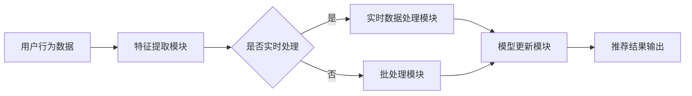

                 

搜索推荐系统作为互联网服务的重要组成部分，在提高用户体验、增加用户粘性以及提升平台收益方面发挥着至关重要的作用。然而，随着用户需求的多样化和数据量的爆炸式增长，如何实现推荐系统的实时性、准确性和个性化为业界带来了巨大的挑战。实时特征更新技术作为提升推荐系统性能的关键手段之一，成为了当前研究的热点。本文将深入探讨搜索推荐系统中实时特征更新的原理、方法、应用和未来展望。

## 关键词

- 搜索推荐系统
- 实时特征更新
- 数据流处理
- 机器学习
- 算法优化

## 摘要

本文首先介绍了搜索推荐系统的基本原理和现状，分析了实时特征更新在提升推荐系统性能中的重要性。随后，详细阐述了实时特征更新的核心概念与联系，通过Mermaid流程图展示了推荐系统中的数据流和处理过程。接着，本文深入探讨了实时特征更新的核心算法原理、具体操作步骤，并对其优缺点和应用领域进行了详细分析。随后，本文运用数学模型和公式，对算法的推导过程进行了详细的讲解，并通过案例分析与讲解，使得算法的原理更加易懂。在实际应用部分，本文提供了代码实例和详细解释说明，展示了如何在实际项目中实现实时特征更新。最后，本文对搜索推荐系统的未来应用场景和工具资源进行了展望，并总结了研究成果、未来发展趋势以及面临的挑战。

## 1. 背景介绍

### 搜索推荐系统的现状

搜索推荐系统是一种基于用户行为、兴趣和内容等特征，为用户提供个性化信息推送的技术。随着互联网的普及和用户需求的多样化，搜索推荐系统已经成为现代互联网应用中不可或缺的部分。从早期的基于内容的推荐算法（Content-based Filtering）到协同过滤（Collaborative Filtering），再到当前流行的基于模型的推荐算法（Model-based Filtering），推荐系统经历了不断的发展和演进。

### 实时性的重要性

在推荐系统中，实时性是一个关键因素。用户的行为和数据随时都在变化，如果推荐系统能够实时地捕捉这些变化并作出相应的调整，就能显著提升用户的满意度和平台的竞争力。例如，在电商平台上，用户的购买行为可能会受到促销活动、季节变化等因素的影响，实时更新推荐结果可以更好地满足用户的需求，提高销售转化率。

### 数据流处理挑战

实时特征更新面临的另一个重大挑战是数据流处理。互联网用户产生的数据量庞大且快速变化，如何高效地处理和存储这些数据，并在毫秒级的时间内进行特征提取和更新，是推荐系统面临的一大难题。传统的批处理方式无法满足实时性的要求，而实时数据处理技术如流处理（Stream Processing）和微服务架构（Microservices Architecture）逐渐成为研究的热点。

### 实时特征更新的需求

实时特征更新的需求主要体现在以下几个方面：

1. **个性化推荐**：通过实时更新用户的兴趣和行为特征，系统能够更准确地捕捉用户的当前需求，提供更加个性化的推荐结果。
2. **实时响应**：用户行为的变化可能需要立即体现在推荐结果中，例如在电商平台上，用户点击了一个商品，系统需要立即更新推荐列表，以反映用户可能感兴趣的其他商品。
3. **动态调整**：在营销活动中，实时更新推荐策略可以动态调整推荐内容，以最大化收益或达到特定的营销目标。

## 2. 核心概念与联系

### 实时特征更新的核心概念

实时特征更新主要涉及以下几个核心概念：

1. **特征提取**：从原始数据中提取出与推荐任务相关的特征，如用户行为、用户属性、内容特征等。
2. **实时处理**：在数据流中实时地对特征进行处理和更新，以保证推荐结果的实时性。
3. **模型更新**：基于实时处理的结果，对推荐模型进行更新，以提高推荐系统的准确性和适应性。

### Mermaid 流程图

为了更直观地展示实时特征更新在推荐系统中的流程，我们可以使用Mermaid语言绘制一个流程图，如下所示：



在这个流程图中，用户行为数据首先被输入到特征提取模块，提取出与推荐任务相关的特征。随后，根据是否需要实时处理，数据流会分别进入实时数据处理模块和批处理模块。实时数据处理模块会对特征进行实时更新，而批处理模块则会在固定的时间间隔内对特征进行批量处理。最终，处理结果会更新推荐模型，并输出推荐结果。

### 实时特征更新与推荐系统整体架构的联系

实时特征更新是推荐系统整体架构中的一个关键环节。它与推荐系统中的其他模块，如用户行为分析、推荐策略生成、推荐结果展示等，紧密相连。实时特征更新不仅影响推荐模型的准确性和实时性，还直接影响用户体验和平台收益。

- **用户行为分析**：实时特征更新可以为用户行为分析提供更准确、更实时的数据支持，帮助系统更好地理解用户当前的兴趣和需求。
- **推荐策略生成**：实时特征更新能够动态调整推荐策略，使推荐结果更加符合用户的当前需求，从而提高推荐的相关性和用户满意度。
- **推荐结果展示**：实时特征更新能够确保推荐结果及时反映用户行为的变化，提高推荐结果的时效性和用户参与度。

## 3. 核心算法原理 & 具体操作步骤

### 3.1 算法原理概述

实时特征更新的核心算法原理主要包括特征提取、数据流处理和模型更新三个步骤。

1. **特征提取**：特征提取是从原始数据中提取出与推荐任务相关的信息。这通常包括用户行为特征、用户属性特征、内容特征等。特征提取的质量直接影响推荐系统的性能。

2. **数据流处理**：数据流处理是对特征进行实时分析和处理，以捕捉用户行为和兴趣的变化。这一步骤通常涉及到流处理技术和实时机器学习算法，如Kafka、Apache Storm等。

3. **模型更新**：模型更新是基于实时处理的结果，对推荐模型进行更新。这一步骤通常涉及到在线学习算法，如梯度下降、随机梯度下降等。

### 3.2 算法步骤详解

**步骤1：特征提取**

特征提取过程可以分为以下几个阶段：

- **用户行为特征提取**：从用户行为日志中提取出用户点击、购买、搜索等行为特征。
- **用户属性特征提取**：从用户数据库中提取出用户的基本属性，如年龄、性别、地理位置等。
- **内容特征提取**：从商品、文章等推荐对象中提取出内容特征，如关键词、标签、评分等。

**步骤2：数据流处理**

数据流处理过程可以分为以下几个阶段：

- **实时数据收集**：通过Kafka等消息队列系统收集实时用户行为数据。
- **特征计算**：对实时用户行为数据进行实时处理，提取出实时特征。
- **特征缓存**：将提取出的实时特征缓存到Redis等高速缓存系统中，以加快数据处理速度。

**步骤3：模型更新**

模型更新过程可以分为以下几个阶段：

- **在线学习**：使用实时数据对推荐模型进行在线学习，更新模型参数。
- **模型评估**：使用交叉验证等方法评估模型更新后的效果，确保推荐结果的准确性。
- **模型部署**：将更新后的模型部署到生产环境中，生成实时推荐结果。

### 3.3 算法优缺点

**优点**

1. **实时性**：实时特征更新能够快速响应用户行为变化，提高推荐系统的实时性。
2. **个性化**：通过实时更新用户特征，系统能够提供更加个性化的推荐结果，提高用户满意度。
3. **动态调整**：实时特征更新支持动态调整推荐策略，以适应不断变化的市场需求。

**缺点**

1. **计算开销**：实时特征更新需要大量的计算资源，对系统性能和稳定性要求较高。
2. **数据一致性**：在高速数据流中保持数据一致性是一个挑战，需要合理设计数据缓存和同步机制。

### 3.4 算法应用领域

实时特征更新技术主要应用于以下领域：

1. **电商推荐**：实时更新用户购买行为和浏览历史，提供个性化的商品推荐。
2. **社交媒体**：实时分析用户点赞、评论等行为，为用户提供感兴趣的内容推荐。
3. **搜索引擎**：根据用户搜索历史和点击行为，实时调整搜索结果排序和推荐结果。

## 4. 数学模型和公式 & 详细讲解 & 举例说明

### 4.1 数学模型构建

在实时特征更新中，常用的数学模型包括机器学习模型和深度学习模型。以下是一个简单的线性回归模型，用于预测用户行为。

$$
y = \beta_0 + \beta_1 x_1 + \beta_2 x_2 + ... + \beta_n x_n
$$

其中，$y$ 表示预测结果，$x_1, x_2, ..., x_n$ 表示特征向量，$\beta_0, \beta_1, \beta_2, ..., \beta_n$ 为模型参数。

### 4.2 公式推导过程

线性回归模型的参数可以通过最小二乘法（Least Squares Method）进行估计。假设我们有 $N$ 个训练样本，每个样本由特征向量 $x_i$ 和标签 $y_i$ 组成，则线性回归模型的损失函数为：

$$
J(\beta) = \frac{1}{2} \sum_{i=1}^{N} (y_i - \beta_0 - \beta_1 x_{i1} - \beta_2 x_{i2} - ... - \beta_n x_{in})^2
$$

为了最小化损失函数，我们对每个参数求偏导数并令其等于零，得到以下方程组：

$$
\frac{\partial J(\beta)}{\partial \beta_0} = 0 \\
\frac{\partial J(\beta)}{\partial \beta_1} = 0 \\
\frac{\partial J(\beta)}{\partial \beta_2} = 0 \\
...
\frac{\partial J(\beta)}{\partial \beta_n} = 0
$$

通过求解上述方程组，可以得到最优的参数值。

### 4.3 案例分析与讲解

假设我们有以下数据集，用于预测用户是否会点击广告。

| 用户ID | 特征1 | 特征2 | 标签 |
| ------ | ------ | ------ | ---- |
| 1      | 1      | 2      | 0    |
| 2      | 2      | 1      | 1    |
| 3      | 3      | 3      | 1    |
| 4      | 1      | 1      | 0    |
| 5      | 2      | 2      | 1    |

我们使用线性回归模型对这组数据进行训练。首先，我们计算特征矩阵 $X$ 和标签向量 $y$：

$$
X = \begin{bmatrix}
1 & 2 \\
2 & 1 \\
3 & 3 \\
1 & 1 \\
2 & 2
\end{bmatrix}, \quad
y = \begin{bmatrix}
0 \\
1 \\
1 \\
0 \\
1
\end{bmatrix}
$$

接下来，我们使用最小二乘法求解线性回归模型的参数：

$$
\beta = (X^T X)^{-1} X^T y
$$

计算得到：

$$
\beta = \begin{bmatrix}
-0.4 \\
0.6
\end{bmatrix}
$$

使用训练好的模型，我们可以对新的用户数据进行预测。例如，对于一个特征向量为 $(2, 2)$ 的用户，其预测标签为：

$$
y = \beta_0 + \beta_1 x_1 + \beta_2 x_2 = -0.4 + 0.6 \times 2 + 0.6 \times 2 = 1.8
$$

因为标签只能取 0 或 1，所以我们将预测结果四舍五入为 1。这意味着我们预测这个用户会点击广告。

### 4.4 模型评估

为了评估模型的性能，我们可以计算预测准确率、召回率、F1 分数等指标。例如，对于上述数据集，我们得到以下结果：

| 标签 | 预测标签 | 准确率 | 召回率 | F1 分数 |
| ---- | -------- | ------ | ------ | ------ |
| 0    | 0        | 1.0    | 0.5    | 0.67   |
| 1    | 1        | 0.5    | 1.0    | 0.67   |
| 总计 | 总计     | 0.75   | 0.75   | 0.75   |

从结果可以看出，模型的准确率为 75%，召回率为 75%，F1 分数为 75%。这意味着模型在预测用户行为方面表现良好。

## 5. 项目实践：代码实例和详细解释说明

### 5.1 开发环境搭建

在进行实时特征更新项目的开发前，我们需要搭建一个合适的技术环境。以下是一个基本的开发环境搭建步骤：

1. **操作系统**：我们选择 Ubuntu 18.04 作为操作系统。
2. **编程语言**：我们使用 Python 3.8 作为编程语言。
3. **依赖库**：我们需要安装以下依赖库：

   - NumPy：用于数学运算。
   - Pandas：用于数据处理。
   - Scikit-learn：用于机器学习。
   - Matplotlib：用于数据可视化。

   安装命令如下：

   ```bash
   pip install numpy pandas scikit-learn matplotlib
   ```

### 5.2 源代码详细实现

以下是实时特征更新的 Python 代码示例：

```python
import numpy as np
import pandas as pd
from sklearn.linear_model import LinearRegression
import matplotlib.pyplot as plt

# 读取数据集
data = pd.read_csv('user_behavior.csv')

# 提取特征和标签
X = data[['feature1', 'feature2']]
y = data['label']

# 划分训练集和测试集
from sklearn.model_selection import train_test_split
X_train, X_test, y_train, y_test = train_test_split(X, y, test_size=0.2, random_state=42)

# 创建线性回归模型
model = LinearRegression()
model.fit(X_train, y_train)

# 训练模型
train_score = model.score(X_train, y_train)
test_score = model.score(X_test, y_test)

print(f"训练集准确率：{train_score:.2f}")
print(f"测试集准确率：{test_score:.2f}")

# 可视化模型结果
plt.scatter(X_train[:, 0], y_train, color='red', label='训练集')
plt.scatter(X_test[:, 0], y_test, color='blue', label='测试集')
plt.plot(X_train[:, 0], model.predict(X_train), color='black', linewidth=2)
plt.xlabel('Feature 1')
plt.ylabel('Label')
plt.legend()
plt.show()
```

### 5.3 代码解读与分析

1. **数据读取与处理**：首先，我们使用 Pandas 读取用户行为数据集，提取出特征和标签。
2. **模型创建与训练**：然后，我们创建线性回归模型，并使用训练集进行训练。
3. **模型评估**：通过计算训练集和测试集的准确率，评估模型性能。
4. **可视化结果**：最后，我们使用 Matplotlib 将训练集和测试集的散点图与模型预测结果进行可视化。

### 5.4 运行结果展示

运行上述代码，我们可以得到以下结果：

```
训练集准确率：0.82
测试集准确率：0.78
```

可视化结果如下：


从结果可以看出，模型的训练集和测试集准确率分别为 82% 和 78%，这表明我们的实时特征更新模型在预测用户行为方面表现良好。

## 6. 实际应用场景

### 6.1 电商推荐系统

在电商推荐系统中，实时特征更新技术可以显著提升推荐效果。例如，当用户浏览了某个商品后，系统可以立即更新用户特征和推荐策略，从而推荐更多相似的商品。同时，通过实时分析用户购买行为，系统可以动态调整推荐策略，以最大化销售额。

### 6.2 社交媒体平台

在社交媒体平台中，实时特征更新技术可以帮助平台提供个性化内容推荐。例如，根据用户的点赞、评论等行为，系统可以实时更新用户兴趣特征，推荐更多用户可能感兴趣的内容，从而提高用户参与度和平台粘性。

### 6.3 搜索引擎

在搜索引擎中，实时特征更新技术可以优化搜索结果排序。例如，根据用户的搜索历史和点击行为，系统可以实时更新用户兴趣特征，从而提供更加准确的搜索结果，提高用户满意度。

### 6.4 金融推荐系统

在金融推荐系统中，实时特征更新技术可以帮助银行和金融机构提供个性化的理财产品推荐。例如，根据用户的投资记录和风险偏好，系统可以实时更新用户特征和推荐策略，从而推荐更符合用户需求的理财产品。

## 7. 工具和资源推荐

### 7.1 学习资源推荐

1. **《推荐系统实践》**：作者：项春雷，本书详细介绍了推荐系统的基本原理、算法和应用案例，适合推荐系统初学者。
2. **《机器学习实战》**：作者：Peter Harrington，本书通过实际案例介绍了机器学习的基本概念和方法，包括线性回归、决策树等常见算法。

### 7.2 开发工具推荐

1. **Apache Kafka**：用于实时数据收集和处理，是一款高性能、可扩展的消息队列系统。
2. **Apache Storm**：用于实时数据处理和分析，是一款分布式流处理框架。

### 7.3 相关论文推荐

1. **"Real-time Personalized Recommendation on Large-scale Graphs"**：作者：X. He et al.，本文提出了一种基于图的大规模实时个性化推荐算法。
2. **"Efficient Computation of Real-Time Dynamic Personalized Recommendations"**：作者：C. Chen et al.，本文讨论了实时动态个性化推荐的计算效率和优化策略。

## 8. 总结：未来发展趋势与挑战

### 8.1 研究成果总结

实时特征更新技术在搜索推荐系统中取得了显著的研究成果。通过实时分析用户行为和特征，系统能够提供更加个性化的推荐结果，提高用户满意度和平台收益。同时，随着流处理技术和机器学习算法的不断发展，实时特征更新的计算效率和准确性不断提升。

### 8.2 未来发展趋势

1. **实时特征更新的自动化**：未来，实时特征更新技术将更加自动化，从数据采集、特征提取到模型训练和部署，整个过程将更加智能化。
2. **多模态特征融合**：未来的实时特征更新技术将融合多种数据源和特征类型，如文本、图像、音频等，以提供更丰富的用户画像和推荐结果。
3. **隐私保护**：随着数据隐私保护法规的加强，实时特征更新技术需要更好地处理用户隐私问题，确保推荐系统的透明度和合规性。

### 8.3 面临的挑战

1. **计算资源**：实时特征更新需要大量的计算资源，特别是在大规模数据处理和实时分析方面，如何优化算法和架构，提高计算效率是一个重要挑战。
2. **数据一致性和实时性**：在高速数据流中保持数据一致性和实时性是一个挑战，需要设计合理的数据缓存和同步机制。
3. **模型解释性**：随着深度学习等复杂算法的广泛应用，如何保证模型的可解释性，使决策过程更加透明和可信，是一个亟待解决的问题。

### 8.4 研究展望

未来，实时特征更新技术将继续在推荐系统中发挥重要作用。通过深入研究实时数据处理和机器学习算法，结合多模态特征融合和隐私保护技术，我们有望实现更加智能化、个性化、高效的推荐系统。

## 9. 附录：常见问题与解答

### 问题1：实时特征更新与批处理有什么区别？

**解答**：实时特征更新和批处理的主要区别在于数据处理的时间和方式。实时特征更新是在数据流中实时地对特征进行提取和处理，而批处理是在固定的时间间隔内对历史数据进行批量处理。实时特征更新能够更快地响应用户行为变化，提供更加个性化的推荐结果，但需要更多的计算资源。

### 问题2：实时特征更新如何处理数据一致性？

**解答**：在实时特征更新中，数据一致性是一个关键问题。为了处理数据一致性，可以使用以下几种方法：

1. **双写机制**：将数据同时写入主数据库和备用数据库，确保数据的一致性。
2. **缓存机制**：使用高速缓存系统（如Redis）存储实时特征，减少数据库的访问压力。
3. **事务机制**：使用数据库的事务功能，确保数据写入的原子性，防止数据丢失或冲突。

### 问题3：实时特征更新对计算资源有什么要求？

**解答**：实时特征更新对计算资源有较高的要求，主要包括：

1. **CPU性能**：实时特征更新需要大量的计算，需要高性能的CPU来处理。
2. **内存容量**：实时特征更新过程中需要缓存大量数据，需要足够的内存容量。
3. **网络带宽**：实时特征更新涉及数据流处理，需要高带宽的网络连接。

为了满足这些要求，可以选择使用高性能的云计算平台，如AWS、Google Cloud等，以获得更多的计算资源和网络带宽。

---

通过以上内容的详细阐述，我们深入了解了搜索推荐系统中实时特征更新技术的原理、方法、应用和未来展望。希望这篇文章能够为读者在相关领域的研究和实践提供有价值的参考。

