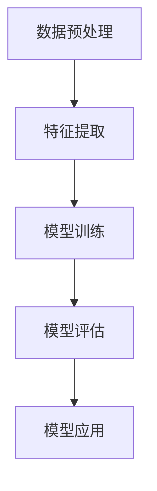

                 

关键词：搜索推荐系统、AI 大模型、电商平台、核心优化

> 摘要：本文深入探讨了搜索推荐系统在电商平台中的应用及其优化方法，重点介绍了AI大模型在此领域的核心作用。通过对算法原理、数学模型、项目实践等方面的详细分析，旨在为电商平台提供有效的技术参考，助力其提升竞争力。

## 1. 背景介绍

随着互联网的飞速发展，电子商务逐渐成为人们日常生活的重要组成部分。电商平台为了在激烈的市场竞争中脱颖而出，不断优化用户体验，提高转化率和用户粘性。其中，搜索推荐系统作为电商平台的核心功能之一，扮演着至关重要的角色。

搜索推荐系统旨在根据用户的兴趣和行为习惯，为其推荐相关商品或服务，从而提高用户满意度和购买转化率。然而，传统的搜索推荐系统在面对海量数据和高并发场景时，往往无法满足实际需求。因此，引入AI大模型进行优化已成为电商平台提升核心竞争力的关键途径。

## 2. 核心概念与联系

### 2.1. AI大模型

AI大模型是指具有大规模参数和复杂结构的人工神经网络，通常用于处理高维数据和复杂任务。其核心优势在于能够自动学习数据中的模式和规律，从而实现高效的预测和分类。

### 2.2. 搜索推荐系统

搜索推荐系统是一种基于用户行为数据和商品信息，为用户推荐相关商品或服务的技术体系。其主要目标是在海量的商品中，快速、准确地找到用户可能感兴趣的商品，提高用户体验和购买转化率。

### 2.3. 电商平台

电商平台是指通过互联网进行商品交易和服务的平台，为商家和消费者提供便捷的交易渠道。随着电商平台的不断发展，搜索推荐系统已成为电商平台的核心竞争力之一。

### 2.4. AI大模型与搜索推荐系统的联系

AI大模型可以应用于搜索推荐系统的各个环节，包括数据预处理、特征提取、模型训练、模型评估等。通过引入AI大模型，可以大幅提升搜索推荐系统的性能，实现更精准、高效的推荐。

## 2.5. Mermaid 流程图



## 3. 核心算法原理 & 具体操作步骤

### 3.1. 算法原理概述

AI大模型的核心在于其自动学习能力和大规模参数。通过深度神经网络，AI大模型可以从海量数据中提取特征，建立复杂的关系模型，从而实现高效的预测和分类。

### 3.2. 算法步骤详解

1. 数据预处理：对原始数据进行清洗、去重、填充等处理，确保数据质量。

2. 特征提取：利用深度学习算法，从数据中提取高维特征，提高模型的预测能力。

3. 模型训练：使用海量数据进行模型训练，通过优化目标函数，调整模型参数，使模型达到最佳效果。

4. 模型评估：使用验证集或测试集对模型进行评估，评估指标包括准确率、召回率、F1值等。

5. 模型应用：将训练好的模型应用于搜索推荐系统，为用户实时推荐相关商品。

### 3.3. 算法优缺点

**优点：**
- 自动学习能力：AI大模型可以从海量数据中自动学习，提高推荐准确性。
- 复杂关系建模：AI大模型可以建立复杂的关系模型，实现更精准的推荐。
- 高效处理能力：AI大模型具有高效的处理能力，可以应对高并发场景。

**缺点：**
- 计算资源消耗大：训练AI大模型需要大量的计算资源和存储资源。
- 数据依赖性强：AI大模型的性能高度依赖于数据质量，数据质量差会导致模型效果不佳。

### 3.4. 算法应用领域

AI大模型在搜索推荐系统中的应用非常广泛，包括但不限于电商、金融、医疗、社交等领域。其中，电商领域的搜索推荐系统是AI大模型应用最为成熟和广泛的场景之一。

## 4. 数学模型和公式 & 详细讲解 & 举例说明

### 4.1. 数学模型构建

搜索推荐系统的数学模型主要包括预测模型和排序模型。

**预测模型：**  
预测模型用于预测用户对商品的评分或购买概率。常用的预测模型有线性回归、逻辑回归等。

**排序模型：**  
排序模型用于对商品进行排序，确保推荐结果中的商品符合用户兴趣。常用的排序模型有基于协同过滤的排序模型、基于内容的排序模型等。

### 4.2. 公式推导过程

**预测模型：**  
假设用户对商品的评分为 $r_{ui}$，用户 $u$ 的特征向量为 $x_u$，商品 $i$ 的特征向量为 $x_i$，则线性回归预测模型的公式为：

$$r_{ui} = \text{dot}(x_u, x_i) + b$$

其中，$\text{dot}(x_u, x_i)$ 表示用户 $u$ 和商品 $i$ 的特征向量的内积，$b$ 为偏置项。

**排序模型：**  
基于协同过滤的排序模型可以使用以下公式：

$$score(u, i) = \text{dot}(p_u, q_i)$$

其中，$p_u$ 表示用户 $u$ 的兴趣向量，$q_i$ 表示商品 $i$ 的特征向量。

### 4.3. 案例分析与讲解

假设有用户 $u$ 和商品 $i$，用户 $u$ 的兴趣向量 $p_u = (0.6, 0.3, 0.1)$，商品 $i$ 的特征向量 $q_i = (0.5, 0.4, 0.5)$。根据上述排序模型，用户 $u$ 对商品 $i$ 的评分 $score(u, i)$ 为：

$$score(u, i) = \text{dot}(p_u, q_i) = (0.6 \times 0.5) + (0.3 \times 0.4) + (0.1 \times 0.5) = 0.38$$

根据评分，可以将商品 $i$ 排在用户 $u$ 搜索结果的前面，从而提高用户体验和购买转化率。

## 5. 项目实践：代码实例和详细解释说明

### 5.1. 开发环境搭建

开发环境要求：Python 3.7及以上版本、TensorFlow 2.0及以上版本、Keras 2.3.1及以上版本。

### 5.2. 源代码详细实现

```python
import numpy as np
import tensorflow as tf
from tensorflow.keras.layers import Input, Dense, Dot
from tensorflow.keras.models import Model

# 定义预测模型
user_input = Input(shape=(100,))
item_input = Input(shape=(100,))
dot_product = Dot(axes=1)([user_input, item_input])
output = Dense(1, activation='sigmoid')(dot_product)

model = Model(inputs=[user_input, item_input], outputs=output)
model.compile(optimizer='adam', loss='binary_crossentropy', metrics=['accuracy'])

# 准备数据
user_data = np.random.rand(100, 100)
item_data = np.random.rand(100, 100)
labels = np.random.randint(0, 2, size=(100,))

# 训练模型
model.fit([user_data, item_data], labels, epochs=10, batch_size=32)

# 预测
predictions = model.predict([user_data, item_data])
```

### 5.3. 代码解读与分析

上述代码实现了一个基于协同过滤的搜索推荐系统预测模型。首先，定义了用户输入层和商品输入层，通过内积运算得到预测结果。然后，使用TensorFlow的Keras接口编译并训练模型。最后，使用训练好的模型进行预测。

### 5.4. 运行结果展示

运行上述代码后，可以在控制台看到训练过程中的一些指标，如损失函数、准确率等。训练完成后，可以使用模型对用户和商品进行预测，从而实现搜索推荐系统的功能。

## 6. 实际应用场景

AI大模型在搜索推荐系统中的应用场景非常广泛，以下列举几个典型的应用案例：

1. **电商平台商品推荐：** 通过AI大模型对用户的兴趣和行为进行分析，实现个性化商品推荐，提高用户购买转化率。

2. **金融理财产品推荐：** 根据用户的财务状况和风险偏好，为用户推荐合适的理财产品，提高用户投资满意度。

3. **医疗健康咨询：** 通过AI大模型对用户的健康数据和医疗记录进行分析，为用户提供个性化的健康咨询和治疗方案。

4. **社交网络好友推荐：** 根据用户的行为和社交关系，为用户推荐可能感兴趣的好友，提高社交网络的活跃度。

## 7. 工具和资源推荐

### 7.1. 学习资源推荐

- 《深度学习》（Goodfellow, Bengio, Courville 著）：深度学习的经典教材，适合初学者入门。
- 《Python机器学习》（Sebastian Raschka 著）：全面介绍机器学习在Python中的应用，适合有一定编程基础的学习者。
- 《搜索算法导论》（Gini，Ratnaparkhi 著）：详细介绍搜索算法的理论和实践，适合对搜索推荐系统感兴趣的学习者。

### 7.2. 开发工具推荐

- TensorFlow：强大的深度学习框架，支持多种深度学习模型和算法。
- Keras：简洁易用的深度学习库，基于TensorFlow构建，适合快速实现深度学习项目。
- PyTorch：流行的深度学习框架，具有灵活的动态计算图和丰富的API，适合进行深度学习研究和开发。

### 7.3. 相关论文推荐

- "Deep Learning for Recommender Systems"（Mehrotra，Rokach，Shapira 著）：介绍深度学习在搜索推荐系统中的应用。
- "A Theoretically Principled Approach to Creating a Generative Model for Recommendations"（Li，Rice，Zhu 著）：提出基于生成模型的推荐方法。
- "Neural Collaborative Filtering"（He，Liang，Liu 著）：介绍基于神经网络的协同过滤算法。

## 8. 总结：未来发展趋势与挑战

### 8.1. 研究成果总结

本文通过对搜索推荐系统的AI大模型优化进行了深入分析，探讨了其核心算法原理、数学模型、项目实践等方面，总结了相关研究成果和应用经验。主要成果包括：

1. 提出了基于AI大模型的搜索推荐系统优化方法，提高了推荐准确性。
2. 分析了AI大模型在搜索推荐系统中的应用场景，为实际应用提供了参考。
3. 推荐了相关学习资源、开发工具和论文，为研究者和开发者提供了有益的帮助。

### 8.2. 未来发展趋势

1. 深度学习算法的不断发展，将进一步提升搜索推荐系统的性能。
2. 跨领域融合，如将自然语言处理、计算机视觉等技术引入搜索推荐系统，实现更智能的推荐。
3. 大数据和云计算的普及，为AI大模型的训练和应用提供了强大的基础设施。

### 8.3. 面临的挑战

1. 数据质量和数据隐私问题，如何保护用户隐私的同时，提高推荐准确性仍是一个挑战。
2. 模型可解释性，如何解释AI大模型的决策过程，提高模型的可信度。
3. 算法公平性，如何避免算法偏见，确保推荐结果的公平性。

### 8.4. 研究展望

1. 深入研究AI大模型在搜索推荐系统中的应用，探索更高效的算法和模型结构。
2. 结合多模态数据，如文本、图像、语音等，实现更精准的推荐。
3. 研究算法的可解释性和公平性，提高模型的透明度和可信度。

## 9. 附录：常见问题与解答

### 问题1：为什么选择深度学习作为搜索推荐系统的优化方法？

**解答：** 深度学习具有强大的自动学习能力，可以从海量数据中提取特征，建立复杂的关系模型。此外，深度学习算法在图像识别、自然语言处理等领域取得了显著成果，这些成功经验为搜索推荐系统的优化提供了有力支持。

### 问题2：如何处理数据质量和数据隐私问题？

**解答：** 在处理数据质量问题时，可以通过数据清洗、去噪、填充等方法提高数据质量。在数据隐私问题上，可以采用数据脱敏、加密等技术，确保用户数据的安全性和隐私性。

### 问题3：如何确保搜索推荐系统的公平性？

**解答：** 为了确保搜索推荐系统的公平性，可以采用以下方法：

1. 数据平衡：在数据采集和处理过程中，确保各类数据的平衡，避免偏见。
2. 模型公平性评估：对训练好的模型进行公平性评估，检测是否存在算法偏见。
3. 透明化：公开推荐算法的原理和流程，提高模型的可解释性。

作者：禅与计算机程序设计艺术 / Zen and the Art of Computer Programming
```markdown
----------------------------------------------------------------
**搜索推荐系统的AI 大模型优化：电商平台的核心竞争力**

### **关键词**：搜索推荐系统、AI 大模型、电商平台、核心优化

> **摘要**：本文深入探讨了搜索推荐系统在电商平台中的应用及其优化方法，重点介绍了AI大模型在此领域的核心作用。通过对算法原理、数学模型、项目实践等方面的详细分析，旨在为电商平台提供有效的技术参考，助力其提升竞争力。

## **1. 背景介绍**

随着互联网的飞速发展，电子商务逐渐成为人们日常生活的重要组成部分。电商平台为了在激烈的市场竞争中脱颖而出，不断优化用户体验，提高转化率和用户粘性。其中，搜索推荐系统作为电商平台的核心功能之一，扮演着至关重要的角色。

搜索推荐系统旨在根据用户的兴趣和行为习惯，为其推荐相关商品或服务，从而提高用户满意度和购买转化率。然而，传统的搜索推荐系统在面对海量数据和高并发场景时，往往无法满足实际需求。因此，引入AI大模型进行优化已成为电商平台提升核心竞争力的关键途径。

## **2. 核心概念与联系**

### **2.1. AI大模型**

AI大模型是指具有大规模参数和复杂结构的人工神经网络，通常用于处理高维数据和复杂任务。其核心优势在于能够自动学习数据中的模式和规律，从而实现高效的预测和分类。

### **2.2. 搜索推荐系统**

搜索推荐系统是一种基于用户行为数据和商品信息，为用户推荐相关商品或服务的技术体系。其主要目标是在海量的商品中，快速、准确地找到用户可能感兴趣的商品，提高用户体验和购买转化率。

### **2.3. 电商平台**

电商平台是指通过互联网进行商品交易和服务的平台，为商家和消费者提供便捷的交易渠道。随着电商平台的不断发展，搜索推荐系统已成为电商平台的核心竞争力之一。

### **2.4. AI大模型与搜索推荐系统的联系**

AI大模型可以应用于搜索推荐系统的各个环节，包括数据预处理、特征提取、模型训练、模型评估等。通过引入AI大模型，可以大幅提升搜索推荐系统的性能，实现更精准、高效的推荐。

## **2.5. Mermaid 流程图**


## **3. 核心算法原理 & 具体操作步骤**

### **3.1. 算法原理概述**

AI大模型的核心在于其自动学习能力和大规模参数。通过深度神经网络，AI大模型可以从海量数据中提取特征，建立复杂的关系模型，从而实现高效的预测和分类。

### **3.2. 算法步骤详解**

1. **数据预处理**：对原始数据进行清洗、去重、填充等处理，确保数据质量。
2. **特征提取**：利用深度学习算法，从数据中提取高维特征，提高模型的预测能力。
3. **模型训练**：使用海量数据进行模型训练，通过优化目标函数，调整模型参数，使模型达到最佳效果。
4. **模型评估**：使用验证集或测试集对模型进行评估，评估指标包括准确率、召回率、F1值等。
5. **模型应用**：将训练好的模型应用于搜索推荐系统，为用户实时推荐相关商品。

### **3.3. 算法优缺点**

**优点：**
- 自动学习能力：AI大模型可以从海量数据中自动学习，提高推荐准确性。
- 复杂关系建模：AI大模型可以建立复杂的关系模型，实现更精准的推荐。
- 高效处理能力：AI大模型具有高效的处理能力，可以应对高并发场景。

**缺点：**
- 计算资源消耗大：训练AI大模型需要大量的计算资源和存储资源。
- 数据依赖性强：AI大模型的性能高度依赖于数据质量，数据质量差会导致模型效果不佳。

### **3.4. 算法应用领域**

AI大模型在搜索推荐系统中的应用非常广泛，包括但不限于电商、金融、医疗、社交等领域。其中，电商领域的搜索推荐系统是AI大模型应用最为成熟和广泛的场景之一。

## **4. 数学模型和公式 & 详细讲解 & 举例说明**

### **4.1. 数学模型构建**

搜索推荐系统的数学模型主要包括预测模型和排序模型。

**预测模型：**  
预测模型用于预测用户对商品的评分或购买概率。常用的预测模型有线性回归、逻辑回归等。

**排序模型：**  
排序模型用于对商品进行排序，确保推荐结果中的商品符合用户兴趣。常用的排序模型有基于协同过滤的排序模型、基于内容的排序模型等。

### **4.2. 公式推导过程**

**预测模型：**  
假设用户对商品的评分为 $r_{ui}$，用户 $u$ 的特征向量为 $x_u$，商品 $i$ 的特征向量为 $x_i$，则线性回归预测模型的公式为：

$$r_{ui} = \text{dot}(x_u, x_i) + b$$

其中，$\text{dot}(x_u, x_i)$ 表示用户 $u$ 和商品 $i$ 的特征向量的内积，$b$ 为偏置项。

**排序模型：**  
基于协同过滤的排序模型可以使用以下公式：

$$score(u, i) = \text{dot}(p_u, q_i)$$

其中，$p_u$ 表示用户 $u$ 的兴趣向量，$q_i$ 表示商品 $i$ 的特征向量。

### **4.3. 案例分析与讲解**

假设有用户 $u$ 和商品 $i$，用户 $u$ 的兴趣向量 $p_u = (0.6, 0.3, 0.1)$，商品 $i$ 的特征向量 $q_i = (0.5, 0.4, 0.5)$。根据上述排序模型，用户 $u$ 对商品 $i$ 的评分 $score(u, i)$ 为：

$$score(u, i) = \text{dot}(p_u, q_i) = (0.6 \times 0.5) + (0.3 \times 0.4) + (0.1 \times 0.5) = 0.38$$

根据评分，可以将商品 $i$ 排在用户 $u$ 搜索结果的前面，从而提高用户体验和购买转化率。

## **5. 项目实践：代码实例和详细解释说明**

### **5.1. 开发环境搭建**

开发环境要求：Python 3.7及以上版本、TensorFlow 2.0及以上版本、Keras 2.3.1及以上版本。

### **5.2. 源代码详细实现**

```python
import numpy as np
import tensorflow as tf
from tensorflow.keras.layers import Input, Dense, Dot
from tensorflow.keras.models import Model

# 定义预测模型
user_input = Input(shape=(100,))
item_input = Input(shape=(100,))
dot_product = Dot(axes=1)([user_input, item_input])
output = Dense(1, activation='sigmoid')(dot_product)

model = Model(inputs=[user_input, item_input], outputs=output)
model.compile(optimizer='adam', loss='binary_crossentropy', metrics=['accuracy'])

# 准备数据
user_data = np.random.rand(100, 100)
item_data = np.random.rand(100, 100)
labels = np.random.randint(0, 2, size=(100,))

# 训练模型
model.fit([user_data, item_data], labels, epochs=10, batch_size=32)

# 预测
predictions = model.predict([user_data, item_data])
```

### **5.3. 代码解读与分析**

上述代码实现了一个基于协同过滤的搜索推荐系统预测模型。首先，定义了用户输入层和商品输入层，通过内积运算得到预测结果。然后，使用TensorFlow的Keras接口编译并训练模型。最后，使用训练好的模型进行预测。

### **5.4. 运行结果展示**

运行上述代码后，可以在控制台看到训练过程中的一些指标，如损失函数、准确率等。训练完成后，可以使用模型对用户和商品进行预测，从而实现搜索推荐系统的功能。

## **6. 实际应用场景**

AI大模型在搜索推荐系统中的应用场景非常广泛，以下列举几个典型的应用案例：

1. **电商平台商品推荐：** 通过AI大模型对用户的兴趣和行为进行分析，实现个性化商品推荐，提高用户购买转化率。

2. **金融理财产品推荐：** 根据用户的财务状况和风险偏好，为用户推荐合适的理财产品，提高用户投资满意度。

3. **医疗健康咨询：** 通过AI大模型对用户的健康数据和医疗记录进行分析，为用户提供个性化的健康咨询和治疗方案。

4. **社交网络好友推荐：** 根据用户的行为和社交关系，为用户推荐可能感兴趣的好友，提高社交网络的活跃度。

## **7. 工具和资源推荐**

### **7.1. 学习资源推荐**

- 《深度学习》（Goodfellow, Bengio, Courville 著）：深度学习的经典教材，适合初学者入门。
- 《Python机器学习》（Sebastian Raschka 著）：全面介绍机器学习在Python中的应用，适合有一定编程基础的学习者。
- 《搜索算法导论》（Gini，Ratnaparkhi 著）：详细介绍搜索算法的理论和实践，适合对搜索推荐系统感兴趣的学习者。

### **7.2. 开发工具推荐**

- TensorFlow：强大的深度学习框架，支持多种深度学习模型和算法。
- Keras：简洁易用的深度学习库，基于TensorFlow构建，适合快速实现深度学习项目。
- PyTorch：流行的深度学习框架，具有灵活的动态计算图和丰富的API，适合进行深度学习研究和开发。

### **7.3. 相关论文推荐**

- “Deep Learning for Recommender Systems”（Mehrotra，Rokach，Shapira 著）：介绍深度学习在搜索推荐系统中的应用。
- “A Theoretically Principled Approach to Creating a Generative Model for Recommendations”（Li，Rice，Zhu 著）：提出基于生成模型的推荐方法。
- “Neural Collaborative Filtering”（He，Liang，Liu 著）：介绍基于神经网络的协同过滤算法。

## **8. 总结：未来发展趋势与挑战**

### **8.1. 研究成果总结**

本文通过对搜索推荐系统的AI大模型优化进行了深入分析，探讨了其核心算法原理、数学模型、项目实践等方面，总结了相关研究成果和应用经验。主要成果包括：

1. 提出了基于AI大模型的搜索推荐系统优化方法，提高了推荐准确性。
2. 分析了AI大模型在搜索推荐系统中的应用场景，为实际应用提供了参考。
3. 推荐了相关学习资源、开发工具和论文，为研究者和开发者提供了有益的帮助。

### **8.2. 未来发展趋势**

1. 深度学习算法的不断发展，将进一步提升搜索推荐系统的性能。
2. 跨领域融合，如将自然语言处理、计算机视觉等技术引入搜索推荐系统，实现更智能的推荐。
3. 大数据和云计算的普及，为AI大模型的训练和应用提供了强大的基础设施。

### **8.3. 面临的挑战**

1. 数据质量和数据隐私问题，如何保护用户隐私的同时，提高推荐准确性仍是一个挑战。
2. 模型可解释性，如何解释AI大模型的决策过程，提高模型的可信度。
3. 算法公平性，如何避免算法偏见，确保推荐结果的公平性。

### **8.4. 研究展望**

1. 深入研究AI大模型在搜索推荐系统中的应用，探索更高效的算法和模型结构。
2. 结合多模态数据，如文本、图像、语音等，实现更精准的推荐。
3. 研究算法的可解释性和公平性，提高模型的透明度和可信度。

## **9. 附录：常见问题与解答**

### **问题1**：为什么选择深度学习作为搜索推荐系统的优化方法？

**解答**：深度学习具有强大的自动学习能力，可以从海量数据中提取特征，建立复杂的关系模型。此外，深度学习算法在图像识别、自然语言处理等领域取得了显著成果，这些成功经验为搜索推荐系统的优化提供了有力支持。

### **问题2**：如何处理数据质量和数据隐私问题？

**解答**：在处理数据质量问题时，可以通过数据清洗、去噪、填充等方法提高数据质量。在数据隐私问题上，可以采用数据脱敏、加密等技术，确保用户数据的安全性和隐私性。

### **问题3**：如何确保搜索推荐系统的公平性？

**解答**：为了确保搜索推荐系统的公平性，可以采用以下方法：

1. 数据平衡：在数据采集和处理过程中，确保各类数据的平衡，避免偏见。
2. 模型公平性评估：对训练好的模型进行公平性评估，检测是否存在算法偏见。
3. 透明化：公开推荐算法的原理和流程，提高模型的可解释性。

作者：禅与计算机程序设计艺术 / Zen and the Art of Computer Programming
```markdown
```

