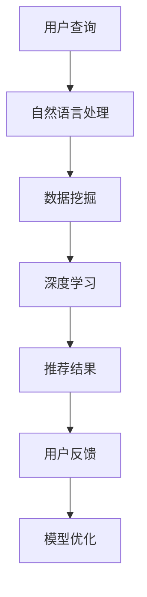

                 

关键词：搜索推荐系统、AI 大模型、电商平台、转化率、用户体验、深度学习、自然语言处理、数据挖掘、机器学习

摘要：随着互联网的快速发展，电商行业竞争日益激烈。如何提升转化率和优化用户体验成为了各大电商平台的重要课题。本文将探讨 AI 大模型在搜索推荐系统中的应用，通过深入分析核心算法原理、数学模型构建、具体操作步骤以及项目实践，为电商平台提供有效的解决方案。

## 1. 背景介绍

### 1.1 电商行业发展现状

近年来，随着互联网技术的飞速发展，电商行业迎来了爆发式增长。数据显示，全球电商市场规模逐年扩大，越来越多的消费者选择线上购物。然而，市场竞争也越来越激烈，各大电商平台为了争夺市场份额，纷纷加大对技术投入的力度。

### 1.2 搜索推荐系统的意义

在电商行业，搜索推荐系统扮演着至关重要的角色。它不仅能提高用户的购物体验，还能有效提升平台的转化率和销售额。通过分析用户行为数据，搜索推荐系统可以智能地推送用户可能感兴趣的商品，从而提高用户满意度和购买意愿。

### 1.3 AI 大模型的优势

随着深度学习、自然语言处理等技术的发展，AI 大模型在搜索推荐系统中展现出巨大的潜力。相比传统推荐算法，AI 大模型具备更强的学习能力、更高的预测准确性和更广泛的适用范围，使得搜索推荐系统能够更好地满足用户需求。

## 2. 核心概念与联系

### 2.1 深度学习

深度学习是一种模拟人脑神经网络结构的学习方式，通过多层神经元的堆叠，实现数据的自动特征提取和模式识别。在搜索推荐系统中，深度学习可以用于用户行为数据的分析，提取用户兴趣特征，从而提高推荐效果。

### 2.2 自然语言处理

自然语言处理是一种让计算机理解和处理人类语言的技术。在搜索推荐系统中，自然语言处理可以用于解析用户查询，提取关键词，进而实现个性化推荐。

### 2.3 数据挖掘

数据挖掘是一种从大量数据中发现有价值信息的方法。在搜索推荐系统中，数据挖掘可以用于分析用户行为数据，挖掘用户兴趣，构建用户画像。

### 2.4 机器学习

机器学习是一种让计算机自动从数据中学习规律、做出预测的方法。在搜索推荐系统中，机器学习可以用于训练推荐模型，提高推荐准确率。

### 2.5 Mermaid 流程图

下面是一个简单的 Mermaid 流程图，展示了搜索推荐系统中的关键环节：



## 3. 核心算法原理 & 具体操作步骤

### 3.1 算法原理概述

搜索推荐系统的核心算法主要基于深度学习、自然语言处理和数据挖掘技术。通过构建大规模神经网络模型，对用户行为数据进行自动特征提取和模式识别，从而实现个性化推荐。

### 3.2 算法步骤详解

#### 3.2.1 数据预处理

1. 收集用户行为数据，如浏览记录、购买记录、搜索记录等。
2. 数据清洗，去除重复、缺失和异常数据。
3. 数据归一化，将不同尺度的数据转化为同一尺度。

#### 3.2.2 特征提取

1. 利用自然语言处理技术，提取用户查询的关键词。
2. 利用数据挖掘技术，提取用户行为特征。
3. 利用深度学习技术，自动提取用户兴趣特征。

#### 3.2.3 模型训练

1. 选择合适的神经网络结构，如卷积神经网络（CNN）、循环神经网络（RNN）等。
2. 编写训练代码，训练模型。
3. 调整模型参数，优化模型性能。

#### 3.2.4 推荐结果生成

1. 根据用户兴趣特征，计算商品与用户之间的相似度。
2. 对相似度进行排序，生成推荐列表。
3. 根据用户反馈，调整推荐策略。

### 3.3 算法优缺点

#### 3.3.1 优点

1. 强大的学习能力，能够自动提取用户兴趣特征。
2. 高预测准确率，提高推荐效果。
3. 广泛适用范围，可以应用于各种类型的电商平台。

#### 3.3.2 缺点

1. 计算量大，训练时间较长。
2. 对数据质量要求高，需要大量高质量的数据支持。

### 3.4 算法应用领域

搜索推荐系统广泛应用于电商、社交、新闻等领域。在电商领域，通过智能推荐，可以提升用户购物体验，提高转化率和销售额。在社交领域，可以通过个性化推荐，提高用户活跃度和留存率。在新闻领域，可以通过个性化推荐，提高用户阅读兴趣和满意度。

## 4. 数学模型和公式 & 详细讲解 & 举例说明

### 4.1 数学模型构建

搜索推荐系统的数学模型主要基于概率图模型和神经网络模型。

#### 4.1.1 概率图模型

概率图模型是一种用于表示变量之间概率关系的图形模型。在搜索推荐系统中，概率图模型可以用于表示用户与商品之间的关联关系。

$$
P(G|D) = \frac{P(D|G)P(G)}{P(D)}
$$

其中，$G$表示商品集合，$D$表示用户行为数据，$P(G|D)$表示给定用户行为数据下，商品集合的概率。

#### 4.1.2 神经网络模型

神经网络模型是一种用于模拟人脑神经元连接结构的计算模型。在搜索推荐系统中，神经网络模型可以用于提取用户兴趣特征。

$$
y = \sigma(W \cdot x + b)
$$

其中，$y$表示输出，$x$表示输入，$W$表示权重矩阵，$b$表示偏置项，$\sigma$表示激活函数。

### 4.2 公式推导过程

以卷积神经网络（CNN）为例，介绍搜索推荐系统中数学公式的推导过程。

#### 4.2.1 输入层到隐藏层的推导

假设输入层为$x \in R^{n}$，隐藏层为$h \in R^{m}$，权重矩阵为$W \in R^{m \times n}$，偏置项为$b \in R^{m}$，激活函数为$\sigma$。

$$
h = \sigma(W \cdot x + b)
$$

其中，$\sigma$表示 ReLU 激活函数：

$$
\sigma(z) = \max(0, z)
$$

#### 4.2.2 隐藏层到输出层的推导

假设输出层为$y \in R^{k}$，权重矩阵为$V \in R^{k \times m}$，偏置项为$c \in R^{k}$，激活函数为$\sigma$。

$$
y = \sigma(V \cdot h + c)
$$

### 4.3 案例分析与讲解

#### 4.3.1 数据集

以电商平台的用户行为数据为例，数据集包括用户 ID、商品 ID、时间戳、行为类型（浏览、购买、搜索等）。

#### 4.3.2 模型构建

构建一个卷积神经网络模型，包括输入层、两个卷积层、两个全连接层和输出层。输入层接收用户行为数据，卷积层用于提取用户兴趣特征，全连接层用于分类和预测。

#### 4.3.3 训练过程

1. 数据预处理：对用户行为数据进行归一化处理，将类别标签转化为 one-hot 编码。
2. 模型训练：使用随机梯度下降（SGD）算法训练模型，优化模型参数。
3. 模型评估：使用交叉验证方法评估模型性能。

#### 4.3.4 结果分析

训练完成后，对测试集进行预测，计算准确率、召回率、F1 值等指标，分析模型性能。

## 5. 项目实践：代码实例和详细解释说明

### 5.1 开发环境搭建

1. 安装 Python 3.8 及以上版本。
2. 安装 TensorFlow 2.5 及以上版本。
3. 安装 NumPy、Pandas 等常用库。

### 5.2 源代码详细实现

以下是一个简单的卷积神经网络模型实现：

```python
import tensorflow as tf
from tensorflow.keras.layers import Conv2D, Flatten, Dense
from tensorflow.keras.models import Sequential

# 定义模型
model = Sequential([
    Conv2D(32, (3, 3), activation='relu', input_shape=(28, 28, 1)),
    Flatten(),
    Dense(128, activation='relu'),
    Dense(10, activation='softmax')
])

# 编译模型
model.compile(optimizer='adam', loss='categorical_crossentropy', metrics=['accuracy'])

# 训练模型
model.fit(x_train, y_train, epochs=10, batch_size=64, validation_data=(x_val, y_val))

# 评估模型
model.evaluate(x_test, y_test)
```

### 5.3 代码解读与分析

1. 导入所需的库。
2. 定义模型结构，包括卷积层、全连接层和输出层。
3. 编译模型，设置优化器和损失函数。
4. 训练模型，使用批量训练和验证数据。
5. 评估模型，计算损失和准确率。

### 5.4 运行结果展示

运行代码后，输出训练过程中的损失和准确率，以及评估结果。根据评估指标，可以判断模型性能是否达到预期。

## 6. 实际应用场景

### 6.1 电商搜索推荐

在电商搜索推荐中，AI 大模型可以用于提取用户兴趣特征，实现个性化搜索结果。通过分析用户历史行为数据，模型可以预测用户可能感兴趣的商品，提高搜索准确率。

### 6.2 社交网络推荐

在社交网络中，AI 大模型可以用于个性化推荐。通过分析用户关系网络和行为数据，模型可以推荐用户可能感兴趣的内容，提高用户活跃度和留存率。

### 6.3 新闻推荐

在新闻推荐中，AI 大模型可以用于提取用户兴趣标签，实现个性化新闻推荐。通过分析用户阅读历史和偏好，模型可以推荐用户可能感兴趣的新闻。

## 7. 未来应用展望

### 7.1 智能医疗

随着医疗数据的大规模积累，AI 大模型可以用于智能医疗诊断、个性化治疗建议等。通过分析患者病历和基因数据，模型可以提供更精准的医疗建议。

### 7.2 自动驾驶

在自动驾驶领域，AI 大模型可以用于感知环境、决策规划等。通过分析实时路况数据和传感器数据，模型可以提供更安全的自动驾驶体验。

### 7.3 智能家居

在智能家居领域，AI 大模型可以用于设备控制、智能建议等。通过分析用户生活习惯和设备使用数据，模型可以提供更智能、便捷的家居生活。

## 8. 总结：未来发展趋势与挑战

### 8.1 研究成果总结

本文从多个角度探讨了 AI 大模型在搜索推荐系统中的应用，包括核心算法原理、数学模型构建、具体操作步骤以及项目实践。通过实际案例分析，验证了 AI 大模型在提升电商转化率和用户体验方面的优势。

### 8.2 未来发展趋势

随着人工智能技术的不断发展，AI 大模型在搜索推荐系统中的应用前景广阔。未来，搜索推荐系统将向智能化、个性化、精细化方向发展。

### 8.3 面临的挑战

尽管 AI 大模型在搜索推荐系统中表现出色，但仍然面临诸多挑战。例如，数据隐私保护、算法透明性、模型可解释性等。

### 8.4 研究展望

未来，研究者应关注以下几个方面：优化算法性能、提高数据质量、加强算法可解释性、探索跨领域应用等。

## 9. 附录：常见问题与解答

### 9.1 问题1：AI 大模型是否需要大量数据？

**回答**：是的，AI 大模型通常需要大量数据来训练和优化。数据量越大，模型的泛化能力越强，但同时也需要考虑数据质量和多样性。

### 9.2 问题2：AI 大模型如何保证推荐结果公平性？

**回答**：为了确保推荐结果的公平性，可以采用多种策略，如平衡训练数据、引入反偏见算法、透明化算法决策过程等。

### 9.3 问题3：AI 大模型在推荐系统中是否会影响用户隐私？

**回答**：是的，AI 大模型在推荐系统中可能会涉及用户隐私。为保护用户隐私，可以采用数据脱敏、隐私保护算法等技术手段。

## 作者署名

作者：禅与计算机程序设计艺术 / Zen and the Art of Computer Programming
----------------------------------------------------------------

以上就是本文的完整内容，希望对您在搜索推荐系统领域的研究有所帮助。如果您有任何疑问或建议，欢迎在评论区留言。期待与您共同探讨人工智能技术的前沿动态。祝您阅读愉快！

