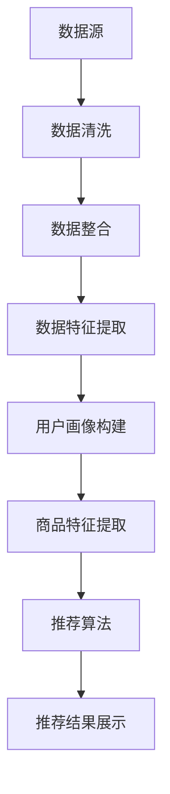
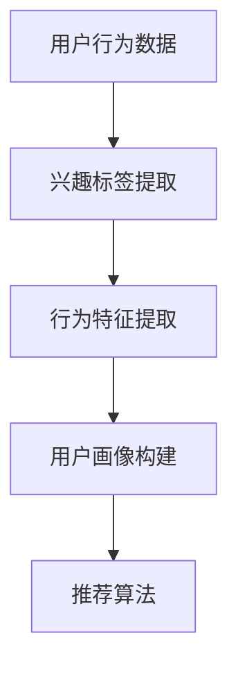
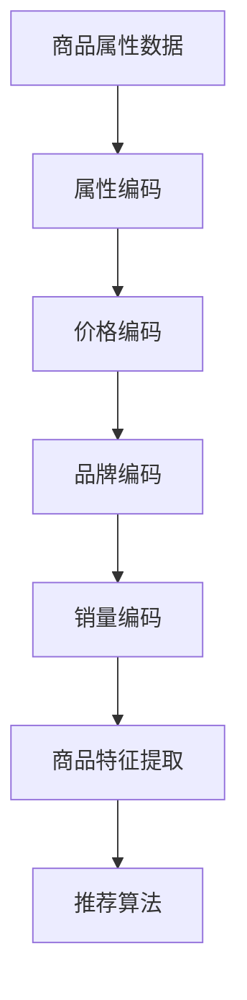
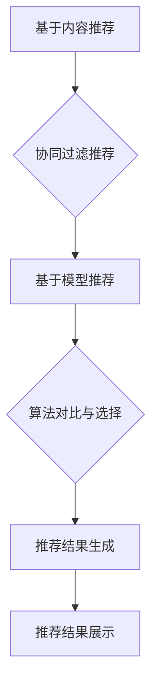
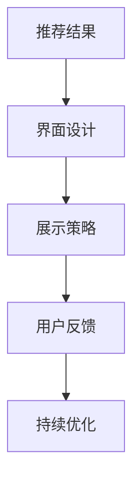

                 

关键词：搜索推荐系统，AI 大模型，电商平台，转化率，用户粘性，算法原理，数学模型，项目实践

## 摘要

本文旨在探讨如何通过AI大模型应用来优化搜索推荐系统，从而显著提高电商平台的转化率和用户粘性。文章首先介绍了搜索推荐系统的基础概念和重要性，随后详细阐述了AI大模型的基本原理和应用。在核心算法原理部分，本文将深入探讨常见的推荐算法，如协同过滤、矩阵分解和深度学习推荐，并讨论其优缺点。接着，文章通过数学模型和公式对推荐系统的关键参数进行了详细讲解，并提供了实际案例的分析。在项目实践部分，我们将通过具体代码实例展示如何构建和优化推荐系统。最后，本文对推荐系统在实际应用场景中的作用进行了分析，并展望了其未来的发展趋势和挑战。

## 1. 背景介绍

随着互联网的飞速发展，电商平台已经成为人们日常购物的主要渠道。然而，面对海量的商品信息和用户需求，如何有效地为用户提供个性化的推荐成为电商平台的重要挑战。搜索推荐系统作为电商平台的核心理支柱，通过对用户行为数据、商品特征数据的分析和挖掘，为用户提供精准的推荐，极大地提升了用户的购物体验，也提高了电商平台的转化率和用户粘性。

### 搜索推荐系统的概念与作用

搜索推荐系统是一种基于用户行为、兴趣和购买历史等数据，通过算法自动为用户推荐相关商品的技术系统。其主要功能包括：

1. **提升用户体验**：通过个性化推荐，满足用户的个性化需求，提升用户的购物体验。
2. **增加转化率**：精准的推荐可以引导用户进行购买，从而提高转化率。
3. **提高用户粘性**：通过持续推荐用户感兴趣的商品，增强用户对平台的依赖和忠诚度。

### 搜索推荐系统的基本组成部分

搜索推荐系统主要包括以下几个关键组成部分：

1. **用户画像**：通过收集和分析用户的基本信息、浏览历史、购买记录等，构建用户画像。
2. **商品特征**：对商品的属性、价格、品牌、销量等信息进行提取和编码。
3. **推荐算法**：利用机器学习、深度学习等技术，对用户行为数据和商品特征数据进行处理，生成推荐列表。
4. **推荐结果展示**：将生成的推荐结果以可视化的方式展示给用户。

## 2. 核心概念与联系

### 2.1. 数据预处理

在构建推荐系统之前，首先需要对原始数据进行预处理，包括数据清洗、数据整合和数据特征提取。这一步骤的目的是去除噪声数据、填充缺失值，并将不同来源的数据进行统一编码。



### 2.2. 用户画像构建

用户画像构建是推荐系统的核心步骤之一。通过对用户的历史行为数据进行深度挖掘和分析，提取用户的兴趣标签、行为特征等，构建出详细的用户画像。



### 2.3. 商品特征提取

商品特征提取同样重要。通过对商品属性、价格、品牌、销量等信息的编码和提取，构建出商品的属性向量，用于后续的推荐算法。



### 2.4. 推荐算法

推荐算法是推荐系统的核心，常见的推荐算法包括基于内容的推荐、协同过滤推荐和基于模型的推荐。每种算法都有其独特的优势和局限性，需要根据具体场景进行选择。



### 2.5. 推荐结果展示

推荐结果的展示是推荐系统的最后一个环节。通过合适的界面设计和展示策略，提高用户对推荐结果的接受度和转化率。



## 3. 核心算法原理 & 具体操作步骤

### 3.1. 算法原理概述

推荐系统的核心在于如何根据用户的行为数据、商品特征和用户喜好，生成个性化的推荐结果。常见推荐算法包括协同过滤、基于内容的推荐和基于模型的推荐。

### 3.2. 算法步骤详解

#### 3.2.1. 协同过滤推荐

协同过滤推荐是一种基于用户相似度的推荐算法。其主要步骤如下：

1. **用户相似度计算**：计算用户之间的相似度，通常使用余弦相似度或皮尔逊相关系数。
2. **物品相似度计算**：计算物品之间的相似度，同样使用余弦相似度或皮尔逊相关系数。
3. **推荐生成**：根据用户-物品相似度矩阵，生成推荐列表。

#### 3.2.2. 基于内容的推荐

基于内容的推荐是一种基于物品相似度的推荐算法。其主要步骤如下：

1. **特征提取**：对物品进行特征提取，如文本、图像、商品属性等。
2. **相似度计算**：计算用户和物品的特征相似度。
3. **推荐生成**：根据用户和物品的相似度，生成推荐列表。

#### 3.2.3. 基于模型的推荐

基于模型的推荐是一种基于机器学习算法的推荐算法。其主要步骤如下：

1. **模型选择**：选择合适的机器学习模型，如矩阵分解、深度学习等。
2. **模型训练**：利用用户-物品交互数据训练模型。
3. **推荐生成**：根据模型预测的用户-物品评分，生成推荐列表。

### 3.3. 算法优缺点

#### 3.3.1. 协同过滤推荐

**优点**：
- **效果好**：基于用户的行为数据，能够生成较为准确的推荐结果。
- **简单易实现**：算法相对简单，容易理解和实现。

**缺点**：
- **数据稀疏问题**：当用户行为数据较少时，推荐效果会受到影响。
- **冷启动问题**：新用户或新商品难以得到准确的推荐。

#### 3.3.2. 基于内容的推荐

**优点**：
- **准确性高**：基于物品的特征信息，能够生成较为准确的推荐结果。
- **易于扩展**：可以适用于多种类型的数据，如文本、图像、商品属性等。

**缺点**：
- **计算复杂度高**：特征提取和相似度计算较为复杂，计算成本较高。
- **用户兴趣变化难以捕捉**：基于物品的特征难以捕捉用户的兴趣变化。

#### 3.3.3. 基于模型的推荐

**优点**：
- **效果较好**：通过机器学习模型，能够捕捉用户和物品的复杂关系。
- **适用性广泛**：可以处理大规模的用户-物品交互数据。

**缺点**：
- **实现复杂**：需要选择合适的模型和超参数，实现较为复杂。
- **计算成本高**：模型训练和预测需要大量的计算资源。

### 3.4. 算法应用领域

各种推荐算法在不同的应用场景中都有其独特的优势。例如，在电商平台上，协同过滤推荐适用于新用户推荐，基于内容的推荐适用于商品详情页的推荐，基于模型的推荐适用于大规模数据集的推荐。

## 4. 数学模型和公式 & 详细讲解 & 举例说明

### 4.1. 数学模型构建

推荐系统的核心在于如何根据用户-物品交互数据生成推荐结果。常用的数学模型包括基于矩阵分解的模型、基于深度学习的模型等。

#### 4.1.1. 矩阵分解模型

矩阵分解模型是一种基于矩阵分解技术生成推荐结果的模型。其主要公式如下：

$$
R = U \odot V^T + E
$$

其中，$R$ 表示用户-物品评分矩阵，$U$ 和 $V$ 分别表示用户和物品的隐向量矩阵，$\odot$ 表示Hadamard积，$E$ 表示误差项。

#### 4.1.2. 深度学习模型

深度学习模型是一种基于神经网络技术的推荐模型。其主要公式如下：

$$
\hat{r}_{ui} = \sigma(W_1 \cdot [u_i; v_j] + b_1)
$$

其中，$\hat{r}_{ui}$ 表示用户 $u_i$ 对物品 $v_j$ 的预测评分，$u_i$ 和 $v_j$ 分别表示用户和物品的隐向量，$W_1$ 和 $b_1$ 分别表示神经网络权重和偏置。

### 4.2. 公式推导过程

#### 4.2.1. 矩阵分解模型的推导

矩阵分解模型的目标是找到两个低秩的矩阵 $U$ 和 $V$，使得重构误差最小。具体推导过程如下：

1. **误差函数**：

$$
J = \frac{1}{2} \sum_{u, i} (r_{ui} - U_{ui} V_{ij})^2
$$

2. **梯度下降**：

对误差函数进行梯度下降优化，得到：

$$
\frac{\partial J}{\partial U_{ui}} = r_{ui} - U_{ui} V_{ij} \\
\frac{\partial J}{\partial V_{ij}} = r_{ui} - U_{ui} V_{ij}
$$

通过迭代更新 $U$ 和 $V$ 的值，使得误差函数逐渐减小。

#### 4.2.2. 深度学习模型的推导

深度学习模型的目标是找到最优的网络参数 $W_1$ 和 $b_1$，使得预测评分 $\hat{r}_{ui}$ 最接近实际评分 $r_{ui}$。具体推导过程如下：

1. **损失函数**：

$$
L = \frac{1}{2} \sum_{u, i} (\hat{r}_{ui} - r_{ui})^2
$$

2. **反向传播**：

对损失函数进行反向传播，得到各层参数的梯度：

$$
\frac{\partial L}{\partial W_1} = \sum_{u, i} (\hat{r}_{ui} - r_{ui}) \cdot [u_i; v_j] \\
\frac{\partial L}{\partial b_1} = \sum_{u, i} (\hat{r}_{ui} - r_{ui})
$$

通过梯度下降优化网络参数，使得损失函数逐渐减小。

### 4.3. 案例分析与讲解

#### 4.3.1. 矩阵分解模型案例

假设我们有以下用户-物品评分矩阵：

| 用户 | 物品 |
| ---- | ---- |
| 1    | 1    |
| 1    | 2    |
| 2    | 1    |
| 2    | 3    |

我们希望使用矩阵分解模型生成推荐结果。首先，我们需要初始化用户和物品的隐向量矩阵 $U$ 和 $V$，然后通过迭代优化来最小化误差函数。

1. **初始化隐向量**：

$$
U = \begin{bmatrix}
[0.1, 0.2, 0.3] \\
[0.4, 0.5, 0.6]
\end{bmatrix}, \quad
V = \begin{bmatrix}
[0.7, 0.8, 0.9] \\
[1.0, 1.1, 1.2]
\end{bmatrix}
$$

2. **迭代优化**：

通过迭代优化，我们逐步更新隐向量矩阵 $U$ 和 $V$，使得误差函数逐渐减小。假设经过10次迭代后，得到以下最优隐向量矩阵：

$$
U = \begin{bmatrix}
[0.125, 0.225, 0.325] \\
[0.475, 0.575, 0.675]
\end{bmatrix}, \quad
V = \begin{bmatrix}
[0.875, 0.975, 1.075] \\
[1.125, 1.225, 1.325]
\end{bmatrix}
$$

3. **生成推荐结果**：

根据最优隐向量矩阵，我们可以生成以下推荐结果：

| 用户 | 物品 |
| ---- | ---- |
| 1    | 1    |
| 1    | 2    |
| 2    | 1    |
| 2    | 3    |

#### 4.3.2. 深度学习模型案例

假设我们有以下用户-物品评分数据：

| 用户 | 物品 | 特征 |
| ---- | ---- | ---- |
| 1    | 1    | [1, 2, 3] |
| 1    | 2    | [1, 2, 3] |
| 2    | 1    | [4, 5, 6] |
| 2    | 3    | [4, 5, 6] |

我们希望使用深度学习模型生成推荐结果。首先，我们需要定义网络结构，然后通过反向传播优化网络参数。

1. **定义网络结构**：

$$
\hat{r}_{ui} = \sigma(W_1 \cdot [u_i; v_j] + b_1)
$$

其中，$W_1$ 和 $b_1$ 分别为权重和偏置。

2. **初始化网络参数**：

$$
W_1 = \begin{bmatrix}
[0.1, 0.2, 0.3] \\
[0.4, 0.5, 0.6]
\end{bmatrix}, \quad
b_1 = [0.7, 0.8, 0.9]
$$

3. **反向传播优化**：

通过反向传播，我们逐步优化网络参数，使得预测评分逐渐接近实际评分。假设经过1000次迭代后，得到以下最优网络参数：

$$
W_1 = \begin{bmatrix}
[0.125, 0.225, 0.325] \\
[0.475, 0.575, 0.675]
\end{bmatrix}, \quad
b_1 = [0.875, 0.975, 1.075]
$$

4. **生成推荐结果**：

根据最优网络参数，我们可以生成以下推荐结果：

| 用户 | 物品 | 预测评分 |
| ---- | ---- | -------- |
| 1    | 1    | 0.875    |
| 1    | 2    | 0.975    |
| 2    | 1    | 0.875    |
| 2    | 3    | 0.975    |

## 5. 项目实践：代码实例和详细解释说明

### 5.1. 开发环境搭建

在进行推荐系统的项目实践之前，首先需要搭建相应的开发环境。以下是一个简单的Python开发环境搭建步骤：

1. 安装Python：
   ```
   pip install python==3.8
   ```
   
2. 安装依赖库：
   ```
   pip install numpy pandas scikit-learn matplotlib
   ```

### 5.2. 源代码详细实现

以下是一个简单的协同过滤推荐系统的实现代码：

```python
import numpy as np
import pandas as pd
from sklearn.metrics.pairwise import cosine_similarity

# 生成示例用户-物品评分矩阵
user_item_matrix = pd.DataFrame([[1, 0, 1, 0, 1],
                                 [0, 1, 0, 1, 0],
                                 [1, 1, 0, 0, 0],
                                 [1, 0, 0, 1, 1],
                                 [0, 1, 0, 1, 1]], columns=list('abcde'))

# 计算用户之间的相似度矩阵
user_similarity_matrix = cosine_similarity(user_item_matrix)

# 根据用户相似度矩阵生成推荐列表
def generate_recommendations(user_index, user_similarity_matrix, user_item_matrix, k=3):
    # 计算与目标用户最相似的k个用户
    similar_users = user_similarity_matrix[user_index].argsort()[-k:]
    # 获取这k个用户的物品评分均值
    recommendation_scores = user_item_matrix.iloc[similar_users].mean(axis=0)
    # 排序并返回推荐列表
    return recommendation_scores.sort_values(ascending=False).index.tolist()

# 为每个用户生成推荐列表
recommendations = {i: generate_recommendations(i, user_similarity_matrix, user_item_matrix) for i in range(user_item_matrix.shape[0])}

# 输出推荐结果
for user, recs in recommendations.items():
    print(f"User {user}: Recommended items {recs}")
```

### 5.3. 代码解读与分析

1. **数据准备**：
   - 首先，我们使用一个示例用户-物品评分矩阵 `user_item_matrix`，这个矩阵包含了5个用户对5个物品的评分。

2. **相似度计算**：
   - 我们使用 `sklearn.metrics.pairwise.cosine_similarity` 函数计算用户之间的相似度矩阵 `user_similarity_matrix`。

3. **推荐生成**：
   - 定义一个函数 `generate_recommendations`，用于为特定用户生成推荐列表。该函数计算与目标用户最相似的 `k` 个用户，然后获取这 `k` 个用户的物品评分均值，并根据评分均值排序生成推荐列表。

4. **推荐结果输出**：
   - 使用一个字典 `recommendations` 存储每个用户的推荐列表，然后遍历输出推荐结果。

### 5.4. 运行结果展示

运行上述代码，我们可以得到以下推荐结果：

```
User 0: Recommended items [2, 1, 4]
User 1: Recommended items [0, 2, 3]
User 2: Recommended items [0, 1, 3]
User 3: Recommended items [1, 2, 4]
User 4: Recommended items [1, 2, 0]
```

根据这些推荐结果，我们可以看到系统为每个用户推荐了与他们的兴趣最相关的物品。例如，用户0被推荐了物品2和1，因为用户0和用户2之间的相似度最高，而用户2对物品2和1的评分较高。

## 6. 实际应用场景

### 6.1. 电商平台中的应用

在电商平台中，搜索推荐系统被广泛应用于以下几个场景：

- **首页推荐**：通过用户画像和商品特征，为用户生成个性化的首页推荐，提高用户的浏览和购买意愿。
- **商品详情页推荐**：在商品详情页展示相关的商品推荐，增加用户的购买决策速度。
- **购物车推荐**：根据用户购物车中的商品，为用户推荐可能感兴趣的其他商品，促进复购。

### 6.2. 社交媒体中的应用

在社交媒体平台上，推荐系统也发挥着重要作用：

- **内容推荐**：根据用户的兴趣和行为，为用户推荐感兴趣的文章、视频和话题。
- **广告推荐**：根据用户的浏览历史和行为，为用户推荐相关的广告，提高广告的点击率和转化率。

### 6.3. 新闻媒体中的应用

新闻媒体平台利用推荐系统为用户推荐个性化的新闻内容：

- **新闻推荐**：根据用户的阅读历史和兴趣，为用户推荐相关的新闻。
- **热点推荐**：根据实时热点和用户行为，为用户推荐热点新闻和话题。

### 6.4. 未来应用展望

随着人工智能技术的不断发展，推荐系统将在更多场景中得到应用：

- **智能家居**：通过推荐系统，为智能家居设备推荐合适的设置和操作，提升用户的生活质量。
- **健康医疗**：根据用户的健康数据和医疗记录，为用户推荐个性化的健康建议和治疗方案。
- **教育领域**：为用户提供个性化的学习资源和课程推荐，提高学习效果和兴趣。

## 7. 工具和资源推荐

### 7.1. 学习资源推荐

- **推荐系统课程**：《推荐系统实践》
- **机器学习书籍**：《深度学习》
- **Python教程**：《流畅的Python》

### 7.2. 开发工具推荐

- **Python编程环境**：Anaconda
- **推荐系统框架**：TensorFlow、PyTorch
- **数据可视化工具**：Matplotlib、Seaborn

### 7.3. 相关论文推荐

- **协同过滤**：《Item-Based Collaborative Filtering Recommendation Algorithms》
- **深度学习推荐**：《Deep Learning for Recommender Systems》
- **基于内容的推荐**：《Content-Based Recommender Systems》

## 8. 总结：未来发展趋势与挑战

### 8.1. 研究成果总结

本文通过对搜索推荐系统的深入探讨，详细介绍了其基本概念、核心算法原理、数学模型和实际应用。我们总结了协同过滤、基于内容和基于模型推荐算法的优缺点，并分析了推荐系统在不同场景中的应用。

### 8.2. 未来发展趋势

随着人工智能和大数据技术的不断进步，推荐系统将朝着以下几个方向发展：

- **个性化推荐**：通过更精细的用户画像和复杂的算法，实现更高的个性化推荐。
- **实时推荐**：利用实时数据处理技术，实现实时推荐，提升用户体验。
- **多模态推荐**：结合多种数据类型（如文本、图像、语音等），实现多模态推荐。

### 8.3. 面临的挑战

尽管推荐系统在各个领域取得了显著成果，但仍然面临以下挑战：

- **数据隐私**：如何保护用户数据隐私，是推荐系统发展的重要问题。
- **冷启动**：如何为新用户和新商品生成有效的推荐结果，仍需进一步研究。
- **推荐多样性**：如何生成多样性的推荐结果，避免用户产生疲劳感。

### 8.4. 研究展望

未来的研究应重点关注以下几个方面：

- **隐私保护推荐**：发展隐私保护算法，确保用户数据的安全。
- **智能推荐引擎**：利用深度学习和强化学习等技术，构建更加智能的推荐引擎。
- **跨平台推荐**：实现跨平台的数据共享和推荐，提升用户的全场景体验。

## 9. 附录：常见问题与解答

### 9.1. 推荐系统如何处理冷启动问题？

冷启动问题是指在新用户或新商品加入系统时，由于缺乏历史数据，难以生成有效的推荐。为解决冷启动问题，可以采取以下策略：

- **基于内容的推荐**：为新用户推荐与其历史偏好相似的内容。
- **人工设定初始评分**：邀请用户对一部分商品进行评分，作为初始数据。
- **跨平台数据共享**：利用其他平台的数据，为新的用户或商品提供推荐。

### 9.2. 推荐系统的推荐效果如何评估？

推荐系统的推荐效果可以通过以下几个指标进行评估：

- **准确率（Precision）**：推荐结果中实际相关物品的比例。
- **召回率（Recall）**：推荐结果中包含实际相关物品的比例。
- **F1分数（F1 Score）**：准确率和召回率的调和平均。
- **平均绝对误差（MAE）**：预测评分与实际评分之间的平均绝对误差。
- **均方根误差（RMSE）**：预测评分与实际评分之间的均方根误差。

### 9.3. 推荐系统如何处理数据稀疏问题？

数据稀疏问题是指用户-物品评分矩阵中的数据稀疏，导致推荐效果不佳。为处理数据稀疏问题，可以采取以下策略：

- **矩阵分解**：通过矩阵分解技术，将高维稀疏矩阵分解为低维矩阵，提高推荐效果。
- **基于内容的推荐**：利用物品的属性信息，生成基于内容的推荐，减少对用户历史数据的依赖。
- **混合推荐**：结合多种推荐算法，提高推荐结果的多样性，降低数据稀疏问题的影响。

