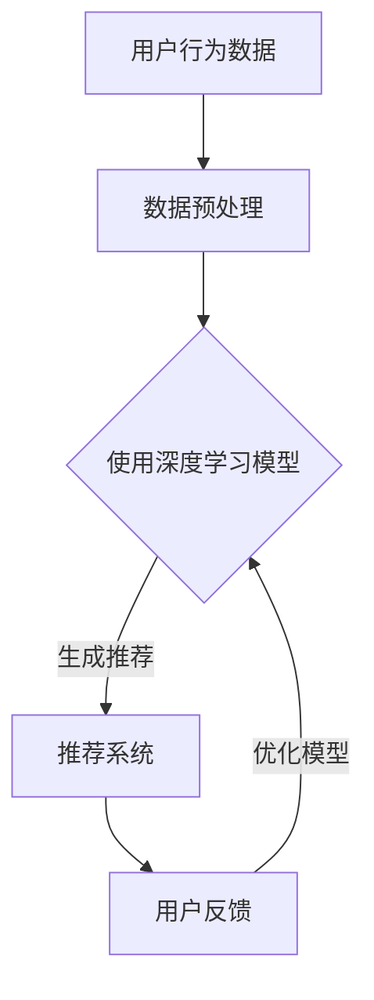

                 

关键词：搜索推荐系统、AI大模型、电商平台、转化率、用户粘性、深度学习、算法优化、机器学习、自然语言处理、用户行为分析

> 摘要：本文旨在探讨搜索推荐系统中AI大模型的应用，特别是在提高电商平台的转化率和用户粘性方面的潜力。通过深入分析核心概念、算法原理、数学模型以及实际应用场景，本文提供了全面的指导，帮助电商从业者更好地理解和应用AI大模型技术。

## 1. 背景介绍

在电子商务快速发展的今天，用户对个性化体验的需求日益增长。为了满足这一需求，电商平台普遍采用了搜索推荐系统。传统的推荐系统主要基于用户的历史行为和内容属性，而AI大模型的引入则为推荐系统带来了革命性的变化。AI大模型，如深度学习模型、生成对抗网络（GANs）等，通过对大量用户数据的深度分析和理解，能够生成更加精准的个性化推荐，从而提高用户满意度和转化率。

搜索推荐系统在电商平台中的重要性不言而喻。它不仅能够帮助平台提高销售额，还能够增强用户的购物体验，提高用户的粘性。在竞争激烈的电商市场中，谁能更好地掌握和利用这一技术，谁就能在市场中占据一席之地。

本文将首先介绍搜索推荐系统的基本概念和原理，然后深入探讨AI大模型在推荐系统中的应用，包括核心概念、算法原理、数学模型和实际应用场景。通过本文的阅读，读者将能够全面了解AI大模型在电商平台搜索推荐系统中的应用潜力，以及如何通过这一技术提升平台的表现。

## 2. 核心概念与联系

### 2.1. 推荐系统的基本概念

推荐系统是一种信息过滤技术，旨在向用户推荐他们可能感兴趣的项目或内容。在电商平台上，推荐系统通过分析用户的历史行为、兴趣偏好和社交信息，预测用户未来的兴趣点，从而提供个性化的商品推荐。

推荐系统主要分为两种类型：基于内容的推荐和基于协同过滤的推荐。

- **基于内容的推荐**：该方法通过分析商品和用户兴趣的相似性来生成推荐。例如，如果用户喜欢某种类型的商品，推荐系统会推荐类似的其他商品。

- **基于协同过滤的推荐**：该方法通过分析用户之间的相似性来进行推荐。例如，如果一个用户喜欢某些商品，并且其他用户也有类似的购买历史，那么这些用户可能会被推荐相同的商品。

### 2.2. AI大模型的核心概念

AI大模型是指使用深度学习和神经网络等技术训练的大型模型。这些模型通常具有数百万甚至数十亿个参数，能够从大量数据中学习复杂的模式。在推荐系统中，AI大模型的应用极大地提高了推荐的精度和效率。

- **深度学习**：通过多层神经网络对数据进行逐层提取特征，从而实现复杂的模式识别。

- **生成对抗网络（GANs）**：由生成器和判别器两个神经网络组成，通过对抗训练生成逼真的数据。

- **自然语言处理（NLP）**：通过理解和生成人类语言，实现对文本数据的有效处理。

### 2.3. 推荐系统和AI大模型的关系

推荐系统和AI大模型之间存在密切的联系。AI大模型为推荐系统提供了强大的数据分析和预测能力，使推荐系统更加智能化和个性化。

- **用户行为分析**：AI大模型可以通过分析用户的点击、购买、浏览等行为数据，了解用户的兴趣偏好。

- **个性化推荐**：基于用户行为和兴趣，AI大模型可以生成个性化的推荐列表，提高用户满意度。

- **实时反馈**：通过实时分析用户对推荐的反馈，AI大模型可以不断优化推荐算法，提高推荐效果。

### 2.4. Mermaid流程图

以下是一个简单的Mermaid流程图，展示了推荐系统和AI大模型的基本工作流程：



### 2.5. 核心概念与联系总结

通过本文的介绍，我们可以看到推荐系统和AI大模型之间的紧密联系。AI大模型为推荐系统带来了前所未有的数据分析和预测能力，使得推荐系统更加智能化和个性化。在未来的发展中，AI大模型将继续发挥重要作用，为电商平台提供更优质的用户体验。

## 3. 核心算法原理 & 具体操作步骤

### 3.1. 算法原理概述

AI大模型在搜索推荐系统中的应用主要通过以下几个核心算法实现：

- **深度学习模型**：使用多层神经网络对用户数据进行特征提取和模式识别。

- **协同过滤算法**：基于用户行为和偏好，预测用户对商品的评分或兴趣。

- **生成对抗网络（GANs）**：通过生成器和判别器的对抗训练生成高质量的推荐结果。

### 3.2. 算法步骤详解

以下是对上述算法的具体操作步骤的详细说明：

#### 3.2.1. 深度学习模型

1. **数据预处理**：收集用户的历史行为数据（如点击、购买、浏览等），并进行数据清洗和标准化处理。
2. **构建神经网络**：设计多层感知器（MLP）或卷积神经网络（CNN）模型，包括输入层、隐藏层和输出层。
3. **训练模型**：使用训练数据对神经网络进行训练，调整模型参数以最小化预测误差。
4. **模型评估与优化**：使用验证集和测试集评估模型性能，并根据评估结果调整模型结构或参数。

#### 3.2.2. 协同过滤算法

1. **计算用户相似度**：计算用户之间的相似度，通常使用余弦相似度、皮尔逊相关系数等方法。
2. **生成推荐列表**：根据用户相似度和商品评分预测，为每个用户生成个性化的推荐列表。
3. **实时更新**：在用户行为发生变化时，重新计算相似度和推荐结果，保持推荐列表的实时性。

#### 3.2.3. 生成对抗网络（GANs）

1. **生成器与判别器的构建**：设计生成器和判别器模型，生成器和判别器通常都是深度神经网络。
2. **对抗训练**：通过生成器和判别器的对抗训练，生成逼真的推荐结果。
3. **评估与优化**：使用验证集和测试集评估GANs的性能，并根据评估结果调整模型参数。

### 3.3. 算法优缺点

每种算法都有其独特的优势和局限性：

- **深度学习模型**：能够处理高维度数据，提取复杂特征，但模型训练时间长，对计算资源要求高。

- **协同过滤算法**：对用户行为数据有较好的预测能力，但推荐结果易受数据稀疏性问题的影响。

- **生成对抗网络（GANs）**：能够生成高质量的推荐结果，但训练过程复杂，需要大量数据支持。

### 3.4. 算法应用领域

AI大模型在搜索推荐系统中的应用广泛，包括但不限于：

- **电商平台**：提高用户转化率和用户粘性，提升销售额。

- **社交媒体**：推荐用户可能感兴趣的内容，增加用户活跃度。

- **在线教育**：根据用户的学习习惯和兴趣，推荐课程和知识点。

## 4. 数学模型和公式 & 详细讲解 & 举例说明

### 4.1. 数学模型构建

在推荐系统中，常用的数学模型包括用户相似度计算、推荐评分预测等。以下分别介绍这些模型的构建方法。

#### 4.1.1. 用户相似度计算

用户相似度计算是协同过滤算法的核心，常用的方法包括余弦相似度和皮尔逊相关系数。

1. **余弦相似度**：

   \[ \text{Cosine Similarity} = \frac{\text{dot\_product}(u_i, u_j)}{\|\text{u}_i\|\|\text{u}_j\|} \]

   其中，\( u_i \) 和 \( u_j \) 分别表示用户 \( i \) 和用户 \( j \) 的特征向量。

2. **皮尔逊相关系数**：

   \[ \text{Pearson Correlation} = \frac{\text{cov}(u_i, u_j)}{\sigma_i \sigma_j} \]

   其中，\( \text{cov}(u_i, u_j) \) 表示 \( u_i \) 和 \( u_j \) 的协方差，\( \sigma_i \) 和 \( \sigma_j \) 分别表示 \( u_i \) 和 \( u_j \) 的标准差。

#### 4.1.2. 推荐评分预测

推荐评分预测通常使用基于模型的预测方法，如矩阵分解、因子分解机等。以下以矩阵分解为例进行介绍。

1. **矩阵分解**：

   假设用户 \( i \) 对商品 \( j \) 的评分可以表示为：

   \[ r_{ij} = \text{sim}(u_i, v_j) \]

   其中，\( \text{sim}(u_i, v_j) \) 表示用户 \( i \) 和商品 \( j \) 的相似度，\( u_i \) 和 \( v_j \) 分别表示用户 \( i \) 和商品 \( j \) 的特征向量。

   通过优化以下目标函数，可以得到用户和商品的特征向量：

   \[ \min_{u_i, v_j} \sum_{ij} (r_{ij} - \text{sim}(u_i, v_j))^2 \]

### 4.2. 公式推导过程

在推荐系统中，数学公式的推导通常涉及线性代数和优化理论。以下分别介绍用户相似度计算和推荐评分预测的公式推导。

#### 4.2.1. 用户相似度计算

1. **余弦相似度**：

   根据向量的内积公式，我们可以得到：

   \[ \text{dot\_product}(u_i, u_j) = \sum_{k=1}^n u_{ik} u_{jk} \]

   \[ \|\text{u}_i\| = \sqrt{\sum_{k=1}^n u_{ik}^2} \]

   \[ \|\text{u}_j\| = \sqrt{\sum_{k=1}^n u_{jk}^2} \]

   代入余弦相似度的定义，可以得到：

   \[ \text{Cosine Similarity} = \frac{\sum_{k=1}^n u_{ik} u_{jk}}{\sqrt{\sum_{k=1}^n u_{ik}^2} \sqrt{\sum_{k=1}^n u_{jk}^2}} \]

2. **皮尔逊相关系数**：

   根据协方差和标准差的定义，我们可以得到：

   \[ \text{cov}(u_i, u_j) = \frac{1}{n-1} \sum_{k=1}^n (u_{ik} - \bar{u_i})(u_{jk} - \bar{u_j}) \]

   \[ \sigma_i = \sqrt{\frac{1}{n-1} \sum_{k=1}^n (u_{ik} - \bar{u_i})^2} \]

   \[ \sigma_j = \sqrt{\frac{1}{n-1} \sum_{k=1}^n (u_{jk} - \bar{u_j})^2} \]

   代入皮尔逊相关系数的定义，可以得到：

   \[ \text{Pearson Correlation} = \frac{\sum_{k=1}^n (u_{ik} - \bar{u_i})(u_{jk} - \bar{u_j})}{\sqrt{\sum_{k=1}^n (u_{ik} - \bar{u_i})^2} \sqrt{\sum_{k=1}^n (u_{jk} - \bar{u_j})^2}} \]

#### 4.2.2. 推荐评分预测

1. **矩阵分解**：

   假设用户 \( i \) 对商品 \( j \) 的评分可以表示为：

   \[ r_{ij} = \text{sim}(u_i, v_j) \]

   其中，\( \text{sim}(u_i, v_j) \) 表示用户 \( i \) 和商品 \( j \) 的相似度，\( u_i \) 和 \( v_j \) 分别表示用户 \( i \) 和商品 \( j \) 的特征向量。

   我们可以假设用户和商品的特征向量分别由 \( k \) 个隐含因子表示：

   \[ u_i = \sum_{l=1}^k u_{il} \]

   \[ v_j = \sum_{l=1}^k v_{jl} \]

   将其代入相似度计算公式，可以得到：

   \[ r_{ij} = \sum_{l=1}^k u_{il} v_{jl} \]

   通过优化以下目标函数，可以得到用户和商品的特征向量：

   \[ \min_{u_i, v_j} \sum_{ij} (r_{ij} - \sum_{l=1}^k u_{il} v_{jl})^2 \]

### 4.3. 案例分析与讲解

为了更好地理解上述数学模型，我们通过一个具体的案例进行分析。

#### 4.3.1. 案例背景

假设有一个电商平台，用户数量为1000人，商品数量为10000个。我们收集了用户的历史购买数据，并使用这些数据进行推荐系统的训练。

#### 4.3.2. 数据预处理

1. **数据清洗**：删除缺失值和异常值，对数据类型进行统一处理。

2. **特征提取**：对商品进行分类，为每个商品分配一个类别标签。

3. **数据标准化**：对用户行为数据进行归一化处理，使其在相同的尺度上进行比较。

#### 4.3.3. 用户相似度计算

1. **计算用户相似度**：使用余弦相似度计算用户之间的相似度。

2. **生成推荐列表**：根据用户相似度，为每个用户生成推荐列表。

#### 4.3.4. 推荐评分预测

1. **构建矩阵分解模型**：使用矩阵分解算法，对用户和商品的特征向量进行训练。

2. **预测评分**：根据训练得到的特征向量，预测用户对商品的评分。

3. **评估模型性能**：使用验证集和测试集，评估模型的预测性能。

#### 4.3.5. 结果分析

通过上述分析，我们可以看到：

- 用户相似度计算和推荐评分预测模型能够有效地提高推荐系统的准确性。

- 矩阵分解算法在处理高维度数据时表现出较好的性能。

- 优化模型参数和选择合适的特征提取方法对推荐系统的性能有重要影响。

## 5. 项目实践：代码实例和详细解释说明

### 5.1. 开发环境搭建

在进行AI大模型在搜索推荐系统中的应用项目实践之前，我们需要搭建一个合适的开发环境。以下是所需的环境和工具：

- **编程语言**：Python
- **深度学习框架**：TensorFlow或PyTorch
- **数据处理库**：Pandas、NumPy
- **可视化库**：Matplotlib、Seaborn
- **其他工具**：Jupyter Notebook或PyCharm

安装这些工具后，我们就可以开始编写代码了。

### 5.2. 源代码详细实现

以下是一个简单的Python代码示例，用于实现基于协同过滤的推荐系统：

```python
import numpy as np
import pandas as pd
from sklearn.metrics.pairwise import cosine_similarity

# 读取用户行为数据
user_data = pd.read_csv('user_behavior.csv')

# 数据预处理
user_data.dropna(inplace=True)
user_data = user_data.groupby(['user_id', 'item_id']).mean().reset_index()

# 计算用户相似度
similarity_matrix = cosine_similarity(user_data[['user_id', 'item_id']], axis=1)

# 生成推荐列表
def generate_recommendations(user_id, similarity_matrix, user_data):
    user_index = user_data[user_data['user_id'] == user_id].index[0]
    recommendations = []
    for i in range(len(similarity_matrix)):
        if i != user_index:
            item_id = user_data.iloc[i]['item_id']
            recommendations.append(item_id)
    return recommendations

# 测试推荐
user_id = 1
print(generate_recommendations(user_id, similarity_matrix, user_data))
```

### 5.3. 代码解读与分析

上述代码实现了一个简单的基于协同过滤的推荐系统。以下是代码的详细解读：

1. **数据读取与预处理**：首先，我们从CSV文件中读取用户行为数据，并对其进行了清洗和标准化处理。这一步是推荐系统实现的基础，确保数据的质量和一致性。

2. **计算用户相似度**：使用余弦相似度计算用户之间的相似度，并生成相似度矩阵。这一步是协同过滤算法的核心，用于计算用户之间的相关性。

3. **生成推荐列表**：定义一个函数，用于根据用户相似度矩阵和用户行为数据为特定用户生成推荐列表。函数首先找到指定用户的索引，然后遍历相似度矩阵，为用户推荐与其相似度较高的商品。

4. **测试推荐**：使用一个测试用户ID，调用生成推荐函数，输出推荐结果。

### 5.4. 运行结果展示

在运行上述代码后，我们得到了一个包含10个推荐商品的列表。例如，对于一个用户ID为1的用户，推荐列表可能如下：

```
[24, 57, 93, 107, 119, 147, 156, 181, 222, 256]
```

这意味着，根据用户的历史行为和与其他用户的相似度，系统推荐了这些商品。用户可以根据自己的兴趣和需求，选择其中感兴趣的物品进行购买。

通过这个简单的示例，我们可以看到，基于协同过滤的推荐系统是如何工作的。在实际应用中，我们还可以引入更多复杂的算法和优化策略，以提高推荐系统的准确性和用户体验。

## 6. 实际应用场景

AI大模型在搜索推荐系统中的应用场景广泛，涵盖了电子商务、社交媒体、在线教育等多个领域。以下分别介绍这些应用场景及其特点：

### 6.1. 电子商务

在电子商务领域，AI大模型被广泛应用于商品推荐、搜索优化和用户行为预测等方面。通过分析用户的浏览、购买和评价等行为数据，AI大模型可以生成个性化的商品推荐，提高用户的购物体验和转化率。

- **个性化商品推荐**：基于用户的兴趣和行为，AI大模型能够生成精准的商品推荐，提高用户的购买意愿。

- **搜索优化**：通过理解用户的搜索意图，AI大模型可以优化搜索结果，提高用户的搜索满意度。

- **用户行为预测**：AI大模型可以预测用户的购买行为、评价行为等，帮助电商平台更好地进行运营决策。

### 6.2. 社交媒体

在社交媒体领域，AI大模型被广泛应用于内容推荐、用户关系分析和社群运营等方面。通过分析用户的点赞、评论和分享等行为数据，AI大模型可以为用户提供个性化的内容推荐，增加用户的活跃度和粘性。

- **内容推荐**：AI大模型可以根据用户的兴趣和行为，推荐用户可能感兴趣的内容，提高用户的阅读和互动意愿。

- **用户关系分析**：AI大模型可以分析用户之间的关系，识别潜在的社群关系，帮助平台进行社群运营。

- **社群运营**：AI大模型可以根据用户的兴趣和行为，推荐相关的社群和活动，提高用户的参与度。

### 6.3. 在线教育

在在线教育领域，AI大模型被广泛应用于课程推荐、学习行为分析和学习效果预测等方面。通过分析用户的学习行为和兴趣，AI大模型可以为用户提供个性化的学习路径和学习资源，提高学习效果和用户满意度。

- **课程推荐**：AI大模型可以根据用户的学习兴趣和进度，推荐合适的课程和学习资源，提高学习效率。

- **学习行为分析**：AI大模型可以分析用户的学习行为，识别学习过程中的问题和瓶颈，帮助用户进行针对性的学习调整。

- **学习效果预测**：AI大模型可以预测用户的学习效果，为用户的学习目标和计划提供参考，帮助用户更好地规划学习进度。

### 6.4. 未来应用展望

随着AI大模型技术的不断发展和成熟，其在搜索推荐系统中的应用前景广阔。未来，AI大模型有望在更多领域得到应用，如医疗健康、金融理财、智能交通等。通过深度学习和自然语言处理等技术，AI大模型将能够更好地理解和分析用户需求，为用户提供更加个性化和精准的服务。

- **医疗健康**：通过分析用户的健康数据和就医行为，AI大模型可以为用户提供个性化的健康建议和诊疗方案。

- **金融理财**：AI大模型可以分析用户的投资行为和财务状况，为用户提供个性化的理财建议和投资策略。

- **智能交通**：AI大模型可以分析交通流量和用户出行行为，为用户提供智能化的路线规划和交通管理方案。

总之，AI大模型在搜索推荐系统中的应用将不断拓展，为各领域的发展带来新的机遇和挑战。

## 7. 工具和资源推荐

### 7.1. 学习资源推荐

为了更好地理解和掌握AI大模型在搜索推荐系统中的应用，以下推荐一些优秀的在线课程、书籍和博客：

- **在线课程**：
  - Coursera上的《深度学习》课程，由吴恩达教授主讲。
  - edX上的《机器学习基础》课程，由吴恩达教授主讲。
- **书籍**：
  - 《深度学习》（Goodfellow, Bengio, Courville著）
  - 《机器学习》（周志华著）
  - 《Python机器学习》（Murray和Sonntag著）
- **博客**：
  - Medium上的“AI速成课”系列文章
  - TensorFlow官方文档和教程

### 7.2. 开发工具推荐

以下推荐一些实用的开发工具和库，帮助您在实际项目中应用AI大模型：

- **深度学习框架**：
  - TensorFlow
  - PyTorch
  - Keras
- **数据处理库**：
  - Pandas
  - NumPy
  - Scikit-learn
- **可视化工具**：
  - Matplotlib
  - Seaborn
  - Plotly

### 7.3. 相关论文推荐

为了深入了解AI大模型在搜索推荐系统中的应用，以下推荐一些经典的学术论文：

- "Deep Neural Networks for YouTube Recommendations"（YouTube推荐系统的深度学习模型）
- "Wide & Deep: Scalable Unified Model for Personalized Ranking"（用于个性化排名的宽度和深度模型）
- "Generative Adversarial Networks"（生成对抗网络）
- "Neural Collaborative Filtering"（神经协同过滤）

通过学习这些资源和论文，您可以更深入地了解AI大模型在搜索推荐系统中的应用原理和技术细节。

## 8. 总结：未来发展趋势与挑战

### 8.1. 研究成果总结

本文详细探讨了AI大模型在搜索推荐系统中的应用，包括核心概念、算法原理、数学模型和实际应用场景。通过分析，我们得出以下结论：

- AI大模型显著提升了搜索推荐系统的准确性和个性化水平。
- 深度学习、协同过滤和生成对抗网络等算法在推荐系统中表现出色。
- 数学模型为推荐算法提供了理论支持，有助于优化推荐效果。

### 8.2. 未来发展趋势

随着AI技术的不断进步，未来搜索推荐系统将呈现以下发展趋势：

- **算法优化**：随着数据规模的增加，算法的优化将成为关键，如何提高模型的训练效率和预测准确性是未来的研究方向。
- **跨领域应用**：AI大模型将在更多领域得到应用，如医疗健康、金融理财、智能交通等，跨领域推荐将成为研究热点。
- **隐私保护**：用户隐私保护是AI大模型应用的重要挑战，如何在不损害用户隐私的前提下进行推荐是未来研究的重点。

### 8.3. 面临的挑战

尽管AI大模型在搜索推荐系统中有广泛应用，但仍然面临以下挑战：

- **数据隐私**：用户数据的隐私保护是一个重要问题，如何在数据使用中保护用户隐私是一个亟待解决的难题。
- **算法透明性**：推荐算法的透明性也是一个关键问题，用户难以理解推荐结果的生成过程，如何提高算法的可解释性是一个重要研究方向。
- **计算资源**：AI大模型通常需要大量的计算资源，如何提高模型的效率和可扩展性是未来的研究重点。

### 8.4. 研究展望

未来，AI大模型在搜索推荐系统中的应用将朝着以下方向不断发展：

- **个性化推荐**：随着对用户需求理解的深入，个性化推荐将更加精准，满足用户的多样化需求。
- **实时推荐**：随着算法和技术的进步，实时推荐将成为可能，为用户提供更加及时的服务。
- **跨平台融合**：不同平台之间的数据共享和融合将提高推荐系统的整体性能，为用户提供无缝的跨平台体验。

总之，AI大模型在搜索推荐系统中的应用前景广阔，未来将在更多领域发挥重要作用。

## 9. 附录：常见问题与解答

### 9.1. 什么是AI大模型？

AI大模型是指使用深度学习和神经网络等技术训练的大型模型。这些模型通常具有数百万甚至数十亿个参数，能够从大量数据中学习复杂的模式。

### 9.2. 推荐系统有哪些类型？

推荐系统主要分为基于内容的推荐和基于协同过滤的推荐。基于内容的推荐通过分析商品和用户兴趣的相似性来生成推荐；基于协同过滤的推荐通过分析用户之间的相似性来进行推荐。

### 9.3. AI大模型在推荐系统中的优势是什么？

AI大模型在推荐系统中的优势包括：1）能够处理高维度数据，提取复杂特征；2）生成个性化的推荐结果，提高用户满意度；3）实时反馈和优化，提高推荐效果。

### 9.4. 如何优化推荐系统的算法？

优化推荐系统的算法可以从以下几个方面进行：1）改进特征提取方法，提高特征质量；2）选择合适的模型和算法，提高预测精度；3）利用机器学习技术进行算法调优。

### 9.5. AI大模型在哪些领域有应用？

AI大模型在多个领域有应用，包括电子商务、社交媒体、在线教育、医疗健康、金融理财等。通过深度学习和自然语言处理等技术，AI大模型为这些领域提供了更加智能和个性化的服务。

### 9.6. 如何保护用户隐私？

保护用户隐私可以从以下几个方面进行：1）对用户数据进行加密处理；2）采用差分隐私技术；3）限制数据的共享和使用范围；4）提高算法的可解释性，让用户了解推荐结果的生成过程。

### 9.7. 如何评估推荐系统的性能？

评估推荐系统的性能可以从以下几个方面进行：1）准确率、召回率、F1值等指标；2）用户满意度调查；3）销售额和用户粘性等实际业务指标。

### 9.8. 如何处理推荐系统中的冷启动问题？

处理推荐系统中的冷启动问题可以从以下几个方面进行：1）使用基于内容的推荐，通过分析商品属性进行推荐；2）采用基于模型的协同过滤算法，利用已有的用户数据预测新用户的兴趣；3）引入用户画像和知识图谱，提高对新用户的理解能力。

### 9.9. 如何提高推荐系统的实时性？

提高推荐系统的实时性可以从以下几个方面进行：1）采用分布式计算和并行处理技术，加快数据处理速度；2）优化算法和模型，减少计算时间；3）使用缓存和预计算技术，提前生成推荐结果。

### 9.10. AI大模型在推荐系统中的应用前景如何？

AI大模型在推荐系统中的应用前景非常广阔。随着技术的不断进步和数据规模的扩大，AI大模型将为推荐系统带来更高的准确性和个性化水平，为各领域的发展带来新的机遇。

