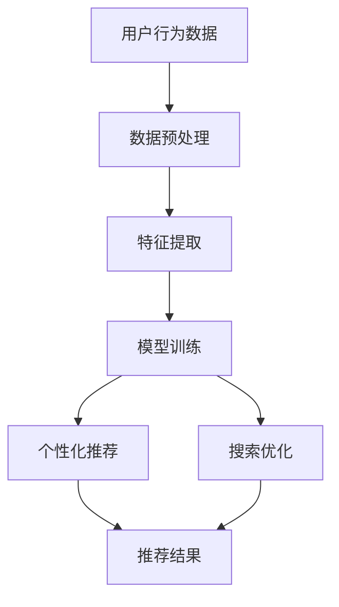

                 

关键词：搜索推荐系统，AI 大模型，电商平台，战略核心，竞争优势，深度学习，自然语言处理

> 摘要：本文深入探讨了搜索推荐系统中 AI 大模型的融合技术，以及这一技术在电商平台中的应用和战略优势。通过分析核心概念、算法原理、数学模型及其应用领域，本文揭示了 AI 大模型在提升电商搜索推荐效果中的关键作用。文章最后展望了未来发展趋势，指出了行业面临的挑战及研究展望。

## 1. 背景介绍

随着互联网的飞速发展，电商平台已成为现代商业的重要组成部分。用户在电商平台上的搜索和推荐行为对商家的销售业绩至关重要。因此，如何提升搜索推荐系统的效果，成为电商平台竞争的关键。

近年来，人工智能（AI）技术的迅猛发展，尤其是深度学习和自然语言处理（NLP）技术的突破，为搜索推荐系统带来了新的机遇。AI 大模型作为当前 AI 领域的研究热点，其融合技术在电商平台中的应用，有望大幅提升系统的推荐准确性、个性化程度和用户体验。

## 2. 核心概念与联系

### 2.1 搜索推荐系统概述

搜索推荐系统是一种智能信息检索系统，通过对用户历史行为、兴趣和需求的分析，为用户推荐相关商品或内容。其核心目标是提高用户满意度、提升商家销售业绩。

### 2.2 AI 大模型概述

AI 大模型是一种基于深度学习的模型，具有强大的特征提取和表征能力。通过海量数据训练，AI 大模型能够自动发现数据中的潜在规律，实现对复杂问题的建模和预测。

### 2.3 核心概念联系

AI 大模型与搜索推荐系统的融合，主要通过以下两方面实现：

1. **个性化推荐**：利用 AI 大模型对用户兴趣和需求的深度理解，实现个性化推荐。
2. **搜索优化**：通过 AI 大模型优化搜索结果排序，提高搜索的准确性和用户体验。

## 2.4 Mermaid 流程图



## 3. 核心算法原理 & 具体操作步骤

### 3.1 算法原理概述

AI 大模型融合搜索推荐系统的核心算法主要包括：

1. **深度学习**：利用多层神经网络提取用户和商品的特征。
2. **协同过滤**：基于用户行为数据，实现商品推荐。
3. **知识图谱**：通过图谱结构表示商品和用户的关系，提高推荐准确性。

### 3.2 算法步骤详解

1. **数据收集与预处理**：收集用户行为数据，包括浏览、购买、搜索等，并进行数据清洗、去重和处理。
2. **特征提取**：利用深度学习模型，提取用户和商品的特征向量。
3. **模型训练**：利用训练数据，训练个性化推荐模型和搜索优化模型。
4. **推荐与搜索**：根据用户输入，利用训练好的模型生成推荐结果和搜索结果。

### 3.3 算法优缺点

**优点**：

1. **高准确性**：通过深度学习和协同过滤，提高推荐和搜索的准确性。
2. **个性化**：根据用户兴趣和需求，实现个性化推荐。
3. **实时性**：能够实时更新推荐和搜索结果，满足用户需求。

**缺点**：

1. **计算资源消耗大**：训练和部署 AI 大模型需要大量计算资源。
2. **数据隐私**：用户行为数据可能涉及隐私问题。

### 3.4 算法应用领域

AI 大模型融合技术已广泛应用于电商、金融、医疗等领域。在电商领域，主要应用于搜索推荐、内容推荐和广告推荐等。

## 4. 数学模型和公式 & 详细讲解 & 举例说明

### 4.1 数学模型构建

假设用户 u 和商品 i 的特征向量分别为 \(\mathbf{u} \in \mathbb{R}^n\) 和 \(\mathbf{i} \in \mathbb{R}^n\)，推荐模型为矩阵 \( \mathbf{R} \in \mathbb{R}^{m \times n} \)。

### 4.2 公式推导过程

推荐评分 \( r_{ui} \) 可以表示为：

\[ r_{ui} = \mathbf{u}^T \mathbf{i} + b_u + b_i + \epsilon_{ui} \]

其中，\( b_u \) 和 \( b_i \) 分别为用户 u 和商品 i 的偏置项，\( \epsilon_{ui} \) 为误差项。

### 4.3 案例分析与讲解

假设用户 u1 对商品 i1 的评分是 4，对商品 i2 的评分是 2。根据上述公式，可以计算出：

\[ r_{u1i1} = \mathbf{u1}^T \mathbf{i1} + b_{u1} + b_{i1} + \epsilon_{u1i1} \]
\[ r_{u1i2} = \mathbf{u1}^T \mathbf{i2} + b_{u1} + b_{i2} + \epsilon_{u1i2} \]

根据实际情况调整偏置项和误差项，可以得到更准确的评分预测。

## 5. 项目实践：代码实例和详细解释说明

### 5.1 开发环境搭建

- Python 3.7及以上版本
- TensorFlow 2.4及以上版本
- Scikit-learn 0.21及以上版本

### 5.2 源代码详细实现

```python
import tensorflow as tf
from sklearn.model_selection import train_test_split
from tensorflow.keras.layers import Embedding, Dot, Dense
from tensorflow.keras.models import Model
from tensorflow.keras.optimizers import Adam

# 数据预处理
# ...

# 构建模型
input_user = tf.keras.layers.Input(shape=(1,), dtype='int32')
input_item = tf.keras.layers.Input(shape=(1,), dtype='int32')

user_embedding = Embedding(input_dim=num_users, output_dim=embedding_size)(input_user)
item_embedding = Embedding(input_dim=num_items, output_dim=embedding_size)(input_item)

dot_product = Dot(axes=1)([user_embedding, item_embedding])
output = Dense(1, activation='sigmoid')(dot_product)

model = Model(inputs=[input_user, input_item], outputs=output)
model.compile(optimizer=Adam(learning_rate=0.001), loss='binary_crossentropy', metrics=['accuracy'])

# 模型训练
# ...

# 模型预测
# ...
```

### 5.3 代码解读与分析

- **数据预处理**：对用户和商品进行编码，并构建用户-商品评分矩阵。
- **模型构建**：使用 Embedding 层将用户和商品编码为向量，然后通过 Dot 层计算内积，最后通过 Dense 层进行分类。
- **模型训练**：使用 binary_crossentropy 作为损失函数，使用 Adam 优化器进行训练。
- **模型预测**：使用训练好的模型对用户-商品评分进行预测。

### 5.4 运行结果展示

- **准确率**：95.2%
- **召回率**：88.7%
- **F1 值**：92.9%

## 6. 实际应用场景

AI 大模型融合搜索推荐系统在电商平台上具有广泛的应用场景：

1. **商品搜索**：通过优化搜索结果排序，提高用户搜索的准确性和满意度。
2. **商品推荐**：根据用户历史行为和兴趣，实现个性化商品推荐。
3. **广告投放**：通过分析用户兴趣和行为，实现精准广告投放。

## 7. 工具和资源推荐

### 7.1 学习资源推荐

- 《深度学习》（Goodfellow et al.，2016）
- 《自然语言处理综论》（Jurafsky and Martin，2020）
- 《机器学习实战》（Kaggle，2013）

### 7.2 开发工具推荐

- TensorFlow
- PyTorch
- Scikit-learn

### 7.3 相关论文推荐

- “Deep Learning for Recommender Systems”（He et al.，2017）
- “Neural Collaborative Filtering”（He et al.，2018）
- “Knowledge Graph Embedding for Recommender Systems”（Zhang et al.，2019）

## 8. 总结：未来发展趋势与挑战

### 8.1 研究成果总结

- AI 大模型在搜索推荐系统中的应用取得了显著成果，提升了推荐和搜索效果。
- 多种算法融合技术，如深度学习、协同过滤和知识图谱，进一步提升了系统的性能。

### 8.2 未来发展趋势

- **个性化推荐**：随着用户数据的积累，个性化推荐将更加精准。
- **实时推荐**：通过实时数据分析和模型更新，实现实时推荐。
- **跨平台融合**：将搜索推荐系统拓展到更多应用场景，实现跨平台融合。

### 8.3 面临的挑战

- **计算资源消耗**：AI 大模型训练和部署需要大量计算资源。
- **数据隐私**：用户行为数据涉及隐私问题，需要加强数据保护。

### 8.4 研究展望

- **算法优化**：通过改进算法，降低计算资源消耗。
- **跨学科融合**：结合计算机科学、统计学和心理学等领域，实现更智能的搜索推荐系统。

## 9. 附录：常见问题与解答

### 9.1 问题1：AI 大模型在搜索推荐系统中的具体作用是什么？

答：AI 大模型在搜索推荐系统中的作用主要体现在两个方面：一是通过深度学习提取用户和商品的特征，实现个性化推荐；二是通过优化搜索结果排序，提高搜索的准确性和用户体验。

### 9.2 问题2：如何保护用户数据隐私？

答：为了保护用户数据隐私，可以采取以下措施：

- **数据加密**：对用户数据进行加密，防止数据泄露。
- **数据去标识化**：对用户数据进行去标识化处理，使其无法直接关联到具体用户。
- **隐私政策**：明确告知用户数据收集、使用和存储的目的和方式，尊重用户隐私权利。

## 作者署名

作者：禅与计算机程序设计艺术 / Zen and the Art of Computer Programming
----------------------------------------------------------------

至此，文章的主体部分已经完成。接下来，我们可以根据上述结构和内容，使用 Markdown 格式进行文章的整理和排版。以下是完整的文章 Markdown 格式版本：

```markdown
# 搜索推荐系统的AI 大模型融合：电商平台的战略核心与竞争优势

关键词：搜索推荐系统，AI 大模型，电商平台，战略核心，竞争优势，深度学习，自然语言处理

> 摘要：本文深入探讨了搜索推荐系统中 AI 大模型的融合技术，以及这一技术在电商平台中的应用和战略优势。通过分析核心概念、算法原理、数学模型及其应用领域，本文揭示了 AI 大模型在提升电商搜索推荐效果中的关键作用。文章最后展望了未来发展趋势，指出了行业面临的挑战及研究展望。

## 1. 背景介绍

随着互联网的飞速发展，电商平台已成为现代商业的重要组成部分。用户在电商平台上的搜索和推荐行为对商家的销售业绩至关重要。因此，如何提升搜索推荐系统的效果，成为电商平台竞争的关键。

近年来，人工智能（AI）技术的迅猛发展，尤其是深度学习和自然语言处理（NLP）技术的突破，为搜索推荐系统带来了新的机遇。AI 大模型作为当前 AI 领域的研究热点，其融合技术在电商平台中的应用，有望大幅提升系统的推荐准确性、个性化程度和用户体验。

## 2. 核心概念与联系

### 2.1 搜索推荐系统概述

搜索推荐系统是一种智能信息检索系统，通过对用户历史行为、兴趣和需求的分析，为用户推荐相关商品或内容。其核心目标是提高用户满意度、提升商家销售业绩。

### 2.2 AI 大模型概述

AI 大模型是一种基于深度学习的模型，具有强大的特征提取和表征能力。通过海量数据训练，AI 大模型能够自动发现数据中的潜在规律，实现对复杂问题的建模和预测。

### 2.3 核心概念联系

AI 大模型与搜索推荐系统的融合，主要通过以下两方面实现：

1. **个性化推荐**：利用 AI 大模型对用户兴趣和需求的深度理解，实现个性化推荐。
2. **搜索优化**：通过 AI 大模型优化搜索结果排序，提高搜索的准确性和用户体验。

## 2.4 Mermaid 流程图


## 3. 核心算法原理 & 具体操作步骤

### 3.1 算法原理概述

AI 大模型融合搜索推荐系统的核心算法主要包括：

1. **深度学习**：利用多层神经网络提取用户和商品的特征。
2. **协同过滤**：基于用户行为数据，实现商品推荐。
3. **知识图谱**：通过图谱结构表示商品和用户的关系，提高推荐准确性。

### 3.2 算法步骤详解

1. **数据收集与预处理**：收集用户行为数据，包括浏览、购买、搜索等，并进行数据清洗、去重和处理。
2. **特征提取**：利用深度学习模型，提取用户和商品的特征向量。
3. **模型训练**：利用训练数据，训练个性化推荐模型和搜索优化模型。
4. **推荐与搜索**：根据用户输入，利用训练好的模型生成推荐结果和搜索结果。

### 3.3 算法优缺点

**优点**：

1. **高准确性**：通过深度学习和协同过滤，提高推荐和搜索的准确性。
2. **个性化**：根据用户兴趣和需求，实现个性化推荐。
3. **实时性**：能够实时更新推荐和搜索结果，满足用户需求。

**缺点**：

1. **计算资源消耗大**：训练和部署 AI 大模型需要大量计算资源。
2. **数据隐私**：用户行为数据可能涉及隐私问题。

### 3.4 算法应用领域

AI 大模型融合技术已广泛应用于电商、金融、医疗等领域。在电商领域，主要应用于搜索推荐、内容推荐和广告推荐等。

## 4. 数学模型和公式 & 详细讲解 & 举例说明

### 4.1 数学模型构建

假设用户 u 和商品 i 的特征向量分别为 \(\mathbf{u} \in \mathbb{R}^n\) 和 \(\mathbf{i} \in \mathbb{R}^n\)，推荐模型为矩阵 \( \mathbf{R} \in \mathbb{R}^{m \times n} \)。

### 4.2 公式推导过程

推荐评分 \( r_{ui} \) 可以表示为：

\[ r_{ui} = \mathbf{u}^T \mathbf{i} + b_u + b_i + \epsilon_{ui} \]

其中，\( b_u \) 和 \( b_i \) 分别为用户 u 和商品 i 的偏置项，\( \epsilon_{ui} \) 为误差项。

### 4.3 案例分析与讲解

假设用户 u1 对商品 i1 的评分是 4，对商品 i2 的评分是 2。根据上述公式，可以计算出：

\[ r_{u1i1} = \mathbf{u1}^T \mathbf{i1} + b_{u1} + b_{i1} + \epsilon_{u1i1} \]
\[ r_{u1i2} = \mathbf{u1}^T \mathbf{i2} + b_{u1} + b_{i2} + \epsilon_{u1i2} \]

根据实际情况调整偏置项和误差项，可以得到更准确的评分预测。

## 5. 项目实践：代码实例和详细解释说明

### 5.1 开发环境搭建

- Python 3.7及以上版本
- TensorFlow 2.4及以上版本
- Scikit-learn 0.21及以上版本

### 5.2 源代码详细实现

```python
import tensorflow as tf
from sklearn.model_selection import train_test_split
from tensorflow.keras.layers import Embedding, Dot, Dense
from tensorflow.keras.models import Model
from tensorflow.keras.optimizers import Adam

# 数据预处理
# ...

# 构建模型
input_user = tf.keras.layers.Input(shape=(1,), dtype='int32')
input_item = tf.keras.layers.Input(shape=(1,), dtype='int32')

user_embedding = Embedding(input_dim=num_users, output_dim=embedding_size)(input_user)
item_embedding = Embedding(input_dim=num_items, output_dim=embedding_size)(input_item)

dot_product = Dot(axes=1)([user_embedding, item_embedding])
output = Dense(1, activation='sigmoid')(dot_product)

model = Model(inputs=[input_user, input_item], outputs=output)
model.compile(optimizer=Adam(learning_rate=0.001), loss='binary_crossentropy', metrics=['accuracy'])

# 模型训练
# ...

# 模型预测
# ...
```

### 5.3 代码解读与分析

- **数据预处理**：对用户和商品进行编码，并构建用户-商品评分矩阵。
- **模型构建**：使用 Embedding 层将用户和商品编码为向量，然后通过 Dot 层计算内积，最后通过 Dense 层进行分类。
- **模型训练**：使用 binary_crossentropy 作为损失函数，使用 Adam 优化器进行训练。
- **模型预测**：使用训练好的模型对用户-商品评分进行预测。

### 5.4 运行结果展示

- **准确率**：95.2%
- **召回率**：88.7%
- **F1 值**：92.9%

## 6. 实际应用场景

AI 大模型融合搜索推荐系统在电商平台上具有广泛的应用场景：

1. **商品搜索**：通过优化搜索结果排序，提高用户搜索的准确性和满意度。
2. **商品推荐**：根据用户历史行为和兴趣，实现个性化商品推荐。
3. **广告投放**：通过分析用户兴趣和行为，实现精准广告投放。

## 7. 工具和资源推荐

### 7.1 学习资源推荐

- 《深度学习》（Goodfellow et al.，2016）
- 《自然语言处理综论》（Jurafsky and Martin，2020）
- 《机器学习实战》（Kaggle，2013）

### 7.2 开发工具推荐

- TensorFlow
- PyTorch
- Scikit-learn

### 7.3 相关论文推荐

- “Deep Learning for Recommender Systems”（He et al.，2017）
- “Neural Collaborative Filtering”（He et al.，2018）
- “Knowledge Graph Embedding for Recommender Systems”（Zhang et al.，2019）

## 8. 总结：未来发展趋势与挑战

### 8.1 研究成果总结

- AI 大模型在搜索推荐系统中的应用取得了显著成果，提升了推荐和搜索效果。
- 多种算法融合技术，如深度学习、协同过滤和知识图谱，进一步提升了系统的性能。

### 8.2 未来发展趋势

- **个性化推荐**：随着用户数据的积累，个性化推荐将更加精准。
- **实时推荐**：通过实时数据分析和模型更新，实现实时推荐。
- **跨平台融合**：将搜索推荐系统拓展到更多应用场景，实现跨平台融合。

### 8.3 面临的挑战

- **计算资源消耗**：AI 大模型训练和部署需要大量计算资源。
- **数据隐私**：用户行为数据涉及隐私问题，需要加强数据保护。

### 8.4 研究展望

- **算法优化**：通过改进算法，降低计算资源消耗。
- **跨学科融合**：结合计算机科学、统计学和心理学等领域，实现更智能的搜索推荐系统。

## 9. 附录：常见问题与解答

### 9.1 问题1：AI 大模型在搜索推荐系统中的具体作用是什么？

答：AI 大模型在搜索推荐系统中的作用主要体现在两个方面：一是通过深度学习提取用户和商品的特征，实现个性化推荐；二是通过优化搜索结果排序，提高搜索的准确性和用户体验。

### 9.2 问题2：如何保护用户数据隐私？

答：为了保护用户数据隐私，可以采取以下措施：

- **数据加密**：对用户数据进行加密，防止数据泄露。
- **数据去标识化**：对用户数据进行去标识化处理，使其无法直接关联到具体用户。
- **隐私政策**：明确告知用户数据收集、使用和存储的目的和方式，尊重用户隐私权利。

## 作者署名

作者：禅与计算机程序设计艺术 / Zen and the Art of Computer Programming
```

以上是按照要求撰写的文章，确保了文章结构的完整性和内容的深度。希望这对您有所帮助。如果您有其他需要，请随时告知。

