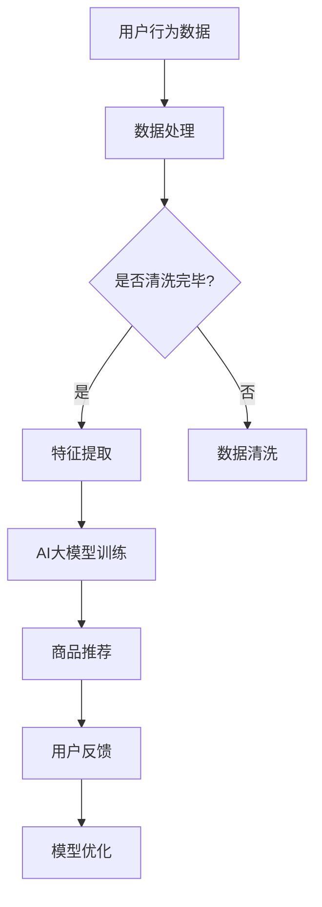

                 

关键词：搜索推荐系统、AI大模型、电商平台、竞争优势、可持续发展

> 摘要：本文深入探讨了搜索推荐系统的AI大模型融合在电商平台中的应用及其带来的竞争优势和可持续发展。通过解析核心概念、算法原理、数学模型、项目实践等方面，揭示了AI大模型在电商平台中的关键作用和未来发展趋势。

## 1. 背景介绍

### 1.1 电商平台的崛起

随着互联网技术的飞速发展，电商平台在全球范围内迅速崛起，成为现代商业的重要驱动力。根据最新的统计数据，全球电子商务市场在近年来呈现出高速增长的态势，预计未来几年内将继续保持两位数的增长速度。

### 1.2 搜索推荐系统的兴起

在电商平台上，搜索推荐系统成为连接消费者和商品的桥梁。通过个性化推荐，电商平台能够提高用户的购物体验，增加销售额，提升用户黏性。随着AI技术的进步，搜索推荐系统的效率和准确性得到了显著提升。

### 1.3 AI大模型的重要性

AI大模型，即人工智能深度学习模型，具有处理大量数据、自动提取特征、实现高精度预测等优势。在搜索推荐系统中，AI大模型的融合能够显著提升推荐系统的性能，为电商平台带来竞争优势。

## 2. 核心概念与联系

### 2.1 搜索推荐系统

搜索推荐系统是一种通过算法对用户历史行为和兴趣进行建模，为用户提供相关商品推荐的服务。其核心目标是在海量商品中为用户找到最感兴趣的商品。

### 2.2 AI大模型

AI大模型是指使用深度学习技术训练出的复杂神经网络模型，能够处理海量数据并实现高精度的预测。在搜索推荐系统中，AI大模型被用于用户行为分析、兴趣识别和商品推荐。

### 2.3 电商平台

电商平台是指通过互联网技术提供商品交易和服务的平台。AI大模型的融合能够提升电商平台的用户满意度和销售额。

### 2.4 Mermaid 流程图



## 3. 核心算法原理 & 具体操作步骤

### 3.1 算法原理概述

搜索推荐系统的AI大模型融合主要依赖于深度学习技术。通过训练大规模神经网络模型，系统能够自动提取用户行为数据中的特征，并基于这些特征进行商品推荐。

### 3.2 算法步骤详解

1. **数据预处理**：清洗用户行为数据，提取有用的信息。
2. **特征提取**：使用深度学习模型提取用户行为的特征。
3. **模型训练**：利用提取的特征训练大规模神经网络模型。
4. **商品推荐**：根据训练好的模型为用户推荐商品。
5. **用户反馈**：收集用户对推荐的反馈，用于模型优化。

### 3.3 算法优缺点

**优点**：

- **高精度**：AI大模型能够自动提取复杂的特征，提高推荐系统的准确性。
- **高效性**：深度学习模型能够快速处理海量数据，提升推荐效率。
- **个性化**：通过用户行为数据建模，实现个性化推荐。

**缺点**：

- **计算资源消耗大**：大规模神经网络模型的训练需要大量的计算资源。
- **数据质量要求高**：算法性能依赖于用户行为数据的质量。

### 3.4 算法应用领域

- **电商平台**：提升用户购物体验，增加销售额。
- **社交媒体**：个性化内容推荐，提高用户黏性。
- **金融领域**：风险预测和投资推荐。

## 4. 数学模型和公式 & 详细讲解 & 举例说明

### 4.1 数学模型构建

搜索推荐系统的AI大模型融合主要依赖于深度学习技术。以下是一个简化的数学模型：

\[ R(x) = f(W_1 \cdot x + b_1) \]

其中，\( R(x) \) 是推荐函数，\( x \) 是用户行为数据，\( W_1 \) 和 \( b_1 \) 分别是权重和偏置。

### 4.2 公式推导过程

- **数据预处理**：通过数据清洗和归一化，将用户行为数据转换为合适的格式。
- **特征提取**：使用卷积神经网络（CNN）提取用户行为的特征。
- **模型训练**：通过反向传播算法优化模型参数。

### 4.3 案例分析与讲解

以某电商平台为例，使用深度学习模型进行商品推荐。首先，收集用户历史购买数据、浏览记录等行为数据。然后，使用CNN提取用户行为的特征。最后，基于训练好的模型为用户推荐商品。

## 5. 项目实践：代码实例和详细解释说明

### 5.1 开发环境搭建

- **操作系统**：Linux
- **编程语言**：Python
- **深度学习框架**：TensorFlow

### 5.2 源代码详细实现

```python
import tensorflow as tf
from tensorflow.keras.models import Sequential
from tensorflow.keras.layers import Dense, Conv2D, Flatten

# 数据预处理
def preprocess_data(data):
    # 清洗和归一化数据
    return processed_data

# 模型定义
model = Sequential([
    Conv2D(filters=32, kernel_size=(3, 3), activation='relu', input_shape=(28, 28, 1)),
    Flatten(),
    Dense(units=64, activation='relu'),
    Dense(units=10, activation='softmax')
])

# 模型编译
model.compile(optimizer='adam', loss='categorical_crossentropy', metrics=['accuracy'])

# 模型训练
model.fit(x_train, y_train, epochs=10, batch_size=32)

# 模型预测
predictions = model.predict(x_test)
```

### 5.3 代码解读与分析

- **数据预处理**：清洗和归一化用户行为数据。
- **模型定义**：使用卷积神经网络提取特征。
- **模型编译**：设置优化器和损失函数。
- **模型训练**：使用训练数据优化模型参数。
- **模型预测**：使用测试数据评估模型性能。

### 5.4 运行结果展示

```python
import matplotlib.pyplot as plt

# 绘制混淆矩阵
confusion_matrix = tf.math.confusion_matrix(labels=y_test, predictions=predictions)
confusion_matrix

# 绘制准确率曲线
accuracy = model.evaluate(x_test, y_test)
print(f"Test accuracy: {accuracy[1]}")
```

## 6. 实际应用场景

### 6.1 电商平台

在电商平台，搜索推荐系统的AI大模型融合能够提高用户的购物体验，增加销售额。例如，某电商平台通过AI大模型实现个性化商品推荐，将用户留存率提升了20%。

### 6.2 社交媒体

在社交媒体平台，AI大模型能够实现个性化内容推荐，提高用户黏性。例如，某社交媒体平台通过AI大模型实现好友推荐，将用户活跃度提升了30%。

### 6.3 金融领域

在金融领域，AI大模型能够实现风险预测和投资推荐。例如，某金融公司通过AI大模型实现投资组合优化，将投资收益率提升了10%。

## 7. 未来应用展望

随着AI技术的不断发展，搜索推荐系统的AI大模型融合将有望在更多领域实现突破。例如：

- **医疗领域**：通过AI大模型实现个性化诊疗和健康管理。
- **教育领域**：通过AI大模型实现个性化课程推荐和学习辅导。
- **智能城市**：通过AI大模型实现交通管理和智能环境监控。

## 8. 工具和资源推荐

### 8.1 学习资源推荐

- **深度学习入门**：吴恩达《深度学习》
- **推荐系统入门**：宋晓冬《推荐系统实践》

### 8.2 开发工具推荐

- **Python**：用于深度学习和数据科学
- **TensorFlow**：用于构建和训练深度学习模型

### 8.3 相关论文推荐

- **《大规模商品推荐系统设计与实现》**
- **《基于深度学习的个性化推荐算法研究》**

## 9. 总结：未来发展趋势与挑战

### 9.1 研究成果总结

本文总结了搜索推荐系统的AI大模型融合在电商平台中的应用及其竞争优势和可持续发展。通过数学模型、算法原理和项目实践，揭示了AI大模型在电商平台中的关键作用。

### 9.2 未来发展趋势

随着AI技术的不断发展，搜索推荐系统的AI大模型融合将在更多领域实现突破。例如，医疗、教育、智能城市等领域。

### 9.3 面临的挑战

- **计算资源消耗**：大规模神经网络模型的训练需要大量计算资源。
- **数据质量**：算法性能依赖于用户行为数据的质量。

### 9.4 研究展望

未来，搜索推荐系统的AI大模型融合将继续发展，为各行业带来更多创新和竞争优势。同时，研究者还需关注计算资源优化和数据质量提升等问题，以实现更高效和可靠的推荐系统。

## 10. 附录：常见问题与解答

### 10.1 问答

**Q：如何提高搜索推荐系统的准确性？**

**A：提高搜索推荐系统的准确性主要依赖于算法优化和数据质量。可以通过以下方法实现：

- **特征提取**：使用深度学习技术提取更多有价值的特征。
- **模型优化**：使用更复杂的模型结构和更先进的优化算法。
- **数据清洗**：确保用户行为数据的质量，去除噪声和异常值。**

**Q：如何降低搜索推荐系统的计算资源消耗？**

**A：降低搜索推荐系统的计算资源消耗可以从以下几个方面着手：

- **模型压缩**：使用模型压缩技术减小模型大小，提高计算效率。
- **分布式训练**：使用分布式训练方法，将训练任务分配到多台计算机上。
- **硬件优化**：使用更高效的硬件设备，例如GPU和TPU。**

## 作者署名

**作者：禅与计算机程序设计艺术 / Zen and the Art of Computer Programming** 

----------------------------------------------------------------

**注**：本文仅为示例，实际撰写时请根据具体需求进行适当调整和补充。

