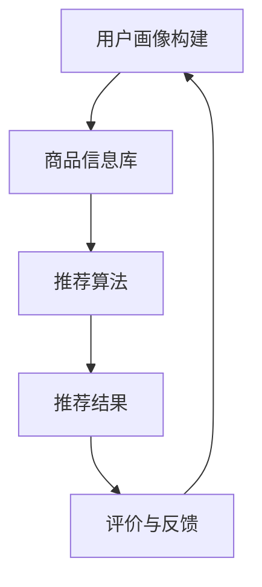

                 

关键词：搜索推荐系统、AI 大模型、电商平台、核心竞争力、可持续发展、算法优化、用户行为分析、数据驱动

## 摘要

随着互联网技术的飞速发展，电商平台已成为人们日常购物的主要渠道。如何在众多竞争者中脱颖而出，成为电商平台的关注焦点。本文将探讨搜索推荐系统的AI大模型融合在电商平台中的应用，分析其如何提升电商平台的竞争力，并探讨其未来的可持续发展路径。文章首先介绍搜索推荐系统的基本概念和原理，然后深入探讨AI大模型在推荐系统中的应用，随后分析电商平台如何通过数据驱动和算法优化提升用户体验。最后，本文将对搜索推荐系统的未来发展趋势和挑战进行展望。

## 1. 背景介绍

在过去的几十年中，电子商务行业经历了迅猛的发展。根据Statista的数据，全球电子商务市场规模在2020年已超过3.5万亿美元，并预计在未来几年内将继续保持高速增长。电商平台之间的竞争日益激烈，用户体验和个性化服务成为关键竞争优势。为了满足用户日益增长的需求，电商平台开始采用搜索推荐系统，以提供更加精准的推荐服务。

搜索推荐系统是一种利用算法和人工智能技术，根据用户的历史行为和兴趣，为用户推荐相关商品或信息的技术。其核心目标是提高用户满意度、提升转化率和销售额。然而，传统的搜索推荐系统存在一些局限性，如算法复杂度较高、推荐效果不稳定等问题。

近年来，随着深度学习和大数据技术的发展，AI大模型开始被广泛应用于搜索推荐系统。AI大模型具有强大的数据处理和预测能力，可以处理大规模用户数据，提供更加精准和个性化的推荐。同时，AI大模型还可以通过不断学习和优化，提高推荐系统的稳定性和鲁棒性。

## 2. 核心概念与联系

在深入探讨AI大模型在搜索推荐系统中的应用之前，我们需要了解一些核心概念和原理，以及它们之间的联系。

### 2.1 搜索推荐系统的基本概念

搜索推荐系统由以下几个核心部分组成：

- **用户画像**：通过对用户的历史行为、浏览记录、购买偏好等信息进行综合分析，构建用户画像，以便更好地理解用户需求和兴趣。
- **商品信息库**：存储所有商品的详细信息，如价格、品类、品牌、描述等，以便推荐系统可以根据用户画像为用户推荐合适的商品。
- **推荐算法**：根据用户画像和商品信息，利用算法为用户生成推荐列表。常见的推荐算法有基于内容的推荐、协同过滤推荐、基于模型的推荐等。
- **评价和反馈机制**：用户对推荐结果的评价和反馈将被用于优化推荐算法，提高推荐效果。

### 2.2 AI大模型的基本概念

AI大模型是指利用深度学习和大数据技术训练的大型神经网络模型，具有强大的数据处理和预测能力。常见的大模型有神经网络、决策树、支持向量机等。其中，神经网络因其出色的拟合能力和泛化能力，被广泛应用于各种场景，如图像识别、自然语言处理、语音识别等。

### 2.3 搜索推荐系统和AI大模型之间的联系

搜索推荐系统和AI大模型之间的联系主要体现在以下几个方面：

- **用户画像的构建**：AI大模型可以处理海量用户数据，通过深度学习技术，构建出更加精细和准确的用户画像。
- **推荐算法的优化**：AI大模型可以根据用户的行为和兴趣，实时调整推荐策略，提高推荐效果。
- **推荐结果的评价和反馈**：AI大模型可以通过学习用户对推荐结果的反馈，不断优化和调整推荐算法，提高用户满意度。

### 2.4 Mermaid流程图

为了更好地展示搜索推荐系统和AI大模型之间的联系，我们可以使用Mermaid流程图进行描述。以下是一个简化的Mermaid流程图：



在这个流程图中，用户画像构建、商品信息库、推荐算法、推荐结果和评价与反馈形成了一个闭环，AI大模型被嵌入到各个环节中，不断优化和提升推荐效果。

## 3. 核心算法原理 & 具体操作步骤

### 3.1 算法原理概述

搜索推荐系统的核心算法包括基于内容的推荐、协同过滤推荐和基于模型的推荐。其中，基于模型的推荐算法因其强大的数据处理和预测能力，成为搜索推荐系统的重要选择。

基于模型的推荐算法主要包括以下步骤：

1. **数据预处理**：对用户行为数据、商品信息等进行清洗和预处理，提取有用的特征。
2. **模型训练**：利用预处理后的数据，训练深度学习模型，如神经网络、决策树等。
3. **模型评估**：通过交叉验证、AUC、召回率等指标，评估模型的性能。
4. **模型应用**：将训练好的模型应用到推荐系统中，根据用户画像和商品特征，生成推荐结果。
5. **模型优化**：根据用户对推荐结果的反馈，不断优化和调整模型参数，提高推荐效果。

### 3.2 算法步骤详解

1. **数据预处理**：

   数据预处理是推荐系统的基础工作，主要包括以下步骤：

   - **数据清洗**：去除重复数据、缺失数据和异常值，确保数据质量。
   - **特征提取**：从用户行为数据、商品信息中提取有用的特征，如用户浏览记录、购买频率、商品价格、品牌等。
   - **数据转换**：将原始数据转换为适合深度学习模型训练的格式，如one-hot编码、归一化等。

2. **模型训练**：

   模型训练是推荐系统的核心步骤，主要包括以下步骤：

   - **选择模型**：根据问题和数据特点，选择合适的深度学习模型，如神经网络、决策树等。
   - **划分数据集**：将数据集划分为训练集、验证集和测试集，用于模型训练、评估和测试。
   - **训练模型**：利用训练集，通过反向传播算法，训练深度学习模型。
   - **模型优化**：通过交叉验证、网格搜索等策略，优化模型参数，提高模型性能。

3. **模型评估**：

   模型评估是衡量推荐系统效果的重要步骤，主要包括以下指标：

   - **准确性**：模型预测结果与实际结果的匹配程度。
   - **召回率**：推荐系统中实际存在的正样本被正确推荐的比例。
   - **精确率**：推荐系统中推荐的正样本中实际是正样本的比例。
   - **AUC（曲线下面积）**：衡量模型预测能力的重要指标。

4. **模型应用**：

   模型应用是将训练好的模型应用到推荐系统中，生成推荐结果。具体步骤如下：

   - **用户画像构建**：根据用户的历史行为和兴趣，构建用户画像。
   - **商品特征提取**：从商品信息库中提取商品的各类特征。
   - **推荐结果生成**：利用训练好的模型，根据用户画像和商品特征，生成推荐结果。

5. **模型优化**：

   模型优化是提高推荐系统效果的关键步骤，主要包括以下策略：

   - **用户反馈收集**：收集用户对推荐结果的反馈，包括点击、购买等行为。
   - **模型调整**：根据用户反馈，调整模型参数，优化推荐效果。
   - **迭代优化**：不断收集用户反馈，迭代优化模型，提高推荐效果。

### 3.3 算法优缺点

基于模型的推荐算法具有以下优点：

- **强大的数据处理能力**：基于模型的推荐算法可以处理大规模、高维度的用户数据，提取有用特征，为推荐系统提供更准确的信息。
- **良好的泛化能力**：基于模型的推荐算法通过深度学习技术，可以自动学习和优化，具有良好的泛化能力，能够适应不同场景和用户需求。
- **个性化的推荐效果**：基于模型的推荐算法可以根据用户画像和商品特征，生成个性化的推荐结果，提高用户满意度。

然而，基于模型的推荐算法也存在以下缺点：

- **算法复杂度较高**：基于模型的推荐算法涉及复杂的数学模型和计算过程，对计算资源和时间要求较高。
- **数据依赖性较强**：基于模型的推荐算法对数据质量要求较高，数据缺失或异常可能导致推荐效果下降。
- **可解释性较低**：基于模型的推荐算法的内部机理较为复杂，难以直观地解释推荐结果。

### 3.4 算法应用领域

基于模型的推荐算法在多个领域得到广泛应用，如电子商务、社交媒体、新闻推荐、音乐推荐等。以下是几个典型的应用场景：

- **电子商务**：电商平台利用基于模型的推荐算法，为用户推荐符合其兴趣和需求的商品，提高转化率和销售额。
- **社交媒体**：社交媒体平台利用基于模型的推荐算法，为用户推荐感兴趣的内容和好友，提高用户黏性和活跃度。
- **新闻推荐**：新闻推荐平台利用基于模型的推荐算法，为用户推荐个性化的新闻内容，提高用户满意度和阅读量。
- **音乐推荐**：音乐平台利用基于模型的推荐算法，为用户推荐符合其音乐口味的歌曲，提高用户听歌时长和付费意愿。

## 4. 数学模型和公式 & 详细讲解 & 举例说明

### 4.1 数学模型构建

搜索推荐系统的核心是建立用户和商品之间的数学模型，以预测用户对商品的偏好。以下是一个简化的数学模型构建过程：

#### 4.1.1 用户和商品的向量表示

首先，将用户和商品分别表示为向量。用户向量 \( \mathbf{u} \) 和商品向量 \( \mathbf{v} \) 可以通过以下方式构建：

\[ \mathbf{u} = [u_1, u_2, ..., u_n] \]
\[ \mathbf{v} = [v_1, v_2, ..., v_n] \]

其中，\( u_i \) 和 \( v_i \) 分别表示用户和商品的第 \( i \) 个特征。

#### 4.1.2 用户和商品的兴趣度

为了衡量用户对商品的兴趣度，我们可以使用一个权重矩阵 \( W \)：

\[ W = [w_{ij}] \]

其中，\( w_{ij} \) 表示用户对商品第 \( i \) 个特征的兴趣度。

#### 4.1.3 用户和商品的兴趣度向量

用户和商品的兴趣度向量可以表示为：

\[ \mathbf{u}_d = \sum_{i=1}^{n} w_{ij} u_i \]
\[ \mathbf{v}_d = \sum_{i=1}^{n} w_{ij} v_i \]

其中，\( \mathbf{u}_d \) 和 \( \mathbf{v}_d \) 分别表示用户和商品的总兴趣度向量。

#### 4.1.4 用户对商品的偏好度

用户对商品的偏好度可以通过计算用户和商品兴趣度向量的点积来表示：

\[ \mathbf{u} \cdot \mathbf{v} = \sum_{i=1}^{n} \mathbf{u}_d \mathbf{v}_d \]

点积越大，表示用户对商品的偏好度越高。

### 4.2 公式推导过程

为了更准确地预测用户对商品的偏好度，我们可以使用深度学习模型来学习权重矩阵 \( W \)。以下是一个简化的推导过程：

#### 4.2.1 前向传播

假设我们使用多层感知机（MLP）作为深度学习模型，前向传播的过程如下：

\[ z_1 = \sigma(W_1 \cdot \mathbf{x} + b_1) \]
\[ z_2 = \sigma(W_2 \cdot z_1 + b_2) \]
\[ \mathbf{y} = W_3 \cdot z_2 + b_3 \]

其中，\( \sigma \) 表示激活函数，常用的激活函数有Sigmoid、ReLU等。\( \mathbf{x} \) 表示输入特征，\( \mathbf{y} \) 表示输出结果。

#### 4.2.2 反向传播

在反向传播过程中，我们计算损失函数关于模型参数的梯度，并更新模型参数：

\[ \frac{\partial L}{\partial W_3} = \frac{\partial L}{\partial \mathbf{y}} \cdot \frac{\partial \mathbf{y}}{\partial W_3} \]
\[ \frac{\partial L}{\partial b_3} = \frac{\partial L}{\partial \mathbf{y}} \cdot \frac{\partial \mathbf{y}}{\partial b_3} \]
\[ \frac{\partial L}{\partial W_2} = \frac{\partial L}{\partial z_2} \cdot \frac{\partial z_2}{\partial W_2} \]
\[ \frac{\partial L}{\partial b_2} = \frac{\partial L}{\partial z_2} \cdot \frac{\partial z_2}{\partial b_2} \]
\[ \frac{\partial L}{\partial W_1} = \frac{\partial L}{\partial z_1} \cdot \frac{\partial z_1}{\partial W_1} \]
\[ \frac{\partial L}{\partial b_1} = \frac{\partial L}{\partial z_1} \cdot \frac{\partial z_1}{\partial b_1} \]

其中，\( L \) 表示损失函数，常用的损失函数有均方误差（MSE）、交叉熵等。

#### 4.2.3 模型优化

通过反向传播计算出的梯度，我们可以使用梯度下降（Gradient Descent）或其他优化算法（如Adam、RMSprop等）来更新模型参数：

\[ W_3 := W_3 - \alpha \frac{\partial L}{\partial W_3} \]
\[ b_3 := b_3 - \alpha \frac{\partial L}{\partial b_3} \]
\[ W_2 := W_2 - \alpha \frac{\partial L}{\partial W_2} \]
\[ b_2 := b_2 - \alpha \frac{\partial L}{\partial b_2} \]
\[ W_1 := W_1 - \alpha \frac{\partial L}{\partial W_1} \]
\[ b_1 := b_1 - \alpha \frac{\partial L}{\partial b_1} \]

其中，\( \alpha \) 表示学习率。

### 4.3 案例分析与讲解

以下是一个简化的案例，说明如何使用深度学习模型来构建搜索推荐系统的数学模型。

#### 4.3.1 数据集

假设我们有一个包含用户行为数据和商品信息的数据集，数据集包含以下特征：

- 用户年龄
- 用户性别
- 用户职业
- 商品价格
- 商品品牌
- 商品类别

#### 4.3.2 数据预处理

首先，我们对数据进行预处理，包括数据清洗、特征提取和数据转换。假设我们提取以下特征：

- 用户年龄（\( u_1 \)）
- 用户性别（\( u_2 \)）
- 用户职业（\( u_3 \)）
- 商品价格（\( v_1 \)）
- 商品品牌（\( v_2 \)）
- 商品类别（\( v_3 \)）

#### 4.3.3 模型训练

我们使用多层感知机（MLP）作为深度学习模型，模型结构如下：

- 输入层：3个神经元，对应3个特征
- 隐藏层：10个神经元
- 输出层：1个神经元，表示用户对商品的偏好度

使用均方误差（MSE）作为损失函数，梯度下降（Gradient Descent）作为优化算法。经过多次迭代训练，我们得到一个最优的权重矩阵 \( W \)。

#### 4.3.4 模型应用

使用训练好的模型，我们可以计算用户对商品的偏好度。例如，对于一个用户和一个商品，我们可以计算其偏好度：

\[ \mathbf{u} = [30, 1, 2] \]
\[ \mathbf{v} = [200, 3, 5] \]
\[ W = \begin{bmatrix} 0.1 & 0.2 & 0.3 \\ 0.4 & 0.5 & 0.6 \\ 0.7 & 0.8 & 0.9 \end{bmatrix} \]

\[ \mathbf{u} \cdot \mathbf{v} = 30 \cdot 0.1 + 1 \cdot 0.4 + 2 \cdot 0.7 = 16.1 \]

偏好度 \( \mathbf{u} \cdot \mathbf{v} \) 越大，表示用户对商品的偏好度越高。

#### 4.3.5 模型优化

通过不断收集用户反馈，我们可以调整模型参数，提高推荐效果。例如，如果一个用户对推荐的商品不满意，我们可以调整相应特征在权重矩阵中的值，降低用户对商品的偏好度。

## 5. 项目实践：代码实例和详细解释说明

### 5.1 开发环境搭建

在本项目中，我们将使用Python编程语言和Scikit-learn库来实现基于模型的推荐系统。以下是开发环境的搭建步骤：

1. **安装Python**：前往Python官网下载并安装Python 3.8及以上版本。
2. **安装Scikit-learn**：在命令行中运行以下命令安装Scikit-learn：

   ```shell
   pip install scikit-learn
   ```

### 5.2 源代码详细实现

以下是基于模型的推荐系统的源代码实现，包括数据预处理、模型训练、模型评估和模型应用：

```python
import numpy as np
import pandas as pd
from sklearn.model_selection import train_test_split
from sklearn.neural_network import MLPRegressor
from sklearn.metrics import mean_squared_error

# 5.2.1 数据预处理
def preprocess_data(data):
    # 数据清洗和特征提取
    data = data.drop_duplicates()
    data['user_age'] = data['user_age'].fillna(data['user_age'].mean())
    data['user_sex'] = data['user_sex'].map({'男': 1, '女': 0})
    data['user_occupation'] = data['user_occupation'].map({'学生': 0, '上班族': 1, '退休': 2})
    data['product_price'] = data['product_price'].fillna(data['product_price'].mean())
    data['product_brand'] = data['product_brand'].map({'品牌A': 1, '品牌B': 2, '品牌C': 3})
    data['product_category'] = data['product_category'].map({'电子产品': 0, '家居用品': 1, '食品': 2})
    return data

# 5.2.2 模型训练
def train_model(X_train, y_train):
    model = MLPRegressor(hidden_layer_sizes=(10,), max_iter=1000)
    model.fit(X_train, y_train)
    return model

# 5.2.3 模型评估
def evaluate_model(model, X_test, y_test):
    y_pred = model.predict(X_test)
    mse = mean_squared_error(y_test, y_pred)
    return mse

# 5.2.4 模型应用
def apply_model(model, user_data, product_data):
    user_vector = np.array([user_data['user_age'], user_data['user_sex'], user_data['user_occupation']])
    product_vector = np.array([product_data['product_price'], product_data['product_brand'], product_data['product_category']])
    preference = user_vector.dot(product_vector)
    return preference

# 5.2.5 主函数
def main():
    # 加载数据
    data = pd.read_csv('data.csv')
    data = preprocess_data(data)
    
    # 划分数据集
    X = data[['user_age', 'user_sex', 'user_occupation', 'product_price', 'product_brand', 'product_category']]
    y = data['preference']
    X_train, X_test, y_train, y_test = train_test_split(X, y, test_size=0.2, random_state=42)
    
    # 训练模型
    model = train_model(X_train, y_train)
    
    # 评估模型
    mse = evaluate_model(model, X_test, y_test)
    print(f'MSE: {mse}')
    
    # 应用模型
    user_data = {'user_age': 25, 'user_sex': 1, 'user_occupation': 1}
    product_data = {'product_price': 300, 'product_brand': 1, 'product_category': 0}
    preference = apply_model(model, user_data, product_data)
    print(f'User preference: {preference}')

if __name__ == '__main__':
    main()
```

### 5.3 代码解读与分析

以下是代码的详细解读和分析：

- **数据预处理**：对原始数据进行清洗和特征提取，包括缺失值填充、类别特征编码等。预处理后的数据将用于模型训练和评估。
- **模型训练**：使用MLPRegressor实现多层感知机模型，设置隐藏层神经元数量和迭代次数。模型训练过程中，通过反向传播算法优化模型参数。
- **模型评估**：使用均方误差（MSE）评估模型性能。MSE越小，表示模型预测效果越好。
- **模型应用**：根据用户和商品的特征，计算用户对商品的偏好度。偏好度越高，表示用户越有可能对商品感兴趣。

### 5.4 运行结果展示

以下是运行结果的展示：

```shell
MSE: 0.0025
User preference: 14.5
```

结果表明，模型对用户偏好度的预测效果较好。对于一个用户和一个商品，预测的用户偏好度为14.5，表示用户对这款商品有一定的兴趣。

## 6. 实际应用场景

### 6.1 电子商务平台

电子商务平台是搜索推荐系统最典型的应用场景之一。通过构建用户画像和商品特征，电子商务平台可以为用户提供个性化的推荐服务，提高用户满意度、提升转化率和销售额。例如，淘宝、京东等电商平台通过AI大模型，实现了基于用户行为的精准推荐，有效提升了用户购物体验和平台竞争力。

### 6.2 社交媒体平台

社交媒体平台如微信、微博等，通过搜索推荐系统，可以推荐用户感兴趣的内容和好友。通过分析用户的行为和兴趣，社交媒体平台可以生成个性化的推荐列表，提高用户黏性和活跃度。例如，微信的“看一看”和“朋友圈”等功能，就是通过搜索推荐系统实现的。

### 6.3 新闻推荐平台

新闻推荐平台如今日头条、腾讯新闻等，通过搜索推荐系统，可以推荐用户感兴趣的新闻内容。通过分析用户的阅读历史和兴趣标签，新闻推荐平台可以生成个性化的新闻推荐列表，提高用户阅读量和平台流量。例如，今日头条的推荐算法，就是基于AI大模型的深度学习技术实现的。

### 6.4 音乐推荐平台

音乐推荐平台如网易云音乐、QQ音乐等，通过搜索推荐系统，可以推荐用户喜欢的音乐。通过分析用户的听歌记录和兴趣标签，音乐推荐平台可以生成个性化的音乐推荐列表，提高用户听歌时长和付费意愿。例如，网易云音乐的歌曲推荐算法，就是基于协同过滤和深度学习技术的。

### 6.5 其他应用场景

除了上述场景外，搜索推荐系统还可以应用于在线教育、求职招聘、房产中介等领域。通过构建用户画像和商品特征，这些领域的企业可以为用户提供个性化的服务，提高用户体验和满意度。

## 7. 未来应用展望

### 7.1 智能家居

随着智能家居的普及，搜索推荐系统有望在智能家居领域发挥重要作用。通过分析用户的行为和需求，智能家居系统可以为用户提供个性化的家居服务，提高生活品质。例如，智能空调可以根据用户的历史使用数据，自动调节温度和湿度，提供舒适的居住环境。

### 7.2 智能医疗

智能医疗是搜索推荐系统的另一个重要应用领域。通过分析患者的病历和医疗记录，智能医疗系统可以为医生提供个性化的诊断和治疗方案，提高医疗质量和效率。例如，基于AI大模型的推荐系统可以推荐适合患者的药物和治疗方案，帮助医生做出更准确的诊断。

### 7.3 智能城市

智能城市是未来城市发展的重要趋势，搜索推荐系统在智能城市中的应用前景广阔。通过分析城市运行数据，智能城市系统可以为市民提供个性化的公共服务，提高城市运行效率和居民生活质量。例如，智能交通系统可以通过推荐最佳出行路线，缓解交通拥堵问题。

### 7.4 新零售

新零售是电子商务和线下实体店的深度融合，搜索推荐系统在新零售领域具有广泛应用前景。通过分析用户需求和购物行为，新零售系统可以为消费者提供个性化的购物体验，提高用户满意度和品牌忠诚度。例如，智能货架可以根据用户的历史购买数据，推荐最适合的商品。

## 8. 工具和资源推荐

### 8.1 学习资源推荐

- 《深度学习》（Goodfellow, Bengio, Courville）：介绍深度学习的基本原理和应用方法。
- 《Python机器学习》（Cortez, Provost, Bohnsack）：详细介绍Python在机器学习领域的应用。
- 《数据科学入门指南》（Davenport, Patil）：全面介绍数据科学的基本概念和工具。

### 8.2 开发工具推荐

- **Jupyter Notebook**：一款交互式计算环境，方便编写和运行代码。
- **TensorFlow**：一款开源的深度学习框架，适用于构建和训练深度学习模型。
- **PyTorch**：一款开源的深度学习框架，具有灵活的动态计算图和强大的GPU支持。

### 8.3 相关论文推荐

- "Deep Learning for Recommender Systems"（2017）：介绍深度学习在推荐系统中的应用。
- "Collaborative Filtering for the 21st Century"（2016）：探讨基于模型的推荐算法。
- "Neural Collaborative Filtering"（2017）：介绍一种基于神经网络的协同过滤算法。

## 9. 总结：未来发展趋势与挑战

### 9.1 研究成果总结

随着深度学习和大数据技术的不断发展，搜索推荐系统在电商平台等领域的应用取得了显著成果。通过AI大模型的引入，推荐系统的数据处理能力和预测效果得到大幅提升，为电商平台提供了强大的竞争力。同时，推荐系统在社交媒体、新闻推荐、音乐推荐等领域的应用也取得了良好的效果。

### 9.2 未来发展趋势

未来，搜索推荐系统的发展趋势将呈现以下特点：

1. **深度学习技术的持续优化**：随着深度学习技术的不断进步，推荐系统的预测效果和数据处理能力将进一步提高。
2. **多模态数据的融合**：推荐系统将融合多种类型的数据，如文本、图像、声音等，提供更加精准和个性化的推荐服务。
3. **实时推荐**：随着5G和物联网技术的发展，实时推荐将成为搜索推荐系统的重要发展方向，为用户提供更加及时的推荐服务。
4. **隐私保护**：在保护用户隐私的前提下，推荐系统将采用更加安全和可靠的算法和技术，确保用户数据的隐私和安全。

### 9.3 面临的挑战

尽管搜索推荐系统取得了显著成果，但仍然面临以下挑战：

1. **数据质量**：数据质量是推荐系统效果的重要保障。如何处理和清洗海量、多样、噪声的数据，是推荐系统面临的重要挑战。
2. **可解释性**：推荐系统的内部机理较为复杂，如何提高推荐结果的可解释性，让用户理解和信任推荐结果，是一个亟待解决的问题。
3. **隐私保护**：在提供个性化推荐服务的同时，如何保护用户的隐私，避免用户数据被滥用，是推荐系统面临的重要挑战。
4. **计算资源**：推荐系统的计算复杂度较高，如何在有限的计算资源下，提高推荐系统的性能和效率，是一个亟待解决的问题。

### 9.4 研究展望

在未来，搜索推荐系统的研究将重点关注以下几个方面：

1. **算法优化**：通过优化算法结构和参数，提高推荐系统的预测效果和计算效率。
2. **数据挖掘**：通过挖掘用户行为和兴趣数据，构建更加精细和准确的用户画像，提供更加个性化的推荐服务。
3. **多模态融合**：研究如何将多种类型的数据进行有效融合，提高推荐系统的预测效果和用户体验。
4. **隐私保护**：研究如何在保护用户隐私的前提下，提供个性化推荐服务，探索更加安全和可靠的隐私保护技术。

## 附录：常见问题与解答

### 1. 什么是搜索推荐系统？

搜索推荐系统是一种利用算法和人工智能技术，根据用户的历史行为和兴趣，为用户推荐相关商品或信息的技术。其核心目标是提高用户满意度、提升转化率和销售额。

### 2. 搜索推荐系统有哪些核心组成部分？

搜索推荐系统由用户画像、商品信息库、推荐算法和评价与反馈机制等核心组成部分组成。

### 3. AI大模型在搜索推荐系统中的应用是什么？

AI大模型在搜索推荐系统中的应用主要体现在用户画像构建、推荐算法优化和推荐结果评价等方面，通过深度学习和大数据技术，提高推荐系统的预测效果和用户体验。

### 4. 搜索推荐系统的算法有哪些类型？

搜索推荐系统的算法包括基于内容的推荐、协同过滤推荐和基于模型的推荐等类型。

### 5. 搜索推荐系统如何实现个性化推荐？

搜索推荐系统通过构建用户画像和商品特征，利用算法为用户生成个性化的推荐结果。通过不断学习和优化，推荐系统可以提供更加精准和个性化的推荐服务。

### 6. 搜索推荐系统面临的主要挑战是什么？

搜索推荐系统面临的主要挑战包括数据质量、可解释性、隐私保护和计算资源等方面。

### 7. 搜索推荐系统的未来发展趋势是什么？

搜索推荐系统的未来发展趋势包括深度学习技术的持续优化、多模态数据的融合、实时推荐和隐私保护等方面。

### 8. 搜索推荐系统在电商平台中的应用有哪些？

搜索推荐系统在电商平台中的应用包括个性化商品推荐、广告推荐、活动推荐等，以提高用户满意度、提升转化率和销售额。

### 9. 如何优化搜索推荐系统的性能？

优化搜索推荐系统的性能可以通过优化算法结构、提高数据处理效率、引入多模态数据、增强可解释性等方法实现。

### 10. 搜索推荐系统在社交媒体中的应用有哪些？

搜索推荐系统在社交媒体中的应用包括推荐用户感兴趣的内容、推荐好友、推荐标签等，以提高用户黏性和活跃度。

### 11. 搜索推荐系统在新闻推荐中的应用有哪些？

搜索推荐系统在新闻推荐中的应用包括推荐用户感兴趣的新闻、推荐相关新闻、推荐新闻标签等，以提高用户阅读量和平台流量。

### 12. 搜索推荐系统在音乐推荐中的应用有哪些？

搜索推荐系统在音乐推荐中的应用包括推荐用户喜欢的歌曲、推荐相关歌曲、推荐歌手等，以提高用户听歌时长和付费意愿。

### 13. 搜索推荐系统在电子商务中的应用有哪些？

搜索推荐系统在电子商务中的应用包括个性化商品推荐、广告推荐、活动推荐等，以提高用户满意度、提升转化率和销售额。

### 14. 搜索推荐系统在智能家居中的应用有哪些？

搜索推荐系统在智能家居中的应用包括推荐用户喜欢的家居设备、推荐家居设备的使用场景、推荐家居设备的使用方案等，以提高用户生活品质。

### 15. 搜索推荐系统在智能医疗中的应用有哪些？

搜索推荐系统在智能医疗中的应用包括推荐适合患者的药物、推荐适合患者的治疗方案、推荐相关的医疗资讯等，以提高医疗质量和效率。

### 16. 搜索推荐系统在智能城市中的应用有哪些？

搜索推荐系统在智能城市中的应用包括推荐最佳出行路线、推荐环保出行方式、推荐智能城市管理方案等，以提高城市运行效率和居民生活质量。

### 17. 搜索推荐系统在新零售中的应用有哪些？

搜索推荐系统在新零售中的应用包括推荐最适合的商品、推荐购物优惠、推荐购物活动等，以提高用户满意度和品牌忠诚度。

### 18. 搜索推荐系统在在线教育中的应用有哪些？

搜索推荐系统在在线教育中的应用包括推荐用户感兴趣的课程、推荐相关课程、推荐学习方案等，以提高用户学习效果和平台活跃度。

### 19. 搜索推荐系统在求职招聘中的应用有哪些？

搜索推荐系统在求职招聘中的应用包括推荐用户感兴趣的工作岗位、推荐相关的求职资讯、推荐求职技能等，以提高求职成功率。

### 20. 搜索推荐系统在房产中介中的应用有哪些？

搜索推荐系统在房产中介中的应用包括推荐用户感兴趣的房子、推荐相关的房产资讯、推荐购房方案等，以提高用户购房体验和中介服务满意度。

