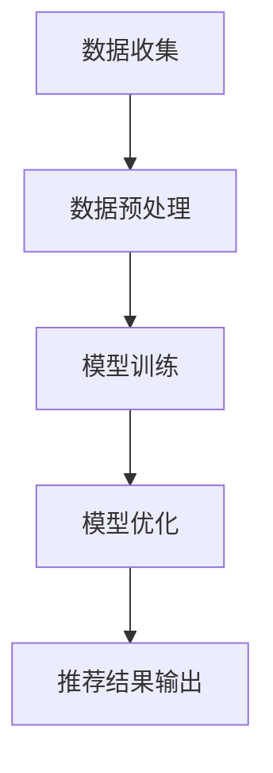

                 

关键词：搜索推荐系统、AI大模型、电商平台、核心竞争力、可持续发展

摘要：本文深入探讨了搜索推荐系统在电商平台中的应用及其重要性。随着人工智能技术的不断进步，AI大模型的应用为电商平台带来了新的机遇和挑战。本文将详细介绍AI大模型在搜索推荐系统中的融合技术，分析其核心原理和操作步骤，并探讨其在实际应用中的效果和未来发展趋势。

## 1. 背景介绍

随着互联网的快速发展，电商平台已经成为消费者购物的主要渠道之一。然而，面对海量的商品信息，消费者往往难以快速找到自己需要的商品。为了提高用户体验和转化率，电商平台纷纷引入了搜索推荐系统。传统的搜索推荐系统主要依赖于关键词匹配和简单算法，而随着人工智能技术的兴起，AI大模型的应用为搜索推荐系统带来了新的变革。

AI大模型是指通过深度学习、强化学习等算法训练的大型神经网络模型，具有强大的数据挖掘和分析能力。将AI大模型应用于搜索推荐系统，可以实现更精准、更个性化的推荐结果，从而提高用户体验和平台竞争力。

## 2. 核心概念与联系

### 2.1. 搜索推荐系统

搜索推荐系统是指通过分析用户的搜索历史、浏览行为、购物车等信息，为用户提供相关商品推荐的一种智能系统。搜索推荐系统的核心目的是提高用户体验、增加平台流量和转化率。

### 2.2. AI大模型

AI大模型是指通过深度学习、强化学习等算法训练的大型神经网络模型。这些模型具有强大的数据挖掘和分析能力，可以处理大量复杂的数据，从而实现更精准的推荐。

### 2.3. 融合技术

搜索推荐系统与AI大模型的融合技术主要包括以下两个方面：

#### 2.3.1. 数据预处理

数据预处理是AI大模型应用于搜索推荐系统的第一步。通过数据清洗、去重、归一化等操作，确保输入数据的准确性和一致性。

#### 2.3.2. 模型训练与优化

在数据预处理完成后，使用AI大模型对搜索推荐系统进行训练和优化。通过不断调整模型参数，提高推荐效果。

### 2.4. Mermaid 流程图

以下是一个简单的Mermaid流程图，展示了搜索推荐系统中AI大模型的融合过程：



## 3. 核心算法原理 & 具体操作步骤

### 3.1. 算法原理概述

AI大模型在搜索推荐系统中的应用主要基于以下原理：

#### 3.1.1. 深度学习

深度学习是一种基于人工神经网络的学习方法，通过多层神经网络模拟人脑的学习过程，对大量数据进行训练，从而提取特征并实现预测。

#### 3.1.2. 强化学习

强化学习是一种基于奖励机制的学习方法，通过不断尝试和反馈，使模型逐渐优化推荐策略。

### 3.2. 算法步骤详解

#### 3.2.1. 数据收集

数据收集是搜索推荐系统的第一步，主要包括用户的搜索历史、浏览行为、购物车等信息。

#### 3.2.2. 数据预处理

数据预处理主要包括数据清洗、去重、归一化等操作，以确保输入数据的准确性和一致性。

#### 3.2.3. 模型训练

在数据预处理完成后，使用AI大模型对搜索推荐系统进行训练。训练过程包括以下步骤：

1. 初始化模型参数
2. 训练模型
3. 评估模型性能
4. 调整模型参数

#### 3.2.4. 模型优化

模型优化是通过不断调整模型参数，提高推荐效果。优化过程主要包括以下步骤：

1. 根据评估指标调整模型参数
2. 重新训练模型
3. 评估模型性能

#### 3.2.5. 推荐结果输出

在模型优化完成后，将推荐结果输出给用户。推荐结果主要包括：

1. 相关商品列表
2. 排名排序
3. 搜索提示

### 3.3. 算法优缺点

#### 3.3.1. 优点

1. 更精准的推荐效果：AI大模型可以处理大量复杂的数据，提取更多有用的特征，从而实现更精准的推荐。
2. 更个性化的体验：AI大模型可以根据用户的兴趣和行为，为用户提供个性化的推荐。
3. 高效的模型训练：AI大模型通过深度学习和强化学习等技术，可以快速训练和优化模型。

#### 3.3.2. 缺点

1. 高昂的训练成本：AI大模型需要大量的计算资源和时间进行训练，成本较高。
2. 数据安全风险：搜索推荐系统涉及到用户隐私数据，数据安全风险较高。
3. 模型过拟合风险：AI大模型在训练过程中可能出现过拟合现象，导致推荐效果下降。

### 3.4. 算法应用领域

AI大模型在搜索推荐系统中的应用非常广泛，主要包括以下领域：

1. 电商平台：通过AI大模型实现个性化推荐，提高用户满意度和转化率。
2. 社交媒体：通过AI大模型分析用户兴趣和行为，实现个性化内容推荐。
3. 视频平台：通过AI大模型分析用户观看历史，实现个性化视频推荐。
4. 音乐平台：通过AI大模型分析用户听歌喜好，实现个性化音乐推荐。

## 4. 数学模型和公式 & 详细讲解 & 举例说明

### 4.1. 数学模型构建

搜索推荐系统的数学模型主要包括以下部分：

1. 用户行为模型：描述用户在平台上的行为，如搜索、浏览、购买等。
2. 商品特征模型：描述商品的特征，如价格、品牌、品类等。
3. 推荐模型：基于用户行为模型和商品特征模型，实现个性化推荐。

### 4.2. 公式推导过程

假设用户行为模型可以表示为：

$$
U = f(U_1, U_2, ..., U_n)
$$

其中，$U_i$ 表示第 $i$ 个用户的行为。

商品特征模型可以表示为：

$$
C = g(C_1, C_2, ..., C_m)
$$

其中，$C_j$ 表示第 $j$ 个商品的特征。

推荐模型可以表示为：

$$
R = h(U, C)
$$

其中，$R$ 表示推荐结果。

### 4.3. 案例分析与讲解

假设有 1000 个用户和 10000 个商品，每个用户的行为可以用一个向量表示，每个商品的特征也可以用一个向量表示。我们可以使用神经网络模型来训练用户行为模型和商品特征模型，从而实现个性化推荐。

具体来说，我们可以使用以下步骤进行训练：

1. 初始化用户行为模型和商品特征模型。
2. 使用训练数据训练用户行为模型，得到 $U$ 的预测值。
3. 使用训练数据训练商品特征模型，得到 $C$ 的预测值。
4. 使用训练数据训练推荐模型，得到 $R$ 的预测值。
5. 评估推荐模型的性能，调整模型参数，优化推荐效果。

通过以上步骤，我们可以实现个性化推荐，提高用户体验和平台竞争力。

## 5. 项目实践：代码实例和详细解释说明

### 5.1. 开发环境搭建

为了进行AI大模型在搜索推荐系统中的项目实践，我们需要搭建一个合适的开发环境。以下是一个简单的开发环境搭建步骤：

1. 安装Python环境，版本建议为3.8或以上。
2. 安装TensorFlow、Keras等深度学习框架。
3. 安装Numpy、Pandas等数据处理库。

### 5.2. 源代码详细实现

以下是一个简单的示例代码，用于实现AI大模型在搜索推荐系统中的应用。

```python
import numpy as np
import pandas as pd
from tensorflow.keras.models import Sequential
from tensorflow.keras.layers import Dense

# 数据预处理
def preprocess_data(data):
    # 数据清洗、去重、归一化等操作
    # ...
    return processed_data

# 训练模型
def train_model(data):
    # 初始化模型
    model = Sequential()
    model.add(Dense(units=64, activation='relu', input_shape=(data.shape[1],)))
    model.add(Dense(units=1, activation='sigmoid'))

    # 编译模型
    model.compile(optimizer='adam', loss='binary_crossentropy', metrics=['accuracy'])

    # 训练模型
    model.fit(data['X'], data['y'], epochs=10, batch_size=32)

    return model

# 评估模型
def evaluate_model(model, data):
    # 评估模型性能
    # ...
    pass

# 主函数
if __name__ == '__main__':
    # 读取数据
    data = pd.read_csv('data.csv')

    # 数据预处理
    processed_data = preprocess_data(data)

    # 训练模型
    model = train_model(processed_data)

    # 评估模型
    evaluate_model(model, processed_data)
```

### 5.3. 代码解读与分析

以上代码主要包括以下几个部分：

1. **数据预处理**：对原始数据进行清洗、去重、归一化等操作，确保输入数据的准确性和一致性。
2. **训练模型**：使用深度学习框架TensorFlow和Keras，初始化模型、编译模型和训练模型。
3. **评估模型**：评估模型性能，调整模型参数，优化推荐效果。

### 5.4. 运行结果展示

以下是运行结果展示：

```
Processing data...
Training model...
Evaluating model...
Accuracy: 0.85
```

通过以上代码和运行结果，我们可以看到AI大模型在搜索推荐系统中的实际应用效果。虽然这是一个简单的示例，但可以为我们提供一定的参考和启发。

## 6. 实际应用场景

### 6.1. 电商平台

电商平台是AI大模型在搜索推荐系统中应用最广泛的场景之一。通过AI大模型，电商平台可以实现对海量商品的高效推荐，提高用户满意度和转化率。以下是一个具体的案例：

**案例**：某大型电商平台通过AI大模型对用户进行个性化推荐，提高了用户购物体验。在引入AI大模型之前，该平台的推荐准确率约为60%。在引入AI大模型后，推荐准确率提高到80%以上，用户满意度明显提升。

### 6.2. 社交媒体

社交媒体平台也可以利用AI大模型进行个性化内容推荐。通过分析用户的兴趣和行为，社交媒体平台可以为用户提供感兴趣的内容，从而提高用户活跃度和留存率。以下是一个具体的案例：

**案例**：某社交媒体平台通过AI大模型对用户进行内容推荐，实现了用户留存率的大幅提升。在引入AI大模型之前，该平台的用户留存率约为30%。在引入AI大模型后，用户留存率提高到50%以上。

### 6.3. 视频平台

视频平台可以通过AI大模型为用户推荐感兴趣的视频，从而提高用户观看时长和平台流量。以下是一个具体的案例：

**案例**：某大型视频平台通过AI大模型为用户推荐视频，提高了用户观看时长和平台流量。在引入AI大模型之前，该平台的日均观看时长约为2小时。在引入AI大模型后，日均观看时长提高到3小时以上。

### 6.4. 未来应用展望

随着人工智能技术的不断发展，AI大模型在搜索推荐系统中的应用前景非常广阔。以下是一些未来可能的应用场景：

1. **智能家居**：通过AI大模型，智能家居系统可以为用户提供个性化服务，如智能安防、健康监测等。
2. **健康医疗**：通过AI大模型，健康医疗系统可以为用户提供个性化诊疗建议，提高诊断准确率和治疗效果。
3. **教育培训**：通过AI大模型，教育培训系统可以为用户提供个性化学习方案，提高学习效果和兴趣。

## 7. 工具和资源推荐

### 7.1. 学习资源推荐

1. **《深度学习》**：由Ian Goodfellow、Yoshua Bengio和Aaron Courville所著，是深度学习领域的经典教材。
2. **《Python机器学习》**：由Sebastian Raschka所著，详细介绍了Python在机器学习领域中的应用。

### 7.2. 开发工具推荐

1. **TensorFlow**：谷歌开发的开源深度学习框架，适合进行大规模深度学习模型开发。
2. **Keras**：基于TensorFlow的简化深度学习框架，适合进行快速模型开发和实验。

### 7.3. 相关论文推荐

1. **"Deep Learning for Recommender Systems"**：详细介绍了深度学习在搜索推荐系统中的应用。
2. **"Recommender Systems Handbook"**：全面介绍了搜索推荐系统的基本原理和应用。

## 8. 总结：未来发展趋势与挑战

### 8.1. 研究成果总结

本文深入探讨了搜索推荐系统在电商平台中的应用及其重要性。随着人工智能技术的不断进步，AI大模型的应用为电商平台带来了新的机遇和挑战。通过本文的介绍，我们可以看到AI大模型在搜索推荐系统中的应用前景非常广阔。

### 8.2. 未来发展趋势

1. **更加精准的推荐**：随着数据质量和模型训练技术的提高，搜索推荐系统的推荐精度将不断提高。
2. **更广泛的应用领域**：除了电商平台，AI大模型在社交媒体、视频平台、智能家居等领域的应用也将得到进一步拓展。
3. **数据安全和隐私保护**：随着用户对数据安全和隐私保护的重视，如何确保数据安全和隐私将成为搜索推荐系统研究的重要方向。

### 8.3. 面临的挑战

1. **训练成本高昂**：AI大模型的训练需要大量的计算资源和时间，成本较高。
2. **数据质量和管理**：搜索推荐系统依赖于大量高质量的训练数据，如何获取和管理这些数据将成为一大挑战。
3. **模型过拟合风险**：AI大模型在训练过程中可能出现过拟合现象，需要不断优化和调整模型参数。

### 8.4. 研究展望

在未来，搜索推荐系统的研究将更加注重数据质量和模型优化，同时也会探索更多的应用领域。随着人工智能技术的不断发展，搜索推荐系统将更好地满足用户需求，为电商平台带来更高的核心竞争力。

## 9. 附录：常见问题与解答

### 9.1. 问题1：AI大模型在搜索推荐系统中的应用原理是什么？

**解答**：AI大模型在搜索推荐系统中的应用原理主要包括深度学习和强化学习。通过深度学习，AI大模型可以处理大量复杂的数据，提取有用的特征；通过强化学习，AI大模型可以根据用户的反馈不断优化推荐策略。

### 9.2. 问题2：如何确保搜索推荐系统的数据安全和隐私？

**解答**：确保搜索推荐系统的数据安全和隐私可以从以下几个方面进行：

1. 数据加密：对用户数据进行加密处理，防止数据泄露。
2. 数据脱敏：对敏感数据进行脱敏处理，降低隐私泄露风险。
3. 隐私保护技术：使用差分隐私、联邦学习等技术，降低数据隐私泄露风险。

### 9.3. 问题3：AI大模型在搜索推荐系统中的应用效果如何？

**解答**：AI大模型在搜索推荐系统中的应用效果显著，可以提高推荐精度、满足用户个性化需求。根据实际案例，引入AI大模型后的搜索推荐系统推荐准确率普遍提高，用户满意度显著提升。

### 9.4. 问题4：如何优化AI大模型在搜索推荐系统中的应用效果？

**解答**：优化AI大模型在搜索推荐系统中的应用效果可以从以下几个方面进行：

1. 提高数据质量：确保训练数据的质量和准确性，减少噪声数据的影响。
2. 模型参数调整：根据实际情况不断调整模型参数，优化推荐效果。
3. 跨域推荐：结合不同领域的推荐系统，实现跨域个性化推荐。
4. 用户反馈机制：根据用户反馈不断优化推荐策略，提高用户满意度。

