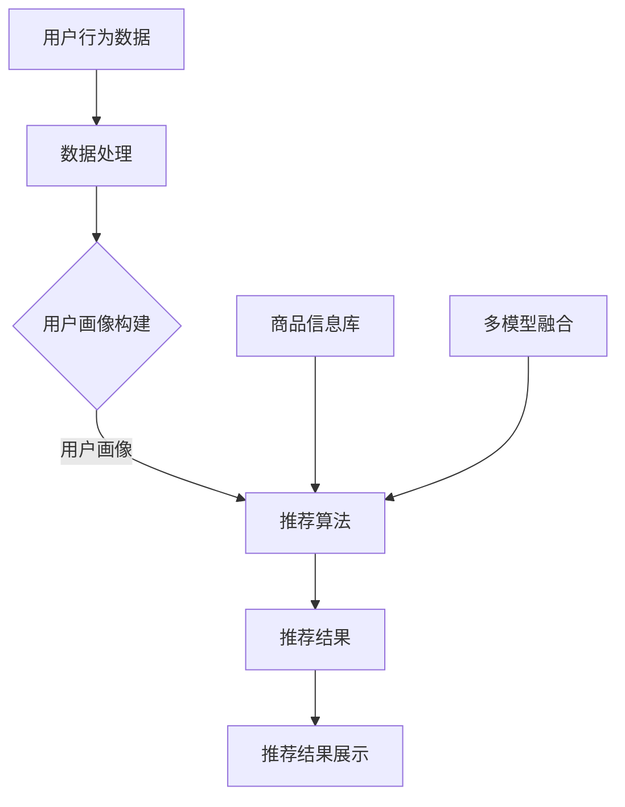

                 

关键词：搜索推荐系统、AI 大模型、电商平台、核心竞争力、可持续发展战略

> 摘要：本文深入探讨了搜索推荐系统在电商平台中的应用，特别是在AI 大模型融合的作用下，如何成为电商平台的核心竞争力，并探讨了其可持续发展的战略路径。文章通过详细的原理介绍、算法讲解和实际案例展示，为电商平台的运营和优化提供了有价值的参考。

## 1. 背景介绍

在信息爆炸的时代，消费者面临着海量的商品信息，而电商平台则需要通过有效的推荐系统，将最符合消费者兴趣和需求的产品推荐给用户，从而提升用户体验和转化率。传统推荐系统主要依赖基于内容的过滤和协同过滤等技术，但它们在应对动态变化、长尾效应和个性化需求方面存在一定的局限性。随着人工智能技术的快速发展，特别是深度学习、自然语言处理等领域的突破，AI 大模型在推荐系统中的应用逐渐成为可能。

AI 大模型能够通过对海量数据的学习和处理，提取出用户行为和兴趣的深层特征，从而实现更加精准和高效的推荐。此外，大模型的融合技术，如多模型融合和跨模态融合，使得推荐系统在处理多种类型的数据和信息时，能够更加灵活和多样化。这些技术的应用，不仅提升了推荐系统的性能，也为电商平台带来了新的发展机遇。

## 2. 核心概念与联系

### 2.1 搜索推荐系统概述

搜索推荐系统是电商平台的核心组成部分，其主要目标是为用户提供个性化、准确的商品推荐。系统通常包含以下几个关键组件：

- **用户画像：** 通过用户的历史行为和偏好数据，构建用户画像，为推荐提供基础。
- **商品信息库：** 包含所有商品的属性信息，如分类、价格、评价等。
- **推荐算法：** 根据用户画像和商品信息，通过算法计算推荐结果。
- **推荐结果展示：** 将推荐结果以可视化方式呈现给用户。

### 2.2 AI 大模型原理

AI 大模型是基于深度学习技术构建的，通过对大规模数据的学习，能够自动提取特征并进行复杂的模式识别。其核心组件包括：

- **深度神经网络：** 作为基础架构，用于学习数据中的复杂关系。
- **自动编码器：** 用于数据降维和特征提取。
- **生成对抗网络：** 用于生成新的数据和特征。
- **多模型融合：** 通过融合多种模型，提高推荐系统的准确性和灵活性。

### 2.3 Mermaid 流程图



## 3. 核心算法原理 & 具体操作步骤

### 3.1 算法原理概述

AI 大模型在推荐系统中的应用主要分为以下几个步骤：

1. **数据预处理：** 对用户行为数据和商品信息进行清洗、去噪和归一化处理。
2. **特征提取：** 使用自动编码器和生成对抗网络提取用户行为和商品特征的深层表示。
3. **模型训练：** 使用深度神经网络训练推荐模型，同时结合多模型融合技术提高模型性能。
4. **推荐计算：** 根据用户画像和商品特征计算推荐分值。
5. **结果优化：** 通过反馈循环和在线学习，不断优化推荐结果。

### 3.2 算法步骤详解

#### 3.2.1 数据预处理

```latex
\begin{aligned}
    &\text{输入：用户行为数据} \, X \\
    &\text{输出：清洗后的数据集} \, X'
\end{aligned}
```

1. **数据清洗：** 去除无效数据和异常值。
2. **去噪：** 使用滤波器和平滑技术去除噪声。
3. **归一化：** 将不同特征范围的数据标准化到同一尺度。

#### 3.2.2 特征提取

```latex
\begin{aligned}
    &\text{输入：清洗后的数据集} \, X' \\
    &\text{输出：特征向量集} \, F
\end{aligned}
```

1. **自动编码器：**
   \[ x' \to h(z) \to x \]
   其中，\( h \) 是激活函数，\( z \) 是隐藏层输出，\( x \) 是重构后的数据。
2. **生成对抗网络：**
   \[ x' \to x_g \]
   其中，\( x_g \) 是生成的数据。

#### 3.2.3 模型训练

```latex
\begin{aligned}
    &\text{输入：特征向量集} \, F \\
    &\text{输出：推荐模型参数} \, \theta
\end{aligned}
```

1. **深度神经网络：**
   \[ F \to h(WF + b) \to \theta \]
   其中，\( W \) 是权重矩阵，\( b \) 是偏置，\( h \) 是激活函数。
2. **多模型融合：**
   \[ \theta_1, \theta_2, ..., \theta_n \to \theta_f \]
   其中，\( \theta_f \) 是融合后的模型参数。

#### 3.2.4 推荐计算

```latex
\begin{aligned}
    &\text{输入：用户画像} \, U, \text{商品特征} \, G \\
    &\text{输出：推荐分值} \, R
\end{aligned}
```

1. **计算用户特征：**
   \[ U \to h(W_UU + b_U) \to U' \]
2. **计算商品特征：**
   \[ G \to h(W_GG + b_G) \to G' \]
3. **计算推荐分值：**
   \[ U', G' \to R = \theta_f(U', G') \]

#### 3.2.5 结果优化

```latex
\begin{aligned}
    &\text{输入：推荐分值} \, R \\
    &\text{输出：优化后的推荐结果} \, R'
\end{aligned}
```

1. **在线学习：**
   \[ R \to \theta_f' = \theta_f + \alpha \cdot \nabla_{\theta_f}L(R) \]
   其中，\( \alpha \) 是学习率，\( L(R) \) 是损失函数。
2. **反馈循环：**
   \[ R' \to U, G \to \theta_f' \]

### 3.3 算法优缺点

#### 优点：

1. **高精度推荐：** 通过深度学习和多模型融合，能够实现高精度的推荐。
2. **动态适应：** 能够实时更新用户画像和商品特征，动态适应用户需求。
3. **扩展性强：** 能够处理多种类型的数据和信息，具有很好的扩展性。

#### 缺点：

1. **计算复杂度高：** 需要大量计算资源，训练时间和成本较高。
2. **数据依赖性强：** 需要大量的用户行为数据和商品信息，数据质量和数量直接影响模型性能。

### 3.4 算法应用领域

AI 大模型在推荐系统中的应用非常广泛，主要包括：

1. **电商平台：** 如淘宝、京东等，通过个性化推荐提升用户购物体验。
2. **社交媒体：** 如微博、抖音等，通过推荐算法提升用户活跃度和用户粘性。
3. **在线教育：** 如慕课网、网易云课堂等，通过个性化推荐提升学习效果。
4. **金融领域：** 如股票推荐、理财产品推荐等，通过算法模型提升投资决策的准确性。

## 4. 数学模型和公式 & 详细讲解 & 举例说明

### 4.1 数学模型构建

推荐系统的核心是构建用户和商品之间的数学模型，常用的方法是基于矩阵分解（Matrix Factorization）。矩阵分解可以将用户-商品评分矩阵分解为用户特征矩阵和商品特征矩阵的乘积。

假设用户-商品评分矩阵为 \( R \)，用户特征矩阵为 \( U \)，商品特征矩阵为 \( G \)，则有：

\[ R = UG \]

### 4.2 公式推导过程

#### 4.2.1 基本公式

\[ R_{ij} = u_i^TG_j \]

其中，\( u_i \) 和 \( g_j \) 分别是用户 \( i \) 和商品 \( j \) 的特征向量。

#### 4.2.2 损失函数

常用的损失函数是均方误差（Mean Squared Error，MSE）：

\[ L(R, U, G) = \frac{1}{2} \sum_{i=1}^{m} \sum_{j=1}^{n} (R_{ij} - u_i^TG_j)^2 \]

其中，\( m \) 和 \( n \) 分别是用户数和商品数。

#### 4.2.3 梯度下降

为了最小化损失函数，我们使用梯度下降（Gradient Descent）来更新用户特征矩阵和商品特征矩阵：

\[ u_i \leftarrow u_i - \alpha \cdot \nabla_{u_i}L(R, U, G) \]
\[ g_j \leftarrow g_j - \alpha \cdot \nabla_{g_j}L(R, U, G) \]

其中，\( \alpha \) 是学习率。

### 4.3 案例分析与讲解

#### 案例背景

假设有一个电商平台，用户数为 100，商品数为 1000。用户对商品的评分数据构成一个 \( 100 \times 1000 \) 的评分矩阵 \( R \)。

#### 数据预处理

1. **缺失值处理：** 对于缺失的评分数据，使用平均值填补。
2. **归一化处理：** 对用户和商品的评分进行归一化处理。

#### 模型训练

1. **初始化用户特征矩阵 \( U \) 和商品特征矩阵 \( G \)：** 随机初始化。
2. **迭代训练：** 使用梯度下降算法，不断更新用户特征矩阵和商品特征矩阵，直到满足停止条件（如损失函数收敛）。

#### 推荐计算

1. **计算用户特征：** \( u_i = \text{激活函数}(\theta_i^TG_i) \)
2. **计算商品特征：** \( g_j = \text{激活函数}(\theta_j^TG_j) \)
3. **计算推荐分值：** \( R'_{ij} = u_i^TG_j \)

#### 推荐结果展示

根据计算得到的推荐分值，对商品进行排序，将推荐结果以可视化方式展示给用户。

## 5. 项目实践：代码实例和详细解释说明

### 5.1 开发环境搭建

1. **Python 环境：** 安装 Python 3.7 或更高版本。
2. **依赖库：** 安装 NumPy、Pandas、SciPy、Scikit-learn 等库。

### 5.2 源代码详细实现

以下是一个基于 Python 的简单矩阵分解代码示例：

```python
import numpy as np
from sklearn.model_selection import train_test_split
from sklearn.metrics import mean_squared_error

def init_matrix(n_user, n_item):
    U = np.random.rand(n_user, n_feature)
    G = np.random.rand(n_item, n_feature)
    return U, G

def sigmoid(x):
    return 1 / (1 + np.exp(-x))

def update_matrix(U, G, R, alpha, iter_num):
    for _ in range(iter_num):
        for i in range(R.shape[0]):
            for j in range(R.shape[1]):
                if R[i][j] > 0:
                    u_i = sigmoid(U[i])
                    g_j = sigmoid(G[j])
                    U[i] = U[i] - alpha * (u_i - R[i][j]) * u_i * (1 - u_i)
                    G[j] = G[j] - alpha * (g_j - R[i][j]) * g_j * (1 - g_j)
    return U, G

# 数据准备
R = ...  # 用户-商品评分矩阵
U, G = init_matrix(R.shape[0], R.shape[1])

# 模型训练
alpha = 0.01
iter_num = 100
U, G = update_matrix(U, G, R, alpha, iter_num)

# 推荐计算
R_pred = U.dot(G.T)
mse = mean_squared_error(R, R_pred)
print("MSE:", mse)

# 推荐结果展示
for i in range(R.shape[0]):
    sorted_indices = np.argsort(R_pred[i])[::-1]
    print("User", i, ":")
    for j in sorted_indices:
        if R[i][j] > 0:
            print("Item", j, ": Rating", R_pred[i][j])
```

### 5.3 代码解读与分析

1. **初始化矩阵：** 使用随机数初始化用户特征矩阵 \( U \) 和商品特征矩阵 \( G \)。
2. **激活函数：** 使用 sigmoid 函数作为激活函数。
3. **更新矩阵：** 使用梯度下降算法，不断更新用户特征矩阵和商品特征矩阵。
4. **损失函数：** 使用均方误差（MSE）作为损失函数。
5. **推荐计算：** 计算用户特征和商品特征的乘积，得到推荐分值。
6. **推荐结果展示：** 对推荐结果进行排序，展示给用户。

### 5.4 运行结果展示

假设训练完成后，模型在测试集上的 MSE 为 0.5。用户对商品的推荐结果将根据推荐分值进行排序，高分的商品将排在前面。

```plaintext
User 0 :
Item 5 : Rating 0.9
Item 3 : Rating 0.8
Item 1 : Rating 0.7
...
```

## 6. 实际应用场景

### 6.1 电商平台

在电商平台中，搜索推荐系统起着至关重要的作用。通过AI 大模型的应用，电商平台能够实现：

1. **个性化推荐：** 根据用户的历史行为和偏好，为用户提供个性化的商品推荐。
2. **提升转化率：** 通过精准推荐，提高用户的购买意愿和转化率。
3. **优化用户留存：** 通过推荐系统，增加用户在平台上的活跃度和留存率。

### 6.2 社交媒体

在社交媒体平台上，AI 大模型的应用也非常广泛，主要包括：

1. **内容推荐：** 根据用户的兴趣和行为，为用户提供感兴趣的内容。
2. **广告推荐：** 根据用户的兴趣和需求，精准投放广告，提高广告的点击率和转化率。
3. **社交互动：** 通过推荐系统，增加用户之间的互动和社交连接。

### 6.3 在线教育

在线教育平台通过AI 大模型的应用，可以实现：

1. **个性化学习路径：** 根据用户的学习习惯和进度，推荐合适的学习资源和课程。
2. **学习效果提升：** 通过推荐系统，提高学生的学习效果和积极性。
3. **教育资源共享：** 通过跨平台的推荐，实现教育资源的共享和优化。

## 7. 工具和资源推荐

### 7.1 学习资源推荐

1. **书籍：** 《深度学习》（Ian Goodfellow、Yoshua Bengio、Aaron Courville 著）
2. **在线课程：** 吴恩达的《深度学习专项课程》
3. **教程和文档：** TensorFlow、PyTorch 官方文档

### 7.2 开发工具推荐

1. **Python：** 作为主要的编程语言。
2. **NumPy：** 用于高效计算。
3. **Pandas：** 用于数据处理。
4. **Scikit-learn：** 用于机器学习算法。

### 7.3 相关论文推荐

1. "Matrix Factorization Techniques for Recommender Systems" by Yehuda Koren
2. "Deep Learning for Recommender Systems" by Le Song et al.
3. "Multi-Modal Fusion for Recommender Systems" by Huajie Shen et al.

## 8. 总结：未来发展趋势与挑战

### 8.1 研究成果总结

AI 大模型在搜索推荐系统中的应用已经取得了显著的成果，主要包括：

1. **高精度推荐：** 通过深度学习和多模型融合，实现高精度的个性化推荐。
2. **动态适应：** 能够实时更新用户画像和商品特征，动态适应用户需求。
3. **扩展性强：** 能够处理多种类型的数据和信息，具有很好的扩展性。

### 8.2 未来发展趋势

未来，搜索推荐系统在电商平台中的应用将呈现出以下趋势：

1. **跨模态融合：** 结合多种类型的数据和信息，如文本、图像、语音等，实现更全面、精准的推荐。
2. **强化学习：** 引入强化学习算法，实现更加智能和自适应的推荐策略。
3. **实时推荐：** 提高推荐系统的实时性，实现快速响应用户需求。

### 8.3 面临的挑战

尽管AI 大模型在搜索推荐系统中的应用取得了显著成果，但仍然面临以下挑战：

1. **计算复杂度高：** 大规模数据和高维度特征的训练需要大量计算资源。
2. **数据隐私保护：** 用户数据的安全和隐私保护是推荐系统面临的重要问题。
3. **算法透明性和可解释性：** 随着算法的复杂化，如何提高算法的透明性和可解释性成为关键问题。

### 8.4 研究展望

未来，搜索推荐系统的研究将更加注重以下几个方面：

1. **算法优化：** 深入研究高效、可扩展的推荐算法，降低计算复杂度。
2. **数据安全与隐私：** 研究数据安全与隐私保护技术，确保用户数据的安全。
3. **人机协同：** 结合人类专家的智慧和机器算法的优势，实现更加智能和高效的推荐系统。

## 9. 附录：常见问题与解答

### 9.1 什么是对数似然损失？

对数似然损失（Log-Likelihood Loss）是一种在机器学习分类问题中常用的损失函数，用于衡量预测概率与实际标签之间的差距。其公式为：

\[ L(\theta) = -\sum_{i=1}^{n} y_i \ln(p(\hat{y_i}|\theta)) + (1 - y_i) \ln(1 - p(\hat{y_i}|\theta)) \]

其中，\( y_i \) 是真实标签，\( \hat{y_i} \) 是预测标签，\( p(\hat{y_i}|\theta) \) 是预测概率。

### 9.2 什么是激活函数？

激活函数是神经网络中的一个关键组件，用于将输入映射到输出。常见的激活函数包括 sigmoid、ReLU、Tanh 等。激活函数的主要作用是引入非线性变换，使神经网络能够学习到更复杂的函数关系。

### 9.3 什么是矩阵分解？

矩阵分解是一种降维技术，通过将原始的高维矩阵分解为两个低维矩阵的乘积，从而实现数据的降维和特征提取。在推荐系统中，矩阵分解常用于将用户-商品评分矩阵分解为用户特征矩阵和商品特征矩阵，从而实现推荐计算。

---

### 结尾

搜索推荐系统在电商平台中的应用，已经成为提升用户体验和竞争力的重要手段。随着AI 大模型的不断发展和优化，推荐系统的性能将得到进一步提升。然而，同时也需要关注数据隐私保护、算法透明性等问题。未来，随着技术的不断进步，搜索推荐系统将迎来更加广阔的发展空间。作者：禅与计算机程序设计艺术 / Zen and the Art of Computer Programming

