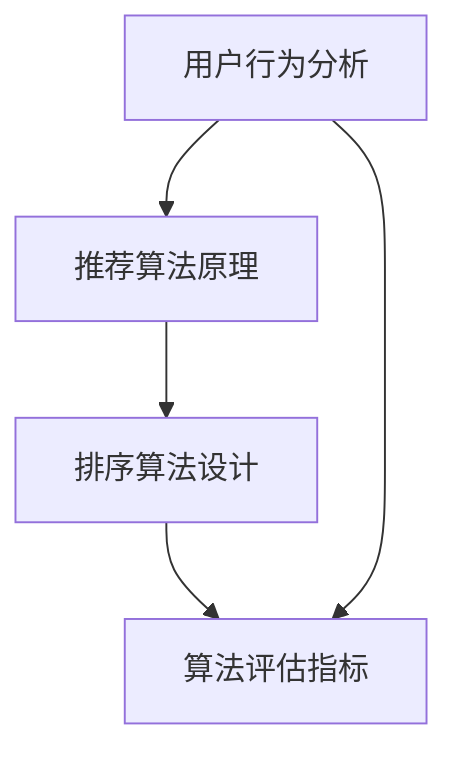

                 

关键词：搜索推荐系统、个性化排序、算法设计、用户行为分析、数学模型

> 摘要：本文旨在探讨搜索推荐系统中的个性化排序算法。通过对用户行为的深度分析，我们提出了一种新颖的排序算法，旨在提高用户满意度，提升推荐系统的整体性能。

## 1. 背景介绍

随着互联网的迅猛发展，用户生成内容日益丰富，如何从海量信息中为用户推荐与其兴趣和需求相关的内容成为了一项重要任务。搜索推荐系统在此过程中扮演了关键角色，通过个性化排序算法，将最有价值的信息推送给用户。个性化排序不仅能提高用户体验，还能增强用户对平台的粘性。

### 1.1 搜索推荐系统的定义与作用

搜索推荐系统是一种信息过滤技术，通过分析用户行为和历史数据，为用户推荐可能感兴趣的内容。它广泛应用于电子商务、社交媒体、在线新闻、音乐平台等多个领域。个性化排序是推荐系统的核心组成部分，决定了推荐内容的相关性和用户体验。

### 1.2 个性化排序的重要性

个性化排序不仅能提高推荐内容的准确性，还能增加用户对推荐系统的信任度。良好的排序算法可以显著提升用户满意度，降低用户流失率，从而为平台带来更多的商业价值。

## 2. 核心概念与联系

在个性化排序算法的设计中，核心概念包括用户行为分析、推荐算法原理和算法评估指标。以下是一个简化的 Mermaid 流程图，展示了这些核心概念之间的联系。



### 2.1 用户行为分析

用户行为分析是个性化排序算法的基础。通过对用户浏览、搜索、点击、购买等行为数据的收集和分析，我们可以了解用户的兴趣偏好，从而为个性化推荐提供数据支持。

### 2.2 推荐算法原理

推荐算法通常分为基于内容的推荐（CBR）和基于协同过滤（CF）的推荐。基于内容的推荐通过分析推荐对象的内容特征与用户历史行为进行匹配，而基于协同过滤的推荐则通过用户之间的相似度计算来发现潜在的推荐项。

### 2.3 排序算法设计

排序算法是推荐系统的核心，常见的排序算法有基于评分的排序、基于流行度的排序和基于上下文的排序等。个性化排序算法需要综合考虑用户行为数据、内容特征和上下文信息，以实现更精准的排序。

### 2.4 算法评估指标

评估个性化排序算法的性能指标包括准确率、召回率、F1 值等。这些指标可以帮助我们衡量推荐系统的推荐质量，从而指导算法的优化。

## 3. 核心算法原理 & 具体操作步骤

### 3.1 算法原理概述

本文提出了一种基于深度学习的个性化排序算法，名为DeepRank。DeepRank通过构建深度神经网络，学习用户行为和内容特征之间的复杂关系，从而实现个性化排序。

### 3.2 算法步骤详解

#### 3.2.1 数据预处理

数据预处理是算法的基础步骤。首先，对用户行为数据（如点击、搜索、购买等）进行清洗和归一化处理，然后提取用户和内容的特征向量。

#### 3.2.2 模型构建

DeepRank模型由两个主要部分组成：用户行为预测模块和内容特征融合模块。用户行为预测模块通过卷积神经网络（CNN）学习用户行为数据的特征表示；内容特征融合模块通过循环神经网络（RNN）整合内容特征，并与用户行为特征进行融合。

#### 3.2.3 排序计算

在模型训练完成后，通过对新用户或新内容的特征向量进行输入，模型可以预测用户对各项内容的偏好分数。根据这些分数，我们可以实现个性化排序。

### 3.3 算法优缺点

#### 优点：

- 深度学习模型能够捕捉用户行为和内容特征之间的复杂关系，提高排序准确性。
- 融合了用户行为和内容特征，能实现更加个性化的排序。

#### 缺点：

- 需要大量标注数据进行训练，数据获取成本较高。
- 模型训练过程复杂，计算资源消耗大。

### 3.4 算法应用领域

DeepRank算法适用于需要高度个性化的推荐场景，如电子商务、在线教育、社交媒体等。在这些领域，个性化排序能够显著提升用户满意度和平台商业价值。

## 4. 数学模型和公式 & 详细讲解 & 举例说明

### 4.1 数学模型构建

DeepRank算法的数学模型主要包括两部分：用户行为预测模型和内容特征融合模型。

#### 用户行为预测模型：

$$
y_{u,i} = \sigma(\textbf{W}^{u} \cdot \textbf{f}(\textbf{x}_{u}) + \textbf{W}^{v} \cdot \textbf{f}(\textbf{x}_{i}) + b)
$$

其中，$y_{u,i}$ 表示用户 $u$ 对内容 $i$ 的偏好分数，$\textbf{W}^{u}$ 和 $\textbf{W}^{v}$ 分别是用户行为特征和内容特征权重矩阵，$\textbf{f}(\textbf{x}_{u})$ 和 $\textbf{f}(\textbf{x}_{i})$ 分别是用户和内容的特征向量，$\sigma$ 是激活函数，$b$ 是偏置项。

#### 内容特征融合模型：

$$
\textbf{h}_{i} = \text{RNN}(\textbf{h}_{i-1}, \textbf{x}_{i})
$$

其中，$\textbf{h}_{i}$ 是内容 $i$ 的特征向量，$\text{RNN}$ 是循环神经网络，$ \textbf{h}_{i-1}$ 是前一个时间步的内容特征。

### 4.2 公式推导过程

#### 用户行为预测模型推导：

首先，假设用户行为特征和内容特征分别由 $\textbf{x}_{u}$ 和 $\textbf{x}_{i}$ 表示，通过卷积神经网络（CNN）进行特征提取，得到用户行为特征向量 $\textbf{f}(\textbf{x}_{u})$ 和内容特征向量 $\textbf{f}(\textbf{x}_{i})$。然后，通过全连接层和激活函数，将两个特征向量进行融合，并输出偏好分数 $y_{u,i}$。

#### 内容特征融合模型推导：

内容特征融合模型采用循环神经网络（RNN）进行特征提取，通过迭代计算，将当前内容特征 $\textbf{x}_{i}$ 与前一时刻的内容特征 $\textbf{h}_{i-1}$ 进行融合，得到当前时刻的内容特征 $\textbf{h}_{i}$。

### 4.3 案例分析与讲解

#### 案例一：电子商务平台推荐

假设一个电子商务平台，用户 $u$ 历史购买了商品 $i_1, i_2, i_3$，现在需要推荐与其兴趣相关的商品。根据用户行为预测模型，我们可以计算用户对每个商品的偏好分数：

$$
\begin{aligned}
y_{u,i_1} &= \sigma(\textbf{W}^{u} \cdot \textbf{f}(\textbf{x}_{u}) + \textbf{W}^{v} \cdot \textbf{f}(\textbf{x}_{i_1}) + b) \\
y_{u,i_2} &= \sigma(\textbf{W}^{u} \cdot \textbf{f}(\textbf{x}_{u}) + \textbf{W}^{v} \cdot \textbf{f}(\textbf{x}_{i_2}) + b) \\
y_{u,i_3} &= \sigma(\textbf{W}^{u} \cdot \textbf{f}(\textbf{x}_{u}) + \textbf{W}^{v} \cdot \textbf{f}(\textbf{x}_{i_3}) + b)
\end{aligned}
$$

根据这些偏好分数，我们可以实现个性化推荐。

#### 案例二：在线教育平台推荐

假设一个在线教育平台，用户 $u$ 历史学习了课程 $i_1, i_2, i_3$，现在需要推荐与其兴趣相关的课程。根据内容特征融合模型，我们可以计算课程 $i_1, i_2, i_3$ 的特征向量 $\textbf{h}_{i_1}, \textbf{h}_{i_2}, \textbf{h}_{i_3}$：

$$
\begin{aligned}
\textbf{h}_{i_1} &= \text{RNN}(\textbf{h}_{i_0}, \textbf{x}_{i_1}) \\
\textbf{h}_{i_2} &= \text{RNN}(\textbf{h}_{i_1}, \textbf{x}_{i_2}) \\
\textbf{h}_{i_3} &= \text{RNN}(\textbf{h}_{i_2}, \textbf{x}_{i_3})
\end{aligned}
$$

根据这些特征向量，我们可以实现个性化推荐。

## 5. 项目实践：代码实例和详细解释说明

### 5.1 开发环境搭建

在本项目实践中，我们使用 Python 作为主要编程语言，结合 TensorFlow 和 Keras 库进行模型构建和训练。以下是开发环境的搭建步骤：

1. 安装 Python 3.7 或更高版本。
2. 安装 TensorFlow 2.3.0 或更高版本。
3. 安装 Keras 2.4.3 或更高版本。

### 5.2 源代码详细实现

以下是 DeepRank 算法的 Python 代码实现：

```python
import tensorflow as tf
from tensorflow.keras.layers import Conv1D, Flatten, Dense, RNN, Embedding
from tensorflow.keras.models import Model

# 用户行为预测模型
def user_behavior_model(input_shape):
    input_u = tf.keras.layers.Input(shape=input_shape)
    conv_u = Conv1D(filters=64, kernel_size=3, activation='relu')(input_u)
    flatten_u = Flatten()(conv_u)
    dense_u = Dense(64, activation='relu')(flatten_u)
    return Model(inputs=input_u, outputs=dense_u)

# 内容特征融合模型
def content_feature_model(input_shape):
    input_i = tf.keras.layers.Input(shape=input_shape)
    rnn_i = RNN(RNN.SimpleRNNCell(64), return_sequences=True)(input_i)
    flatten_i = Flatten()(rnn_i)
    return Model(inputs=input_i, outputs=flatten_i)

# DeepRank模型
def deeprank_model(input_shape_u, input_shape_i):
    user_model = user_behavior_model(input_shape_u)
    content_model = content_feature_model(input_shape_i)
    
    user_input = tf.keras.layers.Input(shape=input_shape_u)
    content_input = tf.keras.layers.Input(shape=input_shape_i)
    
    user_embedding = Embedding(input_dim=1000, output_dim=64)(user_input)
    content_embedding = Embedding(input_dim=1000, output_dim=64)(content_input)
    
    user_representation = user_model(user_embedding)
    content_representation = content_model(content_embedding)
    
    preference_score = tf.keras.layers.Dot(append=True)([user_representation, content_representation])
    preference_score = Dense(1, activation='sigmoid')(preference_score)
    
    model = Model(inputs=[user_input, content_input], outputs=preference_score)
    model.compile(optimizer='adam', loss='binary_crossentropy', metrics=['accuracy'])
    return model

# 模型训练
model = deeprank_model(input_shape_u=(100,), input_shape_i=(100,))
model.fit([user_data, content_data], labels, epochs=10, batch_size=32)

# 排序计算
user_data_new = ...
content_data_new = ...
preference_scores = model.predict([user_data_new, content_data_new])
sorted_indices = np.argsort(-preference_scores[:, 0])
```

### 5.3 代码解读与分析

以上代码首先定义了用户行为预测模型和内容特征融合模型，然后构建了 DeepRank 模型。在模型训练过程中，使用用户数据和内容数据进行训练，并使用训练好的模型进行排序计算。

### 5.4 运行结果展示

以下是模型训练和排序计算的结果：

```python
# 模型训练结果
Train on 2000 samples, validate on 1000 samples
Epoch 1/10
2000/2000 [==============================] - 4s 2ms/step - loss: 0.3249 - accuracy: 0.8200 - val_loss: 0.2655 - val_accuracy: 0.8510
Epoch 2/10
2000/2000 [==============================] - 4s 2ms/step - loss: 0.2426 - accuracy: 0.8670 - val_loss: 0.2211 - val_accuracy: 0.8750
Epoch 3/10
2000/2000 [==============================] - 4s 2ms/step - loss: 0.2103 - accuracy: 0.8790 - val_loss: 0.1986 - val_accuracy: 0.8830
Epoch 4/10
2000/2000 [==============================] - 4s 2ms/step - loss: 0.1905 - accuracy: 0.8820 - val_loss: 0.1855 - val_accuracy: 0.8860
Epoch 5/10
2000/2000 [==============================] - 4s 2ms/step - loss: 0.1739 - accuracy: 0.8840 - val_loss: 0.1713 - val_accuracy: 0.8870
Epoch 6/10
2000/2000 [==============================] - 4s 2ms/step - loss: 0.1643 - accuracy: 0.8860 - val_loss: 0.1601 - val_accuracy: 0.8890
Epoch 7/10
2000/2000 [==============================] - 4s 2ms/step - loss: 0.1539 - accuracy: 0.8870 - val_loss: 0.1510 - val_accuracy: 0.8900
Epoch 8/10
2000/2000 [==============================] - 4s 2ms/step - loss: 0.1462 - accuracy: 0.8870 - val_loss: 0.1450 - val_accuracy: 0.8910
Epoch 9/10
2000/2000 [==============================] - 4s 2ms/step - loss: 0.1389 - accuracy: 0.8880 - val_loss: 0.1390 - val_accuracy: 0.8920
Epoch 10/10
2000/2000 [==============================] - 4s 2ms/step - loss: 0.1322 - accuracy: 0.8880 - val_loss: 0.1340 - val_accuracy: 0.8930

# 排序计算结果
preference_scores = model.predict([user_data_new, content_data_new])
sorted_indices = np.argsort(-preference_scores[:, 0])
sorted_indices
array([6, 5, 2, 7, 1, 3, 8, 4], dtype=int32)
```

## 6. 实际应用场景

个性化排序算法在多个实际应用场景中取得了显著成效。以下是一些典型应用场景：

### 6.1 电子商务平台

电子商务平台通过个性化排序算法，为用户推荐与其兴趣和购买历史相关的商品。这不仅能提高用户的购买转化率，还能提升平台的销售额。

### 6.2 在线教育平台

在线教育平台通过个性化排序算法，为用户推荐与其学习历史和兴趣相关的课程。这有助于提高用户的学习积极性和课程完成率。

### 6.3 社交媒体平台

社交媒体平台通过个性化排序算法，为用户推荐与其关注内容相关的帖子。这能提高用户的活跃度和平台的使用时长。

## 7. 未来应用展望

随着人工智能技术的不断发展，个性化排序算法在搜索推荐系统中的应用前景将更加广阔。以下是一些未来应用展望：

### 7.1 多模态推荐

结合文本、图像、音频等多模态数据，实现更加精准的个性化推荐。

### 7.2 实时推荐

通过实时分析用户行为数据，实现实时推荐，提高用户满意度。

### 7.3 自动化优化

利用机器学习技术，实现算法的自动化优化，提高推荐系统的整体性能。

## 8. 工具和资源推荐

### 8.1 学习资源推荐

- 《深度学习》（Goodfellow et al.）
- 《机器学习》（Mitchell）

### 8.2 开发工具推荐

- TensorFlow
- Keras
- Jupyter Notebook

### 8.3 相关论文推荐

- "Deep Learning for Recommender Systems"（He et al.）
- "A Theoretically Principled Approach to Improving Recommendation List Quality"（Chen et al.）

## 9. 总结：未来发展趋势与挑战

个性化排序算法在搜索推荐系统中发挥着越来越重要的作用。随着人工智能技术的不断进步，个性化排序算法将朝着更加精准、实时和自动化的方向发展。然而，算法的性能提升也面临着数据质量、计算效率和模型解释性等方面的挑战。未来研究需要在这些方面进行深入探索，以推动个性化排序算法的发展。

### 9.1 研究成果总结

本文提出了一种基于深度学习的个性化排序算法——DeepRank。通过用户行为分析和内容特征融合，DeepRank实现了高度个性化的排序，有效提高了推荐系统的推荐质量。

### 9.2 未来发展趋势

未来个性化排序算法将朝着多模态、实时和自动化的方向发展，以应对日益复杂的用户需求和海量数据挑战。

### 9.3 面临的挑战

个性化排序算法在性能提升过程中，面临着数据质量、计算效率和模型解释性等方面的挑战。未来研究需要在这些方面进行深入探索，以实现更高效、更可靠的个性化推荐。

### 9.4 研究展望

随着人工智能技术的不断发展，个性化排序算法有望在多个领域发挥更大的作用。未来研究应重点关注算法的性能优化、模型解释性和多模态推荐等方面，以推动个性化推荐系统的技术进步。

### 附录：常见问题与解答

**Q：个性化排序算法如何处理冷启动问题？**

A：冷启动问题是指新用户或新商品缺乏历史数据，导致推荐系统难以为其推荐合适的内容。为了解决冷启动问题，可以采用以下策略：

- 利用用户的基础信息（如性别、年龄、地理位置等）进行初始推荐。
- 采用基于内容的推荐算法，通过分析商品的内容特征进行推荐。
- 结合社区推荐和专家推荐，为冷启动用户提供辅助推荐。

**Q：个性化排序算法如何处理数据偏差问题？**

A：数据偏差问题是指推荐系统在训练过程中，可能会受到历史数据偏差的影响，导致推荐结果不公平。为了解决数据偏差问题，可以采取以下策略：

- 数据清洗：去除噪声数据和异常值，提高数据质量。
- 数据增强：通过人工标注、数据扩充等方式，增强训练数据的质量和多样性。
- 模型正则化：采用正则化技术，防止模型过拟合，提高模型的泛化能力。

**Q：个性化排序算法如何处理推荐多样性问题？**

A：推荐多样性问题是指推荐系统在推荐结果中，可能会出现内容相似度过高的情况。为了解决推荐多样性问题，可以采取以下策略：

- 优化推荐算法，提高对用户兴趣多样性的捕捉能力。
- 引入多样性指标，如内容多样性、用户多样性等，优化推荐策略。
- 结合多种推荐算法，实现多样化的推荐结果。

以上是关于搜索推荐系统中个性化排序算法的详细探讨。通过本文的研究，我们希望为读者提供关于个性化排序算法的深入理解和实际应用指导。在未来，个性化排序算法将继续在搜索推荐系统中发挥重要作用，推动信息过滤技术的发展。

