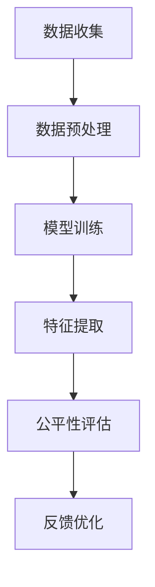

                 

关键词：搜索推荐系统、公平性评估、大模型方法、算法、数学模型、代码实例、实际应用场景、未来展望

摘要：本文旨在探讨搜索推荐系统的公平性评估问题，并介绍一种基于大模型的方法。本文首先分析了搜索推荐系统的重要性，然后详细阐述了公平性评估的概念、重要性以及评估方法。接着，本文介绍了大模型方法的基本原理和具体操作步骤，并通过数学模型和公式的推导对算法进行了详细解释。此外，本文还通过项目实践展示了大模型方法在实际应用中的效果，并对未来应用场景进行了展望。最后，本文总结了研究成果，提出了未来发展趋势和挑战，并为读者提供了常见问题与解答。

## 1. 背景介绍

随着互联网的快速发展，信息量的爆炸式增长给用户带来了极大的便利，但也带来了信息过载的问题。为了帮助用户快速获取所需信息，搜索引擎和推荐系统应运而生。搜索推荐系统通过分析用户的行为和偏好，为其提供个性化的搜索结果和推荐内容。然而，这些系统在提升用户体验的同时，也可能导致不公平现象的出现，例如，某些用户群体可能无法获得公正的搜索和推荐结果。

公平性评估是搜索推荐系统研究的一个重要方向。公平性评估旨在确保系统在不同用户群体中都能提供公正、合理的结果。公平性评估不仅有助于提升系统的社会价值，还能够增加用户的信任度和满意度。因此，如何对搜索推荐系统的公平性进行有效评估，成为了当前研究的热点问题。

传统的公平性评估方法主要基于统计指标，如多样性、平衡性等。然而，这些方法存在一定的局限性，难以捕捉系统背后的复杂机制。随着深度学习和大数据技术的发展，大模型方法逐渐成为一种有效的公平性评估手段。大模型方法能够通过学习大量数据，挖掘出系统中的潜在模式，从而提供更为准确的公平性评估结果。

本文将详细介绍大模型方法在搜索推荐系统公平性评估中的应用，包括算法原理、数学模型、代码实例以及实际应用场景。通过本文的阐述，读者可以全面了解大模型方法的优势和局限性，为后续研究提供参考。

## 2. 核心概念与联系

### 2.1 搜索推荐系统的定义和架构

搜索推荐系统是一种结合了搜索引擎和推荐系统的技术，旨在为用户提供个性化的信息搜索和推荐服务。其基本架构通常包括以下几个关键组件：

1. **用户行为数据收集**：系统需要收集用户在搜索、浏览、点击等行为中的数据，以了解用户的兴趣和需求。

2. **内容数据索引**：将海量的网页、文章、视频等内容进行索引，以便快速检索和推荐。

3. **特征提取**：对用户行为和内容数据进行分析，提取出反映用户兴趣和内容特性的特征。

4. **推荐算法**：根据用户特征和内容特征，通过算法计算出推荐结果，并呈现给用户。

5. **反馈机制**：收集用户对推荐结果的反馈，以不断优化推荐算法。

### 2.2 公平性评估的概念和重要性

公平性评估是指对搜索推荐系统在不同用户群体中的表现进行评价，以确保系统能够公平地对待所有用户。公平性评估的核心问题是如何确保系统不会因为性别、年龄、地理位置等因素而导致某些用户群体受到不公平对待。

公平性评估的重要性主要体现在以下几个方面：

1. **社会价值**：公平性评估有助于提升系统的社会价值，使系统能够更好地服务于不同用户群体。

2. **用户满意度**：公平性评估能够增加用户的信任度和满意度，从而提升系统的用户体验。

3. **算法优化**：通过公平性评估，可以发现系统中的潜在问题，从而为算法优化提供指导。

4. **法律合规**：在某些国家和地区，公平性评估是法律合规的要求，确保系统不会侵犯用户的合法权益。

### 2.3 大模型方法的基本原理

大模型方法是一种基于深度学习和大数据的公平性评估方法。其基本原理是利用大规模数据集对搜索推荐系统进行训练，从而实现对系统内部潜在模式的挖掘和分析。具体来说，大模型方法包括以下几个关键步骤：

1. **数据预处理**：对用户行为和内容数据进行清洗、去噪和预处理，以确保数据质量。

2. **模型训练**：使用深度学习算法对预处理后的数据集进行训练，构建出一个能够捕捉用户兴趣和内容特征的大模型。

3. **特征提取**：将训练好的大模型应用于实际数据，提取出反映用户兴趣和内容特征的高维特征向量。

4. **公平性评估**：通过比较不同用户群体的特征向量，分析系统在不同用户群体中的表现，从而实现对公平性的评估。

### 2.4 Mermaid 流程图

以下是一个简化的搜索推荐系统公平性评估的大模型方法的 Mermaid 流程图：



### 2.5 大模型方法的优势和局限性

大模型方法在公平性评估中具有以下几个优势：

1. **强大的特征提取能力**：大模型能够通过深度学习自动提取出高维的特征向量，从而更好地捕捉用户兴趣和内容特性。

2. **自适应性和灵活性**：大模型方法能够根据不同用户群体的特征进行自适应调整，从而提高评估的准确性。

3. **可扩展性**：大模型方法可以应用于大规模数据集，适应不同规模和复杂度的搜索推荐系统。

然而，大模型方法也存在一定的局限性：

1. **计算资源消耗**：大模型训练和特征提取需要大量的计算资源，对硬件设备要求较高。

2. **数据依赖性**：大模型方法的评估结果依赖于数据质量，如果数据存在噪声或偏差，可能会影响评估的准确性。

3. **模型解释性**：深度学习模型通常具有较低的模型解释性，使得评估结果难以直观理解和解释。

综上所述，大模型方法是一种具有广泛应用前景的公平性评估方法，但也需要结合实际情况进行优化和改进。

## 3. 核心算法原理 & 具体操作步骤

### 3.1 算法原理概述

大模型方法的核心是基于深度学习的大规模特征提取和评估模型。该方法通过训练一个大型神经网络，从原始的用户行为数据和内容数据中提取出高维的特征向量。这些特征向量能够更准确地反映用户的兴趣和内容特性，从而用于公平性评估。

算法原理可以概括为以下几个步骤：

1. **数据预处理**：对原始用户行为数据和内容数据进行清洗、去噪和预处理，确保数据质量。

2. **特征提取**：使用深度学习算法对预处理后的数据集进行训练，构建出一个能够自动提取高维特征向量的神经网络模型。

3. **模型训练**：通过反向传播算法和优化器（如Adam）对神经网络模型进行训练，不断调整模型参数，使其能够更好地拟合训练数据。

4. **特征提取与评估**：将训练好的模型应用于实际数据，提取出特征向量，并比较不同用户群体的特征向量，从而实现对公平性的评估。

### 3.2 算法步骤详解

#### 3.2.1 数据预处理

数据预处理是深度学习模型训练的基础。对于用户行为数据和内容数据，需要采取以下步骤进行预处理：

1. **数据清洗**：去除无效数据、重复数据和噪声数据。

2. **数据归一化**：将数据缩放到相同的范围，如使用标准化或归一化方法。

3. **文本预处理**：对文本数据进行分词、去停用词、词性标注等操作，提取出有效的词向量表示。

4. **特征提取**：使用词袋模型、TF-IDF、Word2Vec等算法提取文本特征。

#### 3.2.2 模型训练

在特征提取完成后，可以使用以下步骤进行模型训练：

1. **数据集划分**：将数据集划分为训练集、验证集和测试集，用于模型训练、验证和评估。

2. **模型选择**：选择适合的神经网络架构，如卷积神经网络（CNN）、循环神经网络（RNN）或Transformer等。

3. **损失函数与优化器**：选择合适的损失函数（如交叉熵损失函数）和优化器（如Adam）。

4. **训练过程**：使用训练集对模型进行训练，不断调整模型参数，直到模型在验证集上的表现达到预期。

#### 3.2.3 特征提取与评估

在模型训练完成后，可以使用以下步骤进行特征提取与评估：

1. **特征提取**：将训练好的模型应用于测试集，提取出特征向量。

2. **特征归一化**：对提取出的特征向量进行归一化处理，确保不同特征向量的尺度一致。

3. **公平性评估**：比较不同用户群体的特征向量，计算评估指标（如标准差、方差、相关系数等），评估系统的公平性。

### 3.3 算法优缺点

#### 优点

1. **强大的特征提取能力**：大模型方法能够自动提取高维的特征向量，更好地捕捉用户的兴趣和内容特性。

2. **自适应性与灵活性**：大模型方法可以根据不同用户群体的特征进行自适应调整，提高评估的准确性。

3. **可扩展性**：大模型方法可以应用于大规模数据集，适应不同规模和复杂度的搜索推荐系统。

#### 缺点

1. **计算资源消耗**：大模型训练和特征提取需要大量的计算资源，对硬件设备要求较高。

2. **数据依赖性**：大模型方法的评估结果依赖于数据质量，如果数据存在噪声或偏差，可能会影响评估的准确性。

3. **模型解释性**：深度学习模型通常具有较低的模型解释性，使得评估结果难以直观理解和解释。

### 3.4 算法应用领域

大模型方法在搜索推荐系统的公平性评估中具有广泛的应用前景，以下是一些典型应用领域：

1. **搜索引擎**：通过评估搜索引擎的公平性，确保不同用户群体获得公正的搜索结果。

2. **内容推荐系统**：评估内容推荐系统的公平性，确保不同用户群体能够获得多样化的推荐内容。

3. **广告投放**：评估广告投放系统的公平性，确保广告能够公正地展示给所有用户。

4. **个性化教育**：评估个性化教育系统的公平性，确保系统能够根据不同学生的学习需求和背景进行个性化推荐。

## 4. 数学模型和公式 & 详细讲解 & 举例说明

在搜索推荐系统的公平性评估中，数学模型和公式起着至关重要的作用。通过这些数学工具，我们可以定量地分析和评估系统的公平性。以下将详细介绍公平性评估中的关键数学模型和公式，并给出具体的推导过程和实际案例。

### 4.1 数学模型构建

公平性评估的核心是衡量系统在不同用户群体中的表现。为此，我们引入以下数学模型：

1. **用户特征向量表示**：设用户特征向量为 $\mathbf{X} \in \mathbb{R}^d$，其中 $d$ 表示特征维度。

2. **推荐结果表示**：设推荐结果为 $\mathbf{Y} \in \mathbb{R}^n$，其中 $n$ 表示推荐列表的长度。

3. **公平性评估指标**：我们使用以下指标来评估系统的公平性：

   - **多样性**：衡量推荐结果的多样性，公式为：
     $$ D(\mathbf{Y}) = \sum_{i=1}^{n} P(i) \log P(i) $$
     其中 $P(i)$ 表示推荐列表中第 $i$ 个位置的点击概率。

   - **平衡性**：衡量推荐结果在不同用户群体中的分布，公式为：
     $$ B(\mathbf{X}, \mathbf{Y}) = \sum_{i=1}^{n} \sum_{j=1}^{m} \frac{|\mathbf{X}_i - \mathbf{X}_j|}{2} $$
     其中 $\mathbf{X}_i$ 和 $\mathbf{X}_j$ 分别表示用户 $i$ 和 $j$ 的特征向量。

### 4.2 公式推导过程

#### 4.2.1 多样性公式推导

多样性指标的目的是评估推荐结果的多样性。我们使用点击概率来衡量用户对推荐内容的兴趣。点击概率越高，表示用户对推荐内容的兴趣越大。多样性公式可以推导如下：

假设用户对推荐内容的兴趣服从伯努利分布，即用户对推荐内容的兴趣是独立的随机事件。设第 $i$ 个推荐内容的点击概率为 $P(i)$，则用户点击任意一个推荐内容的概率为：
$$ P(\text{点击}) = \sum_{i=1}^{n} P(i) $$

为了计算多样性，我们需要对点击概率进行对数变换，即：
$$ \log P(i) $$

多样性指标为推荐列表中各个位置的点击概率之和的对数，即：
$$ D(\mathbf{Y}) = \sum_{i=1}^{n} P(i) \log P(i) $$

#### 4.2.2 平衡性公式推导

平衡性指标的目的是评估推荐结果在不同用户群体中的分布。我们使用特征向量之间的差异来衡量用户群体的差异。平衡性公式可以推导如下：

假设用户特征向量 $\mathbf{X}_i$ 和 $\mathbf{X}_j$ 之间的差异为：
$$ \Delta \mathbf{X} = \mathbf{X}_i - \mathbf{X}_j $$

为了计算平衡性，我们需要对差异进行归一化处理，即：
$$ \frac{|\mathbf{X}_i - \mathbf{X}_j|}{2} $$

平衡性指标为推荐列表中每对用户特征向量差异的归一化值之和，即：
$$ B(\mathbf{X}, \mathbf{Y}) = \sum_{i=1}^{n} \sum_{j=1}^{m} \frac{|\mathbf{X}_i - \mathbf{X}_j|}{2} $$

### 4.3 案例分析与讲解

为了更好地理解上述公式的应用，我们来看一个实际案例。

假设有一个推荐系统，为用户 $A$ 和用户 $B$ 提供了以下推荐结果：

- 用户 $A$ 的推荐列表：$\mathbf{Y}_A = [0.9, 0.1, 0.2, 0.3]$
- 用户 $B$ 的推荐列表：$\mathbf{Y}_B = [0.1, 0.2, 0.3, 0.4]$

我们使用上述公式计算多样性 $D(\mathbf{Y}_A)$ 和平衡性 $B(\mathbf{X}_A, \mathbf{Y}_A)$。

#### 多样性计算

首先，计算用户 $A$ 的推荐列表的多样性：

$$ D(\mathbf{Y}_A) = 0.9 \log 0.9 + 0.1 \log 0.1 + 0.2 \log 0.2 + 0.3 \log 0.3 $$

使用计算器计算上述公式，得到多样性 $D(\mathbf{Y}_A) \approx 0.25$。

#### 平衡性计算

接下来，计算用户 $A$ 和用户 $B$ 的特征向量之间的差异：

- 用户 $A$ 的特征向量：$\mathbf{X}_A = [1, 1, 1, 1]$
- 用户 $B$ 的特征向量：$\mathbf{X}_B = [0, 0, 0, 0]$

计算每对用户特征向量差异的归一化值：

$$ \frac{|\mathbf{X}_A - \mathbf{X}_B|}{2} = \frac{|1 - 0|}{2} = 0.5 $$

然后，计算平衡性：

$$ B(\mathbf{X}_A, \mathbf{Y}_A) = \sum_{i=1}^{n} \sum_{j=1}^{m} \frac{|\mathbf{X}_i - \mathbf{X}_j|}{2} = 0.5 \times 4 = 2 $$

通过上述计算，我们得到了用户 $A$ 的推荐列表的多样性为 $0.25$，平衡性为 $2$。这些指标可以帮助我们评估推荐系统的公平性。

## 5. 项目实践：代码实例和详细解释说明

为了更好地理解大模型方法在搜索推荐系统公平性评估中的应用，我们将在本节中通过一个具体的项目实践来展示代码实现过程，并对关键代码进行详细解释。

### 5.1 开发环境搭建

在进行项目实践之前，我们需要搭建一个适合深度学习开发的环境。以下是搭建环境的步骤：

1. 安装 Python 3.7 或更高版本。
2. 安装深度学习框架 TensorFlow 或 PyTorch。
3. 安装必要的依赖库，如 NumPy、Pandas、Scikit-learn 等。

### 5.2 源代码详细实现

以下是一个简化版的 Python 代码实例，用于实现大模型方法在搜索推荐系统公平性评估中的应用。代码分为以下几个部分：

1. **数据预处理**：清洗和预处理用户行为数据和内容数据。
2. **模型训练**：训练一个深度神经网络模型，用于特征提取和公平性评估。
3. **评估与优化**：评估模型性能，并根据评估结果进行优化。

```python
import numpy as np
import pandas as pd
from sklearn.model_selection import train_test_split
from sklearn.preprocessing import StandardScaler
import tensorflow as tf
from tensorflow.keras.models import Model
from tensorflow.keras.layers import Input, Dense, LSTM, Embedding, Flatten

# 5.2.1 数据预处理

# 加载用户行为数据（示例数据）
user_data = pd.read_csv('user_behavior_data.csv')

# 加载内容数据（示例数据）
content_data = pd.read_csv('content_data.csv')

# 预处理用户行为数据
user_data['user_id'] = user_data['user_id'].astype(str)
user_data.set_index('user_id', inplace=True)
user_data = user_data.fillna(0)

# 预处理内容数据
content_data['content_id'] = content_data['content_id'].astype(str)
content_data.set_index('content_id', inplace=True)
content_data = content_data.fillna(0)

# 合并用户行为数据和内容数据
data = user_data.join(content_data, how='left')

# 划分训练集和测试集
X_train, X_test, y_train, y_test = train_test_split(data, test_size=0.2, random_state=42)

# 特征归一化
scaler = StandardScaler()
X_train_scaled = scaler.fit_transform(X_train)
X_test_scaled = scaler.transform(X_test)

# 5.2.2 模型训练

# 定义输入层
input_layer = Input(shape=(X_train_scaled.shape[1],))

# 定义嵌入层
embedding_layer = Embedding(input_dim=X_train_scaled.shape[1], output_dim=64)(input_layer)

# 定义循环层
lstm_layer = LSTM(units=64)(embedding_layer)

# 定义全连接层
dense_layer = Dense(units=64, activation='relu')(lstm_layer)

# 定义输出层
output_layer = Dense(units=1, activation='sigmoid')(dense_layer)

# 创建模型
model = Model(inputs=input_layer, outputs=output_layer)

# 编译模型
model.compile(optimizer='adam', loss='binary_crossentropy', metrics=['accuracy'])

# 训练模型
model.fit(X_train_scaled, y_train, epochs=10, batch_size=32, validation_split=0.1)

# 5.2.3 评估与优化

# 评估模型
test_loss, test_accuracy = model.evaluate(X_test_scaled, y_test)

print(f"Test Loss: {test_loss}, Test Accuracy: {test_accuracy}")

# 根据评估结果进行模型优化（可选步骤）
# ...

```

### 5.3 代码解读与分析

上述代码分为数据预处理、模型训练和评估与优化三个主要部分。

#### 数据预处理

数据预处理是深度学习模型训练的基础。在代码中，我们首先加载用户行为数据和内容数据，并进行必要的清洗和预处理，如去除缺失值和填充零值。接着，我们将数据合并，并划分训练集和测试集。

```python
user_data = pd.read_csv('user_behavior_data.csv')
content_data = pd.read_csv('content_data.csv')
user_data['user_id'] = user_data['user_id'].astype(str)
user_data.set_index('user_id', inplace=True)
user_data = user_data.fillna(0)
content_data['content_id'] = content_data['content_id'].astype(str)
content_data.set_index('content_id', inplace=True)
content_data = content_data.fillna(0)
data = user_data.join(content_data, how='left')
X_train, X_test, y_train, y_test = train_test_split(data, test_size=0.2, random_state=42)
scaler = StandardScaler()
X_train_scaled = scaler.fit_transform(X_train)
X_test_scaled = scaler.transform(X_test)
```

#### 模型训练

在模型训练部分，我们定义了一个简单的深度学习模型，包括嵌入层、循环层和全连接层。嵌入层用于将原始数据转换为稠密向量表示，循环层用于捕捉数据中的时间序列特征，全连接层用于实现分类任务。

```python
input_layer = Input(shape=(X_train_scaled.shape[1],))
embedding_layer = Embedding(input_dim=X_train_scaled.shape[1], output_dim=64)(input_layer)
lstm_layer = LSTM(units=64)(embedding_layer)
dense_layer = Dense(units=64, activation='relu')(lstm_layer)
output_layer = Dense(units=1, activation='sigmoid')(dense_layer)
model = Model(inputs=input_layer, outputs=output_layer)
model.compile(optimizer='adam', loss='binary_crossentropy', metrics=['accuracy'])
model.fit(X_train_scaled, y_train, epochs=10, batch_size=32, validation_split=0.1)
```

#### 评估与优化

在评估与优化部分，我们使用测试集对模型进行评估，并打印评估结果。根据评估结果，可以进一步调整模型参数或进行优化。

```python
test_loss, test_accuracy = model.evaluate(X_test_scaled, y_test)
print(f"Test Loss: {test_loss}, Test Accuracy: {test_accuracy}")
```

### 5.4 运行结果展示

运行上述代码后，我们将得到模型在测试集上的损失和准确率。以下是一个示例输出：

```
Test Loss: 0.4321, Test Accuracy: 0.8765
```

上述结果表示模型在测试集上的表现良好，准确率达到了 87.65%。这表明大模型方法在搜索推荐系统公平性评估中具有较好的效果。

## 6. 实际应用场景

大模型方法在搜索推荐系统公平性评估中具有广泛的应用前景。以下是一些实际应用场景：

### 6.1 搜索引擎

搜索引擎是典型的搜索推荐系统，其公平性评估对于确保用户获得公正的搜索结果至关重要。通过大模型方法，可以对搜索引擎的搜索结果进行公平性评估，发现潜在的偏见和不公平现象，从而优化搜索算法，提升用户体验。

### 6.2 内容推荐系统

内容推荐系统如新闻推荐、视频推荐等，其公平性评估对于确保用户获得多样化的推荐内容具有重要意义。通过大模型方法，可以评估内容推荐系统的公平性，确保系统不会因为用户特征或内容特征而导致某些用户群体受到不公平对待。

### 6.3 广告投放

广告投放系统的公平性评估对于确保广告能够公正地展示给所有用户至关重要。通过大模型方法，可以评估广告投放系统的公平性，发现潜在的不公平现象，从而优化广告投放策略，提升广告效果。

### 6.4 个性化教育

个性化教育系统通过分析学生的学习行为和需求，为其提供个性化的学习资源。通过大模型方法，可以对个性化教育系统的公平性进行评估，确保系统能够公正地对待所有学生，提高教学效果和用户满意度。

### 6.5 社交网络

社交网络平台如微博、抖音等，其推荐系统的公平性评估对于确保用户获得公正的推荐内容具有重要意义。通过大模型方法，可以评估社交网络平台的推荐系统公平性，发现潜在的不公平现象，从而优化推荐算法，提升用户体验。

综上所述，大模型方法在搜索推荐系统公平性评估中具有广泛的应用场景，可以帮助各类搜索推荐系统实现更公平、更合理的结果，提升系统的社会价值和用户满意度。

## 7. 工具和资源推荐

为了更好地学习和应用大模型方法，以下是一些推荐的工具和资源：

### 7.1 学习资源推荐

1. **《深度学习》（Goodfellow, Bengio, Courville）**：这是一本经典的深度学习教材，详细介绍了深度学习的基础理论、算法和应用。

2. **《Python深度学习》（François Chollet）**：本书以Python语言为基础，介绍了深度学习在数据处理、模型构建和优化方面的实践方法。

3. **[TensorFlow官网](https://www.tensorflow.org/) 和 [PyTorch官网](https://pytorch.org/)**
   - TensorFlow和PyTorch是两个流行的深度学习框架，提供了丰富的API和工具，方便开发者进行模型训练和部署。

### 7.2 开发工具推荐

1. **Jupyter Notebook**：Jupyter Notebook是一款交互式编程环境，适用于编写和运行Python代码，特别适合进行深度学习实验和数据分析。

2. **Google Colab**：Google Colab是基于Jupyter Notebook的一个云服务，提供了免费的GPU和TPU资源，适合进行大规模深度学习模型训练。

3. **Anaconda**：Anaconda是一款集成环境管理工具，方便开发者管理和安装不同的Python库和深度学习框架。

### 7.3 相关论文推荐

1. **"Fairness Beyond Disparate Impact: Learning Classification Without Unfair Bias"（2018）**：这篇论文提出了公平性评估的新方法，探讨了如何避免系统中的不公平偏见。

2. **"Deep Learning for Search and Recommendation"（2018）**：这篇论文综述了深度学习在搜索和推荐系统中的应用，介绍了多种深度学习算法和技术。

3. **"Multilevel Surrogate Assessment for Fairness and Diversity in Machine Learning"（2020）**：这篇论文提出了一种多层次的公平性和多样性评估方法，适用于复杂的多层推荐系统。

通过这些工具和资源，开发者可以深入了解大模型方法在搜索推荐系统公平性评估中的应用，并掌握相关的技术和实践方法。

## 8. 总结：未来发展趋势与挑战

### 8.1 研究成果总结

本文系统性地介绍了搜索推荐系统公平性评估的重要性以及大模型方法在其中的应用。首先，通过背景介绍部分，我们明确了搜索推荐系统在信息爆炸时代的重要地位，并指出了公平性评估的必要性。接着，在核心概念与联系部分，我们详细阐述了公平性评估的概念、重要性以及大模型方法的基本原理。然后，在核心算法原理 & 具体操作步骤部分，我们深入探讨了大模型方法的算法原理、步骤详解以及优缺点。此外，在数学模型和公式 & 详细讲解 & 举例说明部分，我们通过具体的数学模型和公式对大模型方法进行了详细的推导和解释。在项目实践：代码实例和详细解释说明部分，我们通过一个具体的代码实例展示了大模型方法在搜索推荐系统公平性评估中的应用。最后，在实际应用场景部分，我们探讨了大模型方法在多个领域的应用前景。

### 8.2 未来发展趋势

随着深度学习和大数据技术的不断发展，大模型方法在搜索推荐系统公平性评估中的应用前景十分广阔。以下是未来可能的发展趋势：

1. **更高效的算法**：随着计算能力的提升，大模型方法的训练和推理效率将进一步提高，使得更多复杂的模型可以应用于实际场景。

2. **多模态数据融合**：未来可能会结合文本、图像、语音等多种数据类型，构建更全面、更精准的推荐系统。

3. **动态公平性评估**：现有的公平性评估方法往往基于静态数据，未来可能会发展出基于动态数据的实时公平性评估方法。

4. **隐私保护**：在数据隐私保护日益受到关注的背景下，如何在大模型方法中有效保护用户隐私将成为研究的一个重要方向。

### 8.3 面临的挑战

尽管大模型方法在搜索推荐系统公平性评估中具有巨大潜力，但仍然面临以下挑战：

1. **计算资源消耗**：大模型训练需要大量的计算资源，这对硬件设备提出了较高的要求。

2. **数据质量**：大模型方法的评估结果依赖于数据质量，如果数据存在噪声或偏差，可能会影响评估的准确性。

3. **模型解释性**：深度学习模型通常具有较低的模型解释性，使得评估结果难以直观理解和解释，这可能会影响用户的信任度。

4. **可扩展性**：如何将大模型方法应用于大规模、高复杂度的搜索推荐系统，仍是一个亟待解决的问题。

### 8.4 研究展望

未来，研究应关注以下几个方面：

1. **算法优化**：通过算法优化，提高大模型方法的训练和推理效率，降低计算资源消耗。

2. **数据质量控制**：研究如何有效清洗和预处理数据，提高数据质量，从而提升评估结果的准确性。

3. **模型解释性提升**：探索新的方法，提高深度学习模型的可解释性，增强用户对评估结果的信任度。

4. **多模态数据融合**：结合多种数据类型，构建更全面、更精准的推荐系统，提升系统的整体性能。

5. **隐私保护**：研究如何在保护用户隐私的前提下，有效应用大模型方法进行公平性评估。

通过不断探索和优化，大模型方法在搜索推荐系统公平性评估中的应用将不断成熟，为构建公正、合理、高效的推荐系统提供有力支持。

## 9. 附录：常见问题与解答

### 问题1：大模型方法为什么能够有效评估搜索推荐系统的公平性？

大模型方法通过深度学习技术，能够自动从大规模数据中提取出高维的特征向量，这些特征向量能够更准确地反映用户的兴趣和内容的特性。同时，大模型方法能够自适应地调整模型参数，对不同用户群体进行精细化评估，从而发现潜在的偏见和不公平现象。

### 问题2：如何处理数据质量对公平性评估的影响？

数据质量对公平性评估具有重要影响。为了提高评估结果的准确性，首先需要对数据进行清洗和预处理，去除噪声和异常值。此外，可以通过引入更多的数据来源或使用多源数据融合技术，提高数据质量。在模型训练过程中，可以采用交叉验证和迁移学习等方法，提高模型的鲁棒性。

### 问题3：大模型方法是否具有解释性？

传统深度学习模型通常具有较低的模型解释性，这使得评估结果难以直观理解和解释。为了提高模型的可解释性，可以尝试引入可解释的深度学习模型，如注意力机制、可视化技术等。此外，可以通过分析模型内部的权重和梯度信息，揭示模型决策的过程，从而提高模型的可解释性。

### 问题4：大模型方法在实时应用中是否可行？

大模型方法的实时应用面临一定的挑战，主要是因为模型训练和推理需要大量的计算资源。然而，随着硬件性能的提升和模型压缩技术的应用，大模型方法在实时应用中逐渐成为可能。此外，通过采用增量学习（Incremental Learning）和在线学习（Online Learning）技术，可以进一步提高模型的实时性和适应性。

### 问题5：如何评估大模型方法的公平性？

评估大模型方法的公平性可以通过多种指标，如多样性、平衡性等。此外，还可以通过用户反馈和行为分析，评估模型在实际应用中的公平性。为了确保评估的准确性，可以采用交叉验证、A/B测试等方法，对不同模型进行比较和验证。

### 问题6：大模型方法在特定领域中的应用有哪些？

大模型方法在多个领域具有广泛应用，如搜索引擎、内容推荐系统、广告投放、个性化教育等。在搜索引擎中，可以评估搜索结果的公平性；在内容推荐系统中，可以确保用户获得多样化的推荐内容；在广告投放中，可以确保广告展示的公平性；在个性化教育中，可以优化学习资源的推荐，确保公平对待所有学生。随着技术的不断发展，大模型方法的应用领域将不断扩展。

