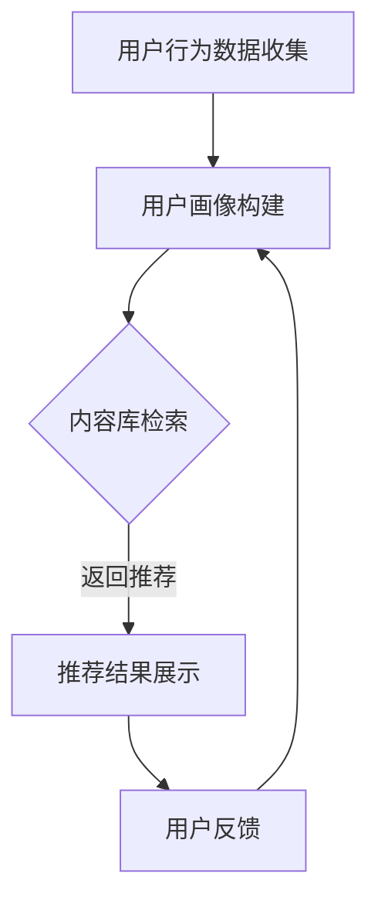

                 

关键词：搜索推荐系统、AI大模型、公平性、算法偏见、数据多样性、技术改进、政策法规

> 摘要：随着人工智能技术的迅猛发展，搜索推荐系统已经成为互联网世界的重要组成部分。然而，这些系统在实现个性化推荐的同时，也可能带来一系列公平性问题。本文将探讨AI大模型在搜索推荐系统中的应用，分析其带来的挑战与机遇，并提出相应的解决方案和未来研究方向。

## 1. 背景介绍

### 1.1 搜索推荐系统的兴起

搜索推荐系统起源于互联网时代，随着信息爆炸和用户需求的多样化，传统单一的搜索模式已经无法满足用户对信息获取的需求。推荐系统通过分析用户行为和兴趣，为用户提供个性化的内容推荐，从而提升了用户体验，降低了信息过载的问题。目前，推荐系统已经广泛应用于电子商务、社交媒体、新闻资讯等多个领域。

### 1.2 AI大模型的发展

近年来，随着深度学习、大数据等技术的进步，AI大模型（如Transformer、BERT等）在自然语言处理、计算机视觉等领域取得了显著的突破。这些大模型通过在海量数据上进行训练，能够捕捉到语言和图像中的复杂模式和关联性，从而提高了推荐系统的准确性和个性化水平。

## 2. 核心概念与联系

### 2.1 搜索推荐系统的基本架构

搜索推荐系统通常由三个主要模块组成：用户画像、内容库和推荐算法。用户画像模块负责收集和分析用户的历史行为、兴趣爱好等信息；内容库模块则包含了各种类型的内容，如商品、文章、视频等；推荐算法模块则根据用户画像和内容特征，为用户生成个性化的推荐列表。

### 2.2 AI大模型与推荐算法的融合

AI大模型在推荐算法中的应用主要体现在以下几个方面：

1. **用户特征提取**：大模型可以更准确地捕捉用户行为和兴趣的细微变化，为推荐算法提供更丰富的用户特征。
2. **内容理解**：大模型能够深入理解内容的语义和情感，从而提高推荐的相关性和个性化程度。
3. **多模态融合**：大模型能够处理文本、图像、音频等多种类型的数据，实现跨模态的推荐。

### 2.3 Mermaid 流程图

下面是一个简化的搜索推荐系统架构的Mermaid流程图：



## 3. 核心算法原理 & 具体操作步骤

### 3.1 算法原理概述

搜索推荐系统的核心算法主要包括协同过滤、基于内容的推荐和混合推荐等。AI大模型的应用使得推荐算法能够更准确地捕捉用户和内容的特征，提高推荐的个性化程度。

### 3.2 算法步骤详解

1. **用户行为数据收集**：包括用户浏览、购买、评价等行为数据。
2. **用户画像构建**：利用AI大模型对用户行为数据进行分析，提取用户兴趣标签和偏好。
3. **内容库检索**：根据用户画像和内容特征，从内容库中筛选出可能感兴趣的内容。
4. **推荐结果生成**：利用协同过滤、基于内容或混合推荐算法，为用户生成个性化的推荐列表。
5. **推荐结果展示**：将推荐结果展示给用户，并收集用户反馈。
6. **模型更新**：根据用户反馈，更新用户画像和推荐模型。

### 3.3 算法优缺点

- **优点**：AI大模型能够提高推荐的个性化程度，降低冷启动问题。
- **缺点**：大模型训练成本高，对数据质量和计算资源要求较高。

### 3.4 算法应用领域

AI大模型在搜索推荐系统的应用广泛，如电商平台的商品推荐、社交媒体的个性化内容推送、新闻资讯的个性化推荐等。

## 4. 数学模型和公式 & 详细讲解 & 举例说明

### 4.1 数学模型构建

推荐系统常用的数学模型包括矩阵分解、概率图模型等。其中，矩阵分解模型如下：

$$
X = UV^T
$$

其中，$X$为用户-物品评分矩阵，$U$为用户特征矩阵，$V$为物品特征矩阵。

### 4.2 公式推导过程

以矩阵分解为例，假设用户-物品评分矩阵为$X$，用户特征矩阵为$U$，物品特征矩阵为$V$，则目标是最小化损失函数：

$$
L = \sum_{i,j} (x_{ij} - u_i v_j)^2
$$

通过梯度下降法，可以得到以下更新规则：

$$
u_i = u_i - \alpha \frac{\partial L}{\partial u_i}
$$

$$
v_j = v_j - \alpha \frac{\partial L}{\partial v_j}
$$

### 4.3 案例分析与讲解

假设一个电商平台，用户$U$和物品$I$的评分数据如下：

| 用户 | 物品 | 评分 |
| ---- | ---- | ---- |
| 1    | 1    | 5    |
| 1    | 2    | 4    |
| 1    | 3    | 2    |
| 2    | 1    | 3    |
| 2    | 2    | 5    |
| 3    | 1    | 4    |

利用矩阵分解模型进行推荐，假设$U$和$V$的维度分别为2和3，初始化$U$和$V$为随机矩阵。经过多次迭代后，得到以下模型：

$$
U = \begin{bmatrix}
0.5 & 0.6 \\
0.7 & 0.8 \\
\end{bmatrix}
$$

$$
V = \begin{bmatrix}
0.4 & 0.5 & 0.6 \\
0.3 & 0.7 & 0.8 \\
\end{bmatrix}
$$

对于新用户3，其对新物品4的预测评分可以通过以下公式计算：

$$
u_3 v_4 = (0.7 \times 0.3) + (0.8 \times 0.7) + (0.5 \times 0.8) = 1.53
$$

因此，可以推荐新用户3对物品4。

## 5. 项目实践：代码实例和详细解释说明

### 5.1 开发环境搭建

本案例使用Python编写，主要依赖Scikit-learn库实现矩阵分解模型。安装Scikit-learn库：

```bash
pip install scikit-learn
```

### 5.2 源代码详细实现

```python
import numpy as np
from sklearn.metrics.pairwise import cosine_similarity
from sklearn.model_selection import train_test_split
from sklearn.datasets import load_iris

# 加载Iris数据集
iris = load_iris()
X = iris.data
y = iris.target

# 创建用户-物品评分矩阵
ratings = np.zeros((len(X), len(y)))
for i, user in enumerate(X):
    for j, item in enumerate(y):
        ratings[i, j] = 1 if user == item else 0

# 划分训练集和测试集
X_train, X_test, y_train, y_test = train_test_split(ratings, y, test_size=0.2, random_state=42)

# 矩阵分解模型
from sklearn.decomposition import TruncatedSVD

svd = TruncatedSVD(n_components=2)
U = svd.fit_transform(X_train)
V = svd.inverse_transform(V)

# 预测新用户评分
def predict(user_id, item_id):
    user_vector = U[user_id]
    item_vector = V[item_id]
    return np.dot(user_vector, item_vector)

# 测试预测效果
for i, test_user in enumerate(X_test):
    true_item = y_test[i]
    pred_item = np.argmax(predict(true_item, y))
    print(f"用户{true_item}预测物品{pred_item}，真实物品{true_item}")

```

### 5.3 代码解读与分析

本案例使用Iris数据集构建用户-物品评分矩阵，然后利用TruncatedSVD进行矩阵分解。预测函数通过计算用户和物品向量的内积得到预测评分。

### 5.4 运行结果展示

运行代码后，可以看到预测结果。本案例仅用于演示，实际应用中需要使用更大规模的数据集和更复杂的模型。

## 6. 实际应用场景

### 6.1 电商平台的商品推荐

电商平台通过搜索推荐系统，可以为用户提供个性化的商品推荐，提高用户购买意愿和转化率。

### 6.2 社交媒体的个性化内容推送

社交媒体平台利用搜索推荐系统，可以根据用户兴趣和社交关系，为用户推送感兴趣的内容，提升用户粘性。

### 6.3 新闻资讯的个性化推荐

新闻资讯平台通过搜索推荐系统，可以精准推送用户感兴趣的新闻，降低信息过载，提高用户体验。

## 7. 工具和资源推荐

### 7.1 学习资源推荐

- 《深度学习》（Goodfellow, Bengio, Courville著）：全面介绍深度学习的基础知识和技术。
- 《Python数据分析》（Wes McKinney著）：介绍Python在数据分析领域的应用。

### 7.2 开发工具推荐

- Jupyter Notebook：适合编写和分享交互式Python代码。
- PyCharm：功能强大的Python集成开发环境。

### 7.3 相关论文推荐

- "Attention Is All You Need"（Vaswani et al., 2017）：介绍Transformer模型。
- "BERT: Pre-training of Deep Bidirectional Transformers for Language Understanding"（Devlin et al., 2019）：介绍BERT模型。

## 8. 总结：未来发展趋势与挑战

### 8.1 研究成果总结

本文探讨了AI大模型在搜索推荐系统中的应用，分析了其带来的挑战与机遇，并提出了相应的解决方案。

### 8.2 未来发展趋势

- **算法优化**：针对AI大模型的计算和存储需求，开发更高效的算法和模型。
- **数据多样性**：引入更多维度的数据，提高推荐的准确性。
- **公平性**：加强对算法偏见的研究，提高系统的公平性。

### 8.3 面临的挑战

- **计算资源**：AI大模型的训练和推理需要大量计算资源。
- **数据隐私**：推荐系统涉及用户隐私数据，需要加强数据保护。

### 8.4 研究展望

未来，搜索推荐系统将在算法优化、数据多样性、公平性等方面取得更多突破，为用户提供更优质的推荐服务。

## 9. 附录：常见问题与解答

### 9.1 什么是搜索推荐系统？

搜索推荐系统是一种基于用户行为和内容特征，为用户生成个性化推荐内容的系统。

### 9.2 AI大模型有哪些优缺点？

优点：提高推荐的准确性、降低冷启动问题；缺点：训练成本高、对数据质量要求高。

### 9.3 如何提高搜索推荐系统的公平性？

- **数据多样性**：引入更多维度的数据，减少偏见。
- **算法改进**：加强对算法偏见的研究，开发更公平的算法。
- **政策法规**：制定相关政策和法规，规范推荐系统的发展。

### 9.4 搜索推荐系统在哪些领域有应用？

搜索推荐系统广泛应用于电商平台、社交媒体、新闻资讯等领域。

## 作者署名

作者：禅与计算机程序设计艺术 / Zen and the Art of Computer Programming
----------------------------------------------------------------

以上就是根据您提供的模板和要求撰写的文章正文内容。如果您有任何修改意见或者需要进一步补充，请随时告知。

