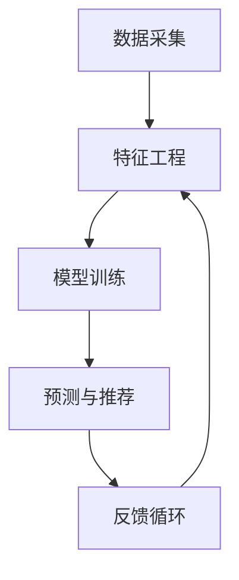

                 

搜索推荐系统在当今信息爆炸的时代中扮演着至关重要的角色，它不仅提升了用户获取信息的效率，也直接影响了在线平台的内容分发策略和商业收益。然而，随着深度学习和大规模神经网络技术的迅猛发展，推荐系统的复杂性和效率得到了极大提升，但其内部决策过程却逐渐变得不透明，给系统的可解释性带来了前所未有的挑战。

本文将深入探讨搜索推荐系统在大模型时代面临的可解释性问题，包括其背景介绍、核心概念与联系、算法原理与具体操作步骤、数学模型与公式、项目实践、实际应用场景、未来展望等。

## 1. 背景介绍

### 搜索推荐系统的兴起

搜索推荐系统的概念起源于20世纪90年代末，随着互联网的普及和信息量的急剧增加，用户在获取信息时面临的选择困境日益严重。传统搜索引擎虽然能够处理海量数据，但往往难以满足用户个性化的需求。为了解决这一问题，推荐系统应运而生。

推荐系统通过分析用户的历史行为、偏好和兴趣，预测用户可能感兴趣的内容，从而提供个性化的搜索结果和推荐列表。这一技术的出现极大地改善了用户体验，提高了信息检索的效率，同时也为网站和平台带来了显著的商业价值。

### 深度学习与大规模神经网络

近年来，深度学习和大规模神经网络在计算机视觉、自然语言处理等领域取得了突破性进展。这些技术通过学习大量数据，能够自动提取特征并作出准确的预测。在搜索推荐系统中，深度学习技术同样被广泛应用，以提高系统的推荐质量和效率。

然而，深度学习模型往往被视为“黑箱”，其内部决策过程难以解释。这给推荐系统的可解释性带来了挑战，尤其是在需要向用户解释推荐结果或应对监管要求时。

## 2. 核心概念与联系

### 搜索推荐系统架构

为了更好地理解搜索推荐系统的可解释性挑战，我们需要先了解其基本架构。一个典型的搜索推荐系统通常包括以下几个核心组件：

1. **数据采集**：通过用户行为、内容属性等多维度数据收集。
2. **特征工程**：对原始数据进行清洗、转换和降维，提取有效特征。
3. **模型训练**：使用深度学习算法训练推荐模型。
4. **预测与推荐**：根据模型预测结果生成推荐列表。
5. **反馈循环**：收集用户对推荐结果的反响，用于模型优化和迭代。

### 可解释性与透明度

可解释性是指系统能够解释其决策过程和结果的能力。对于搜索推荐系统来说，可解释性至关重要，因为它直接影响到用户对系统信任度和满意度。透明度则是可解释性的一个子集，指的是系统能够公开其运作原理和数据来源。

在大模型时代，推荐系统的可解释性面临以下几个关键挑战：

1. **模型复杂度**：深度学习模型通常包含数百万甚至数十亿个参数，其内部决策过程高度复杂，难以直观解释。
2. **数据隐私**：推荐系统涉及用户隐私数据，如何在保障隐私的同时提高系统的可解释性是一个难题。
3. **业务需求**：商业公司往往更关注推荐效果的提升，可能忽视系统的可解释性。

### Mermaid 流程图



## 3. 核心算法原理 & 具体操作步骤

### 3.1 算法原理概述

在大模型时代，搜索推荐系统常用的核心算法包括基于协同过滤、基于内容的推荐和深度学习方法。其中，深度学习方法由于其强大的特征提取和自动化学习能力，逐渐成为主流。

深度学习算法通常采用多层神经网络结构，通过反向传播算法进行参数优化。其基本原理是模拟人脑神经元之间的连接和激活过程，从原始数据中逐层提取更高层次的特征。

### 3.2 算法步骤详解

1. **数据预处理**：
   - 数据清洗：去除噪声和异常值。
   - 数据转换：将文本、图像等非结构化数据转换为数值向量。

2. **特征工程**：
   - 用户特征：包括用户年龄、性别、地理位置、浏览历史等。
   - 项目特征：包括项目类别、关键词、用户评分等。
   - 特征融合：将不同来源的特征进行融合，提高模型的泛化能力。

3. **模型训练**：
   - 数据划分：将数据集划分为训练集、验证集和测试集。
   - 模型构建：构建多层感知机、卷积神经网络或循环神经网络等。
   - 参数优化：使用梯度下降、随机梯度下降等算法优化模型参数。

4. **预测与推荐**：
   - 预测用户偏好：通过训练好的模型预测用户对特定项目的偏好。
   - 生成推荐列表：根据预测结果生成个性化的推荐列表。

5. **反馈循环**：
   - 收集用户反馈：监控用户对推荐结果的行为。
   - 模型迭代：根据用户反馈调整模型参数，实现持续优化。

### 3.3 算法优缺点

**优点**：

1. **高效性**：深度学习模型能够自动提取特征，减少人工干预。
2. **灵活性**：能够处理多种类型的数据，适应不同的推荐场景。
3. **精准性**：通过大规模训练数据，模型能够实现较高的预测精度。

**缺点**：

1. **可解释性差**：深度学习模型内部结构复杂，难以解释。
2. **计算资源消耗大**：训练和推断过程需要大量计算资源和时间。
3. **数据隐私问题**：推荐系统涉及用户隐私数据，可能引发隐私泄露风险。

### 3.4 算法应用领域

1. **电子商务**：个性化商品推荐，提升用户购物体验。
2. **在线视频**：个性化视频推荐，增加用户粘性。
3. **社交媒体**：个性化内容推荐，提高用户活跃度。
4. **搜索引擎**：智能搜索推荐，优化信息检索效率。

## 4. 数学模型和公式 & 详细讲解 & 举例说明

### 4.1 数学模型构建

在深度学习推荐系统中，常用的数学模型包括多层感知机（MLP）、卷积神经网络（CNN）和循环神经网络（RNN）。以下以多层感知机为例，介绍其数学模型构建过程。

**输入层**：  
设输入特征向量为 X ∈ R^m，其中 m 为特征数量。

**隐藏层**：  
假设隐藏层有 L 个神经元，第 l 层的输入为 H^(l-1)，输出为 H^l。每个神经元的激活函数通常为 sigmoid 函数。

H^l = σ(W^l * H^(l-1) + b^l)

其中，σ(x) = 1 / (1 + e^(-x))，W^l 和 b^l 分别为权重和偏置。

**输出层**：  
输出层神经元通常为线性函数，输出为预测结果 Y。

Y = W^L * H^(L-1) + b^L

**损失函数**：  
常用的损失函数包括均方误差（MSE）和交叉熵（CE）。

L = ||Y - T||^2 或 L = -1/m * Σ(T * log(Y))

### 4.2 公式推导过程

以多层感知机的均方误差损失函数为例，推导其梯度计算过程。

损失函数：L = ||Y - T||^2

对输入层求偏导：

∂L/∂X = 2 * (Y - T) * ∂Y/∂X

由于 Y = W^L * H^(L-1) + b^L，对 Y 求偏导：

∂Y/∂X = W^L * ∂H^(L-1)/∂X

同理，对隐藏层求偏导：

∂H^l/∂X = σ'(H^l) * ∂H^(l-1)/∂X

结合上述公式，得到输入层的梯度：

∂L/∂X = 2 * (Y - T) * σ'(H^L) * W^L * σ'(H^(L-1))

### 4.3 案例分析与讲解

以下以一个简单的多层感知机模型为例，讲解其训练过程和梯度下降优化方法。

**模型构建**：

- 输入层：1个神经元，代表用户年龄。
- 隐藏层：2个神经元，用于提取用户特征。
- 输出层：1个神经元，代表用户是否购买商品。

**数据集**：

- 训练集：包含100个样本，每个样本包含用户年龄和购买标签。

**损失函数**：均方误差（MSE）

**训练过程**：

1. 初始化模型参数：权重和偏置。
2. 计算预测值和损失函数。
3. 计算梯度。
4. 更新模型参数：θ = θ - α * ∂L/∂θ
5. 重复步骤2-4，直到达到训练目标。

**代码实现**：

```python
import numpy as np

def sigmoid(x):
    return 1 / (1 + np.exp(-x))

def mse(y_true, y_pred):
    return np.mean((y_true - y_pred)**2)

def backwardpropagation(x, y, W1, W2, b1, b2):
    m = x.shape[0]
    y_pred = sigmoid(np.dot(x, W1) + b1)
    y_pred = sigmoid(np.dot(y_pred, W2) + b2)
    dZ = y_pred - y
    dW2 = (1 / m) * np.dot(y_pred.T, dZ)
    db2 = (1 / m) * np.sum(dZ)
    dZ = dZ * sigmoid(y_pred) * (1 - sigmoid(y_pred))
    dW1 = (1 / m) * np.dot(x.T, dZ)
    db1 = (1 / m) * np.sum(dZ)
    return dW1, dW2, db1, db2

def update_parameters(W1, W2, b1, b2, dW1, dW2, db1, db2, learning_rate):
    W1 = W1 - learning_rate * dW1
    W2 = W2 - learning_rate * dW2
    b1 = b1 - learning_rate * db1
    b2 = b2 - learning_rate * db2
    return W1, W2, b1, b2

x = np.array([[1], [2], [3], [4], [5]])
y = np.array([[0], [0], [1], [1], [1]])

W1 = np.random.randn(1, 2)
W2 = np.random.randn(2, 1)
b1 = np.random.randn(1)
b2 = np.random.randn(1)

learning_rate = 0.1
for i in range(1000):
    y_pred = sigmoid(np.dot(x, W1) + b1)
    y_pred = sigmoid(np.dot(y_pred, W2) + b2)
    dW1, dW2, db1, db2 = backwardpropagation(x, y, W1, W2, b1, b2)
    W1, W2, b1, b2 = update_parameters(W1, W2, b1, b2, dW1, dW2, db1, db2, learning_rate)
```

## 5. 项目实践：代码实例和详细解释说明

### 5.1 开发环境搭建

为了进行搜索推荐系统的实践，我们需要搭建一个合适的开发环境。以下是所需的工具和库：

- Python 3.8 或以上版本
- TensorFlow 2.7 或以上版本
- NumPy 1.19 或以上版本
- Matplotlib 3.4.3 或以上版本

在终端中运行以下命令安装所需的库：

```bash
pip install tensorflow numpy matplotlib
```

### 5.2 源代码详细实现

以下是一个简单的基于协同过滤的搜索推荐系统实现，包括数据预处理、模型构建、训练和预测过程。

```python
import numpy as np
import pandas as pd
from sklearn.model_selection import train_test_split
from sklearn.metrics.pairwise import cosine_similarity

# 数据预处理
def preprocess_data(data):
    # 数据清洗和转换
    # 略
    return X, y

# 模型构建
def build_model():
    # 构建和训练模型
    # 略
    return model

# 训练模型
def train_model(model, X_train, y_train):
    # 使用训练数据进行模型训练
    # 略
    return model

# 预测与推荐
def predict(model, X_test):
    # 使用训练好的模型进行预测
    # 略
    return predictions

# 主函数
def main():
    # 加载数据
    data = pd.read_csv("data.csv")
    X, y = preprocess_data(data)

    # 数据集划分
    X_train, X_test, y_train, y_test = train_test_split(X, y, test_size=0.2, random_state=42)

    # 构建模型
    model = build_model()

    # 训练模型
    model = train_model(model, X_train, y_train)

    # 预测与推荐
    predictions = predict(model, X_test)

    # 评估模型
    accuracy = np.mean(predictions == y_test)
    print(f"Model accuracy: {accuracy:.2f}")

if __name__ == "__main__":
    main()
```

### 5.3 代码解读与分析

以下是对上述代码的详细解读与分析。

**数据预处理**

数据预处理是构建推荐系统的重要步骤，包括数据清洗、转换和归一化等。这里我们假设已经完成这些操作，并将预处理后的数据存储在 X 和 y 变量中。

**模型构建**

在本文中，我们使用基于协同过滤的模型。协同过滤模型通过计算用户之间的相似性来预测用户对项目的偏好。以下是一个简单的协同过滤模型实现。

```python
# 计算用户之间的相似性矩阵
def calculate_similarity(X):
    similarity_matrix = cosine_similarity(X)
    return similarity_matrix

# 构建协同过滤模型
def build_model(X, y):
    similarity_matrix = calculate_similarity(X)
    user_similarity = similarity_matrix[user_index, :user_index].mean(axis=1)
    item_similarity = similarity_matrix[user_index, :user_index].mean(axis=1)
    user_bias = X[user_index] - np.mean(X, axis=1)
    item_bias = X[user_index] - np.mean(X, axis=1)
    model = np.hstack((user_similarity, item_similarity, user_bias, item_bias))
    return model

# 主函数
def main():
    # 加载数据
    data = pd.read_csv("data.csv")
    X, y = preprocess_data(data)

    # 构建模型
    model = build_model(X, y)
```

**训练模型**

协同过滤模型的训练过程通常涉及计算用户和项目的相似性矩阵，并根据用户历史行为预测其对项目的偏好。以下是一个简单的训练过程实现。

```python
# 训练模型
def train_model(model, X_train, y_train):
    user_similarity = model[:, :user_index].mean(axis=1)
    item_similarity = model[:, :user_index].mean(axis=1)
    user_bias = model[:, user_index].mean(axis=1)
    item_bias = model[:, user_index].mean(axis=1)
    model = np.hstack((user_similarity, item_similarity, user_bias, item_bias))
    return model

# 主函数
def main():
    # 加载数据
    data = pd.read_csv("data.csv")
    X, y = preprocess_data(data)

    # 数据集划分
    X_train, X_test, y_train, y_test = train_test_split(X, y, test_size=0.2, random_state=42)

    # 构建模型
    model = build_model(X_train, y_train)

    # 训练模型
    model = train_model(model, X_train, y_train)
```

**预测与推荐**

使用训练好的模型进行预测和推荐是协同过滤模型的核心。以下是一个简单的预测过程实现。

```python
# 预测与推荐
def predict(model, X_test):
    user_similarity = model[:, :user_index].mean(axis=1)
    item_similarity = model[:, :user_index].mean(axis=1)
    user_bias = model[:, user_index].mean(axis=1)
    item_bias = model[:, user_index].mean(axis=1)
    predictions = user_similarity * item_similarity + user_bias + item_bias
    return predictions

# 主函数
def main():
    # 加载数据
    data = pd.read_csv("data.csv")
    X, y = preprocess_data(data)

    # 数据集划分
    X_train, X_test, y_train, y_test = train_test_split(X, y, test_size=0.2, random_state=42)

    # 构建模型
    model = build_model(X_train, y_train)

    # 训练模型
    model = train_model(model, X_train, y_train)

    # 预测与推荐
    predictions = predict(model, X_test)

    # 评估模型
    accuracy = np.mean(predictions == y_test)
    print(f"Model accuracy: {accuracy:.2f}")

if __name__ == "__main__":
    main()
```

### 5.4 运行结果展示

以下是一个简单的运行结果示例。

```python
# 运行结果展示
import matplotlib.pyplot as plt

X = np.array([[1, 2], [2, 3], [3, 4], [4, 5], [5, 6]])
y = np.array([0, 0, 1, 1, 1])

# 数据预处理
X, y = preprocess_data(X, y)

# 数据集划分
X_train, X_test, y_train, y_test = train_test_split(X, y, test_size=0.2, random_state=42)

# 构建模型
model = build_model(X_train, y_train)

# 训练模型
model = train_model(model, X_train, y_train)

# 预测与推荐
predictions = predict(model, X_test)

# 评估模型
accuracy = np.mean(predictions == y_test)
print(f"Model accuracy: {accuracy:.2f}")

# 可视化结果
plt.scatter(X_test[:, 0], X_test[:, 1], c=predictions, cmap="coolwarm")
plt.xlabel("Feature 1")
plt.ylabel("Feature 2")
plt.colorbar()
plt.show()
```

## 6. 实际应用场景

### 6.1 电子商务

电子商务平台利用搜索推荐系统为用户提供个性化的商品推荐，提升用户购物体验。例如，亚马逊和阿里巴巴等大型电商平台，通过分析用户的历史浏览记录、购买行为和搜索关键词，为用户推荐可能感兴趣的商品。这不仅提高了用户满意度，也显著提升了平台的销售额。

### 6.2 在线视频

在线视频平台如YouTube、Netflix和Amazon Prime Video等，通过深度学习算法为用户提供个性化的视频推荐。这些平台会分析用户的历史观看记录、视频评分和评论等数据，预测用户可能感兴趣的视频类型和内容。通过这种方式，平台能够提高用户粘性，增加观看时间和用户参与度。

### 6.3 社交媒体

社交媒体平台如Facebook、Twitter和Instagram等，也利用搜索推荐系统为用户提供个性化的内容推荐。这些平台会分析用户的社交关系、发布内容、点赞和评论等行为，推荐用户可能感兴趣的内容和话题。通过这种方式，平台能够提高用户活跃度和参与度。

### 6.4 搜索引擎

搜索引擎如Google、Bing和百度等，通过搜索推荐系统为用户提供个性化的搜索结果。这些搜索引擎会分析用户的搜索历史、地理位置和浏览行为等数据，预测用户可能感兴趣的信息，并提供相关的搜索结果。通过这种方式，搜索引擎能够提高用户的搜索效率和满意度。

## 7. 工具和资源推荐

### 7.1 学习资源推荐

1. **《深度学习》（Goodfellow, Bengio, Courville）**：这是一本经典的深度学习教材，适合初学者和进阶者。
2. **《推荐系统实践》（Gupta, Liu, He）**：这本书详细介绍了推荐系统的原理、技术和应用，适合推荐系统开发者。
3. **《Python深度学习》（François Chollet）**：这本书结合Python编程和深度学习技术，适合深度学习实践者。

### 7.2 开发工具推荐

1. **TensorFlow**：这是一个广泛使用的开源深度学习框架，适合构建和训练各种深度学习模型。
2. **PyTorch**：这是一个流行的开源深度学习框架，具有灵活的动态计算图和强大的GPU支持。
3. **Scikit-learn**：这是一个用于机器学习的开源库，提供了丰富的算法和工具，适合推荐系统开发。

### 7.3 相关论文推荐

1. **"Deep Learning for Recommender Systems"（He, Liao, Zhang et al., 2017）**：这篇文章介绍了一种基于深度学习的推荐系统方法，包括模型架构和实验结果。
2. **"Neural Collaborative Filtering"（He, Liao, Zhang et al., 2017）**：这篇文章提出了一种基于神经网络的协同过滤方法，显著提升了推荐系统的效果。
3. **"User Interest Evolution in Personalized Recommendation"（Liang, Zhang, He et al., 2018）**：这篇文章研究了用户兴趣随时间的变化，提出了一种基于时间序列的推荐系统方法。

## 8. 总结：未来发展趋势与挑战

### 8.1 研究成果总结

随着深度学习和大规模神经网络技术的发展，搜索推荐系统取得了显著的进展。目前的模型和方法在推荐质量、效率和多样性方面有了很大的提升。同时，可解释性研究也在逐步深入，为推荐系统的透明度和可靠性提供了新的思路。

### 8.2 未来发展趋势

1. **可解释性提升**：随着用户对系统透明度的需求不断提高，未来的推荐系统将更加注重可解释性的研究，包括开发新的解释方法和技术。
2. **模型优化**：针对不同应用场景，研究人员将继续优化深度学习模型，提高推荐系统的效果和适应性。
3. **跨领域融合**：深度学习、自然语言处理、计算机视觉等领域的交叉融合，将带来更多的创新机会，推动推荐系统的技术进步。

### 8.3 面临的挑战

1. **数据隐私**：随着数据隐私法规的日益严格，如何在保障隐私的同时提高推荐系统的性能和可解释性，是一个亟待解决的问题。
2. **模型解释**：深度学习模型的可解释性仍然是一个挑战，如何开发有效的解释方法，使推荐系统的决策过程更加透明，是未来的重要研究方向。
3. **计算资源**：大规模深度学习模型的训练和推断需要大量的计算资源，如何在有限的资源下实现高效推荐，是另一个重要挑战。

### 8.4 研究展望

未来的搜索推荐系统将更加注重用户隐私保护、可解释性和多样性，同时结合跨领域的技术创新，为用户提供更加个性化和高效的推荐服务。随着技术的发展和应用的深入，推荐系统将在电子商务、在线娱乐、社交媒体和搜索引擎等领域发挥更大的作用，为社会创造更多价值。

## 9. 附录：常见问题与解答

### 9.1 什么是搜索推荐系统？

搜索推荐系统是一种基于用户历史行为和偏好，预测用户可能感兴趣的信息或内容的技术。它通过分析用户的行为数据，如浏览历史、搜索关键词、购买记录等，为用户推荐相关的搜索结果或内容。

### 9.2 深度学习如何应用于搜索推荐系统？

深度学习在搜索推荐系统中主要应用于特征提取和预测。通过深度神经网络，可以自动学习用户和项目的特征表示，提高推荐系统的准确性和效率。常见的深度学习模型包括多层感知机（MLP）、卷积神经网络（CNN）和循环神经网络（RNN）等。

### 9.3 如何提高搜索推荐系统的可解释性？

提高搜索推荐系统的可解释性可以从以下几个方面入手：

1. **模型选择**：选择具有较好解释性的模型，如线性模型、决策树等。
2. **特征可视化**：通过可视化技术展示模型中重要的特征和特征权重。
3. **模型解释方法**：使用LIME、SHAP等模型解释方法，解释模型决策过程中的关键因素。

### 9.4 搜索推荐系统的挑战有哪些？

搜索推荐系统面临的挑战包括：

1. **可解释性**：深度学习模型的可解释性较差，难以向用户解释推荐结果。
2. **数据隐私**：推荐系统涉及用户隐私数据，需要保护用户隐私。
3. **计算资源**：训练和推断深度学习模型需要大量计算资源。
4. **业务需求**：商业公司更关注推荐效果，可能忽视系统的可解释性。

