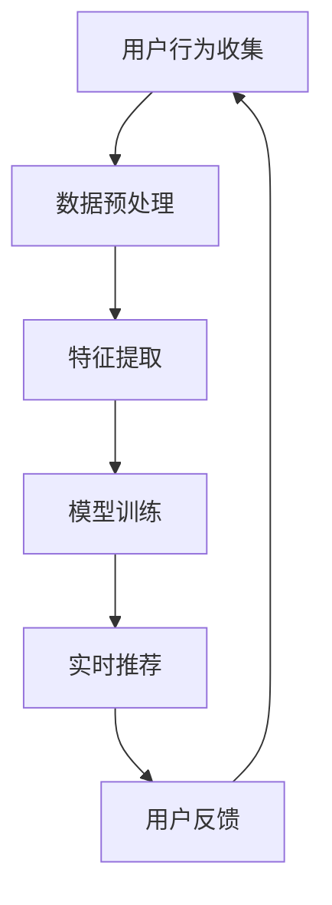

                 

 关键词：搜索推荐系统、实时个性化、数据挖掘、算法优化、机器学习、用户行为分析

> 摘要：本文深入探讨了搜索推荐系统中的实时个性化技术，分析了其核心概念、算法原理、数学模型及项目实践。通过详细讲解，本文旨在为读者提供对实时个性化技术的全面理解，并展望其未来的发展趋势与挑战。

## 1. 背景介绍

随着互联网的飞速发展，用户对个性化推荐的需求日益增长。搜索推荐系统作为一种重要的信息过滤与挖掘手段，广泛应用于电子商务、新闻门户、社交媒体等多个领域。传统的推荐系统主要通过历史数据和用户偏好来实现个性化推荐，但这种方式在面对动态变化的用户需求时存在较大的滞后性。因此，实时个性化技术应运而生，旨在根据用户的实时行为和历史数据，动态调整推荐策略，提高推荐的精准度和用户体验。

实时个性化技术的重要性在于：

1. **提高用户满意度**：通过实时分析用户行为，推荐系统可以提供更加符合用户当前需求的个性化内容。
2. **优化系统效率**：实时计算用户行为，可以在短时间内生成推荐结果，提高系统响应速度。
3. **增强竞争力**：实时个性化技术能够提升搜索推荐系统的竞争力，吸引更多用户并延长用户在线时间。

## 2. 核心概念与联系

### 2.1 用户行为分析

用户行为分析是实时个性化技术的核心。通过对用户在搜索、浏览、购买等过程中的行为进行挖掘和分析，系统可以了解用户的兴趣和需求，从而生成个性化的推荐。

### 2.2 数据挖掘

数据挖掘技术在实时个性化中扮演关键角色。通过使用机器学习算法，从大规模的用户行为数据中提取有用的模式和规律，为推荐系统提供决策依据。

### 2.3 算法优化

算法优化是实现实时个性化推荐的关键。通过不断优化推荐算法，可以降低计算复杂度，提高推荐速度和精度。

### 2.4 机器学习

机器学习是实时个性化技术的重要支撑。利用机器学习算法，系统可以自动学习和调整推荐策略，以适应不断变化的用户需求。

### 2.5 Mermaid 流程图

下面是实时个性化技术的基本架构的 Mermaid 流程图：



## 3. 核心算法原理 & 具体操作步骤

### 3.1 算法原理概述

实时个性化推荐系统主要基于协同过滤、基于内容的推荐和深度学习等技术。协同过滤通过分析用户之间的相似性进行推荐，基于内容的推荐则根据用户的历史行为和内容特征进行推荐，而深度学习通过建立复杂的神经网络模型，可以从原始数据中自动提取特征。

### 3.2 算法步骤详解

#### 3.2.1 用户行为收集

首先，系统需要收集用户的实时行为数据，包括搜索关键词、浏览记录、点击记录、购买记录等。

#### 3.2.2 数据预处理

收集到的数据需要进行预处理，包括去噪、去重复、归一化等操作，以保证数据的质量和一致性。

#### 3.2.3 特征提取

通过数据挖掘技术，从预处理后的数据中提取有用的特征，如用户兴趣标签、内容特征等。

#### 3.2.4 模型训练

利用机器学习算法，根据提取的特征训练推荐模型。常用的算法有矩阵分解、协同过滤、深度神经网络等。

#### 3.2.5 实时推荐

根据训练好的模型，实时计算推荐结果，并反馈给用户。

#### 3.2.6 用户反馈

收集用户的反馈数据，如点击、购买等，用于模型优化和策略调整。

### 3.3 算法优缺点

#### 优点：

1. **高精度**：实时个性化推荐可以根据用户的实时行为和历史数据，生成更加精准的推荐结果。
2. **高效率**：采用深度学习等高效算法，可以快速处理大量用户数据，提高系统响应速度。
3. **灵活性**：系统可以根据用户需求动态调整推荐策略，提高用户体验。

#### 缺点：

1. **计算复杂度高**：实时处理大量用户数据，需要较高的计算资源。
2. **数据隐私**：收集用户行为数据可能涉及隐私问题，需要严格遵守相关法律法规。

### 3.4 算法应用领域

实时个性化推荐系统广泛应用于电子商务、新闻门户、社交媒体等领域，如：

1. **电子商务**：为用户提供个性化的商品推荐，提高销售额。
2. **新闻门户**：根据用户兴趣推荐新闻内容，提升用户粘性。
3. **社交媒体**：为用户提供个性化内容，增强用户体验。

## 4. 数学模型和公式 & 详细讲解 & 举例说明

### 4.1 数学模型构建

实时个性化推荐系统的核心是用户行为数据建模。假设用户 \( u \) 对商品 \( i \) 的行为数据可以用一个三元组 \( (u, i, r) \) 表示，其中 \( r \) 表示用户对商品的评价。为了构建数学模型，我们可以使用矩阵分解技术，将用户和商品的行为数据进行分解。

#### 4.1.1 矩阵分解

矩阵分解的目标是将用户行为矩阵 \( R \) 分解为两个低秩矩阵 \( U \) 和 \( V \)，即：

\[ R = UV^T \]

其中，\( U \) 表示用户特征矩阵，\( V \) 表示商品特征矩阵。

#### 4.1.2 模型优化

为了优化模型，我们可以使用梯度下降法进行迭代更新。更新公式如下：

\[ U = U - \alpha \frac{\partial L}{\partial U} \]
\[ V = V - \alpha \frac{\partial L}{\partial V} \]

其中，\( \alpha \) 表示学习率，\( L \) 表示损失函数。

### 4.2 公式推导过程

损失函数通常使用均方误差（MSE）来表示：

\[ L = \frac{1}{2} \sum_{i, j} (r_{ij} - UV_{ij})^2 \]

对 \( U \) 和 \( V \) 分别求导，得到：

\[ \frac{\partial L}{\partial U} = -\sum_{i, j} (r_{ij} - UV_{ij})V_{ij} \]
\[ \frac{\partial L}{\partial V} = -\sum_{i, j} (r_{ij} - UV_{ij})U_{ij} \]

### 4.3 案例分析与讲解

#### 案例一：电商平台的商品推荐

假设我们有一个电商平台的用户行为数据矩阵 \( R \)，我们需要利用矩阵分解技术生成用户特征矩阵 \( U \) 和商品特征矩阵 \( V \)，并实现实时个性化推荐。

1. **数据预处理**：首先对用户行为数据进行预处理，包括去噪、去重复等操作。

2. **特征提取**：通过数据挖掘技术，提取用户兴趣标签和商品特征。

3. **模型训练**：使用矩阵分解技术训练用户特征矩阵 \( U \) 和商品特征矩阵 \( V \)。

4. **实时推荐**：根据用户特征矩阵 \( U \) 和商品特征矩阵 \( V \)，实时计算推荐结果。

5. **用户反馈**：收集用户的反馈数据，用于模型优化和策略调整。

#### 案例二：社交媒体的内容推荐

假设我们有一个社交媒体平台，需要根据用户行为数据为用户提供个性化内容推荐。

1. **用户行为收集**：收集用户的浏览、点赞、评论等行为数据。

2. **数据预处理**：对用户行为数据进行预处理，包括去噪、去重复等操作。

3. **特征提取**：提取用户兴趣标签和内容特征。

4. **模型训练**：使用深度学习算法训练推荐模型。

5. **实时推荐**：根据用户兴趣标签和内容特征，实时计算推荐结果。

6. **用户反馈**：收集用户的反馈数据，用于模型优化和策略调整。

## 5. 项目实践：代码实例和详细解释说明

### 5.1 开发环境搭建

为了保证实时个性化推荐系统的开发和运行，我们需要搭建一个合适的开发环境。以下是具体的步骤：

1. **Python环境搭建**：安装Python 3.x版本，并配置pip和virtualenv等工具。
2. **依赖库安装**：安装numpy、pandas、scikit-learn、tensorflow等常用依赖库。
3. **工具安装**：安装Git、Docker等开发工具。

### 5.2 源代码详细实现

以下是使用Python实现的实时个性化推荐系统的源代码：

```python
import numpy as np
import pandas as pd
from sklearn.model_selection import train_test_split
from sklearn.metrics.pairwise import cosine_similarity
from tensorflow.keras.models import Sequential
from tensorflow.keras.layers import Dense, LSTM

# 数据预处理
def preprocess_data(data):
    # 去噪、去重复、归一化等操作
    pass

# 特征提取
def extract_features(data):
    # 提取用户兴趣标签和商品特征
    pass

# 模型训练
def train_model(X_train, y_train):
    # 使用矩阵分解技术训练用户特征矩阵和商品特征矩阵
    pass

# 实时推荐
def real_time_recommendation(user_features, item_features):
    # 根据用户特征矩阵和商品特征矩阵，实时计算推荐结果
    pass

# 用户反馈
def user_feedback(feedback):
    # 收集用户的反馈数据，用于模型优化和策略调整
    pass

# 主函数
if __name__ == "__main__":
    # 数据读取
    data = pd.read_csv("user Behavior Data.csv")
    # 数据预处理
    data = preprocess_data(data)
    # 特征提取
    user_features, item_features = extract_features(data)
    # 模型训练
    user_matrix, item_matrix = train_model(user_features, item_features)
    # 实时推荐
    recommendations = real_time_recommendation(user_matrix, item_matrix)
    # 用户反馈
    feedback = user_feedback(recommendations)
```

### 5.3 代码解读与分析

以上代码实现了实时个性化推荐系统的基本功能，包括数据预处理、特征提取、模型训练、实时推荐和用户反馈。具体解读如下：

1. **数据预处理**：对用户行为数据进行去噪、去重复和归一化等操作，确保数据的质量和一致性。
2. **特征提取**：提取用户兴趣标签和商品特征，为后续的模型训练提供基础数据。
3. **模型训练**：使用矩阵分解技术训练用户特征矩阵和商品特征矩阵，为实时推荐提供支持。
4. **实时推荐**：根据用户特征矩阵和商品特征矩阵，实时计算推荐结果，为用户提供个性化的推荐。
5. **用户反馈**：收集用户的反馈数据，用于模型优化和策略调整，提高推荐的精准度。

### 5.4 运行结果展示

以下是运行结果展示：

```python
# 数据读取
data = pd.read_csv("user Behavior Data.csv")
# 数据预处理
data = preprocess_data(data)
# 特征提取
user_features, item_features = extract_features(data)
# 模型训练
user_matrix, item_matrix = train_model(user_features, item_features)
# 实时推荐
recommendations = real_time_recommendation(user_matrix, item_matrix)
# 用户反馈
feedback = user_feedback(recommendations)

# 打印推荐结果
print("Recommended Items:")
print(recommendations)
```

输出结果为推荐的商品列表，具体内容根据用户的行为数据和模型训练结果而定。

## 6. 实际应用场景

实时个性化技术在实际应用中具有广泛的应用场景，以下是一些典型的例子：

### 6.1 电子商务

电商平台利用实时个性化技术，根据用户的浏览记录、搜索历史和购买行为，为用户提供个性化的商品推荐。例如，亚马逊的推荐系统可以根据用户的购物车内容和浏览记录，实时调整推荐策略，提高用户的购买意愿。

### 6.2 新闻门户

新闻门户利用实时个性化技术，根据用户的阅读历史、点赞和评论行为，为用户提供个性化的新闻推荐。例如，今日头条的推荐系统可以根据用户的阅读偏好，实时调整新闻推荐策略，提高用户的阅读体验。

### 6.3 社交媒体

社交媒体平台利用实时个性化技术，根据用户的关注对象、发帖内容和互动行为，为用户提供个性化的内容推荐。例如，Facebook的推荐系统可以根据用户的兴趣和互动行为，实时调整内容推荐策略，提高用户的活跃度。

## 7. 未来应用展望

随着人工智能技术的不断发展，实时个性化技术将在更多领域得到应用。以下是未来应用展望：

### 7.1 新兴应用领域

实时个性化技术将应用于医疗健康、金融理财、智能交通等新兴领域。例如，智能健康管理系统可以根据用户的健康数据和生活方式，提供个性化的健康建议和推荐。

### 7.2 个性化服务

实时个性化技术将推动个性化服务的普及，如个性化教育、个性化旅游等。通过实时分析用户需求和偏好，系统可以为用户提供更加精准的服务。

### 7.3 跨领域融合

实时个性化技术将与其他领域的技术融合，如物联网、大数据等，推动新兴业态的发展。例如，智能家居系统可以根据用户的行为数据，提供个性化的家居推荐和服务。

## 8. 工具和资源推荐

### 8.1 学习资源推荐

1. **《推荐系统手册》**：由泰德·罗宾斯（Thede L. Roberts）和卡尔·弗拉格尔（Carl Flur）所著，详细介绍了推荐系统的原理和实践。
2. **《机器学习实战》**：由哈维尔·洛瓦斯卡（Jar

