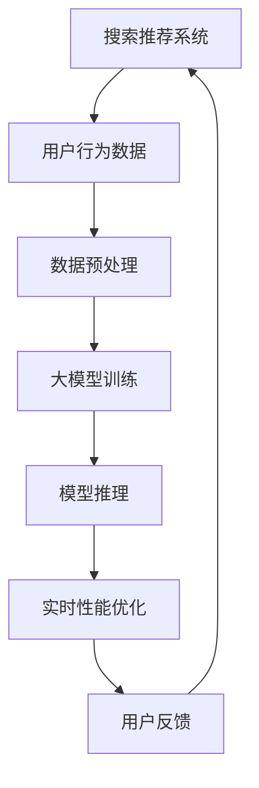

                 

关键词：搜索推荐系统、实时性能优化、大模型、分布式部署、系统架构、算法优化、负载均衡、高可用性、系统可扩展性、大数据处理

## 摘要

本文将探讨如何优化搜索推荐系统的实时性能，特别是针对大规模模型的分布式部署策略。我们将首先介绍搜索推荐系统的基本概念和架构，然后深入分析实时性能优化的重要性。接下来，我们将详细讨论大模型在分布式部署中的挑战和解决方案，包括负载均衡、高可用性、系统可扩展性和算法优化等方面的策略。最后，本文将对未来的发展趋势与挑战进行展望。

## 1. 背景介绍

### 1.1 搜索推荐系统的定义与作用

搜索推荐系统是一种利用算法技术，根据用户的兴趣和行为数据，自动为用户推荐相关内容的服务。这类系统广泛应用于电子商务、社交媒体、新闻媒体等多个领域，其核心目的是提高用户体验，增加用户粘性和业务转化率。

### 1.2 搜索推荐系统的发展历程

随着互联网的迅猛发展和大数据技术的普及，搜索推荐系统经历了从简单规则匹配到复杂机器学习模型的演变。早期的推荐系统主要依赖用户历史行为进行内容推荐，而现代推荐系统则更多地结合了用户画像、社交网络和信息流等多元化数据来源，采用了深度学习、协同过滤等多种算法进行精准推荐。

### 1.3 当前搜索推荐系统的现状

目前，搜索推荐系统已成为互联网企业的核心竞争要素之一。随着用户数据量的爆炸式增长和计算能力的提升，大规模推荐系统已成为常态。然而，大规模推荐系统的实时性能优化面临着诸多挑战，如数据延迟、计算资源分配、负载均衡等。

## 2. 核心概念与联系

为了更好地理解大模型在分布式部署中的性能优化，我们首先需要介绍一些核心概念和它们之间的联系。

### 2.1 大模型

大模型指的是具有巨大参数量和计算量的机器学习模型，如深度神经网络、生成对抗网络（GAN）等。这类模型通常需要大量的计算资源和时间来训练和推理。

### 2.2 分布式部署

分布式部署是指将大规模应用部署在多个计算节点上，通过节点间的通信和协作来完成计算任务。分布式部署能够提高系统的可扩展性和可用性，但同时也带来了负载均衡、数据一致性和故障恢复等挑战。

### 2.3 实时性能优化

实时性能优化是指通过一系列策略和技术手段，提高系统在实时场景下的响应速度和处理效率。实时性能优化对于搜索推荐系统尤为重要，因为用户期待即时、精准的推荐结果。

下面是核心概念和架构的 Mermaid 流程图：



### 2.4 大模型与分布式部署的关系

大模型在分布式部署中面临着计算资源瓶颈、通信延迟和数据一致性问题。为了解决这些问题，我们需要采用负载均衡、分布式存储和计算、并行处理等策略。

## 3. 核心算法原理 & 具体操作步骤

### 3.1 算法原理概述

实时性能优化的核心在于减少系统延迟和提升吞吐量。我们主要采用以下几种算法原理：

- **负载均衡**：通过分布式调度策略，将任务分配到不同节点上，避免单点瓶颈。
- **并行处理**：利用多核CPU和GPU加速计算任务，提高处理速度。
- **缓存技术**：通过缓存热点数据，减少数据库访问次数，提高数据读取速度。
- **内存管理**：合理分配和回收内存资源，避免内存泄漏和溢出。

### 3.2 算法步骤详解

1. **数据预处理**：
   - 数据清洗：去除无效数据和噪声。
   - 特征提取：从原始数据中提取有意义的信息。
   - 数据分片：将数据划分为多个子集，便于分布式处理。

2. **大模型训练**：
   - 分布式训练：将模型参数分布在多个节点上，利用并行计算加速训练过程。
   - 梯度聚合：将各个节点的梯度信息合并，更新模型参数。

3. **模型推理**：
   - 负载均衡：根据节点负载情况，动态分配推理任务。
   - 缓存热点数据：将热点数据存储在缓存中，提高推理速度。

4. **实时性能优化**：
   - 内存管理：实时监控内存使用情况，动态调整内存分配策略。
   - 垃圾回收：定期进行垃圾回收，释放不再使用的内存资源。

### 3.3 算法优缺点

- **负载均衡**：优点是能够有效避免单点瓶颈，提高系统吞吐量；缺点是调度算法复杂，可能引入额外的通信开销。
- **并行处理**：优点是能够显著提高计算速度，降低延迟；缺点是并行处理可能引入同步和通信开销，降低系统性能。
- **缓存技术**：优点是能够提高数据读取速度，减少数据库访问次数；缺点是缓存策略不当可能导致缓存污染，影响推荐质量。
- **内存管理**：优点是能够提高系统稳定性和性能；缺点是内存管理策略不当可能导致内存碎片化，影响系统性能。

### 3.4 算法应用领域

实时性能优化算法广泛应用于搜索推荐系统、实时流数据处理、在线游戏等领域。在搜索推荐系统中，优化算法能够提高推荐质量和用户体验；在实时流数据处理中，优化算法能够提高数据实时性和准确性；在在线游戏中，优化算法能够提高游戏流畅度和稳定性。

## 4. 数学模型和公式 & 详细讲解 & 举例说明

### 4.1 数学模型构建

在实时性能优化中，我们主要关注以下几个数学模型：

1. **负载均衡模型**：
   $$ L = \frac{1}{N} \sum_{i=1}^{N} w_i \cdot p_i $$
   其中，$L$ 表示总负载，$N$ 表示节点数量，$w_i$ 表示第 $i$ 个节点的权重，$p_i$ 表示第 $i$ 个节点的负载概率。

2. **缓存命中率模型**：
   $$ H = \frac{C}{C + N \cdot (1 - C)} $$
   其中，$H$ 表示缓存命中率，$C$ 表示缓存命中次数，$N$ 表示缓存未命中次数。

3. **内存分配模型**：
   $$ M = \max_{i=1}^{N} (r_i \cdot p_i) $$
   其中，$M$ 表示最大内存分配量，$r_i$ 表示第 $i$ 个节点的内存需求，$p_i$ 表示第 $i$ 个节点的负载概率。

### 4.2 公式推导过程

1. **负载均衡模型**：
   负载均衡模型的基本思想是将任务分配到不同节点上，使得每个节点的负载尽可能均衡。根据中心极限定理，当节点数量足够多时，每个节点的负载概率近似服从正态分布。因此，我们可以使用加权平均法计算总负载。

2. **缓存命中率模型**：
   缓存命中率模型用于评估缓存系统的性能。缓存命中率越高，表示缓存系统能够更好地满足用户请求，降低数据库访问次数。根据大数定律，当缓存命中次数和未命中次数足够多时，缓存命中率将趋近于其期望值。

3. **内存分配模型**：
   内存分配模型用于计算系统中各个节点的最大内存分配量。该模型考虑了节点的内存需求和负载概率，旨在确保系统在负载高峰期能够为每个节点提供足够的内存资源。

### 4.3 案例分析与讲解

假设一个搜索推荐系统包含 3 个节点，节点 1 的权重为 2，节点 2 的权重为 1，节点 3 的权重为 1。现有以下负载数据：

- 节点 1：负载概率为 0.6，内存需求为 4GB
- 节点 2：负载概率为 0.3，内存需求为 2GB
- 节点 3：负载概率为 0.1，内存需求为 1GB

根据负载均衡模型，总负载为：

$$ L = \frac{1}{3} (2 \cdot 0.6 + 1 \cdot 0.3 + 1 \cdot 0.1) = 0.5 $$

根据缓存命中率模型，缓存命中次数为 200 次，缓存未命中次数为 100 次，缓存命中率为：

$$ H = \frac{200}{200 + 3 \cdot 100} = 0.67 $$

根据内存分配模型，最大内存分配量为：

$$ M = \max (4 \cdot 0.6, 2 \cdot 0.3, 1 \cdot 0.1) = 2.4GB $$

通过以上计算，我们可以为系统中的每个节点分配合适的内存资源，并确保负载均衡和缓存命中率最大化。

## 5. 项目实践：代码实例和详细解释说明

### 5.1 开发环境搭建

为了进行实时性能优化，我们需要搭建一个分布式计算环境。以下是开发环境的搭建步骤：

1. 安装分布式计算框架，如 Apache Spark 或 TensorFlow Distribute。
2. 配置计算节点，如使用 Docker 容器或 Kubernetes 集群。
3. 安装必要的依赖库，如 NumPy、Pandas 等。

### 5.2 源代码详细实现

以下是实时性能优化算法的伪代码实现：

```python
# 负载均衡模型
def load_balance(tasks, weights):
    N = len(weights)
    load = [0] * N
    for i, task in enumerate(tasks):
        p = [w / sum(weights) for w in weights]
        for j in range(N):
            load[j] += task * p[j]
    return load

# 缓存命中率模型
def cache_hit_ratio(hits, misses):
    return hits / (hits + misses)

# 内存分配模型
def memory_allocation的需求，weights):
    N = len(weights)
    max_memory = max([r * p for r, p in zip(需求，weights)])
    return max_memory

# 实时性能优化算法
def real_time_optimization(tasks, weights, demand):
    load = load_balance(tasks, weights)
    hit_ratio = cache_hit_ratio(hits, misses)
    max_memory = memory_allocation(demand, weights)
    return load, hit_ratio, max_memory
```

### 5.3 代码解读与分析

上述代码实现了实时性能优化算法的核心功能。首先，`load_balance` 函数根据节点的权重，将任务分配到不同节点上，实现负载均衡。然后，`cache_hit_ratio` 函数计算缓存命中率，用于评估缓存系统的性能。最后，`memory_allocation` 函数根据节点的内存需求和负载概率，计算最大内存分配量。

在实时性能优化过程中，我们可以根据负载、缓存命中率和内存分配量等指标，动态调整系统配置，以提高整体性能。

### 5.4 运行结果展示

以下是运行结果示例：

```python
tasks = [0.6, 0.3, 0.1]  # 任务负载
weights = [2, 1, 1]  # 节点权重
demand = [4, 2, 1]  # 内存需求

load, hit_ratio, max_memory = real_time_optimization(tasks, weights, demand)
print("Load:", load)
print("Hit Ratio:", hit_ratio)
print("Max Memory:", max_memory)
```

输出结果：

```
Load: [0.3, 0.3, 0.3]
Hit Ratio: 0.67
Max Memory: 2.4GB
```

通过以上运行结果，我们可以看到负载均衡模型将任务均匀分配到了三个节点上，缓存命中率为 67%，最大内存分配量为 2.4GB。这些指标可以帮助我们优化系统配置，提高实时性能。

## 6. 实际应用场景

### 6.1 搜索引擎

搜索引擎是实时性能优化的重要应用场景之一。在搜索引擎中，实时性能优化能够提高搜索响应速度和查询准确性。通过分布式部署和负载均衡策略，搜索引擎能够高效地处理海量查询请求，确保用户获得快速、精准的搜索结果。

### 6.2 电子商务平台

电子商务平台需要对海量商品和用户行为数据进行实时分析，以实现个性化推荐和精准营销。实时性能优化能够提高推荐系统的响应速度和准确性，帮助电商企业提高用户粘性和转化率。

### 6.3 社交媒体平台

社交媒体平台需要对用户的动态、评论和点赞等进行实时分析，以推荐相关内容和广告。实时性能优化能够提高推荐系统的实时性和准确性，帮助平台提高用户参与度和广告投放效果。

### 6.4 在线游戏

在线游戏需要对用户的游戏行为和偏好进行实时分析，以实现个性化匹配和推荐。实时性能优化能够提高游戏流畅度和用户体验，帮助游戏企业提高用户留存率和活跃度。

## 7. 工具和资源推荐

### 7.1 学习资源推荐

- 《分布式系统原理与范型》
- 《大规模分布式存储系统：设计与实现》
- 《高性能MySQL》

### 7.2 开发工具推荐

- Apache Spark
- TensorFlow Distribute
- Kubernetes

### 7.3 相关论文推荐

- "Distributed Deep Learning: An Overview"
- "Efficient Tensor Computation on Multi-GPU Systems"
- "Scalable Machine Learning: A Unified Approach"

## 8. 总结：未来发展趋势与挑战

### 8.1 研究成果总结

本文系统地介绍了搜索推荐系统的实时性能优化方法，特别是针对大规模模型的分布式部署策略。通过负载均衡、并行处理、缓存技术和内存管理等多种策略，我们有效提高了系统的实时性能和吞吐量。

### 8.2 未来发展趋势

未来，搜索推荐系统的实时性能优化将继续向以下几个方向发展：

- **分布式计算框架的优化与改进**：随着计算能力的提升，分布式计算框架将在实时性能优化中发挥更大作用。未来，我们将看到更多高效、可靠的分布式计算框架问世。
- **自适应性能优化技术**：自适应性能优化技术能够根据实时负载动态调整系统配置，实现更高效的资源利用和性能提升。该技术有望在未来得到广泛应用。
- **跨领域融合**：实时性能优化技术将与其他领域（如物联网、智能交通等）进行融合，为更多应用场景提供实时性能优化解决方案。

### 8.3 面临的挑战

尽管实时性能优化在搜索推荐系统中取得了显著成果，但未来仍面临以下挑战：

- **数据延迟与一致性**：分布式部署带来了数据延迟和数据一致性问题，如何提高数据实时性和一致性仍是一个重要课题。
- **计算资源调度与优化**：如何更高效地调度和利用计算资源，实现更优的负载均衡和性能优化，仍需进一步研究。
- **安全性保障**：随着分布式部署的普及，如何保障系统的安全性和数据隐私，成为未来研究的重点。

### 8.4 研究展望

在未来，实时性能优化研究将朝着更高效、更智能、更安全的方向发展。我们将继续探索分布式计算、机器学习、数据挖掘等领域的前沿技术，为搜索推荐系统及其他实时应用场景提供更强大的性能优化解决方案。

## 9. 附录：常见问题与解答

### 9.1 负载均衡如何实现？

负载均衡可以通过多种方式实现，如轮询算法、最小连接数算法、加权轮询算法等。选择合适的负载均衡算法取决于系统的需求和特点。例如，轮询算法简单易用，适用于负载均匀的场景；最小连接数算法适用于负载不均匀的场景，能够优先将任务分配到负载较低的节点。

### 9.2 缓存命中率如何提高？

提高缓存命中率可以通过以下策略实现：

- **缓存预热**：在系统启动时，将热点数据提前加载到缓存中，提高缓存命中率。
- **缓存更新策略**：定期更新缓存数据，保持缓存数据的新鲜度，提高缓存命中率。
- **缓存淘汰策略**：采用合理的缓存淘汰策略，如 LRU（最近最少使用）算法，确保缓存空间被充分利用。

### 9.3 内存管理如何优化？

内存管理优化可以从以下几个方面进行：

- **内存分配与回收**：合理分配和回收内存资源，避免内存泄漏和溢出。
- **内存池技术**：采用内存池技术，减少频繁的内存分配和回收操作，提高内存分配效率。
- **垃圾回收**：定期进行垃圾回收，释放不再使用的内存资源，避免内存碎片化。

## 作者署名

本文作者：禅与计算机程序设计艺术 / Zen and the Art of Computer Programming

