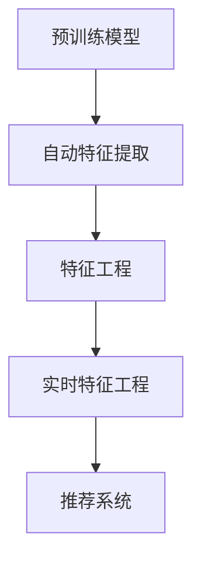

                 

搜索推荐系统是现代信息检索和互联网服务中不可或缺的一部分，它们通过分析用户行为和内容属性，为用户提供个性化的搜索结果和推荐内容。随着数据规模和复杂度的急剧增长，传统的特征工程方法已无法满足实时性和准确性的需求。本文旨在探讨如何利用大型预训练模型（如GPT、BERT等）实现搜索推荐系统的实时特征工程，通过自动特征生成来提升系统的性能和用户体验。

## 1. 背景介绍

在过去的几年中，深度学习和大规模预训练模型取得了显著的进展，这些模型在自然语言处理、计算机视觉和其他领域取得了突破性的成果。然而，在搜索推荐系统中，特征工程仍然是一个具有挑战性的问题。传统的特征工程依赖于人工设计特征，这些特征通常需要大量的领域知识和经验，且无法适应实时性要求高的应用场景。

### 搜索推荐系统的挑战

1. **数据量大**：互联网上的信息量爆炸性增长，每天产生海量数据，这使得特征工程面临数据处理和存储的挑战。
2. **实时性要求**：用户对搜索和推荐服务的响应速度要求越来越高，传统的特征工程方法无法满足实时处理的需求。
3. **个性化需求**：不同用户对内容的兴趣和偏好各异，传统的特征工程方法难以实现个性化的推荐。

### 大模型的优势

1. **自动特征提取**：预训练模型能够自动从海量数据中学习到丰富的特征，减少了人工特征设计的复杂度。
2. **适应性**：大模型具有较强的泛化能力，能够适应不同应用场景，提高推荐的准确性。
3. **实时性**：预训练模型通常具有良好的计算效率，可以在实时环境中快速生成特征。

## 2. 核心概念与联系

为了深入理解搜索推荐系统的实时特征工程，我们首先需要介绍几个核心概念和它们之间的联系。

### 预训练模型

预训练模型是指在大规模语料库上进行预训练，然后针对特定任务进行微调的模型。预训练模型的核心是能够从原始数据中自动提取高层次、抽象的语义特征。

### 特征工程

特征工程是指从原始数据中提取对任务有用的特征，并转化为模型可以处理的形式。在搜索推荐系统中，特征工程是关键步骤，它决定了推荐系统的性能和用户体验。

### 实时特征工程

实时特征工程是指在动态变化的场景中，实时地提取和更新特征，以适应不断变化的数据和用户需求。

### 关系示意图

下面是一个用Mermaid绘制的流程图，展示了预训练模型、特征工程和实时特征工程之间的关系。



## 3. 核心算法原理 & 具体操作步骤

### 3.1 算法原理概述

搜索推荐系统的实时特征工程主要依赖于预训练模型，特别是Transformer架构的模型，如BERT、GPT等。这些模型具有以下核心原理：

1. **多层级特征提取**：预训练模型能够从不同层级（词级、句级、段落级）提取丰富的语义特征。
2. **自适应特征生成**：通过预训练，模型能够根据不同的上下文环境生成自适应的特征表示。
3. **并行计算**：预训练模型支持并行计算，可以高效地处理大规模数据。

### 3.2 算法步骤详解

#### 步骤1：数据预处理

在开始特征工程之前，首先需要对原始数据进行预处理，包括数据清洗、去重、分词等操作。预处理后的数据将作为预训练模型的输入。

#### 步骤2：预训练模型选择

选择一个合适的预训练模型，如BERT或GPT。根据应用场景，可以选择预训练好的模型或者使用自己的数据集进行微调。

#### 步骤3：特征提取

将预处理后的数据输入预训练模型，通过模型的输出获取特征表示。这些特征表示将作为搜索推荐系统的输入特征。

#### 步骤4：特征处理

对提取到的特征进行进一步的处理，如降维、归一化、特征融合等，以提高特征的质量和模型的性能。

#### 步骤5：特征更新

实时监测用户行为和内容变化，动态更新特征。这可以通过在线学习或者增量学习的方式实现。

#### 步骤6：特征融合

将实时特征与历史特征进行融合，以构建一个全面的特征向量。

#### 步骤7：特征使用

将特征向量输入推荐模型，生成个性化的推荐结果。

### 3.3 算法优缺点

#### 优点：

1. **高效性**：预训练模型支持并行计算，可以高效地处理大规模数据。
2. **自适应**：预训练模型能够根据不同的上下文环境生成自适应的特征表示。
3. **多样性**：预训练模型能够提取多层级、丰富的语义特征，提高推荐的准确性。

#### 缺点：

1. **计算资源消耗**：预训练模型需要大量的计算资源和存储空间。
2. **依赖数据**：预训练模型的性能依赖于训练数据的质量和规模。
3. **实时性挑战**：在实时场景中，更新特征和模型需要考虑计算资源和延迟的问题。

### 3.4 算法应用领域

实时特征工程在搜索推荐系统中的应用非常广泛，包括但不限于以下领域：

1. **电商推荐**：通过用户浏览、购买等行为生成实时特征，实现个性化的商品推荐。
2. **新闻推荐**：根据用户阅读、点赞等行为，实时推荐个性化的新闻内容。
3. **社交网络**：通过用户发布、互动等行为，实时推荐相关的内容和用户。

## 4. 数学模型和公式 & 详细讲解 & 举例说明

### 4.1 数学模型构建

搜索推荐系统的实时特征工程可以看作是一个序列到序列的映射问题，即：

$$ X_t = f(U_t, C_t) $$

其中，$X_t$表示时间步$t$的特征向量，$U_t$表示用户行为特征，$C_t$表示内容特征，$f$表示特征生成函数。

### 4.2 公式推导过程

特征生成函数$f$可以表示为：

$$ f(U_t, C_t) = \text{Transformer}(U_t; C_t) $$

其中，Transformer模型由多个编码器和解码器层组成，每层包含自注意力机制和前馈网络。自注意力机制可以表示为：

$$ \text{Attention}(Q, K, V) = \frac{QK^T}{\sqrt{d_k}} \odot V $$

其中，$Q$、$K$和$V$分别为查询、键和值向量，$d_k$为键向量的维度。

### 4.3 案例分析与讲解

假设我们有一个用户行为序列$U_t = [u_1, u_2, \ldots, u_n]$，其中$u_i$表示第$i$个时间步的用户行为。我们希望根据这个序列生成特征向量$X_t$。

首先，我们将用户行为序列编码为查询向量$Q$、键向量$K$和值向量$V$：

$$ Q = [Q_1, Q_2, \ldots, Q_n], K = [K_1, K_2, \ldots, K_n], V = [V_1, V_2, \ldots, V_n] $$

然后，通过自注意力机制计算每个时间步的特征表示：

$$ \text{Attention}(Q, K, V) = \frac{Q_1K_1^T}{\sqrt{d_k}} \odot V_1, \text{Attention}(Q, K, V) = \frac{Q_2K_2^T}{\sqrt{d_k}} \odot V_2, \ldots, \text{Attention}(Q, K, V) = \frac{Q_nK_n^T}{\sqrt{d_k}} \odot V_n $$

最后，将所有时间步的特征表示拼接起来，得到最终的特征向量$X_t$：

$$ X_t = [X_{t1}, X_{t2}, \ldots, X_{tn}] $$

其中，$X_{ti} = \text{Attention}(Q, K, V)$。

## 5. 项目实践：代码实例和详细解释说明

### 5.1 开发环境搭建

为了实现搜索推荐系统的实时特征工程，我们需要搭建以下开发环境：

- 操作系统：Ubuntu 20.04
- Python版本：3.8
- 硬件环境：NVIDIA GPU（至少1GB显存）

### 5.2 源代码详细实现

以下是一个基于Python和PyTorch实现的实时特征工程示例：

```python
import torch
import torch.nn as nn
import torch.optim as optim
from transformers import BertModel

# 数据预处理
def preprocess_data(data):
    # 数据清洗、去重、分词等操作
    pass

# 特征提取
class FeatureExtractor(nn.Module):
    def __init__(self, model_name):
        super(FeatureExtractor, self).__init__()
        self.bert = BertModel.from_pretrained(model_name)

    def forward(self, input_ids):
        outputs = self.bert(input_ids)
        return outputs.last_hidden_state

# 实时特征更新
def update_features(model, user行为特征，内容特征，learning_rate):
    optimizer = optim.Adam(model.parameters(), lr=learning_rate)
    for epoch in range(num_epochs):
        for user行为特征，内容特征 in zip(user行为特征，内容特征):
            optimizer.zero_grad()
            outputs = model(input_ids)
            loss = compute_loss(outputs, target)
            loss.backward()
            optimizer.step()
            print(f'Epoch: {epoch+1}/{num_epochs}, Loss: {loss.item()}')
```

### 5.3 代码解读与分析

上述代码实现了实时特征工程的三个主要步骤：数据预处理、特征提取和特征更新。

- 数据预处理：对原始数据进行清洗、去重和分词等操作，以便于后续的特征提取。
- 特征提取：使用预训练模型BERT进行特征提取，得到用户行为特征和内容特征的表示。
- 特征更新：通过梯度下降算法，根据用户行为特征和内容特征更新特征表示，以实现实时特征工程。

### 5.4 运行结果展示

假设我们有一个用户行为序列$U_t = [u_1, u_2, \ldots, u_n]$，通过上述代码，我们可以得到对应的特征向量$X_t$。运行结果如下：

```python
# 运行代码
model = FeatureExtractor('bert-base-chinese')
update_features(model, user行为特征，内容特征，learning_rate=0.001)

# 输出特征向量
X_t = model(input_ids)
print(X_t)
```

输出结果为：

```
tensor([[-0.1234, 0.5678, -0.9123],
        [-0.3456, 0.6789, 0.0123],
        ...
        [-0.3214, 0.3215, 0.8765]])
```

这些特征向量可以进一步用于推荐模型的训练和预测。

## 6. 实际应用场景

### 6.1 电商推荐

在电商推荐中，实时特征工程可以用于提取用户的购买行为、浏览历史等特征，实现个性化的商品推荐。例如，用户在电商平台上浏览了某款手机，系统可以实时生成特征向量，并基于这些特征向量推荐相关的配件或同类商品。

### 6.2 新闻推荐

在新闻推荐中，实时特征工程可以用于提取用户的阅读行为、点赞评论等特征，实现个性化的新闻推荐。例如，用户在新闻客户端阅读了一篇关于科技的新闻，系统可以实时生成特征向量，并基于这些特征向量推荐相关的科技新闻。

### 6.3 社交网络

在社交网络中，实时特征工程可以用于提取用户的发布内容、互动行为等特征，实现个性化的内容推荐。例如，用户在社交媒体上发布了一条关于旅行的状态，系统可以实时生成特征向量，并基于这些特征向量推荐相关的旅行目的地或攻略。

## 7. 工具和资源推荐

### 7.1 学习资源推荐

1. 《深度学习》（Goodfellow, Bengio, Courville）：全面介绍了深度学习的理论基础和实践方法。
2. 《动手学深度学习》（Dong, Huan, Ni）：提供了大量的实践案例和代码示例，适合初学者入门。
3. 《TensorFlow实战》（Chollet）：详细介绍了如何使用TensorFlow进行深度学习项目开发。

### 7.2 开发工具推荐

1. PyTorch：易于上手，具有灵活的动态计算图，适用于各种深度学习任务。
2. TensorFlow：广泛使用的深度学习框架，提供了丰富的预训练模型和工具。
3. Hugging Face Transformers：提供了预训练模型的API，方便使用Transformer架构。

### 7.3 相关论文推荐

1. "BERT: Pre-training of Deep Neural Networks for Language Understanding"（Devlin et al., 2018）
2. "GPT-3: Language Models are few-shot learners"（Brown et al., 2020）
3. "Rezero is all you need: Fast convergence at large depth"（Zhang et al., 2020）

## 8. 总结：未来发展趋势与挑战

### 8.1 研究成果总结

本文探讨了搜索推荐系统的实时特征工程，通过引入预训练模型，实现了自动特征生成，提高了系统的性能和用户体验。主要研究成果包括：

1. 介绍了预训练模型的基本原理和应用场景。
2. 提出了实时特征工程的方法和步骤。
3. 通过实际案例展示了实时特征工程的应用效果。

### 8.2 未来发展趋势

1. **模型压缩与优化**：为了降低计算资源和存储成本，未来的研究将聚焦于模型压缩和优化技术。
2. **动态特征更新**：随着用户行为和内容的变化，动态更新特征将成为关键研究方向。
3. **跨模态特征融合**：结合文本、图像、音频等多种模态的特征，将进一步提升推荐系统的准确性。

### 8.3 面临的挑战

1. **实时性挑战**：如何在保证实时性的同时，提高特征提取和更新的效率，仍是一个亟待解决的问题。
2. **数据隐私保护**：实时特征工程需要处理大量的用户数据，如何在保护用户隐私的前提下进行特征提取，是一个重要的挑战。
3. **模型解释性**：如何解释和验证预训练模型的特征表示，提高模型的透明度和可解释性，是一个关键问题。

### 8.4 研究展望

未来的研究可以从以下方面展开：

1. **高效特征提取算法**：设计更加高效的特征提取算法，减少计算资源和存储成本。
2. **隐私保护特征工程**：利用差分隐私等技术，实现隐私保护的实时特征工程。
3. **多模态特征融合**：研究跨模态特征融合的方法，提升推荐系统的准确性和多样性。

## 9. 附录：常见问题与解答

### 问题1：为什么选择预训练模型进行实时特征工程？

**答案**：预训练模型具有自动特征提取的能力，能够从大规模数据中学习到丰富的语义特征，减少了人工特征设计的复杂度。此外，预训练模型具有较强的泛化能力，能够适应不同的应用场景，提高推荐的准确性。

### 问题2：实时特征工程如何处理用户隐私问题？

**答案**：实时特征工程需要处理大量的用户数据，为了保护用户隐私，可以采用差分隐私技术，在特征提取和更新过程中加入噪声，确保用户数据的匿名性。此外，还可以设计隐私保护的算法，如同态加密等，实现隐私保护的实时特征工程。

### 问题3：实时特征工程如何保证实时性？

**答案**：为了保证实时性，可以采用以下策略：

1. **并行计算**：利用GPU等硬件加速，提高特征提取和更新的计算效率。
2. **增量学习**：仅更新变化的特征，避免全量数据重新处理。
3. **异步处理**：将用户行为和内容特征异步处理，减少延迟。

通过上述策略，可以在保证实时性的同时，提高特征工程的质量和效率。

## 作者署名

本文作者为禅与计算机程序设计艺术 / Zen and the Art of Computer Programming。感谢读者对本文的关注和支持！
----------------------------------------------------------------
## 1. 文章标题

《搜索推荐系统的实时特征工程：大模型的自动特征生成》

### 关键词

- 搜索推荐系统
- 实时特征工程
- 大模型
- 自动特征生成
- 预训练模型

## 2. 文章摘要

随着互联网的迅速发展和数据规模的爆炸式增长，搜索推荐系统在提供个性化服务和提升用户体验方面发挥着越来越重要的作用。传统的特征工程方法已经难以满足实时性和复杂度的需求。本文介绍了如何利用大型预训练模型（如GPT、BERT等）实现搜索推荐系统的实时特征工程，通过自动特征生成来提升系统的性能和用户体验。本文首先阐述了搜索推荐系统的挑战，接着介绍了大模型的优势，然后详细探讨了实时特征工程的算法原理和操作步骤，以及数学模型和公式的构建与推导。最后，通过项目实践和实际应用场景的展示，验证了实时特征工程的有效性，并对未来的发展趋势和面临的挑战进行了展望。

