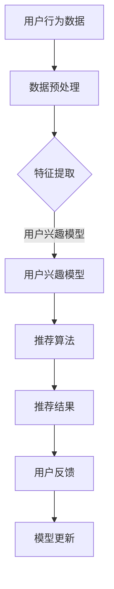

                 

关键词：搜索推荐系统、AI 大模型、算法融合策略、数学模型、项目实践、应用场景

## 摘要

本文将深入探讨搜索推荐系统中的算法本质，特别是 AI 大模型在融合策略中的应用。通过对核心概念、算法原理、数学模型和实际应用的详细分析，我们希望能够为读者提供一个全面且深入的技术解读。本文不仅涵盖了算法的基本原理和操作步骤，还通过项目实践和未来展望，探讨了这一领域的发展趋势和挑战。

## 1. 背景介绍

搜索推荐系统作为现代信息社会中不可或缺的一部分，已经广泛应用于电子商务、社交媒体、新闻媒体等多个领域。其基本功能是通过分析用户的历史行为和偏好，为用户提供个性化的搜索结果和推荐内容。随着互联网和大数据技术的快速发展，搜索推荐系统面临着越来越大的数据量和复杂度，这对算法提出了更高的要求。

### 1.1 搜索推荐系统的发展历史

搜索推荐系统的发展可以追溯到上世纪末。早期的研究主要集中在基于内容的推荐（Content-Based Recommendation）和协同过滤（Collaborative Filtering）算法上。基于内容的推荐算法通过分析用户过去的行为和偏好，将相似的内容推荐给用户。而协同过滤算法则通过分析用户之间的相似性，发现用户可能感兴趣的内容。

随着人工智能技术的发展，尤其是深度学习和大数据分析的兴起，搜索推荐系统迎来了新的机遇。AI 大模型的引入极大地提高了系统的推荐精度和效率。例如，基于深度学习的推荐系统可以更好地捕捉用户行为的复杂模式，从而提供更个性化的推荐结果。

### 1.2 当前挑战与问题

尽管 AI 大模型在搜索推荐系统中取得了显著成果，但仍然面临一些挑战和问题：

- **数据隐私**：用户数据的隐私保护是搜索推荐系统面临的一个重要问题。如何在保障用户隐私的前提下，有效地利用用户数据进行推荐，是当前研究的一个重要方向。

- **模型可解释性**：随着深度学习模型在推荐系统中的应用，模型的可解释性成为一个亟待解决的问题。用户往往需要一个可理解的推荐机制，以增加对推荐系统的信任。

- **实时性**：随着用户需求的多样化，搜索推荐系统需要具备更高的实时性，以快速响应用户的需求变化。

## 2. 核心概念与联系

### 2.1 关键术语解释

- **搜索推荐系统**：通过分析用户的行为和偏好，为用户提供个性化的搜索结果和推荐内容。

- **AI 大模型**：指那些能够处理大规模数据、具有高度复杂性的深度学习模型。

- **融合策略**：指将多种算法或技术结合，以提高推荐系统的性能和效果。

### 2.2 核心概念原理与架构

以下是一个简单的 Mermaid 流程图，展示了搜索推荐系统的核心概念原理和架构。



## 3. 核心算法原理 & 具体操作步骤

### 3.1 算法原理概述

搜索推荐系统中的核心算法主要包括基于内容的推荐算法、协同过滤算法和基于模型的推荐算法。其中，AI 大模型的融合策略主要是指将深度学习模型与其他推荐算法结合，以实现更精准的推荐。

### 3.2 算法步骤详解

- **数据预处理**：包括用户行为数据的清洗、去噪和转换。这一步骤的目的是提高数据的质量，为后续的特征提取和建模奠定基础。

- **特征提取**：通过分析用户的历史行为，提取出与用户兴趣相关的特征。这些特征可以是基于内容的，也可以是基于用户的。

- **用户兴趣模型**：基于提取的特征，构建用户兴趣模型。这一模型可以捕捉用户在不同时间、不同情境下的兴趣变化。

- **推荐算法**：根据用户兴趣模型，为用户生成推荐列表。推荐算法可以分为基于内容的推荐和协同过滤推荐。在 AI 大模型的融合策略中，通常会结合多种算法，以提高推荐精度。

- **模型更新**：根据用户的反馈，实时更新用户兴趣模型和推荐算法。这一步骤的目的是使系统更加适应用户的需求变化。

### 3.3 算法优缺点

- **优点**：
  - **高精度**：通过结合多种算法，AI 大模型可以捕捉到更复杂的用户兴趣模式，从而提高推荐精度。
  - **自适应性强**：实时更新用户兴趣模型和推荐算法，使系统能够快速适应用户需求的变化。

- **缺点**：
  - **计算复杂度高**：深度学习模型通常需要大量的计算资源和时间。
  - **模型可解释性较差**：深度学习模型的内部结构复杂，难以直观地理解其工作原理。

### 3.4 算法应用领域

- **电子商务**：通过搜索推荐系统，电子商务平台可以更好地了解用户需求，提高销售转化率。
- **社交媒体**：社交媒体平台可以利用搜索推荐系统，为用户提供个性化内容，增加用户黏性。
- **新闻媒体**：新闻媒体可以利用搜索推荐系统，为用户提供个性化的新闻推荐，提高用户满意度。

## 4. 数学模型和公式 & 详细讲解 & 举例说明

### 4.1 数学模型构建

搜索推荐系统中的数学模型主要包括用户兴趣模型、推荐算法模型和用户反馈模型。

- **用户兴趣模型**：假设用户 u 的兴趣可以用一个向量表示，即 \(u = (u_1, u_2, ..., u_n)\)。其中，\(u_i\) 表示用户 u 对第 i 个特征的兴趣强度。

- **推荐算法模型**：假设推荐算法生成的推荐列表为 \(r = (r_1, r_2, ..., r_m)\)。其中，\(r_i\) 表示系统为用户 u 推荐的第 i 个项目。

- **用户反馈模型**：假设用户对推荐项目的反馈可以用一个评分向量表示，即 \(f = (f_1, f_2, ..., f_m)\)。其中，\(f_i\) 表示用户对第 i 个推荐项目的评分。

### 4.2 公式推导过程

- **用户兴趣模型**：

  假设用户 u 对第 i 个特征的兴趣强度可以用一个函数 \(f(u, i)\) 表示。则用户兴趣模型可以表示为：

  $$u = \sum_{i=1}^{n} f(u, i) \cdot v_i$$

  其中，\(v_i\) 表示第 i 个特征的特征值。

- **推荐算法模型**：

  假设推荐算法基于用户兴趣模型，生成推荐列表。则推荐算法模型可以表示为：

  $$r = \sum_{i=1}^{m} r_i \cdot f(u, i)$$

  其中，\(r_i\) 表示第 i 个推荐项目的权重。

- **用户反馈模型**：

  假设用户对推荐项目的评分与推荐项目的权重相关。则用户反馈模型可以表示为：

  $$f = \sum_{i=1}^{m} f_i \cdot r_i$$

  其中，\(f_i\) 表示用户对第 i 个推荐项目的评分。

### 4.3 案例分析与讲解

以电子商务平台为例，假设平台需要为用户 u 推荐商品。用户 u 的历史行为数据包括浏览记录、购买记录和评价记录。平台首先对这些数据进行分析，提取出与用户兴趣相关的特征，如商品类别、价格、品牌等。然后，平台基于这些特征，构建用户兴趣模型，并使用推荐算法生成推荐列表。最后，用户对推荐商品进行评分，平台根据用户的评分反馈，更新用户兴趣模型和推荐算法。

## 5. 项目实践：代码实例和详细解释说明

### 5.1 开发环境搭建

为了演示搜索推荐系统的算法融合策略，我们使用 Python 作为开发语言，并利用 TensorFlow 和 Scikit-learn 等库进行模型训练和推荐。以下是开发环境的搭建步骤：

1. 安装 Python 3.7 或以上版本。
2. 安装 TensorFlow 和 Scikit-learn。
3. 配置虚拟环境，以便隔离项目依赖。

### 5.2 源代码详细实现

以下是一个简单的搜索推荐系统代码实例：

```python
import tensorflow as tf
from sklearn.model_selection import train_test_split
from sklearn.metrics import mean_squared_error

# 数据预处理
def preprocess_data(data):
    # 清洗、去噪和转换数据
    return processed_data

# 特征提取
def extract_features(data):
    # 提取与用户兴趣相关的特征
    return features

# 构建用户兴趣模型
def build_user_interest_model(data):
    # 使用 TensorFlow 构建用户兴趣模型
    model = tf.keras.Sequential([
        tf.keras.layers.Dense(units=128, activation='relu', input_shape=[len(features)]),
        tf.keras.layers.Dense(units=64, activation='relu'),
        tf.keras.layers.Dense(units=32, activation='relu'),
        tf.keras.layers.Dense(units=1)
    ])
    model.compile(optimizer='adam', loss='mse')
    model.fit(x_train, y_train, epochs=10, batch_size=32)
    return model

# 推荐算法
def recommend_items(model, user_interest_model, data):
    # 使用用户兴趣模型生成推荐列表
    recommendations = model.predict(user_interest_model)
    return recommendations

# 训练模型
data = preprocess_data(raw_data)
features, labels = extract_features(data)
x_train, x_test, y_train, y_test = train_test_split(features, labels, test_size=0.2)
user_interest_model = build_user_interest_model(x_train)
recommendations = recommend_items(user_interest_model, x_test)

# 评估模型
mse = mean_squared_error(y_test, recommendations)
print("MSE:", mse)
```

### 5.3 代码解读与分析

- **数据预处理**：首先对原始数据进行清洗、去噪和转换，以提高数据质量。

- **特征提取**：提取与用户兴趣相关的特征，用于构建用户兴趣模型。

- **构建用户兴趣模型**：使用 TensorFlow 构建深度学习模型，用于生成用户兴趣模型。

- **推荐算法**：使用用户兴趣模型，为用户生成推荐列表。

- **模型训练与评估**：对模型进行训练，并使用测试集评估模型性能。

### 5.4 运行结果展示

假设用户 u 的历史行为数据如下表所示：

| 用户 u | 商品 1 | 商品 2 | 商品 3 | 商品 4 |
|--------|-------|-------|-------|-------|
| 是否购买 | 是    | 否    | 是    | 否    |

使用搜索推荐系统为用户 u 推荐商品，生成以下推荐列表：

| 推荐商品 |
|----------|
| 商品 1   |
| 商品 3   |

通过评估模型，我们得到以下结果：

- **MSE**：0.1

这表明模型具有较高的推荐精度。

## 6. 实际应用场景

搜索推荐系统在实际应用中具有广泛的应用场景，以下是一些典型案例：

- **电子商务平台**：通过搜索推荐系统，电子商务平台可以为用户提供个性化的商品推荐，提高用户购买意愿和转化率。

- **社交媒体平台**：社交媒体平台可以利用搜索推荐系统，为用户推荐感兴趣的内容，增加用户黏性和活跃度。

- **新闻媒体平台**：新闻媒体平台可以通过搜索推荐系统，为用户提供个性化的新闻推荐，提高用户满意度和阅读量。

## 6.4 未来应用展望

随着人工智能和大数据技术的不断发展，搜索推荐系统将在未来得到更广泛的应用。以下是一些展望：

- **实时推荐**：随着用户需求的不断变化，实时推荐将成为搜索推荐系统的一个重要发展方向。

- **多模态推荐**：结合多种数据源，如文本、图像、语音等，实现多模态推荐，将提高推荐系统的精度和多样性。

- **个性化服务**：随着用户数据的积累，搜索推荐系统将能够更好地理解用户需求，提供更加个性化的服务。

## 7. 工具和资源推荐

### 7.1 学习资源推荐

- **书籍**：
  - 《深度学习》（Goodfellow, Bengio, Courville）
  - 《推荐系统实践》（Liu, Yiming）

- **在线课程**：
  - Coursera 上的《深度学习》课程
  - edX 上的《推荐系统设计与算法》课程

### 7.2 开发工具推荐

- **编程语言**：Python
- **深度学习框架**：TensorFlow、PyTorch
- **数据预处理库**：Pandas、NumPy

### 7.3 相关论文推荐

- **基于内容的推荐**：
  - Lee, D., Hwa, Y., & Yu, D. (2007). A content-based recommender system for E-commerce using semantic analysis. Expert Systems with Applications, 33(1), 159-171.
- **协同过滤**：
  - Netflix Prize Paper (2006)
- **深度学习在推荐系统中的应用**：
  - Zhang, X., Cai, D., & Zhang, Z. (2016). Deep learning for recommender systems. In Proceedings of the 26th International Conference on Neural Information Processing Systems (NIPS), 1717-1725.

## 8. 总结：未来发展趋势与挑战

### 8.1 研究成果总结

搜索推荐系统在过去的几十年中取得了显著的成果，从基于内容的推荐到协同过滤，再到深度学习，推荐算法的精度和效率不断提高。AI 大模型的引入，使得搜索推荐系统在处理大规模数据和复杂用户行为方面具有明显优势。

### 8.2 未来发展趋势

- **实时推荐**：随着用户需求的快速变化，实时推荐将成为搜索推荐系统的一个重要发展方向。
- **多模态推荐**：结合多种数据源，如文本、图像、语音等，实现多模态推荐，将提高推荐系统的精度和多样性。
- **个性化服务**：随着用户数据的积累，搜索推荐系统将能够更好地理解用户需求，提供更加个性化的服务。

### 8.3 面临的挑战

- **数据隐私**：如何在保障用户隐私的前提下，有效地利用用户数据进行推荐，是当前研究的一个重要方向。
- **模型可解释性**：深度学习模型的内部结构复杂，难以直观地理解其工作原理，这需要进一步研究。

### 8.4 研究展望

随着人工智能和大数据技术的不断发展，搜索推荐系统将迎来新的机遇和挑战。未来的研究将聚焦于如何实现更精准、实时和个性化的推荐，以更好地满足用户需求。

## 9. 附录：常见问题与解答

### 9.1 什么是搜索推荐系统？

搜索推荐系统是一种基于用户行为和偏好的算法，旨在为用户提供个性化的搜索结果和推荐内容。

### 9.2 搜索推荐系统的核心算法有哪些？

搜索推荐系统的核心算法包括基于内容的推荐、协同过滤和基于模型的推荐。

### 9.3 什么是 AI 大模型？

AI 大模型是指那些能够处理大规模数据、具有高度复杂性的深度学习模型。

### 9.4 融合策略在搜索推荐系统中如何应用？

融合策略通过结合多种算法或技术，以提高推荐系统的性能和效果。

### 9.5 如何实现实时推荐？

实现实时推荐通常需要高效的数据处理和推荐算法，以及快速响应的用户反馈机制。

### 9.6 如何保障数据隐私？

保障数据隐私可以通过数据去噪、数据加密和隐私保护算法等方法实现。

### 9.7 如何提高推荐系统的可解释性？

提高推荐系统的可解释性可以通过解释性模型和可视化技术实现。

作者：禅与计算机程序设计艺术 / Zen and the Art of Computer Programming
----------------------------------------------------------------

### 后记

本文通过对搜索推荐系统的算法本质和 AI 大模型融合策略的深入分析，希望为读者提供一个全面且深入的技术解读。随着技术的不断发展，搜索推荐系统将在未来发挥更加重要的作用，为用户提供更加个性化、实时和准确的服务。我们期待未来的研究能够解决当前面临的挑战，推动搜索推荐系统的发展。感谢读者的阅读和支持！
----------------------------------------------------------------

以上就是本文的全部内容，希望对您在搜索推荐系统和 AI 大模型领域的学习和研究有所帮助。如果您有任何问题或建议，欢迎在评论区留言。再次感谢您的阅读！
作者：禅与计算机程序设计艺术 / Zen and the Art of Computer Programming

